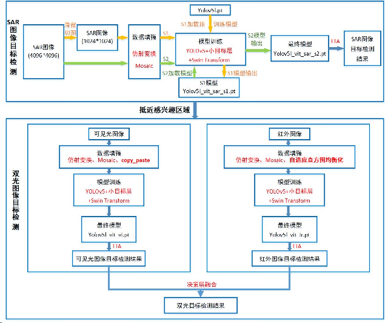
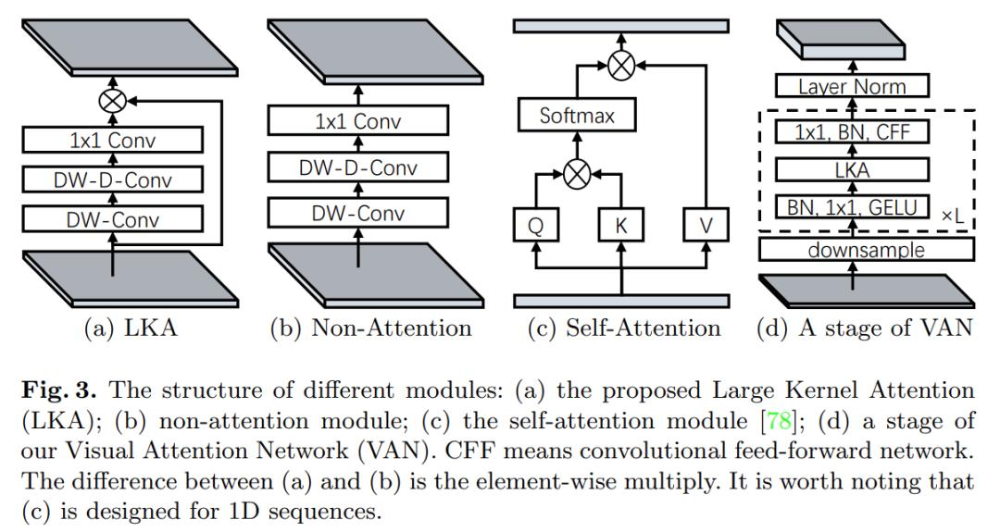

2023.10第四届空天杯全国创新创意大赛TOP3        
2023.08全国大数据与计算智能挑战赛基于亚米级影像的精细化目标检测TOP3       
2023.05百度网盘AI版式分析比赛TOP3       
2023.11百度网盘AI祛法令纹大赛荣获三等奖。          
2022.12华为开发者大赛“云上先锋”-EI赛道。TOP4/2830，荣获三等奖。            

再次感慨，检测水太深，各种目标类型，任务，量化，部署，大模型，多模态，刷指标    
拿奖太容易          
回头望，感慨自己，感慨别人，感慨古人     

# 第四届空天杯全国创新创意大赛地面时敏目标检测
基于YOLOv5和Swin Transformer的
多模态地面时敏目标检测    

背景：城市工业区   
传感器：SAR、可见光、红外传感器    
背景干扰：集装箱房、树木遮挡等     

     
      

       
     

       
      

        
        

## 具体修改方法
尝试mmyolo，ppyolo，回归yolo      
参考csdn付费文章做简单修改    
包括yaml，以及yolo.py内部修改以支持新的小结构小函数等      

## 总结
对yolo框架有了较深的理解，从这时开始理解何谓下采样，以及yaml文件中指示的意义    
了解了anchor这种机制存在及简单作用     

没有tool留下，主要是读取数据时图片后缀改一改     
大多时候还是试模型，调超参    

# 全国大数据与计算智能挑战赛基于亚米级影像的精细化目标检测

      

精细化检测识别任务的类间差异更小，其目的是定位并识别出常规目标中的子类。该任务对于目标检测识别的要求更高，难度更大，同时具有真实场景下广泛的应用价值。

大规模高精度的人工标注往往需要巨大的成本，且不可避免会出现一些标注错误，为了模拟这种现实情况，本任务对初赛和复赛的训练标签进行了不同比例的污染。

其中训练集、测试集包含98类精细化目标，参考数据包含39类粗粒度目标。

初赛训练集：总目标数101054小目标个数56634。补充数据集：总目标数133860小目标个数83346

30像素以下的小目标数量占一半以上，训练数据存在长尾现象，数据集中类别严重失衡，最大类别失衡比≈3000:1

       

模型框架选择——RoI Transformer      
由于鸟瞰视角、高度复杂的背景以及物体的不同外观，航空图像中的物体检测是计算机视觉中一项活跃但具有挑战性的任务。特别是在检测航拍图像中密集的物体时，常规目标检测中的水平proposals（RoIs）与目标之间的不匹配将进一步影响分类和定位。这导致最终对象分类置信度和定位精度之间普遍存在偏差。        
       
RoI Transformer 的核心思想是在 RoI 上应用空间变换，并在定向边界框（OBB）注释的监督下学习变换参数。 RoI Transformer 重量轻，可以轻松嵌入到探测器中进行定向物体检测。？？？？？？    
RoI Transformer 是一个三阶段检测模型，主要由RRoI Leaner和RRoI Wraping两部分组成，核心思想是把RPN输出的水平锚框HRoI转换为旋转锚框RRoI。此策略无需增加锚点的数量且可以获得精确的RRoI。       

Backbone选择 —— Swin-Transformer Large    
数据集具有小目标数量多，目标尺度变化剧烈，目标长宽比分布范围广的特点。而Swin Transformer —— 适用于尺度多变等复杂场景；       
backbone使用了swin transformer large作为特征提取骨干网络,因为swin transformer在计算机视觉任务中表现优秀,可以提取有代表性的特征。     
      

Neck选择 —— PANet

多尺度检测任务中尤其是小目标检测中，特征金字塔网络FPN是必备的一个结构，浅深层特征信息融合能够有效提升遥感检测的性能表现（其实就是分治的思想，浅的特征层适合检测小尺度目标）。      
PANet在FPN自深向浅融合的基础上增添了一个自浅向深的融合路径，可以提高浅层信息在深层网络中的流动效率。      
为了增强特征的表达能力,用 pafpn作为特征融合层,可以更好地整合不同尺度的特征信息。       
      
？？？？？         
PAFPN主要由三个组成部分组成：FPN、级联注意力机制和线性回归层。

PAFPN的特点是引入了一种级联注意力机制，可以融合不同层次的特征图，从而提高目标检测的精度。同时，PAFPN还采用了特征金字塔网络（FPN），可以在不同尺度下提取特征，从而更好地适应各种目标的尺度变化。

训练10个epoch。仅使用补充数据集训练。    
训练12个epoch。冻结backbone的全部stage，在原始训练集微调。此时训练集是全量训练集，不做验证集划分。  
       
推理方法：TTA推理(测试时增强)test time augmentation

参数设置
test_cfg=dict(
        rpn=dict(
            nms_pre=2000,
            max_per_img=2000,
            nms=dict(type='nms', iou_threshold=0.7),
            min_bbox_size=0),
        rcnn=dict(
            nms_pre=2000,
            min_bbox_size=0,
            score_thr=0.001,
            nms=dict(type='nms_rotated', iou_threshold=0.2),
            max_per_img=2000)))

TTA参数设置
Resize img_scales = [(1024, 1024),(928,928),(1120,1120),(1344,1344),(1600,1600),(640,640)]
dict(type='mmdet.RandomFlip', prob=1.),
dict(type='mmdet.RandomFlip', prob=0.)

1.在补充集上增加训练轮次。      
2.针对长尾问题提出解决方案，选择合适的rcnn置信度，降低检测框冗余率。     
3.将backbone更换成提取特征能力更强的网络或者增加参数量（使用swin transformer huge）。     
4.增加消融实验，更加明确哪些模块在起作用。   
5.采取半监督方法训练。把部分污染严重的标签当成无标记数据，重新制成伪标签加入训练。    

## 具体修改方法
参照mmrotate      
然后又有大佬开源自己的配置文件和数据处理，得以迅速进入正题     

## 总结 
这个比赛主要就是数据污染和两阶段训练方法正确   
然后是某企有钱无机器，搞得很麻烦      
但是借此机会接触了国产桌面显卡曙光       

# 百度网盘AI版式分析比赛
多标签分类的目标检测问题，参赛者需要将不同风格样式的文字框选出来，并判断框选出来的文字实例具体包含哪些样式。其中，比赛的样式包含7种——红色、绿色、蓝色、加粗、斜体、删除线、下划线，需要注意的是，文字并非仅包含一种样式，有的文字图像可能既是蓝色，又是斜体。     
比赛难点如下：      
1）文字检测框并非矩形框，而是任意八点四边形。参赛者可以采用旋转矩形框、语义分割方法或热图方法获得更加精确的坐标结果。       
2）文字的分类是多标签分类问题，而非多分类问题，由于风格样式和文字内容的多样性，对网络的泛化能力有一定要求。通过组合，可以强行将其看成 64 类分类问题。

 PP-YOLOE+ l 网络检测和进行多标签分类   
 通过0101001二进制编码为十进制数字。   
分成128类可能会导致长尾问题，我们的loss采用varifocal_loss来应对     
总迭代周期: 130 epoch, 所有训练均在 4* V100 32G GPU进行，训练时长约1个小时。  

# 百度网盘AI祛法令纹大赛荣获三等奖
数据集是基于StyleGAN v2生成的仿真人脸数据，在此基础上生成了法令纹瑕疵    
训练集共6000个样本，A榜测试集共2000个样本，B榜测试集共2000个样本；        
图片输入尺寸均为1024×1024，属于高清的人脸图像     
图像复原领域常用架构示意图，包含多阶段架构、多尺度融合架构以及UNet架构。为减少块间(inter-block)复杂度，NAFNet 采用了带跳过连接的UNet架构。       
     
网络主干继承于NAFNet，为了减少推理时间，做了如下调整：      
-- Nonlinear Activation Free Network  

1. 网络结构变动： 

 * 网络第一层只采用一次 3x3 卷积提高通道
 
 * 每层做通道放缩，网络第一层通过3x3卷积将通道由3扩大至width=12，最后一层再缩小至原始图片通道数3， 模型大小3.1m

在编码器的3个阶段使用性能更好的LKABlock，设置为[1, 3, 4, 0]，而在解码器阶段使用相对简单的NAFBlock，设置为[1, 1, 1, 0]。

2. 引入 LKA - 大核卷积注意力机制

LKA大核注意力模块包含大感受野和1x1点卷积提取局部信息的优势
由于通道数的下降和middle_blk的取消， 模型的视野阈会受到影响， 选择 VAN 网络的 LKA 结构来缓解影响，验证可得选择LKA结构，模型收敛速度较原始nafnet网络的收敛速度能进一步提高。

解码器是attention + mlp结构

3. 使用 Layernorm2D 而非 BatchNorm，对特征图每一层计算均值和方差

     

训练配置  
learning_rate: 0.001  total_iters: 20000       
learning_rate: 0.001   total_iters: 62500      
learning_rate: 0.0001 total_iters: 8000      

现在一种全新Backbone—— VAN（Visiual Attention Network, 视觉注意力网络）再次引起学界关注。     
因为新模型再一次 刷榜三大视觉任务，把上面那两位又都给比下去了。  

VAN号称同时吸收了CNN和ViT的优势且简单高效，精度更高的同时参数量和计算量还更小。
大内核注意力（LKA）模块的视觉注意力网络（VAN）已被证明在一系列基于视觉的任务中具有超越视觉转换器（ViT）的卓越性能。然而，随着卷积核大小的增加，这些 LKA 模块中的深度卷积层会导致计算和内存占用的二次方增加。为了缓解这些问题，并在 VAN 的注意力模块中使用超大卷积核，我们提出了大型可分离核注意力模块系列，称为 LSKA。  
    
  
在图像分类、物体检测和语义分割方面，带有 LKA 的 VAN 已被证明优于最先进的 ViT 和 CNN。然而，大规模深度卷积核的设计仍然会产生高计算量和内存占用，随着核大小的增加，模型的有效性也会降低。当核大小达到 35 × 35 和 53 × 53 时，在 VAN 的 LKA 模块中设计深度卷积（不使用深度扩张卷积）的计算效率很低。  
为了提高计算效率，LKA 采用了带深度卷积（DW-D-Conv）的扩张卷积，以获得更大的 ERFs。  
在图像分类、物体检测和语义分割方面，VAN 甚至比 PVT-V2、Swin Transformer 和 Twins-SVT 等一系列变压器网络取得了更好的性能。   
注意机制用于选择图像中最重要的区域。一般来说，可分为四类：空间注意 ；通道注意；时间注意 和分支注意 。在此，我们更关注通道注意和空间注意，因为它们与我们的工作更为相关。通道注意力侧重于特定模型层的 "什么 "语义属性。由于特征图的每个通道都是一个检测器（也称为滤波器）的响应图，通道注意力机制允许模型将注意力集中在各通道中物体的特定属性上。与通道注意力不同，空间注意力关注的是模型应该关注的语义相关区域的 “位置”。   

# 华为开发者大赛“云上先锋”-EI赛道
遥感图像分类问题，几千张，二十几个类         
用resnet即可   

# 百度-百万开源数据训练中文sd1.5
没有tool留下，主要是图片和文本对下载，parquet高保真文本方式保存图片在本地转成图片，数据集就几百g。然后是对标签处理成diffusers输入格式，     
数据分块，然后并行base64-img           
clip筛数据      
就是用diffusers范例脚本跑了一边数据，改超参       
线上估计就是评个fid和clip_score      
来源于太乙，然后精筛数据，但是工业界学术界还是走最前沿，中文没太大意义     

# 结尾
这些比赛都很难留下一些tool     
首先自己当时很熟，一步步走过来，再就是每个域差异太大，而且对于后续学术或工业工作没有利用价值，可用范围小。然后不是那么无聊,当初就是感觉有意义，日行千里，包括实习期间也是。tool用不到，没必要形成tool       
甚至于现在的简单提交就获奖/训练就获奖的比赛都还没有实习收益大      
