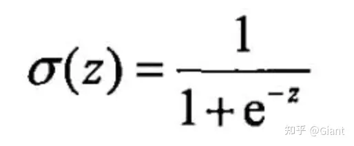

# 计算

## conv计算
输出大小  
    
    

计算公式  
torch.nn.Conv2d   
$$
\text{out}(N_i, C_{\text{out}_j}) = \text{bias}(C_{\text{out}_j}) +
\sum_{k = 0}^{C_{\text{in}} - 1} \text{weight}(C_{\text{out}_j}, k) \star \text{input}(N_i, k)
$$


where $`\star`$ is the valid 2D `cross-correlation`_ operator,  
    $ `N` $ is a batch size,   
    $`C`$ denotes a number of channels,   
    $`H` $ is a height of input planes in pixels,   
    and $`W`$ is
    width in pixels.
$$

              H_{out} = \left\lfloor\frac{H_{in}  + 2 \times \text{padding}[0] - \text{dilation}[0]
                        \times (\text{kernel\_size}[0] - 1) - 1}{\text{stride}[0]} + 1\right\rfloor
$$
$$

              W_{out} = \left\lfloor\frac{W_{in}  + 2 \times \text{padding}[1] - \text{dilation}[1]
                        \times (\text{kernel\_size}[1] - 1) - 1}{\text{stride}[1]} + 1\right\rfloor
$$
Attributes:  

weight (Tensor): the learnable weights of the module of shape
            $$`(\text{out\_channels}, \frac{\text{in\_channels}}{\text{groups}},`
            `\text{kernel\_size[0]}, \text{kernel\_size[1]})`.$$
            The values of these weights are sampled from
            $$`\mathcal{U}(-\sqrt{k}, \sqrt{k})` $$where
            $$`k = \frac{groups}{C_\text{in} * \prod_{i=0}^{1}\text{kernel\_size}[i]}`$$
        bias (Tensor):   the learnable bias of the module of shape
            (out_channels). If :attr:`bias` is ``True``,
            then the values of these weights are
            sampled from $$`\mathcal{U}(-\sqrt{k}, \sqrt{k})` $$where
           $$`k = \frac{groups}{C_\text{in} * \prod_{i=0}^{1}\text{kernel\_size}[i]}`$$

dilation = 2  
   


## GroupNorm
$$ y = \frac{x - \mathrm{E}[x]}{ \sqrt{\mathrm{Var}[x] + \epsilon}} * \gamma + \beta $$   


## SiLU
 优点：计算速度比ReLU函数更快，因为它只涉及一个sigmoid函数的计算；Silu函数在接近0时的导数接近1，能够保留更多的信息。

Silu的缺点：Silu函数在接近正无穷和负无穷时的导数接近0，可能导致梯度消失问题；Silu函数的值域在(0,1)之间，可能会导致信息的损失。
  
$$  \text{silu}(x) = x * \sigma(x), \text{where } \sigma(x) \text{ is the logistic sigmoid.} $$  
  
SiLU是Sigmoid和ReLU的改进版。SiLU具备无上界有下界、平滑、非单调的特性。SiLU在深层模型上的效果优于 ReLU。可以看做是平滑的ReLU激活函数。

SiLU（Sigmoid Linear Unit）激活函数也被称为 Swish 激活函数，它是 Google Brain 在 2017 年引入的一种自适应激活函数。

Swish 函数的定义如下：
f(x) = x * sigmoid(x)


## pad
Padding size:
The padding size by which to pad some dimensions of :attr:`input`
    are described starting from the last dimension and moving forward.
    $$`\left\lfloor\frac{\text{len(pad)}}{2}\right\rfloor`$$ dimensions
    of ``input`` will be padded.
    For example,   
    to pad only the last dimension of the input tensor, then
    :attr:`pad` has the form
    :$$ :`(\text{padding\_left}, \text{padding\_right})` $$;
    to pad the last 2 dimensions of the input tensor, then use
    :$$:`(\text{padding\_left}, \text{padding\_right},`
    :`\text{padding\_top}, \text{padding\_bottom})`$$;
    to pad the last 3 dimensions, use
    :$$:`(\text{padding\_left}, \text{padding\_right},`
    ::`\text{padding\_top}, \text{padding\_bottom}`
    ::`\text{padding\_front}, \text{padding\_back})`.$$
pad (tuple): m-elements tuple, where
        :$$:`\frac{m}{2} \leq`  input dimensions $$and :$:`m`$ is even.  
从后往前，两个一组  
Examples::

    >>> t4d = torch.empty(3, 3, 4, 2)
    >>> p1d = (1, 1) # pad last dim by 1 on each side
    >>> out = F.pad(t4d, p1d, "constant", 0)  # effectively zero padding
    >>> print(out.size())
    torch.Size([3, 3, 4, 4])
    >>> p2d = (1, 1, 2, 2) # pad last dim by (1, 1) and 2nd to last by (2, 2)
    >>> out = F.pad(t4d, p2d, "constant", 0)
    >>> print(out.size())
    torch.Size([3, 3, 8, 4])
    >>> t4d = torch.empty(3, 3, 4, 2)
    >>> p3d = (0, 1, 2, 1, 3, 3) # pad by (0, 1), (2, 1), and (3, 3)
    >>> out = F.pad(t4d, p3d, "constant", 0)
    >>> print(out.size())
    torch.Size([3, 9, 7, 3])


## GeGLU 
is an activation function which is a variant of GLU. The definition is as follows:  
$\text{GeGLU}\left(x, W, V, b, c\right) = \text{GELU}\left(xW + b\right) \otimes \left(xV + c\right)$  
GLU: Gated Linear Unit   
GLU通过门控机制对输出进行把控，像Attention一样可看作是对重要特征的选择。其优势是不仅具有通用激活函数的非线性，而且反向传播梯度时具有线性通道，类似ResNet残差网络中的加和操作传递梯度，能够缓解梯度消失问题。    
A [variant](https://arxiv.org/abs/2002.05202) of the gated linear unit activation function.   
```
hidden_states, gate = self.proj(hidden_states, *args).chunk(2, dim=-1)
        return hidden_states * self.gelu(gate)
分别赋值给hidden_states和gate。这在很多门控循环神经网络（Gated Recurrent Neural Networks，如LSTM和GRU）中是常见的操作，其中门控机制用于控制信息的流动。
```

### GELU 高斯误差线性单元
优点：  
似乎是 NLP 领域的当前最佳；尤其在 Transformer 模型中表现最好  
能避免梯度消失问题。

优点：激活函数的值域在整个实数范围内，避免了sigmoid函数在极端值处的梯度消失问题； 激活函数的导数在大部分区间内都为非零值，避免了ReLU函数在负数区间内的梯度为0问题；Gelu函数在接近0时的导数接近1，能够保留更多的信息。

缺点：Gelu函数的计算比ReLU函数复杂，计算速度较慢；Gelu函数在负数区间内仍然存在梯度消失问题。


激活函数GELU的灵感来源于 relu 和 dropout，在激活中引入了随机正则的思想。gelu通过输入自身的概率分布情况，决定抛弃还是保留当前的神经元。  
  
   
可以理解为，对于输入的值，根据它的情况乘上 1 或 0。更「数学」一点的描述是，对于每一个输入 x，其服从于标准正态分布 N(0, 1)，它会乘上一个伯努利分布 Bernoulli(Φ(x))，其中Φ(x) = P(X ≤ x)。  
随着 x 的降低，它被归零的概率会升高。对于 ReLU 来说，这个界限就是 0，输入少于零就会被归零。这一类激活函数，不仅保留了概率性，同时也保留了对输入的依赖性。  

gelu在最近的Transformer模型中（包括BERT，RoBertA和GPT2等）得到了广泛的应用。

    

## sigmoid
主要优点：  
函数的映射范围是 0 到 1，对每个神经元的输出进行了归一化  
梯度平滑，避免「跳跃」的输出值  
函数是可微的，意味着可以找到任意两个点的   sigmoid 曲线的斜率  
预测结果明确，即非常接近 1 或 0  

缺点：  
倾向于梯度消失  
函数输出不是以 0 为中心的，会降低权重更新的效率  
Sigmoid 函数执行指数运算，计算机运行得较慢 

sigmoid 是最基础的激活函数，可以将任意数值转换为概率（缩放到0～1之间）.在分类等场景中有广泛的应用。  
  
  
 

## Tanh 双曲正切激活函数
相比sigmoid，tanh的优势在于：  
tanh 的输出间隔为 1，并且整个函数以 0 为中心，比 sigmoid 函数更好  
在负输入将被强映射为负，而零输入被映射为接近零。  

缺点：  
当输入较大或较小时，输出几乎是平滑的并且梯度较小，这不利于权重更新


激活函数Tanh和sigmoid类似，都是 S 形曲线，输出范围是[-1, 1]。  
在一般的二元分类问题中，tanh 函数常用于隐藏层，sigmoid 用于输出层，但这并不是固定的，需要根据特定问题进行调整。   
  
    

## ReLU 整流线性单元
相比sigmoid和tanh，它具有以下优点：  
当输入为正时，不存在梯度饱和问题  
计算复杂度低。ReLU 函数只存在线性关系，一个阈值就可以得到激活值  
单侧抑制，可以对神经元进行筛选，让模型训练更加鲁棒  

当然它也存在缺点：  
dead relu 问题（神经元坏死现象）。relu在训练的时很“脆弱”。在x<0时，梯度为0，这个神经元及之后的神经元梯度永远为0，不再对任何数据有所响应，导致相应参数永远不会被更新  
解决方法：采用Xavier初始化方法，以及避免将learning rate设置太大或使用adagrad等自动调节learning rate的算法。  
输出不是 0 均值    

  
Relu也是深度学习中非常流行的激活函数，近两年大火的Transformer模块由Attention和前馈神经网络FFN组成，其中FFN(即全连接)又有两层，第一层的激活函数就是ReLU，第二层是一个线性激活函数。    


## AdamW
AdamW优化器修正了Adam中权重衰减的bug    
AdamW与Adam对比，主要是修改了权重衰减计算的方式，一上来直接修改了 
theta_t ，而不是把权重衰减放到梯度里，由梯度更新间接缩小 theta_t   


## Adam
  

$$
\begin{aligned}
            &\rule{110mm}{0.4pt}                                                                 \\
            &\textbf{input}      : \gamma \text{(lr)}, \: \beta_1, \beta_2
                \text{(betas)}, \: \theta_0 \text{(params)}, \: f(\theta) \text{(objective)},
                \: \epsilon \text{ (epsilon)}                                                    \\
            &\hspace{13mm}      \lambda \text{(weight decay)},  \: \textit{amsgrad},
                \: \textit{maximize}                                                             \\
            &\textbf{initialize} : m_0 \leftarrow 0 \text{ (first moment)}, v_0 \leftarrow 0
                \text{ ( second moment)}, \: \widehat{v_0}^{max}\leftarrow 0              \\[-1.ex]
            &\rule{110mm}{0.4pt}                                                                 \\
            &\textbf{for} \: t=1 \: \textbf{to} \: \ldots \: \textbf{do}                         \\

            &\hspace{5mm}\textbf{if} \: \textit{maximize}:                                       \\
            &\hspace{10mm}g_t           \leftarrow   -\nabla_{\theta} f_t (\theta_{t-1})          \\
            &\hspace{5mm}\textbf{else}                                                           \\
            &\hspace{10mm}g_t           \leftarrow   \nabla_{\theta} f_t (\theta_{t-1})           \\
            &\hspace{5mm} \theta_t \leftarrow \theta_{t-1} - \gamma \lambda \theta_{t-1}         \\
            &\hspace{5mm}m_t           \leftarrow   \beta_1 m_{t-1} + (1 - \beta_1) g_t          \\
            &\hspace{5mm}v_t           \leftarrow   \beta_2 v_{t-1} + (1-\beta_2) g^2_t          \\
            &\hspace{5mm}\widehat{m_t} \leftarrow   m_t/\big(1-\beta_1^t \big)                   \\
            &\hspace{5mm}\widehat{v_t} \leftarrow   v_t/\big(1-\beta_2^t \big)                   \\
            &\hspace{5mm}\textbf{if} \: amsgrad                                                  \\
            &\hspace{10mm}\widehat{v_t}^{max} \leftarrow \mathrm{max}(\widehat{v_t}^{max},
                \widehat{v_t})                                                                   \\
            &\hspace{10mm}\theta_t \leftarrow \theta_t - \gamma \widehat{m_t}/
                \big(\sqrt{\widehat{v_t}^{max}} + \epsilon \big)                                 \\
            &\hspace{5mm}\textbf{else}                                                           \\
            &\hspace{10mm}\theta_t \leftarrow \theta_t - \gamma \widehat{m_t}/
                \big(\sqrt{\widehat{v_t}} + \epsilon \big)                                       \\
            &\rule{110mm}{0.4pt}                                                          \\[-1.ex]
            &\bf{return} \:  \theta_t                                                     \\[-1.ex]
            &\rule{110mm}{0.4pt}                                                          \\[-1.ex]
       \end{aligned}

$$


## 交叉熵损失函数
   


## PNSR（Peak Signal-to-Noise Ratio峰值信噪比）
    

MAX表示像素值的最大可能取值（例如，对于8位图像，MAX为255），MSE是原始图像与重建图像之间的均方误差。   
是一种常用于衡量图像或视频质量的指标。它用于比较原始图像与经过处理或压缩后的图像之间的差异   
PSNR通过计算原始图像与重建图像之间的均方误差（Mean Squared Error，MSE）来量化它们之间的差异。    
PSNR的值越高，表示图像的质量与原始图像的相似度越高。常见的PSNR范围通常在20到50之间，数值越高表示图像质量越好。然而，PSNR作为一种图像质量评估指标也有其局限性。

它主要关注均方误差，忽略了人眼对于不同频率成分的敏感度差异以及感知失真的影响。因此，在某些情况下，PSNR可能不能准确地反映人类感知到的图像质量差异。   
了PSNR，还有其他更全面和准确的图像质量评估指标，例如结构相似性指标（Structural Similarity Index，SSIM）、感知质量评估指标（Perceptual Quality Assessment，如VIF、MSSSIM）等，这些指标综合考虑了人眼感知和图像结构信息，能够提供更全面的图像质量评估。   

意义：  
PSNR接近 50dB ，代表压缩后的图像仅有些许非常小的误差。  
PSNR大于 30dB ，人眼很难查觉压缩后和原始影像的差异。  
PSNR介于 20dB 到 30dB 之间，人眼就可以察觉出图像的差异。  
PSNR介于 10dB 到 20dB 之间，人眼还是可以用肉眼看出这个图像原始的结构，且直观上会判断两张图像不存在很大的差异。   
PSNR低于 10dB，人类很难用肉眼去判断两个图像是否为相同，一个图像是否为另一个图像的压缩结果。  


## MSSSIM（Multi-Scale Structural Similarity Index）
   
是一种用于评估图像质量的指标，它是结构相似性指数（SSIM）在多个尺度上的扩展。   
SSIM是一种衡量两幅图像相似性的指标，它考虑了图像的**亮度、对比度和结构**等方面。而MS-SSIM在SSIM的基础上引入了多个尺度，以更好地捕捉图像的细节信息。    
具体而言，MS-SSIM的计算过程如下：

将原始图像和重建图像划分为不同尺度的子图像。

对每个尺度的子图像计算SSIM指数。

对每个尺度的SSIM指数进行加权平均，得到最终的MS-SSIM值。   

MS-SSIM的值范围在0到1之间，数值越接近1表示重建图像与原始图像的相似度越高，图像质量越好。

相比于PSNR，MS-SSIM考虑了图像的结构信息，能够更好地反映人眼对图像质量的感知。它在评估图像质量方面具有更高的准确性和敏感性。

需要注意的是，MS-SSIM计算复杂度相对较高，因为它需要对图像进行多尺度的分解和计算。然而，由于其良好的性能，在图像压缩、图像处理等领域得到广泛应用，并且被认为是一种较为可靠的图像质量评估指标。  

```python
import cv2
import numpy as np
 
def ms_ssim(img1, img2):
    # 转换为灰度图像
    img1 = cv2.cvtColor(img1, cv2.COLOR_BGR2GRAY)
    img2 = cv2.cvtColor(img2, cv2.COLOR_BGR2GRAY)
    
    # 计算MS-SSIM
    weights = np.array([0.0448, 0.2856, 0.3001, 0.2363, 0.1333])  # 不同尺度的权重
    levels = weights.size
    
    mssim = np.zeros(levels)
    mcs = np.zeros(levels)
    
    for i in range(levels):
        ssim_map, cs_map = ssim(img1, img2)
        mssim[i] = np.mean(ssim_map)
        mcs[i] = np.mean(cs_map)
        
        img1 = cv2.resize(img1, (img1.shape[1] // 2, img1.shape[0] // 2), interpolation=cv2.INTER_LINEAR)
        img2 = cv2.resize(img2, (img2.shape[1] // 2, img2.shape[0] // 2), interpolation=cv2.INTER_LINEAR)
    
    # 整体MS-SSIM计算
    overall_mssim = np.prod(mcs[:-1] ** weights[:-1]) * (mssim[-1] ** weights[-1])
    
    return overall_mssim
 
def ssim(img1, img2, k1=0.01, k2=0.03, win_size=11, L=255):
    C1 = (k1 * L) ** 2
    C2 = (k2 * L) ** 2
    
    # 计算均值和方差
    mu1 = cv2.GaussianBlur(img1, (win_size, win_size), 1.5)
    mu2 = cv2.GaussianBlur(img2, (win_size, win_size), 1.5)
    
    mu1_sq = mu1 ** 2
    mu2_sq = mu2 ** 2
    mu1_mu2 = mu1 * mu2
    
    sigma1_sq = cv2.GaussianBlur(img1 * img1, (win_size, win_size), 1.5) - mu1_sq
    sigma2_sq = cv2.GaussianBlur(img2 * img2, (win_size, win_size), 1.5) - mu2_sq
    sigma12 = cv2.GaussianBlur(img1 * img2, (win_size, win_size), 1.5) - mu1_mu2
    
    # 计算相似性度量
    ssim_map = ((2 * mu1_mu2 + C1) * (2 * sigma12 + C2)) / ((mu1_sq + mu2_sq + C1) * (sigma1_sq + sigma2_sq + C2))
    cs_map = (2 * sigma12 + C2) / (sigma1_sq + sigma2_sq + C2)
    
    return ssim_map, cs_map
 
# 读取图像
img1 = cv2.imread('image1.jpg')
img2 = cv2.imread('image2.jpg')
 
# 计算MS-SSIM
ms_ssim_score = ms_ssim(img1, img2)
print("MS-SSIM score:", ms_ssim_score)
```

评价加权分数一般采用  
   

## LPIPS (Learned Perceptual Image Patch Similarity）
可学习感知图像块相似度(Learned Perceptual Image Patch Similarity, LPIPS)也称为“感知损失”(perceptual loss)   
是一种基于学习的感知图像补丁相似性指标，用于评估图像的感知质量。

具体而言，LPIPS的计算过程如下：

使用预训练的CNN模型（通常是基于深度学习的图像分类模型）提取原始图像和重建图像的特征表示。

将提取的特征表示作为输入，通过一个距离度量函数计算图像之间的相似性得分。

相似性得分表示图像之间在感知上的差异，数值越小表示图像之间的感知差异越小，图像质量越好。

LPIPS的得分范围通常是0到1之间，数值越小表示图像的感知质量越高。  
与传统的图像质量评估指标（如PSNR和SSIM）相比，LPIPS更加注重于人眼感知的因素，能够更好地捕捉到图像之间的感知差异。它在图像生成、图像编辑等任务中被广泛应用，特别适用于需要考虑感知质量的场景。  
需要注意的是，LPIPS是一种基于学习的指标，它的性能受到所使用的CNN模型和训练数据的影响。因此，在使用LPIPS进行图像质量评估时，**需要使用与训练模型相似的数据集和预训练模型**，以保证评估结果的准确性和可靠性。    

LPIPS的设计灵感来自于人眼对图像的感知，它通过学习一个神经网络模型来近似人类感知的视觉相似性。该模型使用卷积神经网络（CNN）对图像的局部补丁进行特征提取，并计算补丁之间的相似性得分。   
LPIPS 比传统方法（比如L2/PSNR, SSIM, FSIM）更符合人类的感知情况。LPIPS的值越低表示两张图像越相似，反之，则差异越大。    
   
将左右的两个图像块和中间的图像块进行比较：  
如图表示，每一组有三张图片，由传统的评价标准如L2、SSIM、PSNR等评价结果和人体认为的大不相同，这是传统方法的弊端。如果图片平滑，那么传统的评价方式则大概率会失效。      
而目前GAN尤其是VAE等生成模型生成结果都过于平滑。 而最后三行的评价为深度学习的方式，可以看到，通过神经网络（非监督、自监督、监督模型）提取特征的方式，并对特征差异进行计算能够有效进行评价，而且能够和人体评价相似。   


PSNR主要用于衡量图像的重建误差，而MS-SSIM和LPIPS更加关注人眼对图像感知的差异。在实际应用中，不同的指标可以结合使用，以综合评估图像质量。  

## rFID  
(Fréchet Inception Distance)   
计算Frechet distance between 2 Gaussians (训练好的图片分类的模型的CNN去除 真实和生成的respresentations，计算距离)  
需要大量样本一次性计算  
  
- 从真实图像和生成图像中分别抽取n个随机子样本，并通过Inception-v3网络获得它们的特征向量。
- 计算真实图像子样本的特征向量的平均值mu1和协方差矩阵sigma1，以及生成图像子样本的特征向量的平均值mu2和协方差矩阵sigma2。
- 计算mu1和mu2之间的欧几里德距离d^2，以及sigma1和sigma2的平方根的Frobenius范数||sigma1^(1/2)*sigma2^(1/2)||_F。  
  -    
     
  - 欧几里德距离 d = sqrt((x1-x2)^+(y1-y2)^)
  - Frobenius norm（弗罗贝尼乌斯-范数）（F-范数）  
    
      
  这个范数是针对矩阵而言的，具体定义可以类比 向量的L2范数
- 计算FID距离：FID = d^2 + ||sigma1^(1/2)*sigma2^(1/2)||_F。  


## NAFNet -- Nonlinear Activation Free Network
   
网络主干继承于NAFNet，为了减少推理时间，做了如下调整：

1. 网络结构变动： 

 * 网络第一层只采用一次 3x3 卷积提高通道
 
 * 每层做通道放缩，网络第一层通过3x3卷积将通道由3扩大至width=12，最后一层再缩小至原始图片通道数3， 模型大小3.1m  
 在编码器的3个阶段使用性能更好的LKABlock，设置为[1, 3, 4, 0]，而在解码器阶段使用相对简单的NAFBlock，设置为[1, 1, 1, 0]。   


2. 引入 LKA - 大核卷积注意力机制  
LKA大核注意力模块包含大感受野和1x1点卷积提取局部信息的优势
由于通道数的下降和middle_blk的取消， 模型的视野阈会受到影响， 选择 VAN 网络的 LKA 结构来缓解影响，验证可得选择LKA结构，模型收敛速度较原始nafnet网络的收敛速度能进一步提高。  
解码器是attention + mlp结构

3. 使用 Layernorm2D 而非 BatchNorm，对特征图每一层计算均值和方差   

## LKA
前有微软 SwinTransformer引入CNN的滑动窗口等特性，刷榜下游任务并获马尔奖。   
后有Meta AI的 ConvNeXT 用ViT上的大量技巧魔改ResNet后实现性能反超 。   
现在一种全新Backbone—— VAN（Visiual Attention Network, 视觉注意力网络）再次引起学界关注。     
因为新模型再一次 刷榜三大视觉任务，把上面那两位又都给比下去了。  

VAN号称同时吸收了CNN和ViT的优势且简单高效，精度更高的同时参数量和计算量还更小。
大内核注意力（LKA）模块的视觉注意力网络（VAN）已被证明在一系列基于视觉的任务中具有超越视觉转换器（ViT）的卓越性能。然而，随着卷积核大小的增加，这些 LKA 模块中的深度卷积层会导致计算和内存占用的二次方增加。为了缓解这些问题，并在 VAN 的注意力模块中使用超大卷积核，我们提出了大型可分离核注意力模块系列，称为 LSKA。  
    
  
在图像分类、物体检测和语义分割方面，带有 LKA 的 VAN 已被证明优于最先进的 ViT 和 CNN。然而，大规模深度卷积核的设计仍然会产生高计算量和内存占用，随着核大小的增加，模型的有效性也会降低。当核大小达到 35 × 35 和 53 × 53 时，在 VAN 的 LKA 模块中设计深度卷积（不使用深度扩张卷积）的计算效率很低。  
为了提高计算效率，LKA 采用了带深度卷积（DW-D-Conv）的扩张卷积，以获得更大的 ERFs。  
在图像分类、物体检测和语义分割方面，VAN 甚至比 PVT-V2、Swin Transformer 和 Twins-SVT 等一系列变压器网络取得了更好的性能。   
注意机制用于选择图像中最重要的区域。一般来说，可分为四类：空间注意 ；通道注意；时间注意 和分支注意 。在此，我们更关注通道注意和空间注意，因为它们与我们的工作更为相关。通道注意力侧重于特定模型层的 "什么 "语义属性。由于特征图的每个通道都是一个检测器（也称为滤波器）的响应图，通道注意力机制允许模型将注意力集中在各通道中物体的特定属性上。与通道注意力不同，空间注意力关注的是模型应该关注的语义相关区域的 “位置”。   

## dw-conv 深度卷积 (Depthwise Convolution)
如何去捕捉长距离的依赖呢？
有两种常见的方法：1) 使用自注意力机制。在研究动机中已经讲述了在视觉中使用自注意力机制的不足。2) 使用大核卷积来捕捉长距离依赖。使用该方法的不足在于，大卷积核的参数量和计算量太大，难以接受。

本文针对 2) 进行了改进，提出了一种新的分解方式，用于减少大卷积的计算量和参数量。

如图2所示：我们可以将一个Kx K 的大卷积分解成三部分: 

a) 一个(K/d) x (K/d) 的depth-wise dilation convolution，其中dilation的大小为d;

b) 一个(2d-1)x (2d-1) 的 depth-wise convolution；

c) 一个 1x1 卷积。

这种分解可以理解为如何选择三种基本的构件来布满整个卷积空间。图2展示了将一个 13 x 13 的卷积分解成一个 5 x 5 的 depth-wise convolution 、一个 5 x 5 的depth-wise dilation convolution，和一个 1 x 1 的卷积，其中 d = 3 。


具体来说，如果使用一个大小为 k 的卷积核，其参数数量为 k * k * c_in * c_out，其中 c_in 表示输入的通道数，c_out 表示输出的通道数。而使用 DWConv，其参数数量则为 k * k * c_in，因为不同通道共享相同的卷积核。

    
Depthwise Convolution is a type of convolution where we apply a single convolutional filter for each input channel. In the regular 2D convolution performed over multiple input channels, the filter is as deep as the input and lets us freely mix channels to generate each element in the output. In contrast, depthwise convolutions keep each channel separate. To summarize the steps, we:    
深度卷积是一种卷积，我们为每个输入通道应用单个卷积滤波器。在多个输入通道上执行的常规 2D 卷积中，滤波器的深度与输入一样深，让我们可以自由混合通道以生成输出中的每个元素。相反，深度卷积使每个通道保持分离。总结一下这些步骤，我们：    
Split the input and filter into channels.   
将输入和滤波器拆分为通道。   
We convolve each input with the respective filter.   
我们将每个输入与相应的过滤器进行卷积。   
We stack the convolved outputs together.
我们将卷积输出堆叠在一起。   

而深度卷积每个卷积核都是单通道的，维度为(1,1,k,k) ，卷积核的个数为iC（须和feature map的通道数保持一致），即第i个卷积核与feature map第i个通道进行二维的卷积计算，最后输出维度为(1,iC,oH,oW)   
所以通常会在深度卷积后面接上一个(oC,iC,1,1)的标准卷积来代替3×3或更大尺寸的标准卷积。总的计算量为k×k×iC×oH×oW+iC×1×1×oH×oW×oC，是普通卷积的1/oC+1/(k×k)，大大减少了计算量和参数量，又可以达到相同的效果，这种结构被称为深度可分离卷积(Depthwise Separable Convolution)，在MobileNet V1被提出，后来渐渐成为轻量化结构设计的标配。
   
1×1卷积（Pointwise Convolution）  


## 可变形卷积 (Deformable Convolution)
以上的卷积计算都是固定的，每次输入不同的图像数据，卷积计算的位置都是完全固定不变，即使是空洞卷积/转置卷积，0填充的位置也都是事先确定的。而可变形卷积是指卷积核上对每一个元素额外增加了一个h和w方向上偏移的参数，然后根据这个偏移在feature map上动态取点来进行卷积计算，这样卷积核就能在训练过程中扩展到很大的范围。而显而易见的是可变性卷积虽然比其他卷积方式更加灵活，可以根据每张输入图片感知不同位置的信息，类似于注意力，从而达到更好的效果。   
     


## 分词器   
由于神经网络模型不能直接处理文本，因此我们需要先将文本转换为数字，这个过程被称为编码 (Encoding)，其包含两个步骤：

使用分词器 (tokenizer) 将文本按词、子词、字符切分为 tokens；   
将所有的 token 映射到对应的 token ID。   

子词分词法有很多不同取得最小可分子词的方法，例如BPE（Byte-Pair Encoding，字节对编码法），WordPiece，SentencePiece，Unigram等等    

分词策略   
根据切分粒度的不同，分词策略可以分为以下几种：


### 按词切分 (Word-based)   
   
这种策略的问题是会将文本中所有出现过的独立片段都作为不同的 token，从而产生巨大的词表。而实际上很多词是相关的，例如 “dog” 和 “dogs”、“run” 和 “running”，如果给它们赋予不同的编号就无法表示出这种关联性。

词表就是一个映射字典，负责将 token 映射到对应的 ID（从 0 开始）。神经网络模型就是通过这些 token ID 来区分每一个 token。

当遇到不在词表中的词时，分词器会使用一个专门的 unk
 token 来表示它是 unknown 的。显然，如果分词结果中包含很多 unk
 就意味着丢失了很多文本信息，因此一个好的分词策略，应该尽可能不出现 unknown token。

 ### 按字符切分 (Character-based)   
     
 这种策略把文本切分为字符而不是词语，这样就只会产生一个非常小的词表，并且很少会出现词表外的 tokens。

但是从直觉上来看，字符本身并没有太大的意义，因此将文本切分为字符之后就会变得不容易理解。这也与语言有关，例如中文字符会比拉丁字符包含更多的信息，相对影响较小。此外，这种方式切分出的 tokens 会很多，例如一个由 10 个字符组成的单词就会输出 10 个 tokens，而实际上它们只是一个词。

因此现在广泛采用的是一种同时结合了按词切分和按字符切分的方式——按子词切分 (Subword tokenization)。    

### **按子词切分 (Subword) **
子词分词法有很多不同取得最小可分子词的方法，例如BPE（Byte-Pair Encoding，字节对编码法），WordPiece，SentencePiece，Unigram等等   
多语言支持：Sentence-Piece    
Sentence-Piece，其实是HF里面大量模型会调用的包，例如ALBERT，XLM-RoBERTa和T5：   
这个包主要是为了多语言模型设计的，它做了两个重要的转化：    
以unicode方式编码字符，将所有的输入（英文、中文等不同语言）都转化为unicode字符，解决了多语言编码方式不同的问题。  
将空格编码为‘_’， 如'New York' 会转化为['_', 'New', '_York']，这也是为了能够处理多语言问题，比如英文解码时有空格，而中文没有， 这种语言区别。  


力求trade off，存储最少，运算最少，意义最大，unk最少    

高频词直接保留，低频词被切分为更有意义的子词。例如 “annoyingly” 是一个低频词，可以切分为 “annoying” 和 “ly”，这两个子词不仅出现频率更高，而且词义也得以保留。下图展示了对 “Let’s do tokenization!“ 按子词切分的结果：


可以看到，“tokenization” 被切分为了 “token” 和 “ization”，不仅保留了语义，而且只用两个 token 就表示了一个长词。这种策略只用一个较小的词表就可以覆盖绝大部分文本，基本不会产生 unknown token。尤其对于土耳其语等黏着语，几乎所有的复杂长词都可以通过串联多个子词构成。    

  


调用 Tokenizer.save_pretrained() 函数会在保存路径下创建三个文件：

special_tokens_map.json：映射文件，里面包含 unknown token 等特殊字符的映射关系；   
tokenizer_config.json：分词器配置文件，存储构建分词器需要的参数；   
vocab.txt：词表，一行一个 token，行号就是对应的 token ID（从 0 开始）。   

### BERT 分词器   
BERT族：Word-Piece   
Word-Piece和BPE非常相似   
BERT在使用Word-Piece时加入了一些特殊的token，例如[CLS]和[SEP]   

```
sequence = "Using a Transformer network is simple"
tokens = tokenizer.tokenize(sequence)

print(tokens)

['Using', 'a', 'Trans', '##former', 'network', 'is', 'simple']


ids = tokenizer.convert_tokens_to_ids(tokens)

[7993, 170, 13809, 23763, 2443, 1110, 3014]

```
可以看到，BERT 分词器采用的是子词切分策略，它会不断切分词语直到获得词表中的 token，例如 “transformer” 会被切分为 “transform” 和 “##er”。    

前面说过，文本编码 (Encoding) 过程包含两个步骤：

分词：使用分词器按某种策略将文本切分为 tokens；   
映射：将 tokens 转化为对应的 token IDs。

```
sequence_ids = tokenizer.encode(sequence)

包括但不限于，同时将cls和sep自动添加到首尾
tokens = tokenizer.tokenize(sequence)
ids = tokenizer.convert_tokens_to_ids(tokens)


实际使用，直接
tokenized_text = tokenizer("Using a Transformer network is simple")

这样不仅会返回分词后的 token IDs，还包含模型需要的其他输入。例如 BERT 分词器还会自动在输入中添加 token_type_ids 和 attention_mask：   
{'input_ids': [101, 7993, 170, 13809, 23763, 2443, 1110, 3014, 102], 
 'token_type_ids': [0, 0, 0, 0, 0, 0, 0, 0, 0], 
 'attention_mask': [1, 1, 1, 1, 1, 1, 1, 1, 1]}
```


文本解码 (Decoding) 与编码相反，负责将 token IDs 转换回原来的字符串。注意，解码过程不是简单地将 token IDs 映射回 tokens，还需要合并那些被分为多个 token 的单词。


### Padding 操作
按批输入多段文本产生的一个直接问题就是：batch 中的文本有长有短，而输入张量必须是严格的二维矩形，维度为 [bs,seq len]
，即每一段文本编码后的 token IDs 数量必须一样多。例如下面的 ID 列表是无法转换为张量的：
```
batched_ids = [
    [200, 200, 200],
    [200, 200]
]
```
我们需要通过 Padding 操作，在短序列的结尾填充特殊的 padding token   

### Attention Mask
```
sequence1_ids = [[200, 200, 200]]
sequence2_ids = [[200, 200]]
batched_ids = [
    [200, 200, 200],
    [200, 200, tokenizer.pad_token_id],
]

print(model(torch.tensor(sequence1_ids)).logits)
print(model(torch.tensor(sequence2_ids)).logits)
print(model(torch.tensor(batched_ids)).logits)
tensor([[ 1.5694, -1.3895]], grad_fn=<AddmmBackward0>)
tensor([[ 0.5803, -0.4125]], grad_fn=<AddmmBackward0>)
tensor([[ 1.5694, -1.3895],
        [ 1.3374, -1.2163]], grad_fn=<AddmmBackward0>)
```
使用 padding token 填充的序列的结果与其单独送入模型时不同   
模型默认会编码输入序列中的所有 token 以建模完整的上下文，因此这里会将填充的 padding token 也一同编码进去，从而生成不同的语义表示。   
```
sequence1_ids = [[200, 200, 200]]
sequence2_ids = [[200, 200]]
batched_ids = [
    [200, 200, 200],
    [200, 200, tokenizer.pad_token_id],
]
batched_attention_masks = [
    [1, 1, 1],
    [1, 1, 0],
]

print(model(torch.tensor(sequence1_ids)).logits)
print(model(torch.tensor(sequence2_ids)).logits)
outputs = model(
    torch.tensor(batched_ids), 
    attention_mask=torch.tensor(batched_attention_masks))
print(outputs.logits)
tensor([[ 1.5694, -1.3895]], grad_fn=<AddmmBackward0>)
tensor([[ 0.5803, -0.4125]], grad_fn=<AddmmBackward0>)
tensor([[ 1.5694, -1.3895],
        [ 0.5803, -0.4125]], grad_fn=<AddmmBackward0>)
```
在实际使用时，我们应该直接使用分词器对文本进行处理，它不仅会向 token 序列中添加模型需要的特殊字符（例如 cls,sep
），还会自动生成对应的 Attention Mask。

目前大部分 Transformer 模型只能接受长度不超过 512 或 1024 的 token 序列，因此对于长序列，有以下三种处理方法：

使用一个支持长文的 Transformer 模型，例如 Longformer 和 LED（最大长度 4096）；   
设定最大长度 max_sequence_length 以截断输入序列：sequence = sequence[:max_sequence_length]。   
将长文切片为短文本块 (chunk)，然后分别对每一个 chunk 编码。在后面的快速分词器中，我们会详细介绍。   

### 编码句子对   
此时分词器会使用 se[]
 token 拼接两个句子，输出形式为“cls 1 sep 2 sep
”的 token 序列，这也是 BERT 模型预期的“句子对”输入格式。
```
inputs = tokenizer("This is the first sentence.", "This is the second one.")
print(inputs)

tokens = tokenizer.convert_ids_to_tokens(inputs["input_ids"])
print(tokens)
{'input_ids': [101, 2023, 2003, 1996, 2034, 6251, 1012, 102, 2023, 2003, 1996, 2117, 2028, 1012, 102], 
 'token_type_ids': [0, 0, 0, 0, 0, 0, 0, 0, 1, 1, 1, 1, 1, 1, 1], 
 'attention_mask': [1, 1, 1, 1, 1, 1, 1, 1, 1, 1, 1, 1, 1, 1, 1]}

['[CLS]', 'this', 'is', 'the', 'first', 'sentence', '.', '[SEP]', 'this', 'is', 'the', 'second', 'one', '.', '[SEP]']
```
如果我们选择其他模型，分词器的输出不一定会包含 token_type_ids 项（例如 DistilBERT 模型）。分词器只需保证输出格式与模型预训练时的输入一致即可。

句子对例子，三条，每条两句
```
from transformers import AutoTokenizer

checkpoint = "bert-base-uncased"
tokenizer = AutoTokenizer.from_pretrained(checkpoint)

sentence1_list = ["First sentence.", "This is the second sentence.", "Third one."]
sentence2_list = ["First sentence is short.", "The second sentence is very very very long.", "ok."]

tokens = tokenizer(
    sentence1_list,
    sentence2_list,
    padding=True,
    truncation=True,
    return_tensors="pt"
)
print(tokens)
print(tokens['input_ids'].shape)


{'input_ids': tensor([[ 101, 2034, 6251, 1012,  102, 2034, 6251, 2003, 2460, 1012,  102,    0,
            0,    0,    0,    0,    0,    0],
        [ 101, 2023, 2003, 1996, 2117, 6251, 1012,  102, 1996, 2117, 6251, 2003,
         2200, 2200, 2200, 2146, 1012,  102],
        [ 101, 2353, 2028, 1012,  102, 7929, 1012,  102,    0,    0,    0,    0,
            0,    0,    0,    0,    0,    0]]), 'token_type_ids': tensor([[0, 0, 0, 0, 0, 1, 1, 1, 1, 1, 1, 0, 0, 0, 0, 0, 0, 0],
        [0, 0, 0, 0, 0, 0, 0, 0, 1, 1, 1, 1, 1, 1, 1, 1, 1, 1],
        [0, 0, 0, 0, 0, 1, 1, 1, 0, 0, 0, 0, 0, 0, 0, 0, 0, 0]]), 'attention_mask': tensor([[1, 1, 1, 1, 1, 1, 1, 1, 1, 1, 1, 0, 0, 0, 0, 0, 0, 0],
        [1, 1, 1, 1, 1, 1, 1, 1, 1, 1, 1, 1, 1, 1, 1, 1, 1, 1],
        [1, 1, 1, 1, 1, 1, 1, 1, 0, 0, 0, 0, 0, 0, 0, 0, 0, 0]])}
torch.Size([3, 18])

```


句子对例子，三条，每条三句   
没有意义，被当成是标签  
```
from transformers import AutoTokenizer

checkpoint = "bert-base-uncased"
tokenizer = AutoTokenizer.from_pretrained(checkpoint)

sentence1_list = ["First sentence.", "This is the second sentence.", "Third one."]
sentence2_list = ["First sentence is short.", "The second sentence is very very very long.", "ok."]
sentence3_list = ["First sentence is short.", "The second sentence is very very very long.", "ok."]
tokens = tokenizer(
    sentence1_list,
    sentence2_list,
    sentence3_list,  被误认为是标签
    padding=True,
    truncation=True,
    return_tensors="pt"
)
print(tokens)
print(tokens['input_ids'].shape)


{'input_ids': tensor([[ 101, 2034, 6251, 1012,  102, 2034, 6251, 2003, 2460, 1012,  102,    0,
            0,    0,    0,    0,    0,    0],
        [ 101, 2023, 2003, 1996, 2117, 6251, 1012,  102, 1996, 2117, 6251, 2003,
         2200, 2200, 2200, 2146, 1012,  102],
        [ 101, 2353, 2028, 1012,  102, 7929, 1012,  102,    0,    0,    0,    0,
            0,    0,    0,    0,    0,    0]]), 'token_type_ids': tensor([[0, 0, 0, 0, 0, 1, 1, 1, 1, 1, 1, 0, 0, 0, 0, 0, 0, 0],
        [0, 0, 0, 0, 0, 0, 0, 0, 1, 1, 1, 1, 1, 1, 1, 1, 1, 1],
        [0, 0, 0, 0, 0, 1, 1, 1, 0, 0, 0, 0, 0, 0, 0, 0, 0, 0]]), 'attention_mask': tensor([[1, 1, 1, 1, 1, 1, 1, 1, 1, 1, 1, 0, 0, 0, 0, 0, 0, 0],
        [1, 1, 1, 1, 1, 1, 1, 1, 1, 1, 1, 1, 1, 1, 1, 1, 1, 1],
        [1, 1, 1, 1, 1, 1, 1, 1, 0, 0, 0, 0, 0, 0, 0, 0, 0, 0]]), 'labels': tensor([[ 101, 2034, 6251, 2003, 2460, 1012,  102,    0,    0,    0,    0],
        [ 101, 1996, 2117, 6251, 2003, 2200, 2200, 2200, 2146, 1012,  102],
        [ 101, 7929, 1012,  102,    0,    0,    0,    0,    0,    0,    0]])}被误认为是标签
torch.Size([3, 18])

```

三个句子  
token_type_ids不做区分
```
inputs = tokenizer("This is the first sentence. [SEP] This is the second one. [SEP] This is the third one.")
print(inputs)

tokens = tokenizer.convert_ids_to_tokens(inputs["input_ids"])
print(tokens)


{'input_ids': [101, 2023, 2003, 1996, 2034, 6251, 1012, 102, 2023, 2003, 1996, 2117, 2028, 1012, 102, 2023, 2003, 1996, 2353, 2028, 1012, 102], 'token_type_ids': [0, 0, 0, 0, 0, 0, 0, 0, 0, 0, 0, 0, 0, 0, 0, 0, 0, 0, 0, 0, 0, 0], 'attention_mask': [1, 1, 1, 1, 1, 1, 1, 1, 1, 1, 1, 1, 1, 1, 1, 1, 1, 1, 1, 1, 1, 1]}
['[CLS]', 'this', 'is', 'the', 'first', 'sentence', '.', '[SEP]', 'this', 'is', 'the', 'second', 'one', '.', '[SEP]', 'this', 'is', 'the', 'third', 'one', '.', '[SEP]']


```

### 添加新 token     
一些领域的专业词汇，例如使用多个词语的缩写拼接而成的医学术语，同样也不在模型的词表中，因此也会出现上面的问题。此时我们就需要将这些新 token 添加到模型的词表中    
向词表中添加新 token 后，必须重置模型 embedding 矩阵的大小，也就是向矩阵中添加新 token 对应的 embedding，这样模型才可以正常工作，将 token 映射到对应的 embedding。  
model.resize_token_embeddings(len(tokenizer))   
```
vocabulary size: 30522
After we add 2 tokens
vocabulary size: 30524
torch.Size([30524, 768])
```
在默认情况下，新添加 token 的 embedding 是随机初始化的。   
Token embedding 初始化   
如果有充分的语料对模型进行微调或者继续预训练，那么将新添加 token 初始化为随机向量没什么问题。但是如果训练语料较少，甚至是只有很少语料的 few-shot learning 场景下，这种做法就存在问题。研究表明，在训练数据不够多的情况下，这些新添加 token 的 embedding 只会在初始值附近小幅波动。换句话说，即使经过训练，它们的值事实上还是随机的。?????   
直接赋值   
初始化为已有 token 的值   

tokenize完的下一步就是将token的one-hot编码转换成更dense的embedding编码。  
在ELMo之前的模型中，embedding模型很多是单独训练的，而ELMo之后则爆发了直接将embedding层和上面的语言模型层共同训练的浪潮（ELMo的全名就是Embeddings from Language Model）。   


### clip 分词器


### GPT 分词器
GPT族：Byte-Pair Encoding (BPE)   

```
1. 统计输入中所有出现的单词并在每个单词后加一个单词结束符</w> -> ['hello</w>': 6, 'world</w>': 8, 'peace</w>': 2]
2. 将所有单词拆成单字 -> {'h': 6, 'e': 10, 'l': 20, 'o': 14, 'w': 8, 'r': 8, 'd': 8, 'p': 2, 'a': 2, 'c': 2, '</w>': 3}
3. 合并最频繁出现的单字(l, o) -> {'h': 6, 'e': 10, 'lo': 14, 'l': 6, 'w': 8, 'r': 8, 'd': 8, 'p': 2, 'a': 2, 'c': 2, '</w>': 3}
4. 合并最频繁出现的单字(lo, e) -> {'h': 6, 'lo': 4, 'loe': 10, 'l': 6, 'w': 8, 'r': 8, 'd': 8, 'p': 2, 'a': 2, 'c': 2, '</w>': 3}
5. 反复迭代直到满足停止条件
显然，这是一种贪婪的算法。在上面的例子中，'loe'这样的子词貌似不会经常出现，但是当语料库很大的时候，诸如est，ist，sion，tion这样的特征会很清晰地显示出来。

在获得子词词表后，就可以将句子分割成子词了，算法见下面的例子（引自文章）：

# 给定单词序列
["the</w>", "highest</w>", "mountain</w>"]

# 从一个很大的corpus中排好序的subword表如下
# 长度 6         5           4        4         4       4          2
["errrr</w>", "tain</w>", "moun", "est</w>", "high", "the</w>", "a</w>"]

# 迭代结果
"the</w>" -> ["the</w>"]
"highest</w>" -> ["high", "est</w>"]
"mountain</w>" -> ["moun", "tain</w>"]

```
