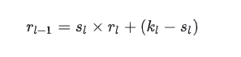
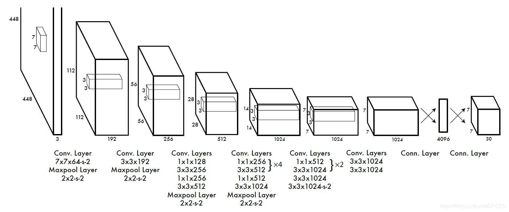
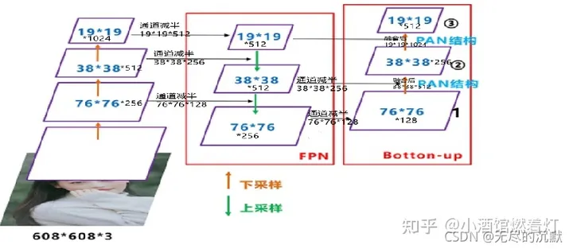
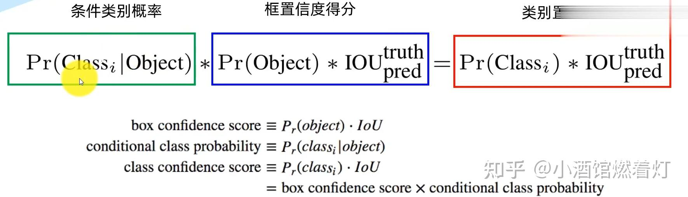
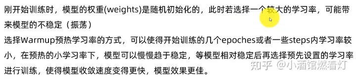
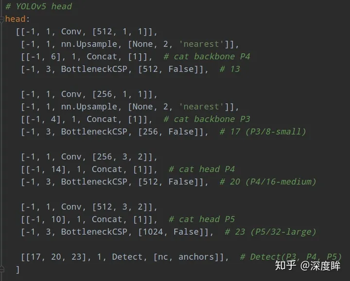
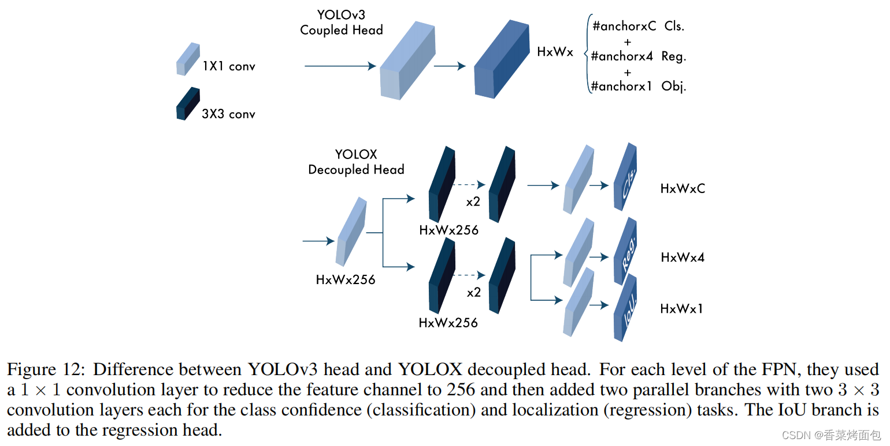

# 检测

## 检测原理
### 如何计算anchor的感受野？设置大小?    
anchors是什么？     
答：anchors其实就是在训练之前人为设定的先验框，网络输出结果的框就是在anchors的基础上进行调整的。所以说先验框设定的好坏对于模型的输出效果影响还是挺大的。在yolo中一般设定一个物体的先验框的个数一般是9个，例如：

    anchors = np.array(
        [[27., 183.], [87., 31.], [51., 62.], [139., 95.], [53., 50.], [60., 54.5], [87., 55.], [161., 41.], [49.5, 44.]])
这个先验框anchors一共有9个元素，每一个元素代表一个先验框的宽高。例如【27,183】就表示第一个先验框的宽为27，高为183。    

2.一张图片有多少个先验框？    
答：先验框的个数与图片是哪个的物体的个数有关系，一个物体默认会设定9个先验框。   
在标注的时候会用一个矩形框来将物体标注出来，这样子我们可以根据标注信息来获取物体的左上角（x1, y1）和右下角(x2,y2)坐标，然后计算出物体的中心坐标[(x2-x1)/2, (y2-y1)/2]。 这样子就可以把ancors表示出来了。下面就是原图与画了先验框的图片的对比：     
    
     

 3.先验框在哪一步会进行调整？    
答：在YOLO网络里面，一张图片进入模型编码之后会输出三个feature map(特征层），分别用小特征层(20,20)、中特征层(40,40)和大特征层(80,80)来表示。   
其中小特征层用于检测大物体，中特征层用于检测中等物体，大特征层用于检测小物体。     
anchors是在特征层上进行调整的，但最开始的anchors是相对于原图的，我们需要将anchors的大小以及物体的中心也对应到feature map上。我们可以从feature map上获取到物体中心以及框的宽高的偏移量offset_x, offset_y, offset_w, offset_h, 然后根据偏移量对先验框进行调整。     

 特征层上：一共9个anchors，有3层特征层， 所以每层3个先验框    

在训练过程中，对anchors的调整是在求loss前会对anchors进行调整，然后用调整后的anchors和真实框来计算loss_iou。    
yolo过了模型之后有三个feature map，所以每个feature map上一个物体有三个anchor，在对anchors进行调整的时候会吧feature map的值调整到0~1之间，这是因为在feature map上每个网格的长度默认为1.   

k-means clustering algorithm 是一种迭代求解的聚类分析算法，其步骤是，预将数据分为 K 组，则随机选取 K 个对象作为初始的聚类中心，然后计算每个对象与各个种子聚类中心之间的距离（相似程度），把每个对象分配给距离它最近的聚类中心。     
聚类中心以及分配给它们的对象就代表一个聚类。每分配一个样本，聚类的聚类中心会根据聚类中现有的对象被重新计算。这个过程将不断重复直到满足某个终止条件。终止条件可以是以下任何一个：   
没有（或最小数目）对象被重新分配给不同的聚类。   
没有（或最小数目）聚类中心再发生变化。   
误差平方和局部最小。   

有两点需要进行注意：   
如何定义样本之间的距离（相似程度）？虽然最常见的是欧氏距离，但是也要根据场景去设计。   
如何确定 K 的取值？一共分为多少类，根据先验知识？根据场景？还是聚类过程中进行确定？   

YOLOv2 中的 K-means 算法   
Faster R-CNN 使用的 Anchors 都是作者通过工程经验人为设计的， 但并没有给出设计的过程和细节。YOLOv2 论文中作者提到说：如果我们一开始就选择了合适的 Anchors，那么网络就更容易去学习如何进行好的预测。那如何评价什么是好的 Anchors 呢？YOLOv2 论文作者通过计算所有目标 GT boxes 与 Anchors 的最大 IOU 的均值作为指标，记为 Avg IOU， 其越大代表得到的 Anchors 越好。    

        The network can learn to adjust the boxes appropriately but if we pick better priors for the network to start with we can make it easier for the network to learn to predict good detections.   
YOLOv2 中是怎么利用 k-means 聚类算法得到 Anchors 的呢 ? 作者对比了 k=5 和 k=9 的情况，最后为了计算量的取舍选择了 k=5。另一个核心问题是如何定义样本之间的距离。YOLOv2 论文中作者提到说：直接使用欧式距离其实并不好。因为衡量指标为 Avg IOU，所以选择 1-IOU(bboxes, anchors) 表示距离，如果 bbox 与对应的簇中心（Anchor）IOU 越大，则距离越近（1-IOU(bboxes, anchors)越小）。     

下展示使用k-means算法，1-IOU(bboxes, anchors) 作为样本之间的距离进行聚类的代码示例，    
Step1: 在所有的 bboxes 中随机挑选 k 个作为簇的中心 (Anchors)   
Step2: 计算每个 bboxes 离每个簇中心的距离 1-IOU(bboxes, Anchors)    
Step3: 计算每个 bboxes 距离最近的簇中心，并分配到离它最近的簇中    
Step4: 根据每个簇中的 bboxes 重新计算簇中心(Anchors)，这里默认使用的是计算中值，自己也可以改成其他方法    
Step5: 重复 Step3 和 Step4 直到每个簇中元素不在发生变化     

YOLOv5 中的 K-means 算法    
YOLOv5 实际还不是直接使用欧氏距离的结果，而是经过了 Genetic Algorithm 遗传算法进行变异的结果。    

如果不是使用 1-IOU(bboxes, anchors) 作为距离指标，而是使用 GIoU，DIoU，或者 CIoU 呢？？？？        


### 感受野（Receptive Field）：    
为什么是小尺寸特征图用于检测大尺寸物体？   
    
做目标检测任务分为两个子任务：分类和边框回归。    
图像上的某一块区域大小影响到某个神经元的输出，这个区域大小就是这个神经元的感受野大小。根据CNN的结构特点，层数越深，对应的感受野越大，比如经典的分类网络，最后的输出神经元感受野达到了整张图像大小，需要有看到整张图像的能力才能做全局的分类。      

另外由于监督学习模式，越深的层得到的特征越抽象（高级），越浅的层特征越细节（低级）。深层的特征由于平移不变性（translation invariance）,已经丢掉了很多位置信息。    
分类要求特征有较多的高级信息，回归（定位）要求特征包含更过的细节信息，这两种要求在同一个特征图（feature map）上很难同时兼得。     
因此，大的特征图由于感受野较小，同时特征包含位置信息丰富，适合检测小物体。       

就比如物体是一只狗但感受野只有能看到躯干的大小，这样会大概率认为是只猫，这是感受野太小；在世界地图上想找到北京，这就是感受野太大；不管太大还是太小都不好。那么尽量让物体的scale和感受野保持一个合适的固定的比例是一个解决方法。这个固定的比例是多大呢，需要引出有效感受野的概念，这方面的研究也不少。前面说到浅层特征缺少抽象信息，而这些信息对分类很重要，因此说浅层特征检测小物体也有其值得提升的地方。FPN就是将高级和低级特征融合来增强浅层特征的高级特征信息。  

经典的目标检测如Faster R-CNN, YOLOv3等都用到了Anchor, 怎么设计Anchor每个目标检测方法各不相同。Faster R-CNN中的Anchor有三种形状，三种长宽比，比如形状有[128, 256, 512]三个，长宽比有[1:1, 1:2, 2:1]三种，这样组合就是9个anchor。YOLOv3中的Anchor是通过K-Means聚类得到的。这些基于anchor的方法的目的是学习一个从Anchor到GT Box的转换函数      
Anchor一般是通过先验进行指定的，Anchor与目标的大小和位置越匹配(IOU>0.5or0.7)，回归效果就会越好。如果小人脸和anchor的IOU过小，就会造成anchor很难回归到GT上，从而导致Recall过低。      
自己尝试过使用kmeans算法聚类自己数据集的Anchor，之前两个数据，两次聚类，都出现了自己聚类得到的Anchor不如默认的Anchor得到的结果。之前一直不知道原因在哪里。在总结了感受野以后，我觉得可以合理推测，Anchor应该和实际感受野尽量匹配，但是实际感受野实际上是一个超参数，通过聚类得到的anchor有一定代表性，但是效果反而不如默认的anchor，这是因为我们自己聚类得到的Anchor的范围实际上没有默认的广。          


感受野（Receptive Field）的定义是卷积神经网络每一层输出的特征图（feature map）上的像素点在输入图片上映射的区域大小。再通俗点的解释是，特征图上的一个点对应输入图上的区域，如图1所示。    
    
图中是个微型CNN，来自Inception-v3论文，原图是为了说明一个conv5x5可以用两个conv3x3代替，从下到上称为第1, 2, 3层：    
  Q1:既然两次3*3卷积后得到一个5*5感受野的特征图，为什么不用一个5*5的卷积核进行一次卷积

        一个5*5卷积所需参数 5*5*1=25

        两个3*3卷积所需参数2*(3*3*1)=18
简而言之：某一层feature map(特性图)中某个位置的特征向量，是由前面某一层固定区域的输入计算出来的，那这个区域就是这个位置的感受野。任意两个层之间都有位置—感受野对应关系，但我们更常用的是feature map层到输入图像的感受野，如目标检测中我们需要知道feature map层每个位置的特征向量对应输入图像哪个区域，以便我们在这个区域中设置anchor，检测该区域内的目标。    

感受野作用

一般task要求感受野越大越好，如图像分类中最后卷积层的感受野要大于输入图像，网络深度越深感受野越大性能越好      
密集预测task要求输出像素的感受野足够的大，确保做出决策时没有忽略重要信息，一般也是越深越好     
目标检测task中设置anchor要严格对应感受野，anchor太大或偏离感受野都会严重影响检测性能   

感受野计算：     
    
初始 feature map 层的感受野是1    
每经过一个conv k x k ,s1的卷积层，感受野 r = r + (k - 1)    
常用卷积核 k=3 计算倒数第二层感受野 ：r = （原始感受野1 * step1) + (卷积核3-step1) = 3    

每经过一个conv k x k, s2的卷积层或max/avg pooling层，感受野 r = (r x 2) + (k -2)，   
常用卷积核k=3, s=2，感受野 r = r x 2 + 1，卷积核k=7, s=2, 感受野r = r x 2 + 5    
每经过一个maxpool2x2 s2的max/avg pooling下采样层，感受野 r = r x 2    
特殊情况，经过conv1x1 s1不会改变感受野，经过FC层和Global Average Pooling层，感受野就是整个输入图像   
经过多分枝的路径，按照感受野最大支路计算，shotcut也一样所以不会改变感受野    
ReLU, BN，dropout等元素级操作不会影响感受野    

递推公式:    
   
通项公式:    
      
建议自己推导的时候使用递推公式，非常方便，代码实现的时候考虑使用通项公式。      
       
除了最普通的卷积，还有空洞卷积、上采样、BatchNorm、Separable Conv的感受野计算需要补充。      
       


理论感受野：某一层feature map中的某一个位置，是由前面某一层固定区域输入计算出来的，那这个固定区域就是这个位置的感受野。

实际感受野： 实际感受野要小于理论感受野,是在NIPS2016中的Understanding the Effective Receptive Field in Deep Convolutional Neural Networks提出的。   
文章主要贡献有以下几点：    
并不是感受野内所有像素对输出向量的贡献相同，实际感受野是一个高斯分布，有效感受野仅占理论感受野的一部分      
可以看出分类和分割任务经过训练后的感受野都有提升，不过提升幅度不太一样。这也说明了神经网络通过学习，扩大了感受也，能够自适应把越来越大的权重放在感受野之外的像素上。也在一定程度上说明更大感受野的必要性。    
     

上图MobileNet和VGG16准确率相当，但是MobileNet所需计算量却非常小（约为VGG16的27分之1），这是由于MobileNet使用了大量depth-wise Convolution,这样可以以较小的计算代价来增加模型感受野。这个对比可以表明生成更大感受野的网络可以有更好的识别准确率。    

     
文章中指出了Anchor、理论感受野、实际感受野三者的关系。（a）图中，整个黑色的box是理论感受野，中间的白点是一个高斯分布的实际感受野。（b）图中举了一个例子，黑色点状的框代表是理论感受野的面积，蓝色的代表实际感受野位置，而最合适的anchor就是红色的框，所以关系为：    
Anchor大小<实际感受野<理论感受野       

### 一般问题
#### 标签分配到底是什么意思???    
分配给网格？分配给anchor?计算loss?       


YOLOv1   
标签分配：GT的中心落在哪个grid，那个grid对应的两个bbox中与GT的IOU最大的bbox为正样本，其余为负样本   
即虽然一个grid分配两个bbox，但是只有一个bbox负责预测一个目标（边框和类别），这样导致YOLOv1最终只能预测7*7=49个目标。   

Each bounding box consists of 5 predictions:x,y,w,h,and confidence. The(x,y)coordinates represent the center of the box relative to the bounds of the grid cell. The width and height are predicted relative to the whole image. Finally the confidence prediction represents the IOU between the predicted box and any ground truth box.    
物体框中心相对其所在网格单元格边界的位置（一般是相对于单元格左上角坐标点的位置，以下用x，y表示）和检测框真实宽高相对于整幅图像的比例（注意这里w，h不是实际的边界框宽和高），(x, y, w, h)都是归一化之后的数值。   
一个网格预测2个bbox，在计算损失函数的时候，只取与ground truth box中IoU大的那个预测框来计算损失。   
这种标签分配方式和边框回归方式产生两个问题：   
（1）边框回归不准    
（2）漏检很多   

YOLOv2    
标签分配：（1）由YOLOv1的7*7个grid变为13*13个grid，划分的grid越多，多个目标中心落在一个grid的情况越少，越不容易漏检；（2）一个grid分配由训练集聚类得来的5个anchor（bbox）；（3）对于一个GT，首先确定其中心落在哪个grid，然后与该grid对应的5个bbox计算IOU，选择IOU最大的bbox负责该GT的预测，即该bbox为正样本；将每一个bbox与所有的GT计算IOU，若Max_IOU小于IOU阈值，则该bbox为负样本，其余的bbox忽略。    

边框回归方式：预测基于grid的偏移量(tx, ty, tw, th)和基于anchor的偏移量(tx, ty, tw, th)，具体体现在loss函数中。   
基于anchor的偏移量的意思是，anchor的位置是固定的，偏移量=目标位置-anchor的位置。   
基于grid的偏移量的意思是，grid的位置是固定的，偏移量=目标位置-grid的位置。    

与YOLOv1的不同：

网络输出：YOLOv1是（x, y, w, h），YOLOv2是（tx, ty, tw, th），这就决定了GT也是这种表示形式；    
loss计算：YOLOv1是直接拿（x, y, w, h）来计算的，YOLOv2是拿（tx, ty, tw, th）来计算的，这就决定了YOLOv1是直接回归，YOLOv2是回归偏移量（offset）；   

对于边界框的预测在沿袭YOLOv1的同时借鉴了Faster R-CNN的思想，其实，对于中心点（x，y）的预测跟YOLOv1原理相同，都是预测相对于grid的位置，只不过其经过了sigmoid函数公式变换，将中心点约束在一个grid内；对于宽高的预测，跟Faster R-CNN的思想一致，学习目标是anchor和GT之间的偏移量（而不直接是GT的宽和高，参考RCNN的计算过程）；    

在YOLOv2中引入anchor思想，主要的贡献是优化了宽高尺度的学习，使宽高有一个更好的先验；而对于中心点的学习不是anchor的贡献，其跟YOLOv1思想一致，不过sigmoid变换的出现，使一开始的训练更稳定；对中心点的计算，没有用到anchor信息。     
    
第1,4行是confidence_loss，注意这里的真值为0和IoU(GT, anchor)的值（与v1一致），在v2中confidence的预测值施加了sigmoid函数；    
第2,3行：t是迭代次数，即前12800步我们计算这个损失，后面不计算了。这部分意义何在？意思是：前12800步我们会优化预测的(x,y,w,h)与anchor的(x,y,w,h)的距离+预测的(x,y,w,h)与GT的(x,y,w,h)的距离，12800步之后就只优化预测的(x,y,w,h)与GT的(x,y,w,h)的距离，也就是刚开始除了对GT的学习还会加一项对于anchor位置的学习，这么做的意义是在一开始预测不准的时候，用上anchor可以加速训练。      
第一项loss是计算background的置信度误差，但是哪些预测框来预测背景呢，需要先计算各个预测框和所有ground truth的IOU值，并且取最大值Max_IOU，如果该值小于一定的阈值（YOLOv2使用的是0.6），那么这个预测框就标记为background，需要计算noobj的置信度误差。    
第二项是计算先验框与预测框的坐标误差，但是只在前12800个iterations间计算，我觉得这项应该是在训练前期使预测框快速学习到先验框的形状。     
第三大项计算与某个ground truth匹配的预测框各部分loss值，包括坐标误差、置信度误差以及分类误差。先说一下匹配原则，对于某个ground truth，首先要确定其中心点要落在哪个cell上，然后计算这个cell的5个先验框与ground truth的IOU值（YOLOv2中bias_match=1），计算IOU值时不考虑坐标，只考虑形状，所以先将先验框与ground truth的中心点都偏移到同一位置（原点），然后计算出对应的IOU值，IOU值最大的那个先验框与ground truth匹配，对应的预测框用来预测这个ground truth？？？？？？？？。    
在计算obj置信度时，在YOLOv1中target=1，而YOLOv2增加了一个控制参数rescore，当其为1时，target取预测框与ground truth的真实IOU值。对于那些没有与ground truth匹配的先验框（与预测框对应），除去那些Max_IOU低于阈值的，其它的就全部忽略，不计算任何误差。    

v2与v1的主要区别：    
在v1中，一个grid（两个bbox）只对应预测一个类别，在训练是两个bbox中只有与GT的IOU最大的那个参与学习，即在训练时只有49个bbox在学习（另外49个bbox被当做背景，confidence为0），在测试时虽然两个bbox都输出，但是可想而知只有一个confidence很大，可以被留下，另一个confidence很小，通过阈值就删掉了；    
在v2中，一个grid中的5个bbox可以分别预测不同的类别，可以说，对于类别的预测，YOLOv1是以grid为单位的，YOLOv2是以bbox（anchor）为单位的，（看loss的差别就知道了）。若两个GT的中心同时落在了一个grid中，每个GT都可以找到一个bbox（anchor）来负责该GT的预测，两个bbox（anchor）可以输出不同的类别，而不是像v1中一个grid只能预测一个目标（类别）。（这里还有一个问题，如果两个GT找到的是同一个anchor该怎么办，作者应该是默认这种极端情况应该几乎不会出现。）   
YOLOv2中Anchor的概念主要体现在先验框的生成，边框回归中对宽高的回归，以及类别的预测。   

v2与v1的相同点：   
同样都是一套回归算法的流程，全部采用回归loss；   
同样都是“负责”的概念，找到负责GT的bbox；    

YOLOv3    
标签分配：三个特征图一共 8 × 8 × 3 + 16 × 16 × 3 + 32 × 32 × 3 = 4032 个anchor。   
正例：任取一个ground truth，与4032个anchor全部计算IOU，IOU最大的anchor，即为正例。并且一个anchor，只能分配给一个ground truth。例如第一个ground truth已经匹配了一个正例anchor，那么下一个ground truth，就在余下的4031个anchor中，寻找IOU最大的anchor作为正例。ground truth的先后顺序可忽略。正例产生置信度loss、检测框loss、类别loss。标签为对应的ground truth标签（需要反向编码，使用真实的(x, y, w, h)计算出(tx, ty, tw, th) ）；类别标签对应类别为1，其余为0；置信度标签为1。     
负例：正例除外（特殊情况：与ground truth计算后IOU最大的anchor，但是IOU小于阈值，仍为正例），与全部ground truth的IOU都小于阈值（0.5）的anchor，则为负例。负例只有置信度产生loss，置信度标签为0。    
忽略样例：正例除外，与任意一个ground truth的IOU大于阈值（论文中使用0.5）的anchor，则为忽略样例。忽略样例不产生任何loss。    

这样产生的问题是：一个GT只分配一个anchor来进行预测，存在正样本太少的问题，在后面的工作中例如FCOS已经证明了，增加高质量的正样本数量，有利于检测模型的学习。    

边框回归方式：与YOLOv2一致    
特征图1的Yolov3的损失函数抽象表达式如下：    
    
Yolov3 Loss为三个特征图Loss之和：    
    
(x, y, w, h)使用MSE作为损失函数，也可以使用smooth L1 loss（出自Faster R-CNN）作为损失函数。smooth L1可以使训练更加平滑。置信度、类别标签由于是0，1二分类，所以使用交叉熵作为损失函数(sigmoid作为激活函数)。      

关于多尺度特征图的标签分配：     
ground truth为什么不按照中心点分配对应的anchor？（YOLOv1和YOLOv2中“负责”那种思想）      
（1）在Yolov3的训练策略中，不再像Yolov1那样，每个grid负责中心落在该grid中的ground truth。原因是Yolov3一共产生3个特征图，3个特征图上的grid，中心是有重合的。如果按照YOLOv1和YOLOv2的方式，一个GT的中心点有可能会落在不同尺度上的不同grid中，但是与该GT大小匹配的尺度大多数情况下只有一个。所以Yolov3的训练，不再按照ground truth中心点，严格分配指定grid，而是在所有anchor中寻找与GT的IOU最大的anchor作为正例。        
（2）在多尺度特征图的标签分配问题中有两种思路，第一种，先根据GT的大小，将GT分配到某个尺度上，然后在该尺度上选IOU最大的作为正例（貌似FCOS是这种思路，具体哪篇论文记不清了）。第二种，直接将GT在3种尺度上，选IOU最大的anchor为正例。总结来说，可以先确定在哪个尺度上选先验，也可以直接在所有尺度上选先验。（论文往往不会把所有的细节都写清楚，但是合理的做法可能有多种，具体是怎么实现的还是以代码为准）        

关于置信度标签分配：      
YOLOv1和YOLOv2中的置信度标签，就是bbox与GT的IOU，YOLOv3为什么是1？（实际上在YOLOv1和YOLOv2的第三方实现中，有些也是1）    
（1）置信度意味着该预测框是或者不是一个真实物体，是一个二分类，所以标签是1、0更加合理。       
（2）YOLO系列中出现了两种方式：第一种：置信度标签取预测框与真实框的IOU；第二种：置信度标签取1。    

YOLOv4      
标签分配：YOLOv3是1个anchor负责一个GT，YOLO v4中用多个anchor去负责一个GT。   
对于某个GT来说，计算其与所有anchor的IOU，IOU大于一定阈值（MAX_thresh=0.7）的anchor都设为正样本；    
如果该GT与所有anchor的IOU都小于阈值（MAX_thresh=0.7），选择IOU最大的为正样本，保持每个GT至少有一个anchor负责预测；       
如果一个anchor与所有的GT的IOU都小于（MIN_thresh=0.3），则该anchor为负样本；其余的anchor都忽略。    

边框回归方式：与YOLOv2、YOLOv3一致，都是预测（tx, ty, tw, th）

LOSS计算：边框回归loss变为CIOU loss，边框回归loss演进：MSE loss/Smooth L1 loss —— IOU loss —— GIOU loss —— DIOU loss —— CIOU loss     
置信度loss采用MSE loss；分类loss采用BCE loss。    

5、YOLOv5       
标签分配：考虑邻域的正样本anchor匹配策略，增加了正样本，参考https://zhuanlan.zhihu.com/p/183838757中loss计算部分。     
边框回归方式：与之前一致，预测（tx, ty, tw, th）    
LOSS计算：cls和conf分支都是BCE loss，回归分支采用CIOU loss。     

对于正样本分配来说，可以确定的是，一个GT只对应一个anchor肯定不是最优的，增加正样本的数量可以有效提高目标的学习；        
对于边框回归/坐标预测来说，可以确定的是，预测偏移量比直接预测坐标要好，将中心点的位置用sigmoid约束在一个grid中可以加速学习；          
对于loss计算来说，可以确定的是，CIOU loss是目前回归loss最合理的设计，置信度loss可以用MSE loss或者-Log loss，我认为-Log loss更好（可能差距不大），分类loss用BCE loss要优于softmax loss，可以解决多标签的问题。         

yolov5的loss设计和前yolo系列差别比较大的地方就是正样本anchor区域计算，其余地方差距很小。分类分支采用的loss是BCE，conf分支也是BCE，当然可以通过h['fl_gamma']参数开启focal Loss,默认配置没有采用focal los，而bbox分支采用的是Giou loss。       
对于yolov3计算过程不熟悉的，可以参考目标检测正负样本区分策略和平衡策略总结(一)，里面有详细分析yolov3的loss计算过程。loss的计算非常简单，核心是如何得到loss计算所需的target。      

yolov5的很大区别就是在于正样本区域的定义。？？？？？？？？实现？？？？？？？？？？          
在yolov3中，其正样本区域也就是anchor匹配策略非常粗暴：保证每个gt bbox一定有一个唯一的anchor进行对应，匹配规则就是IOU最大，并且某个gt一定不可能在三个预测层的某几层上同时进行匹配。，不考虑一个gt bbox对应多个anchor的场合，也不考虑anchor是否设置合理。不考虑一个gt bbox对应多个anchor的场合的设定会导致整体收敛比较慢，在诸多论文研究中表明，例如FCOS和ATSS：增加高质量正样本anchor可以显著加速收敛。         

本文也采用了增加正样本anchor数目的做法来加速收敛，这其实也是yolov5在实践中表明收敛速度非常快的原因。其核心匹配规则为：        
(1) 对于任何一个输出层，抛弃了基于max iou匹配的规则，而是直接采用shape规则匹配？？？？？？？？？，也就是该bbox和当前层的anchor计算宽高比，如果宽高比例大于设定阈值，则说明该bbox和anchor匹配度不够，将该bbox过滤暂时丢掉，在该层预测中认为是背景     
(2) 对于剩下的bbox？？？？？？？？？，计算其落在哪个网格内，同时利用四舍五入规则，找出最近的两个网格，将这三个网格都认为是负责预测该bbox的，可以发现粗略估计正样本数相比前yolo系列，至少增加了三倍     
     
如上图所示，绿点表示该Bbox中心，现在需要额外考虑其2个最近的邻域网格也作为该bbox的正样本anchor。从这里就可以发现bbox的xy回归分支的取值范围不再是0~1，而是-0.5~1.5(0.5是网格中心偏移，请仔细思考为啥是这个范围)，因为跨网格预测了。        

     
三张图排布顺序是：0-大输出特征图(stride=8)，1-中等尺度特征图(stride=16)，2-小尺度特征图(stride=32)，分别检测小物体、中等尺寸和大尺度问题。其中红色bbox表示该预测层中的gt bbox，黄色bbox表示该层对应位置的正样本anchor。第一幅图是大输出特征图，只检测小物体，所以人那个bbox标注被当做背景了，并且有三个anchor进行匹配了，其中包括当前网格位置anchor和2个最近邻居anchor。    
loss设计的思想在图中一目了然)：

(1) 不同于yolov3和v4，其gt bbox可以跨层预测即有些bbox在多个预测层都算正样本

(2) 不同于yolov3和v4，其gt bbox的匹配数范围从3-9个,明显增加了很多正样本(3是因为多引入了两个邻居)

(3) 不同于yolov3和v4，有些gt bbox由于和anchor匹配度不高，而变成背景

    
      
作者这种特别暴力增加正样本做法还是存在很大弊端，虽然可以加速收敛，但是由于引入了很多低质量anchor，对最终结果还是有影响的。我相信这个部分作者应该还会优化的。       

遗传算法是最经典的智能优化算法，主要包括选择、交叉和变异三个步骤，先选择一些种子即初始值，然后经过适应度函数(评估函数)得到评估指标，对不错的解进行交叉和变异操作，进行下一次迭代。采用优胜劣汰准则不断进化，得到最优解。但是本文仅仅是模拟了遗传算法思想，因为其只有变异这一个步骤即对第一次运行得到的anchor进行随机变异操作，然后再次计算适应度函数值，选择最好的。        


### 定义：    

目标检测是分类与定位的结合    
目标检测目前有两类流行算法:  
- 一类是基于Region Proposal的R-cnn系列（比如r-cnn,fast r-cnn,faster r-cnn）,他们是属于two stage的，   
需要先使用Selective search 或者cnn网络（RPN）来产生Region proposal,然后再对Region proposal上做分类和回归。    
所谓回归：指的是回归出四个坐标点的位置     
回归是统计学中的一种强大的算法，用于研究一组随机变量(Y1, Y2, ..., Yi)和另一组变量(X1, X2, ..., Xk)之间的关系   

- 另一类就是yolo，ssd系列的one stage算法，它仅仅使用一个cnn来直接预测不同目标的类别和位置

### yolo v1 算法原理
      
在介绍YOLO之前先来介绍一下滑动窗口技术。滑动窗口技术就是采用不同大小和比例（宽高比）的窗口在整张图片上以一定的步长进行滑动，然后对这些窗口对应的区域做图像分类，这样就可以实现对整张图片的检测了。但是这有个致命的缺点，由于检测目标的大小未知，需要设置很多不同尺寸的窗口去滑动，这样会导致产生极多的无效区域，而且这些区域都需要经过分类器判断，计算量巨大。     
YOLO摒弃了滑动窗口技术，直接将原始图片分割成SS个互不重合的小方块，然后通过卷积最后产生SS的特征图，可以认为特征图的每个元素对应原始图片的一个小方块（和视野域挺像的），然后用每个元素来预测那些中心点在该小方格内的目标，这就是YOlO系列算法的朴素思想。    
1）怎么确认单元格是否对应目标？      
这是对网络进行训练的结果，可以看作是一个二分类，其结果记为 Pr(object)。假如我们的目标是狗、自行车、汽车，预测单元格cell1对应的目标是狗，则Pr(object)=1；预测单元格cell2不在目标之中，则Pr(object)=0。   

3）边界框的置信度是什么？该怎么计算？   
所谓置信度其实包含两个方面，一是这个边界框含有目标的可能性大小，二是这个边界框的准确度。前者就是指边界框对应的单元格是否对应目标，其用Pr(object)表征，值为0和1。边界框的准确度可以用预测框与实际框（ground truth）的IOU（intersection over union，交并比）来表征，记为       
      
因此置信度可以定义为      


4）怎么确定含有目标的单元格类别？     
对于每一个单元格其还要给出预测出 C个类别概率值，其表征的是由该单元格负责预测的边界框其目标属于各个类别的概率。直白来说，每个单元格只对应一个概率最高的类别（这个在v3及以后做了改变）。但是这些概率值其实是在各个边界框置信度下的条件概率，即Pr(classi|object)。值得注意的是，不管一个单元格预测多少个边界框，其只预测一组类别概率值，这是Yolov1算法的一个缺点。同时，我们可以计算出各个边界框类别置信度（class-specific confidence scores）:       
      
边界框类别置信度表征的是该边界框中目标属于各个类别的可能性大小以及边界框匹配目标的好坏。一般会根据类别置信度使用NMS来过滤网络的预测框。注意和边界框置信度做区分，边界框置信度是对是否含有目标的表征，边界框类别置信度是对含有的目标类别的表征。        

5）总结：
每个单元格需要预测 (B∗5+C) 个值。如果将输入图片划分为 S×S 网格，那么最终预测值为 S×S×(B∗5+C) 。yolov1使用的是训练数据是PASCAL VOC数据，对于PASCAL VOC数据，其共有20个类别，如果令 S=7,B=2 ，那么最终的预测结果就是 7×7×30 大小的张量。        


#### 参数设置  
two-stage算法将步骤一与步骤二分开执行，输入图像先经过候选框生成网络（例如faster rcnn中的RPN网络），再经过分类网络    
yolo是通过一个cnn网络模型来实现end-to-end的目标检测    
Yolo很快，将detection视为回归问题，仅使用一个neural network同时预测bounding box的位置和类别，因此速度很快     
Yolo由于不需提取region proposal(区域提案)，而是直接在整幅图像进行检测，因此YOLOv1可以联系上下文信息和特征，减少将背景检测为物体的错误    
   
非极大值抑制的方法进行筛选   
nms是怎么做筛选，如何计算分数筛选的？    

    
在YOLO1中，YOLO的输出是一个SS(B5 + C)的张量   

S*S 模型最初将整个图像数据切分为S * S的网格图像，也就是长和宽都分别分成S分，从而获得SS个网格子图像。**那模型是如何控制输出SS格的预测的呢，是通过设置最后输出张量的第1,2数轴为S实现的。**    
B 模型的一个超参数，通过设置每个网格需要输出多少个边界框   
5 模型每个边界框有5个参数，（x , y , w, h, confs)   
C 模型需要学习的分类类别，因为机器学习里都是将分类类别独热化处理（one-hot)，因此模型需要全局学习多少个类别，C就是多少。需要注意的是，论文中指出每个网格只预测一组类别，无论对于每个网格需要预测多少个边界框B,也就是默认该网格中的输出B个边界框都是相同的类别。 每个网格单元只负责检测一个物体，因此只需要为每个网格单元预测一个class probabilities（类别概率），而不是为每个边界框都预测。 这样可以避免模型过度接近于较容易检测到的对象？？？？，而忽略了更难以检测到的对象。同时，这也减少了前向传播过程中的计算量，从而提高了模型的效率。    
在YOLO1中，作者给出了YOLO1的模型输出具体参数
```
S = 7
B = 2
C = 20
输出 为 7 * 7 * 30 的张量
```

B个边界框如何获取？一个网格的。    
分类获取好理解，输出交叉熵。回归是怎么回归的？将“10种分类”扩大化？坐标轴所有值都是分类对象。     

(x, y) 坐标位置代表边界框相对于网格边界的位置   
(w, h) 检测目标的长宽是相对于整个图像的长宽，即归一化后的    
confidence 置信度是预测边界框和实际中的框体之间的IOU    

#### 置信度 iou
根据这些计算结果，可以通过二分类模型（即物体是否存在的判断）和回归模型（即边界框的位置和尺寸）来预测每个边界框的置信度。    
在YOLO算法中，置信度被定义为包含物体的概率与IOU得分的乘积，即objectness score = Pr(object) × IOU。其中，Pr(object) 表示一个给定边界框所包含的物体的概率，它是通过对数据集进行标注来得到的，而 IOU 分数则是通过预测的边界框与真实边界框之间的IOU值计算得出的。 对于每个边界框，如果其 IOU 值大于一定阈值 (一般使用0.5)，则认为此边界框与其对应的物体高度匹配，否则，该边界框被视为负样本（即不包含物体）。至此，我们就可以在训练过程中计算出每个边界框的置信度，从而可以对识别结果进行排序和筛选，保留置信度最高的预测结果作为最终的检测结果。     

对于每个矩形框而言，我们需要在数据集中检查该矩形框所属的物体类别是否与当前训练的模型所预测的类别匹配。如果不匹配，则该矩形框被视为背景，属于负样本(不包含目标）；如果匹配，则该矩形框被视为正样本（包含目标）。    
对于每个正样本，我们需要计算该矩形框所包含物体的概率，即 Pr(object) 值。在YOLO算法中，Pr(object) 由两部分组成：一部分是矩形框中心所属的网格单元格所负责的边界框数目的倒数，另一部分则是目标物体中心点与矩形框中心点之间的距离（按单元格大小归一化）。具体地，对于每个正样本矩形框而言，其 Pr(object) 值由如下公式计算：    

α是一个超参数，通常为1，IOU则是预测边界框和真实边界框之间的IOU得分。这些正样本矩形框的 Pr(object) 值都是通过标注信息来计算得到，在训练过程中反向传播梯度进行训练，从而让模型能够自适应地学习到每个矩形框是否包含物体这一信息。      
其中，第一项1/S^2 表示网络预测的该边界框是否包含目标的先验概率，也就是说，如果没有目标，在采样一张图片中预测出包含目标的边界框的概率也是很小的，因此引入一个先验概率。第二项α × IOU为IoU的置信度值，它用来表示边界框是否与目标框相似。其中，α是一个超参数，用来平衡先验概率和IoU的贡献。    

在YOLOv2及之后的版本中，目标置信度的计算方式被改进为只考虑交并比的影响。具体而言，目标置信度的计算公式为Pr(object) =IOU，其中，IOU为预测框与真实框之间的交并比。如果IOU大于某个设定的阈值，则被认为这个预测框框住的区域内存在一个物体。如果IOU 小于阈值，则将其置信度设为0，表示该预测框不包含目标。    

由于每一个单元格有多个边界框，但是每一个单元格其对应类别只有一个，如果在训练时，多个边界框存在目标，那就只选择与真实边框（ground truth）的IOU最大的那个边界框来负责预测该目标，而其它边界框认为不存在目标。这样设置的结果使每一个单元格只对应一个边框，一个类别。   
大家可能会想如果一个单元格内存在多个目标怎么办，其实这时候Yolo算法就只能选择其中一个来训练，这也是Yolo算法的缺点之一。     


#### 一般性问题，细节
交叉熵损失函数    
交叉熵是用来衡量两个概率分布的距离。    


在YOLO中，使用相对于网格的坐标位置作为输出的x,y坐标可以帮助提升检测的精度。    
那么YOLO中的输出x,y为什么是相对于网格的相对坐标位置，而不直接用预测相对于整张图像的相对坐标位置
将bounding box的位置表示为相对于网格的坐标位置，相对于图像绝对位置的变化对网络输出的影响就会更小。这意味着模型会更加关注局部特征，而不会受到图像中不同目标之间的绝对位置关系的影响，从而可以更好地进行物体检测。   
此外，使用相对于网格的坐标位置也有助于缩小目标的坐标范围，从而使坐标值的范围集中在0到1之间，避免了模

问题1/2   
位置预测误差和置信度误差是等权重的，这显然是不合理的。8维(B * 4) 的位置信息 与20维©的类别信息的重视程度是不一样的    
在每张图片中，许多网格单元格都不包含任何物体。这会将这些单元格的“置信度”得分推向零，常常压制那些确实包含物体的单元格的梯度。也就是说这些零的置信度会在方向传播的过程中影响权重的更新，因为没有物体的网格的目标值是0。一方面，不包含任何物体的网格单元数量多，从而其对误差的影响大。另一方面，置信度 confidence 等于0， 可能会使模型存在梯度消失的问题。 进而压制包含物体的单元格的权重更新。    
这里为什么不对不包含任何物体的网格的坐标信息也加以限制呢，他们应该也是0之类的值？？？？？因为对于包含物体的网格，模型采用回归分支输出的bounding box坐标信息、分类分支输出的类别置信度信息以及该bounding box内物体出现的置信度信息共同构成损失函数，而对于不包含物体的网格，只采用该bounding box的置信度信息计算损失函数。该怎么理解呢，当我们知道一个框体的置信度为0之后，我们就不会去关注他的坐标信息了？？？？？？。所以在损失函数中，对于不包含具体物体的框体，我们只计算其置信度误差 confidence error。     
对于问题1和问题2，论文中通过对不同误差来源进行加权处理，从而使更重要的部分的误差对模型的影响更大。增加了边界框坐标预测的损失并减少了不包含物体的框的置信度预测的损失。 使用两个参数，λcoord和λnoobj来完成这个过程。设置λcoord = 5和λnoobj= .5。如果将所有的损失函数都设置为相同的权重，模型很容易受到这些值为0的bounding box的损失函数的影响，从而无法有效地往其他方向调整，导致训练不稳定以及收敛困难。因此，YOLO1中采用的这个不对称的损失函数来平衡这个问题。在这种方式下，当不包含物体的网格的预测置信度为0时，该网格的损失函数权重为λnoobj，远远小于包含物体的网格的损失函数权重λcoord。这种不对称的权重设置有效地平衡了这个问题，提高了训练的稳定性。    

要注意的一点时，对于不存在对应目标的边界框，其误差项就是只有置信度，坐标项误差是没法计算的。而只有当一个单元格内确实存在目标时，才计算分类误差项，否则该项也是无法计算的。    

第一行的式子表示边界框中心坐标的误差，第二行式子表示边界框的宽高误差，第三行式子表示含有目标的边界框的置信度误差，第四项式子表示不含有目标的边界框的置信度误差，第五行式子表示含有目标的单元格的类别误差      
这里注意置信度Ci的值，如果不存在目标，则Pr(object)=0,那么置信度Ci=0,如果存在目标，则Pr(object)=1，需要确定值，才能得到置信度Ci的值；为了方便计算，你可以将Ci置为1；   

问题3   
由于图片中的边界框（Boundary box) 往往大小不一。对于大框来说，比如10单位的大框，0.5的位置偏差是能够接受的（1/20)；但是对于小框来说，比如2单位的小框，0.5的位置偏差就会代买明显的视觉偏差了(5/20)。也就是说大方框中的小偏差比小方框中的小偏差更不重要。 为了部分地解决这个问题，我们预测边界框宽度和高度的平方根，而不是直接预测宽度和高度。     
对于问题3，论文中，通过将box的width和height取平方根代替原本的height和width。 如下图：small bbox的横轴值较小，发生偏移时，反应到y轴上的loss（下图绿色）比big box(下图红色)要大。    
   

#### 具体损失函数    
YOLO算法是将目标检测看出一个回归问题，所以将均方差作为损失函数（所以不是分类问题不是交叉熵）     
损失函数分为定位误差部分和分类误差部分，对于不同部分他们的比重值λ    


参数：   
- λcoord    
更重视8维的坐标预测，给这些损失前面赋予更大的loss weight, 记为在pascal VOC训练中取5。    
- λnoobj    
对没有object的box的confidence loss，赋予小的loss weight，记为在pascal VOC训练中取0.5。
类别权重等于1       
- 有object的box的confidence loss和类别的loss的loss weight正常取1。    

    
   
对于包含物体的网格，模型采用回归分支输出的bounding box坐标信息、分类分支输出的类别置信度信息以及该bounding box内物体出现的置信度信息共同构成损失函数，而对于不包含物体的网格，只采用该bounding box的置信度信息计算损失函数。     
第一行的式子表示边界框中心坐标的误差，第二行式子表示边界框的宽高误差，第三行式子表示含有目标的边界框的置信度误差，第四项式子表示不含有目标的边界框的置信度误差，第五行式子表示含有目标的单元格的类别误差      
这里注意置信度Ci的值，如果不存在目标，则Pr(object)=0,那么置信度Ci=0,如果存在目标，则Pr(object)=1，需要确定值，才能得到置信度Ci的值；为了方便计算，你可以将Ci置为1；    


其中    
边界框定位误差    


边界框尺寸误差    
    

置信度误差      
   

分类误差   


在YOLO算法中，如果一个目标的中心点位于某个网格内部，那么算法会在该网格内部拟合一个边界框。边界框是一个矩形，其包含了目标的位置和大小信息。YOLO算法会同时预测每个网格内可能的边界框，因此可能会存在重叠的边界框。在后续处理中，可以使用非极大值抑制（NMS）算法去掉重复的边界框，只保留最可能的那一个，从而得到最终的目标边界框。     
当一个物体的边界框跨越了多个网格时，每个包含该边界框中心点的网格都会尝试预测该边界框。在这种情况下，YOLO并不会将该物体视为单个网格上的物体。而是采用一种特殊的处理方式，将该物体的边界框分配给两个网格中置信度最高的那个。这种处理方式称为“跨越边界框（Cross-boundary box）”，它允许处理跨越网格的物体以有效地增加算法的检测能力。     

非极大值抑制（Non-Maximum Suppression，简称NMS）是一种常见的目标检测后处理方法，用于移除多余的边界框。NMS算法的原理是，对于每个类别的边界框，按照其置信度（或得分）从高到低进行排序。然后，选择置信度最高的边界框，将其它与之高度重叠的边界框（即IOU（Intersection over Union）重叠率大于某个阈值）从列表中移除。重复这个步骤，选择下一个最高置信度的边界框，直到所有的边界框都被处理完毕。    
在YOLO算法中，NMS算法通常是用于筛选检测到的目标边界框，以保留每个目标的最终检测结果。NMS算法可以剔除低于置信度阈值的边界框，同时去除重复的边界框，从而使目标检测结果更准确。通常情况下，NMS算法使用的重叠率阈值为0.5，可以根据具体任务和实验来调整。        
“重复这个步骤”指的是从剩余的未处理边界框列表中选择置信度第二高的边界框，然后再次进行非极大值抑制过程，直到所有边界框都被处理完成。    
重叠的边界框对于NMS算法来说可能会被移除，而最终保留的边界框是非极大值抑制算法的输出结果。例如，如果两个边界框的重叠率（Intersection over Union，IOU）大于设定的阈值，则只会保留置信度更高的那个边界框，而将置信度较低的边界框进行删除。    

NMS算法计算的是同一类别的边界框之间的重叠情况，而不是所有类别的边界框一起计算。在进行NMS处理时，通常只处理同一种类别的边界框，对于不同类别的边界框，需要分别进行处理。    
具体来说，如果在进行NMS处理时，需要处理多个类别的边界框，那么每个类别的边界框都需要进行查重处理。不同类别之间的边界框是互不干扰的，不会相互干扰或抵消。因此，在计算IOU值时，只有同一类别的边界框才会被考虑。最终，NMS算法会分别对每个类别输出过滤后的检测结果，从而得到针对每个类别的最终目标检测结果。    

置信度和IOU阈值     
NMS算法中，置信度（confidence）和IOU阈值（IOU threshold）是调节模型性能的两个关键超参数。    
在YOLO5中，默认的置信度阈值为0.25，即只有检测到的物体置信度高于0.25时，才会将其视为真正的检测结果。如果将此参数调低，则模型会更加敏感，但可能会导致一些误检和漏检。    
而IOU阈值则默认为0.45，即只有检测框之间的重叠程度大于0.45时，才会将其视为同一个目标的不同检测结果。这个参数能够控制模型的准确性和召回率。
当然，具体的置信度和IOU阈值也会根据具体的应用场景和任务需求进行调整。    
越小的置信度，表明将会有更多的框体被预测出来，所以模型将会更敏感，但是是建立在损失了置信度的情况上的，可能结果会乱打框    
越大的IOU，表明将会有更多的框体被保留，但是会出现框体重叠严重的情况，对于本身图像重叠严重的场景，比如地铁口拥挤的佩戴口罩的人群，如果检测目标是口罩配搭情况，则可以根据拥挤的场景，适当的调高IOU的值。   


    

Yolo的CNN网络将输入的图片分割成SxS网格，然后每个单元格负责去检测那些中心点落在该格子内的目标，如图所示，可以看到狗这个目标的中心落在左下角一个单元格内，那么该单元格负责预测这个狗。    

在检测算法的实际使用中，一般都有这种经验: 对不同大小的bounding box预测中，相比于大box大小预测偏一点，小box大小测偏点肯定更不能被忍受。所以在Loss中同等对待大小不同的box是不合理的。为了解决这个问题，作者用了一个比较取巧的办法，即对W和h求平方根进行回归。从后续效果来看，这样做很有效，但是也没有完全解决问题。    


其中x,y就是预测边界框的中心坐标，中心坐标（x，y）的预测值 是相对于该单元格左上角坐标点的偏移值，并且单位是相对于单元格大小的，与单元格对齐（即相对于当前grid cell的偏移值），使得范围变成0到1，而边界框的w和h的预测值是相对于整个图片的宽和高的比例（即w和h进行归一化，分别除以图像的w和h，这样最后的w和h就在0到1范围了）     

另外每一个单元格（grid cell）都有C个类别的概率预测值，其表示的是由该单元格负责预测的边界框，在包含目标条件下属于各个类别的概率。但是这些概率值其实是在各个边界框置信度下的条件概率，即p(classi  | object).     
所谓置信度其实就是这个边界框含有目标的可能性大小与这个边界框的准确度的乘积。前者记为Pr(object),当边界框的为背景时（没有目标），Pr(object)=0,当边界框包含目标时，Pr(object)=1,后者记为边界框的准确度可以用预测框与实际框（ground truth）的IOU（intersection over union，交并比）来表示，记为iou ，因此置信度为Pr(object)*iou       
前面已经有每一个单元格（grid cell）的C个类别的概率预测值Pr(class i  | object)，我们可以计算每个边界框的类别置信度：   


边界框类别置信度反映的是该边界框中目标属于各个类别的可能性大小以及边界框匹配目标的好坏     
每个边界框的类别置信度的过程图如下：这里把图片分割成了7*7的网格，每个单元格有2个预测边框，一共有20个类别，则整张图片共有7*7*2个边框，每个边框的类别置信度为20*1   
    
即得到每个边界框属于20类的confidence score。也就是说最后会得到20*（7*7*2）=20*98的置信度矩阵。    
这个30是20+2*5，20代表类别数量，2代表每一个单元格有2个边界框，5代表（x,y,w,h,c）,具体含义前面讲过，7*7是单元格的数量。我们可以将其划分为三个部分：①类别概率部分，[7,7,20]，②边界框置信度部分，[7,7,2]，③边界框部分，[7,7,2,4]，类别概率部分*边界框置信度部分=边界框类别置信度（矩阵[7,7,2]乘以[7,7,20],为了方便计算，我们可以先将它们各补一个维度来完成[7,7,2,1]×[7,7,1,20]），两者相乘可以得到边界框类别置信度[7,7,2,20],这里总共有7*7*2=98个边界框     

接下来有两种策略得到边界框的类别结果和置信度？？？？有什么区别？   

第一种策略：对于每个预测框选择类别置信度最大的类别作为该预测框的类别标签，然后通过上一步得到了每个预测框的类别标签以及该类别的置信度，然后设置置信度阈值，将小于该置信度阈值的边框过滤掉，经过这样处理后，剩下的就是置信度比较高的边框，然后对这些预测框进行NMS算法处理，最后留下来的检测结果。   

这里提一下非极大值抑制算法（NMS），NMS算法主要解决一个目标被多次检测到的问题，比如人脸识别，如果人脸被多个边界框检测到，这时我们通过nms算法得到的是一个效果最好的检测框；NMS算法原理是首先从所有预测边界框中选择类别置信度最大的边界框，然后计算该边界框与剩余其他边界框进行IOU（交并比），如果其IOU值大于一定阈值（重复度过高），则将该边界框过滤掉，接下来对剩余的边界框重复上述过程，直至处理完所有的边界框。   

第二种策略：是原YOLO论文中使用的策略，首先对每个类别使用NMS，然后再确定各个边界框的类别，其过程如下图4所示，其过程是对于7*7*2=98个边界框，首先设置一定阈值，然后对每一个边界框的类别置信度与阈值作比较，如果小于该阈值，则将该类别置信度设置为0，接着对所有边界框的置信度从高到低做排序，然后对所有边界框分类别的（矩阵的每一行）进行NMS，得到一个最佳边界框获得该类别以及其置信度（该过程NMS:针对某一类别，选择类别置信度最大的bounding box，然后计算它和其它bounding box的IOU值，如果IOU大于阈值0.5，说明重复率较大，该置信度设为0，如果IOU不大于阈值0.5，则不改，再选择该行剩下的置信度里面最大的那个bounding box，然后计算该bounding box和其它bounding box的IOU，重复比较阈值过程，直到这一行所有的边界框结束为止；然后进行下一个类别，每一类别重复以上过程直到最后），这里不是剔除其他边界框，最后从每一个边界框中选择最大的类别置信度作为该边界框的类别标签以及置信度，最后筛选出置信度大于0的边界框作为检测的最后结果，如果小于0，说明这个边界框里面没有物体，跳过即可。    

#### yolo v3 对损失函数的讨论
宽高w、h的loss使用均方差损失函数。    
中心点的坐标x、y的loss、置信度c的loss和目标类别p的loss使用交叉熵损失函数。    
    
    
对于中心点的坐标x、y的 loss，DarkNet官方代码实现的YOLOV3里面坐标损失用的是交叉熵BCE Loss，而YOLOV3官方论文里面说的是均方差MSE Loss。    
对于宽高w、h的loss是均方差MSE Loss，因为没有经过sigmoid，而x、y是交叉熵BCE Loss因为经过了sigmoid。   

对于目标类别obj 的loss，Logistic回归正好方差损失和交叉熵损失的求导形式是一样的，都是output - label的形式。    
本这里应该用（二元分类的）交叉熵损失函数的，但在代码里也可直接用均方差损失函数代替。   
    


#### 网络模型
网络上采用的是GoogLeNet，24个卷积层+2个全连接层，卷积层主要用来提取特征，全连接层主要用来预测类别概率和坐标。输入的是448*448，最后的输出是7*7*30，这个30是20+2*5，20代表类别数量，2代表每一个单元格有2个边界框，5代表（x,y,w,h,c）,具体含义前面讲过，7*7是单元格的数量。模型如下图3    

原文YOLO作者先在ImageNet数据集上预训练网络，而且网络只采用fig3的前面20个卷积层，输入是224*224大小的图像。然后在检测的时候再加上随机初始化的4个卷积层和2个全连接层，同时输入改为更高分辨率的448*448。  
③Relu层改为pRelu，即当x<0时，激活值是0.1*x，而不是传统的0。   

前面已经讲过YOLO的cnn模型（GoogleNet）,在训练之前，先在ImageNet上进行了预训练，其预训练的分类模型采用之前图中前20个卷积层，然后添加一个average-pool层和全连接层。预训练之后，在预训练得到的20层卷积层之上加上随机初始化的4个卷积层和2个全连接层。由于检测任务一般需要更高清的图片，所以将网络的输入从224x224增加到了448x448。整个网络的流程如下图所示：   
    
       


六.YOLO的优缺点    
优点：   
第一点Yolo采用一个CNN网络来实现检测，是单管道策略，其训练与预测都是end-to-end，所以Yolo算法比较简洁且速度快。    
第二点由于Yolo是对整张图片做卷积，所以其在检测目标有更大的视野，它不容易对背景误判。    

缺点：  
第一点Yolo各个单元格仅仅预测两个边界框，而且属于一个类别，如果一个单元格有两个以上的目标，就只能预测一个，对于小目标物体以及物体比较密集的也检测不好，比如一群小鸟     
第二点定位不准确，Yolo对于在物体的宽高比方面泛化率低，就是无法定位不寻常比例的物体。     
分类转换成了回归    
高召回率但低准确率：通常有更高的召回率（检测到更多的真实目标）但更低的准确率（更多的误检）     
因为YOLO中每个cell只预测两个bbox和一个类别，这就限制了能预测重叠或邻近物体的数量，比如说两个物体的中心点都落在这个cell中，但是这个cell只能预测一个类别    
YOLO是根据训练数据来预测bbox的，但是当测试数据中的物体出现了训练数据中的物体没有的长宽比时，YOLO的泛化能力低    


#### 流程问题
     
用上图举例，设左下角格子假设坐标为 (1,1)，小狗所在的最小包围矩形框的中心，落在了 (2,3) 这个格子中。那么7✖7个格子中，(2,3) 这个格子负责预测小狗，而那些没有物体中心点落进来的格子，则不负责预测任何物体。    
当然，是7还是9，上图中的参数S，可以自己修改，精度和性能会随之有些变化    
     
     
视作回归问题的yolo v1     
     
   

正负样例    
正样本：   
对象中心落在网格内：对于每个真实对象（ground truth object），其边界框（bounding box）的中心落在哪个网格单元内，那个网格单元就负责预测这个对象。因此，该网格单元和与之对应的预测边界框成为“正样本”   
存在性置信度：与该网格相关联的“对象存在的置信度”应该接近1   
类别标签：该网格单元还需要预测该对象的类别   
负样本：   
对象中心不落在网格内：如果一个网格单元内没有任何真实对象（ground truth object）的中心，那么该网格单元就是一个“负样本”   
存在性置信度：与这些负样本网格相关联的“对象存在的置信度”接近0   

    

#### 技巧
回归offset代替直接回归坐标   
(x,y)不直接回归中心点坐标数值，而是回归相对于格点左上角坐标的位移值。例如，第一个格点中物体坐标为 (2.3,3.6) ，另一个格点中的物体坐标为(5.4,6.3)，这四个数值让神经网络暴力回归，有一定难度。所以这里的offset是指，既然格点已知，那么物体中心点的坐标一定在格点正方形里，相对于格点左上角的位移值一定在区间[0, 1)中。让神经网络去预测 (0.3,0.6) 与 (0.4,0.3) 会更加容易，在使用时，加上格点左上角坐标(2,3)、(5,6)即可    

同一格点的不同预测框有不同作用    
前文中提到，每个格点预测两个或多个矩形框。此时假设每个格点预测两个矩形框。那么在训练时，见到一个真实物体，我们是希望两个框都去逼近这个物体的真实矩形框，还是只用一个去逼近？或许通常来想，让两个人一起去做同一件事，比一个人做一件事成功率要高，所以可能会让两个框都去逼近这个真实物体。但是作者没有这样做，在损失函数计算中，只对和真实物体最接近的框计算损失，其余框不进行修正。这样操作之后作者发现，一个格点的两个框在尺寸、长宽比、或者某些类别上逐渐有所分工，总体的召回率有所提升    

使用非极大抑制生成预测框     
在推理时，使用物体的类别预测最大值p乘以预测框的最大值c，作为输出预测物体的置信度。这样也可以过滤掉一些大部分重叠的矩形框。输出检测物体的置信度，同时考虑了矩形框与类别，满足阈值的输出更加可信    


### YOLO V2
    
Batch Normalization（批归一化）    
在YOLOv1中，每一层卷积的结构都是线性卷积和激活函数，并没有使用批归一化（batch normalization，简称BN）。于是，在YOLOv2中，YOLO作者为YOLOv1添加了BN层，即卷积层的组成从原先的线性卷积与激活函数的组合改进为后来常用的“卷积三件套”：线性卷积、BN层以及激活函数    
    
在YOLOv2中，每个卷积层后面都添加了Batch Normalization层，并且不再使用dropout     
    
BN和Dropout不能一起用    

High Resolution Classifier（分类网络高分辨率预训练）   
backbone网络在ImageNet上看得都是224×224的低分辨率图像，突然看到448×448的高分辨率图像，难免会“眼晕”。为了缓解这一问题，作者将已经在224×224的低分辨率图像上训练好的分类网络又在448×448的高分辨率图像上进行微调，共微调10个轮次。微调完毕后，再去掉最后的全局平均池化层和softmax层，作为最终的backbone网络    

Convolutional With Anchor Boxes（Anchor Box-替换全连接层）   
更加容易学习和收敛   
在v2中，神经网络不对预测矩形框的宽高的绝对值进行预测，而是预测与Anchor框的偏差（offset），每个格点指定n(5)个Anchor框。在训练时，最接近ground truth的框产生loss，其余框不产生loss。在引入Anchor Box操作后，mAP由69.5下降至69.2，原因在于，每个格点预测的物体变多之后，召回率大幅上升，准确率有所下降，总体mAP略有下降   

v2中移除了v1最后的两层全连接层，全连接层计算量大，耗时久。文中没有详细描述全连接层的替换方案，这里笔者猜测是利用1*1的卷积层代替（欢迎指正），具体的网络结构原文中没有提    
     

Dimension Clusters（Anchor Box的宽高由聚类产生）
Anchor Box的宽高不经过人为获得，而是将训练数据集中的矩形框全部拿出来。因此，YOLOv2采用k-means聚类方法对训练集中的边界框做了聚类分析。因为设置先验框的主要目的是为了使得预测框与ground truth的IOU更好，所以聚类分析时选用box与聚类中心box之间的IOU值作为距离指标：  聚类选择5个Anchor      

Direct location prediction（绝对位置预测）   
作者又对边界框的预测方法做了相应的调整   
首先，对每一个边界框，YOLO仍旧去学习中心点偏移量$t_x$和$t_y$。我们知道，这个中心点偏移量是介于01范围之间的数，在YOLOv1时，作者没有在意这一点，直接使用线性函数输出，这显然是有问题的，在训练初期，模型很有可能会输出数值极大的中心点偏移量，导致训练不稳定甚至发散。于是，作者使用sigmoid函数使得网络对偏移量的预测是处在01范围中。我们的YOLOv1+正是借鉴了这一点   
其次，对每一个边界框，由于有了边界框的尺寸先验信息，故网络不必再去学习整个边界框的宽高了。假设某个先验框的宽和高分别为$p_w$和$p_h$，网络输出宽高的偏移量为$t_w$和$t_h$，则使用公式即可解算出边界框的宽和高？？？？      
    

Fine-Grained Features（细粒度特征）    
不难发现，特征图在经过reorg操作的处理后，特征图的宽高会减半，而通道则扩充至4倍，因此，从backbone拿出来的26×26×512特征图就变成了13×13×2048特征图。这种特殊降采样操作的好处就在于降低分辨率的同时，没丢掉任何细节信息，信息总量保持不变。引入更多的细节信息，确实有助于提升模型的检测性能    

Multi-Scale Training（多尺寸训练）    
在训练网络时，每训练迭代10次（常用iteration表示训练一次，即一次前向传播和一次反向传播，而训练一轮次则用epoch，即数据集的所有数据都经过了一次迭代），就从{320，352，384，416，448，480，512，576，608}选择一个新的图像尺寸用作后续10次训练的图像尺寸。注意，这些尺寸都是32的整数倍，因为网络的最大降采样倍数就是32。    

联合训练方法思路简单清晰   
当输入是检测数据集时，标注信息有类别、有位置，那么对整个loss函数计算loss，进行反向传播；当输入图片只包含分类信息时，loss函数只计算分类loss，其余部分loss为零。当然，一般的训练策略为，先在检测数据集上训练一定的epoch，待预测框的loss基本稳定后，再联合分类数据集、检测数据集进行交替训练，同时为了分类、检测数据量平衡，作者对coco数据集进行了上采样，使得coco数据总数和ImageNet大致相同。   
而分类检测数据集联合，可以扩充识别物体种类。例如，在检测物体数据集中，有类别人，当网络有了一定的找出人的位置的能力后，可以通过分类数据集，添加细分类别：男人、女人、小孩、成人、运动员等等。这里会遇到一个问题，类别之间并不一定是互斥关系，可能是包含（例如人与男人）、相交（运动员与男人），那么在网络中，该怎么对类别进行预测和训练呢？
作者使用WordTree，解决了ImageNet与coco之间的类别问题    
树结构表示物体之间的从属关系非常合适，第一个大类，物体，物体之下有动物、人工制品、自然物体等，动物中又有更具体的分类。此时，在类别中，不对所有的类别进行softmax操作，而对同一层级的类别进行softmax   

计算损失   
    
第一项loss是计算background的置信度误差，但是哪些预测框来预测背景呢，需要先计算各个预测框和所有ground truth的IOU值，并且取最大值Max_IOU，如果该值小于一定的阈值（YOLOv2使用的是0.6），那么这个预测框就标记为background，需要计算noobj的置信度误差   

第二项是计算先验框与预测宽的坐标误差，但是只在前12800个iterations间计算，我觉得这项应该是在训练前期使预测框快速学习到先验框的形状    

第三大项计算与某个ground truth匹配的预测框各部分loss值，包括坐标误差、置信度误差以及分类误差。   
匹配原则，对于某个ground truth，首先要确定其中心点要落在哪个cell上，然后计算这个cell的5个先验框与ground truth的IOU值（YOLOv2中bias_match=1）   
计算IOU值时不考虑坐标，只考虑形状，所以先将先验框与ground truth的中心点都偏移到同一位置（原点），然后计算出对应的IOU值，IOU值最大的那个先验框与ground truth匹配，对应的预测框用来预测这个ground truth。    
在计算obj置信度时，在YOLOv1中target=1，？？？？而YOLOv2增加了一个控制参数rescore，当其为1时，target取预测框与ground truth的真实IOU值。对于那些没有与ground truth匹配的先验框（与预测框对应），除去那些Max_IOU低于阈值的，其它的就全部忽略，不计算任何误差。     
YOLO中一个ground truth只会与一个先验框匹配（IOU值最好的），对于那些IOU值超过一定阈值的先验框，其预测结果就忽略了。这和SSD与RPN网络的处理方式有很大不同，因为它们可以将一个ground truth分配给多个先验框     

尽管YOLOv2和YOLOv1计算loss处理上有不同，但都是采用均方差来计算loss    

在计算boxes的和误差时，YOLOv1中采用的是平方根以降低boxes的大小对误差的影响，而YOLOv2是直接计算，但是根据ground truth的大小对权重系数进行修正：l.coord_scale * (2 - truth.w*truth.h)，这样对于尺度较小的boxes其权重系数会更大一些，起到和YOLOv1计算平方根相似的效果    

正负样例   
正样本（Positive Samples）：   
IoU（交并比）：在训练过程中，YOLOv2通常使用IoU（Intersection over Union）来确定哪些锚框（Anchor Boxes）与真实边界框（Ground Truth Bounding Boxes）匹配。一般情况下，如果某个锚框与真实边界框的IoU超过一个预定的阈值（通常为0.5或更高），则该锚框被认为是一个正样本
最佳锚框：对于每个真实边界框，选择与其具有最高IoU的锚框，即使IoU值低于阈值   
分类标签：正样本的分类标签通常与其对应的真实边界框的类别标签相同   
负样本（Negative Samples）：   
低IoU：通常，具有低IoU（与所有真实边界框的IoU都低于某一阈值）的锚框被认为是负样本   
背景分类：负样本通常被分配一个“背景”分类标签，这意味着这些锚框不包含任何感兴趣的目标   

通过这种方式，YOLOv2试图在正样本中捕获各种形状和尺寸的目标，同时也生成负样本以帮助模型更好地区分目标和背景。   

优缺点    
Darknet-19：YOLOv2提出了一个全新的19层网络架构（Darknet-19），用于特征提取。该网络既轻量级也高效   
锚框（Anchor Boxes）：使用锚框可以更准确地检测不同形状和大小的物体，改进了对高度重叠物体的检测能力   
多尺度检测：通过引入多尺度检测，YOLOv2能更好地检测不同大小的物体。这极大地提高了对小目标的检测能力   
速度快：YOLOv2是为实时性能优化的。只需要一次前向传播，就能完成目标的检测   
联合训练（Joint Training）：YOLOv2可以同时在检测和分类任务上进行训练，这提高了其泛化性能   
位置敏感性和类别预测：YOLOv2对于物体位置的敏感性减小，而对于类别预测的准确性提高   
对小目标的检测不佳：尽管进行了多尺度检测，YOLOv2对小目标的检测性能仍然不如一些其他算法   
处理高度重叠目标的挑战：尽管引入了锚框，但在高度重叠或密集的物体情况下，检测性能仍然有待提高   
位置精度较低：虽然YOLOv2在类别识别方面表现出色，但在定位物体方面的精度相对较低   

在所有卷积层上的批量归一化改善了收敛性，并作为一个正则器来减少过拟合；    
完全卷积。他们去掉了密集层，采用了全卷积架构；      
使用Anchor来预测边界盒。他们使用一组先验框Anchor，这些Anchor具有预定义的形状，用于匹配物体的原型形状，如图6所示。每个网格单元都定义了多个Anchor，系统预测每个Anchor的坐标和类别。网络输出的大小与每个网格单元的Anchor数量成正比；         
直接预测位置。与其他预测偏移量的方法不同[45]，YOLOv2遵循同样的理念，预测了相对于网格单元的位置坐标。网络为每个单元预测了五个bounding box，每个bounding box有五个值tx , ty , tw , th , to ，其中to 相当于YOLOv1的Pc，最终得到的bounding box坐标如图7所示；        
细粒度的特征。与YOLOv1相比，YOLOv2去掉了一个池化层，对于416×416的输入图像，得到13×13的特征图，结构细节见图表2；      
多尺度训练。由于YOLOv2不使用全连接层，输入可以是不同的尺寸。为了使YOLOv2对不同的输入尺寸具有鲁棒性，作者随机训练模型，每十批改变输入尺寸（从320 × 320到608 × 608）。     
         
        

        


### yolo v3 
   
    
??????    
为什么是小尺寸特征图用于检测大尺寸物体     
   
    
   
   
在Yolov1中，网络直接回归检测框的宽、高，这样效果有限。所以在Yolov2中，改为了回归基于先验框的变化值，这样网络的学习难度降低，整体精度提升不小。    
Yolov3沿用了Yolov2中关于先验框的技巧，并且使用k-means对数据集中的标签框进行聚类，得到类别中心点的9个框，作为先验框。在COCO数据集中（原始图片全部resize为416 × 416），九个框分别是 (10×13)，(16×30)，(33×23)，(30×61)，(62×45)，(59× 119)， (116 × 90)， (156 × 198)，(373 × 326) ，顺序为w × h    

置信度在输出85维中占固定一位，由sigmoid函数解码即可，解码之后数值区间在[0，1]中   
COCO数据集有80个类别，所以类别数在85维输出中占了80维，每一维独立代表一个类别的置信度。使用sigmoid激活函数替代了Yolov2中的softmax，取消了类别之间的互斥，可以使网络更加灵活     
三个特征图一共可以解码出 8 × 8 × 3 + 16 × 16 × 3 + 32 × 32 × 3 = 4032 个box以及相应的类别、置信度。这4032个box，在训练和推理时，使用方法不一样：    
训练时4032个box全部送入打标签函数，进行后一步的标签以及损失函数的计算    
推理时，选取一个置信度阈值，过滤掉低阈值box，再经过nms（非极大值抑制），就可以输出整个网络的预测结果了    

计算损失    
     
x、y、w、h使用MSE作为损失函数，也可以使用smooth L1 loss（出自Faster R-CNN）作为损失函数。smooth L1可以使训练更加平滑。置信度、类别标签由于是0，1二分类，所以使用交叉熵作为损失函数     

正负样本产生
    


   
   

训练策略解释：     
ground truth为什么不按照中心点分配对应的预测box？   
（1）在Yolov3的训练策略中，不再像Yolov1那样，每个cell负责中心落在该cell中的ground truth。原因是Yolov3一共产生3个特征图，3个特征图上的cell，中心是有重合的。训练时，可能最契合的是特征图1的第3个box，但是推理的时候特征图2的第1个box置信度最高。所以Yolov3的训练，不再按照ground truth中心点，严格分配指定cell，而是根据预测值寻找IOU最大的预测框作为正例     
（2）笔者实验结果：第一种，ground truth先从9个先验框中确定最接近的先验框，这样可以确定ground truth所属第几个特征图以及第几个box位置，之后根据中心点进一步分配。第二种，全部4032个输出框直接和ground truth计算IOU，取IOU最高的cell分配ground truth。第二种计算方式的IOU数值，往往都比第一种要高，这样wh与xy的loss较小，网络可以更加关注类别和置信度的学习；其次，在推理时，是按照置信度排序，再进行nms筛选，第二种训练方式，每次给ground truth分配的box都是最契合的box，给这样的box置信度打1的标签，更加合理，最接近的box，在推理时更容易被发现     

Yolov1中的置信度标签，就是预测框与真实框的IOU，Yolov3为什么是1？     
（1）置信度意味着该预测框是或者不是一个真实物体，是一个二分类，所以标签是1、0更加合理    
（2）笔者实验结果：第一种：置信度标签取预测框与真实框的IOU；第二种：置信度标签取1。第一种的结果是，在训练时，有些预测框与真实框的IOU极限值就是0.7左右，置信度以0.7作为标签，置信度学习有一些偏差，最后学到的数值是0.5，0.6，那么假设推理时的激活阈值为0.7，这个检测框就被过滤掉了。但是IOU为0.7的预测框，其实已经是比较好的学习样例了。尤其是coco中的小像素物体，几个像素就可能很大程度影响IOU，所以第一种训练方法中，置信度的标签始终很小，无法有效学习，导致检测召回率不高。而检测框趋于收敛，IOU收敛至1，置信度就可以学习到1，这样的设想太过理想化。而使用第二种方法，召回率明显提升了很高    

为什么有忽略样例？    
（1）忽略样例是Yolov3中的点睛之笔。由于Yolov3使用了多尺度特征图，不同尺度的特征图之间会有重合检测部分。比如有一个真实物体，在训练时被分配到的检测框是特征图1的第三个box，IOU达0.98，此时恰好特征图2的第一个box与该ground truth的IOU达0.95，也检测到了该ground truth，如果此时给其置信度强行打0的标签，网络学习效果会不理想    
（2）笔者实验结果：如果给全部的忽略样例置信度标签打0，那么最终的loss函数会变成$Loss_{obj}$与$Loss_{noobj}$的拉扯，不管两个loss数值的权重怎么调整，或者网络预测趋向于大多数预测为负例，或者趋向于大多数预测为正例。而加入了忽略样例之后，网络才可以学习区分正负   

优缺点   
优点：   
多尺度检测：YOLOv3在三个不同的尺度上进行检测，提高了模型对于不同大小物体的识别能力  

浅层，细粒度，圆角，结构，颜色，板块   
深层，纹理 ，眼镜，腿，汽车等语义信息   
类别不确定性（Class Prediction）：在类别预测方面，YOLOv3采用了逻辑回归而非softmax，从而可以更好地处理多标签场景   
更多的Anchor Boxes：YOLOv3使用了多达9个锚框（分布在三个不同的尺度上），相比YOLOv2更能准确地适应不同形状和大小的目标    
更大的模型和更深的架构：YOLOv3使用了Darknet-53，一个比YOLOv2的Darknet-19更大、更深的网络架构，以获得更高的准确性   
新的损失函数：YOLOv3采用了一个新的损失函数，更加注重目标的定位和分类，使模型在多方面都得到了改进
缺点：    
小目标检测仍有局限性：尽管YOLOv3通过多尺度检测做了一定程度的改进，但对于小目标的检测准确性相对仍然较低   
高置信度的错误检测：YOLOv3可能会生成一些高置信度的错误检测，尤其是在目标密集或重叠的场景中   
对标注质量的依赖：与其他目标检测算法一样，YOLOv3对于高质量的标注数据非常依赖。任何标注错误或不一致都可能对模型性能产生负面影响    


空间金字塔池(SPP)。 虽然在论文中没有提到，但作者还在骨干中加入了一个改进的SPP块[48]，它连接了多个最大集合输出，而没有子采样（stride = 1），每个内核大小不同的k×k，其中k=1、5、9、13，允许更大的感受野。这个版本被称为称为YOLOv3-spp，是表现最好的版本，将AP50提高了2.7%；       
Bounding box先验。与YOLOv2一样， 作者也使用k-means来确定Anchor的bounding box预设。不同的是， 在YOLOv2中，他们每个单元共使用了五个先验盒，而在YOLOv3中，他们使用了三个不同尺度的先验盒。      
YOLOv3中提出的架构主干被称为Darknet-53。它用全连接层取代了所有的max-pooling层，并增加了Res残差连接。总的来说，它包含53个卷积层。图8显示了该架构的细节。   
      

这时，物体检测器的结构开始被描述为三个部分：Backbone,        


### YOLO V4
两年过去了，YOLO没有新版本。直到2020年4月，Alexey Bochkovskiy、Chien-Yao Wang和Hong-Yuan Mark Liao在ArXiv发布了YOLOv4[50]的论文。起初，不同的作者提出一个新的YOLO "官方 "版本让人感觉很奇怪；然而，YOLOv4保持了相同的YOLO理念——实时、开源、端到端和DarkNet框架——而且改进非常令人满意，社区迅速接受了这个版本作为官方的YOLOv4。         

YOLOv4试图通过试验许多被归类为bag-of-freebies和bag-of-specials的变化来找到最佳平衡。bag-of-freebies是指只改变训练策略和增加训练成本但不增加推理时间的方法，最常见的是数据增强。另一方面，bag-of-specials是指稍微增加推理成本但显著提高准确率的方法。这些方法的例子有扩大感受野[48, 51, 52]，结合特征[53, 49, 54, 55]，以及后处理[56, 40, 57, 58]等等。           


     

Yolo-v4：主要由三部分组成： Backbone，Neck和Head    
    
        

输入端的创新点：训练时对输入端的改进，主要包括Mosaic数据增强、cmBN、SAT自对抗训练   
BackBone主干网络：各种方法技巧结合起来，包括：CSPDarknet53、Mish激活函数、Dropblock    
Neck：目标检测网络在BackBone和最后的输出层之间往往会插入一些层，比如Yolov4中的SPP模块、FPN+PAN结构    
Prediction：输出层的锚框机制和Yolov3相同，主要改进的是训练时的回归框位置损失函数CIOU_Loss，以及预测框筛选的nms变为DIOU_nms   

Mosaic    
Yolov4中使用的Mosaic是参考2019年底提出的CutMix数据增强的方式，但CutMix只使用了两张图片进行拼接，而Mosaic数据增强则采用了4张图片，随机缩放、随机裁剪、随机排布的方式进行拼接    
    
为什么要进行Mosaic数据增强呢？   
在平时项目训练时，小目标的AP一般比中目标和大目标低很多。而Coco数据集中也包含大量的小目标，但比较麻烦的是小目标的分布并不均匀。Coco数据集中小目标占比达到41.4%，数量比中目标和大目标都要多。但在所有的训练集图片中，只有52.3%的图片有小目标，而中目标和大目标的分布相对来说更加均匀一些。针对这种状况，Yolov4的作者采用了Mosaic数据增强的方式   
主要有2个优点：  
丰富数据集：随机使用4张图片，随机缩放，再随机分布进行拼接，大大丰富了检测数据集，特别是随机缩放增加了很多小目标，让网络的鲁棒性更好   

cmBN   
CmBN的做法和前面两个都不一样，其把大batch内部的4个mini batch当做一个整体，对外隔离，主要改变在于BN层的统计量计算方面    

SAT自对抗训练   
自对抗训练（Self-Adversarial Training，简称SAT）在YOLOv4中作为一种数据增强的方式出现。自对抗训练是一种基于生成对抗网络（GAN）中对抗训练概念的扩展。其主要目标是通过改变输入图像，使得网络难以识别，从而迫使网络提高泛化性能   
在YOLOv4中，自对抗训练的主要步骤如下：     
前向传播：首先，一个输入图像通过网络进行前向传播  
计算损失：然后，计算预测与实际标签之间的损失   
梯度回传：损失向后传播通过网络，以更新其参数  
对抗性扰动：使用这些梯度来计算一个微小的对抗性扰动，该扰动能够使得损失最大化   
应用扰动：将计算出的对抗性扰动应用于原始输入图像   
再次训练：使用添加了对抗性扰动的图像再次进行前向和后向传播，并更新网络参数      
这个过程旨在提高模型对输入变化的鲁棒性，从而在实际应用中达到更好的性能    
需要指出的是，生成自对抗样本的具体方法可以有很多种方式，如添加噪声、旋转、缩放、颜色扰动等   

Backbone主干结构    

因为Backbone有5个CSP模块，输入图像是608*608，所以特征图变化的规律是：608->304->152->76->38->19 经过5次CSP模块后得到19-19大小的特征图。而且作者只在Backbone中采用了Mish激活函数，网络后面仍然采用Leaky_relu激活函数   
YOLOv3的主干网络采用的是darknet53，yolov4 Backbone：采用的主干网络为 CSPDarknet53    

Yolov4网络结构中的最小组件CBM，由Conv+Bn+Mish激活函数三者组成    

CSP模块    
CSPNet全称是Cross Stage Paritial Network，主要从网络结构设计的角度解决推理中从计算量很大的问题。    
SPNet的作者认为推理计算过高的问题是由于网络优化中的梯度信息重复导致的。因此采用CSP模块先将基础层的特征映射划分为两部分，然后通过跨阶段层次结构将它们合并，在减少了计算量的同时可以保证准确率    
    
由CBM组件和X个Res unint模块Concate组成    
第一个CSP模块：由CBM组件和1个Res unint模块Concate组成    
​ 将CBM组件处理后的特征图608-608-32的F_conv2传入第一个CSP1模块进行处理（其中只有1个残差单元）    
第二个CSP模块：由CBM组件和2个Res unint模块Concate组成    
将第一个csp模块处理后的304-304-64特征图，传入到第二个CSP模块处理    
同理经过下采样后变成了152152128的特征图，然后分别经过两个1164的s=1的卷积后得到两个分支，其中一个分支的特征块进入残差模块进行处理后，再与另一个分支进行拼接，最后第二个csp模块的最后输出是152-152-128 （残差模块中的卷积层：1-1-64和3-3-64）   
第三个CSP模块：由8个Res unint模块和CBM组件Concate组成   
将第二个csp模块处理后的52-152-128 的特征图，传入到第三个个CSP模块处理    
同理也是经过同样的操作，最后第三个csp模块的最后输出是76-76-256 （残差模块中的卷积层：1-1-128和3-3-128），这个模块后又分为两个分支，一个分支继续进行csp模块处理，另一个分支直接进入到neck处理    
第四个CSP模块：由8个Res unint模块和CBM组件Concate组成    
将第三个csp模块的一个分支76-76-256的特征图，传入到第四个CSP模块处理    
同理也是经过同样的操作，最后第四个csp模块的最后输出是38-38-512 （残差模块中的卷积层：1-1-256和 3-3-256），这个模块后又分为两个分支，一个分支继续进行csp模块处理，另一个分支直接进入到neck处理    
第五个CSP模块：由4个Res unint模块和CBM组件Concate组成    
将第四个csp模块的一个分支38-38-512的特征图，传入到第五个CSP模块处理    
同理也是经过同样的操作，最后第五个csp模块的最后输出是19-19-1024 （残差模块中的卷积层：1-1-512和3-3-512），这个模块输出结果直接进入到neck处理     


Dropblock    
Yolov4中使用的Dropblock，其实和常见网络中的Dropout功能类似，也是缓解过拟合的一种正则化方式   
传统的Dropout很简单，一句话就可以说的清：随机删除减少神经元的数量，使网络变得更简单    
dropout主要作用在全连接层，而dropblock可以作用在任何卷积层之上    
文章分析了传统 dropout 在 conv 上效果不好的原因: conv 具有空间相关性，所以即使对一些单元随机进行 dropout,仍然可以有信息流向后面的网络,导致 dropout 不彻底     
中间Dropout的方式会随机的删减丢弃一些信息，但Dropblock的研究者认为，卷积层对于这种随机丢弃并不敏感，因为卷积层通常是三层连用：卷积+激活+池化层，池化层本身就是对相邻单元起作用。而且即使随机丢弃，卷积层仍然可以从相邻的激活单元学习到相同的信息     

neck   
特征增强模块，主要由CBL组件，SPP模块和FPN+PAN的方式组成    
    
CBL组件：    
由Conv+Bn+Leaky_relu激活函数三者组成    
将第五个csp4模块的输出结果19-19-1024的特征图，传入到CBL组件中处理    
spp前后三个CBL组件是对称的，它们的卷积分别是1-1-512,3-3-1024和1-1-512，步长都是1    

SPP模块：   
采用1×1，5×5，9×9，13×13的最大池化的方式，进行多尺度融合      
spp模块采用的1×1 ，5×5 padding=5 // 2，9×9 padding=9 // 2，13×13 padding=13 // 2的最大池化的方式，进行多尺度融合，从前面三个CBL组件输出的结果：1919512的特征图，将之送入spp模块中，最后的结果为19192048，再经过三个CBL组件的卷积后得到1919512的特征图    

FPN+PAN的结构：   
PAN是借鉴图像分割领域PANet的创新点    
     
这样结合操作，FPN层自顶向下传达强语义特征，而PAN则自底向上传达强定位特征，两两联手，从不同的主干层对不同的检测层进行参数聚合，加速了不同尺度特征的融合，进一步提高特征提取的能力    
FPN+PAN借鉴的是18年CVPR的PANet，当时主要应用于图像分割领域，但Alexey将其拆分应用到Yolov4中，进一步提高特征提取的能力    
原本的PANet网络的PAN结构中，两个特征图结合是采用shortcut操作，而Yolov4中则采用concat（route）操作，特征图融合后的尺寸发生了变化    
   

Head   
先验框（anchor box）  
YOLO3采用了K-means聚类得到先验框的尺寸，YOLO4延续了这种方法，为每种下采样尺度设定3种先验框，总共聚类出9种尺寸的先验框    
   
置信度解码   
物体的检测置信度,置信度在输出85维中占固定一位，由sigmoid函数解码即可，解码之后数值区间在[0，1]中  
类别解码    
COCO数据集有80个类别，所以类别数在85维输出中占了80维，每一维独立代表一个类别的置信度。使用sigmoid激活函数替代了Yolov2中的softmax，取消了类别之间的互斥，可以使网络更加灵活   
筛选预测框    
三个特征图一共可以解码出 19 × 19 × 3 + 38 × 38× 3 + 76 × 76 × 3 = 22743个box以及相应的类别、置信度。 首先，设置一个置信度阈值，筛选掉低于阈值的box，再经过DIOU_NMS（非极大值抑制）后，就可以输出整个网络的预测结果了   

#### iou
IOU 作为损失函数会出现的问题(缺点) 如果两个框没有相交，根据定义，loU=0，不能反映两者的距离大小(重合度)。同时因为 loss=0，没有梯度回传，无法进行学习训练。loU 无法精确的反映两者的重合度大小。   
如下图所示，三种情况 loU 都相等，但看得出来他们的重合度是不一样的，左边的图回归的效果最好，右边的最差–水平线–旋转   
   
由于 loU 是比值的概念，对目标物体的 scale 是不敏感的。然而检测任务中的 BBox 的回归损失(MSE loss,11-smooth loss 等)优化和loU 优化不是完全等价的，而且 Ln 范数对物体的 scale 也比较敏感，loU 无法直接优化没有重叠的部分    
GIoU：   
    
上面公式的意思是:先计算两个框的最小闭包区域面积[公式1(通俗理解:同时包含预测框和真实框的最小框的面积)，再计算出 loU，再计算闭包区域中不属于两个框的区域占闭包区域的比重，最后用 loU 减去这个比重得到 GIOU。    
特性 1.与loU 相似，GloU 也是一种距离度量，作为损失函数的话， [公式1,满足损失函数的基本要求 2.GloU 对 scale 不敏感 3.GloU 是 loU 的下界，在两个框无限重合的情况下，loU=GloU=1
4 loU 取值[0,1]，但 GloU 有对称区间，取值范围[-1,1]。在两者重合的时候取最大值 1.4.在两者无交集且无限远的时候取最小值-1，因此 GloU 是一个非常好的距离度量指标5.与loU 只关注重叠区域不同，GloU 不仅关注重叠区域，还关注其他的非重合区域，能更好的反映两者的重合度。    

DIoU:   
    
DloU 要比 Glou 更加符合目标框回归的机制，将目标与 anchor 之间的距离，重叠率以及尺度都考虑进去，使得目标框回归变得更加稳定，不会像 U 和 GloU 一样出现训练过程中发散等问题。    
    
其中，b，b“分别代表了预测框和真实框的中心点，且p代表的是计算两个中心点间的欧式距离。c代表的是能够同时包含预测框和真实框的最小闭包区域的对角线距离.    
   
优点 与 GloU loss 类似，DloU loss ( [公式] ) 在与目标框不重叠时，仍然可以为边界框提供移动方向。 DloU loss 可以直接最小化两个目标框的距离，因此比 GloU loss 收敛快得多    

CIoU：   
论文考虑到 bbox 回归三要素中的长宽比还没被考虑到计算中，因此，进一步在 DIoU的基础上提出了 CloU。   
论文中，作者表示一个优秀的回归定位损失应该考虑三种几何参数：重叠面积、中心点距离、长宽比。CIoU就是在DIoU的基础上增加了检测框尺度的loss，增加了长和宽的loss，这样预测框就会更加的符合真实框。    
    
a 是权重函数   
v用来度量长宽比的相似性     
    
实际检测效果中，CIOU相比GIOU在框选目标时，能找到一个更合适的框选位置。如上图所示，第一行的两张图中，第一个猫猫使用GIOU损失函数，发现有一只猫耳朵在框外，第二只猫猫使用DIOU损失函数，将猫猫的位置准确标出。同样，第二行中，第一只狗狗虽然完整标出，但并不能准确框出狗狗的轮廓，而第二张图检测框的位置刚好合适。   

SAM（空间注意力机制）   
YOLOv4 中的 SAM（Spatial Attention Module）是一个设计用来改进特征表达的组件。空间注意力机制的核心思想是在各个空间位置上动态地重新调整特征图（Feature Map），使模型能够更加关注那些对于目标任务更为重要的区域    
具体来说，SAM 通过**学习一个空间注意力图**???????（Spatial Attention Map），该图与输入的特征图有相同的空间维度（宽度和高度），但每个位置的值范围在 0 到 1 之间。这个注意力图然后与原始的特征图进行逐元素的乘法运算（element-wise multiplication），以此来重新调整特征图的每个空间位置的重要性????      
这种机制允许模型在不同的任务和数据集上有更好的泛化性能，尤其是在目标尺寸、形状或姿态变化很大的情况下。通过引入空间注意力机制，YOLOv4 能够更加准确地检测各种各样的对象，从而提高整体的目标检测性能????    
    

类别不平衡问题(Focal Loss )    
主要用于解决目标检测中的类别不平衡问题。Focal Loss 动态地调整损失函数，在训练过程中降低容易分类样本的权重，从而让模型更加关注难以分类的样本。该损失函数降低了大量简单负样本在训练中所占的权重，也可理解为一种困难样本挖掘。     
    
加 alpha 虽然可以平衡正负样本的重要性，但是无法解决简单与困难样本的问题     
gamma 调节简单样本权重降低的速率，当 gamma为0 时即为交叉损失函数，当gamma 增加时，调整因子的影响也在增加。实验发现 gamma 为 2 是最优    
例如 gamma为2,对于正类样本而言,预测结果为0.95肯定是简单样本,所以(1-0.95)的 gamma 次方就会很小，这时损失函数值就变得更小。而预测概率为 0.3 的样本其损失相对很大。对于负类样本而言同样，预测 0.1 的结果应当远比预测 0.7 的样本损失值要小得多。对于预测概率为 0.5 时，损失只减少了 0.25 倍，所以更加关注于这种难以区分的样本。这样减少了简单样本的影响，大量预测概率很小的样本叠加起来后的效应才可能比较有效。    

计算损失   

位置损失    
    

置信度损失    
置信度损失分为两个部分，有目标的置信度损失，无目标的置信度损失    
置信度损失：采用二元交叉熵损失   
有目标的置信度损失   
   
无目标的置信度损失   
    

分类损失：   
    

   
    

优缺点    
优点：   
CIOU Loss（Complete Intersection over Union）：这是一种改进的损失函数，用于解决传统IoU损失的一些问题，从而提高模型对目标定位的准确性    
PANet（Path Aggregation Network）和 SAM block：这些结构改进了特征传播和模型的注意力机制    
Mish 激活函数：这是一种替代 ReLU 的新型激活函数，旨在改进模型的训练稳定性和性能    
CSPDarknet53：这是一种更有效的特征提取网络，比起其他如 VGG 和 ResNet 等网络结构，它具有更高的运算效率
使用多尺度和多宽高比的锚点：这改进了对不同形状和大小的目标的检测能力    
缺点：    
计算复杂性：尽管 YOLOv4 针对速度进行了优化，但其模型结构仍然相当复杂，可能不适用于资源受限的硬件   
可解释性与透明度：YOLOv4 的模型结构和算法相对复杂，这可能影响模型的可解释性和透明度    
易用性和训练稳定性：由于模型结构和损失函数更为复杂，对于一般用户来说，训练一个稳定和高性能的 YOLOv4 模型可能需要更多的专业知识和经验    


一个带有bag-of-specials集成的增强型架构。作者尝试了多种骨干架构， 如ResNeXt50[59] 、EfficientNet-B3[60]和Darknet-53。表现最好的架构是对Darknet-53的修改，采用跨阶段部分连接（CSPNet）[61]，以Mish激活函数[57]作为骨干（见图11）。对于颈部，他们使用了YOLOv3-spp中的修改版空间金字塔集合（SPP）[48]和YOLOv3中的多尺度预测，但用修改版的路径聚合网络（PANet）[62]代替FPN，以及修改的空间注意模块（SAM）[63]。最后，对于检测头，他们使用YOLOv3中的锚。因此，该模型被称为CSPDarknet53-PANet-SPP。添加到Darknet-53中的跨阶段部分连接（CSP）有助于减少模型的计算量，同时保持相同的精度。与YOLOv3-spp中一样，SPP块在不影响推理速度的情况下增加了感受野。修改后的PANet版本将特征串联起来，而不是像原PANet论文中那样将其添加；          
bag-of-freebies的高级训练方法。除了常规的增强，如随机亮度、对比度、缩放、裁剪、翻转和旋转，作者还实现了马赛克增强，将四张图像合并为一张，允许检测其通常背景之外的物体，同时也减少了对大批量正常化的小批量的需求。对于正则化， 他们使用了DropBlock[64] ， 作为Dropout[65]的替代品，但用于卷积神经网络以及类标签平滑[66, 67]。对于检测器，他们增加了CIoU 损失[68]和Cross mini-bath normalization (CmBN)，用于收集整个批次的统计数据，而不是像常规批次归一化中的单个小批次[69]；         
用遗传算法进行超参数优化。为了找到用于训练的最佳超参数，他们在前10%的时期使用遗传算法，并使用余弦退火调度器[70]来改变训练期间的学习率。它开始缓慢地降低学习率，然后在训练过程的一半时快速降低，最后略微降低。     
     
表3列出了骨干网和检测器的最终选择的BoF和BoS。    
      

### YOLO V5
YOLOv5[72]是在YOLOv4之后几个月于2020年由Glenn Jocher发布。在写这篇文章时，还没有关于YOLOv5的科学论文，但从代码中，我们知道它使用了YOLOv4部分描述的许多改进，主要区别是它是用Pytorch而不是Darknet开发的。     

    
    
YOLO v5中的改进点：   
输入端： 数据增强(Mosaic Augmentation、MixUp、CutMix、Bluring、Label Smoothing等)、自适应锚框计算、自适应的图像缩放    
BackBone骨干网络: Focus结构、CSP+DarkNet等   
Neck：FPN+PAN、SPP等    
Prediction：更换边框回归损失函数(GIoU_LOSS)    

   
    
    
    
    
    
    
?????    
    

    
    
   
   
    

大多数分类器假设输出标签是互斥的。如果输出是互斥的目标类别，则确实如此。 因此，YOLO应用softmax函数将得分转换为总和为1的概率。而YOLOv3/v4/v5使用多标签分类。例如，输出标签可以是“行人”和“儿童”，它们不是非排他性的。(现在输出得分的总和可以大于1)    
YOLOv3/v4/v5用多个独立的逻辑 (logistic) 分类器替换sftmax函数，以计算输入属于特定标签的可能性   
在计算分类损失进行训练时，YOLOv3/v4/v5对每个标签使用二元交叉熵损失。这也避免使用softmax函数而降低了计算复杂度      

    
   

    
   
    
    

训练技巧：  
预热训练   
   
余弦退火学习率     
    
   
    

自动计算锚框 Autoanchor   
自动锚只在最佳召回低于阈值时运行((BPR，最大可能召回率,98%)     

超参数进化是一种利用遗传算法进行优化的超参数优化方法   

   
   
    
Mixup    
Mixup 是一种数据增强方法，通过对两张图像以及其相应标签的线性组合来生成新的训练样本     
    
Cutout   
Cutout 是另一种数据增强方法，通过随机选取图像上的一块区域，并将其像素值设置为0（或其他固定值）来工作。直观地，这种方法强迫模型学习到更多的上下文信息，而不仅仅是依赖于局部特征   
CutMix    
CutMix是Mixup 和Cutout 的一个组合。它选取两张不同的图像，并从一张图像中裁剪一个随机区域，然后将其粘贴到另一张图像上    
数学描述如下：   
随机选择一个矩形区域R从图像A中    
删除图像B在相同区域R的内容     
将从A中裁剪的区域R粘贴到B中    
标签也是一个加权组合：    
    

骨架网络如下：      
      
from意思是当前模块输入来自哪一层输出，和darknet里面一致，number是本模块重复次数，后面对应的是模块名称和输入参数。由于本份配置其实没有分neck模块，故spp也写在了backbone部分。        

作者提出了一个新模块Focus(其余模块都是yolov4里面提到的)，源码如下：       
       
这个其实就是yolov2里面的ReOrg+Conv操作，也是亚像素卷积的反向操作版本，简单来说就是把数据切分为4份，每份数据都是相当于2倍下采样得到的，然后在channel维度进行拼接，最后进行卷积操作。      
        
其最大好处是可以最大程度的减少信息损失而进行下采样操作。    

head部分配置如下所示        
      
作者没有分neck模块，所以head部分包含了PANet+head(Detect)部分。      


### YOLOV6
YOLOv6[86]于2022年9月由美团视觉人工智能部发布在ArXiv。与YOLOv4和YOLOv5类似，它为工业应用提供了各种不同尺寸的模型。跟随基于锚点的方法[78, 81]的趋势，YOLOv6采用了无锚点的检测器。该模型的主要创新之处总结如下：      
一个基于RepVGG[87]的新骨架，称为EfficientRep，比以前的YOLO骨架使用更高的并行性。对于颈部， 他们使用PAN[62] 增强了RepBlocks[87] 或CSPStackRep[61]Blocks ， 用于大型模型。而受YOLOX的启发，他们开发了一个高效的解耦头；   
使用TOOD[88]中介绍的任务排列学习方法进行标签分配；
新的分类和回归损失。他们使用了一个分类VariFocal损失[89]和一个SIoU[90]/GIoU回归损失；     
一个用于回归和分类任务的自我蒸馏策略；   
使用RepOptimizer[92]和信道明智蒸馏[93]的检测量化方案，有助于实现更快的检测器。    


三个特征图的loss是怎么计算，直接合并还是取其中最大的?，推理时是取置信度最大吗？    
     
     
     


### YOLOV7
YOLOv7[94]由YOLOv4和YOLOR的同一作者于2022年7月发表在ArXiv。      
扩展高效层聚合网络（E-ELAN）。ELAN[95]是一种策略，通过控制最短的最长梯度路径，让深度模型更有效地学习和收敛。YOLOv7提出的E-ELAN适用于具有无限叠加计算块的模型。E-ELAN通过洗牌和合并cardinality结合不同组的特征，在不破坏原始梯度路径的情况下增强网络的学习；   
基于串联的模型的模型缩放。缩放通过调整一些模型属性来生成不同大小的模型。YOLOv7的架构是一个基于串联的架构，其中标准的缩放技术，如深度缩放，导致过渡层的输入通道和输出通道之间的比例变化，这反过来又导致了模型的硬件使用量的减少。YOLOv7提出了一种新的基于串联模型的缩放策略，其中块的深度和宽度以相同的因素进行缩放，以保持模型的最佳结构。        

YOLOv7中使用的bag-of-freebies包括：    
计划中的重新参数化卷积。和YOLOv6一样，YOLOv7的架构也是受到重新参数化卷积（RepConv） 的启发[87]。然而，他们发现RepConv中的身份连接破坏了ResNet[53]中的残差和DenseNet[96]中的串联。出于这个原因，他们删除了身份连接，并称之为RepConvN；   
对辅助头进行粗略的标签分配，对主导头进行精细的标签分配。主导头负责最终输出，而辅助头则协助训练；?????      
conv-bn-activation中的批量归一化。这将批量归一化的平均值和方差整合到推理阶段的卷积层的偏置和权重中；
YOLOR[77]中启发的隐性知识；???    
指数移动平均线作为最终推断模型。     

    

### YOLOV8
标签分类策略是什么？怎么起作用的？   

YOLOv8[100]由开发YOLOv5的公司Ultralytics于2023年1月发布。       
YOLOv8是无锚的，减少了箱体预测的数量，加快了非极大值抑制（NMS）的速度。此外，YOLOv8在训练过程中使用了马赛克增强功能；但是，由于已经发现如果在整个训练过程中使用这种增强功能可能是有害的，所以在最后10个epoch中禁用了这种功能。       


     


### 其他YOLO
Scaled-YOLOv4      
在YOLOv4 的一年后， 同一作者在CVPR 2021 上展示了Scaled-YOLOv4 [73] 。与YOLOv4 不同， Scaled YOLOv4是在Pytorch而不是Darknet中开发的。主要的创新之处在于引入了扩大和缩小的技术。        

YOLOR    
YOLOR[77]由YOLOv4的同一研究小组于2021年5月发表在ArXiv。它代表着你只学习一个表征。在这篇论文中，作者采用了一种不同的方法；他们开发了一种多任务学习方法，旨在通过学习一般的表征和使用子网络来创建特定任务的表征，为各种任务（如分类、检测、姿势估计）创建一个单一的模型。洞察到传统的联合学习方法经常导致次优特征的产生，YOLOR旨在通过编码神经网络的隐性知识来克服这一问题，以应用于多个任务，类似于人类使用过去的经验来处理新问题。结果显示，将隐性知识引入神经网络有利于所有的任务。       

YOLOX       
YOLOX[78]于2021年7月发表在ArXiv上，由Megvii Technology的研究团队开发。它以Pytorch为基础，以Ultralytics的YOLOV3为起点，有五个主要变化：无锚结构、多阳性、解耦头、高级标签分配和强增强。它取得了最先进的结果。         
无锚（Anchor-free）。自YOLOv2以来，所有后续的YOLO版本都是基于锚点的检测器。YOLOX受到CornerNet[79]、CenterNet[80]和FCOS[81]等最先进的无锚物体检测器的启发，回到了一个无锚结构，简化了训练和解码过程。与YOLOv3基线相比，无锚的AP增加了0.9；      
多重正样本（Multi positives）。为了弥补因缺乏锚点而产生的巨大不平衡，作者使用了中心采样[81]，他们将中心3×3的区域作为正例区域。这种方法使AP增加了2.1点；   
解耦头（Decoupled head）。在[82, 83]中显示，分类置信度和定位精度之间可能存在错位。由于这个原因，YOLOX将这两者分离成两个头（如图12所示），一个用于分类任务，另一个用于回归任务，将AP提高了1.1 分，并加快了模型收敛。        
高级标签分配。在[84]中，有研究表明，当多个对象的bounding box重叠时，ground truth标签分配可能存在模糊性，并将分配程序表述为最佳传输（OT）问题。YOLOX在这项工作的启发下，提出了一个简化的版本，称为simOTA。这一变化使AP增加了2.3分；        
强化增强。YOLOX使用MixUP[85]和Mosaic增强。作者发现，在使用这些增强后，ImageNet预训练不再有好处。强势增强使AP增加了2.4分；      
       

 DAMO-YOLO
DAMO-YOLO[97]由阿里巴巴集团于2022年11月发表在ArXiv。受到当前技术的启发，DAMO-YOLO包括以下内容：   
一个神经架构搜索（NAS）。他们使用了阿里巴巴开发的一种叫做MAE-NAS[98]的方法来自动寻找一个有效的架构；
一个大的颈部。受GiraffeDet[99]、CSPNet[61]和ELAN[95]的启发，作者设计了一个可以实时工作的脖子，称为Efficient-RepGFPN；        
一个小头。作者发现，大头和小头能产生更好的性能，他们只留下一个线性层用于分类，一个用于回归。他们把这种方法称为ZeroHead；        
AlignedOTA标签分配。动态标签分配方法，如OTA[84]和TOOD[88]，由于比静态方法有明显的改进，已经得到普及。然而，分类和回归之间的错位仍然是一个问题，部分原因是分类和回归损失之间的不平衡。为了解决这个问题，他们的AlignOTA方法在分类成本中引入了焦点损失[75]，并使用预测和ground truth的IoU作为软标签，使每个目标都能选择对齐的样本，并从全局角度解决这个问题；???     
知识的提炼。他们提出的策略包括两个阶段：教师在第一阶段指导学生，学生在第二阶段独立进行微调。此外，他们在蒸馏方法中加入了两项增强功能：对齐模块，它将学生的特征调整为与教师的特征相同的分辨率，以及通道动态温度，它将教师和学生的特征归一化，以减少实际价值差异的影响；????????      


锚Anchor：最初的YOLO模型相对简单，没有采用锚点，而最先进的模型则依赖于带有锚点的两阶段检测器。YOLOv2采用了锚点，从而提高了边界盒的预测精度。这种趋势持续了五年，直到YOLOX引入了一个无锚的方法，取得了最先进的结果。从那时起，随后的YOLO版本已经放弃了锚的使用；      
骨干Backbone：YOLO模型的骨干架构随着时间的推移发生了重大变化。从由简单的卷积层和最大集合层组成的Darknet架构开始，后来的模型在YOLOv4中加入了跨阶段部分连接（CSP），在YOLOv6和YOLOv7中加入了重新参数化，并在DAMO-YOLO中加入了神经架构搜索；      
    


## yolo v5断点实践，比赛
还是不知道标签匹配是怎么做的     

复现路径   
/data/lujunda/compete/compete/new-yolov5/yolov5-master/train.py      

运行代码

        python train.py --data /data/lujunda/compete/compete/yolov5-master/data/sar1024.yaml --epochs 2000 --weights /data/lujunda/compete/compete/weight/last-vi.pt --cfg /data/lujunda/compete/compete/new-yolov5/yolov5-master/models/yolov5l.yaml  --batch-size 1 --img 1024

检查环境，检查文件，加载各个超参数       
Train    

    if not opt.evolve:
        train(opt.hyp, opt, device, callbacks)

其结构见文章末尾    

gs = max(int(model.stride.max()), 32)  # grid size (max stride)      
grid size (max stride)  32

yolo标注格式    
label xywh       
```
0 0.92236328125 0.71484375 0.0498046875 0.033203125
0 0.9296875 0.76318359375 0.046875 0.0322265625
0 0.9072265625 0.66259765625 0.04296875 0.0380859375
0 0.85791015625 0.41455078125 0.0439453125 0.0439453125
0 0.8896484375 0.60107421875 0.037109375 0.0458984375
```

模型预测使用写的baseModel    
一个for循环遍历所有模型结构并保存该保留的concat数据    

计算loss    

        lcls = torch.zeros(1, device=self.device)  # class loss
        lbox = torch.zeros(1, device=self.device)  # box loss
        lobj = torch.zeros(1, device=self.device)  # object loss
        tcls, tbox, indices, anchors = self.build_targets(p, targets)  # targets
anchor， target 这些概念分不清      
anchor如何缩放到特征图      
1024原图，三个特征图128 64 32 ？？？？   
标签匹配在哪里？放进了cache????        


## 检测算法
### PP-YOLO
PP-YOLO模型一直在与我们描述的YOLO模型平行发展。然而，我们决定将它们归为一个部分，因为它们从YOLOv3开始，一直在逐步改进以前的PP-YOLO版本。尽管如此，这些模型在YOLO的发展过程中还是很有影响力的。与YOLOv4和YOLOv5相似的PP-YOLO[76]是基于YOLOv3的。它于2020年7月由百度公司的研究人员发表在ArXiv上。该作者使用了PaddlePaddle[101]深度学习平台，因此它的PP名称。遵循我们从YOLOv4开始看到的趋势，PP-YOLO增加了十个现有的技巧来提高检测器的准确性，保持速度不变。根据作者的说法，本文的目的不是要介绍一个新的物体检测器，而是要展示如何一步一步地建立一个更好的检测器。PP-YOLO使用的大部分技巧都与YOLOv4中使用的技巧不同，重合的技巧使用了不同的实现。PP-YOLO关于YOLOv3的变化是：            
ResNet50-vd骨干网取代了DarkNet-53骨干网，其架构在最后阶段增加了可去形成的卷积[102]，并提炼出预训练模型，在ImageNet上具有更高的分类精度。这个架构被称为ResNet5-vd-dcn；       
更大的批次规模以提高训练的稳定性，他们从64个到192个，同时更新了训练计划和学习率；      
对训练过的参数保持移动平均数，并使用它们来代替最终的训练值；       
DropBlock只适用于FPN；     
在另一个分支中增加了一个IoU损失，以及用于边界盒回归的L1损失；          
增加了一个IoU预测分支，以衡量定位精度和IoU感知损失。在推理过程中，YOLOv3乘以分类概率和客观性分数来计算最终的检测结果，PP-YOLO也乘以预测的IoU来考虑定位精度；     
类似于YOLOv4的网格敏感方法被用来改善网格边界的包围盒中心预测；         
矩阵NMS[103]被使用，它可以并行运行，使得它比传统的NMS更快；      
CoordConv[104]用于FPN的1×1卷积，并用于检测头的第一个卷积层。CoordConv允许网络学；        
空间金字塔集合法只用于顶部特征图，以增加骨干的感受野。       

PP-YOLO的增量和预处理      
PP-YOLO使用了以下增强和预处理：     
混合训练[85]，权重从Beta(α, β)分布中取样，其中α = 1.5，β = 1.5；     
随机色彩失真；     
随机展开；    
随机裁剪和随机翻转，概率为0.5；              
RGB通道的z-score规范化，其平均值为[0.485, 0.456, 0.406]，标准偏差为
[0 . 229 , 0 . 224 , 0 . 225]；    
从[320, 352, 384, 416, 448, 480, 512, 544, 576, 608]中均匀地抽取多种图像尺寸。       

 PP-YOLOv2     
PP-YOLOv2[105]于2021年4月发表在ArXiv上，对PP-YOLO增加了四项改进，在NVIDIA V100上69FPS时，性能从45.9%AP提高到49.5%AP。PP-YOLOv2关于PP-YOLO的变化如下：     
骨干网从ResNet50改为ResNet101；     
路径聚合网络（PAN）而不是类似于YOLOv4的FPN；    
Mish激活函数。与YOLOv4和YOLOv5不同，他们只在检测颈部应用mish激活函数，以保持骨干的ReLU不变；      
较大的输入尺寸有助于提高小物体的性能。他们将最大的输入尺寸从608扩大到768，并将每个GPU 的批量大小从24张图像减少到12张。输入尺寸从[320, 352, 384, 416, 448, 480, 512, 544, 576, 608, 640, 672, 704, 736, 768]中均匀抽取；    
一个修改过的IoU意识到的分支。他们修改了使用软标签格式而不是软权重格式的IoU意识到的损失计算方法。     

PP-YOLOE       
PP-YOLOE[106]于2022年3月在ArXiv发表。它在PP-YOLOv2的基础上增加了改进，在NVIDIA V100上实现了51.4%的AP，78.1 FPS的性能。PP-YOLOE关于PP-YOLOv2的主要变化是：     
无锚。在[81, 80, 79, 78]的工作推动下，PP-YOLOE使用了一个无锚的架构；        
高效任务排列头（ET-head）。与YOLOX的分类头和位置头解耦不同，PP-YOLOE反而使用了基于TOOD的单一头，以提高速度和准确性；        
任务对准学习（TAL）。YOLOX是第一个提出任务错位问题的人，在这种情况下，分类置信度和定位准确度并不一致。为了减少这个问题，PP-YOLOE实施了TOOD[88]中提出的TAL，其中包括动态标签分配与任务对齐损失相结合；
新的骨干和颈部。受TreeNet[107]的启发，作者用RepResBlocks修改了骨干和颈部的结构，结合了剩余和密集连接；??????       
Varifocal（VFL）和Distribution focal loss（DFL）。VFL[89]使用目标分数对阳性样本的损失进行加权，对那些具有高IoU的样本给予更高的权重。这在训练过程中优先考虑了高质量的样本。同样，两者都使用IoU意识到的分类分数（IACS）作为目标，允许分类和定位质量的联合学习，导致训练和推理之间的一致性。另一方面，DFL[108]将Focal Loss从离散标签扩展到连续标签，使结合质量估计和类别预测的改进表征成功优化。这使得真实数据中的灵活分布得到了准确的描述，消除了不一致的风险。  


#### 检测流程
（1）首先，将待检测的图像进行预处理，包括图像大小的缩放、像素值的归一化等操作，以使其能够适应PP-YOLO模型输入的要求。这里输入图片的要求与YOLOv3所输入的图片要求一致，即网络输入的图片大小必须为32的整数倍。   
（2）使用特征提取网络ResNet50-vd，对经过预处理的图像进行多层特征提取，得到图像的一系列特征图。然后，利用特征金字塔算法将不同尺度的特征图融合，以便于检测不同大小的物体。   
（3）针对不同特征尺度，使用聚类以及K-Means算法，基于训练数据集的目标边界框宽高比例将输入的网络图像划分成一系列网格，生成一组默认锚框（anchor），由此产生候选区域。?????    
（4）对于每一个特征图上的每个锚框，通过卷积神经网络预测该锚框中包含的物体的类别概率和边界框回归信息。?????   
（5）利用非极大值抑制（NMS）算法，过滤重复的检测结果，仅保留检测质量最高的结果。同时，根据不同目标的置信度范围，对检测框进行颜色编码，以实现更好的可视化效果。???     
（6）将最终的检测结果（类别、位置、置信度）输出，并可通过图像绘制等方式呈现给用户。   


### PP-YOLOE  
PP-YOLOE-l 在COCO数据集上达到了51.4mAP。相比较PP-YOLOv2提升1.9AP和13.35%的速度，相比较YOLOX提升1.3AP和24.96%的速度。   
而PP-YOLOE中主要的改进点是：anchor-free，powerful backbone and neck，TAL动态label assign，ET-head。   
   
2.1 锚框机制    
Anchor-free（Anchor-base模型引入超参数，依赖手工设计，对不同的数据集需要单独聚类），在每个像素上放置一个锚点，为三个检测头设置GT尺寸的上届和下界。计算GT的中心，选择最近的锚点做正样本。Anchor-free方式使mAP比Anchor-base下降0.3，但是速度有所提升，具体如下表所示。  
2.2 标签分配   
使用TOOD中的TAL(Task Aligned Learing),显性的对齐分类最优点和位置回归最优点。注TOOD论文中，提出任务对齐头部（T-Head）和任务对齐学习（TAL）。T-head在学习任务交互特征和任务特定特征之间提供了更好的平衡，并通过任务对齐预测器学习对齐的灵活性提高,TAL通过设计的样本分配方案和任务对齐损失，明确地拉近（甚至统一）两个任务的最优锚点 TAL包含任务对齐指标、正样本选择标准，并将任务对齐指标与原先的的分类损失、回归损失进行联立[其本质就是根据任务对齐指标调节不同样本在反向传播时loss的权重,具体可以参考https://hpg123.blog.csdn.net/article/details/128725465]。PP-YOLOE其实也尝试过多种标签对齐方式，具体如下所示，可见TAL效果是最佳的。   
       
2.3 loss设计   
对于分类和定位任务，分别选择了varifocal loss（VFL）和distribution focal loss（DFL）。PP-Picodet成功将VFL和DFL语义到目标检测中。VFL与quality focal(QFL)不同，VFL使用目标评分来衡量正样本loss的权重（可提升正样本loss的贡献，使模型更多关注高质量正样本，解决了NMS过程中classification score 和 IoU/centerness score 训练测试不一致【训练时两个孤立，nms时两个联立】），两者都使用带有IOU感知的分类评分作为预测目标。整体loss设计如下所示，其中$ \hat{t} $ 表示标准化的目标分数，使用ET-head提升了0.5的map   
     
DFL（distribution focal loss）：为了解决bbox不灵活的问题，提出使用distribution[将迪克拉分布转化为一般分布]预测bbox[预测top、left、right、bottom]。     
   


PP-YOLOE 还避免使用诸如可变形卷积或者 Matrix NMS 之类的特殊算子，使 PP-YOLOE 全系列模型能轻松地部署在 NVIDIA V100 和 T4 这样的云端 GPU 架构、Jetson 系列的移动端 GPU 和高性能的 FPGA 开发板上。   
具体的结构包括以下三大部分：   
■ 可扩展的 backbone 和 neck   
我们设计了 CSPRepResNet 作为 backbone，neck 部分也采用了新设计的 CSPPAN 结构，backbone 和 neck 均以我们提出的 CSPRepResStage 为基础模块。新的 backbone 和 neck 在增强模型表征能力的同时提升了模型的推理速度，并且可以通过 width multiplier 和 depth multiplier 灵活地配置模型的大小。   
■ TAL（Task Alignment Learning）   
为了进一步提升模型的精度，我们选用了 TOOD [1]中的动态匹配算法策略 TAL。TAL 同时考虑分类和回归，使得匹配结果同时获得了最优的分类和定位精度。   
■ Efficient Task-aligned head   
检测 head 方面，我们在 TOOD 的 T-head 基础上进行改进。  
首先，使用 ESE block 替换掉了原文中比较耗时的 layer attention，使得模型在保证精度不变的同时提升了速度。   
其次，由于 T-head 使用了可变形卷积算子，对硬件部署不友好，我们在分类分支使用 shortcut 替换 cls-align 模块，回归分支使用积分层替换掉含有可变形卷积的 reg-align 模块，以上两个改进使得 head 变得更为高效、简洁且易部署。   
最终，我们进一步使用 VFL（VariFocal Loss）替换 BCE 作为分类分支 Loss，达到了速度精度双高的目的。   


### PPYOLOE+   
PPYOLOE+表示在object365中进行了预训练（其模型结构配置文件与PPYOLOE一模一样，只是在backbone中block分支中增加alpha参数）的PPYOLOE模型。两个模型在ATSSAssigner与TaskAlignedAssigner的epoch数上存在不同，ppyoloe的static_assigner_epoch为100，ppyoloe+的为30【经过预训练后ppyoloe+对ATSSAssigner的依赖降低】.


### yolov5_based_on_transformer


# 跟踪算法
### BoT-SORT


# 关键点算法
### HRNet
首先采用高分辨率的子网络作为第一阶段；然后逐渐添加高分辨率到低分辨率的子网络，得到多个阶段的输出；最后，并行的连接多分辨率子网络的输出. 其进行了多次多尺度融合，因此，使得每一个高分辨率到低分辨率的特征图表示，都可以一次又一次地从其它并行表示分支接收信息，从而得到信息更丰富的高分辨率表示. 最终，网络输出的关键点heatmap 更精确，空间分辨率精度更高；    


## yolo v5 l 结构
```
DetectionModel(
  (model): Sequential(
    (0): Focus(
      (conv): Conv(
        (conv): Conv2d(12, 64, kernel_size=(3, 3), stride=(1, 1), padding=(1, 1), bias=False)
        (bn): BatchNorm2d(64, eps=0.001, momentum=0.03, affine=True, track_running_stats=True)
        (act): SiLU(inplace=True)
      )
    )
    (1): Conv(
      (conv): Conv2d(64, 128, kernel_size=(3, 3), stride=(2, 2), padding=(1, 1), bias=False)
      (bn): BatchNorm2d(128, eps=0.001, momentum=0.03, affine=True, track_running_stats=True)
      (act): SiLU(inplace=True)
    )
    (2): CBAMC3(
      (cv1): Conv(
        (conv): Conv2d(128, 64, kernel_size=(1, 1), stride=(1, 1), bias=False)
        (bn): BatchNorm2d(64, eps=0.001, momentum=0.03, affine=True, track_running_stats=True)
        (act): SiLU(inplace=True)
      )
      (cv2): Conv(
        (conv): Conv2d(128, 64, kernel_size=(1, 1), stride=(1, 1), bias=False)
        (bn): BatchNorm2d(64, eps=0.001, momentum=0.03, affine=True, track_running_stats=True)
        (act): SiLU(inplace=True)
      )
      (cv3): Conv(
        (conv): Conv2d(128, 128, kernel_size=(1, 1), stride=(1, 1), bias=False)
        (bn): BatchNorm2d(128, eps=0.001, momentum=0.03, affine=True, track_running_stats=True)
        (act): SiLU(inplace=True)
      )
      (m): Sequential(
        (0): Bottleneck(
          (cv1): Conv(
            (conv): Conv2d(64, 64, kernel_size=(1, 1), stride=(1, 1), bias=False)
            (bn): BatchNorm2d(64, eps=0.001, momentum=0.03, affine=True, track_running_stats=True)
            (act): SiLU(inplace=True)
          )
          (cv2): Conv(
            (conv): Conv2d(64, 64, kernel_size=(3, 3), stride=(1, 1), padding=(1, 1), bias=False)
            (bn): BatchNorm2d(64, eps=0.001, momentum=0.03, affine=True, track_running_stats=True)
            (act): SiLU(inplace=True)
          )
        )
        (1): Bottleneck(
          (cv1): Conv(
            (conv): Conv2d(64, 64, kernel_size=(1, 1), stride=(1, 1), bias=False)
            (bn): BatchNorm2d(64, eps=0.001, momentum=0.03, affine=True, track_running_stats=True)
            (act): SiLU(inplace=True)
          )
          (cv2): Conv(
            (conv): Conv2d(64, 64, kernel_size=(3, 3), stride=(1, 1), padding=(1, 1), bias=False)
            (bn): BatchNorm2d(64, eps=0.001, momentum=0.03, affine=True, track_running_stats=True)
            (act): SiLU(inplace=True)
          )
        )
        (2): Bottleneck(
          (cv1): Conv(
            (conv): Conv2d(64, 64, kernel_size=(1, 1), stride=(1, 1), bias=False)
            (bn): BatchNorm2d(64, eps=0.001, momentum=0.03, affine=True, track_running_stats=True)
            (act): SiLU(inplace=True)
          )
          (cv2): Conv(
            (conv): Conv2d(64, 64, kernel_size=(3, 3), stride=(1, 1), padding=(1, 1), bias=False)
            (bn): BatchNorm2d(64, eps=0.001, momentum=0.03, affine=True, track_running_stats=True)
            (act): SiLU(inplace=True)
          )
        )
      )
      (channel_attention): ChannelAttention(
        (avg_pool): AdaptiveAvgPool2d(output_size=1)
        (max_pool): AdaptiveMaxPool2d(output_size=1)
        (f1): Conv2d(128, 8, kernel_size=(1, 1), stride=(1, 1), bias=False)
        (relu): ReLU(inplace=True)
        (f2): Conv2d(8, 128, kernel_size=(1, 1), stride=(1, 1), bias=False)
        (sigmoid): Sigmoid()
      )
      (spatial_attention): SpatialAttention(
        (conv): Conv2d(2, 1, kernel_size=(7, 7), stride=(1, 1), padding=(3, 3), bias=False)
        (sigmoid): Sigmoid()
      )
    )
    (3): Conv(
      (conv): Conv2d(128, 256, kernel_size=(3, 3), stride=(2, 2), padding=(1, 1), bias=False)
      (bn): BatchNorm2d(256, eps=0.001, momentum=0.03, affine=True, track_running_stats=True)
      (act): SiLU(inplace=True)
    )
    (4): CBAMC3(
      (cv1): Conv(
        (conv): Conv2d(256, 128, kernel_size=(1, 1), stride=(1, 1), bias=False)
        (bn): BatchNorm2d(128, eps=0.001, momentum=0.03, affine=True, track_running_stats=True)
        (act): SiLU(inplace=True)
      )
      (cv2): Conv(
        (conv): Conv2d(256, 128, kernel_size=(1, 1), stride=(1, 1), bias=False)
        (bn): BatchNorm2d(128, eps=0.001, momentum=0.03, affine=True, track_running_stats=True)
        (act): SiLU(inplace=True)
      )
      (cv3): Conv(
        (conv): Conv2d(256, 256, kernel_size=(1, 1), stride=(1, 1), bias=False)
        (bn): BatchNorm2d(256, eps=0.001, momentum=0.03, affine=True, track_running_stats=True)
        (act): SiLU(inplace=True)
      )
      (m): Sequential(
        (0): Bottleneck(
          (cv1): Conv(
            (conv): Conv2d(128, 128, kernel_size=(1, 1), stride=(1, 1), bias=False)
            (bn): BatchNorm2d(128, eps=0.001, momentum=0.03, affine=True, track_running_stats=True)
            (act): SiLU(inplace=True)
          )
          (cv2): Conv(
            (conv): Conv2d(128, 128, kernel_size=(3, 3), stride=(1, 1), padding=(1, 1), bias=False)
            (bn): BatchNorm2d(128, eps=0.001, momentum=0.03, affine=True, track_running_stats=True)
            (act): SiLU(inplace=True)
          )
        )
        (1): Bottleneck(
          (cv1): Conv(
            (conv): Conv2d(128, 128, kernel_size=(1, 1), stride=(1, 1), bias=False)
            (bn): BatchNorm2d(128, eps=0.001, momentum=0.03, affine=True, track_running_stats=True)
            (act): SiLU(inplace=True)
          )
          (cv2): Conv(
            (conv): Conv2d(128, 128, kernel_size=(3, 3), stride=(1, 1), padding=(1, 1), bias=False)
            (bn): BatchNorm2d(128, eps=0.001, momentum=0.03, affine=True, track_running_stats=True)
            (act): SiLU(inplace=True)
          )
        )
        (2): Bottleneck(
          (cv1): Conv(
            (conv): Conv2d(128, 128, kernel_size=(1, 1), stride=(1, 1), bias=False)
            (bn): BatchNorm2d(128, eps=0.001, momentum=0.03, affine=True, track_running_stats=True)
            (act): SiLU(inplace=True)
          )
          (cv2): Conv(
            (conv): Conv2d(128, 128, kernel_size=(3, 3), stride=(1, 1), padding=(1, 1), bias=False)
            (bn): BatchNorm2d(128, eps=0.001, momentum=0.03, affine=True, track_running_stats=True)
            (act): SiLU(inplace=True)
          )
        )
        (3): Bottleneck(
          (cv1): Conv(
            (conv): Conv2d(128, 128, kernel_size=(1, 1), stride=(1, 1), bias=False)
            (bn): BatchNorm2d(128, eps=0.001, momentum=0.03, affine=True, track_running_stats=True)
            (act): SiLU(inplace=True)
          )
          (cv2): Conv(
            (conv): Conv2d(128, 128, kernel_size=(3, 3), stride=(1, 1), padding=(1, 1), bias=False)
            (bn): BatchNorm2d(128, eps=0.001, momentum=0.03, affine=True, track_running_stats=True)
            (act): SiLU(inplace=True)
          )
        )
        (4): Bottleneck(
          (cv1): Conv(
            (conv): Conv2d(128, 128, kernel_size=(1, 1), stride=(1, 1), bias=False)
            (bn): BatchNorm2d(128, eps=0.001, momentum=0.03, affine=True, track_running_stats=True)
            (act): SiLU(inplace=True)
          )
          (cv2): Conv(
            (conv): Conv2d(128, 128, kernel_size=(3, 3), stride=(1, 1), padding=(1, 1), bias=False)
            (bn): BatchNorm2d(128, eps=0.001, momentum=0.03, affine=True, track_running_stats=True)
            (act): SiLU(inplace=True)
          )
        )
        (5): Bottleneck(
          (cv1): Conv(
            (conv): Conv2d(128, 128, kernel_size=(1, 1), stride=(1, 1), bias=False)
            (bn): BatchNorm2d(128, eps=0.001, momentum=0.03, affine=True, track_running_stats=True)
            (act): SiLU(inplace=True)
          )
          (cv2): Conv(
            (conv): Conv2d(128, 128, kernel_size=(3, 3), stride=(1, 1), padding=(1, 1), bias=False)
            (bn): BatchNorm2d(128, eps=0.001, momentum=0.03, affine=True, track_running_stats=True)
            (act): SiLU(inplace=True)
          )
        )
        (6): Bottleneck(
          (cv1): Conv(
            (conv): Conv2d(128, 128, kernel_size=(1, 1), stride=(1, 1), bias=False)
            (bn): BatchNorm2d(128, eps=0.001, momentum=0.03, affine=True, track_running_stats=True)
            (act): SiLU(inplace=True)
          )
          (cv2): Conv(
            (conv): Conv2d(128, 128, kernel_size=(3, 3), stride=(1, 1), padding=(1, 1), bias=False)
            (bn): BatchNorm2d(128, eps=0.001, momentum=0.03, affine=True, track_running_stats=True)
            (act): SiLU(inplace=True)
          )
        )
        (7): Bottleneck(
          (cv1): Conv(
            (conv): Conv2d(128, 128, kernel_size=(1, 1), stride=(1, 1), bias=False)
            (bn): BatchNorm2d(128, eps=0.001, momentum=0.03, affine=True, track_running_stats=True)
            (act): SiLU(inplace=True)
          )
          (cv2): Conv(
            (conv): Conv2d(128, 128, kernel_size=(3, 3), stride=(1, 1), padding=(1, 1), bias=False)
            (bn): BatchNorm2d(128, eps=0.001, momentum=0.03, affine=True, track_running_stats=True)
            (act): SiLU(inplace=True)
          )
        )
        (8): Bottleneck(
          (cv1): Conv(
            (conv): Conv2d(128, 128, kernel_size=(1, 1), stride=(1, 1), bias=False)
            (bn): BatchNorm2d(128, eps=0.001, momentum=0.03, affine=True, track_running_stats=True)
            (act): SiLU(inplace=True)
          )
          (cv2): Conv(
            (conv): Conv2d(128, 128, kernel_size=(3, 3), stride=(1, 1), padding=(1, 1), bias=False)
            (bn): BatchNorm2d(128, eps=0.001, momentum=0.03, affine=True, track_running_stats=True)
            (act): SiLU(inplace=True)
          )
        )
      )
      (channel_attention): ChannelAttention(
        (avg_pool): AdaptiveAvgPool2d(output_size=1)
        (max_pool): AdaptiveMaxPool2d(output_size=1)
        (f1): Conv2d(256, 16, kernel_size=(1, 1), stride=(1, 1), bias=False)
        (relu): ReLU(inplace=True)
        (f2): Conv2d(16, 256, kernel_size=(1, 1), stride=(1, 1), bias=False)
        (sigmoid): Sigmoid()
      )
      (spatial_attention): SpatialAttention(
        (conv): Conv2d(2, 1, kernel_size=(7, 7), stride=(1, 1), padding=(3, 3), bias=False)
        (sigmoid): Sigmoid()
      )
    )
    (5): Conv(
      (conv): Conv2d(256, 512, kernel_size=(3, 3), stride=(2, 2), padding=(1, 1), bias=False)
      (bn): BatchNorm2d(512, eps=0.001, momentum=0.03, affine=True, track_running_stats=True)
      (act): SiLU(inplace=True)
    )
    (6): CBAMC3(
      (cv1): Conv(
        (conv): Conv2d(512, 256, kernel_size=(1, 1), stride=(1, 1), bias=False)
        (bn): BatchNorm2d(256, eps=0.001, momentum=0.03, affine=True, track_running_stats=True)
        (act): SiLU(inplace=True)
      )
      (cv2): Conv(
        (conv): Conv2d(512, 256, kernel_size=(1, 1), stride=(1, 1), bias=False)
        (bn): BatchNorm2d(256, eps=0.001, momentum=0.03, affine=True, track_running_stats=True)
        (act): SiLU(inplace=True)
      )
      (cv3): Conv(
        (conv): Conv2d(512, 512, kernel_size=(1, 1), stride=(1, 1), bias=False)
        (bn): BatchNorm2d(512, eps=0.001, momentum=0.03, affine=True, track_running_stats=True)
        (act): SiLU(inplace=True)
      )
      (m): Sequential(
        (0): Bottleneck(
          (cv1): Conv(
            (conv): Conv2d(256, 256, kernel_size=(1, 1), stride=(1, 1), bias=False)
            (bn): BatchNorm2d(256, eps=0.001, momentum=0.03, affine=True, track_running_stats=True)
            (act): SiLU(inplace=True)
          )
          (cv2): Conv(
            (conv): Conv2d(256, 256, kernel_size=(3, 3), stride=(1, 1), padding=(1, 1), bias=False)
            (bn): BatchNorm2d(256, eps=0.001, momentum=0.03, affine=True, track_running_stats=True)
            (act): SiLU(inplace=True)
          )
        )
        (1): Bottleneck(
          (cv1): Conv(
            (conv): Conv2d(256, 256, kernel_size=(1, 1), stride=(1, 1), bias=False)
            (bn): BatchNorm2d(256, eps=0.001, momentum=0.03, affine=True, track_running_stats=True)
            (act): SiLU(inplace=True)
          )
          (cv2): Conv(
            (conv): Conv2d(256, 256, kernel_size=(3, 3), stride=(1, 1), padding=(1, 1), bias=False)
            (bn): BatchNorm2d(256, eps=0.001, momentum=0.03, affine=True, track_running_stats=True)
            (act): SiLU(inplace=True)
          )
        )
        (2): Bottleneck(
          (cv1): Conv(
            (conv): Conv2d(256, 256, kernel_size=(1, 1), stride=(1, 1), bias=False)
            (bn): BatchNorm2d(256, eps=0.001, momentum=0.03, affine=True, track_running_stats=True)
            (act): SiLU(inplace=True)
          )
          (cv2): Conv(
            (conv): Conv2d(256, 256, kernel_size=(3, 3), stride=(1, 1), padding=(1, 1), bias=False)
            (bn): BatchNorm2d(256, eps=0.001, momentum=0.03, affine=True, track_running_stats=True)
            (act): SiLU(inplace=True)
          )
        )
        (3): Bottleneck(
          (cv1): Conv(
            (conv): Conv2d(256, 256, kernel_size=(1, 1), stride=(1, 1), bias=False)
            (bn): BatchNorm2d(256, eps=0.001, momentum=0.03, affine=True, track_running_stats=True)
            (act): SiLU(inplace=True)
          )
          (cv2): Conv(
            (conv): Conv2d(256, 256, kernel_size=(3, 3), stride=(1, 1), padding=(1, 1), bias=False)
            (bn): BatchNorm2d(256, eps=0.001, momentum=0.03, affine=True, track_running_stats=True)
            (act): SiLU(inplace=True)
          )
        )
        (4): Bottleneck(
          (cv1): Conv(
            (conv): Conv2d(256, 256, kernel_size=(1, 1), stride=(1, 1), bias=False)
            (bn): BatchNorm2d(256, eps=0.001, momentum=0.03, affine=True, track_running_stats=True)
            (act): SiLU(inplace=True)
          )
          (cv2): Conv(
            (conv): Conv2d(256, 256, kernel_size=(3, 3), stride=(1, 1), padding=(1, 1), bias=False)
            (bn): BatchNorm2d(256, eps=0.001, momentum=0.03, affine=True, track_running_stats=True)
            (act): SiLU(inplace=True)
          )
        )
        (5): Bottleneck(
          (cv1): Conv(
            (conv): Conv2d(256, 256, kernel_size=(1, 1), stride=(1, 1), bias=False)
            (bn): BatchNorm2d(256, eps=0.001, momentum=0.03, affine=True, track_running_stats=True)
            (act): SiLU(inplace=True)
          )
          (cv2): Conv(
            (conv): Conv2d(256, 256, kernel_size=(3, 3), stride=(1, 1), padding=(1, 1), bias=False)
            (bn): BatchNorm2d(256, eps=0.001, momentum=0.03, affine=True, track_running_stats=True)
            (act): SiLU(inplace=True)
          )
        )
        (6): Bottleneck(
          (cv1): Conv(
            (conv): Conv2d(256, 256, kernel_size=(1, 1), stride=(1, 1), bias=False)
            (bn): BatchNorm2d(256, eps=0.001, momentum=0.03, affine=True, track_running_stats=True)
            (act): SiLU(inplace=True)
          )
          (cv2): Conv(
            (conv): Conv2d(256, 256, kernel_size=(3, 3), stride=(1, 1), padding=(1, 1), bias=False)
            (bn): BatchNorm2d(256, eps=0.001, momentum=0.03, affine=True, track_running_stats=True)
            (act): SiLU(inplace=True)
          )
        )
        (7): Bottleneck(
          (cv1): Conv(
            (conv): Conv2d(256, 256, kernel_size=(1, 1), stride=(1, 1), bias=False)
            (bn): BatchNorm2d(256, eps=0.001, momentum=0.03, affine=True, track_running_stats=True)
            (act): SiLU(inplace=True)
          )
          (cv2): Conv(
            (conv): Conv2d(256, 256, kernel_size=(3, 3), stride=(1, 1), padding=(1, 1), bias=False)
            (bn): BatchNorm2d(256, eps=0.001, momentum=0.03, affine=True, track_running_stats=True)
            (act): SiLU(inplace=True)
          )
        )
        (8): Bottleneck(
          (cv1): Conv(
            (conv): Conv2d(256, 256, kernel_size=(1, 1), stride=(1, 1), bias=False)
            (bn): BatchNorm2d(256, eps=0.001, momentum=0.03, affine=True, track_running_stats=True)
            (act): SiLU(inplace=True)
          )
          (cv2): Conv(
            (conv): Conv2d(256, 256, kernel_size=(3, 3), stride=(1, 1), padding=(1, 1), bias=False)
            (bn): BatchNorm2d(256, eps=0.001, momentum=0.03, affine=True, track_running_stats=True)
            (act): SiLU(inplace=True)
          )
        )
      )
      (channel_attention): ChannelAttention(
        (avg_pool): AdaptiveAvgPool2d(output_size=1)
        (max_pool): AdaptiveMaxPool2d(output_size=1)
        (f1): Conv2d(512, 32, kernel_size=(1, 1), stride=(1, 1), bias=False)
        (relu): ReLU(inplace=True)
        (f2): Conv2d(32, 512, kernel_size=(1, 1), stride=(1, 1), bias=False)
        (sigmoid): Sigmoid()
      )
      (spatial_attention): SpatialAttention(
        (conv): Conv2d(2, 1, kernel_size=(7, 7), stride=(1, 1), padding=(3, 3), bias=False)
        (sigmoid): Sigmoid()
      )
    )
    (7): Conv(
      (conv): Conv2d(512, 1024, kernel_size=(3, 3), stride=(2, 2), padding=(1, 1), bias=False)
      (bn): BatchNorm2d(1024, eps=0.001, momentum=0.03, affine=True, track_running_stats=True)
      (act): SiLU(inplace=True)
    )
    (8): SPP(
      (cv1): Conv(
        (conv): Conv2d(1024, 512, kernel_size=(1, 1), stride=(1, 1), bias=False)
        (bn): BatchNorm2d(512, eps=0.001, momentum=0.03, affine=True, track_running_stats=True)
        (act): SiLU(inplace=True)
      )
      (cv2): Conv(
        (conv): Conv2d(2048, 1024, kernel_size=(1, 1), stride=(1, 1), bias=False)
        (bn): BatchNorm2d(1024, eps=0.001, momentum=0.03, affine=True, track_running_stats=True)
        (act): SiLU(inplace=True)
      )
      (m): ModuleList(
        (0): MaxPool2d(kernel_size=5, stride=1, padding=2, dilation=1, ceil_mode=False)
        (1): MaxPool2d(kernel_size=9, stride=1, padding=4, dilation=1, ceil_mode=False)
        (2): MaxPool2d(kernel_size=13, stride=1, padding=6, dilation=1, ceil_mode=False)
      )
    )
    (9): CBAMC3(
      (cv1): Conv(
        (conv): Conv2d(1024, 512, kernel_size=(1, 1), stride=(1, 1), bias=False)
        (bn): BatchNorm2d(512, eps=0.001, momentum=0.03, affine=True, track_running_stats=True)
        (act): SiLU(inplace=True)
      )
      (cv2): Conv(
        (conv): Conv2d(1024, 512, kernel_size=(1, 1), stride=(1, 1), bias=False)
        (bn): BatchNorm2d(512, eps=0.001, momentum=0.03, affine=True, track_running_stats=True)
        (act): SiLU(inplace=True)
      )
      (cv3): Conv(
        (conv): Conv2d(1024, 1024, kernel_size=(1, 1), stride=(1, 1), bias=False)
        (bn): BatchNorm2d(1024, eps=0.001, momentum=0.03, affine=True, track_running_stats=True)
        (act): SiLU(inplace=True)
      )
      (m): Sequential(
        (0): Bottleneck(
          (cv1): Conv(
            (conv): Conv2d(512, 512, kernel_size=(1, 1), stride=(1, 1), bias=False)
            (bn): BatchNorm2d(512, eps=0.001, momentum=0.03, affine=True, track_running_stats=True)
            (act): SiLU(inplace=True)
          )
          (cv2): Conv(
            (conv): Conv2d(512, 512, kernel_size=(3, 3), stride=(1, 1), padding=(1, 1), bias=False)
            (bn): BatchNorm2d(512, eps=0.001, momentum=0.03, affine=True, track_running_stats=True)
            (act): SiLU(inplace=True)
          )
        )
        (1): Bottleneck(
          (cv1): Conv(
            (conv): Conv2d(512, 512, kernel_size=(1, 1), stride=(1, 1), bias=False)
            (bn): BatchNorm2d(512, eps=0.001, momentum=0.03, affine=True, track_running_stats=True)
            (act): SiLU(inplace=True)
          )
          (cv2): Conv(
            (conv): Conv2d(512, 512, kernel_size=(3, 3), stride=(1, 1), padding=(1, 1), bias=False)
            (bn): BatchNorm2d(512, eps=0.001, momentum=0.03, affine=True, track_running_stats=True)
            (act): SiLU(inplace=True)
          )
        )
        (2): Bottleneck(
          (cv1): Conv(
            (conv): Conv2d(512, 512, kernel_size=(1, 1), stride=(1, 1), bias=False)
            (bn): BatchNorm2d(512, eps=0.001, momentum=0.03, affine=True, track_running_stats=True)
            (act): SiLU(inplace=True)
          )
          (cv2): Conv(
            (conv): Conv2d(512, 512, kernel_size=(3, 3), stride=(1, 1), padding=(1, 1), bias=False)
            (bn): BatchNorm2d(512, eps=0.001, momentum=0.03, affine=True, track_running_stats=True)
            (act): SiLU(inplace=True)
          )
        )
      )
      (channel_attention): ChannelAttention(
        (avg_pool): AdaptiveAvgPool2d(output_size=1)
        (max_pool): AdaptiveMaxPool2d(output_size=1)
        (f1): Conv2d(1024, 64, kernel_size=(1, 1), stride=(1, 1), bias=False)
        (relu): ReLU(inplace=True)
        (f2): Conv2d(64, 1024, kernel_size=(1, 1), stride=(1, 1), bias=False)
        (sigmoid): Sigmoid()
      )
      (spatial_attention): SpatialAttention(
        (conv): Conv2d(2, 1, kernel_size=(7, 7), stride=(1, 1), padding=(3, 3), bias=False)
        (sigmoid): Sigmoid()
      )
    )
    (10): Conv(
      (conv): Conv2d(1024, 512, kernel_size=(1, 1), stride=(1, 1), bias=False)
      (bn): BatchNorm2d(512, eps=0.001, momentum=0.03, affine=True, track_running_stats=True)
      (act): SiLU(inplace=True)
    )
    (11): Upsample(scale_factor=2.0, mode=nearest)
    (12): Concat()
    (13): C3(
      (cv1): Conv(
        (conv): Conv2d(1024, 256, kernel_size=(1, 1), stride=(1, 1), bias=False)
        (bn): BatchNorm2d(256, eps=0.001, momentum=0.03, affine=True, track_running_stats=True)
        (act): SiLU(inplace=True)
      )
      (cv2): Conv(
        (conv): Conv2d(1024, 256, kernel_size=(1, 1), stride=(1, 1), bias=False)
        (bn): BatchNorm2d(256, eps=0.001, momentum=0.03, affine=True, track_running_stats=True)
        (act): SiLU(inplace=True)
      )
      (cv3): Conv(
        (conv): Conv2d(512, 512, kernel_size=(1, 1), stride=(1, 1), bias=False)
        (bn): BatchNorm2d(512, eps=0.001, momentum=0.03, affine=True, track_running_stats=True)
        (act): SiLU(inplace=True)
      )
      (m): Sequential(
        (0): Bottleneck(
          (cv1): Conv(
            (conv): Conv2d(256, 256, kernel_size=(1, 1), stride=(1, 1), bias=False)
            (bn): BatchNorm2d(256, eps=0.001, momentum=0.03, affine=True, track_running_stats=True)
            (act): SiLU(inplace=True)
          )
          (cv2): Conv(
            (conv): Conv2d(256, 256, kernel_size=(3, 3), stride=(1, 1), padding=(1, 1), bias=False)
            (bn): BatchNorm2d(256, eps=0.001, momentum=0.03, affine=True, track_running_stats=True)
            (act): SiLU(inplace=True)
          )
        )
        (1): Bottleneck(
          (cv1): Conv(
            (conv): Conv2d(256, 256, kernel_size=(1, 1), stride=(1, 1), bias=False)
            (bn): BatchNorm2d(256, eps=0.001, momentum=0.03, affine=True, track_running_stats=True)
            (act): SiLU(inplace=True)
          )
          (cv2): Conv(
            (conv): Conv2d(256, 256, kernel_size=(3, 3), stride=(1, 1), padding=(1, 1), bias=False)
            (bn): BatchNorm2d(256, eps=0.001, momentum=0.03, affine=True, track_running_stats=True)
            (act): SiLU(inplace=True)
          )
        )
        (2): Bottleneck(
          (cv1): Conv(
            (conv): Conv2d(256, 256, kernel_size=(1, 1), stride=(1, 1), bias=False)
            (bn): BatchNorm2d(256, eps=0.001, momentum=0.03, affine=True, track_running_stats=True)
            (act): SiLU(inplace=True)
          )
          (cv2): Conv(
            (conv): Conv2d(256, 256, kernel_size=(3, 3), stride=(1, 1), padding=(1, 1), bias=False)
            (bn): BatchNorm2d(256, eps=0.001, momentum=0.03, affine=True, track_running_stats=True)
            (act): SiLU(inplace=True)
          )
        )
      )
    )
    (14): Conv(
      (conv): Conv2d(512, 512, kernel_size=(1, 1), stride=(1, 1), bias=False)
      (bn): BatchNorm2d(512, eps=0.001, momentum=0.03, affine=True, track_running_stats=True)
      (act): SiLU(inplace=True)
    )
    (15): Upsample(scale_factor=2.0, mode=nearest)
    (16): Concat()
    (17): C3(
      (cv1): Conv(
        (conv): Conv2d(768, 128, kernel_size=(1, 1), stride=(1, 1), bias=False)
        (bn): BatchNorm2d(128, eps=0.001, momentum=0.03, affine=True, track_running_stats=True)
        (act): SiLU(inplace=True)
      )
      (cv2): Conv(
        (conv): Conv2d(768, 128, kernel_size=(1, 1), stride=(1, 1), bias=False)
        (bn): BatchNorm2d(128, eps=0.001, momentum=0.03, affine=True, track_running_stats=True)
        (act): SiLU(inplace=True)
      )
      (cv3): Conv(
        (conv): Conv2d(256, 256, kernel_size=(1, 1), stride=(1, 1), bias=False)
        (bn): BatchNorm2d(256, eps=0.001, momentum=0.03, affine=True, track_running_stats=True)
        (act): SiLU(inplace=True)
      )
      (m): Sequential(
        (0): Bottleneck(
          (cv1): Conv(
            (conv): Conv2d(128, 128, kernel_size=(1, 1), stride=(1, 1), bias=False)
            (bn): BatchNorm2d(128, eps=0.001, momentum=0.03, affine=True, track_running_stats=True)
            (act): SiLU(inplace=True)
          )
          (cv2): Conv(
            (conv): Conv2d(128, 128, kernel_size=(3, 3), stride=(1, 1), padding=(1, 1), bias=False)
            (bn): BatchNorm2d(128, eps=0.001, momentum=0.03, affine=True, track_running_stats=True)
            (act): SiLU(inplace=True)
          )
        )
        (1): Bottleneck(
          (cv1): Conv(
            (conv): Conv2d(128, 128, kernel_size=(1, 1), stride=(1, 1), bias=False)
            (bn): BatchNorm2d(128, eps=0.001, momentum=0.03, affine=True, track_running_stats=True)
            (act): SiLU(inplace=True)
          )
          (cv2): Conv(
            (conv): Conv2d(128, 128, kernel_size=(3, 3), stride=(1, 1), padding=(1, 1), bias=False)
            (bn): BatchNorm2d(128, eps=0.001, momentum=0.03, affine=True, track_running_stats=True)
            (act): SiLU(inplace=True)
          )
        )
        (2): Bottleneck(
          (cv1): Conv(
            (conv): Conv2d(128, 128, kernel_size=(1, 1), stride=(1, 1), bias=False)
            (bn): BatchNorm2d(128, eps=0.001, momentum=0.03, affine=True, track_running_stats=True)
            (act): SiLU(inplace=True)
          )
          (cv2): Conv(
            (conv): Conv2d(128, 128, kernel_size=(3, 3), stride=(1, 1), padding=(1, 1), bias=False)
            (bn): BatchNorm2d(128, eps=0.001, momentum=0.03, affine=True, track_running_stats=True)
            (act): SiLU(inplace=True)
          )
        )
      )
    )
    (18): Conv(
      (conv): Conv2d(256, 256, kernel_size=(1, 1), stride=(1, 1), bias=False)
      (bn): BatchNorm2d(256, eps=0.001, momentum=0.03, affine=True, track_running_stats=True)
      (act): SiLU(inplace=True)
    )
    (19): Upsample(scale_factor=2.0, mode=nearest)
    (20): Concat()
    (21): C3(
      (cv1): Conv(
        (conv): Conv2d(384, 128, kernel_size=(1, 1), stride=(1, 1), bias=False)
        (bn): BatchNorm2d(128, eps=0.001, momentum=0.03, affine=True, track_running_stats=True)
        (act): SiLU(inplace=True)
      )
      (cv2): Conv(
        (conv): Conv2d(384, 128, kernel_size=(1, 1), stride=(1, 1), bias=False)
        (bn): BatchNorm2d(128, eps=0.001, momentum=0.03, affine=True, track_running_stats=True)
        (act): SiLU(inplace=True)
      )
      (cv3): Conv(
        (conv): Conv2d(256, 256, kernel_size=(1, 1), stride=(1, 1), bias=False)
        (bn): BatchNorm2d(256, eps=0.001, momentum=0.03, affine=True, track_running_stats=True)
        (act): SiLU(inplace=True)
      )
      (m): Sequential(
        (0): Bottleneck(
          (cv1): Conv(
            (conv): Conv2d(128, 128, kernel_size=(1, 1), stride=(1, 1), bias=False)
            (bn): BatchNorm2d(128, eps=0.001, momentum=0.03, affine=True, track_running_stats=True)
            (act): SiLU(inplace=True)
          )
          (cv2): Conv(
            (conv): Conv2d(128, 128, kernel_size=(3, 3), stride=(1, 1), padding=(1, 1), bias=False)
            (bn): BatchNorm2d(128, eps=0.001, momentum=0.03, affine=True, track_running_stats=True)
            (act): SiLU(inplace=True)
          )
        )
        (1): Bottleneck(
          (cv1): Conv(
            (conv): Conv2d(128, 128, kernel_size=(1, 1), stride=(1, 1), bias=False)
            (bn): BatchNorm2d(128, eps=0.001, momentum=0.03, affine=True, track_running_stats=True)
            (act): SiLU(inplace=True)
          )
          (cv2): Conv(
            (conv): Conv2d(128, 128, kernel_size=(3, 3), stride=(1, 1), padding=(1, 1), bias=False)
            (bn): BatchNorm2d(128, eps=0.001, momentum=0.03, affine=True, track_running_stats=True)
            (act): SiLU(inplace=True)
          )
        )
        (2): Bottleneck(
          (cv1): Conv(
            (conv): Conv2d(128, 128, kernel_size=(1, 1), stride=(1, 1), bias=False)
            (bn): BatchNorm2d(128, eps=0.001, momentum=0.03, affine=True, track_running_stats=True)
            (act): SiLU(inplace=True)
          )
          (cv2): Conv(
            (conv): Conv2d(128, 128, kernel_size=(3, 3), stride=(1, 1), padding=(1, 1), bias=False)
            (bn): BatchNorm2d(128, eps=0.001, momentum=0.03, affine=True, track_running_stats=True)
            (act): SiLU(inplace=True)
          )
        )
      )
    )
    (22): Conv(
      (conv): Conv2d(256, 256, kernel_size=(3, 3), stride=(2, 2), padding=(1, 1), bias=False)
      (bn): BatchNorm2d(256, eps=0.001, momentum=0.03, affine=True, track_running_stats=True)
      (act): SiLU(inplace=True)
    )
    (23): Concat()
    (24): C3(
      (cv1): Conv(
        (conv): Conv2d(512, 256, kernel_size=(1, 1), stride=(1, 1), bias=False)
        (bn): BatchNorm2d(256, eps=0.001, momentum=0.03, affine=True, track_running_stats=True)
        (act): SiLU(inplace=True)
      )
      (cv2): Conv(
        (conv): Conv2d(512, 256, kernel_size=(1, 1), stride=(1, 1), bias=False)
        (bn): BatchNorm2d(256, eps=0.001, momentum=0.03, affine=True, track_running_stats=True)
        (act): SiLU(inplace=True)
      )
      (cv3): Conv(
        (conv): Conv2d(512, 512, kernel_size=(1, 1), stride=(1, 1), bias=False)
        (bn): BatchNorm2d(512, eps=0.001, momentum=0.03, affine=True, track_running_stats=True)
        (act): SiLU(inplace=True)
      )
      (m): Sequential(
        (0): Bottleneck(
          (cv1): Conv(
            (conv): Conv2d(256, 256, kernel_size=(1, 1), stride=(1, 1), bias=False)
            (bn): BatchNorm2d(256, eps=0.001, momentum=0.03, affine=True, track_running_stats=True)
            (act): SiLU(inplace=True)
          )
          (cv2): Conv(
            (conv): Conv2d(256, 256, kernel_size=(3, 3), stride=(1, 1), padding=(1, 1), bias=False)
            (bn): BatchNorm2d(256, eps=0.001, momentum=0.03, affine=True, track_running_stats=True)
            (act): SiLU(inplace=True)
          )
        )
        (1): Bottleneck(
          (cv1): Conv(
            (conv): Conv2d(256, 256, kernel_size=(1, 1), stride=(1, 1), bias=False)
            (bn): BatchNorm2d(256, eps=0.001, momentum=0.03, affine=True, track_running_stats=True)
            (act): SiLU(inplace=True)
          )
          (cv2): Conv(
            (conv): Conv2d(256, 256, kernel_size=(3, 3), stride=(1, 1), padding=(1, 1), bias=False)
            (bn): BatchNorm2d(256, eps=0.001, momentum=0.03, affine=True, track_running_stats=True)
            (act): SiLU(inplace=True)
          )
        )
        (2): Bottleneck(
          (cv1): Conv(
            (conv): Conv2d(256, 256, kernel_size=(1, 1), stride=(1, 1), bias=False)
            (bn): BatchNorm2d(256, eps=0.001, momentum=0.03, affine=True, track_running_stats=True)
            (act): SiLU(inplace=True)
          )
          (cv2): Conv(
            (conv): Conv2d(256, 256, kernel_size=(3, 3), stride=(1, 1), padding=(1, 1), bias=False)
            (bn): BatchNorm2d(256, eps=0.001, momentum=0.03, affine=True, track_running_stats=True)
            (act): SiLU(inplace=True)
          )
        )
      )
    )
    (25): Conv(
      (conv): Conv2d(512, 256, kernel_size=(3, 3), stride=(2, 2), padding=(1, 1), bias=False)
      (bn): BatchNorm2d(256, eps=0.001, momentum=0.03, affine=True, track_running_stats=True)
      (act): SiLU(inplace=True)
    )
    (26): Concat()
    (27): BottleneckCSP(
      (cv1): Conv(
        (conv): Conv2d(768, 256, kernel_size=(1, 1), stride=(1, 1), bias=False)
        (bn): BatchNorm2d(256, eps=0.001, momentum=0.03, affine=True, track_running_stats=True)
        (act): SiLU(inplace=True)
      )
      (cv2): Conv2d(768, 256, kernel_size=(1, 1), stride=(1, 1), bias=False)
      (cv3): Conv2d(256, 256, kernel_size=(1, 1), stride=(1, 1), bias=False)
      (cv4): Conv(
        (conv): Conv2d(512, 512, kernel_size=(1, 1), stride=(1, 1), bias=False)
        (bn): BatchNorm2d(512, eps=0.001, momentum=0.03, affine=True, track_running_stats=True)
        (act): SiLU(inplace=True)
      )
      (bn): BatchNorm2d(512, eps=0.001, momentum=0.03, affine=True, track_running_stats=True)
      (act): SiLU(inplace=True)
      (m): Sequential(
        (0): Bottleneck(
          (cv1): Conv(
            (conv): Conv2d(256, 256, kernel_size=(1, 1), stride=(1, 1), bias=False)
            (bn): BatchNorm2d(256, eps=0.001, momentum=0.03, affine=True, track_running_stats=True)
            (act): SiLU(inplace=True)
          )
          (cv2): Conv(
            (conv): Conv2d(256, 256, kernel_size=(3, 3), stride=(1, 1), padding=(1, 1), bias=False)
            (bn): BatchNorm2d(256, eps=0.001, momentum=0.03, affine=True, track_running_stats=True)
            (act): SiLU(inplace=True)
          )
        )
        (1): Bottleneck(
          (cv1): Conv(
            (conv): Conv2d(256, 256, kernel_size=(1, 1), stride=(1, 1), bias=False)
            (bn): BatchNorm2d(256, eps=0.001, momentum=0.03, affine=True, track_running_stats=True)
            (act): SiLU(inplace=True)
          )
          (cv2): Conv(
            (conv): Conv2d(256, 256, kernel_size=(3, 3), stride=(1, 1), padding=(1, 1), bias=False)
            (bn): BatchNorm2d(256, eps=0.001, momentum=0.03, affine=True, track_running_stats=True)
            (act): SiLU(inplace=True)
          )
        )
        (2): Bottleneck(
          (cv1): Conv(
            (conv): Conv2d(256, 256, kernel_size=(1, 1), stride=(1, 1), bias=False)
            (bn): BatchNorm2d(256, eps=0.001, momentum=0.03, affine=True, track_running_stats=True)
            (act): SiLU(inplace=True)
          )
          (cv2): Conv(
            (conv): Conv2d(256, 256, kernel_size=(3, 3), stride=(1, 1), padding=(1, 1), bias=False)
            (bn): BatchNorm2d(256, eps=0.001, momentum=0.03, affine=True, track_running_stats=True)
            (act): SiLU(inplace=True)
          )
        )
      )
    )
    (28): Conv(
      (conv): Conv2d(512, 512, kernel_size=(3, 3), stride=(2, 2), padding=(1, 1), bias=False)
      (bn): BatchNorm2d(512, eps=0.001, momentum=0.03, affine=True, track_running_stats=True)
      (act): SiLU(inplace=True)
    )
    (29): Concat()
    (30): C3(
      (cv1): Conv(
        (conv): Conv2d(1024, 512, kernel_size=(1, 1), stride=(1, 1), bias=False)
        (bn): BatchNorm2d(512, eps=0.001, momentum=0.03, affine=True, track_running_stats=True)
        (act): SiLU(inplace=True)
      )
      (cv2): Conv(
        (conv): Conv2d(1024, 512, kernel_size=(1, 1), stride=(1, 1), bias=False)
        (bn): BatchNorm2d(512, eps=0.001, momentum=0.03, affine=True, track_running_stats=True)
        (act): SiLU(inplace=True)
      )
      (cv3): Conv(
        (conv): Conv2d(1024, 1024, kernel_size=(1, 1), stride=(1, 1), bias=False)
        (bn): BatchNorm2d(1024, eps=0.001, momentum=0.03, affine=True, track_running_stats=True)
        (act): SiLU(inplace=True)
      )
      (m): Sequential(
        (0): Bottleneck(
          (cv1): Conv(
            (conv): Conv2d(512, 512, kernel_size=(1, 1), stride=(1, 1), bias=False)
            (bn): BatchNorm2d(512, eps=0.001, momentum=0.03, affine=True, track_running_stats=True)
            (act): SiLU(inplace=True)
          )
          (cv2): Conv(
            (conv): Conv2d(512, 512, kernel_size=(3, 3), stride=(1, 1), padding=(1, 1), bias=False)
            (bn): BatchNorm2d(512, eps=0.001, momentum=0.03, affine=True, track_running_stats=True)
            (act): SiLU(inplace=True)
          )
        )
        (1): Bottleneck(
          (cv1): Conv(
            (conv): Conv2d(512, 512, kernel_size=(1, 1), stride=(1, 1), bias=False)
            (bn): BatchNorm2d(512, eps=0.001, momentum=0.03, affine=True, track_running_stats=True)
            (act): SiLU(inplace=True)
          )
          (cv2): Conv(
            (conv): Conv2d(512, 512, kernel_size=(3, 3), stride=(1, 1), padding=(1, 1), bias=False)
            (bn): BatchNorm2d(512, eps=0.001, momentum=0.03, affine=True, track_running_stats=True)
            (act): SiLU(inplace=True)
          )
        )
        (2): Bottleneck(
          (cv1): Conv(
            (conv): Conv2d(512, 512, kernel_size=(1, 1), stride=(1, 1), bias=False)
            (bn): BatchNorm2d(512, eps=0.001, momentum=0.03, affine=True, track_running_stats=True)
            (act): SiLU(inplace=True)
          )
          (cv2): Conv(
            (conv): Conv2d(512, 512, kernel_size=(3, 3), stride=(1, 1), padding=(1, 1), bias=False)
            (bn): BatchNorm2d(512, eps=0.001, momentum=0.03, affine=True, track_running_stats=True)
            (act): SiLU(inplace=True)
          )
        )
      )
    )
    (31): Detect(
      (m): ModuleList(
        (0): Conv2d(256, 36, kernel_size=(1, 1), stride=(1, 1))
        (1): Conv2d(512, 36, kernel_size=(1, 1), stride=(1, 1))
        (2): Conv2d(512, 36, kernel_size=(1, 1), stride=(1, 1))
        (3): Conv2d(1024, 36, kernel_size=(1, 1), stride=(1, 1))
      )
    )
  )
)
```