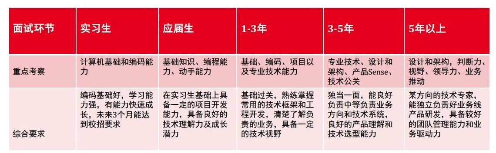
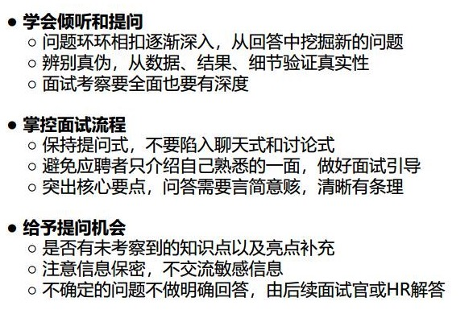

# 笔试通用
line = input()   
data = line.strip().split()    
此时是一个列表数据      

# 3.26阿里面试
阿里面试屁原理都不问    
sd原论文如何训练sd      
最关键的问题：别人已经有很好的训练模型了，你为什么不拿别人开源的微调，还要自己重头训练。直接拿别人的自己还干啥，别人的已经够好了，不用吃饭了    
各种漏洞，有商业化的吗   

# 4.26 小红书校招实习生笔试
小红书校招实习生笔试，大多是小红书背景的一些代码题，感觉都不需要知道lc的一些技巧，就硬写就行，但是挺久        
比较考察字典的应用能力     
选择题喜欢考没听过的小根堆大根堆，比如去掉一个需要交换几次？小换大这种操作      
还会考http版本有几次tcp udp    
随机森林过拟合解决，类别失衡。调整最小分裂样本数，大一些，模型没那么复杂         
均值滤波无法处理高斯噪声，需要高斯滤波（加权平均）（可以去除椒盐噪声：解码时候黑白相间的亮暗点）    
图像与灰度图不是多对一关系       
直方图和感知哈希进行图片相似度查找，前者怎么做？？？          
自助法生成样本，随机抽，多次多轮有放回。计算用计量，分析经验分布。还是不太懂在干什么。加大量进行分析》？？？    
二分类用准确率评估，类别不均衡时再加上精确度召回率roc f1       
均方误差时回归模型的评估指标。不是逻辑回归模型的，因为这是分类模型，应该用上述分类任务指标    
透视变换在室内场景比更实用，因为能保留远近信息，而仿射变换一般用来保留平行信息         
kpm文本匹配算法匹配失败的时候回溯到哪里？》？？？？    
senet本质是在resnet残差处换成0 1权重计算查找，激活函数relu           
三元组向量线性相关分析，首先要绝对值不为0,即无关    
圆周上固定一点到圆周上移动一点距离均值，积分不会算       
进程切换和模式切换复杂区别         
pv信号量数字代表等待进程的个数       

## 字典
dict[1]=[1,2,3]       
dict['a']=[1,2,3]        
dict.update({'a':[1,2,3]})

num_keys = len(dict)

# 面试一般要求

