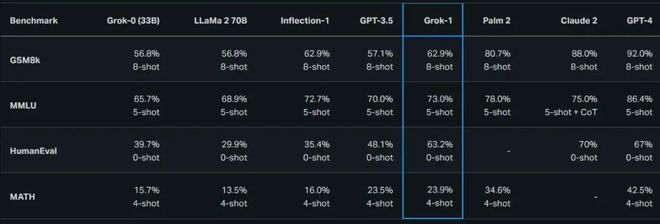
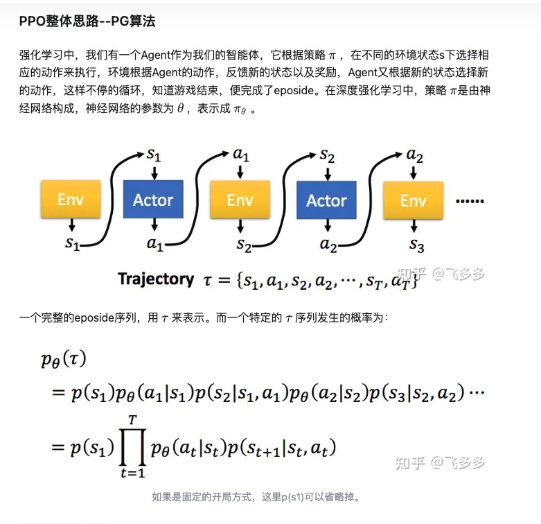

## Grok-1
需8张H100才能运行

具有3140亿参数的Grok-1是迄今为止参数规模最大的开源大语言模型，远超OpenAI GPT-3.5的1750亿参数（未开源）。

同时，Grok-1远超其它开源模型，包括Meta开源的700亿参数的Llama 2，Mistral开源的120亿参数的8x7B，谷歌开源的最高70亿参数的Gemma，也远高于国内阿里、智谱、百川等公司开源的大模型。

Grok-1的架构是xAI在2023年10月使用自定义训练堆栈在JAX和Rust上从头开始训练，采用了混合专家（Mixture-of-Experts，MOE）架构，同时利用了25%的权重来处理给定的标记，从而提高了大模型的训练和推理效率。

xAI还表示，Grok-1基础模型基于大量文本数据训练，未针对特定任务进行微调。但Grok并未公布其训练数据的全部语料库，这也意味着用户无法了解模型的学习来源，因此在开源程度上不如 Pythia、Bloom、OLMo等附带可复现的数据集的模型。

目前，Grok-1的源权重数据大小大约为300GB，其发布版本所使用的训练数据来自截至2023年第三季度的互联网数据和xAI的AI训练师提供的数据。

根据xAI当时公布的Gro-1大模型在衡量数学和推理能力的标准基准测试中，其在GSM8k、MMLU、HumanEval、MATH等测试集上均超过了GPT-3.5、Llama 2（70B）及Inflection-1，但不及谷歌的PaLM 2、Claude2和GPT-4，尤其是在GSM8k上远不如GPT-4达到92%的表现。   
   

## RAG
然而，当面对特定行业或专业领域的深入应用时，通用大模型往往会遇到专业知识不足的挑战。针对这一问题，相对于成本高昂且效果不稳定的SFT或Lora微调方法，基于检索增强生成（Retrieval-Augmented Generation，RAG）的技术方案正成为越来越多企业的优选。    
私域数据微调任务    

外挂私域数据    
RAG架构是一种创新性的解决方案，它通过将大模型的生成能力与外部知识库的检索能力相结合，实现了在回答问题或执行任务时能够引入最新、最准确的专业知识。具体而言，当用户提出问题或需求时，RAG架构首先会在外部知识库中进行向量搜索，通过语义相似度匹配找到相关的专业知识，然后再将这些知识融入到大模型的生成过程中，从而得到更加专业、准确的回答或结果。    

# 强化学习
## RLHF
从人类反馈中强化学习    

## ppo
PPO 是TRPO 的一种改进算法，它在实现上简化了TRPO 中的复杂计算，并且它在实验中的性能大多数情况下会比TRPO 更好，因此目前常被用作一种常用的基准算法。 需要注意的是，TRPO 和PPO 都属于在线策略学习算法，即使优化目标中包含重要性采样的过程，但其只是用到了上一轮策略的数据，而不是过去所有策略的数据。   

