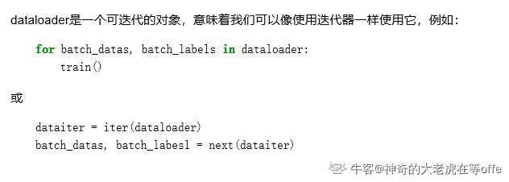

## torch常用操作，代码
.squeeze(0) 是对图像进行操作的一部分。在这里，squeeze 函数用于删除数组的长度为1的维度。在这种情况下，squeeze(0) 的目的是从图像的第一个维度（通常是通道数）中删除大小为1的维度，以便获得一个更简化的表示。      

.unsqueeze(0)在最前面加一个维度 


如果-^tensor 的 reuires grad=True 的，我/不昨直接使用 numpy ,否会报: RunimeEror Can' cal numoyd on rable that reoures orad. Use varde
ch().numpy() instead.
因此我们需要先用 detach() 返回 tensor requires grad=False 的版本，再进行转换

tensor-numpy       
使用 GPU 还有一个点,在我们想把 GPU tensor 转换成 Numpy 变量的时候，需要先将 ensor 转换到 CPU 中去，因为 Numpy是 CPU-ony 的其次，如果 tensor需要求导的话，还需要加一步 detach，再转成 Numpy 。     

反向传播的流程     
loss.backward()     
optimizer.step0) 权重更新    
optimizer.zero grad0) 导数清零-必须的     


PyTorch 使用的是动态图 (Dynamic Computational Graphs) 的方式而 TensorFlow 使用的是静态图(Static Computational Graphs)
动态图，就是每次当我们搭建完一个计算图，然后在反向传播结束之后，整个计算图就在内存中被释放了。如果想再次使用的话，必须从头再搭一遍     
除了动态图之外，PyTorch 还有-个特性，叫 eager execution。意思就是当遇到 tensor 计算的时候，马上就回去执行计算，也就是，实际上 PyTorch 根本不会去建正向计算图，而是遇到操作就执行。真正意义上的正向计算图是把所有的操作都添加完，构建好了之后，再运行神经网络的正向传播。    
动态图和 eacer executon，所以它用起来才这么顺手，简直就和写 PVton 程一样舒服，debug 也非常方便，除此之外，我们以之前的描达也可以看出，PVIorch +分注重占用内存(或显存)大小，没有用的空间释放很及时，可以很有效地利用有限的内存。    


PIL Image的操作包括：     
Scale:调整图片大小，长宽比保持不变    
CenterCrop,RandomCrop,RandomResizedCrop : 裁剪图片      
Pad：填充     
ToTensor: 将PIL Image对象转成Tensor，会自动将[0,255]归一化至[0,1]     
 
对Tensor的操作包括：      
Normaliza: 标准化，即减均值，除以标准差   
ToPILImage: 将Tensor转为PIL Image对象        

如果要对图片进行多个操作，可通过Compose函数将这些操作拼接起来，类似于nn.Sequential。   

        transform = T.Compose([
            T.Resize(224), # 缩放图片(Image)，保持长宽比不变，最短边为224像素
            T.CenterCrop(224), # 从图片中间切出224*224的图片
            T.ToTensor(), # 将图片(Image)转成Tensor，归一化至[0, 1]
            T.Normalize(mean=[.5, .5, .5], std=[.5, .5, .5]) # 标准化至[-1, 1]，规定均值和标准差
        ])


DataLoader函数定义如下：对batch的数据进行操作，同时还需要对数据进行shuffle和并行加速等。
DataLoader(dataset, batch_size=1, shuffle=False, sampler=None, num_workers=0, collate_fn=default_collate, pin_memory=False, drop_last=False)   

        •dataset：加载的数据集(Dataset对象)
        •batch_size：batch size
        •shuffle:：是否将数据打乱
        •sampler： 样本抽样，后续会详细介绍
        •num_workers：使用多进程加载的进程数，0代表不使用多进程
        •collate_fn： 如何将多个样本数据拼接成一个batch，一般使用默认的拼接方式即可
        •pin_memory：是否将数据保存在pin memory区，pin memory中的数据转到GPU会快一些
        •drop_last：dataset中的数据个数可能不是batch_size的整数倍，drop_last为True会将多出来不足一个batch的数据丢弃

     


将Module放在gpu上运行只需两步：分别将模型与数据放在gpu上    
model=model.cuda()  #将模型的所有参数转到gpu   
input.cuda()   #将输入数据也放置到GPU上    
 
如何在多个gpu上并行计算,pytorch提供 了两个函数，可实现简单高效的并行gpu计算    
nn.parallel.data_parallel(module, inputs, device_ids=None, output_device=None, dim=0, module_kwargs=None)    
class torch.nn.DataParallel(module, device_ids=None, output_device=None, dim=0)
通过device_ids参数可以指定在哪些gpu上优化     


model.gpu() 把模型放在gpu上   
model = nn . DataParallel ( model ) 。DataParallel并行的方式，是将输入一个batch的数据均分成多份，分别送到对应的GPU进行计算，各个GPU得到的梯度累加。与Module相关的所有数据也都会以浅复制的方式复制多份，在此需要注意，在module中属性应该是只读的。    


torch.nn：核心数据结构是Module,抽象的概念，既可以表示神经网络某个层layer，也可以表示一个包含很多层的神经网络。常见做法是继承nn.Module,编写自己的层。     

自定义层必须继承nn.Module，并且在其构造函数中需调用nn.Module的构造函数，super(xx,self).__init__()    
在构造函数__init__中必须自定义可学习的参数，并封装成Parameter    
forward函数实现前向传播过程，其输入可以是一个或者多个tensor。无需写反向传播函数，nn.Module能够利用autograd自动实现反向传播，这比function简单的多       


Module中可学习参数可以通过named_parameters()或者parameters()返回迭代器，前者会给每个parameter附上名字，使其更具有辨识度。    
pytorch实现了大部分的layer,这些layer都继承于nn.Module      
nn.conv2d卷积层
AvgPool,Maxpool,AdaptiveAvgPool
TransposeConv逆卷积
nn.Linear全连接层
nn.BatchNorm1d(1d,2d,3d)
nn.dropout
nn.ReLU
nn.Sequential


```
# Sequential的三种写法
net1 = nn.Sequential()
net1.add_module('conv', nn.Conv2d(3, 3, 3))
net1.add_module('batchnorm', nn.BatchNorm2d(3))
net1.add_module('activation_layer', nn.ReLU())
 
net2 = nn.Sequential(
        nn.Conv2d(3, 3, 3),
        nn.BatchNorm2d(3),
        nn.ReLU()
        )
 
from collections import OrderedDict
net3= nn.Sequential(OrderedDict([
          ('conv1', nn.Conv2d(3, 3, 3)),
          ('bn1', nn.BatchNorm2d(3)),
          ('relu1', nn.ReLU())
        ]))
print('net1:', net1)
print('net2:', net2)
print('net3:', net3)
```
nn.LSTM(4,3,1) 输入向量4维，隐藏元3,1层    
nn.LSTMCell(4,3) 对应层数只能是一层    
nn.Embedding(4,5)4个词，每个词使用5个向量表示   


作者：神奇的大老虎在等offer
链接：https://ac.nowcoder.com/discuss/1050933?type=2&page=0&channel=-1
来源：牛客网

损失函数也是nn.Module的子类。nn.CrossEntropLoss()     loss = criterion(score,label)     
torch.optim 将深度学习常用优化方法全部封装在torch.optim中，所有优化方法继承基类optim.Optimizer，并实现了自己的优化步骤    
optimizer = optim.SGD(param=net.parameters(),lr=1)     
optimizer.zero_grad() #梯度清零，等价于net.zero_grad()    
input = t.randn(1,3,32,32)    
output = net(input)      
output.backward(output)     
optimizer.step()       

```

# 为不同子网络设置不同的学习率，在finetune中经常用到
# 如果对某个参数不指定学习率，就使用最外层的默认学习率
optimizer =optim.SGD([
                {'params': net.features.parameters()}, # 学习率为1e-5
                {'params': net.classifier.parameters(), 'lr': 1e-2}
            ], lr=1e-5)
```

