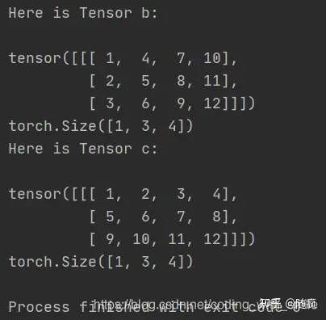
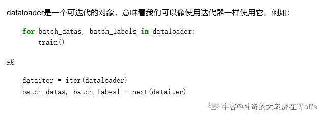
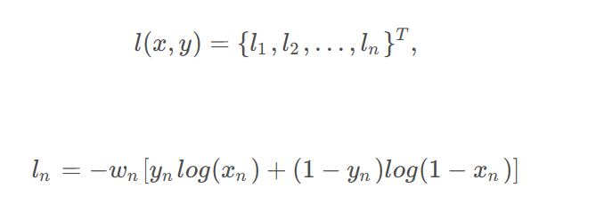
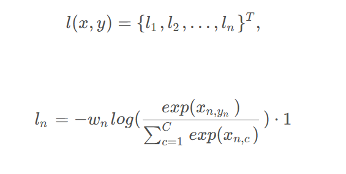
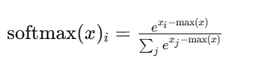
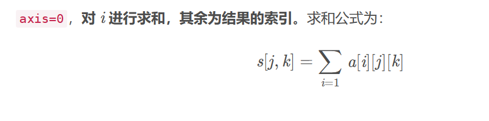

## torch常用操作，代码


如果-^tensor 的 reuires grad=True 的，我/不昨直接使用 numpy ,否会报: RunimeEror Can' cal numoyd on rable that reoures orad. Use varde
ch().numpy() instead.
因此我们需要先用 detach() 返回 tensor requires grad=False 的版本，再进行转换

tensor-numpy       
使用 GPU 还有一个点,在我们想把 GPU tensor 转换成 Numpy 变量的时候，需要先将 ensor 转换到 CPU 中去，因为 Numpy是 CPU-ony 的其次，如果 tensor需要求导的话，还需要加一步 detach，再转成 Numpy 。     

反向传播的流程     
loss.backward()     
optimizer.step0) 权重更新    
optimizer.zero grad0) 导数清零-必须的     


PyTorch 使用的是动态图 (Dynamic Computational Graphs) 的方式而 TensorFlow 使用的是静态图(Static Computational Graphs)
动态图，就是每次当我们搭建完一个计算图，然后在反向传播结束之后，整个计算图就在内存中被释放了。如果想再次使用的话，必须从头再搭一遍     
除了动态图之外，PyTorch 还有-个特性，叫 eager execution。意思就是当遇到 tensor 计算的时候，马上就回去执行计算，也就是，实际上 PyTorch 根本不会去建正向计算图，而是遇到操作就执行。真正意义上的正向计算图是把所有的操作都添加完，构建好了之后，再运行神经网络的正向传播。    
动态图和 eacer executon，所以它用起来才这么顺手，简直就和写 PVton 程一样舒服，debug 也非常方便，除此之外，我们以之前的描达也可以看出，PVIorch +分注重占用内存(或显存)大小，没有用的空间释放很及时，可以很有效地利用有限的内存。    


### 数据处理

PIL Image的操作包括：     
Scale:调整图片大小，长宽比保持不变    
CenterCrop,RandomCrop,RandomResizedCrop : 裁剪图片      
Pad：填充     
ToTensor: 将PIL Image对象转成Tensor，会自动将[0,255]归一化至[0,1]     
 
对Tensor的操作包括：      
Normaliza: 标准化，即减均值，除以标准差   
ToPILImage: 将Tensor转为PIL Image对象        

如果要对图片进行多个操作，可通过Compose函数将这些操作拼接起来，类似于nn.Sequential。   

        transform = T.Compose([
            T.Resize(224), # 缩放图片(Image)，保持长宽比不变，最短边为224像素
            T.CenterCrop(224), # 从图片中间切出224*224的图片
            T.ToTensor(), # 将图片(Image)转成Tensor，归一化至[0, 1]
            T.Normalize(mean=[.5, .5, .5], std=[.5, .5, .5]) # 标准化至[-1, 1]，规定均值和标准差
        ])

.squeeze(0) 是对图像进行操作的一部分。在这里，squeeze 函数用于删除数组的长度为1的维度。在这种情况下，squeeze(0) 的目的是从图像的第一个维度（通常是通道数）中删除大小为1的维度，以便获得一个更简化的表示。      

.unsqueeze(0)在最前面加一个维度 

transpose       
维度交换，也就是转置      
view      
对张量重新进行维度定义  
        import torch

        a = torch.tensor([[[1, 2, 3],
                        [4, 5, 6],
                        [7, 8, 9],
                        [10, 11, 12]]])
        print(a.shape)

        b = a.transpose(1, 2)
        c = a.view((1, 3, -1))
        print("Here is Tensor b:\n")
        print(b)
        print(b.shape)
        print("Here is Tensor c:\n")
        print(c)
        print(c.shape)
        
很明显，transpose方法对a的后两维进行了转置交换，而view方法则是以行序对所有元素重新设定维度。       


### DataLoader
TensorDataset, Dataset单纯打包数据。     
DataLoader函数定义如下：**对batch的数据进行操作**，同时还需要对数据进行**shuffle和并行加速**等。
DataLoader(dataset, batch_size=1, shuffle=False, sampler=None, num_workers=0, collate_fn=default_collate, pin_memory=False, drop_last=False)   

        •dataset：加载的数据集(Dataset对象)
        •batch_size：batch size
        •shuffle:：是否将数据打乱
        •sampler： 样本抽样，后续会详细介绍
        •num_workers：使用多进程加载的进程数，0代表不使用多进程
        •collate_fn： 如何将多个样本数据拼接成一个batch，一般使用默认的拼接方式即可
        •pin_memory：是否将数据保存在pin memory区，pin memory中的数据转到GPU会快一些
        •drop_last：dataset中的数据个数可能不是batch_size的整数倍，drop_last为True会将多出来不足一个batch的数据丢弃

     


将Module放在gpu上运行只需两步：分别将模型与数据放在gpu上    
model=model.cuda()  #将模型的所有参数转到gpu   
input.cuda()   #将输入数据也放置到GPU上    
 
如何在多个gpu上并行计算,pytorch提供 了两个函数，可实现简单高效的并行gpu计算    
nn.parallel.data_parallel(module, inputs, device_ids=None, output_device=None, dim=0, module_kwargs=None)    
class torch.nn.DataParallel(module, device_ids=None, output_device=None, dim=0)
通过device_ids参数可以指定在哪些gpu上优化     


model.gpu() 把模型放在gpu上   
model = nn . DataParallel ( model ) 。DataParallel并行的方式，是将输入一个batch的数据均分成多份，分别送到对应的GPU进行计算，各个GPU得到的梯度累加。与Module相关的所有数据也都会以浅复制的方式复制多份，在此需要注意，在module中属性应该是只读的。    

### nn
torch.nn：核心数据结构是Module,抽象的概念，既可以表示神经网络某个层layer，也可以表示一个包含很多层的神经网络。常见做法是继承nn.Module,编写自己的层。     

自定义层必须继承nn.Module，并且在其构造函数中需调用nn.Module的构造函数，super(xx,self).__init__()    
在构造函数__init__中必须自定义可学习的参数，并封装成Parameter    
forward函数实现前向传播过程，其输入可以是一个或者多个tensor。无需写反向传播函数，nn.Module能够利用autograd自动实现反向传播，这比function简单的多       


Module中可学习参数可以通过named_parameters()或者parameters()返回迭代器，前者会给每个parameter附上名字，使其更具有辨识度。    
pytorch实现了大部分的layer,这些layer都继承于nn.Module      
nn.conv2d卷积层
AvgPool,Maxpool,AdaptiveAvgPool
TransposeConv逆卷积
nn.Linear全连接层
nn.BatchNorm1d(1d,2d,3d)
nn.dropout
nn.ReLU
nn.Sequential


```
# Sequential的三种写法
net1 = nn.Sequential()
net1.add_module('conv', nn.Conv2d(3, 3, 3))
net1.add_module('batchnorm', nn.BatchNorm2d(3))
net1.add_module('activation_layer', nn.ReLU())
 
net2 = nn.Sequential(
        nn.Conv2d(3, 3, 3),
        nn.BatchNorm2d(3),
        nn.ReLU()
        )
 
from collections import OrderedDict
net3= nn.Sequential(OrderedDict([
          ('conv1', nn.Conv2d(3, 3, 3)),
          ('bn1', nn.BatchNorm2d(3)),
          ('relu1', nn.ReLU())
        ]))
print('net1:', net1)
print('net2:', net2)
print('net3:', net3)
```
nn.LSTM(4,3,1) 输入向量4维，隐藏元3,1层    
nn.LSTMCell(4,3) 对应层数只能是一层    
nn.Embedding(4,5)4个词，每个词使用5个向量表示   


损失函数也是nn.Module的子类。nn.CrossEntropLoss()     loss = criterion(score,label)     

### optim
torch.optim 将深度学习常用优化方法全部封装在torch.optim中，所有优化方法继承基类optim.Optimizer，并实现了自己的优化步骤    
optimizer = optim.SGD(param=net.parameters(),lr=1)     
optimizer.zero_grad() #梯度清零，等价于net.zero_grad()    
input = t.randn(1,3,32,32)    
output = net(input)      
output.backward(output)     
optimizer.step()       

```

# 为不同子网络设置不同的学习率，在finetune中经常用到
# 如果对某个参数不指定学习率，就使用最外层的默认学习率
optimizer =optim.SGD([
                {'params': net.features.parameters()}, # 学习率为1e-5
                {'params': net.classifier.parameters(), 'lr': 1e-2}
            ], lr=1e-5)
```


### loss
#### BCEloss         
        
主要用于计算标签只有1或者0时的**二分类损失**，标签和预测值是一一对应的。需要注意的是，通过nn.BCEloss来计算损失前，需要对预测值进行一次sigmoid计算。      

使用nn.BCEloss计算损失    

        import torch
        import torch.nn as nn
        import torch.nn.functional as F

        loss = nn.BCELoss(reduction="none")
        target = torch.tensor([1,0,1], dtype=torch.float32)
        predict = torch.tensor([0.8, 0.2, 0.3], dtype=torch.float32)
        loss(F.sigmoid(predict), target)

        #结果计算为：
        tensor([0.3711, 0.7981, 0.5544])

手动实现nn.BCEloss     

        def myBceloss(predict, target, reduction="none"):

                predict = F.sigmoid(predict)
                if reduction == "none":
                        return -(target*torch.log(predict) + (1-target)*torch.log(1-predict))
                
        myBceloss(predict, target)

        #结果计算为：
        tensor([0.3711, 0.7981, 0.5544])


#### CrossEntropyLoss
     
用于计算多分类任务，一个标签可能对应了预测的多个概率，例如一个任务包含了C个类别，那么预测值就有C个。       
使用nn.CrossEntropyLoss计算损失  

        loss2 = nn.CrossEntropyLoss(reduction="none")
        target2 = torch.tensor([0, 1, 2])
        predict2 = torch.tensor([[0.9, 0.2, 0.8], [0.5, 0.2, 0.4], [0.4, 0.2, 0.9]])
        loss2(predict2, target2)

        #结果计算为：
        tensor([0.8761, 1.2729, 0.7434])
手动实现nn.CrossEntropyLoss(使用torch的其他函数)        

        def myCrossEntropyloss(target, predict, reduction="none"):
                if reduction == "none":
                        predict = F.softmax(predict, dim=1)
                        n = torch.arange(predict.shape[0])
                        predict = predict[n, target] #花式索引, 首先是遍历每一行，然后是取出标签指定位置算出的softmax
                        return -torch.log(predict)
        myCrossEntropyloss(target2, predict2)
        #结果计算为：
        tensor([0.8761, 1.2729, 0.7434])
手动实现nn.CrossEntropyLoss(使用numpy)   

        import numpy as np

        def myCrossEntropyLoss(target, predict, reduction="none"):
        if reduction == "none":
                # 对预测结果进行 softmax 操作
                predict = np.exp(predict - np.max(predict, axis=1, keepdims=True))
                predict /= np.sum(predict, axis=1, keepdims=True)

                # 生成一个序列，范围是 [0, 1, 2, ..., predict.shape[0]-1]
                n = np.arange(predict.shape[0])

                # 选取每个样本中对应类别的预测概率，并计算负对数似然
                predict = predict[n, target]
                return -np.log(predict)

        # 使用函数，并传入 target2 和 predict2 作为参数
        loss = myCrossEntropyLoss(target2, predict2)
      
减去最大值的操作在计算softmax时是一种数值稳定性的技巧，通常被称为“max trick”或“max normalization”。这个技巧的目的是避免指数运算时出现数值上溢或下    
当输入中存在较大的值时，其指数运算结果可能非常大，导致数值溢出，而较小的值可能导致数值下溢。

通过减去最大值，可以确保指数运算的输入值都是负数或零，从而避免了数值上溢的问题。具体来说，减去最大值相当于在指数运算前对所有输入进行平移，这不会改变softmax的相对概率关系，但有助于数值计算的稳定性。


### init, forward
当你在PyTorch中创建一个包含forward方法的类的实例时，调用这个实例时会自动执行forward方法，触发模型的前向传播计算。这是因为在PyTorch中，模型的forward方法定义了模型在输入数据上的操作，而实例的调用会自动调用forward方法。      
PyTorch利用这种机制来方便用户进行模型的使用和计算。       
```
import torch.nn as nn

class MyModel(nn.Module):
    def __init__(self):
        super(MyModel, self).__init__()
        # 定义模型的层和参数

    def forward(self, x):
        # 定义前向传播操作
        # ...
        return output


model = MyModel() # 在这里修改init参数
input_data = torch.randn(1, 3, 224, 224)  # 举例输入数据
output = model(input_data)

```

### torch.linspace(1, 10, 10)
start end step样本数    
线性空间      
tensor([ 1.,  2.,  3.,  4.,  5.,  6.,  7.,  8.,  9., 10.])           


## numpy
### arange random
for循环时range()    

X = torch.randn(1000,input_size)      
y = torch.randint(0, 3, (1000, output_size), dtype = torch.float32)     
torch用randn, randint，对应到np.random底下，          

        # 随机生成数据，大小为10 * 20列
        source_data = np.random.rand(10, 20)
        # 随机生成标签，大小为10 * 1列
        source_label = np.random.randint(0,2,(10, 1))

np.arange(n)对应torch.linspace      
该函数用于创建一个等差数组，其中包含从0开始到n-1的整数。        
[0 1 2 3 4]         

### 花式索引（Fancy Indexing）
花式索引（Fancy Indexing）是指使用整数数组或布尔数组来访问数组元素的一种索引方式。在Python中，主要用于NumPy和类似库(torch)中。这种索引方式允许你以一种灵活而强大的方式从数组中选择元素。       
整数数组索引     
import numpy as np

        # 创建一个二维数组
        arr = np.array([[1, 2, 3],
                        [4, 5, 6],
                        [7, 8, 9]])

        # 使用整数数组索引选择元素
        indices = np.array([0, 2])
        result = arr[:, indices]

        print(result)
        [[1 3]
        [4 6]
        [7 9]]

        indices1 = np.array([0, 1, 2])
        indices2 = np.array([1, 2, 2])
        result = arr[indices1, indices2]

        print(result)
        [2 6 9]

在这个例子中，result 将是原数组的所有行，但仅包括第0列和第2列的元素。   
布尔数组索引： 使用一个布尔数组来指定要选择的元素的位置，其中布尔数组的True表示选择对应位置的元素，False表示不选择。   

        import numpy as np

        # 创建一个二维数组
        arr = np.array([[1, 2, 3],
                        [4, 5, 6],
                        [7, 8, 9]])

        # 使用布尔数组索引选择元素
        mask = (arr > 3)
        result = arr[mask]

        print(result)
        [4 5 6 7 8 9]

### np.sum axis
总感觉反过来了    
np.sum(arr, axis=0)沿着第一个维度（行）求和     
在第一个维度上的元素间进行求和      
      
相当于for i += arr[i][:] 或者arr[i, :]

还是有些绕              
np.sum(arr, axis=1)    
for i += arr[:, i]       
即 = arr[:, 0] + arr[:, 1] + arr[:, 2]        
在第二个维度上的元素间进行求和       
        import numpy as np

        arr = np.array([[1, 2, 3],
                        [4, 5, 6]])

        # 沿着第一个维度（行）求和，不保持维度
        sum_without_keepdims = np.sum(arr, axis=0)

        # 沿着第一个维度（行）求和，保持维度
        sum_with_keepdims = np.sum(arr, axis=0, keepdims=True)

        print("Sum without keepdims:")
        print(sum_without_keepdims)
        print("Shape without keepdims:", sum_without_keepdims.shape)

        print("\nSum with keepdims:")
        print(sum_with_keepdims)
        print("Shape with keepdims:", sum_with_keepdims.shape)


        arr = np.array([[1, 2, 3],
                        [4, 5, 6]])
        print(arr[:, 1])
        # print的结果也不会保留维度，[2 5]
        # 沿着第2个维度求和，不保持维度
        sum_without_keepdims = np.sum(arr, axis=1)

        # 沿着第2个维度求和，保持维度
        sum_with_keepdims = np.sum(arr, axis=1, keepdims=True)

        print("Sum without keepdims:")
        print(sum_without_keepdims)
        print("Shape without keepdims:", sum_without_keepdims.shape)

        print("\nSum with keepdims:")
        print(sum_with_keepdims)
        print("Shape with keepdims:", sum_with_keepdims.shape)

        Sum without keepdims:
        [5 7 9]
        Shape without keepdims: (3,)

        Sum with keepdims:
        [[5 7 9]]
        Shape with keepdims: (1, 3)
        Sum without keepdims:
        [ 6 15]
        Shape without keepdims: (2,)

        Sum with keepdims:
        [[ 6]
        [15]]
        Shape with keepdims: (2, 1)


### np.max axis
    >>> a = np.arange(4).reshape((2,2))
    >>> a
    array([[0, 1],
           [2, 3]])
    >>> np.amax(a)           # Maximum of the flattened array
    3
    >>> np.amax(a, axis=0)   # Maxima along the first axis
    array([2, 3])
    >>> np.amax(a, axis=1)   # Maxima along the second axis
    array([1, 3])
推测源码可能是            
np.amax(a, axis=0)      
for循环遍历i所在维度以外的元素，a[i, :]对于i所在维度以外的元素保持一致，此时i不断变换，寻找max      
**for i : =max(max, cur_i)**        
推测源码      
绝对不是这个：max([i, :])      


## transforms
transforms.Resize([h, w])
将图片短边缩短至size (int)，长宽比保持不变        
transforms.Resize(size)       
一般输入深度网络的特征图长宽是相等的，需要同时制定长宽      
transforms.Resize([h, w]        