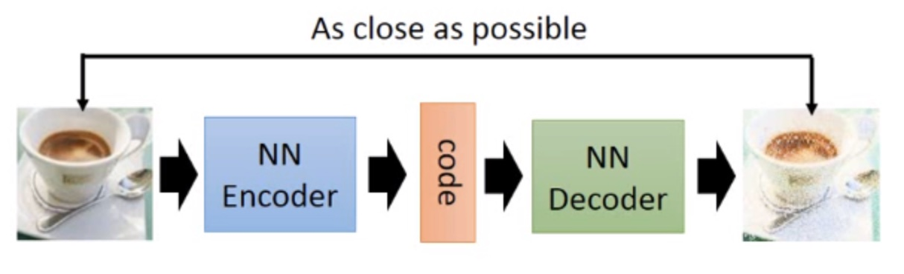
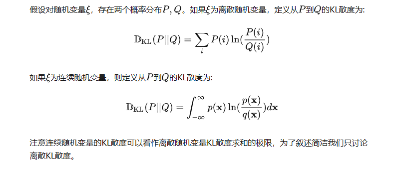
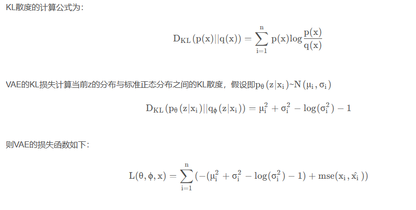

# 问题汇总
！ ae,vae,vqvae的区别？     
! 各种iou       
！ clip训练过程         
图图相似度度量方法        
! 相同衣服识别         
tokenizer-bpe, embedding           
! lora具体怎么加         
lora训练不稳定是因为什么，怎么解决       
lora训练案例以及图像收集？？？        
! yolov5正负样本匹配详细规则（???进而自己可以考虑为什么yolov8无锚框）???????           
比赛改的模型      
中文文生图只使用1m数据是否太少？      
vae的分布和diffusion的分布有什么区别      


## ae,vae,vqvae的区别？      
AE（自动编码器）、VAE（变分自动编码器）、VQ-VAE（向量量化变分自编码器） 的区别和联系？    
AE主要用于数据的压缩与还原，VAE主要用于生成。     
AE是将数据映直接映射为数值code（确定的数值），而VAE是先将数据映射为分布，再从分布中采样得到数值code。    
损失函数和优化目标不同      

### AE
Auto Encoder, 自动编码器      
AE的结构        
       
那么如果我们任意给一个隐变量，输入解码器，可以得到一张有具体含义的图像吗？不能。因为AE的训练过程更像数据压缩，而不是数据生成。       
此外，AE也不具有随机性。模型训练好之后，同一张图像反复输入AE，隐变量和输出都是固定的。      
因此，AE只能拿来做压缩，不能拿来做生成。    

这时候我们只要拿出Decoder部分，随机生成一个code然后输入，就可以得到一张生成的图像。但实际上这样的生成效果并不好（下面解释原因），因此AE多用于数据压缩，而数据生成则使用下面所介绍的VAE更好。         
模型会过拟合，泛化性能不好。也就是说对于一个训练好的AE，输入某个图片，就只会将其编码为某个确定的code，输入某个确定的code就只会输出某个确定的图片，如果这个latent code来自于没见过的图片，那么生成的图片也不会好。     
假设我们训练好的AE将“新月”图片encode成code=1（这里假设code只有1维），将其decode能得到“新月”的图片；将“满月”encode成code=10，同样将其decode能得到“满月”图片     
这时候如果我们给AE一个code=5，我们希望是能得到“半月”的图片，但由于之前训练时并没有将“半月”的图片编码，或者将一张非月亮的图片编码为5，那么我们就不太可能得到“半月”的图片。     
因此AE多用于数据的压缩和恢复，用于数据生成时效果并不理想。      
我理解为多样性不强，过拟合，固定化          

模型   

    import torch
    from torch import nn
    from torch.autograd import Variable
    
    
    # Define the encoder and decoder networks
    class Encoder(nn.Module):
        def __init__(self, input_dim, latent_dim):
            super(Encoder, self).__init__()
            self.fc1 = nn.Linear(input_dim, latent_dim)
    
        def forward(self, x):
            x = torch.relu(self.fc1(x))
            return x
    
    
    class Decoder(nn.Module):
        def __init__(self, latent_dim, output_dim):
            super(Decoder, self).__init__()
            self.fc1 = nn.Linear(latent_dim, output_dim)
    
        def forward(self, x):
            x = torch.sigmoid(self.fc1(x))
            return x
    
    
    class Autoencoder(nn.Module):
        def __init__(self, input_dim, latent_dim):
            super(Autoencoder, self).__init__()
            self.encoder = Encoder(input_dim, latent_dim)
            self.decoder = Decoder(latent_dim, input_dim)
    
        def forward(self, x):
            x = self.encoder(x)
            x = self.decoder(x)
            return x

    # 生图
    # Initialize the autoencoder
    input_dim = 784  # Assuming input is a flattened 28x28 image
    latent_dim = 20  
    autoencoder = Autoencoder(input_dim, latent_dim)
    latent_vector = torch.randn(latent_dim)
    
    # Generate a new image by passing the latent vector through the decoder
    with torch.no_grad(): 
        generated_image = autoencoder.decoder(latent_vector)


### VAE（变分自动编码器）
转变思路，不将图片映射成“数值编码”，而将其映射成“分布”       
我们将“新月”图片映射成μ=1的正态分布，那么就相当于在1附近加了噪声，此时不仅1表示“新月”，1附近的数值也表示“新月”，只是1的时候最像“新月”。将"满月"映射成μ=10的正态分布，10的附近也都表示“满月”。那么code=5时，就同时拥有了“新月”和“满月”的特点，那么这时候decode出来的大概率就是“半月”了。这就是VAE的思想。          
VAE的结构     
             
VAE的encoder输出的是若干个正态分布的均值和标准差。然后从中进行采样得到隐变量Z，再送入解码器得到输出。   


VAE的loss
     

VAE计算以下两方面之间的损失：     

重构损失（Reconstruction Loss）：这一部分的损失计算的是输入数据与重构数据之间的差异。     
mse        
为了满足mse. 随着训练不断进行，模型会倾向于产生固定的Z，即encoder输出的标准差接近0，VAE就会越来越像AE，这也就和我们的初衷相违背了。因此，我们要求N(mean, std)要逼近标准正态分布，这里使用KL散度来进行约束。      
    

KL散度（Kullback-Leibler Divergence Loss）：这一部分的损失衡量的是学习到的潜在表示的分布与先验分布（通常假设为标准正态分布）之间的差异。KL散度是一种`衡量两个概率分布相似度`的指标，VAE通过最小化KL散度来确保学习到的潜在表示的分布尽可能接近先验分布。这有助于模型生成性能的提升，因为它约束了潜在空间的结构，使其更加规整，便于采样和推断。        

编码器输出的只是正态分布的参数mean和std

在VAE中，通常使用平均二乘误差（Mean Squared Error，MSE）或二分类交叉熵（Binary Crossentropy）作为重构损失。       
bce为什么能作为重构损失？？        

  
   

1）Encoder    
image --> 均值 + 标准差      

    import torch
    from torch import nn
    from torch.nn import functional as F
    
    # Encoder class definition
    class Encoder(nn.Module):
        def __init__(self, input_dim, hidden_dim, latent_dim):
            super(Encoder, self).__init__()
            # 使用FC将输入变为隐藏层hidden_dim
            self.fc1 = nn.Linear(input_dim, hidden_dim)
            # Two fully connected layers to produce mean and log variance
            # These will represent the latent space distribution parameters
            self.fc21 = nn.Linear(hidden_dim, latent_dim) # 隐藏层hidden_dim --> 均值Mean μ
            self.fc22 = nn.Linear(hidden_dim, latent_dim) # 隐藏层hidden_dim --> 标准差Log variance σ
    
        def forward(self, x):
            # 使用RELU非线性变换，增加网络的表达能力
            h1 = F.relu(self.fc1(x))
            # Return the mean and log variance for the latent space
            return self.fc21(h1), self.fc22(h1)


2）Decoder

    # Decoder class definition
    class Decoder(nn.Module):
        def __init__(self, latent_dim, hidden_dim, output_dim):
            super(Decoder, self).__init__()
            # latent_dim --> hidden_dim
            self.fc3 = nn.Linear(latent_dim, hidden_dim)
            # hidden_dim --> output_dim（输出的图像）
            self.fc4 = nn.Linear(hidden_dim, output_dim)
    
        def forward(self, z):
            h3 = F.relu(self.fc3(z))

3）VAE     

    # VAE class definition
    # Encode the input --> reparameterize --> decode
    class VAE(nn.Module):
        def __init__(self, input_dim, hidden_dim, latent_dim):
            super(VAE, self).__init__()
            self.encoder = Encoder(input_dim, hidden_dim, latent_dim)
            self.decoder = Decoder(latent_dim, hidden_dim, input_dim)
    
        def reparameterize(self, mu, logvar):
            # Reparameterization trick to sample from the distribution represented by the mean and log variance
            std = torch.exp(0.5*logvar)
            #标准差（standard deviation）,对数方差（log variance）,对logaM中M的n次方有=nlogaM
            eps = torch.randn_like(std)
            #生成了一个与std相同大小的随机张量eps，其中的值是从均值为0、标准差为1的正态分布中采样得到的。这里的目的是生成一个与潜在变量空间大小相同的随机扰动，以便在潜在空间中进行采样。
            return eps.mul(std).add_(mu)
            #对随机扰动eps进行了缩放和平移，以生成最终的采样数据。首先，将扰动乘以标准差std，这个操作使得扰动的大小受到潜在空间每个维度不同的方差影响，然后将均值mu加到结果中。这样做的目的是将扰动应用到潜在空间的平均值上，从而生成最终的采样数据点。

            #从给定的均值和对数方差参数化的高斯分布中采样数据点
    
        def forward(self, x):
            mu, logvar = self.encoder(x.view(-1, input_dim))
            z = self.reparameterize(mu, logvar)
            return self.decoder(z), mu, logvar


Loss

    # Loss function for VAE
    def vae_loss_function(recon_x, x, mu, logvar):
        # Binary cross entropy between the target and the output
        BCE = F.binary_cross_entropy(recon_x, x.view(-1, input_dim), reduction='sum')
        # KL divergence loss ： 学习到的潜在表示的分布 <-->  先验分布(标准正态分布)
        KLD = -0.5 * torch.sum(1 + logvar - mu.pow(2) - logvar.exp())
        return BCE + KLD

训练过程

    # Hyperparameters
    input_dim = 784 # Assuming input is a flattened 28x28 image (e.g., from MNIST)
    hidden_dim = 400
    latent_dim = 20
    epochs = 10
    learning_rate = 1e-3
    
    # Initialize VAE
    vae = VAE(input_dim, hidden_dim, latent_dim)
    optimizer = torch.optim.Adam(vae.parameters(), lr=learning_rate)
    
    # Training process function
    for epoch in range(epochs):
        vae.train()  # Set the model to training mode
        train_loss = 0
        for batch_idx, (data, _) in enumerate(data_loader):
            optimizer.zero_grad()  # Zero the gradients
            recon_batch, mu, logvar = vae(data)  # Forward pass through VAE
            loss = vae_loss_function(recon_batch, data, mu, logvar)  # Compute the loss
            loss.backward()  # Backpropagate the loss
            train_loss += loss.item()
            optimizer.step()


编码器输出的只是正态分布的参数mean和std，隐变量是从该分布中采样出来的。但是采样这个操作，是不可导的，导致loss无法反向传播到编码器，从而更新编码器的参数。?????               
为了解决这个问题，VAE中使用了一个重参数技巧，即从标准正态分布N(0, 1)中先采样出一个隐变量，再用编码器输出的mean和std对其进行变换。这也就等同于从N(mean, std)中采样了一个隐变量。???????     
为什么解决了？？？？      
         


       
3，VAE中隐藏的“对抗”思想    
重构的过程是希望没噪声的，而KL loss则希望有高斯噪声的，两者是对立的。所以，VAE跟GAN一样，内部其实是包含了一个对抗的过程，只不过它们两者是混合起来，共同进化的。       
虽然encoder生成的分布需要向标准正态分布看齐，但是它不可能真的成为标准正态分布，否则这个分布就和输入没有关系了。因此最终的结果是，该分布保留了一定的输入的信息，又具备生成能力。        

5，VAE叫做变分自编码器，它和变分到底有什么关系？

KL散度是为了度量两个概率分布之间的差异。如果两个分布相等，那么KL散度为0。KL散度的一个主要性质是非负性，因此最小化KL散度的结果就是使得两个分布尽可能相等，这一点的严格证明要用到变分法，这里正是VAE中的V的来源。   


#### vae的分布和diffusion的分布有什么区别      
都是从隐变量 z  
 生成目标数据 x 
 。它们假设隐变量服从某种常见的概率分布（比如正态分布）
然后希望训练一个模型 x = g(z)
 ，这个模型将原来的概率分布映射到训练集的概率分布，也就是分布的变换。       
VAE和GAN的本质都是概率分布的映射。     
这个隐变量会经过一个生成器生成一组目标数据。VAE和GAN都希望这组数据的分布 x^
 和目标分布 x
 尽量接近。    

因为KL散度是针对两个已知的概率分布求相似度的，而 x^
 和 x
 的概率分布目前都是未知。     
GAN的做法就是直接把这个度量标准也学过来就行???????，相当生猛。但是这样做的问题在于依然不interpretable，非常不优雅。VAE的做法就优雅很多了       
      
上式中，p(x|z)
 称为后验分布，p(z) 
 称为先验分布。隐变量是z        
生成模型的输入是x,输出是p(x)        

VAE的核心:          
我们不仅假设 p(z)
 是正态分布，而且假设每个 p(xk | z)
 也是正态分布。      

有 k
 个 x
 sample，就有 k
 个正态分布 p(xk | z)         
 想方设法获得这 k
 个正态分布了     
拟合！但是要注意，这里的拟合与GAN不同，本质上是在学习 xk
 和 z
 的关系，而非学习比较 x
 与 x^
 的标准。   

已知是正态分布，学什么才能确定这个正态分布？没错，均值和方差。怎么学？有数据啊！ 
 z 是你自己假设的， xk
 是已知的，那你就用这俩去学个均值和方差。    

VAE的Variational到底是个啥       
 由于我们通过最小化 D^2(xk | xk^)
 来训练右边的生成器，最终模型会逐渐使得 xk
 和 xk^
 趋于一致。但是注意，因为 zk
 是重新随机采样过的，而不是直接通过均值和方差encoder学出来的，这个生成器的输入 z
 是有噪声的。但是仔细思考一下，这个噪声的大小其实就用方差来度量。为了使得分布的学习尽量接近，我们希望噪声越小越好，所以我们会尽量使得方差趋于 0。      
但是方差不能为 0，因为我们还想要给模型一些训练难度。如果方差为 0，模型永远只需要学习高斯分布的均值，这样就`丢失了随机性，VAE就变成AE`了……这就是为什么VAE要在AE前面加一个Variational：我们希望方差能够持续存在，从而带来噪声！      
那如何解决这个问题呢？其实保证有方差就行     

VAE给出了一个优雅的答案：不仅需要保证 z 有方差，还要让所有 p(z | x)
 趋于标准正态分布 N(0, I)
 ！为什么要这么做呢？这里又需要一个小小的数学推导：
     
如果所有 p(z | x)
 都趋于  N(0, I)
 ，那么我们可以保证 p(z)
 也趋于  N(0, I)     

那怎么让所有 p(z | x)
 趋于 N(0, I)
 呢？加loss 需要数学推导    

         
均值和方差的计算本质上都是encoder。也就是说，VAE其实利用了两个encoder去分别学习均值和方差。    
最小化方差 D^2(xk | xk^)      

VAE的本质     
VAE在AE的基础上对均值的encoder添加高斯噪声（正态分布的随机采样），使得decoder（就是右边那个生成器）有噪声鲁棒性      
为了防止噪声消失，将所有 p(z | x)
 趋近于标准正态分布，将encoder的均值尽量降为 0，而将方差尽量保持住。????????    
这样一来，当decoder训练的不好的时候，整个体系就可以降低噪声；当decoder逐渐拟合的时候，就会增加噪声。     
本质上，是不是和GAN很像？！要我命名，我也可以叫VAE是生成对抗encoder       


VAE有一个做了好几年的核心问题。大家思考一下，上面的VAE中，变分后验 p(x | z)
 是怎么获得的？是学出来的！用  D^2(xk | xk^)
 当loss，去学这个  p(x | z)
 。学这个变分后验就有五花八门的方法了      
 除了上面说的拟合法，还有用纯数学来做的，甚至有用BERT这种PLM来做的     
VAE的框架：必须想办法设计一个生成器 g(z) = x
 ，使得变分后验分布 p(x | z)
 尽量真实。这种方法的问题在于，这个变分后验 p(x | z)
 的表达能力与计算代价是不可兼得的。换句话说，简单的变分后验表达并不丰富（例如数学公式法），而复杂的变分后验计算过于复杂（例如PLM法）。

GAN其实就是简单粗暴，没有任何encoder，直接训练生成器，唯一的难度在于判别器（就是下图这个“它们的分布相等吗”的东西）不好做。     
      

VAE本质是一个基于梯度的encoder-decoder架构，encoder用来学高斯分布的均值和方差，decoder用变分后验来学习生成能力，     


### VQ-VAE
VQ-VAE是首个提出codebook机制的生成模型。
相比于普通的VAE，VQ-VAE利用codebook机制把图像编码成离散矩阵（即矩阵中每个值是codebook中特征的索引值）    

VQ（向量量化），主要是因为将连续潜在空间的点映射到最近的一组离散的向量（即码本中的向量）上    
VQ-VAE的全称是Vector Quantized-Variational AutoEncoder，即向量量化变分自编码器。这是一种结合了变分自编码器（VAE）和向量量化（VQ）技术的深度学习模型   
向量量化的过程实质上是将连续潜在空间的点映射到最近的一组离散的向量（即码本中的向量）上   
这有助于模型捕捉和表示更加丰富和复杂的数据分布，由于维护了一个codebook，编码范围更加可控，VQVAE相对于VAE，可以生成更大更高清的图片(这也为后续DALLE和VQGAN的出现做了铺垫)。???????       

     
      
算法步骤：     
通过Encoder学习出中间编码 Ze(x)【绿色】    
事先定义好codebook，它有N个e组成【紫色】      
然后通过最邻近搜索与中间编码Ze(x)最相似（接近）的codebook中K个向量之一，并记住这个向量的index【青色】     
根据得到的所有index去映射对应的codebook中的vector，得到Zq(x)【紫色】     
然后通过Decoder对Zq(x)进行重建     

另外由于最邻近搜索使用argmax来找codebook中的索引位置，导致不可导问题，VQVAE通过stop gradient操作来避免最邻近搜索的不可导问题，也就是通过stop gradient操作，将decoder输入的梯度复制到encoder的输出上【红色的线】。    

对于普通的自编码器，只需要衡量x和decoder(Z)之间的误差。但这里输入decoder的是Zq，而不是Z。   
那么能否直接衡量x和decoder(Zq)之间的误差？不行。因为我们在离散化时，是有argmin操作的，这个操作是没有梯度的，无法更新encoder。    
因此，前一个loss不是我们需要的，我们需要的loss又无法使用。       
VQ-VAE使用的方法是Straight-Through Estimator，即直通估计。简单来说，就是前向传播的时候用Zq来算loss，反向传播的时候使用Z的梯度。       
       
      
公式中的sg操作其实在Pytorch中很好实现，在PyTorch里，(x).detach()就是sg(x)
，它的值在前向传播时取x，反向传播时取0。所以上述公式对应的代码为      
L = x - decoder(z_e + (z_q - z_e).detach())     


VQVAE相比于VAE的不同：   
VAE的隐变量 z 的每一维都是一个连续的值, 而VQ-VAE最大的特点就是, z 的每一维都是离散的整数.   

 离散的潜在表示有助于模型生成更加清晰的输出。在连续潜在空间中，模型可能在生成新样本时产生模糊的结果，特别是在空间的某些区域中。而离散潜在空间能够降低这种模糊性，提高生成样本的质量。???   
 3. 增强模型的解释性，相比于连续潜在空间，离散潜在空间可以为每个离散的潜在变量赋予更明确的语义解释。例如，在处理图像的任务中，不同的离散潜在变量可能对应于不同的视觉特征或对象类别，这使得模型的行为和学习到的表示更易于理解和解释。        
 5. 缓解潜在空间的过度平滑问题，VAE有时会遇到潜在空间的"过度平滑"问题，即潜在空间中不同区域之间的过渡太平滑，导致生成的样本缺乏多样性或区分度不够（容易模型崩塌）。通过引入离散潜在空间，VQ-VAE可以缓解这个问题，因为离散空间天然具有区分不同区域的能力。          

如何将 z 离散化？    
简单来说, 就是要先有一个codebook, 这个codebook是一个embedding table.   

    self.embedding = nn.Embedding(self.codebook_emb_num, self.codebook_emb_dim)

我们在这个codebook 中找到和 vector 最接近(比如欧氏距离最近)的一个embedding, 用这个embedding的index来代表这个vector.

    # 计算给定向量与码本中每个嵌入向量之间的距离，这里使用L2范数（欧氏距离）
    distances = torch.norm(codebook - vector, dim=1, p=2)  
    # 找到最小距离的索引
    closest_idx = torch.argmin(distances)

VQVAE的损失
1）、重构损失：    
2）代码本损失：      
代码本损失关注于更新码本向量，使其更好地代表输入数据的连续潜在表示。     

假设Ze​(x)是编码器对输入x的连续潜在表示，e是选取的最接近的码本向量。      
3）提交损失（Commitment Loss）：    
提交损失则确保编码器的输出不会偏离它选择的码本向量太远，从而保证训练过程的稳定性。      

因此，优化目标一共有两部分，重建误差和嵌入空间误差。总体损失函数可以写作：       
     

上面两篇讲解，都提到了VQ-VAE本质上不是VAE，而是AE+生成模型。      
VQ-VAE并没有用到kl散度计算损失       

VQ-VAE不是一个VAE，而是一个AE。它的目的是把图像压缩成离散矩阵。或者换个角度说，它提供了把大图像翻译成「小图像」的方法，也提供了把「小图像」翻译成大图像的方法。这样，一个随机生成大图像的问题，就被转换成了一个等价的随机生成一个较小的「图像」的问题+从小图像生成大图像的问题。有一些图像生成模型，比如PixelCNN，更适合拟合离散分布，可以用它们来完成生成「小图像」的问题，填补上VQ-VAE生成图片的最后一片空缺。   

纵观全文，其实没有任何VAE的味道，它更像是一个编码为离散矩阵的AE。它能重构出比较清晰的图像，则是因为它编码时保留了足够大的feature map。     
如果弄懂了VQ-VAE，那么它新出的2.0版本也就没什么难理解的了，VQ-VAE-2相比VQ-VAE几乎没有本质上的技术更新，只不过把编码和解码都分两层来做了（一层整体，一层局部），从而使得生成图像的模糊感更少 。   
类似sdxl           
不过值得肯定的是，VQ-VAE整个模型还是挺有意思，离散型编码、用Straight-Through的方法为梯度赋值等新奇特点，   

2，VQ-VAE的编码方式和NLP的思想很像。     
如果Zq和输入x的分辨率相同的话，就等同于把原图中每个像素映射成了一个embedding（即，codebook中的向量）。在NLP中，处理文本时，对于每个word也是这样处理的。   

     


AE主要用于数据的压缩与还原，在生成数据上使用VAE。   
AE是将数据映直接映射为数值code，而VAE是先将数据映射为分布，再从分布中采样得到数值code。    
VQ-VAE是将中间编码映射为codebook中K个向量之一，然后通过Decoder对latent code进行重建   


AE（Autoencoder）、VAE（Variational Autoencoder）和VQ-VAE（Vector Quantized Variational Autoencoder）都是神经网络中的自编码器变种，它们在实现上有一些关键区别。

AE（Autoencoder）- 自编码器：

基本原理： AE的目标是将输入数据编码成一个中间表示（编码），然后通过解码器将该中间表示重构回原始输入。     
训练方式： AE通常使用均方误差（Mean Squared Error，MSE）或其他重构损失作为训练目标，通过最小化输入和重构之间的差异来学习有效的编码。     
潜在空间： AE的潜在空间通常是一个连续的、光滑的空间，编码是直接映射到该空间的。     

VAE（Variational Autoencoder）- 变分自编码器：

基本原理： VAE引入了潜在空间的概率分布，强制模型学习生成数据的概率分布。它通过在潜在空间中引入随机性，使得编码更加连续且有意义。    
训练方式： VAE使用变分推断和重参数化技巧来训练模型，其中KL散度用于衡量学习到的潜在分布与标准正态分布之间的差异。     
潜在空间： VAE的潜在空间通常是一个连续的、分布式的空间，有助于更好地捕捉数据的变化。
VQ-VAE（Vector Quantized Variational Autoencoder）- 向量量化变分自编码器：

基本原理： VQ-VAE结合了自编码器和向量量化的思想，通过向量量化将潜在表示离散化，使得编码空间更加离散且具有一定结构。
训练方式： VQ-VAE同样使用变分推断来学习潜在表示，但引入了向量量化层，通过最小化量化误差来学习离散化的表示。
潜在空间： VQ-VAE的潜在空间是离散的，通过量化实现，这意味着每个潜在表示都被映射到一组离散的码本中的一个向量。


#### DALL·E使用VQGAN        

DALL·E基本原理为 VQGAN + CLIP。     

VQGAN（由VAE改进） 相当于生成器，CLIP相当于判别器，     
计算文本特征与生成图像特征的相似度（相似表明生成的图像质量高）。       

VQGAN 基本原理如下图，先利用特征字典codebook将图像特征离散化（即在codebook中查找最接近的特征，作为图像某一patch的特征），       
在decoder阶段利用CLIP计算离散的图像特征与文本特征关系（文本特征本就是离散的word）。       
其中，codebook可利用Transformer结构进行监督学习
具体参数是256维文本 token 与 1024维图像 token     

    
VQ-GAN的整体架构大致是将VQVAE的编码生成器从PixelCNN换成了Transformer（GPT-2），并且在训练过程中使用PatchGAN的判别器加入对抗损失。    
在VQ-VAE中我们提到，总体的训练是分为两部分的。第一部分是训练编码器、解码器和codebook。第二部分是基于编码出的Zq，训练一个PixelCNN来预测新的code。VQ-GAN也是同理，第一部分也是训练编码器、解码器和codebook，只不过这部分多了一个对抗损失。第二部分是训练生成新的code的Transformer。     


DALL·E的整体流程
```
1.第一个阶段，先训练一个dVAE(等同于VQGAN),把每张 256x256的RGB图片压缩成32x32的图片token，
每个位置有8192种可能的取值(也就是说dVAE的encoder输出是维度为32x32x8192的logits，
然后通过logits索引codebook(可学习)的特征进行组合)。
```
```
2.第二阶段，用BPE Encoder对文本进行编码，得到256个文本token(不满256的话padding到256)，
然后 将256个文本token与1024个图像token进行拼接，得到长度为1280的数据，最后将拼接的数据输入Transformer中进行自回归训练。
```
```
3.推理阶段，给定一张候选图片和一条文本，通过transformer可以得到融合后的token，
然后用dVAE的decoder生成图片，最后通过预训练好的CLIP计算出文本和生成图片的匹配分数，
采样越多数量的图片，就可以通过CLIP得到不同采样图片的分数排序。
```
DALL·E中的Transformer结构由64层attention层组成，每层的注意力头数为62，每个注意力头的维度为64，因此，每个token的向量表示维度为62*64=3968。如图所示，attention层使用了行注意力mask、列注意力mask和卷积注意力mask三种稀疏注意力。


#### VQGAN
VQ-GAN的整体架构大致是将VQVAE的编码生成器从PixelCNN换成了Transformer（GPT-2），并且在训练过程中使用PatchGAN的判别器加入对抗损失。

在VQ-VAE中我们提到，总体的训练是分为两部分的。第一部分是训练编码器、解码器和codebook。第二部分是基于编码出的Zq，训练一个PixelCNN来预测新的code。VQ-GAN也是同理，第一部分也是训练编码器、解码器和codebook，只不过这部分多了一个对抗损失。第二部分是训练生成新的code的Transformer。

训练第一部分：聚焦于重建     
这部分和VQ-VAE是相同的。       
VQ-GAN的loss分为两部分，第一部分是loss-VQ，其实就是VQ-VAE的loss，包括重建误差和嵌入空间误差：     
       
其中，E是编码器，G是解码器，Z是codebook。注意，上面这个公式的第一项是MSE，其实VQ-GAN用的是Perceptual Loss（感知误差）。

    传统的损失函数（例如均方误差）只关注像素级别的差异，而Perceptual Loss考虑了更高层次的语义信息。它基于深度卷积神经网络（CNN）的特征提取能力，使用预训练的CNN模型（通常是在大规模图像数据集上进行训练得到的）来计算生成图像和目标图像之间的特征相似度。

loss的第二部分就是loss-GAN。对于一般的GAN而言，其对抗损失可以写为：    
         
即判别器是否正确区分出真假样本的损失。其中，D是判别器， x
 是真实样本， x^
 是生成样本（就是E(Zq)）。VQ-GAN使用的是基于图块的判别器：   

    基于图块的判别器，即判别器不为整幅图输出一个真或假的判断结果，而是把图像拆成若干图块，分别输出每个图块的判断结果，再对所有图块的判断结果取一个均值。这只是GAN的一种改进策略而已，没有对GAN本身做太大的改动。如果你之前没学过相关知识，请搜索"PatchGAN"。

最终的loss形式如下式：    
      
至此，完成第一阶段的训练。下面开始训练code生成器。    

训练第二部分：基于Transformer的自回归式生成，聚焦于生成       
       
在介绍VQ-VAE时提到过，它是使用PixelCNN来建模Zq的分布，然后采样、解码，从而得到生成图像的。PixelCNN是自回归模型的一种，当然也可以采用其他自回归算法来做这个任务。    
VQ-GAN使用Transformer（GPT-2）来做code生成器。code的预测过程可以被视作自回归预测：当已有编码 s<i>
 后，Transformer试图去学习预测下一个编码，即预测分布 p(s) = 累乘p(si|si-1)
 。这也就可以表示为最大化log-likelihood分布：
       

下面讲怎么训练这个Transformer。

（1）根据第一阶段的模型，得到Zq，设其大小为[H,W,N]。N就是codebook中向量的长度。

（2）将其平展到[H*W, N]，记为unmodified_indices

（3）随机替换掉一部分的unmodified_indices。具体实现上，是先生成一个0-1分布的bernoulli分布的mask，以及一个随机生成的random_indices，然后通过下式来计算：

modified_indices = mask * unmodified_indices+ (1 - mask) * random_indices
（4）Transformer的学习过程即为：喂入modified_indices，重构出unmodified_indices。训练损失函数为cross-entropy。

targets = unmodified_indices
logits, _ = self.transformer(modified_indices[:, :-1]) # logits: (B, h*w, num_codebook_vectors)
loss = F.cross_entropy(logits.reshape(-1, logits.size(-1)), targets.reshape(-1))


为了实现带约束的图像生成，一般的做法是先有一个无约束（输入是随机数）的图像生成模型，再在这个模型的基础上把一个表示约束的向量插入进图像生成的某一步。   
比如生成0~9中的某个指定数字：       
        
当约束也是图像时（比如下图的语义分割图），作者的做法是对约束图像也使用VQ-GAN进行编码：      


高清图像生成方法：        
由于Transformer的计算开销比较大，作者设置的Zq的大小是16x16的，即把一张原图压缩到16x16再重建，压缩倍数f=原图的边长/16。当f=16时，重建的效果较好。这也容易理解，如果把更大的图像，如1024x1024，压缩到16x16，再重建，信息肯定丢失太多了，导致重建效果不好。

但256x256显然不是高清图像。为了生成更大尺寸的图片，作者使用了一种基于滑动窗口的采样机制。这里不展开，可以参考：
https://zhuanlan.zhihu.com/p/637705399


因此，CLIP是文本和图像的连接，而VQ-GAN是图像生成模型，那么如何把它俩组合起来，做文生图任务就比较直观了。       

简单来说，就是VQ-GAN不断生成图像，由CLIP来计算所生成的图像和prompt之间的相似度，再反馈给VQ-GAN，去指导它。其结果就是VQ-GAN生成的图像越来越接近文本描述。

其实关于使用VQGAN+CLIP做文生图有非常多相关的工作和不同的做法。举例来说，DALL-E的做法就是训练了一个BART来将文本输入转化为一个预测VQGAN里潜在向量索引值的序列生成任务，再用VQGAN的解码器生成。但相比于DALL-E，VQGAN-CLIP不需要任何额外训练，且人工评测的偏好度大幅领先于DALL-E。     
最后谈谈VQGAN-CLIP的生成速度。对于一个样例在一张英伟达 Tesla K80上迭代十次的平均运行时间是15-16分钟。除了生成效果之外，用户的体验也是造成AI绘画迅速出圈的一个重要原因。15-16分钟的生成时间对于手绘一张图来说可以是神速了，但是如果要出圈给普罗大众使用的话，这个速度远远不够！这也就是后面Stable-Diffusion的工作了。


## lora具体怎么加
lora模型在downblock.midblock,upblocks的crossattnblock中的两个attn中生效，包括toqkv,toout,都是线性映射，其中各自含有up和down的weights,bias
