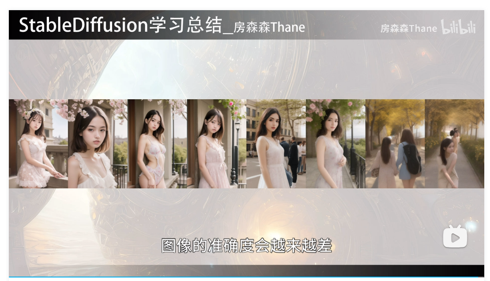
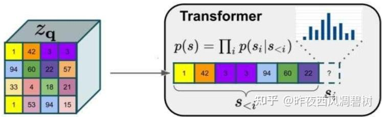
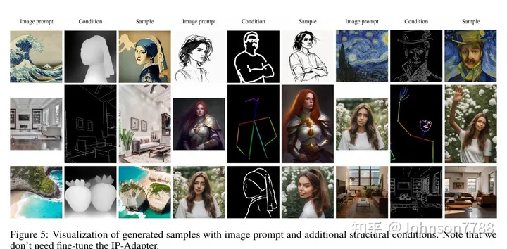

# 问题汇总
！ ae,vae,vqvae的区别？     
! 各种iou       
！ clip训练过程         
! 相同衣服识别         
! tokenizer-bpe, embedding           
! lora具体怎么加         
！ lora训练不稳定是因为什么，怎么解决       
实习时候lora训练案例以及图像收集？？？        
! yolov5正负样本匹配详细规则（???进而自己可以考虑为什么yolov8无锚框）???????           
比赛改的模型,nafnet到底是什么？本质是什么      
中文文生图只使用1m数据是否太少？      
vae的分布和diffusion的分布有什么区别      
ddpm在怎么设计分布？     
自问：各种采样器如何设计分布？         
链表类leetcode       
图图相似度度量方法        
自问：kl散度为什么能约束分布到标准正态分布，vae为什么要将分布约束到标准正态分布        
自问：ssim计算需要均值方差，FID的全称是Fréchet Inception Distance，用于衡量两个多元正态分布的距离，数值越小越好。通过特征提取，也需要计算均值方差。kl散度也需要计算分布的均值方差并加以约束，他们的关系是什么?       
如何固定sd生成图片中人物的id        
unet采样器的重参数化??????, vae重参数化是为了梯度反向传播能传回去    
! sd3   
cfg和 not cfg具体原理，不只是代码    
! sdxl为什么和sd一样快        
代码如何实现prompt权重识别和划分        
! 采样器预测的均值是噪声的还是likelihood状态的？         
！ clip倒数一二层的区别      
为什么开源社区很少人训练vae    
具体讲讲语言编码器是怎么加的，维度，层数   
lora在unet每一层都加吗？设置不同层采用有什么区别？？？   
locon的resnet具体怎么改成rank相关   
timpstep正余弦编码到底是什么    
sd原论文如何训练sd      
      

最关键的问题：别人已经有很好的训练模型了，你为什么不拿别人开源的微调，还要自己重头训练。直接拿别人的自己还干啥，别人的已经够好了，不用吃饭了    
各种漏洞，有商业化的吗      
为什么webUI可以支持超长文本输入     
webUI如何做cfg    
dreambooth先验保留要多少张图片   
SD训练论文和训练过程    
分类器引导和无分类器引导是什么，起源是什么，和yolo的有锚无锚点选择演进过程有什么区别      


对backbone,卷积核感受野的改进，压缩加速部署。对检测头的设计，对loss的设计，对神经网络框架的设计，对优化器的设计，对生成网络的设计，是否太多？           


## 分类器引导和无分类器引导是什么，起源是什么，和yolo的有锚无锚点选择演进过程有什么区别   
我觉得起源在于cfg的引入，宣誓负向词的引入，以前是没有负向词控制的概念的。   
同时cfg在终端也可以设置成负值，就是负向词的效果     

The "negative prompt" is just a by-product of the classifier-free guidance, where it original was only an empty prompt, it was later discovered that here you could put anything you don't want the network to generate.


## webUI如何做cfg    
Stable Diffusion Web UI 将 CFG 限制为正数，最小值为 1，最大值为 30。但是，如果您通过终端使用 Stable Diffusion，则可以将 CFG 设置为高达 999，也可以设置其为负值。负 CFG 意味着您希望稳定扩散生成与文本提示相反的内容。然而，这并不是一种常见的做法，因为使用否定文本提示会给您带来更可预测的结果，更有可能代表您想要的内容。

色彩饱和度随着 CFG 的增加而增加   
对比度随着 CFG 的增加而增加   
高于某个 CFG 值时，输出图像会变得更加模糊，导致细节丢失    

为了抵消较高 CFG 值时输出图像质量的下降，您通常可以执行以下两项操作：

增加采样器步数：一般经验法则是，采样器步数越多，输出图像的细节就越多，尽管与 CFG 一样，该规则仅适用于特定阈值。请记住，更多的采样器步骤通常会导致更长的处理时间。    
更改采样器方法：一些采样器是专门为在较低或较高的 CFG 和采样步骤下最佳运行而开发的。例如，UniPC 可以在 CFG 低至 3 时返回良好的结果，但通常会在 CFG 为 10 左右时看到质量下降。另一方面，DPM++ SDE Karras 通常在 CFG 值大于 7 时产生大量图像细节。   

### webui内部代码    
vscode调试需要将配置文件justMyCode=false     
配置文件在debug界面模块找到后改     
才能看到大框架下线程调用的模型采样    

去噪模型model被装饰      
原先采样是采用ddmpp_2m     
主装饰是CompVisDenoiser     
副装饰是CFGDenoiserKDiffusion    
     

    class CFGDenoiser(torch.nn.Module):
        """
        Classifier free guidance denoiser. A wrapper for stable diffusion model (specifically for unet)
        that can take a noisy picture and produce a noise-free picture using two guidances (prompts)
        instead of one. Originally, the second prompt is just an empty string, but we use non-empty
        negative prompt.
        """


    forward 

    if sd_samplers_common.apply_refiner(self):
        cond = self.sampler.sampler_extra_args['cond']
        uncond = self.sampler.sampler_extra_args['uncond']

    conds_list, tensor = prompt_parser.reconstruct_multicond_batch(cond, self.step)
    uncond = prompt_parser.reconstruct_cond_batch(uncond, self.step)

    tensor = denoiser_params.text_cond
    uncond = denoiser_params.text_uncond

    if tensor.shape[1] == uncond.shape[1] or skip_uncond:
        if is_edit_model:
            cond_in = catenate_conds([tensor, uncond, uncond])
        elif skip_uncond:
            cond_in = tensor
        else: 执行这个
            cond_in = catenate_conds([tensor, uncond])

        if shared.opts.batch_cond_uncond:
            x_out = self.inner_model(x_in, sigma_in, cond=make_condition_dict(cond_in, image_cond_in))


    if skip_uncond: 不执行
        fake_uncond = torch.cat([x_out[i:i+1] for i in denoised_image_indexes])
        x_out = torch.cat([x_out, fake_uncond])  # we skipped uncond denoising, so we put cond-denoised image to where the uncond-denoised image should be

    denoised = self.combine_denoised(x_out, conds_list, uncond, cond_scale)

我觉得和diffusers的差不多    


## 为什么webUI可以支持超长文本输入
Typing past standard 75 tokens that Stable Diffusion usually accepts increases prompt size limit from 75 to 150. Typing past that increases prompt size further. This is done by breaking the prompt into chunks of 75 tokens, processing each independently using CLIP's Transformers neural network, and then concatenating the result before feeding into the next component of stable diffusion, the Unet.

For example, a prompt with 120 tokens would be separated into two chunks: first with 75 tokens, second with 45. Both would be padded to 75 tokens and extended with start/end tokens to 77. After passing those two chunks though CLIP, we'll have two tensors with shape of (1, 77, 768). Concatenating those results in (1, 154, 768) tensor that is then passed to Unet without issue.

为什么放进unet会没有问题？    
unet交叉注意力计算文本信息也会使用线性映射，维度已经不一样了    

源代码里也是经典的层层warp          
代码本身就是层层嵌套，堆栈比diffusers深太多     


找到这个，但是是控制文本变换的。没找到怎么处理长文本      

    # a prompt like this: "fantasy landscape with a [mountain:lake:0.25] and [an oak:a christmas tree:0.75][ in foreground::0.6][: in background:0.25] [shoddy:masterful:0.5]"
    # will be represented with prompt_schedule like this (assuming steps=100):
    # [25, 'fantasy landscape with a mountain and an oak in foreground shoddy']
    # [50, 'fantasy landscape with a lake and an oak in foreground in background shoddy']
    # [60, 'fantasy landscape with a lake and an oak in foreground in background masterful']
    # [75, 'fantasy landscape with a lake and an oak in background masterful']
    # [100, 'fantasy landscape with a lake and a christmas tree in background masterful']

    def get_learned_conditioning_prompt_schedules(prompts, base_steps, hires_steps=None, use_old_scheduling=False):
    """


Composable Diffusion

A method to allow the combination of multiple prompts. combine prompts using an uppercase AND
a cat AND a dog

Supports weights for prompts: a cat :1.2 AND a dog AND a penguin :2.2 The default weight value is 1. It can be quite useful for combining multiple embeddings to your result: creature_embedding in the woods:0.7 AND arcane_embedding:0.5 AND glitch_embedding:0.2
Using a value lower than 0.1 will barely have an effect. a cat AND a dog:0.03 will produce basically the same output as a cat
This could be handy for generating fine-tuned recursive variations, by continuing to append more prompts to your total. creature_embedding on log AND frog:0.13 AND yellow eyes:0.08


没找到在哪里执行clip转换token        
以及截断token        
只看到转换成cond直接就是已经clip后2048维度的向量      


感觉还是跳不进去断电       
卡在外沿       


## timpstep正余弦编码到底是什么
    
？？？？？？？？？       


## 代码如何实现prompt权重识别和划分
整个tokenizer并没有涉及到prompt权重的问题
推理的text_encode也没有体现权重       
只有对词位置编码时候，有一些体现权重问题的思想        

（），句子首尾权重是不是clip训练出来的机制呢？？？？       
猜测，就是clip训练的结果      
但是怎么训练，能让()代表权重1.1, 怎么设置图文匹对关系？？？？        

### tokenize
整个tokenizer并没有涉及到prompt权重的问题

sd main函数

    prompt_embeds, negative_prompt_embeds = self.encode_prompt(
                prompt,
                device,
                num_images_per_prompt,
                self.do_classifier_free_guidance,
                negative_prompt,
                prompt_embeds=prompt_embeds,
                negative_prompt_embeds=negative_prompt_embeds,
                lora_scale=lora_scale,
                clip_skip=self.clip_skip,
            )

encode_prompt函数  

    # textual inversion: procecss multi-vector tokens if necessary
                if isinstance(self, TextualInversionLoaderMixin):
                    prompt = self.maybe_convert_prompt(prompt, self.tokenizer)

    首先 textual inversion 判断 added_tokens_encoder，具体来说使用tokenize后进行判断，重新处理prompt

    text_inputs = self.tokenizer(
                prompt,
                padding="max_length",
                max_length=self.tokenizer.model_max_length,
                truncation=True,


    Converts a string in a sequence of tokens, using the tokenizer.   
    tokens = self.tokenize(text, **kwargs)

    Convert tokens of `tokenizers.AddedToken` type to string.  
    escaped_special_toks : ['\\[CLS\\]', '\\[SEP\\]', '\\[UNK\\]', '\\[PAD\\]', '\\[MASK\\]']   

    # "This is something<special_token_1>  else"
            tokens = self.tokens_trie.split(text)
    默认不需要add 特殊词进行划分
    # "This is something<special_token_1>  else"
    # ["This is something", "<special_token_1>", "  else"]
    tokens ：['pokemon, red eyes, long nose, (blue hair)']

    # ["This is something", "<special_token_1>", "else"]  

    def _tokenize(self, text, split_special_tokens=False):
        split_tokens = []
        if self.do_basic_tokenize:
            for token in self.basic_tokenizer.tokenize(
                text, never_split=self.all_special_tokens if not split_special_tokens else None
            ):
                # If the token is part of the never_split set
                if token in self.basic_tokenizer.never_split:
                    split_tokens.append(token)
                else:
                    split_tokens += self.wordpiece_tokenizer.tokenize(token)
        else:
            split_tokens = self.wordpiece_tokenizer.tokenize(text)
        return split_tokens
    
    text = self._clean_text(text)
    去出单个无意义字符

    bert模型的tokrnizer
    中文版   

    空格划分
    __pydevd_ret_val_dict['whitespace_tokenize']：['pokemon,', 'red', 'eyes,', 'long', 'nose,', '(blue', 'hair)']

    对上一个继续处理
    分出标点符号
    split_tokens ： ['pokemon', ',', 'red', 'eyes', ',', 'long', 'nose', ',', '(', 'blue', 'hair', ')']
    对着这个迭代
    split_tokens += self.wordpiece_tokenizer.tokenize(token)
    'pokemon'


    Tokenizes a piece of text into its word pieces. This uses a greedy longest-match-first algorithm to perform
        tokenization using the given vocabulary.

        For example, `input = "unaffable"` wil return as output `["un", "##aff", "##able"]`.

        Args:
            text: A single token or whitespace separated tokens. This should have
                already been passed through *BasicTokenizer*.

        Returns:
            A list of wordpiece tokens.

    主要思想就是如果单词如果不在两万多个token字典里，就进行切分

    while start < end:
        substr = "".join(chars[start:end])
        if start > 0:
            substr = "##" + substr
        if substr in self.vocab:
            cur_substr = substr
            break
        end -= 1 不在表里，右指针往内收缩。first_最长_贪心匹配dict
        if cur_substr is None:
            is_bad = True
            break
        sub_tokens.append(cur_substr)
        start = end

    ['pokemon', ',', 'red', 'eyes', ',', 'long', 'no', '##se', ',', '(', 'blue', 'hair', ')']
    tokenize结果 

    _convert_token_to_id
    return self.vocab.get(token, self.vocab.get(self.unk_token))
    self._unk_token ： '[UNK]'


    ids ： [8934, 117, 9276, 12909, 117, 10037, 8275, 8417, 117, 113, 9036, 11408, 114]


    first_ids = get_input_ids(text)
    second_ids = get_input_ids(text_pair) if text_pair is not None else None

    Prepares a sequence of input id, or a pair of sequences of inputs ids so that it can be used by the model. It
        adds special tokens, truncates sequences if overflowing while taking into account the special tokens and
        manages a moving window (with user defined stride) for overflowing tokens. Please Note, for *pair_ids*
        different than `None` and *truncation_strategy = longest_first* or `True`, it is not possible to return
        overflowing tokens. Such a combination of arguments will raise an error.


    Build model inputs from a sequence or a pair of sequence for sequence classification tasks by concatenating and
        adding special tokens. A BERT sequence has the following format:

        - single sequence: `[CLS] X [SEP]`
        - pair of sequences: `[CLS] A [SEP] B [SEP]`

    加特殊符号 
    sequence : [101, 8934, 117, 9276, 12909, 117, 10037, 8275, 8417, 117, 113, 9036, 11408, 114, 102]   
    total_len = 15
    token_type_ids
    0 0 0 0 0 0 0 0 0 0 0 1 1 1 1 1 1 1 1 1
        | first sequence    | second sequence |


    encoded_inputs["input_ids"] = sequence


    [PAD]

     PaddingStrategy.LONGEST Pad to the longest sequence in the batch
    - PaddingStrategy.MAX_LENGTH: Pad to the max length (default)
    - PaddingStrategy.DO_NOT_PAD: Do not pad

    LONGEST
    使用这个
    所以没变

    self ：{'input_ids': [101, 8934, 117, 9276, 12909, 117, 10037, 8275, 8417, 117, 113, 9036, 11408, 114, 102], 'token_type_ids': [0, 0, 0, 0, 0, 0, 0, 0, 0, 0, 0, 0, 0, 0, 0], 'attention_mask': [1, 1, 1, 1, 1, 1, 1, 1, 1, 1, 1, 1, 1, 1, 1]}

    转成pt数据
    return torch.tensor(value) 
    [[101, 8934, 117, 9276, 12909, 117, 10037, 8275, 8417, 117, 113, 9036, 11408, 114, 102]]
    转成
    tensor([[  101,  8934,   117,  9276, 12909,   117, 10037,  8275,  8417,   117,
           113,  9036, 11408,   114,   102]])


    tokenize结束，
    encodings ： {'input_ids': tensor([[  101,  8934,   117,  9276, 12909,   117, 10037,  8275,  8417,   117,
           113,  9036, 11408,   114,   102]]), 'token_type_ids': tensor([[0, 0, 0, 0, 0, 0, 0, 0, 0, 0, 0, 0, 0, 0, 0]]), 'attention_mask': tensor([[1, 1, 1, 1, 1, 1, 1, 1, 1, 1, 1, 1, 1, 1, 1]])}
    

    整个tokenizer并没有涉及到prompt权重的问题


    返回到sd ppl的数据
    text_inputs : {'input_ids': tensor([[  101,  8934,   117,  9276, 12909,   117, 10037,  8275,  8417,   117,
           113,  9036, 11408,   114,   102,     0,     0,     0,     0,     0,
             0,     0,     0,     0,     0,     0,     0,     0,     0,     0,
             0,     0,     0,     0,     0,     0,     0,     0,     0,     0,
             0,     0,     0,     0,     0,     0,     0,     0,     0,     0,
             0,     0]]), 'token_type_ids': tensor([[0, 0, 0, 0, 0, 0, 0, 0, 0, 0, 0, 0, 0, 0, 0, 0, 0, 0, 0, 0, 0, 0, 0, 0,
         0, 0, 0, 0, 0, 0, 0, 0, 0, 0, 0, 0, 0, 0, 0, 0, 0, 0, 0, 0, 0, 0, 0, 0,
         0, 0, 0, 0]]), 'attention_mask': tensor([[1, 1, 1, 1, 1, 1, 1, 1, 1, 1, 1, 1, 1, 1, 1, 0, 0, 0, 0, 0, 0, 0, 0, 0,
         0, 0, 0, 0, 0, 0, 0, 0, 0, 0, 0, 0, 0, 0, 0, 0, 0, 0, 0, 0, 0, 0, 0, 0,
         0, 0, 0, 0]])}


    在sd中没有用到text_target，在一般语言模型中可能会用到encodings["labels"] = target_encodings["input_ids"]

    untruncated_ids = self.tokenizer(prompt, padding="longest", return_tensors="pt").input_ids

    logger.warning(
                    "The following part of your input was truncated because CLIP can only handle sequences up to"
                    f" {self.tokenizer.model_max_length} tokens: {removed_text}"
                )

### embedding

    if clip_skip is None:
        prompt_embeds = self.text_encoder(text_input_ids.to(device), attention_mask=attention_mask)
        #直接输出最后结果
        prompt_embeds = prompt_embeds[0]
    else:
        prompt_embeds = self.text_encoder(
            text_input_ids.to(device), attention_mask=attention_mask, output_hidden_states=True #输出中间层
        )
        # Access the `hidden_states` first, that contains a tuple of
        # all the hidden states from the encoder layers. Then index into
        # the tuple to access the hidden states from the desired layer.
        prompt_embeds = prompt_embeds[-1][-(clip_skip + 1)]
        # We also need to apply the final LayerNorm here to not mess with the
        # representations. The `last_hidden_states` that we typically use for
        # obtaining the final prompt representations passes through the LayerNorm
        # layer.
        prompt_embeds = self.text_encoder.text_model.final_layer_norm(prompt_embeds)

    
    获取embedding


    encoder_attention_mask (`torch.FloatTensor` of shape `(batch_size, sequence_length)`, *optional*):
            Mask to avoid performing attention on the padding token indices of the encoder input. This mask is used in
            the cross-attention if the model is configured as a decoder. Mask values selected in `[0, 1]`:
    - 1 for tokens that are **not masked**,
    - 0 for tokens that are **masked**.

    attention_mask = tensor([[1., 1., 1., 1., 1., 1., 1., 1., 1., 1., 1., 1., 1., 1., 1., 1., 1., 1.,
         1., 1., 1., 1., 1., 1., 1., 1., 1., 1., 1., 1., 1., 1., 1., 1., 1., 1.,
         1., 1., 1., 1., 1., 1., 1., 1., 1., 1., 1., 1., 1., 1., 1., 1.]],
       device='cuda:0')

    准备attention_mask, extended_attention_mask, head_mask

    embeddings
    embedding_output = self.embeddings(
        input_ids=input_ids,
        position_ids=position_ids,
        token_type_ids=token_type_ids,
        inputs_embeds=inputs_embeds,
        past_key_values_length=past_key_values_length,
    )


    if position_ids is None:
            position_ids = self.position_ids[:, past_key_values_length : seq_length + past_key_values_length]
    position_ids = tensor([[ 0,  1,  2,  3,  4,  5,  6,  7,  8,  9, 10, 11, 12, 13, 14, 15, 16, 17,
         18, 19, 20, 21, 22, 23, 24, 25, 26, 27, 28, 29, 30, 31, 32, 33, 34, 35,
         36, 37, 38, 39, 40, 41, 42, 43, 44, 45, 46, 47, 48, 49, 50, 51]],
       device='cuda:0')


    input_ids : tensor([[  101,  8934,   117,  9276, 12909,   117, 10037,  8275,  8417,   117,
           113,  9036, 11408,   114,   102,     0,     0,     0,     0,     0,
             0,     0,     0,     0,     0,     0,     0,     0,     0,     0,
             0,     0,     0,     0,     0,     0,     0,     0,     0,     0,
             0,     0,     0,     0,     0,     0,     0,     0,     0,     0,
             0,     0]], device='cuda:0')

    inputs_embeds = self.word_embeddings(input_ids)   
    token_type_embeddings = self.token_type_embeddings(token_type_ids)
    Embedding(2, 768, padding_idx=0)

    self.word_embeddings : Embedding(21128, 768, padding_idx=0)
    内部是
    def forward(self, input: Tensor) -> Tensor:
        return F.embedding(
            input, self.weight, self.padding_idx, self.max_norm,
            self.norm_type, self.scale_grad_by_freq, self.sparse)

    self.weight ： torch.Size([21128, 768])
    没有bias
    Attributes:
        weight (Tensor): the learnable weights of the module of shape (num_embeddings, embedding_dim)
                         initialized from :math:`\mathcal{N}(0, 1)`

    即简单线性映射，没有bias

    inputs_embeds : torch.Size([1, 52, 768])
    token_type_embeddings : torch.Size([1, 52, 768])
   

    embeddings = inputs_embeds + token_type_embeddings   

    embeddings : torch.Size([1, 52, 768])

    position_embeddings = self.position_embeddings(position_ids)
    embeddings += position_embeddings

    Embedding(512, 768)

    重要程度是受到这个位置编码的 + 影响吗
    位置的重要程度在这里体现？？？？    

    那么（）的重要程度也是在input_ids的embed实现的吗
    怎么设置训练让他能明白哪个重要？？？

    embeddings = self.LayerNorm(embeddings)
    embeddings = self.dropout(embeddings)
    # 0.1


### encoder
attention_mask没用到   
用了  
extended_attention_mask（由 attention_mask 的 1 变 0）  
head_mask ： 12 层 None 。实际也没用。决定某层哪些头被挡住

    encoder_outputs = self.encoder(
        embedding_output,
        attention_mask=extended_attention_mask,
        head_mask=head_mask,
        encoder_hidden_states=encoder_hidden_states,
        encoder_attention_mask=encoder_extended_attention_mask,
        past_key_values=past_key_values,
        use_cache=use_cache,
        output_attentions=output_attentions,
        output_hidden_states=output_hidden_states,
        return_dict=return_dict,
    )

    12 层
        BertEncoder(
    (layer): ModuleList(
        (0-11): 12 x BertLayer(
        (attention): BertAttention(
            (self): BertSelfAttention(
            (query): Linear(in_features=768, out_features=768, bias=True)
            (key): Linear(in_features=768, out_features=768, bias=True)
            (value): Linear(in_features=768, out_features=768, bias=True)
            (dropout): Dropout(p=0.1, inplace=False)
            )
            (output): BertSelfOutput(
            (dense): Linear(in_features=768, out_features=768, bias=True)
            (LayerNorm): LayerNorm((768,), eps=1e-12, elementwise_affine=True)
            (dropout): Dropout(p=0.1, inplace=False)
            )
        )
        (intermediate): BertIntermediate(
            (dense): Linear(in_features=768, out_features=3072, bias=True)
            (intermediate_act_fn): GELUActivation()
        )
        (output): BertOutput(
            (dense): Linear(in_features=3072, out_features=768, bias=True)
            (LayerNorm): LayerNorm((768,), eps=1e-12, elementwise_affine=True)
            (dropout): Dropout(p=0.1, inplace=False)
        )
        )
    )
    )

    layer_head_mask = head_mask[i] if head_mask is not None else None   
    实际用不到

    query_layer ： torch.Size([1, 12, 52, 64])
    12个头  
     Take the dot product between "query" and "key" to get the raw attention scores.

    if attention_mask is not None:
        # Apply the attention mask is (precomputed for all layers in BertModel forward() function)
        attention_scores = attention_scores + attention_mask
    
    mask实际不起作用 + 0

    attention_scores ： torch.Size([1, 12, 52, 52])

    attention_mask ： tensor([[[[-0., -0., -0., -0., -0., -0., -0., -0., -0., -0., -0., -0., -0., -0., -0., -0., -0., -0., -0., -0., -0., -0., -0.,
           -0., -0., -0., -0., -0., -0., -0., -0., -0., -0., -0., -0., -0., -0., -0., -0., -0., -0., -0., -0., -0., -0., -0.,
           -0., -0., -0., -0., -0., -0.]]]], device='cuda:0',
       dtype=torch.float16)
    torch.Size([1, 1, 1, 52])


    torch.Size([1, 12, 52, 52])
    # Normalize the attention scores to probabilities.
    attention_probs = nn.functional.softmax(attention_scores, dim=-1)   
    torch.Size([1, 12, 52, 52])

    # This is actually dropping out entire tokens to attend to, which might
    # seem a bit unusual, but is taken from the original Transformer paper.
    attention_probs = self.dropout(attention_probs)
    0.1

    # Mask heads if we want to
    if head_mask is not None:
        attention_probs = attention_probs * head_mask
    决定该层哪些头被挡住

    context_layer = torch.matmul(attention_probs, value_layer)

    outputs = (context_layer, attention_probs) if output_attentions（False） else (context_layer,)

    apply_chunking_to_forward(
    forward_fn: Callable[..., torch.Tensor], chunk_size: int, chunk_dim: int, *input_tensors
    ) -> torch.Tensor:
    """
    This function chunks the `input_tensors` into smaller input tensor parts of size `chunk_size` over the dimension
    `chunk_dim`. It then applies a layer `forward_fn` to each chunk independently to save memory.
    If the `forward_fn` is independent across the `chunk_dim` this function will yield the same result as directly
    applying `forward_fn` to `input_tensors`.

    没用到chunk节省运行内存


    经过 12 layer的bert，始终没看到如何对（），位置首末的prompt控制权重加权
    推理部分没有？？？ 


    torch.Size([1, 52, 768])
    pooler
    def forward(self, hidden_states: torch.Tensor) -> torch.Tensor:
        # We "pool" the model by simply taking the hidden state corresponding
        # to the first token.
        first_token_tensor = hidden_states[:, 0]
        torch.Size([1, 768])

        pooled_output = self.dense(first_token_tensor)
        dense 768*768
        pooled_output = self.activation(pooled_output)
        tanh
        return pooled_output

    dense
    def forward(self, input: Tensor) -> Tensor:
        return F.linear(input, self.weight, self.bias)
    
    weight torch.Size([768, 768])
    bias torch.Size([768])

    pooled_output torch.Size([1, 768])

    return BaseModelOutputWithPoolingAndCrossAttentions(
        last_hidden_state=sequence_output,
        #torch.Size([1, 52, 768])
        pooler_output=pooled_output,#实际不要
        past_key_values=encoder_outputs.past_key_values,
        hidden_states=encoder_outputs.hidden_states,
        attentions=encoder_outputs.attentions,
        cross_attentions=encoder_outputs.cross_attentions,
    )

### 出encoder，返回sd

    prompt_embeds = prompt_embeds[0]
    取出 sequence_output
    torch.Size([1, 52, 768])

    就是复制多个prompt进行多图生成对比的操作
    # duplicate text embeddings for each generation per prompt, using mps friendly method
    num_images_per_prompt : 1 则不动
    prompt_embeds = prompt_embeds.repeat(1, num_images_per_prompt, 1)
    prompt_embeds = prompt_embeds.view(bs_embed * num_images_per_prompt, seq_len, -1)


    if do_classifier_free_guidance and negative_prompt_embeds is None:
        uncond_tokens: List[str]
        if negative_prompt is None:
            uncond_tokens = [""] * batch_size
    uncond_tokens : ['']
    negative_prompt_embeds : torch.Size([1, 52, 768]) 不是纯 0，都有值

    ip_adapter_image
    image_embeds, negative_image_embeds = self.encode_image(
                ip_adapter_image, device, num_images_per_prompt, 
                output_hidden_state
            )
    if self.do_classifier_free_guidance:
                image_embeds = torch.cat([negative_image_embeds, image_embeds])

    


    


## clip倒数一二层的区别  
另外是一个小细节是SD 2.0提取的是text encoder倒数第二层的特征，而SD 1.x提取的是倒数第一层的特征。`由于倒数第一层的特征之后就是CLIP的对比学习任务，所以倒数第一层的特征可能部分丢失细粒度语义信息`，Imagen论文（见论文D.1部分）和novelai（见novelai blog）均采用了倒数第二层特征。  
跳过多，prompt准确度差       

例如，当我们尝试生成一个人的插图时，会是这样的一个情况（当然，实际情况可能远比这个更复杂）：  

   

为什么是到12层呢？因为在该版本的模型中，深度为12层。

而你想处理到那一层就是：clip的终止层数（clipskip）

ClipSkip为1：处理到最后一层（即所有层）
ClipSkip为2：处理到倒数第二层（忽略最后一层）
ClipSkip为3：处理到倒数第三层（忽略最后和倒数第二层）
简言之，随着剪辑跳过的增加，要处理的层数逐渐减少。结果，详细信息被按顺序丢弃，没有反映的提示数量增加了。（一个词含有的意思很少，需要扩散来丰富）

      
可见ClipSkip值较小，生成含有丰富提示词的插图；ClipSkip的值较大，生成忽略提示词的插图。   


跳过多，准确度差          


## sdxl为什么和sd一样快
`如果第一个stage就使用了attention（包含self-attention），所需要的显存和计算量都是比较大的`。    
  
下面我们来重点看一下SDXL是如何扩增UNet参数的，SDXL的UNet模型结构如下图所示：  
  


## 采样器预测的均值是噪声的还是likelihood状态的？  
    
     
      
    

通过贝叶斯公式，解出likelihood分布的均值和方差   
unet去拟合likelihood的均值（其实unet只要知道怎么去噪即可，就能给出likehood）      
likelihood是指 由t时刻加噪完成的latent，推出t-1时刻去噪一步的latent(少加一步噪声)    
整个公式的目的是 求出likelihood 最后演化成，只需要知道likelihood的均值（方差固定）就可以知道likehood了   
t时刻的likelihood 由t时刻的x,加噪系数共同决定   


## ae,vae,vqvae的区别？      
AE（自动编码器）、VAE（变分自动编码器）、VQ-VAE（向量量化变分自编码器） 的区别和联系？    
AE主要用于数据的压缩与还原，VAE主要用于生成。     
AE是将数据映直接映射为数值code（确定的数值），而VAE是先将数据映射为分布，再从分布中采样得到数值code。    
损失函数和优化目标不同      

### AE
Auto Encoder, 自动编码器      
AE的结构        
       
那么如果我们任意给一个隐变量，输入解码器，可以得到一张有具体含义的图像吗？不能。因为AE的训练过程更像数据压缩，而不是数据生成。       
此外，AE也不具有随机性。模型训练好之后，同一张图像反复输入AE，隐变量和输出都是固定的。      
因此，AE只能拿来做压缩，不能拿来做生成。    

这时候我们只要拿出Decoder部分，随机生成一个code然后输入，就可以得到一张生成的图像。但实际上这样的生成效果并不好（下面解释原因），因此AE多用于数据压缩，而数据生成则使用下面所介绍的VAE更好。         
模型会过拟合，泛化性能不好。也就是说对于一个训练好的AE，输入某个图片，就只会将其编码为某个确定的code，输入某个确定的code就只会输出某个确定的图片，如果这个latent code来自于没见过的图片，那么生成的图片也不会好。     
假设我们训练好的AE将“新月”图片encode成code=1（这里假设code只有1维），将其decode能得到“新月”的图片；将“满月”encode成code=10，同样将其decode能得到“满月”图片     
这时候如果我们给AE一个code=5，我们希望是能得到“半月”的图片，但由于之前训练时并没有将“半月”的图片编码，或者将一张非月亮的图片编码为5，那么我们就不太可能得到“半月”的图片。     
因此AE多用于数据的压缩和恢复，用于数据生成时效果并不理想。      
我理解为多样性不强，过拟合，固定化          

模型   

    import torch
    from torch import nn
    from torch.autograd import Variable
    
    
    # Define the encoder and decoder networks
    class Encoder(nn.Module):
        def __init__(self, input_dim, latent_dim):
            super(Encoder, self).__init__()
            self.fc1 = nn.Linear(input_dim, latent_dim)
    
        def forward(self, x):
            x = torch.relu(self.fc1(x))
            return x
    
    
    class Decoder(nn.Module):
        def __init__(self, latent_dim, output_dim):
            super(Decoder, self).__init__()
            self.fc1 = nn.Linear(latent_dim, output_dim)
    
        def forward(self, x):
            x = torch.sigmoid(self.fc1(x))
            return x
    
    
    class Autoencoder(nn.Module):
        def __init__(self, input_dim, latent_dim):
            super(Autoencoder, self).__init__()
            self.encoder = Encoder(input_dim, latent_dim)
            self.decoder = Decoder(latent_dim, input_dim)
    
        def forward(self, x):
            x = self.encoder(x)
            x = self.decoder(x)
            return x

    # 生图
    # Initialize the autoencoder
    input_dim = 784  # Assuming input is a flattened 28x28 image
    latent_dim = 20  
    autoencoder = Autoencoder(input_dim, latent_dim)
    latent_vector = torch.randn(latent_dim)
    
    # Generate a new image by passing the latent vector through the decoder
    with torch.no_grad(): 
        generated_image = autoencoder.decoder(latent_vector)


### VAE（变分自动编码器）
转变思路，不将图片映射成“数值编码”，而将其映射成“分布”       
我们将“新月”图片映射成μ=1的正态分布，那么就相当于在1附近加了噪声，此时不仅1表示“新月”，1附近的数值也表示“新月”，只是1的时候最像“新月”。将"满月"映射成μ=10的正态分布，10的附近也都表示“满月”。那么code=5时，就同时拥有了“新月”和“满月”的特点，那么这时候decode出来的大概率就是“半月”了。这就是VAE的思想。          
VAE的结构     
             
VAE的encoder输出的是若干个正态分布的均值和标准差。然后从中进行采样得到隐变量Z，再送入解码器得到输出。   


VAE的loss
     

VAE计算以下两方面之间的损失：     

重构损失（Reconstruction Loss）：这一部分的损失计算的是输入数据与重构数据之间的差异。     
mse        
为了满足mse. 随着训练不断进行，模型会倾向于产生固定的Z，即encoder输出的标准差接近0，VAE就会越来越像AE，这也就和我们的初衷相违背了。因此，我们要求N(mean, std)要逼近标准正态分布，这里使用KL散度来进行约束。      
    

KL散度（Kullback-Leibler Divergence Loss）：这一部分的损失衡量的是学习到的潜在表示的分布与先验分布（通常假设为标准正态分布）之间的差异。KL散度是一种`衡量两个概率分布相似度`的指标，VAE通过最小化KL散度来确保学习到的潜在表示的分布尽可能接近先验分布。这有助于模型生成性能的提升，因为它约束了潜在空间的结构，使其更加规整，便于采样和推断。        

编码器输出的只是正态分布的参数mean和std

在VAE中，通常使用平均二乘误差（Mean Squared Error，MSE）或二分类交叉熵（Binary Crossentropy）作为重构损失。       
bce为什么能作为重构损失？？        

  
   

1）Encoder    
image --> 均值 + 标准差      

    import torch
    from torch import nn
    from torch.nn import functional as F
    
    # Encoder class definition
    class Encoder(nn.Module):
        def __init__(self, input_dim, hidden_dim, latent_dim):
            super(Encoder, self).__init__()
            # 使用FC将输入变为隐藏层hidden_dim
            self.fc1 = nn.Linear(input_dim, hidden_dim)
            # Two fully connected layers to produce mean and log variance
            # These will represent the latent space distribution parameters
            self.fc21 = nn.Linear(hidden_dim, latent_dim) # 隐藏层hidden_dim --> 均值Mean μ
            self.fc22 = nn.Linear(hidden_dim, latent_dim) # 隐藏层hidden_dim --> 标准差Log variance σ
    
        def forward(self, x):
            # 使用RELU非线性变换，增加网络的表达能力
            h1 = F.relu(self.fc1(x))
            # Return the mean and log variance for the latent space
            return self.fc21(h1), self.fc22(h1)


2）Decoder

    # Decoder class definition
    class Decoder(nn.Module):
        def __init__(self, latent_dim, hidden_dim, output_dim):
            super(Decoder, self).__init__()
            # latent_dim --> hidden_dim
            self.fc3 = nn.Linear(latent_dim, hidden_dim)
            # hidden_dim --> output_dim（输出的图像）
            self.fc4 = nn.Linear(hidden_dim, output_dim)
    
        def forward(self, z):
            h3 = F.relu(self.fc3(z))

3）VAE     

    # VAE class definition
    # Encode the input --> reparameterize --> decode
    class VAE(nn.Module):
        def __init__(self, input_dim, hidden_dim, latent_dim):
            super(VAE, self).__init__()
            self.encoder = Encoder(input_dim, hidden_dim, latent_dim)
            self.decoder = Decoder(latent_dim, hidden_dim, input_dim)
    
        def reparameterize(self, mu, logvar):
            # Reparameterization trick to sample from the distribution represented by the mean and log variance
            std = torch.exp(0.5*logvar)
            #标准差（standard deviation）,对数方差（log variance）,对logaM中M的n次方有=nlogaM
            eps = torch.randn_like(std)
            #生成了一个与std相同大小的随机张量eps，其中的值是从均值为0、标准差为1的正态分布中采样得到的。这里的目的是生成一个与潜在变量空间大小相同的随机扰动，以便在潜在空间中进行采样。
            return eps.mul(std).add_(mu)
            #对随机扰动eps进行了缩放和平移，以生成最终的采样数据。首先，将扰动乘以标准差std，这个操作使得扰动的大小受到潜在空间每个维度不同的方差影响，然后将均值mu加到结果中。这样做的目的是将扰动应用到潜在空间的平均值上，从而生成最终的采样数据点。

            #从给定的均值和对数方差参数化的高斯分布中采样数据点
    
        def forward(self, x):
            mu, logvar = self.encoder(x.view(-1, input_dim))
            z = self.reparameterize(mu, logvar)
            return self.decoder(z), mu, logvar


Loss

    # Loss function for VAE
    def vae_loss_function(recon_x, x, mu, logvar):
        # Binary cross entropy between the target and the output
        BCE = F.binary_cross_entropy(recon_x, x.view(-1, input_dim), reduction='sum')
        # KL divergence loss ： 学习到的潜在表示的分布 <-->  先验分布(标准正态分布)
        KLD = -0.5 * torch.sum(1 + logvar - mu.pow(2) - logvar.exp())
        return BCE + KLD

训练过程

    # Hyperparameters
    input_dim = 784 # Assuming input is a flattened 28x28 image (e.g., from MNIST)
    hidden_dim = 400
    latent_dim = 20
    epochs = 10
    learning_rate = 1e-3
    
    # Initialize VAE
    vae = VAE(input_dim, hidden_dim, latent_dim)
    optimizer = torch.optim.Adam(vae.parameters(), lr=learning_rate)
    
    # Training process function
    for epoch in range(epochs):
        vae.train()  # Set the model to training mode
        train_loss = 0
        for batch_idx, (data, _) in enumerate(data_loader):
            optimizer.zero_grad()  # Zero the gradients
            recon_batch, mu, logvar = vae(data)  # Forward pass through VAE
            loss = vae_loss_function(recon_batch, data, mu, logvar)  # Compute the loss
            loss.backward()  # Backpropagate the loss
            train_loss += loss.item()
            optimizer.step()

#### 重参数化技巧
编码器输出的只是正态分布的参数mean和std，隐变量是从该分布中采样出来的。但是`采样这个操作，是不可导的，导致loss无法反向传播到编码器`，从而更新编码器的参数。?????               
为了解决这个问题，VAE中使用了一个重参数技巧，即从标准正态分布N(0, 1)中先采样出一个隐变量，再用编码器输出的mean和std对其进行变换。这也就等同于从N(mean, std)中采样了一个隐变量。???????     
为什么解决了？？？？      
         


       
3，VAE中隐藏的“对抗”思想    
重构的过程是希望没噪声的，而KL loss则希望有高斯噪声的，两者是对立的。所以，VAE跟GAN一样，内部其实是包含了一个对抗的过程，只不过它们两者是混合起来，共同进化的。       
虽然encoder生成的分布需要向标准正态分布看齐，但是它不可能真的成为标准正态分布，否则这个分布就和输入没有关系了。因此最终的结果是，该分布保留了一定的输入的信息，又具备生成能力。        

5，VAE叫做变分自编码器，它和变分到底有什么关系？

KL散度是为了度量两个概率分布之间的差异。如果两个分布相等，那么KL散度为0。KL散度的一个主要性质是非负性，因此最小化KL散度的结果就是使得两个分布尽可能相等，这一点的严格证明要用到变分法，这里正是VAE中的V的来源。   


#### vae的分布和diffusion的分布有什么区别      
都是从隐变量 z  
 生成目标数据 x 
 。它们假设隐变量服从某种常见的概率分布（比如正态分布）
然后希望训练一个模型 x = g(z)
 ，这个模型将原来的概率分布映射到训练集的概率分布，也就是分布的变换。       
VAE和GAN的本质都是概率分布的映射。     
这个隐变量会经过一个生成器生成一组目标数据。VAE和GAN都希望这组数据的分布 x^
 和目标分布 x
 尽量接近。    

因为KL散度是针对两个已知的概率分布求相似度的，而 x^
 和 x
 的概率分布目前都是未知。     
GAN的做法就是直接把这个度量标准也学过来就行???????，相当生猛。但是这样做的问题在于依然不interpretable，非常不优雅。VAE的做法就优雅很多了       
      
上式中，p(x|z)
 称为后验分布，p(z) 
 称为先验分布。隐变量是z        
生成模型的输入是x,输出是p(x)        

VAE的核心:          
我们不仅假设 p(z)
 是正态分布，而且假设每个 p(xk | z)
 也是正态分布。      

有 k
 个 x
 sample，就有 k
 个正态分布 p(xk | z)         
 想方设法获得这 k
 个正态分布了     
拟合！但是要注意，这里的拟合与GAN不同，本质上是在学习 xk
 和 z
 的关系，而非学习比较 x
 与 x^
 的标准。   

已知是正态分布，学什么才能确定这个正态分布？没错，均值和方差。怎么学？有数据啊！ 
 z 是你自己假设的， xk
 是已知的，那你就用这俩去学个均值和方差。    

VAE的Variational到底是个啥       
 由于我们通过最小化 D^2(xk | xk^)
 来训练右边的生成器，最终模型会逐渐使得 xk
 和 xk^
 趋于一致。但是注意，因为 zk
 是重新随机采样过的，而不是直接通过均值和方差encoder学出来的，这个生成器的输入 z
 是有噪声的。但是仔细思考一下，这个噪声的大小其实就用方差来度量。为了使得分布的学习尽量接近，我们希望噪声越小越好，所以我们会尽量使得方差趋于 0。      
但是方差不能为 0，因为我们还想要给模型一些训练难度。如果方差为 0，模型永远只需要学习高斯分布的均值，这样就`丢失了随机性，VAE就变成AE`了……这就是为什么VAE要在AE前面加一个Variational：我们希望方差能够持续存在，从而带来噪声！      
那如何解决这个问题呢？其实保证有方差就行     

VAE给出了一个优雅的答案：不仅需要保证 z 有方差，还要让所有 p(z | x)
 趋于标准正态分布 N(0, I)
 ！为什么要这么做呢？这里又需要一个小小的数学推导：
     
如果所有 p(z | x)
 都趋于  N(0, I)
 ，那么我们可以保证 p(z)
 也趋于  N(0, I)     

那怎么让所有 p(z | x)
 趋于 N(0, I)
 呢？加loss 需要数学推导    

         
均值和方差的计算本质上都是encoder。也就是说，VAE其实利用了两个encoder去分别学习均值和方差。    
最小化方差 D^2(xk | xk^)      

VAE的本质     
VAE在AE的基础上对均值的encoder添加高斯噪声（正态分布的随机采样），使得decoder（就是右边那个生成器）有噪声鲁棒性      
为了防止噪声消失，将所有 p(z | x)
 趋近于标准正态分布，将encoder的均值尽量降为 0，而将方差尽量保持住。????????    
这样一来，当decoder训练的不好的时候，整个体系就可以降低噪声；当decoder逐渐拟合的时候，就会增加噪声。     
本质上，是不是和GAN很像？！要我命名，我也可以叫VAE是生成对抗encoder       


VAE有一个做了好几年的核心问题。大家思考一下，上面的VAE中，变分后验 p(x | z)
 是怎么获得的？是学出来的！用  D^2(xk | xk^)
 当loss，去学这个  p(x | z)
 。学这个变分后验就有五花八门的方法了      
 除了上面说的拟合法，还有用纯数学来做的，甚至有用BERT这种PLM来做的     
VAE的框架：必须想办法设计一个生成器 g(z) = x
 ，使得变分后验分布 p(x | z)
 尽量真实。这种方法的问题在于，这个变分后验 p(x | z)
 的表达能力与计算代价是不可兼得的。换句话说，简单的变分后验表达并不丰富（例如数学公式法），而复杂的变分后验计算过于复杂（例如PLM法）。

GAN其实就是简单粗暴，没有任何encoder，直接训练生成器，唯一的难度在于判别器（就是下图这个“它们的分布相等吗”的东西）不好做。     
      

VAE本质是一个基于梯度的encoder-decoder架构，encoder用来学高斯分布的均值和方差，decoder用变分后验来学习生成能力，     


### VQ-VAE
VQ-VAE是首个提出codebook机制的生成模型。
相比于普通的VAE，VQ-VAE利用codebook机制把图像编码成离散矩阵（即矩阵中每个值是codebook中特征的索引值）    

VQ（向量量化），主要是因为将连续潜在空间的点映射到最近的一组离散的向量（即码本中的向量）上    
VQ-VAE的全称是Vector Quantized-Variational AutoEncoder，即向量量化变分自编码器。这是一种结合了变分自编码器（VAE）和向量量化（VQ）技术的深度学习模型   
向量量化的过程实质上是将连续潜在空间的点映射到最近的一组离散的向量（即码本中的向量）上   
这有助于模型捕捉和表示更加丰富和复杂的数据分布，由于维护了一个codebook，编码范围更加可控，VQVAE相对于VAE，可以生成更大更高清的图片(这也为后续DALLE和VQGAN的出现做了铺垫)。???????       

     
      
算法步骤：     
通过Encoder学习出中间编码 Ze(x)【绿色】    
事先定义好codebook，它有N个e组成【紫色】      
然后通过最邻近搜索与中间编码Ze(x)最相似（接近）的codebook中K个向量之一，并记住这个向量的index【青色】     
根据得到的所有index去映射对应的codebook中的vector，得到Zq(x)【紫色】     
然后通过Decoder对Zq(x)进行重建     

另外由于最邻近搜索使用argmax来找codebook中的索引位置，导致不可导问题，VQVAE通过stop gradient操作来避免最邻近搜索的不可导问题，也就是通过stop gradient操作，将decoder输入的梯度复制到encoder的输出上【红色的线】。    

对于普通的自编码器，只需要衡量x和decoder(Z)之间的误差。但这里输入decoder的是Zq，而不是Z。   
那么能否直接衡量x和decoder(Zq)之间的误差？不行。因为我们在离散化时，是有argmin操作的，这个操作是没有梯度的，无法更新encoder。    
因此，前一个loss不是我们需要的，我们需要的loss又无法使用。       
VQ-VAE使用的方法是Straight-Through Estimator，即直通估计。简单来说，就是前向传播的时候用Zq来算loss，反向传播的时候使用Z的梯度。       
       
      
公式中的sg操作其实在Pytorch中很好实现，在PyTorch里，(x).detach()就是sg(x)
，它的值在前向传播时取x，反向传播时取0。所以上述公式对应的代码为      
L = x - decoder(z_e + (z_q - z_e).detach())     


VQVAE相比于VAE的不同：   
VAE的隐变量 z 的每一维都是一个连续的值, 而VQ-VAE最大的特点就是, z 的每一维都是离散的整数.   

 离散的潜在表示有助于模型生成更加清晰的输出。在连续潜在空间中，模型可能在生成新样本时产生模糊的结果，特别是在空间的某些区域中。而离散潜在空间能够降低这种模糊性，提高生成样本的质量。???   
 3. 增强模型的解释性，相比于连续潜在空间，离散潜在空间可以为每个离散的潜在变量赋予更明确的语义解释。例如，在处理图像的任务中，不同的离散潜在变量可能对应于不同的视觉特征或对象类别，这使得模型的行为和学习到的表示更易于理解和解释。        
 5. 缓解潜在空间的过度平滑问题，VAE有时会遇到潜在空间的"过度平滑"问题，即潜在空间中不同区域之间的过渡太平滑，导致生成的样本缺乏多样性或区分度不够（容易模型崩塌）。通过引入离散潜在空间，VQ-VAE可以缓解这个问题，因为离散空间天然具有区分不同区域的能力。          

如何将 z 离散化？    
简单来说, 就是要先有一个codebook, 这个codebook是一个embedding table.   

    self.embedding = nn.Embedding(self.codebook_emb_num, self.codebook_emb_dim)

我们在这个codebook 中找到和 vector 最接近(比如欧氏距离最近)的一个embedding, 用这个embedding的index来代表这个vector.

    # 计算给定向量与码本中每个嵌入向量之间的距离，这里使用L2范数（欧氏距离）
    distances = torch.norm(codebook - vector, dim=1, p=2)  
    # 找到最小距离的索引
    closest_idx = torch.argmin(distances)

VQVAE的损失
1）、重构损失：    
2）代码本损失：      
代码本损失关注于更新码本向量，使其更好地代表输入数据的连续潜在表示。     

假设Ze​(x)是编码器对输入x的连续潜在表示，e是选取的最接近的码本向量。      
3）提交损失（Commitment Loss）：    
提交损失则确保编码器的输出不会偏离它选择的码本向量太远，从而保证训练过程的稳定性。      

因此，优化目标一共有两部分，重建误差和嵌入空间误差。总体损失函数可以写作：       
     

上面两篇讲解，都提到了VQ-VAE本质上不是VAE，而是AE+生成模型。      
VQ-VAE并没有用到kl散度计算损失       

VQ-VAE不是一个VAE，而是一个AE。它的目的是把图像压缩成离散矩阵。或者换个角度说，它提供了把大图像翻译成「小图像」的方法，也提供了把「小图像」翻译成大图像的方法。这样，一个随机生成大图像的问题，就被转换成了一个等价的随机生成一个较小的「图像」的问题+从小图像生成大图像的问题。有一些图像生成模型，比如PixelCNN，更适合拟合离散分布，可以用它们来完成生成「小图像」的问题，填补上VQ-VAE生成图片的最后一片空缺。   

纵观全文，其实没有任何VAE的味道，它更像是一个编码为离散矩阵的AE。它能重构出比较清晰的图像，则是因为它编码时保留了足够大的feature map。     
如果弄懂了VQ-VAE，那么它新出的2.0版本也就没什么难理解的了，VQ-VAE-2相比VQ-VAE几乎没有本质上的技术更新，只不过把编码和解码都分两层来做了（一层整体，一层局部），从而使得生成图像的模糊感更少 。   
类似sdxl           
不过值得肯定的是，VQ-VAE整个模型还是挺有意思，离散型编码、用Straight-Through的方法为梯度赋值等新奇特点，   

2，VQ-VAE的编码方式和NLP的思想很像。     
如果Zq和输入x的分辨率相同的话，就等同于把原图中每个像素映射成了一个embedding（即，codebook中的向量）。在NLP中，处理文本时，对于每个word也是这样处理的。   

     


AE主要用于数据的压缩与还原，在生成数据上使用VAE。   
AE是将数据映直接映射为数值code，而VAE是先将数据映射为分布，再从分布中采样得到数值code。    
VQ-VAE是将中间编码映射为codebook中K个向量之一，然后通过Decoder对latent code进行重建   


AE（Autoencoder）、VAE（Variational Autoencoder）和VQ-VAE（Vector Quantized Variational Autoencoder）都是神经网络中的自编码器变种，它们在实现上有一些关键区别。

AE（Autoencoder）- 自编码器：

基本原理： AE的目标是将输入数据编码成一个中间表示（编码），然后通过解码器将该中间表示重构回原始输入。     
训练方式： AE通常使用均方误差（Mean Squared Error，MSE）或其他重构损失作为训练目标，通过最小化输入和重构之间的差异来学习有效的编码。     
潜在空间： AE的潜在空间通常是一个连续的、光滑的空间，编码是直接映射到该空间的。     

VAE（Variational Autoencoder）- 变分自编码器：

基本原理： VAE引入了潜在空间的概率分布，强制模型学习生成数据的概率分布。它通过在潜在空间中引入随机性，使得编码更加连续且有意义。    
训练方式： VAE使用变分推断和重参数化技巧来训练模型，其中KL散度用于衡量学习到的潜在分布与标准正态分布之间的差异。     
潜在空间： VAE的潜在空间通常是一个连续的、分布式的空间，有助于更好地捕捉数据的变化。
VQ-VAE（Vector Quantized Variational Autoencoder）- 向量量化变分自编码器：

基本原理： VQ-VAE结合了自编码器和向量量化的思想，通过向量量化将潜在表示离散化，使得编码空间更加离散且具有一定结构。
训练方式： VQ-VAE同样使用变分推断来学习潜在表示，但引入了向量量化层，通过最小化量化误差来学习离散化的表示。
潜在空间： VQ-VAE的潜在空间是离散的，通过量化实现，这意味着每个潜在表示都被映射到一组离散的码本中的一个向量。


#### DALL·E使用VQGAN        

DALL·E基本原理为 VQGAN + CLIP。     

VQGAN（由VAE改进） 相当于生成器，CLIP相当于判别器，     
计算文本特征与生成图像特征的相似度（相似表明生成的图像质量高）。       

VQGAN 基本原理如下图，先利用特征字典codebook将图像特征离散化（即在codebook中查找最接近的特征，作为图像某一patch的特征），       
在decoder阶段利用CLIP计算离散的图像特征与文本特征关系（文本特征本就是离散的word）。       
其中，codebook可利用Transformer结构进行监督学习
具体参数是256维文本 token 与 1024维图像 token     

    
VQ-GAN的整体架构大致是将VQVAE的编码生成器从PixelCNN换成了Transformer（GPT-2），并且在训练过程中使用PatchGAN的判别器加入对抗损失。    
在VQ-VAE中我们提到，总体的训练是分为两部分的。第一部分是训练编码器、解码器和codebook。第二部分是基于编码出的Zq，训练一个PixelCNN来预测新的code。VQ-GAN也是同理，第一部分也是训练编码器、解码器和codebook，只不过这部分多了一个对抗损失。第二部分是训练生成新的code的Transformer。     


DALL·E的整体流程
```
1.第一个阶段，先训练一个dVAE(等同于VQGAN),把每张 256x256的RGB图片压缩成32x32的图片token，
每个位置有8192种可能的取值(也就是说dVAE的encoder输出是维度为32x32x8192的logits，
然后通过logits索引codebook(可学习)的特征进行组合)。
```
```
2.第二阶段，用BPE Encoder对文本进行编码，得到256个文本token(不满256的话padding到256)，
然后 将256个文本token与1024个图像token进行拼接，得到长度为1280的数据，最后将拼接的数据输入Transformer中进行自回归训练。
```
```
3.推理阶段，给定一张候选图片和一条文本，通过transformer可以得到融合后的token，
然后用dVAE的decoder生成图片，最后通过预训练好的CLIP计算出文本和生成图片的匹配分数，
采样越多数量的图片，就可以通过CLIP得到不同采样图片的分数排序。
```
DALL·E中的Transformer结构由64层attention层组成，每层的注意力头数为62，每个注意力头的维度为64，因此，每个token的向量表示维度为62*64=3968。如图所示，attention层使用了行注意力mask、列注意力mask和卷积注意力mask三种稀疏注意力。


#### VQGAN
VQ-GAN的整体架构大致是将VQVAE的编码生成器从PixelCNN换成了Transformer（GPT-2），并且在训练过程中使用PatchGAN的判别器加入对抗损失。

在VQ-VAE中我们提到，总体的训练是分为两部分的。第一部分是训练编码器、解码器和codebook。第二部分是基于编码出的Zq，训练一个PixelCNN来预测新的code。VQ-GAN也是同理，第一部分也是训练编码器、解码器和codebook，只不过这部分多了一个对抗损失。第二部分是训练生成新的code的Transformer。

训练第一部分：聚焦于重建     
这部分和VQ-VAE是相同的。       
VQ-GAN的loss分为两部分，第一部分是loss-VQ，其实就是VQ-VAE的loss，包括重建误差和嵌入空间误差：     
       
其中，E是编码器，G是解码器，Z是codebook。注意，上面这个公式的第一项是MSE，其实VQ-GAN用的是Perceptual Loss（感知误差）。

    传统的损失函数（例如均方误差）只关注像素级别的差异，而Perceptual Loss考虑了更高层次的语义信息。它基于深度卷积神经网络（CNN）的特征提取能力，使用预训练的CNN模型（通常是在大规模图像数据集上进行训练得到的）来计算生成图像和目标图像之间的特征相似度。

loss的第二部分就是loss-GAN。对于一般的GAN而言，其对抗损失可以写为：    
         
即判别器是否正确区分出真假样本的损失。其中，D是判别器， x
 是真实样本， x^
 是生成样本（就是E(Zq)）。VQ-GAN使用的是基于图块的判别器：   

    基于图块的判别器，即判别器不为整幅图输出一个真或假的判断结果，而是把图像拆成若干图块，分别输出每个图块的判断结果，再对所有图块的判断结果取一个均值。这只是GAN的一种改进策略而已，没有对GAN本身做太大的改动。如果你之前没学过相关知识，请搜索"PatchGAN"。

最终的loss形式如下式：    
      
至此，完成第一阶段的训练。下面开始训练code生成器。    

训练第二部分：基于Transformer的自回归式生成，聚焦于生成       
       
在介绍VQ-VAE时提到过，它是使用PixelCNN来建模Zq的分布，然后采样、解码，从而得到生成图像的。PixelCNN是自回归模型的一种，当然也可以采用其他自回归算法来做这个任务。    
VQ-GAN使用Transformer（GPT-2）来做code生成器。code的预测过程可以被视作自回归预测：当已有编码 s i
 后，Transformer试图去学习预测下一个编码，即预测分布 p(s) = 累乘p(si|si-1)
 。这也就可以表示为最大化log-likelihood分布：
       

下面讲怎么训练这个Transformer。

（1）根据第一阶段的模型，得到Zq，设其大小为[H,W,N]。N就是codebook中向量的长度。

（2）将其平展到[H*W, N]，记为unmodified_indices

（3）随机替换掉一部分的unmodified_indices。具体实现上，是先生成一个0-1分布的bernoulli分布的mask，以及一个随机生成的random_indices，然后通过下式来计算：

modified_indices = mask * unmodified_indices+ (1 - mask) * random_indices
（4）Transformer的学习过程即为：喂入modified_indices，重构出unmodified_indices。训练损失函数为cross-entropy。

targets = unmodified_indices
logits, _ = self.transformer(modified_indices[:, :-1]) # logits: (B, h*w, num_codebook_vectors)
loss = F.cross_entropy(logits.reshape(-1, logits.size(-1)), targets.reshape(-1))


为了实现带约束的图像生成，一般的做法是先有一个无约束（输入是随机数）的图像生成模型，再在这个模型的基础上把一个表示约束的向量插入进图像生成的某一步。   
比如生成0~9中的某个指定数字：       
        
当约束也是图像时（比如下图的语义分割图），作者的做法是对约束图像也使用VQ-GAN进行编码：      


高清图像生成方法：        
由于Transformer的计算开销比较大，作者设置的Zq的大小是16x16的，即把一张原图压缩到16x16再重建，压缩倍数f=原图的边长/16。当f=16时，重建的效果较好。这也容易理解，如果把更大的图像，如1024x1024，压缩到16x16，再重建，信息肯定丢失太多了，导致重建效果不好。

但256x256显然不是高清图像。为了生成更大尺寸的图片，作者使用了一种基于滑动窗口的采样机制。这里不展开，可以参考：
https://zhuanlan.zhihu.com/p/637705399


因此，CLIP是文本和图像的连接，而VQ-GAN是图像生成模型，那么如何把它俩组合起来，做文生图任务就比较直观了。       

简单来说，就是VQ-GAN不断生成图像，由CLIP来计算所生成的图像和prompt之间的相似度，再反馈给VQ-GAN，去指导它。其结果就是VQ-GAN生成的图像越来越接近文本描述。

其实关于使用VQGAN+CLIP做文生图有非常多相关的工作和不同的做法。举例来说，DALL-E的做法就是训练了一个BART来将文本输入转化为一个预测VQGAN里潜在向量索引值的序列生成任务，再用VQGAN的解码器生成。但相比于DALL-E，VQGAN-CLIP不需要任何额外训练，且人工评测的偏好度大幅领先于DALL-E。     
最后谈谈VQGAN-CLIP的生成速度。对于一个样例在一张英伟达 Tesla K80上迭代十次的平均运行时间是15-16分钟。除了生成效果之外，用户的体验也是造成AI绘画迅速出圈的一个重要原因。15-16分钟的生成时间对于手绘一张图来说可以是神速了，但是如果要出圈给普罗大众使用的话，这个速度远远不够！这也就是后面Stable-Diffusion的工作了。


## lora具体怎么加
lora模型在downblock.midblock,upblocks的crossattnblock中的两个attn中生效，包括toqkv,toout,都是线性映射，其中各自含有up和down的weights,bias


## ddpm在怎么设计分布？各种采样器如何设计分布？
Copied from diffusers.schedulers.scheduling_ddpm.DDPMScheduler.add_noise     
ddim,pndm的加噪方式同ddpm. sde_ve不同，euler,heun不同             
加噪区别是什么？？影响在哪里？？   

pndm去噪使用逆sde方程，方法有两个：linear multistep method.（step_plms）。Runge-Kutta method（step_prk）       


对于这个前向过程，宋飏博士在其获得了2021-ICLR-Outstanding-Paper-Award的论文里证明了DDPM里的离散加噪只是连续时间里的随机过程的离散化形式。     
而对于前向的扩散过程和后向的去噪过程都有相对应的随机微分方程和常微分方程表示。并且DDPM的优化目标（预测每一步所添加的噪声）实际上可以理解为学习一个当前输入对目标数据分布的最优梯度方向。      

在DDIM里宋博士证明了我们可以不止可以在后向去噪时使用确定性的常微分方程来得到确定性的采样结果，我们在前向扩散时也可以通过构造后向的常微分方程的逆过程来得到前向的最终加噪结果（这句话实际是在说如果我们有一条确定性的路径，那么前向和后向过程无非是正着走一遍和反着走一遍而已。）。这个结论使得扩散生成变得高度可控，不用担心对一张图的前后向得到完全不一样的图片使得一系列的调控成为可能。


## lora训练不稳定是因为什么，怎么解决
rank a 需要选择合适， 太大又会过拟合      
使用变体，对resnet也影响的，            
如LyCORIS        

loss值=nan，我=boom，心态直接爆炸。还有就是loss值不收敛的情况，这些经常练LoRA的朋友肯定经常遇到


lora训练         
1. 确定目的

在训练LoRA模型之前，我们需要首先明确自己需要训练什么类型的LoRA，有的博主将模型分成了几个大类：人物角色、画风/风格、概念、服饰、物体/特定元素等。

我只简单的划分为两类：具象类和泛化类，具象类如：一个物体、一种姿势、一种服装、一个人物、某个特定元素等都可以划归为具象类。泛化类如：某种场景、某种艺术风格、色彩风格等。        

具象类LoRA：数量：在具象训练中并不是素材越多越好，一般建议20张左右即可；素材要求：不同角度，不同背景，不同姿势，不同服饰，清晰无遮挡的图片

⚠️ 如果同质化的素材太多，容易造成权重的偏移。

泛化类LoRA：数量：在泛化类训练中需要素材多一些，建议50张以上

⚠️ 这种情况不需要特别在意同质化，但也切勿非常接近的素材占比过高。


有两种生成标签的方式：BLIP即自然语言标签，比如“1个女孩在草地上开心的跳舞”；Deepbooru即词组标签（常用），比如“1个女孩，草地，跳舞，大笑”。一般选择使用Deepbooru生成标签。

第一次训练时我没有优化标签直接训练LoRA，最后的LoRA效果不是很理想，第二遍训练又新增了素材数量，同时优化了标签。

优化标签一般有两种方式：1）保留全部，不做删减，用此方法比较方便，但是需要用精准的关键词，才能还原想要的效果；2）删除部分特征标签，我使用的是此方法。

批量修改关键词的工具BooruDatasetTagManager，很多大佬推荐过，界面比较原始，好用的点是可以批量增删改查关键词，并且可以通过调整关键词位置来调整权重

标签优化方法：删减掉训练风格或者需要生成内容的相关词。比如我要生成「手绘插画」的LoRA模型，就需要保留图片素材中手绘插画风格相关的内容作为自带特征，那么就将与手绘插画相关的词语标签删除，增加触发词“shouhui或者chahua”。将“shouhui或者chahua”触发词与其风格相关的词关联，当你填写触发词后就会自带此风格。   
     

5. 测试反馈

通过测试我们可以对比大模型、不同阶段LoRA、迭代步数、采样方法等生图效果，从而帮助我们对比生成的模型，选择更好的LoRA模型。


xyz序列图           
在使用之前需要先给Stable-Diffusion安装一个插件AdditionalNetworks，这个插件可以帮助我们测试多个LoRA不同权重的效果。

这样就可以横向对比，哪个大模型出图效果更好，更适合此LoRA。

选定了大模型后，我们可以测试几个LoRA在多少权重下生图效果最好。

X轴值选择生成的8个LoRA模型；Y轴类型选择附加模型权重1，Y轴值可以自行填写，我是按照从0-1的权重进行对比的。

就可以对比看到哪个LoRA模型在多少权重下生成的效果是最好的。最终就可以选定我们的LoRA模型终稿。


也可以用此方法来测试不同采样方式哪种效果更好。    
甚至迭代步数等很多参数都可以通过xyz的对比进行确认   


应用      
IP形象LoRA    
IP形象LoRA的应用可以快速生成符合IP形象的设计方案，更灵活的应用在不同的场景中，IP形象LoRA将整个设计过程更简化,让设计师能更专注于提升作品的审美价值，提高设计的多样性和丰富性，提升设计效率。    
无论是在线上的运营海报、开屏页、banner等还是在线下的KT版、海报物料等，都可以很好的应用。


电商LoRA     
电商背景LoRA模型，布局、光影、拍摄都不需要了，      

建筑及空间LoRA       
训练室内或建筑风格的LoRA，可以结合controlnet一起使用，快速根据客户实际户型结构出效果图，大大提升了效率。        


## tokenizer-bpe, embedding  
用于将词汇分割成更小的单元，从而能够更灵活地处理未登录词（out-of-vocabulary words）和稀有词汇   
（2）BPE与Wordpiece都是首先初始化一个小词表，再根据一定准则将不同的子词合并。词表由小变大    
（3）BPE与Wordpiece的最大区别在于，如何选择两个子词进行合并：`BPE选择频数最高的相邻子词合并，而WordPiece选择能够提升语言模型概率最大的相邻子词加入词表。`  
（4）其实还有一个Subword算法，ULM（Unigram Language Model），与前两种方法不同的是，该方法先初始化一个大词表，再根据评估准则不断丢弃词表，直到满足限定条件为止，词表由大变小。  

bpe  Byte-Pair Encoding 全称为字节对编码，是一种数据压缩方法，通过迭代地合并最频繁出现的字符或字符序列来实现分词目的。

BPE的优势
BPE 分词相对于传统的分词方法具有一些优势，这些优势使得它成为自然语言处理中常用的分词形式之一：

1. 子词处理：BPE 分词可以将单词拆分成更小的子词（subwords）。这种子词处理方法能够更好地处理未知词问题，对于罕见的或专有名词等在训练数据中出现较少的词汇有很好的覆盖。英文中会产生很多新词，如果用传统的词分段方法会产生很多未知Token，而BPE不会有这个问题。

2. 可变长度编码：与传统的固定长度编码（如单词级别的编码）相比，BPE 分词可以灵活地处理不同长度的词汇。这使得它适用于多种任务和语言，减少了在处理各种数据时需要重新训练分词器的开销。

3. 上下文相关性：由于 BPE 分词将单词切分为子词，它在保留了含义的同时保持了一定的上下文相关性。这有助于提高模型对于复杂语境和歧义性的处理能力。

4. 数据压缩技术：BPE 最初是作为一种文本压缩算法开发的，因此它可以通过合并高频子词来构建一个更小的词汇表，减少模型的参数量和存储空间。这在处理大规模数据时尤为重要。

WordPiece算法可以看作是BPE的变种。不同点在于，WordPiece基于概率生成新的subword而不是下一最高频字节对。

与 BPE 非常相似。 WordPiece 首先初始化词汇表 the vocabulary 以包含训练数据中存在的每个字符character ，并逐步学习给定数量的合并规则。与 BPE 不同，WordPiece 不会选择最常见的符号对 most frequent symbol pair，而是选择在添加到词汇表后使训练数据的可能性最大化的符号对 symbol pair, that maximizes the likelihood of the training data once added to the vocabulary。

参考前面的例子，最大化训练数据的似然相当于​​找到一个符号对，其概率除以其第一个符号随后其第二个符号的概率是所有符号对symbol pairs中最大的。例如。仅当 "ug" 除以 "u" 、 "g" 的概率大于任何其他符号对时， "u" 和后跟 "g" 才会被合并。直观上，WordPiece 与 BPE 略有不同，它通过合并两个符号来评估其损失，以确保其值得。    


## 图图相似度度量方法


## 各种采样器如何设计分布？？？？？？？？

    这个去噪的过程，就被称为采样。
    采样中使用的方法被称为 Sampling method （采样方法或者是采样器）。       
我觉得是加噪的每一步，叫做样本，不断采集多种样本      
每一步都会产生一个新的图像样本     

这个采样器算法负责控制去噪的具体操作，而另一个被称为“噪声调度器”（noise scheduler）的算法则负责调控去噪的程度，决定每一步去除多少噪声，以确保整个过程既高效又精准。       
如果噪声的减少是线性的，那么在图像处理的每一步中，变化程度都将是一样的，这可能会导致图像出现突兀的变化。而使用斜率为负的噪声调度器可以在初期快速去除大量噪声，加速整个过程，然后逐渐减少噪声去除量，以便精细调整图像的小细节。      
Noise schedule       
噪音计划表(Noise schedule)控制每个采样步骤的采样水平。整体噪声在第一步时最高，在最后一步逐步降低到零。在每一步中，采样器会生成噪音水平与噪音计划表匹配的图像。增加采样步数，会缩小每一步的降噪幅度，有助于减少采样的截断误差。       
       
      
在雕刻的初期，使用较大的力度快速敲掉大块的部分是有益的，这样可以加快雕塑的整体进展。而在雕塑的最后阶段，我们需要极其细致和谨慎地处理，以便精确雕琢出细节，防止雕塑出现破损。       

这个过程中的一个关键要素是收敛性。当采样算法达到一个阶段，继续进行更多步骤不会再改善结果时，我们就认为图像已经达到了收敛状态。     
有些算法能够迅速收敛，非常适用于快速验证创意和想法。而其他一些算法可能需要更长的时间或更多的步骤才能收敛，但它们通常能够提供更高质量的结果。还有一些算法由于没有设定极限，因此永远不会收敛，这样就为创新和创造性提供了更多空间。        


虽然把这些采样器分成不同的类别并不容易，但可以大致归纳为两种主要的方法：
概率模型，例如 DDPM、DDIM、PLMS 以及 DPM 系列模型。这类生成模型根据模型估计的概率分布来生成结果，就像用相机捕捉风景照片一样，通过捕捉概率中的可能性来形成图像。     
数值方法，例如 Euler、Heun和 LMS。这些方法在每一步中都致力于解决一个具体的数学问题，逐渐构建出解决方案，就像画家在画布上一步步绘制风景，每一步都在细致地添加新的细节。    

DDPM       
它采用了明确的概率模型来消除图像中的噪声。    

DDIM (Denoising Diffusion Implicit Model，去噪扩散隐式模型)和PLMS (Pseudo Linear Multi-Step method，伪线性多步法)是初始的1.0版本SD自带的采样器。 

DDIM   
它采用的是隐式概率模型。       
从云的表现可以看出，步数越多（100 步以上），效果越好。我们将在下文中看到更好的替代方案。     
      

PLMS  
PLMS（伪线性多步骤，详见相关论文）代表了对 DDIM 的显著改进。有趣的是，PLMS 只需50步处理过程，就能实现比 DDIM 在1000步中所达到的更高图像质量。     

Euler   
Euler方法可能是最简单直接的采样器之一。这种方法基于普通微分方程（ODE），其特点是在每一步处理中都会以固定的比例逐渐减少噪声。尽管因为其简单性而在精确度上可能有所欠缺，但Euler方法因其处理速度快而被广泛应用。   

Heun   
Heun方法可以看作是Euler方法的一个更精细的改进版。与Euler仅采用线性近似不同，Heun在每个处理步骤中执行两项任务，因此被称为二阶采样器。它先用线性近似做出预测，然后通过非线性近似来进行校正。这种方法在提高精确度的同时，也确保了更高的图像质量。然而，这种精确度的提升也有一个小代价：处理时间大约是Euler方法的两倍。   

LMS   
LMS（线性多步骤方法）可以被视为 PLMS 的一个变种，区别在于 LMS 使用的是数值方法，而非 PLMS 中的概率方法（从 PLMS 中去掉概率因素“P”就得到了 LMS）     
与Euler和Heun不同的是，LMS 方法会利用前几个步骤中的信息来在每一步减少噪声。这样的处理方式虽然提高了图像的精度，但相应地也增加了计算需求，导致处理速度较慢。  


DPM 模型家族   
DPM（扩散概率模型）是一种概率模型，它在 DDPM 的基础上进行了一系列改进，因此得名。   
DPM2 可以被视为 DPM 的升级版，相当于“版本2”。它在原有模型的基础上做了进一步的改良和优化。   
另一个基于 DPM 的改进版本是 DPM++。DPM++ 采用了一种混合方法，它结合了确定性和概率方法进行采样以及后续的噪声减少。     

更快的 DPM 模型（DPM-Solver 和 UniPC）     
扩散概率模型（DPM）顾名思义，基于概率原理。与Euler、Heun或LMS等确定性数值方法不同，DPM在每一步中采用近似方法来处理问题，目的是为了实现尽可能准确的采样。    
在这些模型中，存在一个关键的组成部分——求解器。求解器在计算和近似采样的概率分布过程中起到了至关重要的作用。正是在这里，一种名为 DPM-Solver 的新技术得以应用，它有效地缩短了采样过程中每一步的时间。     
也就是说，像 DPM fast（详见相关论文）或 DPM++ 2S/DPM++ 2M（详见相关论文）这样的模型采用了更快速的求解器，从而在采样过程中节约了时间。       

turbo和lcm如何实现加速 ？？？？？？？           

在 DPM++ 2S/DPM++ 2M 的版本中，“2”表示它们是二阶模型。这意味着这些模型结合了预测器和校正器两种机制，以更精确地逼近最终结果。

其中，“S”代表单步骤（Single step）。这种模式在每个步骤中只执行一次计算，因此处理速度更快。

相比之下，“M”代表多步骤（Multi step）。这种方法在每一步进行多次计算，并且会考虑到之前步骤中获取的信息，从而实现更精确、更高质量的收敛，但相应地也需要更长的时间。

在这两种模式下，这种求解器都比标准的 DPM 模型求解器运行得更快。

目前在 Automatic1111 中并没有实现 DPM++ 2S，仅提供了 A、Karras 和 SDE 等变体（我们将在后面进一步介绍这些变体）。


至于 UniPC（详见相关论文），它是一个由统一预测器（UniP）和统一校正器（UniC）两部分构成的求解器。这种方法可以被应用到任何 DPM 模型上，其核心目标是在尽可能少的步骤中达到最高的采样质量。还记得 PLMS 如何将原本 DDIM 需要1000步完成的任务缩减到50步吗？在一些情况下，UniPC 甚至能够在仅仅5步或10步内生成高质量的图像。

因此，无论是单步骤还是多步骤的 DPM 模型，UniPC 都能够被集成进去，使其在效率上与 DPM++ 2S 或 DPM++ 2M 相媲美。特别值得一提的是，当步骤数量极少时，UniPC 能提供更优秀的结果。

甚至 UniC 校正器也可以被集成到这些采样算法中，进一步提高采样效率（例如在 DPM++ 2S 中加入 UniC）。

更准确的DPM模型（自适应）   
DPM adaptive（会自适应改变采样步数因而格外慢，但他在收敛性方面也表现更好）    
DPM 自适应模型是对标准 DPM 模型的一种扩展，其核心特点是能够根据所面临的问题难度自动调整处理步骤的大小。

具体来说，这就像是算法忽略了预设的步骤数量，而是自由地进行采样，直至实现最优的收敛效果。这种方法能够生成更高质量的图像，但需要的时间会根据具体情况而定，有时可能会相对较长（它是所有采样器中速度最慢的一个）。

初始采样器的变体
当一个采样器包含字母“A”，它通常表示该采样器属于“祖先”变体类别。这类变体的特点是，在每一个新的处理步骤中，它们会添加之前步骤中产生的随机变量。可以想象成，在每个步骤清除噪声之后，又会有一部分先前的噪声被重新引入。

由于每一步都会增加新的随机噪声，带有这一特性的采样器永远不会达到收敛状态。如果总有新噪声需要处理，就总能继续进行下一步。

这使得这些采样器具有更高的创造性。增加额外的处理步骤并不一定会提高图像质量，而是可能产生另一种类似的结果。

    如果你在尝试复现使用Stable Diffusion生成的图像时失败了，即使你使用了相同的种子和参数，那可能是因为你使用了一个祖先采样器。这是正常现象！因为每一步重新加入的噪声都是随机的，不同的实现或采样器版本几乎肯定会产生不同的结果。
Euler A、DPM2 A 或 DPM++ 2S A 等都是祖先采样器的例子

Karras 变体     
含有“Karras”（或简写为“K”）字样的变体（详见相关论文），是指由 Nvidia 工程师 Tero Karras 所领导的一系列工作。这项工作为某些采样器带来了重要的改进，旨在提高输出质量和采样过程中计算效率。

采用了这些改进的采样器包括：LMS Karras、DPM2 Karras、DPM2 A Karras、DPM++ 2S A Karras、DPM++ 2M Karras 和 DPM++ SDE Karras 等。这些采样器利用了 Karras 的创新技术，以提升其整体性能和效率。

像DPM++ 2M一样，这个采样器在30到50步之间提供非常好的结果，但是Karras版本具有在较少的步骤中提供更好结果的优势，如下面的例子所示：

Karras系列

名字中带有karras的sampler是采用了karras论文中的噪声时间表（noise schedule）。它在前期噪声强度更高，而在末期噪声强度更低，如下图所示。这一定程度上有利于提高出图质量。 

     


Stochastic 变体
SDE（随机微分方程，详见相关论文）变体采用了随机微分方程。简而言之，这类微分方程的使用使得噪声的建模方式更为复杂和精确，它能够利用之前步骤中的信息。原则上，这种方法能够生成更高质量的图像，但相应的代价是处理速度较慢。由于采用了随机方法，SDE 变体永远不会达到收敛状态。因此，增加处理步骤的数量并不会提高图像质量，而是会产生更多样化的结果，这一点类似于祖先采样器。

截至本文发表时，我们已经有了几种 SDE 变体，包括 DPM++ SDE、DPM++ 2M SDE、DPM++ SDE Karras 和 DPM++ 2M SDE Karras。

随机采样器虽然速度较慢，但即使在10个步骤下也能提供令人难以置信的结果。它们的结果也更加多样化和富有创意。由于它们永远不会收敛，因此是祖先采样器的一种替代方法。

    


Ancestral系列

有些sampler的名字里会带一个a，这就代表他们是Ancestral sampler祖先采样器，祖先采样器会在每一步之间向图片添加随机的噪声，因而采样结果具有一定的随机性，难以稳定复现结果。

有些采样器名字里没有带a，但是也会添加随机噪声（例如DDIM）。 

               
以Euler为标杆，基本而言可以分为三组：    
与Euler类似的一阶采样器（时间与Euler相同）   
需要对去噪U-Net进行两次评估的二阶采样器（时间是Euler的两倍）    


以下是我选择采样器的建议：     
如果想快速生成质量不错的图片，建议选择 DPM++ 2M Karras (20 -30步) 、UNIPC （15-25步）     
如果想要高质量的图，不关心重现性，建议选择 DPM++ SDE Karras （10-15步 较慢) ，DDIM(10-15步 较快)      

如果只是想得到一些较为简单的结果，选用欧拉（Eular)或者Heun，并可适当减少Heun的步骤数以减少时间
对于侧重于速度、融合、新颖且质量不错的结果，建议选择：
DPM++ 2M Karras， Step Range：20-30
UniPc, Step Range: 20-30
3. 期望得到高质量的图像，且不关心图像是否收敛：

DPM ++ SDE Karras， Step Range：8-12
DDIM， Step Range：10-15
4. 如果期望得到稳定、可重现的图像，避免采用任何祖先采样器


### prompt     
a dog, a cat：越靠前的提示词，权重越高

加权重方法——小括号()：(a dog), a cat：一个小括号相当于权重乘1.1倍，两个小括号相当于乘1.1倍后再乘1.1倍，小括号越多权重越高      
去权重方法——中括号[]：[a dog], a cat：相当于除1.1倍，多个中括号以此类推      
调整权重更方便的写法：(prompt1:数字),(prompt2:数字)——(a dog:0.5),(a cat:1.5)——0.5权重狗，1.5权重猫       
 
prompt提示词六要素：
推荐两个提示词网站：
元素法典
Danbooru 标签超市

人物，画风，场景，环境，画质，视角
1、人物：

性别：1 girl, 2 boys, loli, cat girl
服饰：long sleeves, gloves coat, bangle, armband
发型：long hair, bangs, black hair,
五官：cat ears, small eyes, big mouth, blue eyes
表情：smile, open mouth, tears, blush
动作：standing, lying, head tilt, tying hair
2、画风

插画风：illustration, painting, paintbrush
二次元：anime, comic, game CG,
写实系：photorealistic, realistic, photograph
复古风：close-up,upper body, pov, retro artstyle
手绘风：traditional media
赛博朋克：cyberpunk,
3、场景

室内室外：indoor outdoor
大场景：forest city, street, field, garden, village
小细节：tree, bush, flower, tower, fences
4、环境

白天黑夜：day night
时段：morning， sunset
光线：sunlight， bright， dark
天空：blue sky， starry sky， shooting star， full moon
5、画质

正向高画质：highres, absurdres, official art, best quality, 8k,masterpiece, game cg, original
负向低品质：lowres, parody, scan, parody, bad anatomy, bad hands, fewer digits, extra digit, missing arms, watermark, signature, text,
6、视角

距离：close-up， distant
人物比例：full body， upper body
观察角度：from above， from below， view of back， form side
镜头类型：wide shot， Sony A7 3， fish eye


## 如何固定sd生成图片中人物的id


在InstantID这样的技术之前，结合 Textual Inversion、DreamBooth 和 LoRA 等方法，个性化图像合成取得了重大进展。过去的方案，通常需要结合微调，需要较多的样本图片，较高的显存要求，以及较长的训练时间


### InstantID   
    
InstantID 的整体流程由三部分组成，以保持高面部保真度。     
首先，InstantID采用Face Encoder而不是 CLIP 来提取语义人脸特征，并使用可训练的投影层将它们投影到文本特征空间。 我们将投影的特征作为Face Embedding。(强语义)(animateanyone reference net)        
然后，引入具有解耦Cross Attention的轻量级自适应模块来支持图像作为提示。      
最后，InstantID提出 IdentityNet 通过额外的弱空间控制对参考面部图像中的复杂特征进行编码。(animateanyone pose guidence)      

仅用一张照片，帮你生成整套“写真集”的InstantID使用教程来啦～！无需使用LoRA，也能准确地保留人物特征。      
需要使用Controlnet1.1.4+以上版本，上传引导「控制人物的相似度」的图片1张，控制强度建议在0.5-1.0之间，预处理器选择instant_id_face_embedding，模型选择ip_adapter_instant_id_sdxl[eb2d3ec0]；第2个Controlnet控制单元主要控制「人物动作及面部方向」，预处理器选择instant_id_face_keypoints，模型选择control_instant_id_sdxl[c5c25a50]。        


之前听雨介绍了 SD 中的一款换脸插件 ReActor，虽然好使，但是安装还是有些许麻烦的。

今天给小伙伴们介绍一款新型的换脸插件：Instant ID，主要是使用 ControlNet 和 IP-Adapter 的组合来控制扩散过程中的面部特征。    
InstantID 是由InstantX项目组推出的一种SOTA的tuning-free方法，只需单个图像即可实现 ID 保留生成，并支持各种下游任务。     
  


在InstantID这样的技术之前，结合 Textual Inversion、DreamBooth 和 LoRA 等方法，个性化图像合成取得了重大进展。过去的方案，通常需要结合微调，需要较多的样本图片，较高的显存要求，以及较长的训练时间，导致了成本较高。

为了解决如上的这些要求，InstantID的即插即用模块仅使用单个面部图像就能熟练地处理各种风格的图像个性化，同时确保高保真度。InstantID设计了一种新颖的 IdentityNet，通过强加语义和弱空间条件，将面部和地标(landmark, 位置)图像与文本提示相结合来引导图像生成。InstantID与流行的预训练文本到图像扩散模型（如 SD1.5 和 SDXL）无缝集成，作为一个适应性强的插件。

  


InstantID 的整体流程由三部分组成，以保持高面部保真度。     
首先，InstantID采用Face Encoder而不是 CLIP 来提取语义人脸特征，并使用可训练的投影层将它们投影到文本特征空间。 我们将投影的特征作为Face Embedding。     
然后，引入具有解耦Cross Attention的轻量级自适应模块来支持图像作为提示。      
最后，InstantID提出 IdentityNet 通过额外的弱空间控制对参考面部图像中的复杂特征进行编码。      

在 IdentityNet 中，生成过程完全由Face embedding引导，无需任何文本信息。 仅更新新添加的模块，而预先训练的文本到图像模型保持冻结以确保灵活性。无需额外的训练，用户可以生成任何风格的高保真ID保留图像。      
？？？？？？？      
有什么用，为什么有用？？？？？       

InstantID的优势有如下三个方面：

1）可插拔性和兼容性：InstantID专注于训练轻量级适配器而不是UNet的完整参数，使InstantID的模块可插拔并与预训练模型兼容；

2）tuning-free：InstantID只需要一次前向传播进行推理，无需微调。 这一特性使得 InstantID 对于实际应用来说非常经济实用；

3）卓越的性能：只需一张参考图像，InstantID 即可实现最先进的结果，展现出高保真度和灵活性。

InstantID还支持多重参考，允许使用多张参考图像来生成一个新图像，从而增强生成图像的丰富性和多样性。

未来可见InstantID在电商广告，AI头像，虚拟试衣等场景上有广泛的应用潜力。      


    
主要有三大重点模块：

1、`ID Embedding`：InstantID采用`Face Encoder`来提取人脸特征的语义信息，而不是传统的CLIP，对应上图模块1。由于CLIP是用弱对齐的数据进行训练，它的编码特征主要捕获广泛的、模糊的语义信息，如组合、风格和颜色，缺少了`人物面部表情特征的强语义信息和高保真度`，所以作者采用预先训练好的人脸模型来提取人物的Face Embedding比CLIP更精准，更丰富。

2、Image Adapter：引入具有解耦交叉注意力的轻量级自适应模块，结合了文本提示信息和图像提示信息，这里的思路与IPadapter如出一辙，对应上图模块2，具体原理和代码实现可参考我另一篇文章【AIGC图像系列小结 01】IP-Adapter 原理和实践。

3、IdentityNet：作者认为通过Image Adapter方法集成了图像和文本提示只是在粗粒度上的改进，对于人物ID图像生成是不够的，所以添加了一个额外的模块`IdentityNet，利用弱空间信息（仅仅使用了人脸的5个面部关键点，两个眼睛，两个鼻子，两个嘴`）和`强语义信息（ID Embedding模块提取的人物详细的面部表情特征）`来控制和引导图片的生成，对应上图模块3。         

三、代码
主要结合推理代码文件infer.py进行实践并与原理对应。

1、ID Embedding —— 模块1

这里作者使用的是`insightface`库直接提取的面部表情的Face Embedding。输入是图片地址face_image，输出是面部特征向量face_emb，


2、Image Adapter —— 模块2

这部分代码放在了pipeline_stable_diffusion_xl_instantid.py文件中，注释中的3.1和3.2分别是文本提示和图像提示的特征向量得到了对应的Cross Attention，最后在注释中的7.2结合组成一个解耦交叉注意力的层，送入到了Unet中。输入是Text embedding和Image embedding，输出是encoder_hidden_states。

    # 7.2 Prepare added time ids & embeddings
    encoder_hidden_states = torch.cat([prompt_embeds, prompt_image_emb], dim=1)

3、IdentityNet —— 模块3

实现部分放在了pipeline_stable_diffusion_xl_instantid.py文件中，有两部分的输入，一是face_kps，由模块1得到的五个关键点信息，二是face_emb面部特征信息，将得到的输出集成到Unet中。


       

### IP-Adapter   
我们只需为每个交叉注意力层`添加两个参数wk' wv'`  
为了加快收敛速度，`wk'
 和 wv'
 由 Wk 和 Wv 初始化 `    

然后，我们只需将图像交叉注意力的输出与文本交叉注意力的输出`相加`即可。因此，解耦交叉注意力的最终公式定义如下：   

   


 Text Compatible Image Prompt Adapter for Text-to-Image Diffusion Models  
    
腾讯前段时间出了一个垫图神器IP-Adapter，用于文本到图像扩散模型的文本兼容图像提示适配器，其作用通俗点解释就是让生成的图像更贴近于输入。后续又推出了faceid,faceid-plus,faceid-plusv2模型（注：`faceid模型的Image Encoder由CLIP变成了InsightFace`），依靠controlnet结合对应的LoRA来生成面部ID一致的图像。本文我主要对其原理进行了简单梳理，同时在代码实践中对原理进行一一对照从而加深理解。       

这里就是加了图像embedding的交叉注意力层       
不就是lora????      
unet交叉注意力层加入降秩矩阵，训练

我们提出了 IP-Adapter，一种有效且轻量级的适配器，用于实现预训练文本到图像扩散模型的图像提示特征。我们的 IP-Adapter 的关键设计是解耦交叉注意力机制，它将文本特征和图像特征的交叉注意力层分开。尽管我们的方法非常简单，但只有 2200 万个参数的 IP 适配器却能达到与完全微调的图像提示模型相当甚至更好的性能。   

。此外，文本信息量小，无法表达复杂的场景或概念，这可能会阻碍内容创建。考虑到文本提示的上述局限性，我们可能会问是否有其他提示类型可以生成图像。一个自然的选择是使用图像提示，因为图像与文字相比可以表达更多的内容和细节，正如人们常说的那样："图像胜过千言万语"

SD Image Variations2 和 Stable unCLIP3  
证明了直接在图像嵌入上微调文本条件扩散模型以实现图像提示功能的有效性。然而，这种方法的缺点也是显而易见的。首先，它取消了利用文本生成图像的原始能力，而且这种微调往往需要大量的计算资源。其次，微调后的模型通常不能重复使用，因为图像提示能力不能直接迁移到从相同的文本到图像基础模型衍生出来的其他自定义模型上。此外，新模型通常与现有的结构控制工具（如 ControlNet [9]）不兼容?????  


   
图1:使用我们提出的IP-Adapter在预训练的文本到图像扩散模型上合成不同风格的图像。右边的例子显示了图像变化、多模态生成和带图像提示的内绘的结果，左边的例子显示了带图像提示和附加结构条件的可控生成的结果。   

#### 大型文本到图像模型
大型文本到图像模型主要分为两类：自回归模型和扩散模型。早期的工作，如 DALLE [13]、CogView [14, 15] 和 Make-A-Scene [16]，都属于自回归模型。在自回归模型中，使用 VQ-VAE [17] 等图像tokenizer将图像转换为token，然后训练以文本token为条件的自回归transformer [18] 来预测图像token。然而，自回归模型通常需要较大的参数和计算资源才能生成高质量的图像，如 Parti [19]。  

最近，扩散模型（DMs）[20, 21, 22, 23] 已成为文本到图像生成的最新模型。作为先驱，GLIDE 采用级联扩散架构，在 64 × 64 分辨率下使用 3.5B 文本条件扩散模型，在 256 × 256 分辨率下使用 1.5B 文本条件上采样扩散模型。DALL-E 2 采用了以扩散模型为条件的图像嵌入，并训练了一个先验模型，通过给出文本提示来生成图像嵌入。DALL-E 2 不仅支持文本提示生成图像，还支持图像提示。为了增强对文本的理解，Imagen 采用了在纯文本数据上预训练好的大型变换语言模型 T5 [24] 作为扩散模型的文本编码器。`Re-Imagen [25] 使用检索到的信息来提高生成的图像对罕见或未见实体的保真度`?????????????。SD 建立在潜在扩散模型[4]的基础上，该模型在潜在空间而非像素空间运行，使得 SD 只需一个扩散模型就能生成高分辨率图像。为了改进文本配准，eDiff-I 采用了文本到图像扩散模型的集合设计，利用了多种条件，包括 T5 文本、CLIP 文本和 CLIP 图像嵌入。Versatile Diffusion [26] 提出了一个统一的多流扩散框架，支持文本到图像、图像到文本以及单一模型内的变化。为了实现可控的图像合成，Composer[27] 提出了一种联合微调策略，在预训练的扩散模型上设置各种条件，以实现可控的图像合成。

DALL-E 2 的一个吸引人的特点是，它还可以使用图像提示来生成图像变化。因此，对于仅以文本为条件的文本到图像扩散模型，也有一些支持图像提示的工作需要探索。SD 图像变化模型由修改后的 SD 模型微调而成，其中文本特征由 CLIP 图像编码器的图像嵌入取代。稳定的 unCLIP 也是 SD 微调模型，其中图像嵌入被添加到时间嵌入中。虽然微调模型能成功利用图像提示生成图像，但它往往需要相对较大的训练成本，而且无法与现有工具兼容，如 ControlNet [9]。  

2.2 大模型适配器   
由于对大型预训练模型进行微调的效率很低，另一种方法是使用适配器，即添加一些可训练的参数，但冻结原始模型。适配器在 NLP 领域的应用由来已久[30]。最近，适配器已被用于实现大型语言模型的视觉语言理解[31, 32, 33, 34, 35]。   

T2I-adapter [11] 采用了一种简单轻便的适配器，实现了对生成图像的颜色和结构的精细控制。为了降低微调成本，Uni-ControlNet [12] 提出了一种多规模条件注入策略，用于学习各种局部控制的适配器。   

除了用于结构控制的适配器外，还有根据所提供图像的 1 种内容和风格进行可控生成的工作。经过重新组合图像训练的 ControlNet Shuffle 可用于根据用户提供的图像指导生成。此外，ControlNet Reference-only还可以通过简单的特征注入实现 SD 模型的图像变体，而无需训练。在 T2I-adapter 的更新版本中，设计了一个样式适配器，通过将从 CLIP 图像编码器提取的图像特征附加到文本特征上，使用参考图像控制生成图像的样式。Uni-ControlNet 的全局控制适配器还将 CLIP 图像编码器中的图像嵌入通过一个小网络投射到条件嵌入中，并与原始文本嵌入拼接起来，用于根据参考图像的样式和内容指导生成。SeeCoder [10] 提出了一种语义上下文编码器，用来替代原始文本编码器生成图像变体。

虽然上述适配器很轻便，但其性能很难与经过微调的图像提示模型相媲美，更不用说从头开始训练的模型了。在本研究中，我们引入了一种解耦交叉注意力机制，以实现更有效的图像提示适配器。所提出的适配器依然简单、小巧，但性能却优于之前的适配器方法，`甚至可与微调模型相媲美。`

#### 预备知识
通常情况下，扩散模型的训练目标（表示为ϵθ，预测噪声）被定义为变分约束的简化变体：  
   
   

对于条件扩散模型，分类器引导[23]是一种直接的技术，通过利用单独训练的分类器的梯度来平衡图像保真度和样本多样性。   
为了消除独立训练分类器的需要，无分类器引导[39]通常被用作一种替代方法。在这种方法中，通过在训练过程中随机丢弃 c 来联合训练条件扩散模型和非条件扩散模型。   
   
   
对于文本到图像的扩散模型来说，无分类器引导在增强生成样本的图像-文本对齐度方面起着至关重要的作用。   


#### 创新点
目前的适配器很难达到微调图像提示模型或从头开始训练的模型的性能。主要原因是图像特征无法有效嵌入预训练模型。大多数方法只是将串联的特征输入到冻结的交叉注意力层，从而阻止了扩散模型从图像提示中捕捉细粒度特征。   
我们提出了一种解耦交叉注意力策略，即通过新添加的交叉注意力层嵌入图像特征。  
   

与大多数方法一样，我们使用预训练好的 CLIP 图像编码器模型从图像提示中提取图像特征。   

  
为了有效分解全局图像嵌入，我们使用了一个小型可训练投影网络，将图像嵌入投影到长度为 N 的特征序列中（本研究中使用 N = 4），图像特征的维度与预训练扩散模型中文本特征的维度相同。我们在本研究中使用的投影网络由一个线性层和一个归一化层组成[41]。  

   


插入图像特征的一种直接方法是将图像特征和文本特征串联起来，然后将它们输入交叉注意力层。然而，我们发现这种方法不够有效。   

相反，我们提出了一种解耦交叉注意力机制，即文本特征和图像特征的交叉注意力层是分开的。具体来说，我们为原始 UNet 模型中的每个交叉注意力层添加了一个新的交叉注意力层，以插入图像特征。给定图像特征 ci，新的交叉注意力 Z′′ 的输出计算如下：给定查询特征Z     
    
值得注意的是，我们使用与文本交叉注意力相同的查询来处理图像交叉注意力。   
我们只需为每个交叉注意力层`添加两个参数wk' wv'`  
为了加快收敛速度，`wk'
 和 wv'
 由 Wk 和 Wv 初始化 `    

然后，我们只需将图像交叉注意力的输出与文本交叉注意力的输出`相加`即可。因此，解耦交叉注意力的最终公式定义如下：   

   

因此在上述解耦交叉注意力中，只有 W′ k 和 W′ v 是可训练的。

训练和推理   
训练目标与原始 SD 相同：   
   
我们还在训练阶段随机放弃图像条件，以便在推理阶段实现无分类器指导：?????????   
   

由于推理中的文本交叉注意力

我们还可以调整图像条件阶段的权重：   
  
其中，λ 为权重因子，模型变为原始文本到图像扩散模型 λ=0  


训练数据    
为了训练 IP 适配器，我们建立了一个多模态数据集，其中包括来自两个开源数据集--LAION-2B [42] 和 COYO-700M [43]的约 1 千万个文本-图像对。

采用 DeepSpeed ZeRO-2 [13] 进行快速训练。   
IP-Adapter 在一台配备 8 个 V100 GPU 的机器上进行了 100 万步的训练，每个 GPU 的批次大小为 8。我们使用 AdamW 优化器[46]，学习率固定为 0.0001，权重衰减为 0.01。在训练过程中，我们将图像最短边的大小调整为 512，然后以 512 × 512 的分辨率对图像进行居中裁剪。   
#### 无分类器引导
为了实现无分类器引导，我们使用 0.05 的概率单独删除文本和图像，使用 0.05 的概率同时删除文本和图像。   


我们选择了三种方法：从头开始训练、从文本到图像模型的微调和适配器。对于从头开始训练的方法，我们选择了 3 个开源模型：unCLIP1（DALL-E 2 的再现 2）、Kandinsky-2-1（DALL-E 2 和潜在扩散的混合体）和 Versatile Diffusion [26]。对于微调模型，我们选择 SD Image Variations 和 SD unCLIP。在适配器方面，我们将 IPAdapter 与 T2I-Adapter 的样式适配器、Uni-ControlNet 的全局控制器、ControlNet Shuffle、ControlNet Reference-only 和 SeeCoder 进行了比较。 

定量比较   
我们使用 COCO2017 [47] 的验证集（包含 5,000 张带字幕的图像）进行定量评估。为了进行公平比较，我们为数据集中的每个样本生成了 4 幅以图像提示为条件的图像，因此每种方法总共生成了 20,000 幅图像。我们使用两个指标来评估与图像条件的一致性：

- CLIP-I：生成的图像与图像提示的 CLIP 图像嵌入相似度。

- CLIP-T：生成图像与图像提示字幕的 CLIPScore [48]。

我们计算了使用 CLIP ViT-L/141 模型生成的所有图像的两个指标的平均值。由于使用的开源 SeeCoder 附带了额外的结构控制，而 ControlNet Reference-only 是在网络框架下发布的，因此我们只进行了定性评估。比较结果如表 1 所示。正如我们所观察到的，我们的方法比其他适配器要好得多，也与仅有 2200 万参数的微调模型相当，甚至更好。   

   


定性比较  
出于保护隐私的考虑，带有真实面孔的图像都是合成的。  

此外，我们的方法略优于微调模型，在大多数情况下也可与从头开始训练的模型相媲美。   

对于 SeeCoder，我们还使用 ControlNet 的涂鸦控件来生成图像。对于 ControlNet Reference-only，我们还输入了用 BLIP 字幕模型生成的字幕[49]。  

对于每个图像提示，我们随机生成 4 个样本，并为每种方法选择最佳样本，以确保公平性。  


4.3.1 可通用于定制模型   
由于我们在训练阶段冻结了原始扩散模型，因此 IP 适配器也可以像其他适配器（如 ControlNet）一样，通用于根据 SD v1.5 微调的自定义模型。换句话说，一旦 IP-Adapter 经过训练，它就可以直接在根据相同基础模型微调的自定义模型上重复使用。为了验证这一点，我们从 HuggingFace 模型库中选择了三个社区模型1：Realistic Vision V4.0、Anything v4 和 ReV Animated。这些模型都是从 SD v1.5 微调而来。如图 4 所示，我们的 IP 适配器在这些社区模型上运行良好。   
    
图4:使用我们提出的IP适配器生成的不同扩散模型图像。IP适配器只需训练一次。   

4.3.2 结构控制   
对于文本到图像的扩散模型来说，一个流行的应用是我们可以通过额外的结构控制来创建图像。由于我们的适配器不改变原始网络结构，因此我们发现 IP 适配器与现有的可控工具完全兼容。因此，我们也可以生成带有图像提示和附加条件的可控图像。在此，我们将 IP 适配器与 ControlNet 和 T2I-Adapter 这两个现有的可控工具相结合。图 5 显示了利用图像提示和不同结构控制生成的各种样本：前两行的样本是利用 ControlNet 模型生成的，而最后一行的样本是利用 T2I-Adapters 生成的。我们的适配器可以有效地与这些工具配合使用，无需微调即可生成更可控的图像。   
   
图5:通过图像提示和附加结构条件对生成的样本进行可视化。请注意，我们无需对IP适配器进行微调。

#### 优秀的下游控制
我们还在结构控制生成方面将我们的适配器与其他适配器进行了比较，结果如图 6 所示。对于 T2I-Adapter 和 Uni-ControlNet，我们使用默认的可组合多重条件。对于 SeeCoder 和我们的 IP 适配器，我们使用 ControlNet 实现结构控制。对于 ControlNet Shuffle 和 ControlNet Reference-only，我们使用 multiControlNet。我们可以看到，我们的方法不仅在图像质量方面优于其他方法，而且生成的图像与参考图像更加一致。  
  
图6:在不同结构条件下，我们的IP适配器与其他方法的比较。  

4.3.3 图像到图像和内画  
除了文本到图像的生成，文本到图像的扩散模型也可以通过 SDEdit 实现文本引导的图像到图像和内绘[50]。如图 7 所示，我们只需将文本提示替换为图像提示，就能实现图像引导的图像到图像和内绘。   
   
图7:使用我们的IP适配器进行图像到图像和图像提示涂色的样本。   


4.3.4 多模态提示   
对于完全微调的图像提示模型，原始的文本到图像能力几乎丧失殆尽。但是，有了我们提出的 IP 适配器，我们就可以生成带有多模态提示（包括图像提示和文本提示）的图像。我们发现，这种能力在社区模型中表现尤为出色。在使用多模态提示的推理阶段，我们通过调整 λ 来平衡图像提示和文本提示。图 8 显示了使用 Realistic Vision V4.0 模型进行多模态提示的各种结果。我们可以看到，我们可以使用额外的文本提示来生成更多样化的图像。例如，我们可以使用简单的文字描述，在图像提示的条件下编辑属性和改变被摄体的场景。   
   
图8:使用多模态提示生成的IP适配器样本。   

我们还将 IP 适配器与其他方法进行了比较，包括 Versatile Diffusion、BLIP Diffusion [31]、Uni-ControlNet、T2I-Adapter、ControlNet Shuffle 和 ControlNet Reference-only。比较结果如图 9 所示。与其他现有方法相比，我们的方法在图像质量和多模态提示对齐方面都能产生更优越的结果。   
   
图9:我们的IP适配器与其他方法的多模态提示比较。   


为了验证解耦交叉注意力策略的有效性，我们还比较了一种没有解耦交叉注意力的简单适配器：将图像特征与文本特征拼接起来，然后嵌入预训练的交叉注意力层。   
我们可以看到，与简单适配器相比，IP 适配器不仅能生成质量更高的图像，而且能在图像提示下生成更一致的图像。  
   
图10:我们的IP适配器与简单适配器的比较结果。简单适配器中未使用解耦交叉注意力策略。   

细粒度特征与全局特征的比较  
由于我们的 IP 适配器利用的是 CLIP 图像编码器的全局图像嵌入，因此可能会丢失参考图像的一些信息。因此，我们设计了一种以细粒度特征为条件的 IP 适配器。首先，我们从 CLIP 图像编码器中提取倒数第二层的网格特征。然后，使用小型查询网络来学习特征。具体来说，我们定义了 16 个可学习token，利用轻量级transformer模型从网格特征中提取信息。来自查询网络的token特征将作为交叉注意力层的输入。   

两种适配器的结果如图 11 所示。`虽然具有更精细特征的 IP 适配器可以通过图像提示生成更一致的图像，但它也可以学习空间结构信息，这可能会降低生成图像的多样性`。不过，文本提示和结构图等附加条件可以与图像提示相结合，生成更多样化的图像。例如，我们可以在更多人体姿势的引导下合成新奇的图像。   


尽管我们的 IP 适配器非常有效，但它只能生成在`内容和风格上与参考图像相似的图像`。换句话说，它不能像`现有的一些方法（如 Textual Inversion [51] 和 DreamBooth [52]）那样合成与给定图像主题高度一致的图像`。未来，我们的目标是开发更强大的图像提示适配器，以增强一致性。


#### 原始模型sd的问题
ResBlock模块输入为时间编码和卷积后图像输出，把它们相加，这就是它的作用，具体细节不说了，就是卷积，全连接，这些很简单。

SpatialTransformer模块输入为文本向量和上一步ResBlock的输出，

那么这些concat和+是不是也有问题

已有论文研究

研究出DiT的交叉信息方式      
以及可学习的权重系数       

你可以把transformer当做一个特征提取器，它可以把重要信息给我们显现出来（仅帮助理解）

     

   


## 结尾