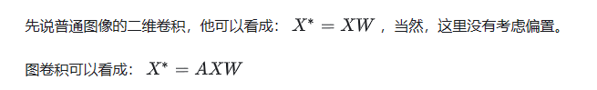
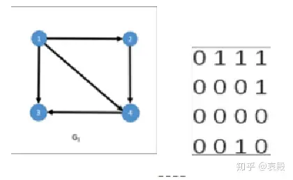
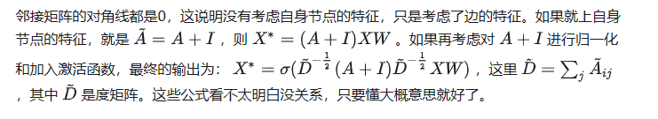
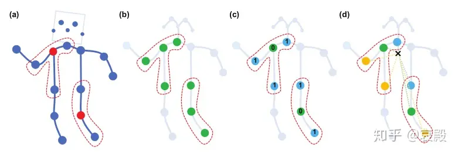
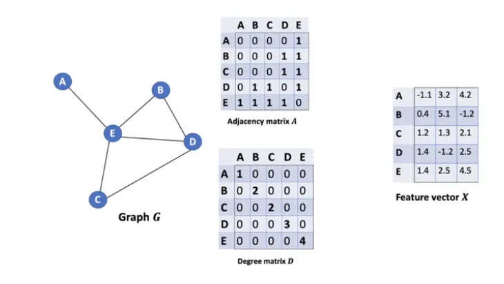
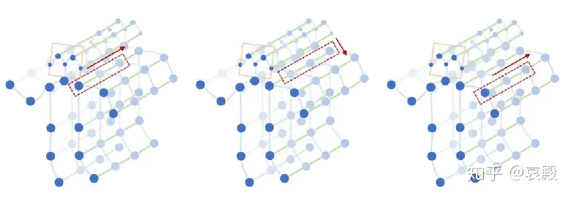
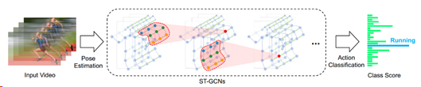
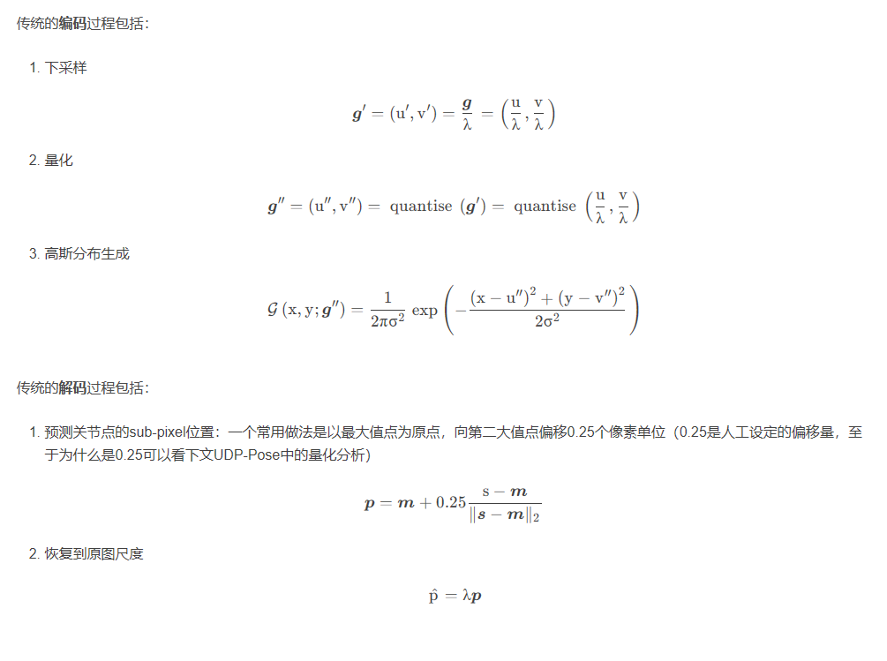

本篇讲解的是 STGCN，不是 ST-GCN！前者是用于「交通流量预测」，后者是用于「人体骨骼的动作识别」。名字很像，但是模型不一样。2018年发表     
2019年发表在CVPR上的AS-GCN和2s-AGCN都是在该代码的基础上改进的。   
## 原理
   
相对于普通图像的二维卷积，图卷积只是多左乘了一个邻接矩阵A。   
邻接矩阵就是他的行和列都是点，而点与点有没有连接用对应矩阵的元素表示，1就代表有连接，0就代表没有连接。当然上图是有向图的，而我们这篇论文用的是无向图。简单来说邻接矩阵就是描述点与边有无联系的一个矩阵。   
   
    

学CNN的时候，会学到卷积核和感受野，图卷积其实也可以这么理解。一般图像二维卷积最小的卷积核就是 3*3
 的卷积核，其实就是一个中心点和周围八个元素共九个元素的组合。这里和CNN相似，定义离中心点距离 d= 1
 ，也就是与中心点直接相连的点为一个卷积核的感受野。如下图 a
 红色虚线所示。   
那么怎么选择卷积核呢？这里感受野都是离中心点距离 d= 1
 的范围，选择卷积核就是说将同范围的点进行分类。比如图 b
 是中心点和相连的点同样的权重，这里只有一种权重；图 c
 是中心点和相连的点采用不同的权重，这里有两种权重；图 d
 分为三种点，一是源点，二是近心点，三是远心点，这里说的是离人体重心近的点和远的点，所以有三种权重。从直觉上，图 d
 的选择方法更加合适。
   

选择合适的感受野和卷积核之后就能够像CNN那样一个点一个点的卷积计算了，卷积的过程就是提取特征的过程。

这里也加了一个注意力机制，论文上说的是一个可学习的掩码 M
 ，加入方式也很简单，就是直接与上面说的 （A+I）
 相乘。这是一种非常简单的方法，虽然他不是最好的，但是用的是最多的。

   
直接拿张网图说明  
邻接矩阵A    
表示的就是每两个节点之间是否有边连接，也就是是否相邻  

度矩阵D   
表示有多少边和节点相连，也就是有多少个相邻节点（无向图）   

1.2.2 小小升级   
引入单位矩阵 I ，（A+I）*X   
根据度数求平均，而非直接sum相加。   
1.2.3 再次升级   
上面的计算对于一个节点来说，每条边的权重其实是一样的，直观上我们可以认为边的权重应该是不一样的。   


作为一篇开创性的文章，自然也会有很多不足之处，比如他的卷积核选择方式只能聚集局部特征，还有注意力机制并不能创造没有直接相连的关节的联系。   

上面说的都是空间特征的提取     
后面要做的就是时间特征的提取。   
时间特征提取用的是TCN，这是一个1D卷积，卷积的维度是时间维度，他的卷积核一行多列，从下图就很容易看明白。   
    


## st-gcn论文
AAAI2018||ST-GCN：Spatial Temporal Graph Convolutional Networks for Skeleton-Based Action Recognition    
图卷积网络（Graph Convolutional Network，GCN）借助图谱的理论来实现空间拓扑图上的卷积，提取出图的空间特征，具体来说，就是将人体骨骼点及其连接看作图，再使用图的邻接矩阵、度矩阵和拉普拉斯矩阵的特征值和特征向量来研究该图的性质。   
ST-GCN单元通过GCN学习空间中相邻关节的局部特征，而时序卷积网络（Temporal convolutional network，TCN）则用于学习时间中关节变化的局部特征。卷积核先完成一个节点在其所有帧上的卷积，再移动到下一个节点，如此便得到了骨骼点图在叠加下的时序特征。    
  
在ST-GCN的网络中，采取每一帧的点的坐标信息和相邻帧的相同点的坐标变换信息作为双流输入，分别采用两个不共享的GCN提取各自特征信息，并进行特征融合后采用softmax函数计算。  

核心观点是将TCN与GCN相结合,用来处理有时序关系的图结构数据。网络分为2个部分:GCN_Net与TCN_Net。  
GCN_Net对输入数据进行空间卷积,即不考虑时间的因素,卷积作用于同一时序的不同点的数据。TCN_Net对数据进行时序卷积,考虑不同时序同一特征点的关系,卷积作用于不同时序同一点的数据。    

ST-GCN是TCN与GCN的结合。TCN，对时间维度的数据进行卷积操作；GCN，则对空间维度的数据进行卷积操作。GCN属于GNN，而GNN的基础是图论。神经网络处理的传统数据都是欧式距离结构的数据，比如二维的图像、一维的声音等等。而对于非欧式距离结构的数据，比如社交网络、交通运输网等等，传统的网络结构无法直接处理，而GNN就是用来处理这类型数据的。所以要了解ST-GCN，就要先从图论的一些基本理论入手，然后再延伸到GNN、GCN、ST-GCN。     

亮点：   
(1) 邻接矩阵不采用传统的方式，采用一种新的方式，将邻接矩阵分为3个子集：根节点本身、向心力群，离心群。这一策略的灵感来自于身体部位的运动可以被广泛地归类为同心运动和偏心运动，通常距离重心越近，运动幅度越小，同时能更好地区分向心运动和离心运动。即下图中的（d）。    
(2) 网络中加入可学习的边的权重，即加入attention机制。每层网络中邻接矩阵A都与可学习的权重相乘，这些权重在反向传播中更新。添加的原因是考虑到人体做不同的动作所侧重的关节点不同，而且添加了注意力机制更有利于提高网络的泛化能力。   


## 实现
对于序列数据的维度要求为(N,C,T,V,M)。维度要求以及详细说明如下表：  
维度	大小	说明  
N	不定	数据集序列个数  
C	2	关键点坐标维度，即(x, y)  
T	50	动作序列的时序维度（即持续帧数）  
V	17	每个人物关键点的个数  
M	1	人物个数，这里我们每个动作序列只针对单人预测    
ST-GCN输入的格式为(1,3,300,18,2)，对应于(batch,channel,frame,joint,person)。  
输出将是（batch，class，output_frame，joint，person）的置信值  


方案说明
1. 使用多目标跟踪获取视频输入中的行人检测框及跟踪ID序号，模型方案为PP-YOLOE，详细文档参考PP-YOLOE，跟踪方案为BOT-SORT
2.	通过行人检测框的坐标在输入视频的对应帧中截取每个行人。
3.	使用关键点识别模型得到对应的17个骨骼特征点。骨骼特征点的顺序及类型与COCO一致.
4.	每个跟踪ID对应的目标行人各自累计骨骼特征点结果，组成该人物的时序关键点序列。当累计到预定帧数或跟踪丢失后，使用行为识别模型判断时序关键点序列的动作类型。当前版本模型支持摔倒行为的识别，预测得到的class id对应关系为：
0: 摔倒
1: 其他


## 动手实践
### 实践问题
paddlevideo训练st-gcn   
1.
```
File "/data/lujunda/drown/code/PaddleVideo/paddlevideo/tasks/train.py", line 286, in train_model
    batch_size * record_list["batch_time"].count /
ZeroDivisionError: division by zero
```
batch过大  
2.  
使用paddle 2.3 或 2.4   
2.6和2.1不行   
3.  
使用ppyoloe+准备数据时，会发生键名错误   
```
python deploy/python/det_keypoint_unite_infer.py \
--det_model_dir=output_inference/ppyoloe_plus_crn_x_80e_coco \
--keypoint_model_dir=output_inference/dark_hrnet_w32_256x192 \
--video_file=../work/clip/0619_12.mp4 \
--device=GPU --save_res=True

Traceback (most recent call last):
  File "/data/lujunda/drown/code/PaddleDetection-2.5.0/deploy/python/det_keypoint_unite_infer.py", line 376, in <module>
    main()
  File "/data/lujunda/drown/code/PaddleDetection-2.5.0/deploy/python/det_keypoint_unite_infer.py", line 339, in main
    topdown_unite_predict_video(detector, topdown_keypoint_detector,
  File "/data/lujunda/drown/code/PaddleDetection-2.5.0/deploy/python/det_keypoint_unite_infer.py", line 189, in topdown_unite_predict_video
    index, keypoint_res['bbox'],
KeyError: 'bbox'


但是这条命令不会
python deploy/python/det_keypoint_unite_infer.py \
--det_model_dir=output_inference/mot_ppyoloe_l_36e_pipeline/ \
--keypoint_model_dir=output_inference/dark_hrnet_w32_256x192 \
--video_file=../work/clip/0619_12.mp4 \
--device=GPU --save_res=True
```

### 训练过程
参数量很少，就是einsum矩阵乘法（空间支）和一些conv2d（时间支）堆叠    
A：边注意力   

```
data = data_batch[0]
label = data_batch[1:]

feature = self.backbone(data)
cls_score = self.head(feature)

bs 1
label[1, 1]

backbone是st-gcn，输入[1, 2, 50, 17, 1]
输出[1, 256, 1, 1]
head: conv变通道，在reshape N,C,1,1 --> N,C
得到[1, 2]

然后计算label和score的cross_entropy
softmax_cross_entropy
两者维度不同如何在底层计算交叉熵？？？，C语言实现无法查看

优化器采用Momentum

维度 大小 说明
N 不定 训练数据集序列数量
C 2 关键点坐标维度，即步骤3中得到的骨骼点坐标(x，y)
T 50 动作序列的时间维度，例如取50帧作为一个动作序列
V 17 每个行人的关键点个数
M 1 人物个数，即每个动作序列只针对单人预测
```
backbone过程
```
x转换
N, C, T, V, M [1, 2, 50, 17, 1]
N, M, V, C, T
N * M, V * C, T [1, 34, 50]
batchnorm
N, M, C, T, V
N * M, C, T, V [1, 2, 50, 17]
进入网络
十个st_gcn_block和edge_importance，每个st_gcn_block含有gcn和tcn
edge_importance边界重要程度edge attention，[3,17,17],'stgcn_0.w_0'
STGCN()
for gcn, importance in zip(self.st_gcn_networks, self.edge_importance):
    x, _ = gcn(x, paddle.multiply(self.A, importance))
x = self.pool(x)  # NM,C,T,V --> NM,C,1,1
C = x.shape[1]
x = paddle.reshape(x, (N, M, C, 1, 1)).mean(axis=1)  # N,C,1,1
return x

st-gcn内部
def forward(self, x, A):
        res = self.residual(x)   第一个block是res=0后面是iden或者指定的conv
        x, A = self.gcn(x, A)
        x = self.tcn(x) + res
        return self.relu(x), A

因为init定义
# build networks
        spatial_kernel_size = A.shape[0]
        temporal_kernel_size = 9
        kernel_size = (temporal_kernel_size, spatial_kernel_size)
        决定一些cfg中没有的定义，决定卷积大小和步长,pad等
        self.data_bn = nn.BatchNorm1D(in_channels *
                                      A.shape[1]) if self.data_bn else iden
        kwargs0 = {k: v for k, v in kwargs.items() if k != 'dropout'}
        self.st_gcn_networks = nn.LayerList((
            st_gcn_block(in_channels,
                         64,
                         kernel_size,
                         1,
                         residual=False,
                         **kwargs0),
            st_gcn_block(64, 64, kernel_size, 1, **kwargs),
            st_gcn_block(64, 64, kernel_size, 1, **kwargs),
            st_gcn_block(64, 64, kernel_size, 1, **kwargs),
            st_gcn_block(64, 128, kernel_size, 2, **kwargs),
            st_gcn_block(128, 128, kernel_size, 1, **kwargs),
            st_gcn_block(128, 128, kernel_size, 1, **kwargs),
            st_gcn_block(128, 256, kernel_size, 2, **kwargs),
            st_gcn_block(256, 256, kernel_size, 1, **kwargs),
            st_gcn_block(256, 256, kernel_size, 1, **kwargs),
        ))


(0): st_gcn_block(
      (gcn): ConvTemporalGraphical(
        (conv): Conv2D(2, 192, kernel_size=[1, 1], padding=(0, 0), data_format=NCHW)    
      )
      (tcn): Sequential(
        (0): BatchNorm2D(num_features=64, momentum=0.9, epsilon=1e-05)
        (1): ReLU()
        (2): Conv2D(64, 64, kernel_size=[9, 1], padding=(4, 0), data_format=NCHW)
        (3): BatchNorm2D(num_features=64, momentum=0.9, epsilon=1e-05)
        (4): Dropout(p=0, axis=None, mode=upscale_in_train)
      )
      (relu): ReLU()
    )

```


ST‑GCN是一个基于骨骼点坐标序列进行预测的模型，它通过将图卷积网络(GCN)
和时间卷积网络(TCN)结合起来，扩展到时空图模型，设计出了用于行为识别的骨骼点序列
通用表示，该模型将人体骨骼表示为图，其中图的每个节点对应于人体的一个关节点。图中
存在两种类型的边，即符合关节的自然连接的空间边(spatial edge)和在连续的时间步骤
中连接相同关节的时间边(temporal edge)。在此基础上构建多层的时空图卷积，它允许信
息沿着空间和时间两个维度进行整合。

```

gcn图卷积，关节的自然连接的空间边(spatial edge)
ConvTemporalGraphical
这一块的作用仅在于与A边注意力做矩阵乘法。
def forward(self, x, A):
        assert A.shape[0] == self.kernel_size   3

        x = self.conv(x)   [1, 192, 50, 17]主要是变通道,1*1卷积
        n, kc, t, v = x.shape
        x = x.reshape((n, self.kernel_size, kc // self.kernel_size, t, v))   [1, 3, 64, 50, 17]    A[3, 17, 17]
        x = einsum(x, A) 矩阵乘法

        return x, A


爱因斯坦求和约定
爱因斯坦求和约定（einsum）提供了一套既简洁又优雅的规则，可实现包括但不限于：向量内积，向量外积，矩阵乘法，转置和张量收缩（tensor contraction）等张量操作，熟练运用 einsum 可以很方便的实现复杂的张量操作，而且不容易出错。

x = x.transpose((0, 2, 3, 1, 4))
n, c, t, k, v = x.shape  [1, 64, 50, 3, 17]
k2, v2, w = A.shape [3, 17, 17]
要求kv对应相等
x = x.reshape((n, c, t, k * v))
A = A.reshape((k * v, w))
y = paddle.matmul(x, A)
[1, 64, 50, 17]

```
```
时间卷积网络(TCN)
这一块的左右主要在50这个维度，[1, 64, 50, 17]，conv操作，50是
T 50 动作序列的时间维度，例如取50帧作为一个动作序列   
tcn中依次经过
(tcn): Sequential(
        (0): BatchNorm2D(num_features=64, momentum=0.9, epsilon=1e-05)
        (1): ReLU()
        (2): Conv2D(64, 64, kernel_size=[9, 1], padding=(4, 0), data_format=NCHW)
        (3): BatchNorm2D(num_features=64, momentum=0.9, epsilon=1e-05)
        (4): Dropout(p=0.5, axis=None, mode=upscale_in_train)
      )
[1, 64, 50, 17]
```
```
10个st-gcn-block结束后
经过pool NM,C,T,V --> NM,C,1,1
将
T 50 动作序列的时间维度，例如取50帧作为一个动作序列
V	17	每个人物关键点的个数
归为1
```

## ST-GCN的技术延展-动作生成

基于对ST-GCN在人体动作识别上的效果,我们将ST-GCN网络与VAE网络结合。目的在于获取人体动作的语义,进而生成人体的动作,最终可以应用于机器人动作模仿或者其他强化学习项目中。

## st-gcn专利日记
2024.1.7晚，可写的，检测跟踪关键点的详细网络结构，网络搭建，st-gcn的详细网络结构  
有点多   
不写了，写怎么应用吧     
使用例子截图，数据截图，   
2024.1.18发不了就滑窗    
319 openpose不够准确，hrnet太久，三维关键点才更加精确    


## Drown 算法流程
### 训练数据准备。检测，关键点准备
这个过程好像没有用到跟踪       
检测出来置信度过滤后直接进入关键点         

    python deploy/python/det_keypoint_unite_infer.py \
    --det_model_dir=output_inference/mot_ppyoloe_l_36e_pipeline/ \
    --keypoint_model_dir=output_inference/dark_hrnet_w32_256x192 \
    --video_file=/data/lujunda/drown/code/work/clip/1.mp4 \
    --device=GPU --save_res=True --output_jsonpath=/data/lujunda/drown/code/work/clip/result/1.json

输入是待检测视频，   
检测阈值设置为0.5   
使用opencv读取视频文件，获取每一帧图像，   

    1) store_res: a list of image_data"
    "2) image_data: [imageid, rects, [keypoints, scores]]"
    "3) rects: list of rect [xmin, ymin, xmax, ymax]"
    "4) keypoints: 17(joint numbers)*[x, y, conf], total 51 data in list"
    "5) scores: mean of all joint conf")
保存的数据结构  

图片预处理成640*640大小检测 


Yolo  
检测后返回  
'boxes': np.ndarray: shape:[N,6], N: number of box,   matix element:[class, score, x_min, y_min, x_max, y_max]   

filter_box   
留下置信度大于检测阈值设置0.5的    

关键点  
paddle直接用fluid自动推理计算，类似c++底层或者GPU层操作，看不了每一步在网络层的计算中间结果，直接取最后结果   
将np_heatmap = heatmap_tensor.copy_to_cpu()   
还得搬到cpu才能看见向量   
shape(1, 17, 64, 48)   
后处理还原   
dark_postprocess   
transform_preds      

translate_to_ori_images

visual   
在推理视频中绘制 框和关键点      
keypoint_threshold=0.5   

    if save_res:
      store_res.append([
          index, keypoint_res['bbox'],
          [keypoint_res['keypoint'][0], keypoint_res['keypoint'][1]]
      ])

至此，完成对一帧的检测和处理   
一帧之下，一个检测框带其附带的关键点，组成一组    

如果一帧之下含有多个检测框          
经过尝试，也可以检出，就是没有跟踪而已      
单帧多个人体框检出记录方式   

    [
    [
        1,
        [
            [
                666,
                484,
                769,
                673
            ],
            [
                468,
                420,
                553,
                579
            ],
            [
                45,
                110,
                69,
                163
            ],
            [
                227,
                346,
                299,
                472
            ]
        ],
        [
            [
                [
                    [
                        747.4048461914062,
                        514.0401000976562,
                        0.7220870852470398
                    ],
                    [
                        744.7247924804688,
                        510.1248779296875,
                        0.5243409872055054
                    ],


        。。。。。。

        ],
            [
                [
                    0.6903820037841797
                ],
                [
                    0.654723048210144
                ],
                [
                    0.686688244342804
                ],
                [
                    0.18033269047737122
                ]
            ]


2023用水上视频跑四阶段算法，可以多目标输出      
但是代码和这个不一样        
多人也能检测和关键点识别，根据2023年经验，但是用来跑一个多目标识别和关键点检测的视频      


整个视频处理完成后   

    if save_res:
      """
      1) store_res: a list of frame_data
      2) frame_data: [frameid, rects, [keypoints, scores]]
      3) rects: list of rect [xmin, ymin, xmax, ymax]
      4) keypoints: 17(joint numbers)*[x, y, conf], total 51 data in list
      5) scores: mean of all joint conf
      """
      with open(FLAGS.output_jsonpath, 'w') as wf:
          json.dump(store_res, wf, indent=4)


### st-gcn训练过程
将前面准备的数据处理成输入格式  


### st-gcn四阶段推理过程


python deploy/pipeline/pipeline.py --config deploy/pipeline/config/infer_cfg_pphuman.yml --video_file=/data/lujunda/drown/code/work/clip/1.mp4 --device=gpu 

不明原因 跑不出结果

1 2 1-1 都试过

下次试一下aistudio上是否能出结果

以上是因为ppdet版本太旧


模型前处理信息

    Model Configuration -----------
    Model Arch: STGCN
    Transform Order: 
    --transform op: AutoPadding
    --------------------------------------------
    -----------  Model Configuration -----------
    Model Arch: HRNet
    Transform Order: 
    --transform op: TopDownEvalAffine
    --transform op: Permute
    --------------------------------------------
    -----------  Model Configuration -----------
    Model Arch: YOLO
    Transform Order: 
    --transform op: Resize
    --transform op: Permute


#### 推理过程：

    if frame_id % 10 == 0:
        print('Thread: {}; frame id: {}'.format(thread_idx, frame_id))
获取一个frame (1080, 1920, 3)   

    res = self.mot_predictor.predict_image(
        [copy.deepcopy(frame_rgb)],
        visual=False,
        reuse_det_result=reuse_det_result,
        frame_count=frame_id)

        记录现在是第几个frame
        一次只输入一个frame进行mot计算
        mot_sde_infer
        该函数里面还有跨境mot do_mtmct
        
    mot_sde_infer
    warmup_frame 50
    det部分会转640*640
    并附带转后scale factor方便之后可视化复原
    input_tensor = self.predictor.get_input_handle(input_names[i])
    input_tensor.copy_from_cpu(inputs[input_names[i]])
    <paddle.fluid.core_avx.PaddleInferTensor object at 0x7f1dee50ca70>
    输入放入gpu中

    后处理置信度过滤
    if np_boxes_num[0] <= 0:
        print('[WARNNING] No object detected.')
        result = {'boxes': np.zeros([0, 6]), 'boxes_num': [0]}使用NumPy库创建一个形状为 (0, 6) 的零矩阵（或者称为零数组）。这意味着创建了一个没有行数，但有6列的数组。
        这将导致一个空数组，因为你实际上要求创建一个没有元素的数组
        []

    self.previous_det_result = det_result
    这个操作主要为了跟踪

跟踪也可以看出是 metric learning度量学习的相似度分类问题，通过建模度量学习识别相似图进行id跟踪   
或者说这种开放域问题都可以视为度量学习问题   
对于泛化性的普世研究   
具体到每个问题，会有针对性优化，也即下游微调，跟踪就有基于轨迹的优化，   

    经过det后
    Returns:
        result (dict): include 'boxes': np.ndarray: shape:[N,6], N: number of box,
            matix element:[class, score, x_min, y_min, x_max, y_max]

    这就是det_predict的结果
    万恶的fluid图，计算过程直接看不见，直接拿结果
    self.predictor的很多函数操作都是在fluid中
    fluid图放在gpu中
    模型放入1.1g
    输入也会在preprocess中放入


#### 进入tracking process

    判断使用哪种跟踪算法，然后进入
    如use_botsort_tracker
    botsort大类可分为use_deepsort_tracker（only support singe class），use_ocsort_tracker（only support singe class），use_botsort_tracker（ use BOTSORTTracker, only support singe class），use ByteTracker（support multiple class）

    online_targets = self.tracker.update(pred_dets, img)
    输入是检测结果，以及1080p原图。检测结果好像没有经过rescale复原回原图大小就放进去了？？？？？？

    涉及online_targets[0].kalman_filter
    返回tlwh id score等信息

    # Remove bad detections
    lowest_inds = scores > self.track_low_thresh 
    0.2

    # Find high threshold detections
    remain_inds = scores > self.track_high_thresh
    0.3
    dets = bboxes[remain_inds]
    scores_keep = scores[remain_inds]
    classes_keep = classes[remain_inds]


    tlbr_to_tlwh

    这种属于jde track

    不适用reid

    joint_stracks  

    # Predict the current location with KF
    STrack.multi_predict(strack_pool, self.kalman_filter)

    可选
    # Fix camera motion
        if self.camera_motion:
    计算均值 相关系数等

    和前面时间步计算iou
    # Associate with high score detection boxes
    ious_dists = matching.iou_distance(strack_pool, detections)
    matches, u_track, u_detection = matching.linear_assignment(
        ious_dists, thresh=self.match_thresh)
    0.7

    ious具体计算
    boxes = np.ascontiguousarray(atlbrs, dtype=np.float32)
    query_boxes = np.ascontiguousarray(btlbrs, dtype=np.float32)
    N = boxes.shape[0]
    K = query_boxes.shape[0]

    for k in range(K):
        box_area = ((query_boxes[k, 2] - query_boxes[k, 0] + 1) *
                    (query_boxes[k, 3] - query_boxes[k, 1] + 1))
        for n in range(N):

        ious[n, k] = iw * ih / ua
    对两个list两两计算iou


    matches, u_track, u_detection = matching.linear_assignment(
        ious_dists, thresh=self.match_thresh)
    0.7


    dists = matching.iou_distance(r_tracked_stracks, detections_second)
    matches, u_track, u_detection_second = matching.linear_assignment(
        dists, thresh=0.5)

    又进行一次second det的assignment计算   
    又得到一次 matches, u_track,

    dists = matching.iou_distance(unconfirmed, detections)

    matches, u_unconfirmed, u_detection = matching.linear_assignment(
        dists, thresh=0.7)
    又算一次

#### activate

    track.activate(self.kalman_filter, self.frame_id)
    activated_starcks.append(track)

    """Start a new track"""


    卡尔曼滤波器激活initiate
    轨迹跟踪
    Args:
            measurement (ndarray): Bounding box coordinates (x, y, a, h) with
                center position (x, y), aspect ratio a, and height h.

    Returns:
            The mean vector (8 dimensional) and covariance matrix (8x8
            dimensional) of the new track. Unobserved velocities are 
            initialized to 0 mean.

    mean = np.r_[mean_pos, mean_vel]

        std = [
            2 * self._std_weight_position * measurement[3],
            2 * self._std_weight_position * measurement[3], 1e-2,
            2 * self._std_weight_position * measurement[3],
            10 * self._std_weight_velocity * measurement[3],
            10 * self._std_weight_velocity * measurement[3], 1e-5,
            10 * self._std_weight_velocity * measurement[3]
        ]
        covariance = np.diag(np.square(std))
    std还是根据经验公式计算的   


    完成self.mean, self.covariance = self.kalman_filter.initiate(
            self.tlwh_to_xyah(self._tlwh))

#### 衔接

    """ Merge """
    self.tracked_stracks = [
        t for t in self.tracked_stracks if t.state == TrackState.Tracked
    ]
    self.tracked_stracks = joint_stracks(self.tracked_stracks,
                                            activated_starcks)
    self.tracked_stracks = joint_stracks(self.tracked_stracks,
                                            refind_stracks)

    def remove_duplicate_stracks(stracksa, stracksb):
    pdist = matching.iou_distance(stracksa, stracksb)
    pairs = np.where(pdist < 0.15)
    dupa, dupb = list(), list()
    for p, q in zip(*pairs):

    结束online_targets = self.tracker.update(pred_dets, img)
    过于复杂
    这还只是第一步跟踪，后续步都没开始推理
    已经要一两小时

    tracking_outs = {
        'online_tlwhs': online_tlwhs,
        'online_scores': online_scores,
        'online_ids': online_ids,
    }
    return tracking_outs

    结束if self.use_botsort_tracker:
                    tracking_outs = self.tracking(det_result, batch_image_list)

    mot_results.append([online_tlwhs, online_scores, online_ids])

 mot output format: id, class, score, xmin, ymin, xmax, ymax   


    # flow_statistic only support single class MOT
    boxes, scores, ids = res[0]  # batch size = 1 in MOT

    工程量巨大
    跳出一个 flow_statistic

    Count totol number, number at a manual-setting interval

    不知道什么时候开始关键点检测
    就又有一个 flow_statistic

检测跟踪实在是太卷，这还只是算法层面就这样了    
晚上看了两个小时了，    
如果不做，是否还继续看   
不如直接水过去吗    
如果秋招不面大厂   
自己也不喜欢也没能力   
是否还需要准备这么多，准备这些跟踪？？？？？    
水过毕业？？？   
专心实习进入aigc????   


## 关键点算法基础       
2020目前在人体姿态估计任务中，广泛采用heatmap作为训练目标，heatmap的编码和解码都遵从固定范式，却从未被深入探究。   
不同于大量对网络结构的创新，CVPR 2020 中出现了两篇文章对heatmap提出了新的理解，并引入了无偏的编码/解码方式。这也揭示了一个全新的研究方向。   

一、回顾heatmap的传统编解码方式
heatmap是keypoints的概率分布图，通常建模成围绕每个keypoint的高斯分布的叠加。

编码(encoding)：原始图像 --> ground truth heatmap
解码(decoding)：predicted heatmap --> 原始图像中的keypoint坐标

受限于计算开销，原始图像通常需要进行下采样，再输入网络中；预测出来的heatmap中的坐标信息也需要恢复到原始图像尺度。在这个过程中，就引入了sub-pixel的系统量化误差。




这篇文章思路很直观，方法也很简单，符合直觉，看得很舒服。

它的核心思想就是编码和解码应保持一致性 。

在传统方法中，编码时我们将heatmap作为一种高斯概率分布，解码时却只利用了最大值信息。DARK-Pose认为模型预测出的heatmap应与ground truth有一致性，即假设预测出的heatmap也是一个高斯分布，我们应该利用整个分布的信息来进行keypoint的精确位置预测。具体地，通过泰勒二阶展开，我们可以预测从最大值点到真实keypoint的偏移。具体推导见论文。 


