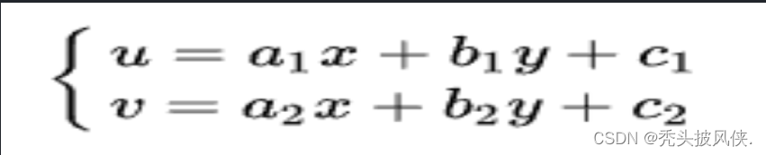
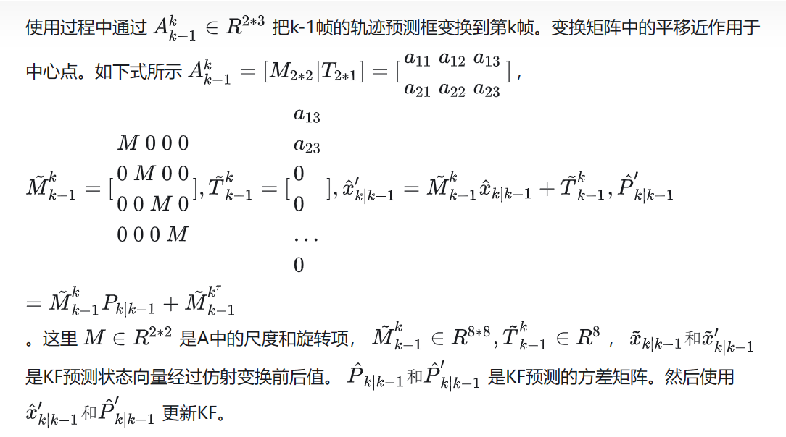
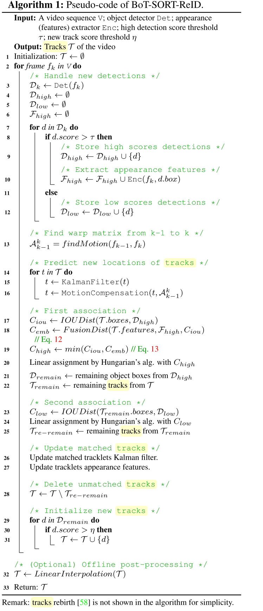

本篇讲解的不是 STGCN，是 ST-GCN！前者是用于「交通流量预测」，后者是用于「人体骨骼的动作识别」。名字很像，但是模型不一样。2018年发表     
2019年发表在CVPR上的AS-GCN和2s-AGCN都是在该代码的基础上改进的。   
## 原理
   
相对于普通图像的二维卷积，图卷积只是多左乘了一个邻接矩阵A。   
邻接矩阵就是他的行和列都是点，而点与点有没有连接用对应矩阵的元素表示，1就代表有连接，0就代表没有连接。当然上图是有向图的，而我们这篇论文用的是无向图。简单来说邻接矩阵就是描述点与边有无联系的一个矩阵。   
   
    

学CNN的时候，会学到卷积核和感受野，图卷积其实也可以这么理解。一般图像二维卷积最小的卷积核就是 3*3
 的卷积核，其实就是一个中心点和周围八个元素共九个元素的组合。这里和CNN相似，定义离中心点距离 d= 1
 ，也就是与中心点直接相连的点为一个卷积核的感受野。如下图 a
 红色虚线所示。   
那么怎么选择卷积核呢？这里感受野都是离中心点距离 d= 1
 的范围，选择卷积核就是说将同范围的点进行分类。比如图 b
 是中心点和相连的点同样的权重，这里只有一种权重；图 c
 是中心点和相连的点采用不同的权重，这里有两种权重；图 d
 分为三种点，一是源点，二是近心点，三是远心点，这里说的是离人体重心近的点和远的点，所以有三种权重。从直觉上，图 d
 的选择方法更加合适。
   

选择合适的感受野和卷积核之后就能够像CNN那样一个点一个点的卷积计算了，卷积的过程就是提取特征的过程。

这里也加了一个注意力机制，论文上说的是一个可学习的掩码 M
 ，加入方式也很简单，就是直接与上面说的 （A+I）
 相乘。这是一种非常简单的方法，虽然他不是最好的，但是用的是最多的。

   
直接拿张网图说明  
邻接矩阵A    
表示的就是每两个节点之间是否有边连接，也就是是否相邻  

度矩阵D   
表示有多少边和节点相连，也就是有多少个相邻节点（无向图）   

1.2.2 小小升级   
引入单位矩阵 I ，（A+I）*X   
根据度数求平均，而非直接sum相加。   
1.2.3 再次升级   
上面的计算对于一个节点来说，每条边的权重其实是一样的，直观上我们可以认为边的权重应该是不一样的。   


作为一篇开创性的文章，自然也会有很多不足之处，比如他的卷积核选择方式只能聚集局部特征，还有注意力机制并不能创造没有直接相连的关节的联系。   

上面说的都是空间特征的提取     
后面要做的就是时间特征的提取。   
时间特征提取用的是TCN，这是一个1D卷积，卷积的维度是时间维度，他的卷积核一行多列，从下图就很容易看明白。   
    


## st-gcn论文
AAAI2018||ST-GCN：Spatial Temporal Graph Convolutional Networks for Skeleton-Based Action Recognition    
图卷积网络（Graph Convolutional Network，GCN）借助图谱的理论来实现空间拓扑图上的卷积，提取出图的空间特征，具体来说，就是将人体骨骼点及其连接看作图，再使用图的邻接矩阵、度矩阵和拉普拉斯矩阵的特征值和特征向量来研究该图的性质。   
ST-GCN单元通过GCN学习空间中相邻关节的局部特征，而时序卷积网络（Temporal convolutional network，TCN）则用于学习时间中关节变化的局部特征。卷积核先完成一个节点在其所有帧上的卷积，再移动到下一个节点，如此便得到了骨骼点图在叠加下的时序特征。    
  
在ST-GCN的网络中，采取每一帧的点的坐标信息和相邻帧的相同点的坐标变换信息作为双流输入，分别采用两个不共享的GCN提取各自特征信息，并进行特征融合后采用softmax函数计算。  

核心观点是将TCN与GCN相结合,用来处理有时序关系的图结构数据。网络分为2个部分:GCN_Net与TCN_Net。  
GCN_Net对输入数据进行空间卷积,即不考虑时间的因素,卷积作用于同一时序的不同点的数据。TCN_Net对数据进行时序卷积,考虑不同时序同一特征点的关系,卷积作用于不同时序同一点的数据。    

ST-GCN是TCN与GCN的结合。TCN，对时间维度的数据进行卷积操作；GCN，则对空间维度的数据进行卷积操作。GCN属于GNN，而GNN的基础是图论。神经网络处理的传统数据都是欧式距离结构的数据，比如二维的图像、一维的声音等等。而对于非欧式距离结构的数据，比如社交网络、交通运输网等等，传统的网络结构无法直接处理，而GNN就是用来处理这类型数据的。所以要了解ST-GCN，就要先从图论的一些基本理论入手，然后再延伸到GNN、GCN、ST-GCN。     

亮点：   
(1) 邻接矩阵不采用传统的方式，采用一种新的方式，将邻接矩阵分为3个子集：根节点本身、向心力群，离心群。这一策略的灵感来自于身体部位的运动可以被广泛地归类为同心运动和偏心运动，通常距离重心越近，运动幅度越小，同时能更好地区分向心运动和离心运动。即下图中的（d）。    
(2) 网络中加入可学习的边的权重，即加入attention机制。每层网络中邻接矩阵A都与可学习的权重相乘，这些权重在反向传播中更新。添加的原因是考虑到人体做不同的动作所侧重的关节点不同，而且添加了注意力机制更有利于提高网络的泛化能力。   


## 实现
对于序列数据的维度要求为(N,C,T,V,M)。维度要求以及详细说明如下表：  
维度	大小	说明  
N	不定	数据集序列个数  
C	2	关键点坐标维度，即(x, y)  
T	50	动作序列的时序维度（即持续帧数）  
V	17	每个人物关键点的个数  
M	1	人物个数，这里我们每个动作序列只针对单人预测    
ST-GCN输入的格式为(1,3,300,18,2)，对应于(batch,channel,frame,joint,person)。  
输出将是（batch，class，output_frame，joint，person）的置信值  


方案说明
1. 使用多目标跟踪获取视频输入中的行人检测框及跟踪ID序号，模型方案为PP-YOLOE，详细文档参考PP-YOLOE，跟踪方案为BOT-SORT
2.	通过行人检测框的坐标在输入视频的对应帧中截取每个行人。
3.	使用关键点识别模型得到对应的17个骨骼特征点。骨骼特征点的顺序及类型与COCO一致.
4.	每个跟踪ID对应的目标行人各自累计骨骼特征点结果，组成该人物的时序关键点序列。当累计到预定帧数或跟踪丢失后，使用行为识别模型判断时序关键点序列的动作类型。当前版本模型支持摔倒行为的识别，预测得到的class id对应关系为：
0: 摔倒
1: 其他


## 动手实践
### 实践问题
paddlevideo训练st-gcn   
1.
```
File "/data/lujunda/drown/code/PaddleVideo/paddlevideo/tasks/train.py", line 286, in train_model
    batch_size * record_list["batch_time"].count /
ZeroDivisionError: division by zero
```
batch过大  
2.  
使用paddle 2.3 或 2.4   
2.6和2.1不行   
3.  
使用ppyoloe+准备数据时，会发生键名错误   
```
python deploy/python/det_keypoint_unite_infer.py \
--det_model_dir=output_inference/ppyoloe_plus_crn_x_80e_coco \
--keypoint_model_dir=output_inference/dark_hrnet_w32_256x192 \
--video_file=../work/clip/0619_12.mp4 \
--device=GPU --save_res=True

Traceback (most recent call last):
  File "/data/lujunda/drown/code/PaddleDetection-2.5.0/deploy/python/det_keypoint_unite_infer.py", line 376, in <module>
    main()
  File "/data/lujunda/drown/code/PaddleDetection-2.5.0/deploy/python/det_keypoint_unite_infer.py", line 339, in main
    topdown_unite_predict_video(detector, topdown_keypoint_detector,
  File "/data/lujunda/drown/code/PaddleDetection-2.5.0/deploy/python/det_keypoint_unite_infer.py", line 189, in topdown_unite_predict_video
    index, keypoint_res['bbox'],
KeyError: 'bbox'


但是这条命令不会
python deploy/python/det_keypoint_unite_infer.py \
--det_model_dir=output_inference/mot_ppyoloe_l_36e_pipeline/ \
--keypoint_model_dir=output_inference/dark_hrnet_w32_256x192 \
--video_file=../work/clip/0619_12.mp4 \
--device=GPU --save_res=True
```

### 训练过程
参数量很少，就是einsum矩阵乘法（空间支）和一些conv2d（时间支）堆叠    
A：边注意力   

```
data = data_batch[0]
label = data_batch[1:]

feature = self.backbone(data)
cls_score = self.head(feature)

bs 1
label[1, 1]

backbone是st-gcn，输入[1, 2, 50, 17, 1]
输出[1, 256, 1, 1]
head: conv变通道，在reshape N,C,1,1 --> N,C
得到[1, 2]

然后计算label和score的cross_entropy
softmax_cross_entropy
两者维度不同如何在底层计算交叉熵？？？，C语言实现无法查看

优化器采用Momentum

维度 大小 说明
N 不定 训练数据集序列数量
C 2 关键点坐标维度，即步骤3中得到的骨骼点坐标(x，y)
T 50 动作序列的时间维度，例如取50帧作为一个动作序列
V 17 每个行人的关键点个数
M 1 人物个数，即每个动作序列只针对单人预测
```
backbone过程
```
x转换
N, C, T, V, M [1, 2, 50, 17, 1]
N, M, V, C, T
N * M, V * C, T [1, 34, 50]
batchnorm
N, M, C, T, V
N * M, C, T, V [1, 2, 50, 17]
进入网络
十个st_gcn_block和edge_importance，每个st_gcn_block含有gcn和tcn
edge_importance边界重要程度edge attention，[3,17,17],'stgcn_0.w_0'
STGCN()
for gcn, importance in zip(self.st_gcn_networks, self.edge_importance):
    x, _ = gcn(x, paddle.multiply(self.A, importance))
x = self.pool(x)  # NM,C,T,V --> NM,C,1,1
C = x.shape[1]
x = paddle.reshape(x, (N, M, C, 1, 1)).mean(axis=1)  # N,C,1,1
return x

st-gcn内部
def forward(self, x, A):
        res = self.residual(x)   第一个block是res=0后面是iden或者指定的conv
        x, A = self.gcn(x, A)
        x = self.tcn(x) + res
        return self.relu(x), A

因为init定义
# build networks
        spatial_kernel_size = A.shape[0]
        temporal_kernel_size = 9
        kernel_size = (temporal_kernel_size, spatial_kernel_size)
        决定一些cfg中没有的定义，决定卷积大小和步长,pad等
        self.data_bn = nn.BatchNorm1D(in_channels *
                                      A.shape[1]) if self.data_bn else iden
        kwargs0 = {k: v for k, v in kwargs.items() if k != 'dropout'}
        self.st_gcn_networks = nn.LayerList((
            st_gcn_block(in_channels,
                         64,
                         kernel_size,
                         1,
                         residual=False,
                         **kwargs0),
            st_gcn_block(64, 64, kernel_size, 1, **kwargs),
            st_gcn_block(64, 64, kernel_size, 1, **kwargs),
            st_gcn_block(64, 64, kernel_size, 1, **kwargs),
            st_gcn_block(64, 128, kernel_size, 2, **kwargs),
            st_gcn_block(128, 128, kernel_size, 1, **kwargs),
            st_gcn_block(128, 128, kernel_size, 1, **kwargs),
            st_gcn_block(128, 256, kernel_size, 2, **kwargs),
            st_gcn_block(256, 256, kernel_size, 1, **kwargs),
            st_gcn_block(256, 256, kernel_size, 1, **kwargs),
        ))


(0): st_gcn_block(
      (gcn): ConvTemporalGraphical(
        (conv): Conv2D(2, 192, kernel_size=[1, 1], padding=(0, 0), data_format=NCHW)    
      )
      (tcn): Sequential(
        (0): BatchNorm2D(num_features=64, momentum=0.9, epsilon=1e-05)
        (1): ReLU()
        (2): Conv2D(64, 64, kernel_size=[9, 1], padding=(4, 0), data_format=NCHW)
        (3): BatchNorm2D(num_features=64, momentum=0.9, epsilon=1e-05)
        (4): Dropout(p=0, axis=None, mode=upscale_in_train)
      )
      (relu): ReLU()
    )

```


ST‑GCN是一个基于骨骼点坐标序列进行预测的模型，它通过将图卷积网络(GCN)
和时间卷积网络(TCN)结合起来，扩展到时空图模型，设计出了用于行为识别的骨骼点序列
通用表示，该模型将人体骨骼表示为图，其中图的每个节点对应于人体的一个关节点。图中
存在两种类型的边，即符合关节的自然连接的空间边(spatial edge)和在连续的时间步骤
中连接相同关节的时间边(temporal edge)。在此基础上构建多层的时空图卷积，它允许信
息沿着空间和时间两个维度进行整合。

```

gcn图卷积，关节的自然连接的空间边(spatial edge)
ConvTemporalGraphical
这一块的作用仅在于与A边注意力做矩阵乘法。
def forward(self, x, A):
        assert A.shape[0] == self.kernel_size   3

        x = self.conv(x)   [1, 192, 50, 17]主要是变通道,1*1卷积
        n, kc, t, v = x.shape
        x = x.reshape((n, self.kernel_size, kc // self.kernel_size, t, v))   [1, 3, 64, 50, 17]    A[3, 17, 17]
        x = einsum(x, A) 矩阵乘法

        return x, A


爱因斯坦求和约定
爱因斯坦求和约定（einsum）提供了一套既简洁又优雅的规则，可实现包括但不限于：向量内积，向量外积，矩阵乘法，转置和张量收缩（tensor contraction）等张量操作，熟练运用 einsum 可以很方便的实现复杂的张量操作，而且不容易出错。

x = x.transpose((0, 2, 3, 1, 4))
n, c, t, k, v = x.shape  [1, 64, 50, 3, 17]
k2, v2, w = A.shape [3, 17, 17]
要求kv对应相等
x = x.reshape((n, c, t, k * v))
A = A.reshape((k * v, w))
y = paddle.matmul(x, A)
[1, 64, 50, 17]

```
```
时间卷积网络(TCN)
这一块的左右主要在50这个维度，[1, 64, 50, 17]，conv操作，50是
T 50 动作序列的时间维度，例如取50帧作为一个动作序列   
tcn中依次经过
(tcn): Sequential(
        (0): BatchNorm2D(num_features=64, momentum=0.9, epsilon=1e-05)
        (1): ReLU()
        (2): Conv2D(64, 64, kernel_size=[9, 1], padding=(4, 0), data_format=NCHW)
        (3): BatchNorm2D(num_features=64, momentum=0.9, epsilon=1e-05)
        (4): Dropout(p=0.5, axis=None, mode=upscale_in_train)
      )
[1, 64, 50, 17]
```
```
10个st-gcn-block结束后
经过pool NM,C,T,V --> NM,C,1,1
将
T 50 动作序列的时间维度，例如取50帧作为一个动作序列
V	17	每个人物关键点的个数
归为1
```

没有写最后一层的输出是什么             


## ST-GCN的技术延展-动作生成

基于对ST-GCN在人体动作识别上的效果,我们将ST-GCN网络与VAE网络结合。目的在于获取人体动作的语义,进而生成人体的动作,最终可以应用于机器人动作模仿或者其他强化学习项目中。

## st-gcn专利日记
2024.1.7晚，可写的，检测跟踪关键点的详细网络结构，网络搭建，st-gcn的详细网络结构  
有点多   
不写了，写怎么应用吧     
使用例子截图，数据截图，   
2024.1.18发不了就滑窗    
319 openpose不够准确，hrnet太久，三维关键点才更加精确    


## Drown 算法流程
### 训练数据准备。检测，关键点准备
这个过程好像没有用到跟踪       
检测出来置信度过滤后直接进入关键点         


    python deploy/python/det_keypoint_unite_infer.py \
    --det_model_dir=output_inference/mot_ppyoloe_l_36e_pipeline/ \
    --keypoint_model_dir=output_inference/dark_hrnet_w32_256x192 \
    --video_file=/data/lujunda/drown/code/work/clip/1.mp4 \
    --device=GPU --save_res=True --output_jsonpath=/data/lujunda/drown/code/work/clip/result/1.json

输入是待检测视频，   
检测阈值设置为0.5   
使用opencv读取视频文件，获取每一帧图像，  

以下是st-gcn数据输入数据的准备，不涉及跟踪算法，只有检测和关键点      

    1) store_res: a list of image_data"
    "2) image_data: [imageid, rects, [keypoints, scores]]"
    "3) rects: list of rect [xmin, ymin, xmax, ymax]"
    "4) keypoints: 17(joint numbers)*[x, y, conf], total 51 data in list"
    "5) scores: mean of all joint conf")
保存的数据结构  

图片预处理成640*640大小检测 


Yolo  
检测后返回  
'boxes': np.ndarray: shape:[N,6], N: number of box,   matix element:[class, score, x_min, y_min, x_max, y_max]   

filter_box   
留下置信度大于检测阈值设置0.5的    

关键点  
paddle直接用fluid自动推理计算，类似c++底层或者GPU层操作，看不了每一步在网络层的计算中间结果，直接取最后结果   
将np_heatmap = heatmap_tensor.copy_to_cpu()   
还得搬到cpu才能看见向量   
shape(1, 17, 64, 48)   
后处理还原   
dark_postprocess   
transform_preds      

translate_to_ori_images

visual   
在推理视频中绘制 框和关键点      
keypoint_threshold=0.5   

    if save_res:
      store_res.append([
          index, keypoint_res['bbox'],
          [keypoint_res['keypoint'][0], keypoint_res['keypoint'][1]]
      ])

至此，完成对一帧的检测和处理   
一帧之下，一个检测框带其附带的关键点，组成一组    

如果一帧之下含有多个检测框          
经过尝试，也可以检出，就是没有跟踪而已      
单帧多个人体框检出记录方式   

    [
    [
        1,
        [
            [
                666,
                484,
                769,
                673
            ],
            [
                468,
                420,
                553,
                579
            ],
            [
                45,
                110,
                69,
                163
            ],
            [
                227,
                346,
                299,
                472
            ]
        ],
        [
            [
                [
                    [
                        747.4048461914062,
                        514.0401000976562,
                        0.7220870852470398
                    ],
                    [
                        744.7247924804688,
                        510.1248779296875,
                        0.5243409872055054
                    ],


        。。。。。。

        ],
            [
                [
                    0.6903820037841797
                ],
                [
                    0.654723048210144
                ],
                [
                    0.686688244342804
                ],
                [
                    0.18033269047737122
                ]
            ]


2023用水上视频跑四阶段算法，可以多目标输出      
但是代码和这个不一样        
多人也能检测和关键点识别，根据2023年经验，但是用来跑一个多目标识别和关键点检测的视频      


以下是st-gcn数据输入数据的准备，不涉及跟踪算法，只有检测和关键点      
整个视频处理完成后   

    if save_res:
      """
      1) store_res: a list of frame_data
      2) frame_data: [frameid, rects, [keypoints, scores]]
      3) rects: list of rect [xmin, ymin, xmax, ymax]
      4) keypoints: 17(joint numbers)*[x, y, conf], total 51 data in list
      5) scores: mean of all joint conf
      """
      with open(FLAGS.output_jsonpath, 'w') as wf:
          json.dump(store_res, wf, indent=4)


### st-gcn训练过程
将前面准备的数据处理成输入格式  


### st-gcn四阶段推理过程


    python deploy/pipeline/pipeline.py --config deploy/pipeline/config/infer_cfg_pphuman.yml --video_file=/data/lujunda/drown/code/work/clip/1.mp4 --device=gpu 

不明原因 跑不出结果

1 2 1-1 都试过

下次试一下aistudio上是否能出结果

以上是因为ppdet版本太旧


模型前处理信息

    Model Configuration -----------
    Model Arch: STGCN
    Transform Order: 
    --transform op: AutoPadding
    --------------------------------------------
    -----------  Model Configuration -----------
    Model Arch: HRNet
    Transform Order: 
    --transform op: TopDownEvalAffine
    --transform op: Permute
    --------------------------------------------
    -----------  Model Configuration -----------
    Model Arch: YOLO
    Transform Order: 
    --transform op: Resize
    --transform op: Permute


#### 推理过程：

    if frame_id % 10 == 0:
        print('Thread: {}; frame id: {}'.format(thread_idx, frame_id))
获取一个frame (1080, 1920, 3)   

    res = self.mot_predictor.predict_image(
        [copy.deepcopy(frame_rgb)],
        visual=False,
        reuse_det_result=reuse_det_result,
        frame_count=frame_id)

        记录现在是第几个frame
        一次只输入一个frame进行mot计算
        mot_sde_infer
        该函数里面还有跨境mot do_mtmct
        
    mot_sde_infer
    warmup_frame 50
    det部分会转640*640
    并附带转后scale factor方便之后可视化复原
    input_tensor = self.predictor.get_input_handle(input_names[i])
    input_tensor.copy_from_cpu(inputs[input_names[i]])
    <paddle.fluid.core_avx.PaddleInferTensor object at 0x7f1dee50ca70>
    输入放入gpu中

    后处理置信度过滤
    if np_boxes_num[0] <= 0:
        print('[WARNNING] No object detected.')
        result = {'boxes': np.zeros([0, 6]), 'boxes_num': [0]}使用NumPy库创建一个形状为 (0, 6) 的零矩阵（或者称为零数组）。这意味着创建了一个没有行数，但有6列的数组。
        这将导致一个空数组，因为你实际上要求创建一个没有元素的数组
        []

    self.previous_det_result = det_result
    这个操作主要为了跟踪

跟踪也可以看出是 metric learning度量学习的相似度分类问题，通过建模度量学习识别相似图进行id跟踪   
或者说这种开放域问题都可以视为度量学习问题   
对于泛化性的普世研究   
具体到每个问题，会有针对性优化，也即下游微调，跟踪就有基于轨迹的优化，   

    经过det后
    Returns:
        result (dict): include 'boxes': np.ndarray: shape:[N,6], N: number of box,
            matix element:[class, score, x_min, y_min, x_max, y_max]

    这就是det_predict的结果
    万恶的fluid图，计算过程直接看不见，直接拿结果
    self.predictor的很多函数操作都是在fluid中
    fluid图放在gpu中
    模型放入1.1g
    输入也会在preprocess中放入


#### 进入tracking process botsort（最难点）

    判断使用哪种跟踪算法，然后进入
    如use_botsort_tracker
    botsort大类可分为use_deepsort_tracker（only support singe class），use_ocsort_tracker（only support singe class），use_botsort_tracker（ use BOTSORTTracker, only support singe class），use ByteTracker（support multiple class）

    online_targets = self.tracker.update(pred_dets, img)
    输入是检测结果，以及1080p原图。检测结果好像没有经过rescale复原回原图大小就放进去了？？？？？？

    涉及online_targets[0].kalman_filter
    返回tlwh id score等信息

    # Remove bad detections
    lowest_inds = scores > self.track_low_thresh 
    0.2

    # Find high threshold detections
    remain_inds = scores > self.track_high_thresh
    0.3
    dets = bboxes[remain_inds]
    scores_keep = scores[remain_inds]
    classes_keep = classes[remain_inds]


    tlbr_to_tlwh

    这种属于jde track

    不适用reid

    joint_stracks  

    # Predict the current location with KF
    STrack.multi_predict(strack_pool, self.kalman_filter)

    可选
    # Fix camera motion
        if self.camera_motion:
    计算均值 相关系数等

    和前面时间步计算iou
    # Associate with high score detection boxes
    ious_dists = matching.iou_distance(strack_pool, detections)
    matches, u_track, u_detection = matching.linear_assignment(
        ious_dists, thresh=self.match_thresh)
    0.7

    ious具体计算
    boxes = np.ascontiguousarray(atlbrs, dtype=np.float32)
    query_boxes = np.ascontiguousarray(btlbrs, dtype=np.float32)
    N = boxes.shape[0]
    K = query_boxes.shape[0]

    for k in range(K):
        box_area = ((query_boxes[k, 2] - query_boxes[k, 0] + 1) *
                    (query_boxes[k, 3] - query_boxes[k, 1] + 1))
        for n in range(N):

        ious[n, k] = iw * ih / ua
    对两个list两两计算iou


    matches, u_track, u_detection = matching.linear_assignment(
        ious_dists, thresh=self.match_thresh)
    0.7


    dists = matching.iou_distance(r_tracked_stracks, detections_second)
    matches, u_track, u_detection_second = matching.linear_assignment(
        dists, thresh=0.5)

    又进行一次second det的assignment计算   
    又得到一次 matches, u_track,

    dists = matching.iou_distance(unconfirmed, detections)

    matches, u_unconfirmed, u_detection = matching.linear_assignment(
        dists, thresh=0.7)
    又算一次

#### activate

    track.activate(self.kalman_filter, self.frame_id)
    activated_starcks.append(track)

    """Start a new track"""


    卡尔曼滤波器激活initiate
    轨迹跟踪
    Args:
            measurement (ndarray): Bounding box coordinates (x, y, a, h) with
                center position (x, y), aspect ratio a, and height h.

    Returns:
            The mean vector (8 dimensional) and covariance matrix (8x8
            dimensional) of the new track. Unobserved velocities are 
            initialized to 0 mean.

    mean = np.r_[mean_pos, mean_vel]

        std = [
            2 * self._std_weight_position * measurement[3],
            2 * self._std_weight_position * measurement[3], 1e-2,
            2 * self._std_weight_position * measurement[3],
            10 * self._std_weight_velocity * measurement[3],
            10 * self._std_weight_velocity * measurement[3], 1e-5,
            10 * self._std_weight_velocity * measurement[3]
        ]
        covariance = np.diag(np.square(std))
    std还是根据经验公式计算的   


    完成self.mean, self.covariance = self.kalman_filter.initiate(
            self.tlwh_to_xyah(self._tlwh))


#### 衔接

    """ Merge """
    self.tracked_stracks = [
        t for t in self.tracked_stracks if t.state == TrackState.Tracked
    ]
    self.tracked_stracks = joint_stracks(self.tracked_stracks,
        activated_starcks)
    self.tracked_stracks = joint_stracks(self.tracked_stracks,
        refind_stracks)

    def remove_duplicate_stracks(stracksa, stracksb):
    pdist = matching.iou_distance(stracksa, stracksb)
    pairs = np.where(pdist < 0.15)
    dupa, dupb = list(), list()
    for p, q in zip(*pairs):

    结束online_targets = self.tracker.update(pred_dets, img)
    过于复杂       
    这还只是第一步跟踪，后续步都没开始推理   
    已经要一两小时看

    tracking_outs = {
        'online_tlwhs': online_tlwhs,
        'online_scores': online_scores,
        'online_ids': online_ids,
    }
    return tracking_outs

    结束if self.use_botsort_tracker:
        tracking_outs = self.tracking(det_result, batch_image_list)

    mot_results.append([online_tlwhs, online_scores, online_ids])

 mot output format: id, class, score, xmin, ymin, xmax, ymax   


    # flow_statistic only support single class MOT
    未使用
    boxes, scores, ids = res[0]  # batch size = 1 in MOT

    工程量巨大
    跳出一个 flow_statistic

    Count totol number, number at a manual-setting interval

    不知道什么时候开始关键点检测
    就又有一个 flow_statistic

检测跟踪实在是太卷，这还只是算法层面就这样了    
晚上看了两个小时了，    
如果不做，是否还继续看   
不如直接水过去吗    
如果秋招不面大厂   
自己也不喜欢也没能力   
是否还需要准备这么多，准备这些跟踪？？？？？    
水过毕业？？？   
专心实习进入aigc????   
自己还有两篇few step gen论文原理没看完呢  
就在这里扒跟踪源码   
急着发专利   
慢慢来   
既然不面大厂，也别再做一些违心的大厂准备   
2024.4.4


#### 跟踪维护了哪些变量
输入：检测框（现在观测），上一个状态     
输出：在字典里面维护现在的状态，并时刻维护state变量标志是否进入st-gcn

iou计算可能要用上一状态     
还有维护一个 strack          

mot中有一个 frame_count

记录yolo后处理结果     
self.previous_det_result = det_result    
shape (1, 6)    
例子[0.0, 0.88692635, 822.72125, 48.385178, 1186.757, 713.6829]       
cls_id, score, x0, y0, x1, y1       
同时也用作 pred_dets


tracking_outs = self.tracking(det_result, batch_image_list)   
online_targets = self.tracker.update(pred_dets, img原图)     
tracker维护表   
一些基本的参数设置         
    

其中的stracks维护     
轨迹信息的表示方法是：轨迹位置和速度影响下的均值和协方差，形状分别是(1,8)，（1，8，8）     
frame_id      
激活情况       
上一步的检测框      
步骤如下：   
先通过卡尔曼滤波更新track的均值协方差参数，其依据的只是以前的信息。      
在计算iou时会用到上一步检测框和当前检测框     
根据Iou结果进行关联匹配，获取哪些是匹配哪些未匹配     
    for itracked, idet in matches:
        track = strack_pool[itracked]
        det = detections[idet]
        if track.state == TrackState.Tracked:
            track.update(detections[idet], self.frame_id)
            activated_starcks.append(track)
所以卡尔曼滤波器有什么作用？又不用来计算关联匹配    

    
    

update为核心算法，下面这些代码在update出来后调用结果    

    for t in online_targets:
        tlwh = t.tlwh
        tid = t.track_id
        tscore = t.score
        if tlwh[2] * tlwh[3] <= self.tracker.min_box_area:
            continue
        online_tlwhs[0].append(tlwh)
        online_ids[0].append(tid)
        online_scores[0].append(tscore)

    tracking_outs = {
        'online_tlwhs': online_tlwhs,
        'online_scores': online_scores,
        'online_ids': online_ids,
    }
    return tracking_outs

属于这个类的方法     

    class BOTSORTTracker(object):
        """
        BOTSORT tracker, support single class

        Args:
            track_high_thresh (float): threshold of detection high score
            track_low_thresh (float): threshold of remove detection score
            new_track_thresh (float): threshold of new track score
            match_thresh (float): iou threshold for associate
            track_buffer (int): tracking reserved frames,default 30
            这里会不会出问题？？？因为推理是跟踪50帧    
            min_box_area (float): reserved min box
            camera_motion (bool): Whether use camera motion, default False
            cmc_method (str): camera motion method,defalut sparseOptFlow
            frame_rate (int): fps buffer_size=int(frame_rate / 30.0 * track_buffer)
        """

##### 算法内部
###### 高分框和可取框

    # Remove bad detections
    lowest_inds = scores > self.track_low_thresh 0.2
    bboxes = bboxes[lowest_inds]
    scores = scores[lowest_inds]
    classes = classes[lowest_inds]

    # Find high threshold detections
    remain_inds = scores > self.track_high_thresh 0.3
    dets = bboxes[remain_inds]
    scores_keep = scores[remain_inds]
    classes_keep = classes[remain_inds]

跟踪算法仿佛不需要训练，没有预训练模型，只是一个先验方法，纯人工设计      
然后去评价基准      

卡尔曼滤波器

    def multi_predict(self, mean, covariance):
        """
        Run Kalman filter prediction step (Vectorized version).
        
        Args:
            mean (ndarray): The Nx8 dimensional mean matrix of the object states
                at the previous time step.
            covariance (ndarray): The Nx8x8 dimensional covariance matrics of the
                object states at the previous time step.

        Returns:
            The mean vector and covariance matrix of the predicted state.
            Unobserved velocities are initialized to 0 mean.
        """
仿佛采样器的设计，纯手工      
很奇妙   
    # Predict the current location with KF
    STrack.multi_predict(strack_pool, self.kalman_filter)

上一轨迹信息     
    
     

###### 一次匹配 


    ''' Add newly detected tracklets to tracked_stracks'''
    unconfirmed = []
    tracked_stracks = []  # type: list[STrack]
    for track in self.tracked_stracks:
        if not track.is_activated:
            unconfirmed.append(track)
        else:
            tracked_stracks.append(track)
    ''' Step 2: First association, with high score detection boxes'''
    strack_pool = joint_stracks(tracked_stracks, self.lost_stracks)
    #跟丢的 已有的 都一起加入轨迹池，做第一次匹配

    # Predict the current location with KF
    STrack.multi_predict(strack_pool, self.kalman_filter)

    # Fix camera motion
    这里竟然被关闭了？
    if self.camera_motion:
        warp = self.gmc.apply(img[0], dets)
        STrack.multi_gmc(strack_pool, warp)
        STrack.multi_gmc(unconfirmed, warp)


    # Associate with high score detection boxes
    ious_dists = matching.iou_distance(strack_pool, detections)
    cost矩阵
    matches, u_track, u_detection = matching.linear_assignment(
        ious_dists, thresh=self.match_thresh)
    匈牙利
    内部是 return matches, unmatched_a, unmatched_b

每次track到，update内部

    self.mean, self.covariance = self.kalman_filter.update(
        self.mean, self.covariance, self.tlwh_to_xyah(new_tlwh))

    def update(self, mean, covariance, measurement):
        """
        Run Kalman filter correction step.

        Args:
            mean (ndarray): The predicted state's mean vector (8 dimensional).
            covariance (ndarray): The state's covariance matrix (8x8 dimensional).
            measurement (ndarray): The 4 dimensional measurement vector
                (x, y, a, h), where (x, y) is the center position, a the aspect
                ratio, and h the height of the bounding box.

        Returns:
            The measurement-corrected state distribution.
        """

    其他状态也要更新
    self.state = TrackState.Tracked #1 初始化已有 # set flag 'tracked'
    self.is_activated = True  # set flag 'activated'
    self.score = new_track.score

剩下代码

    for itracked, idet in matches:
        track = strack_pool[itracked]
        det = detections[idet]
        if track.state == TrackState.Tracked:
            track.update(detections[idet], self.frame_id)
            activated_starcks.append(track)
        else:
            track.re_activate(det, self.frame_id, new_id=False)
            refind_stracks.append(track)

TrackState来源  

    class TrackState(object):
        New = 0
        Tracked = 1
        Lost = 2
        Removed = 3s


###### 二次匹配(低分框)   
为了预防遮挡等问题，试图继续关联上未匹配轨迹

    ''' Step 3: Second association, with low score detection boxes'''
    if len(scores):
    实际是取容忍范围内的低分检测框
    但是根本不可能？？？
    因为检测置信度设置在0.5
    所以这套算法把botsort的相机补偿，bytetrack的二次匹配都给删除了，所以更快？？？？？

        inds_high = scores < self.track_high_thresh（0.3）
        inds_low = scores > self.track_low_thresh（0.2）
        inds_second = np.logical_and(inds_low, inds_high)
        dets_second = bboxes[inds_second]
        scores_second = scores[inds_second]
        classes_second = classes[inds_second]

    # association the untrack to the low score detections
    if len(dets_second) > 0:
        '''Detections'''
        detections_second = [
            STrack(STrack.tlbr_to_tlwh(tlbr), s, c) for (tlbr, s, c) in
            zip(dets_second, scores_second, classes_second)
        ]
    else:
        detections_second = []
    
    r_tracked_stracks = [
        strack_pool[i] for i in u_track
        if strack_pool[i].state == TrackState.Tracked #这个好像是标记是否还在跟踪，以及是否已经放弃匹配？？？
    ]
    dists = matching.iou_distance(r_tracked_stracks, detections_second)
    matches, u_track, u_detection_second = matching.linear_assignment(
        dists, thresh=0.5)

###### 三次匹配
TrackState来源  

    class TrackState(object):
        New = 0
        Tracked = 1
        Lost = 2
        Removed = 3


相比第一次匹配:第一次匹配阈值0.7且可调节，第二次0.5固定多出以下
（类似第三次匹配，对不可信轨迹反复确认，匹配阈值固定0.7）

    for it in u_track:
        track = r_tracked_stracks[it]
        if not track.state == TrackState.Lost: # 2 初始化已有
            track.mark_lost()
            lost_stracks.append(track)
    '''Deal with unconfirmed tracks, usually tracks with only one beginning frame'''
    detections = [detections[i] for i in u_detection]
    dists = matching.iou_distance(unconfirmed, detections)

    matches, u_unconfirmed, u_detection = matching.linear_assignment(
        dists, thresh=0.7)
    for itracked, idet in matches:
        unconfirmed[itracked].update(detections[idet], self.frame_id)
        activated_starcks.append(unconfirmed[itracked])
    for it in u_unconfirmed:
        track = unconfirmed[it]
        track.mark_removed()
        removed_stracks.append(track)
matching.linear_assignment内部，

    cost, x, y = lap.lapjv(cost_matrix, extend_cost=True, cost_limit=thresh) #c++底层，无法查看
    for ix, mx in enumerate(x):
        if mx >= 0:
            matches.append([ix, mx])
    unmatched_a = np.where(x < 0)[0] #一元组
    #where函数来查找数组x中小于0的元素的索引，并将这些索引存储在unmatched_a数组中。[0]索引表示返回的是元素索引的数组，而不是元素本身。
    unmatched_b = np.where(y < 0)[0] #一元组
    matches = np.asarray(matches) #二元组
    return matches, unmatched_a, unmatched_b


    """LAP
    ``lap`` is a linear assignment problem solver using Jonker-Volgenant
    algorithm for dense (LAPJV) or sparse (LAPMOD) matrices.

    Functions
    ---------

    lapjv
        Find optimal (minimum-cost) assignment for a dense cost matrix.
    lapmod
        Find optimal (minimum-cost) assignment for a sparse cost matrix.
    """

unconfirmed来源

    for track in self.tracked_stracks:
        if not track.is_activated:
            #没被激活跟踪的？？？
            #和strack_pool[i].state == TrackState.Tracked有什么区别？？？
            unconfirmed.append(track)
        else:
            tracked_stracks.append(track)


对于刚开始的第一帧，没有阈值匹配的轨迹，则会进入   

    dists = matching.iou_distance(unconfirmed, detections)
    matches, u_unconfirmed, u_detection = matching.linear_assignment(
            dists, thresh=0.7)
    # 匈牙利
    #内部是 return matches, unmatched_a, unmatched_b。阈值即0.7 0.5这些，
    for itracked, idet in matches:
        unconfirmed[itracked].update(detections[idet], self.frame_id)
        activated_starcks.append(unconfirmed[itracked])
    for it in u_unconfirmed:
        track = unconfirmed[it]
        track.mark_removed()
        removed_stracks.append(track)
    """ Step 4: Init new stracks"""
    使用u_detection
    for inew in u_detection:
        track = detections[inew]
        if track.score < self.new_track_thresh:（0.4）
            continue

        track.activate(self.kalman_filter, self.frame_id)
        activated_starcks.append(track)


调用这个激活activate新轨迹，即初始化轨迹信息，状态信息

    def activate(self, kalman_filter, frame_id):
        """Start a new track"""
        self.kalman_filter = kalman_filter
        # update track id for the object class
        self.track_id = self.next_id(self.cls_id)
        人物id，内部++1，不是frame_id
        self.mean, self.covariance = self.kalman_filter.initiate(
            self.tlwh_to_xyah(self._tlwh))
        更新状态参数，即均值，协方差
        在看原理时候，状态好像是x y 高宽 

        self.track_len = 0
        self.state = TrackState.Tracked  # set flag 'tracked'
        原本是0 ，变 1

        if frame_id == 1:  # to record the first frame's detection result
            self.is_activated = True
        frame_id这个应该回每次新轨迹都更新为0 1，但没找到在哪里更新的          
        激活标志，在外面使用

        self.frame_id = frame_id
        self.start_frame = frame_id


具体来说 KalmanFilter 含有 initiate 和 update两种方法，不同情况使用   

    class KalmanFilter(object):
        """
        A simple Kalman filter for tracking bounding boxes in image space.

        The 8-dimensional state space

            x, y, a, h, vx, vy, va, vh

        就是这些      
        但是这些怎么对应到均值和协方差？？？？

        contains the bounding box center position (x, y), aspect ratio a, height h,
        and their respective velocities.

        Object motion follows a constant velocity model. The bounding box location
        (x, y, a, h) is taken as direct observation of the state space (linear
        observation model).

        """
    其中
    def initiate(self, measurement):
        """
        Create track from unassociated measurement.

        Args:
            measurement (ndarray): Bounding box coordinates (x, y, a, h) with
                center position (x, y), aspect ratio a, and height h.

        Returns:
            The mean vector (8 dimensional) and covariance matrix (8x8
            dimensional) of the new track. Unobserved velocities are 
            initialized to 0 mean.
        """
        mean_pos = measurement
        mean_vel = np.zeros_like(mean_pos)
        mean = np.r_[mean_pos, mean_vel]

        std = [
            2 * self._std_weight_position * measurement[3],
            2 * self._std_weight_position * measurement[3], 1e-2,
            2 * self._std_weight_position * measurement[3],
            10 * self._std_weight_velocity * measurement[3],
            10 * self._std_weight_velocity * measurement[3], 1e-5,
            10 * self._std_weight_velocity * measurement[3]
        ]
        covariance = np.diag(np.square(std))
        return mean, np.float32(covariance)

    有速度 有位置        
    self.mean, self.covariance = self.kalman_filter.initiate(
            self.tlwh_to_xyah(self._tlwh))


""" Step 4: Init new stracks"""     

    for inew in u_detection:
        track = detections[inew]
        if track.score < self.new_track_thresh:（0.4）
            continue

        track.activate(self.kalman_filter, self.frame_id)
        activated_starcks.append(track)

""" Step 5: Update state"""

    for track in self.lost_stracks:
        if self.frame_id - track.end_frame > self.max_time_lost:
            track.mark_removed()
            removed_stracks.append(track)
lost_stracks，u_unconfirmed都进入removed_stracks       


""" Merge """


    self.tracked_stracks = [
        t for t in self.tracked_stracks if t.state == TrackState.Tracked
    ]
    self.tracked_stracks = joint_stracks(self.tracked_stracks,
        activated_starcks)
    self.tracked_stracks = joint_stracks(self.tracked_stracks,
        refind_stracks)
    self.lost_stracks = sub_stracks(self.lost_stracks, self.tracked_stracks)
    self.lost_stracks.extend(lost_stracks)
    self.lost_stracks = sub_stracks(self.lost_stracks, self.removed_stracks)
    self.removed_stracks.extend(removed_stracks)
    self.tracked_stracks, self.lost_stracks = remove_duplicate_stracks(
        self.tracked_stracks, self.lost_stracks)

    # output_stracks = [track for track in self.tracked_stracks if track.is_activated]
    output_stracks = [track for track in self.tracked_stracks]

    return output_stracks

refind_stracks,来源第一二次匹配。activated_starcks来源第一二三次匹配

    for itracked, idet in matches:
        track = strack_pool[itracked]
        det = detections[idet]
        if track.state == TrackState.Tracked:
            track.update(detections[idet], self.frame_id)
            activated_starcks.append(track)
        else:
            track.re_activate(det, self.frame_id, new_id=False)
            refind_stracks.append(track)

反复确认不可信轨迹没找到，好像就是一次性删除      
找到      
针对lost_track做      
if self.frame_id - track.end_frame > self.max_time_lost:（30）     
第三次匹配的u_unconfirmed则是一次性删除      


至此结束

跟踪的输入输出        
输入：前面状态信息 + 本次检测 + 维护的一些变量如state标志进入st-gcn      
输出：更新状态信息    

该算法没有使用相机补偿，没有二次匹配，因为置信度和二次匹配阈值冲突     


#### 输入输出
直接看各部分输入输出

输入是待检测视频，
检测阈值设置为0.5，
使用opencv读取视频文件，获取每一帧图像，

静态加载显存1.1g

##### mot
mot输入是原图片大小1080p           

preprocess: 图片预处理成640*640大小再放进检测 

Yolo
检测后返回      

    'boxes': np.ndarray: shape:[N,6], N: number of box,   matix element:[class, score, x_min, y_min, x_max, y_max]

postprocess: 过滤出置信度大于0.5的保留    


跟踪    

跟踪的输入输出        
输入：前面状态信息 + 本次检测 + 维护的一些变量如state标志进入st-gcn      
输出：更新状态信息供下次利用     
跟踪目标id       

具体哪些？？？？？？    
太多了       
self.tracked_stracks内部有置信度，检测框，均值协方差用于卡尔曼滤波            
self.lost_stracks      
self.removed_stracks     
大概这些      

另一篇专利的写法    
基于多目标跟踪及人体姿态序列检测的摔
倒行为识别方法      

    3.根据权利要求1所述的基于多目标跟踪及人体姿态序列检测的摔倒行为识别方法，
    其特征在于：
    步骤2中，以视频抽帧后时序图片集作为输入数据，经ByteTrack算法模型获取图片集
    中每个行人检测框坐标以及人体目标。
    4.根据权利要求1所述的基于多目标跟踪及人体姿态序列检测的摔倒行为识别方法，
    其特征在于：
    步骤2中，具体数据关联流程如下：
    步骤2 .1，根据检测器得到的人体目标检测框置信度，将检测框分为分值不小于0 .5的
    高分框和分值低于0.5的低分框；
    步骤2.2，使用高分框与之前跟踪轨迹进行匹配；
    步骤2.3，然后使用低分框与前一次没有匹配上的高分框跟踪轨迹进行匹配；
    步骤2 .4，对于没有匹配上的跟踪轨迹且得分高的检测框，对其新建一个跟踪轨迹；对
    于没有匹配上的跟踪轨迹保留30帧，在其再次出现时再进行匹配

我们这个算法是0.3以上为高分框，0.3~0.2为低分框，剩下的不要        
没有二次匹配阈值冲突      
这个是一致的：对于没有匹配上的跟踪轨迹保留30帧   


该算法没有使用相机补偿，没有二次匹配，因为置信度和二次匹配阈值冲突，reid也被关闭       
阉割版botsort        
原版botsort有三个改进点。这个算法只用了一个，八元组状态        


tracking_outs = self.tracking(det_result, batch_image_list)       
输入原图以及检测框     

    tracking_outs = {
            'online_tlwhs': online_tlwhs,# topleft
            'online_scores': online_scores,
            'online_ids': online_ids,
        }

这个结果做个转换

    for box, score, i in zip(boxes[0], scores[0], ids[0]):
        xmin, ymin, w, h = box
        res = [i, 0, score, xmin, ymin, xmin + w, ymin + h]
        mot_res.append(res)
        # tlwh转成。。。
    return {'boxes': np.array(mot_res)}

mot output format: id, class, score, xmin, ymin, xmax, ymax       

##### mot结束
这个主要是用在人流统计，这里没有用到     
flow_statistic only support single class MOT     

    statistic = flow_statistic(
                        mot_result,！！！！！！
                        self.secs_interval,
                        self.do_entrance_counting,
                        self.do_break_in_counting,
                        self.region_type,
                        video_fps,
                        entrance,
                        id_set,
                        interval_id_set,
                        in_id_list,
                        out_id_list,
                        prev_center,
                        records,！！！！！！！
                        ids2names=self.mot_predictor.pred_config.labels)
    records = statistic['records']  ！！！！   ！
人流统计没启用，这个pipeline实现了五大功能，还可以禁停时间违法停车检测      

crop_input, new_bboxes（扩大后的）, ori_bboxes = crop_image_with_mot(
                    frame_rgb, mot_res)     

def expand_crop(images, rect, expand_ratio=0.3):    

扩大裁剪，1.3倍      

    h_half = (ymax - ymin) * (1 + expand_ratio) / 2.
    w_half = (xmax - xmin) * (1 + expand_ratio) / 2.


##### 跟踪总结
输入为检测模型的结果、frame_id和已有的轨迹信息：
轨迹信息的表示方法是：轨迹位置和速度影响下的均值和协方差，形状分别是(1,8)，（1，8，8）


##### 进入skeleton_action判断
关键点检测以及st-gcn       


输入为三通道的扩大裁剪图
kpt_pred = self.kpt_predictor.predict_image(
            crop_input, visual=False)     

此时显存1.8g   
###### 关键点内部   
例如某次的输入是(805, 625, 3)     

preprocess :    
{'trainsize': [192, 256], 'type': 'TopDownEvalAffine'}   
{'type': 'Permute'}    
TopDownEvalAffine：  
"""
apply affine transform to image and coords

    Args:
        trainsize (list): [w, h], the standard size used to train
        use_udp (bool): whether to use Unbiased Data Processing.
        records(dict): the dict contained the image and coords

    Returns:
        records (dict): contain the image and coords after tranformed

    """     
get_affine_transform："""Get the affine transform matrix, given the center/scale/rot/output_size."""     
Returns:
        np.ndarray: The transform matrix.      
cv2.warpAffine       
输出(256, 192, 3)，          
permute: (3, 256, 192)

inputs (1, 3, 256, 192)

predict    
'''
        Args:
            repeats (int): repeat number for prediction
        Returns:
            results (dict): include 'boxes': np.ndarray: shape:[N,6], N: number of box,
                            matix element:[class, score, x_min, y_min, x_max, y_max]
                            MaskRCNN's results include 'masks': np.ndarray:
                            shape: [N, im_h, im_w]
        '''       
输出是：result（heatmap）是(1, 17, 64, 48)      
下采样4倍         

例如64维度中第十三行

    [6.0683087e-05, 6.0683087e-05, 6.0683087e-05, 6.0683087e-05, 6.0683087e-05, 6.0683087e-05, 6.0683087e-05, 6.0683087e-05, 6.0683087e-05, 6.1804785e-05, 6.533717e-05, 8.219354e-05, 8.5734595e-05, 8.04631e-05, 0.00011036145, 0.00012661309, 0.0013357147, 0.0312597, 0.116559274, 0.25516352, 0.48690733, 0.6961217, 0.81392884, 0.75194377, 0.57636684, 0.34512103, 0.1755316, 0.071667686, 0.02051582, 0.0021151109, 0.0013283836, 0.0008929919, 0.0003331269, 0.00024613683, 0.000119642384, 6.0683087e-05, 6.0683087e-05, 6.0683087e-05, 6.0683087e-05, 6.0683087e-05, 6.0683087e-05, 6.0683087e-05, 6.0683087e-05, 6.0683087e-05, 6.0683087e-05, 6.0683087e-05, 6.0683087e-05, 6.0683087e-05]

    最大最小值分别是，出现热力点
    0.81392884
    6.0683087e-05


postprocess     
result = self.postprocess(inputs, result)    
use_dark=False       
kpts, scores = keypoint_postprocess(np_heatmap, center, scale)      
center原expanded_crop图中心，scale原expanded_crop图尺寸/20固定值     

get_final_preds

    get_final_preds(self, heatmaps, center, scale, kernelsize=3):       
        """the highest heatvalue location with a quarter offset in the
        direction from the highest response to the second highest response.       
        
        Args:
            heatmaps (numpy.ndarray): The predicted heatmaps
            center (numpy.ndarray): The boxes center
            scale (numpy.ndarray): The scale factor          
        Returns:
            preds: numpy.ndarray([batch_size, num_joints, 2]), keypoints coords
            maxvals: numpy.ndarray([batch_size, num_joints, 1]), the maximum confidence of the keypoints
        """

    先进这个coords, maxvals = self.get_max_preds(heatmaps)
        类似transformer处理，两维图像变一维
        idx = np.argmax(heatmaps_reshaped, 2)
        (1, 17)
        maxvals = np.amax(heatmaps_reshaped, 2)
        (1, 17)
        
        
        amax
        Return the maximum of an array or maximum along an axis.     
        argmax :
        Return the indices of the maximum values.


        tile(A, reps):
    """
    Construct an array by repeating A the number of times given by reps.

    repeat : Repeat elements of an array.

    >>> a = np.array([0, 1, 2])
    >>> np.tile(a, 2)
    array([0, 1, 2, 0, 1, 2])
    >>> np.tile(a, (2, 2))
    array([[0, 1, 2, 0, 1, 2],
           [0, 1, 2, 0, 1, 2]])
    >>> np.tile(a, (2, 1, 2))
    array([[[0, 1, 2, 0, 1, 2]],
           [[0, 1, 2, 0, 1, 2]]])

    preds[:, :, 0] = (preds[:, :, 0]) % width
        preds[:, :, 1] = np.floor((preds[:, :, 1]) / width)

    这个获取最大值的函数有些奇怪

    遍历处理    
    coords[n][p] += np.sign(diff) * .25

    转换到原expanded_crop图中
    transform_preds(coords, center, scale, output_size):
    target_coords = np.zeros(coords.shape)
    trans = get_affine_transform(center, scale * 200, 0, output_size, inv=1)
    for p in range(coords.shape[0]):
        target_coords[p, 0:2] = affine_transform(coords[p, 0:2], trans)
    return target_coords

    return np.concatenate(
            (preds, maxvals), axis=-1), np.mean(
                maxvals, axis=1)
            preds(1, 17, 2) maxvals(1, 17, 1)
            

kpts, scores = keypoint_postprocess(np_heatmap, center, scale)         
(1, 17, 3) [0.84424555]


result包含

主函数之外的后处理
keypoint_vector, score_vector = translate_to_ori_images(
                        kpt_pred, np.array(new_bboxes))     
不是很清楚在搞什么，做了一些相加动作    

kpt_res['keypoint'] = [
        keypoint_vector.tolist(), score_vector.tolist()
    ] if len(keypoint_vector) > 0 else [[], []]        
kpt_res['bbox'] = ori_bboxes 即（[[837, 67, 1199, 709]]）

关键点的输出是：

###### 关键点结束
self.kpt_buff.update(kpt_res, mot_res)  # collect kpt output     
mot_res：类别 位置 置信度        

state = self.kpt_buff.get_state(
                    )       
                    # whether frame num is enough or lost tracker      
来源是跟踪那时候记录的      


准备进入st-gcn      
whether frame num is enough or lost tracker     
什么时候进入：只有跟踪完一个人的时候      

    if state:
        if frame_id > self.warmup_frame:
            self.pipe_timer.module_time[
                'skeleton_action'].start()
        collected_keypoint = self.kpt_buff.get_collected_keypoint(
        )  # reoragnize kpt output with ID
        skeleton_action_input = parse_mot_keypoint(
            collected_keypoint, self.coord_size)
        skeleton_action_res = self.skeleton_action_predictor.predict_skeleton_with_mot(
            skeleton_action_input)
        if frame_id > self.warmup_frame:
            self.pipe_timer.module_time['skeleton_action'].end()
        self.pipeline_res.update(skeleton_action_res,
                                    'skeleton_action')


然后对每一帧可视化       
检测 关键点 行为识别        


继续循环迭代每一帧         


##### st-gcn内部分析
直接断点打到     
第一次判断直接累计到50帧max       

    collected_keypoint = self.kpt_buff.get_collected_keypoint(

    获取累计50帧的self.kpt_buff.keypoint_saver[1.0].bboxes，self.kpt_buff.keypoint_saver[1.0].kpts
    每帧kpts包含十七个关键点x,y,score
    取出同时清空self的记录，然后将state打False
此时 trackid = 1       
 
下一次五十帧再判断时 trackid 也可能还是 1   
再过一次`前处理`变成模型输入

    skeleton_action_input = parse_mot_keypoint(
        collected_keypoint, self.coord_size)  

    内部：
    kpts = np.array(kpt_seq.kpts, dtype=np.float32)[:, :, :2]
    (50, 17, 2) 
    kpts = np.expand_dims(np.transpose(kpts, [2, 0, 1]),
            -1)  #T, K, C -> C, T, K, 1
    (2, 50, 17, 1)
    第0维分为x y 索引

    bbox = np.array(kpt_seq.bboxes, dtype=np.float32)
    skeleton.append(refine_keypoint_coordinary(kpts, bbox, coord_size))
    coord_size ： [384, 512]

    refine_keypoint_coordinary返回(2, 50, 17, 1)
    计算互相加减乘除 

    好像是还原回原图位置

    skeleton_action_input ： 
    {'mot_id': [1.0], 'skeleton': （大小(2, 50, 17, 1)）
    [array([[[[166.76791763],
         [173.67407227],
         [166.76791763],
         ...,
         [180.58011246],
         [256.54701233],
         [284.17126465]],

        [[160.17827225],
         [167.13092422],
         [160.17827225],
         ...,
         [146.27297974],
         [243.61003876],
         [257.51531982]],

        [[188.52428055],
         [188.52428055],
         [188.52428055],
         ...,
         [167.67022705],
         [251.08644104],
         [278.89194489]],

        ...,

        [[171.34708786],
         [177.12187958],
         [159.79773331],
         ...,
         [ 26.97930908],
         [119.37472916],
         [ 44.30344963]],

        [[177.11967087],
         [182.89842224],
         [159.78333664],
         ...,
         [ 32.65013123],
         [125.11058807],
         [ 49.98647118]],

        [[171.27765656],
         [182.87133408],
         [159.68396759],
         ...,
         [ 32.1534977 ],
         [124.90293503],
         [ 43.74717808]]],


       [[[ 82.84526825],
         [ 67.26894379],
         [ 67.26894379],
         ...,
         [337.25857544],
         [446.29284668],
         [415.14019775]],

        [[ 72.0873642 ],
         [ 61.70358658],
         [ 61.70358658],
         ...,
         [336.87362671],
         [451.09515381],
         [414.75195312]],

        [[ 78.99394226],
         [ 68.60202789],
         [ 68.60202789],
         ...,
         [343.98788452],
         [447.90704346],
         [421.92727661]],

        ...,

        [[ 86.83824158],
         [ 76.45271301],
         [ 76.45271301],
         ...,
         [330.89819336],
         [460.71728516],
         [455.52456665]],

        [[ 76.37138367],
         [ 65.98072815],
         [ 65.98072815],
         ...,
         [330.94268799],
         [466.02130127],
         [460.82595825]],

        [[ 86.8814621 ],
         [ 76.47416687],
         [ 76.47416687],
         ...,
         [336.65652466],
         [466.74771118],
         [456.34042358]]]])]}

skeleton_action_res = self.skeleton_action_predictor.predict_skeleton_with_mot(
    skeleton_action_input)

    predict_skeleton_with_mot内部

    act_res = self.predict_skeleton(skeleton_list, run_benchmark, repeats=1)
    results = list(zip(mot_id, act_res))   


##### predict_skeleton
###### preprocess       
[{'window_size': 50, 'type': 'AutoPadding'}]    

AutoPadding(object):      
    """
    Sample or Padding frame skeleton feature.   
    Args:     
        window_size (int): Temporal size of skeleton feature.    
        random_pad (bool): Whether do random padding when frame length < window size. Default: False.    
    """         
50帧一个整体判断动作        

C, T, V, M = data.shape     
(2, 50, 17, 1)         

内部不够补零完整操作

    def __call__(self, results):
        data = results

        C, T, V, M = data.shape
        T = self.get_frame_num(data)
        if T == self.window_size:
            data_pad = data[:, :self.window_size, :, :]
        elif T < self.window_size:
            begin = random.randint( #随机往两边补零，但是这里没有开启self.random_pad，所以是右边补零
                0, self.window_size - T) if self.random_pad else 0
            data_pad = np.zeros((C, self.window_size, V, M))
            data_pad[:, begin:begin + T, :, :] = data[:, :T, :, :]
        else:
            if self.random_pad:
                index = np.random.choice(
                    T, self.window_size, replace=False).astype('int64')
            else: #也没开启随机取，所以是直接截断
                index = np.linspace(0, T, self.window_size).astype("int64")
            data_pad = data[:, index, :, :]

        return data_pad
将input转到fluid （其实新几个版本不再使用fluid）         

    for i in range(len(input_names)):
        input_tensor = self.predictor.get_input_handle(input_names[i])
        input_tensor.copy_from_cpu(inputs[input_names[i]])
        (1, 2, 50, 17, 1)


###### prediction
此时显存2.2g        
output_names : ['reshape2_34.tmp_0']    

    for i in range(repeats):
        self.predictor.run()
        output_tensor = self.predictor.get_output_handle(output_names[0])
        np_output = output_tensor.copy_to_cpu()
        
        shape : (1, 2)
        [0.527242, -0.51960087]
        两类判断      

result = {'output': array([[ 0.527242  , -0.51960087]], dtype=float32)}

###### postprocess
result = self.postprocess(inputs, result)   
inputs是前处理获得        

内部：    

    output_logit = result['output'][0]
    长相array([ 0.527242  , -0.51960087], dtype=float32)
    这个分类的输出有些奇怪，st-gcn的输出竟然不是sigmoid？？？？？      

    classes = np.argpartition(output_logit, -1)[-1:]
    仅仅是获取索引
    算法功能：快速查找最大值，非正常排序，结合多种算法，结合了快速选择（quickselect）、堆选择（heapselect）和插入排序（insertion sort）的特点。
    递归深度过大是切换算法,通过切换缓解最差情况
    复杂度O(n) - O(nlogn)

    classes = classes[np.argsort(-output_logit[classes])]
    从大到小排序

    scores = output_logit[classes]
    result = {'class': classes, 'score': scores}


skeleton_action_input ： 

    skeleton_action_input['mot_id']： [1.0]
    skeleton_action_input['skeleton']： (2, 50, 17, 1)
skeleton_action_res：

    (1.0, {'class': array([0]), 'score': array([0.527242], dtype=float32)})
                        
self.pipeline_res.clear('reid')   
内部   

    {'det': {}, 'mot': {'boxes': array([[1.00000000e+00, 0.00000000e+00, 9.39166427e-01, 8.00075500e+02,
    1.05496582e+02, 1.24348267e+03, 7.63483887e+02]])}, 'attr': {}, 'kpt': {'keypoint': [...], 'bbox': [...]}, 'video_action': {}, 'skeleton_action': {1.0: {...}}, 'reid': {}, 'det_action': {}, 'cls_action': {}, 'vehicleplate': {}, 'vehicle_attr': {}, 'lanes': {}, 'vehicle_press': {}, 'vehicle_retrograde': {}}

剩下的仍是写视频，可视化    
继续迭代下一帧   


##### 结束输出
视频可视化     

以下是st-gcn数据输入数据的准备，不涉及跟踪算法，只有检测和关键点      

    1) store_res: a list of image_data"
    "2) image_data: [imageid, rects, [keypoints, scores]]"
    "3) rects: list of rect [xmin, ymin, xmax, ymax]"
    "4) keypoints: 17(joint numbers)*[x, y, conf], total 51 data in list"
    "5) scores: mean of all joint conf")


## 关键点算法基础       
2020目前在人体姿态估计任务中，广泛采用heatmap作为训练目标，heatmap的编码和解码都遵从固定范式，却从未被深入探究。   
不同于大量对网络结构的创新，CVPR 2020 中出现了两篇文章对heatmap提出了新的理解，并引入了无偏的编码/解码方式。这也揭示了一个全新的研究方向。   

一、回顾heatmap的传统编解码方式
heatmap是keypoints的概率分布图，通常建模成围绕每个keypoint的高斯分布的叠加。

编码(encoding)：原始图像 --> ground truth heatmap
解码(decoding)：predicted heatmap --> 原始图像中的keypoint坐标

受限于计算开销，原始图像通常需要进行下采样，再输入网络中；预测出来的heatmap中的坐标信息也需要恢复到原始图像尺度。在这个过程中，就引入了sub-pixel的系统量化误差。


这篇文章思路很直观，方法也很简单，符合直觉，看得很舒服。

它的核心思想就是编码和解码应保持一致性 。

在传统方法中，编码时我们将heatmap作为一种高斯概率分布，解码时却只利用了最大值信息。DARK-Pose认为模型预测出的heatmap应与ground truth有一致性，即假设预测出的heatmap也是一个高斯分布，我们应该利用整个分布的信息来进行keypoint的精确位置预测。具体地，通过泰勒二阶展开，我们可以预测从最大值点到真实keypoint的偏移。具体推导见论文。 


### cv2.warpAffine
仿射变换，又称仿射映射，是指在几何中，一个向量空间进行一次线性变换并接上一个平移，变换为另一个向量空间。    
   
通过方程我们就可以很轻易的看出，c1和c2就相当于是让图像平移，而a和b这2个参数就是对图像进行旋转，缩放等操作。

由于图像是3维的，所以这里还需要增加下维度，构建齐次方程进行运算

    import cv2
    import numpy as np
    
    lp = cv2.resize(cv2.imread('../images/lp.jpg'), None, fx=0.7, fy=0.7)
    h, w, channel = lp.shape
    
    M = np.float32([[1, 0, 50], [0, 1, 50]])
    new_lp1 = cv2.warpAffine(lp, M, (w, h))
    M = np.float32([[1, 0.2, 0], [0.2, 1, 0]])
    new_lp2 = cv2.warpAffine(lp, M, (w, h))
    M = np.float32([[1.3, 0, 0], [0, 1.3, 0]])
    new_lp3 = cv2.warpAffine(lp, M, (w, h))
    
    cv2.imshow('lp', np.hstack((lp, new_lp1, new_lp2, new_lp3)))
    cv2.waitKey(0)
    cv2.destroyAllWindows()


## 跟踪算法基础 
MOT主流范式为基于检测的跟踪 tracking-by-detection，即先检测后跟踪。跟踪通常包括2个主要部分

    目标的定位，主要是预测轨迹边界框和检测边界框之间的IoU
    目标的外观模型和解决Re-ID任务
    主要通过卡尔曼滤波 KF 预测后续帧的轨迹边界框位置
    运动模型和状态估计
    将新帧检测与当前轨迹集相关联
    这2种方法都被量化为距离，并用于将关联任务作为全局分配问题来解决
大多数SORT-like算法采用卡尔曼滤波器和恒速模型假设作为运动模型。KF 用于预测下一帧中的 tracklet 边界框，以与检测边界框相关联，并用于在遮挡或未检测到的情况下预测 tracklet 状态。    
与目标检测器驱动的检测相比，使用 KF 状态估计作为跟踪器的输出会导致边界框形状次优。最近的大多数方法都使用了经典跟踪器 DeepSORT 中提出的 KF 状态表征，它试图估计框的纵横比而不是宽度，这导致宽度大小估计不准确。     


### BoT-SORT 2022
260hz速度    
BoT-SORT: Robust Associations Multi-Pedestrian Tracking    

    YOLOX & YOLOv7 support
    Multi-class support（paddle中使用的还是单类）
    Camera motion compensation
    Re-identification
https://github.com/NirAharon/BoT-SORT   
https://arxiv.org/abs/2206.14651   
[Submitted on 29 Jun 2022 (v1), last revised 7 Jul 2022 (this version, v2)]   

SORT-like IoU-based 方法主要取决于 tracklet 的预测边界框的质量。因此，在许多复杂的场景中，预测边界框的正确位置可能会由于相机运动而失败，这导致2个相关边界框之间的重叠率低，最终导致跟踪器性能低下。作者通过采用传统的图像配准来估计相机运动，通过适当地校正卡尔曼滤波器来克服这个问题。这里将此称为相机运动补偿（CMC）。    
在许多情况下，SORT-like 算法中的定位和外观信息（即重识别）会导致跟踪器的检测能力 (MOTA) 和跟踪器随时间保持正确身份的能力 (IDF1) 之间的权衡。使用 IoU 通常可以实现更好的 MOTA，而 Re-ID 可以实现更高的 IDF1  

Contributions    
通过解决上述 SORT-like 的跟踪器的限制并将它们集成到 ByteTrack      


#### 原理   
     
提出了一种新的鲁棒的SOTA的跟踪器，它结合了运动和表面信息的优势，以及相机运动补充和一个更精确的Kalman滤波状态向量。被称为BoT-SORT和BoT-SORT-ReID，在MOT17和MOT20 test排名第一。   

目前经典的DeepSORT基本是用box的高宽比值作为KF状态的输出，但这样是次优的输出，不直接；像SOR T系列基本是以IOU作为评价相似性的方法，但是假如相机移动时，可能带来IOU计算不符合实际，需要添加相机运动补偿；

提出了相机运动补偿方式和KF直接输出更好的box长宽而非比值；提出了一种简答有效的IOU和Re ID cosine距离融合方法。

方法      
本方法基于ByteTrack，同时对此做了3方面的改进。提出了BoT-SORT 和 BoT-SORT-ReID（BoT-SORT的提升）。

我们可以在任何含有不确定信息的动态系统中的使用卡尔曼滤波，对系统的下一步动作做出有根据的猜测。猜测的依据是预测值和观测值，首先我们认为预测值和观测值都符合高斯分布且包含误差，然后我们预设预测值的误差Q和观测值的误差R，然后计算得到卡尔曼增益，最后利用卡尔曼增益来综合预测值和观测值的结果，得到我们要的最优估计。通俗的说卡尔曼滤波就是将算出来的预测值和观测值综合考虑的过程。  

2.1 Kalman Filter   
一般方法中都是使用恒定速度的离散Kalman滤波模型对目标的运动进行建模。    
    
说实话这个公式量已经不亚于去读各种采样器原理        
通常采用SORT中恒速先验的卡尔曼滤波建模目标运动，其状态向量是7元组，但是实验中发现对边界框宽高的估计会比宽高比的估计更好，所以改成了8元组状态向量      
     

2.2 相机运动模型CMC   
怎么好像又涉及3d生成，视频生成的东西         
微调lora        
原因：Tracking-by-detection式跟踪器严重依赖于轨迹预测框和检测框之间的overlap。在动态摄像头场景下，box的像素位置会发生剧烈变化导致跟丢。即使在静态的摄像头中，由于风的影响，也会带来微笑震动。      
https://cloud.tencent.com/developer/article/2362129       
     
   

   
这些公式就跟采样器公式一样，符号多意义不明确      

2.3 IoU和Re ID 融合    
    

##### BoT-SORT大致框架：（BoT-SORT是以Byte为基础改进的）      
   
   
多帧都匹配不上，就移除该轨迹     
匈牙利算法匹配（即关联度量）（多项式时间内解决分配问题）（assignment）(数据关联)      
卡尔曼滤波器预测     
   


##### ByteTrack大致框架：（BoT-SORT是以Byte为基础改进的）      
    
 高亮部分为BoT-SORT改进部分     


##### 算法实践梳理
    # Predict the current location with KF
    STrack.multi_predict(strack_pool, self.kalman_filter)
实际上实在依据multi_mean，multi_covariance重新计算更新multi_mean，multi_covariance      
即对位置 速度 重新估算     

通过两步间的检测框算iou  

匈牙利算法关联匹配，算出匹配与未匹配的

更新轨迹信息   
即      
更新frame_id     
track_len     
通过det以及之前卡尔曼状态更新卡尔曼状态

跟踪上时设置：

    self.state = TrackState.Tracked  # set flag 'tracked'
    self.is_activated = True  # set flag 'activated'

    if update_feature(T) and self.use_reid（F）:
         self.update_features(new_track.curr_feat)

activated_starcks.append(track)  


输入为检测框、frame_id和已有的轨迹信息：    
输出为人物id和新的轨迹信息。   
跟踪算法具体关联匹配规则如下：     
1. 将置信度大于0.6的检测框作为高分检测框，置信度小于0.6且大于0.5的检测框作为低分检测框。   
2. 首先将高分检测框与已有轨迹关联计算，然后将低分框与之前没有匹配上的轨迹关联计算。如果高分检测框匹配上已有轨迹，则更新已有轨迹信息。第三次匹配是专门针对首帧后没有后文的前面‘假轨迹’匹配，若‘假轨迹’还是没有配上，删除，对于没配上的检测框，开启新轨迹。如果高分检测框没有匹配上已有轨迹，则新建一个轨迹。没有匹配上的轨迹保留30帧，超出30帧仍未匹配上，则将该轨迹移出待匹配列表。          
关联计算具体来说，先将已有轨迹信息由卡尔曼滤波器计算状态，状态的表示为均值和协方差，代表八元组数据，里面有矩阵视角的加速同步计算，关联结算的度量是iou匹配，准确说是单纯计算iou结果保存，然后使用匈牙利算法加速匹配关联过程，即得出哪些是匹配上的，没匹配上的，      
更新信息

一般方法中都是使用恒定速度的离散Kalman滤波模型对目标的运动进行建模。    
    
说实话这个公式量已经不亚于去读各种采样器原理        
通常采用SORT中恒速先验的卡尔曼滤波建模目标运动，其状态向量是7元组，但是实验中发现对边界框宽高的估计会比宽高比的估计更好，所以改成了8元组状态向量      
     

八元组即 四个位置信息 四个相应的速度（斜率）     


#### 原理再阅读
BoT-SORT 丝滑跟踪 | 超越 DeepSORT、StrongSORT++ 和 ByteTrack        
SORT(Simple Online and Realtime Tracking)算法是一种简单的在线实时多目标跟踪算法，主要利用卡尔曼滤波来传播目标物体到未来帧中，再通过IOU作为度量指标来建立关系，实现多目标的追踪      
id频繁切换，只适用于遮挡少，运动稳定      

跟踪通常由两个主要部分组成：     
（1）用于预测后续时刻帧的轨迹边界框的运动模型和状态估计，最常用的方法是卡尔曼滤波。     
（2）将新一帧检测到的目标位置和当前跟踪轨迹序列关联，当前两种常用方法分别是：      
（a）定位目标，计算预测的轨迹边界框和检测到的目标位置之间的IoU；     
（b）借助目标的外观模型，解决重新识别任务（Re-ID）。       

     
      

##### 4.4Limitations       
在高密度动态目标场景中，相机运动的预测会由于背景关键点缺失而出错；且计算相机的全局运动会很费时。   
分离的外观跟踪器运行速度低，可以考虑将特征提取网络以联合检测-嵌入的方式合并到检测器中。   

与联合跟踪器和几个无外观跟踪器相比，分离的外观跟踪器的运行速度相对较低。      
我们仅将深度特征提取应用于高置信度检测（百度算法中没有看到特征提取？？？？？），以降低计算成本。如有必要，特征提取器网络可以以联合检测-嵌入的方式合并到检测头中。      


#### 卡尔曼滤波器
卡尔曼滤波    
卡尔曼滤波（Kalman Filter）的全称为Optimal Recursive Data Processing Algorithms，最优化递归数据处理算法。它是一种基于递归算法的数据处理算法，所以Filter并不能很好的概括它的特点，它更像一种观测器而不是滤波器。      

几个名词解释：

预测值：根据上一次最优估计计算出来的值。

观测值：很好理解，就是观测到的值，比如观测到的物体的位置、速度。

最优估计：又叫后验状态估计值，滤波器的最终输出，也作为下一次迭代的输入。

我们可以在任何含有不确定信息的动态系统中的使用卡尔曼滤波，对系统的下一步动作做出有根据的猜测。猜测的依据是预测值和观测值，首先我们认为预测值和观测值都符合高斯分布且包含误差，然后我们预设预测值的误差Q和观测值的误差R，然后计算得到卡尔曼增益，最后利用卡尔曼增益来综合预测值和观测值的结果，得到我们要的最优估计。通俗的说卡尔曼滤波就是将算出来的预测值和观测值综合考虑的过程。     

1.状态预测公式，作用是根据上一轮的最优估计，计算本轮的预测值。    
   
2.噪声协方差公式，表示不确定性在各个时刻之间的传递关系，作用是计算本轮预测值的系统噪声协方差矩阵。
    
3.计算K卡尔曼系数，又叫卡尔曼增益。
    
4.最优估计公式，作用是利用观测值和预测值的残差对当前预测值进行调整，用的就是加权求和的方式。
     
5.更新过程噪声协方差矩阵，下一次迭代中2式使用。
   


1. 背景知识

1.1 时间序列模型

1.2. 滤波

1.3. 线性动态系统 

2. 卡尔曼滤波理论知识 

2.1 预测

2.1.1 第一条公式：状态转移

2.1.2 第二条公式：协方差矩阵

2.2 更新

2.2.1 第三条公式：卡尔曼增益

2.2.2 第四条公式：观测矩阵

2.2.3 第五条公式：


卡尔曼增益的推导   
简直离谱，我不如直接去看采样器公式推导     
或者nlp公式推导？？？          

#### 匈牙利算法匹配
（即关联度量）（多项式时间内解决分配问题）（assignment）(数据关联)     
一般计算cost matrix    
通过之前轨迹的卡尔曼滤波结果与检测结果计算（多目标）      
度量一般是(中心点)欧式或者iou       
   
     


# 结尾