# Stable Diffusion

## 发展脉络  


2015年：多伦多大学提出了alignDRAW。这是一个文本到图像模型。该模型只能生成模糊的图像，但展示了通过文本输入生成模型“未见过”的图像的可能性。    
DM模型  

2016年：Reed、Scott等人提出了使用「生成对抗网络」（GAN，一种神经网络结构）生成图像的方法。他们成功地从详细的文本描述中生成了逼真的鸟类和花卉图像。在这项工作之后，一系列基于GAN的模型被开发出来。  
2020： DDPM  
2021年：OpenAI发布了基于Transformer架构（另一种神经网络架构）的DALL-E，引起了公众的关注。  
2022年：Google Brain发布了Imagen，与OpenAI的DALL-E竞争。  
2022年：LDM。  
稳定扩散Stable Diffusion被宣布为「潜在空间扩散模型」的改进。由于其开源性质，基于它的许多变体和微调模型被创建，并引起了广泛的关注和应用。  
2023年：出现了许多新的模型和应用，甚至超出了文本到图像的范畴，扩展到文本到视频或文本到3D等领域。  

  图像生成领域最常见生成模型有GAN和VAE，2020年，DDPM（Denoising Diffusion Probabilistic Model）被提出，被称为扩散模型（Diffusion Model），同样可用于图像生成。近年扩散模型大热，OpenAI、Google Brain等相继基于扩散模型提出的以文生图，图像生成视频生成等模型。  

  VAE（变分自编码器）是由自编码器发展而来，能够实现图像压缩、图像降噪和语义分割等任务。但VAE与AE存在本质上的区别，它是一种生成式模型。其与GAN模型具有一致的目标：从隐变量生成目标对象；  
    

  两者在如何度量生成对象与目标对象的分布相似性，GAN的实现方式更加激进，将这个度量任务也交由网络来完成，而VAE则假设了一个先验分布来构造度量方式。 

  GAN（生成对抗网络）是一种生成模型，其中包括一个生成器和一个判别器，二者相互对抗学习。生成器试图生成逼真的样本，而判别器试图区分生成的样本和真实的样本。
"更加激进"可能指的是GAN通过对抗学习方式直接优化生成样本的质量，而不显式地定义生成样本与目标对象分布的度量方式。  将度量任务交由网络来完成：
GAN的实现方式中，度量生成对象与目标对象分布相似性的任务是通过判别器网络完成的。判别器网络学习将生成对象与目标对象区分开，从而间接地度量它们的相似性。  
VAE（变分自编码器）也是一种生成模型，但其实现方式不同。它引入了一个潜在变量，通过编码器和解码器的结构，学习数据的分布，并假设了一个先验分布，通常是高斯分布。
在VAE中，通过最大化似然概率，模型试图使生成的样本在潜在空间中更加连续和平滑，以达到更好的生成效果。


## 训练数据
LAION-5B


## SD模型原理 
常规的扩散模型是基于pixel的生成模型，而Latent Diffusion是基于latent的生成模型  
它先采用一个autoencoder将图像压缩到latent空间，然后用扩散模型来生成图像的latents，最后送入autoencoder的decoder模块就可以得到生成的图像。  
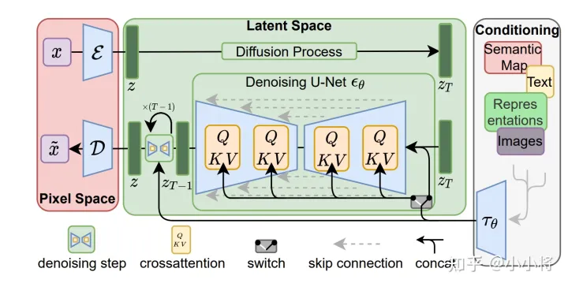    
基于pixel的方法往往限于算力只生成64x64大小的图像，比如OpenAI的DALL-E2和谷歌的Imagen，然后再通过超分辨模型将图像分辨率提升至256x256和1024x1024；而基于latent的SD是在latent空间操作的，它可以直接生成256x256和512x512甚至更高分辨率的图像。

### 根源diffusion
2015  
前向过程：可以由x_0通过公式求出最后的x_t 
  

其中不同t的$\beta_t$ 是预先定义好的逐渐衰减的，可以是Linear，cosine等，满足β 1 < β 2 < . . . < β T   
 生成代码如下：
 ```python
 def linear_beta_schedule(timesteps):
    scale = 1000 / timesteps
    beta_start = scale * 0.0001
    beta_end = scale * 0.02
    return np.linspace(beta_start, beta_end, timesteps).astype(np.float32)
def cosine_beta_schedule(time_steps, s=0.008):
    """
    cosine schedule
    as proposed in https://openreview.net/forum?id=-NEXDKk8gZ
    """
    steps = time_steps + 1
    x = np.linspace(0, time_steps, steps).astype(np.float32)
    alphas_cumprod = np.cos(((x / time_steps) + s) / (1 + s) * math.pi * 0.5) ** 2
    alphas_cumprod = alphas_cumprod / alphas_cumprod[0]
    betas = 1 - (alphas_cumprod[1:] / alphas_cumprod[:-1])
    return np.clip(betas, 0, 0.999)

 ```


反向过程：贝叶斯公式求出P(x_t-1|x_t)  
  

如何设计网络，网络哪些部分对应着预测想要的参数？？？  
如何实现前向和反向过程？？？  
每一步？？？   
时间如何采样？

### 分类
现有的生成建模技术根据它们如何表示概率分布，很大程度上可以分为两类。  

likelihood-based models  
基于似然的模型，通过（近似）最大似然直接学习分布的概率密度（或质量）函数。典型的基于似然的模型包括自回归模型 
[1, 2, 3]
 、归一化流模型 
[4, 5]
 、基于能量的模型（EBM） 
[6, 7]
 和变分自动编码器（VAE） 
[8, 9]
 。    
 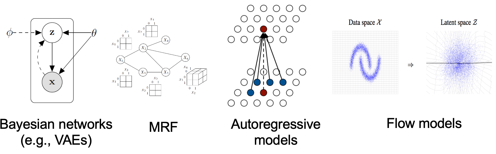   
 贝叶斯网络、马尔可夫随机场 (MRF)、自回归模型和归一化流模型都是基于似然的模型的示例。所有这些模型都表示分布的概率密度或质量函数。   

 implicit generative models  
 隐式生成模型 
[10]
 ，其中概率分布由其采样过程的模型隐式表示。最突出的例子是生成对抗网络（GAN） 
[11]
 ，通过使用神经网络变换随机高斯向量来合成符合数据分布的新样本。  
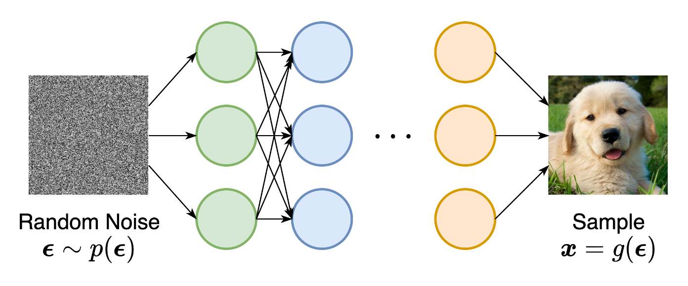   
GAN 是隐式模型的一个例子。它隐式地表示了生成器网络可以生成的所有对象的分布。   
然而，基于似然的模型和隐式生成模型都有很大的局限性。基于似然的模型要么需要对模型架构进行严格限制，以确保似然计算的易于处理的归一化常数，要么必须依赖代理目标来近似最大似然训练。另一方面，隐式生成模型通常需要对抗性训练，这是出了名的不稳定 
[12]
 ，并可能导致模式崩溃   

 基于分数的模型已在许多下游任务和应用程序上实现了最先进的性能。这些任务包括图像生成 
[18, 19, 20, 21, 22, 23]
 （是的，比 GAN 更好！）、音频合成 
[24, 25, 26]
 、形状生成 
[27]
 和音乐生成 
[28]
 。此外，基于分数的模型与归一化流模型有联系，因此允许精确的似然计算和表示学习。此外，建模和估计分数有助于逆向问题解决，其应用包括图像修复 
[18, 21]
 、图像着色 
[21]
 、压缩感知和医学图像重建（例如 CT、MRI） 
[29]
 。


主流生成式模型各自的生成逻辑：  
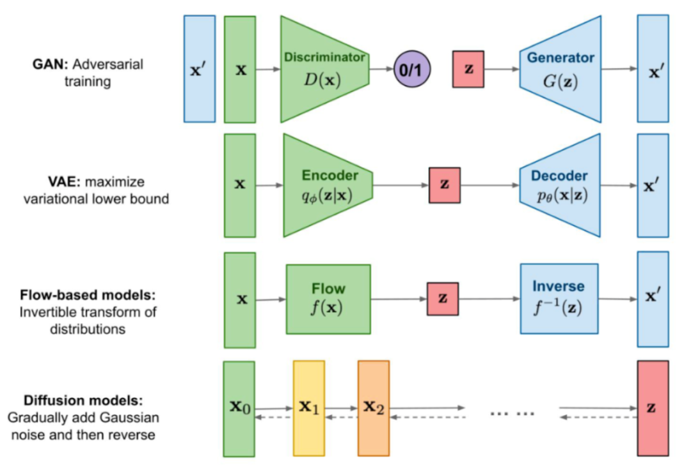  

### 生成模型GAN
这里拿GAN详细展开讲讲  
GAN由生成器g和判别器d组成。其中，生成器主要负责生成相应的样本数据，输入z一般是由高斯分布随机采样得到的噪声。   
而判别器的主要职责是区分生成器生成的样本与
（gt
）
样本,我们想要的是对样本输出的置信度越接近1越好，而对生成样本输出的置信度越接近0越好。与一般神经网络不同的是，GAN在训练时要同时训练生成器与判别器，所以其训练难度是比较大的。   
我们可以将GAN中的生成器比喻为印假钞票的犯罪分子，判别器则被当作警察。犯罪分子努力让印出的假钞看起来逼真，警察则不断提升对于假钞的辨识能力。在图像生成任务中也是如此，生成器不断生成尽可能逼真的假图像。判别器则判断图像是图像，还是生成的图像。   
二者不断博弈优化，最终生成器生成的图像使得判别器完全无法判别真假。   


### 生成模型VAE
2013  
VAE的核心就是找到一个容易生成数据x 的z 的分布，即后验分布q ϕ ( z ∣ x ) ，VAE需要用神经网络拟合一个分布p θ ( z ∣ x ) 和q ϕ ( z ∣ x ) 接近。VAE假设每个x i 
​
 服从标准正态分布。

待拟合分布是多个高斯分布的组合  
变分，即引入简化的参数化分布（Gaussian distribution 高斯分布或称正太分布）去拟合复杂后验分布。过程就是要调整变分分布的参数，  

变分下界ELOB：变分分布和后验分布的差值  
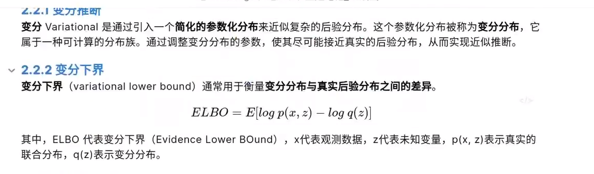  

#### vae和unet
结构和损失函数：

UNet：UNet的结构呈U形，有编码器和解码器两个部分，其中编码器负责降采样输入特征，而解码器负责上采样以生成分割结果。UNet通常使用交叉熵等损失函数来比较生成的分割结果与真实标签之间的差异。  
VAE：VAE由编码器和解码器组成，但其目标是学习输入数据的潜在分布。VAE使用变分推断来学习潜在空间的分布，并使用重建损失以及正则化项（KL散度）来平衡生成的样本的多样性和质量。

共同点：
编码器（Encoder）：

UNet： 编码器负责将输入图像通过多次降采样操作转换为潜在表示。每个降采样步骤通常包含卷积层和池化层。
VAE： 编码器同样负责将输入数据映射到潜在空间。它通过一系列的卷积和全连接层来捕捉输入数据的潜在结构。
解码器（Decoder）：

UNet： 解码器负责将潜在表示通过上采样操作还原为与输入图像相同大小的输出。每个上采样步骤通常包含上采样操作和卷积层。
VAE： 解码器用于从学得的潜在表示生成新的样本。它通过一系列的反卷积和全连接层来还原原始输入。

#### 损失函数
变分自编码器（Variational Autoencoder，VAE）的损失函数由两部分组成：重构损失和KL散度（Kullback-Leibler divergence）损失  
$[ \mathcal{L}_{VAE} = \text{Reconstruction Loss} + \beta \times \text{KL Divergence Loss} ] $  
权重参数 $(\beta)$ 的选择可以影响模型学到的潜在表示的质量。通常，较小的 $(\beta)$  会使模型更注重学习重构能力，而较大的 $(\beta)$  则会更注重学习潜在变量的结构。
- $[ \text{Reconstruction Loss} = \frac{1}{2} \sum_{i=1}{N} |x_i - \hat{x}_i|2 ]$  
其中，(N) 是样本数量，(x_i) 是原始输入数据，$(\hat{x}_i)$ 是由解码器生成的重构数据。用于衡量模型的生成能力，即模型能够将输入数据重构回原始数据的程度。在VAE中，通常使用平均二乘误差（Mean Squared Error，MSE）或二分类交叉熵（Binary Crossentropy）作为重构损失。对于VAE的解码器，其任务是将潜在变量重新映射为输入数据。
- $[ D_{KL}(q(z|x) || p(z)) = \frac{1}{2} \sum_{i=1}{K} (\sigma_i2 + \mu_i2 - \log(\sigma_i2) - 1) ]$  
其中，(q(z|x)) 是给定输入数据 (x) 后，潜在变量 (z) 的后验分布，(p(z)) 是先验分布，$(\mu)$ 和 $(\sigma)$ 分别是后验分布的均值和标准差。这里的 (K) 是潜在变量的维度。  
KL散度(Kullback-Leibler Divergence)是用来度量两个概率分布相似度的指标，它作为经典损失函数被广泛地用于聚类分析与参数估计等机器学习任务中。   
相对熵（relative entropy），又被称为Kullback-Leibler散度（Kullback-Leibler divergence）或信息散度（information divergence），是两个 概率分布 （probability distribution）间差异的非对称性度量 [1] 。 在 信息理论 中，相对熵等价于两个概率分布的 信息熵 （Shannon entropy）的差值 [2] 。 相对熵是一些优化算法，例如 最大期望算法 （Expectation-Maximization algorithm, EM）的损失函数 [3] 。  
KL散度定义：   
  
  

User
为什么VAE要用KL损失  

ChatGPT
变分自编码器（Variational Autoencoder，VAE）是一种生成模型，其目标是学习数据的潜在表示，并生成与输入数据相似的新样本。VAE使用了一种特殊的损失函数，通常包括两个部分：重构损失（reconstruction loss）和KL散度损失（KL divergence loss）。

重构损失（Reconstruction Loss）：
VAE的一个主要目标是学习一个能够还原输入数据的模型。重构损失衡量了原始输入数据和通过模型生成的重建数据之间的差异。通常，对于连续型数据，可以选择使用均方误差（Mean Squared Error，MSE）来量化重构损失，对于二进制数据，可以使用二元交叉熵。

重构损失有助于确保模型能够学到输入数据的重要特征，并在生成样本时保持一定的准确性。

KL散度损失（KL Divergence Loss）：
KL散度是一种度量两个概率分布之间差异的方法。在VAE中，KL散度损失用于强制潜在变量（latent variables）的分布趋向于一个先验分布，通常是标准正态分布（均值为0，方差为1）。

引入KL散度损失的原因在于，通过控制潜在变量的分布，我们可以在潜在空间中引入一些结构，使得该空间更容易进行插值和生成新样本。同时，KL散度的引入还有助于避免潜在空间中的过拟合。

总的来说，KL散度损失项的存在有助于VAE学习到更有结构和连续性的潜在表示，而不仅仅是简单地还原输入数据。这样一来，VAE可以生成更具意义的样本，并在潜在空间中进行更有意义的操作。  

作用： KL散度损失项有助于正则化模型，避免过度拟合，并使潜在表示空间更具连续性和结构。这也使得我们在潜在空间中能够更自由地进行插值和生成新的样本。

- 先验分布的选择：  
在VAE中，我们通过KL散度损失来强制潜在表示的分布接近于一个先验分布，通常选择标准正态分布。
先验分布的选择影响了潜在表示空间的形状。标准正态分布是一个典型的选择，因为它是一个具有良好性质的分布，例如是连续和平滑的。
KL散度的作用：

- KL散度测量两个概率分布之间的差异，它在VAE中被用来衡量学到的潜在表示分布与先验分布之间的差异。  
通过最小化KL散度损失，我们迫使潜在表示分布接近于先验分布。这导致了在潜在表示空间中的一种结构，使得相似的输入在潜在空间中更加接近，有助于形成连续的潜在表示空间。
连续性和结构的影响：

- 当KL散度损失最小化时，模型更倾向于学习到一个潜在表示空间，其中相邻的点在潜在空间中也是相邻的。  
这种连续性和结构性的性质使得我们能够在潜在空间中进行插值，即通过在潜在空间中移动沿着连续路径的方式，生成具有平滑变化的新样本。这种插值对于生成新的样本和在潜在空间中进行探索非常有用。

KL散度损失的引入有助于塑造潜在表示空间的结构，使其更加连续和有意义。这使得在潜在空间中进行插值变得更加自由，同时也有助于模型生成更具有可解释性和有趣性的样本

连续性：  
生成的样本之间产生连续性的变化  
结构性：  
结构性表示潜在空间中的点之间存在一定的关系或顺序。
当潜在空间具有结构性时，插值路径不仅是连续的，而且沿路径的样本变化是有意义的。这意味着在潜在空间中沿着一条路径移动，我们可能会观察到一些数据特征的渐变或演变，而不仅仅是简单的混合。

重参数化  
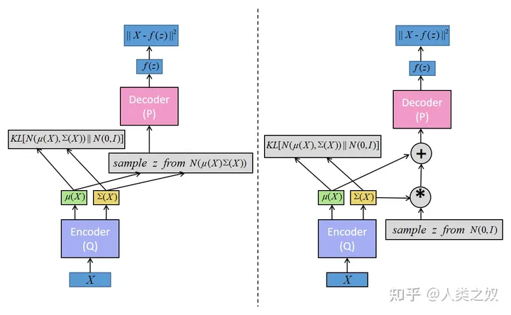  


## SD模型的主体结构
sd中不冻结和冻结的loss如何区别，如何计算？？？  

2022 SD V1.5版本 为例   
利用编码器对图片进行压缩，然后在潜在表示空间上做diffusion操作，最后我们再用解码器恢复到原始像素空间即可，论文将这个方法称之为感知压缩（Perceptual Compression）。  
感知压缩本质上是一个tradeoff，非感知压缩的扩散模型由于在像素空间上训练模型，让文图生成等任务能够在消费级GPU上，在10秒级别时间生成图片，大大降低了落地门槛。  


autoencoder：encoder将图像压缩到latent空间，而decoder将latent解码为图像；  
CLIP text encoder：提取输入text的text embeddings，通过cross attention方式送入扩散模型的UNet中作为condition； ？？？   
UNet：扩散模型的主体，用来实现文本引导下的latent生成。  
  

### VAE autoencoder
autoencoder是一个基于encoder-decoder架构的图像压缩模型，对于一个大小为$H \cdot W \cdot 3$
的输入图像，encoder模块将其编码为一个大小为$h \cdot w \cdot 3$
的latent  
f=H/h为下采样率（downsampling factor）    


具体来说，给定图像 x (H W 3)
 ，先利用一个编码器 E
来将图像编码到潜在表示空间 z=E(x) 
，其中 z (h w c)
，然后用解码器从潜在表示空间重建图片 x_= D(E(x))
 。在感知压缩压缩的过程中，下采样因子的大小为2的次方，


这种有损压缩肯定是对SD的生成图像质量是有一定影响的，不过好在SD模型基本上是在512x512以上分辨率下使用的。为了改善这种畸变，stabilityai在发布SD 2.0时同时发布了两个在LAION子数据集上精调的autoencoder，注意这里只精调autoencoder的decoder部分，SD的UNet在训练过程只需要encoder部分，所以这样精调后的autoencoder可以直接用在先前训练好的UNet上（这种技巧还是比较通用的，比如谷歌的Parti也是在训练好后自回归生成模型后，扩大并精调ViT-VQGAN的decoder模块来提升生成质量） 

#### loss
`由一个通过感知损失[102]和基于补丁的[32]对抗目标[20,23,99]相结合训练的自动编码器组成。这确保了通过强制局部真实性将重建限制在图像流形内，并避免仅依赖像素空间损失（例如 L2 或 L1 目标）而引入的模糊。`

除了采用L1重建损失外，还增加了感知损失（perceptual loss，即LPIPS，具体见论文The Unreasonable Effectiveness of Deep Features as a Perceptual Metric）以及基于patch的对抗训练 ??  
同时为了防止得到的latent的标准差过大，采用了两种正则化方法：第一种是KL-reg，类似VAE增加一个latent和标准正态分布的KL loss，不过这里为了保证重建效果，采用比较小的权重（～10e-6）`对学习得到的；latant的标准正态施加轻微的 KL 惩罚`；第二种是VQ-reg，引入一个VQ （vector quantization）layer，  不过VQ层是在decoder模块中，这里VQ的codebook采样较高的维度（8192）来降低正则化对重建效果的影响   
`Because our subsequent DM is designed to work with the two-dimensional structure of our learned latent space z = E(x), we can use relatively mild compression rates and achieve very good reconstructions`   
????   
因此在官方发布的一阶段预训练模型中，会看到KL和VQ两种实现。在Stable Diffusion中主要采用AutoencoderKL这种实现。   

总而言之，在训练Autoencoder过程中包含如下几个损失：

- 重建损失（Reconstruction Loss）：是重建图像与原始图像在像素空间上的均方误差mse_loss
- 感知损失（Perceptual Loss）：是最小化重构图像和原始图像分别在预训练的VGG网络上提取的特征在像素空间上的均方误差；可参考感知损失（perceptual loss）详解
- 对抗损失（Adversarial Loss）：使用Patch-GAN的判别器来进行对抗训练， 可参考PatchGAN原理
- 正则项（KL divergence Loss）：通过增加正则项来使得latent的方差较小且是以0为均值，即计算latent和标准正态分布的KL损失  
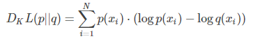   
KL散度计算的就是数据的原分布与近似分布的概率的对数差的期望值。    


### CLIP text encoder 
采用目前OpenAI所开源的最大CLIP模型：clip-vit-large-patch14，这个CLIP的text encoder是一个transformer模型（只有encoder模块）：层数为12，特征维度为768  
对于输入text，送入CLIP text encoder后得到最后的hidden states（即最后一个transformer block得到的特征），其特征维度大小为77x768（77是token的数量），这个细粒度的text embeddings将以cross attention的方式送入UNet中。  
训练SD的过程中，**CLIP text encoder模型是冻结的**。比如谷歌的Imagen采用纯文本模型T5 encoder来提出文本特征，而SD则采用CLIP text encoder，预训练好的模型往往已经在大规模数据集上进行了训练，它们要比直接采用一个从零训练好的模型要好。   

文本提示是如何被处理并输入到噪声预测器中的。
- 首先，分词器将提示中的每个单词转换为一个称为标记（token）的数字。Stable Diffusion模型限制了文本提示中使用的标记token数量为75个。  
- 然后，每个标记被转换为一个包含768个值的向量，称为嵌入embedding。这些嵌入向量接着被文本转换器处理，并准备好供噪声预测器使用。

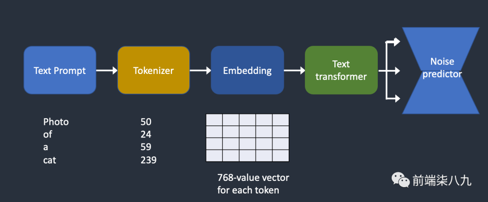  
  
分词器只能对其在训练期间见过的单词进行分词。例如，CLIP模型中有“dream”和“beach”，但没有“dreambeach”。分词器会将单词“dreambeach”分割为两个标记“dream”和“beach”。因此，一个单词并不总是对应一个标记！  
另一个需要注意的细节是空格字符也是标记的一部分。在上述情况中，短语“dream beach”产生了两个标记“dream”和“[space]beach”。这些标记与“dreambeach”产生的标记“dream”和“beach”（beach之前没有空格）不同。

#### loss 
clip loss  
text encoder和image encoder  
对比学习
计算文本特征和图像特征的余弦相似度，余弦相似度分别和相应label做交叉熵损失，两个结果取平均值作为loss反向传播   

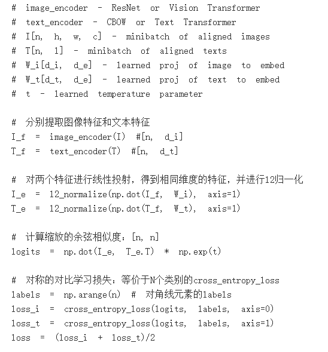  

分词器怎么手写出来？？？   


### UNet
其主要结构如下图所示（这里以输入的latent为64x64x4维度为例），其中encoder部分包括3个CrossAttnDownBlock2D模块和1个DownBlock2D模块，而decoder部分包括1个UpBlock2D模块和3个CrossAttnUpBlock2D模块，中间还有一个UNetMidBlock2DCrossAttn模块。encoder和decoder两个部分是完全对应的，中间存在skip connection。注意3个CrossAttnDownBlock2D模块最后均有一个2x的downsample操作，而DownBlock2D模块是不包含下采样的。  
   

U-Net：预测噪声残差，结合调度算法（PNDM，DDIM，K-LMS等）进行噪声重构，逐步将随机高斯噪声转化成图片的隐特征。U-Net整体结构一般由ResNet模块构成，并在ResNet模块之间添加CrossAttention模块用于接收文本信息。  
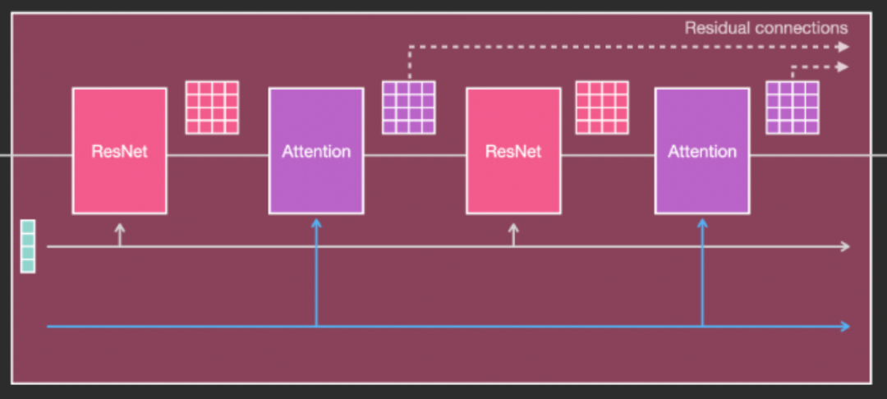  
其中CrossAttnDownBlock2D模块的主要结构如下图所示，text condition将通过CrossAttention模块嵌入进来，此时Attention的query是UNet的中间特征，而key和value则是text embeddings。(与transformer解码器第二个多头注意力层一致)  
 CrossAttnUpBlock2D模块和CrossAttnDownBlock2D模块是一致的，但是就是总层数为3。  
  


在训练条件扩散模型时，往往会采用Classifier-Free Guidance（这里简称为CFG），所谓的CFG简单来说就是在训练条件扩散模型的同时也训练一个无条件的扩散模型，同时在采样阶段将条件控制下预测的噪音和无条件下的预测噪音组合在一起来确定最终的噪音，具体的计算公式如下所示：  
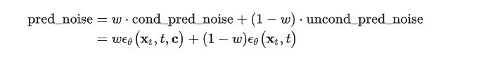  
这里的w
为guidance scale，当w
越大时，condition起的作用越大，即生成的图像其更和输入文本一致。CFG的具体实现非常简单，在训练过程中，我们只需要以一定的概率（比如10%）随机drop掉text即可，

#### loss
训练采用 mse_loss   

`MSE Loss`（均方误差损失）、`L1 Loss`（绝对值误差损失）和`L2 Loss`（平方误差损失）是深度学习中常用的损失函数，用于衡量模型的预测与实际目标之间的差异。它们之间的区别主要在于计算损失的方式和对误差的敏感程度。

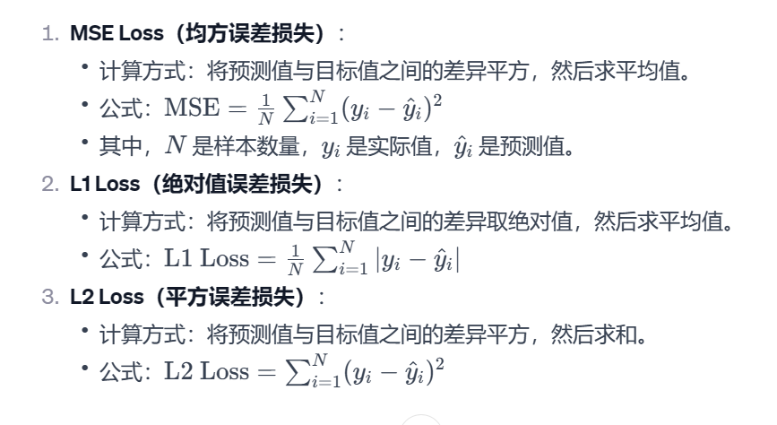

**区别总结**：
- MSE Loss对异常值更敏感，因为误差平方会放大异常值的影响。
- L1 Loss对异常值相对较不敏感，因为它使用的是绝对值。
- L2 Loss在计算时对大误差的惩罚更为严重，这意味着模型在训练过程中可能更加关注那些与目标值差异较大的样本。


SD和DDPM一样采用预测noise的方法来训练UNet，其训练损失也和DDPM一样：  
  
这里的c 为text embeddings，此时的模型是一个条件扩散模型。  
将AutoEncoder的编码器输出的latent加噪后作为Unet的输入（同时还有其他条件输入），来预测噪声， 损失函数就是真实噪声和预测噪声的L1或L2损失。  

### 采样器 
PNDMScheduler 使用伪数值方法来处理扩散模型，PNDMScheduler 是一个调度器，用于处理扩散模型，其采用伪数值方法，包括 Runge-Kutta 和线性多步方法。


在AUTOMATIC1111中提供了许多采样方法,如欧拉a采样、Heun采样、DDIM采样等。采样器是什么?它们是如何工作的?这些采样方法有什么区别?应该使用哪一种采样器?  

什么是采样？  
首先在潜在空间中生成一张完全随机的图片。然后噪声预测器估计图片的噪声。将预测的噪声从图片中减去  
这个去噪过程称为采样,因为Stable Diffusion 在每一步中生成一张新的样本图片。采样中使用的方法称为采样器或采样方法。  
采样器决定了如何进行随机采样,不同的采样器会对结果产生影响。    
虽然框架是相同的,但进行这个去噪过程的方法有很多种。这通常是在速度和准确性之间的权衡。

#### 噪声调度计划
在每一步,采样器的作用是生成符合噪声调度计划的指定噪声水平的图片。  
噪声调度计划控制着每一采样步骤的噪声水平。在第一步,噪声水平最高,然后逐步降低,在最后一步时降为零。  

增加采样步数的效果是什么?  
每步噪声减小的程度更小。这有助于减少采样的截断误差。  
　　通俗来说,采样步数越多,每次减少的噪声就越少。这样可以让图像的变化更平滑自然,避免在减噪过程中出现明显的错误。  
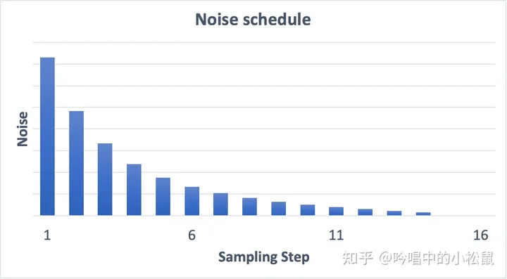  
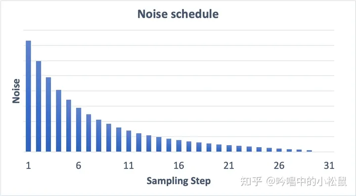 

#### 采样器概述
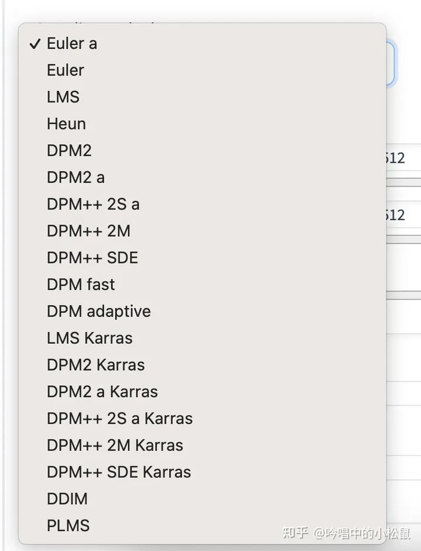   
##### 老式 ODE 求解器（Old-School ODE solvers）
经典的常微分方程（ODE）求解方法   
ODE是微分方程的英文缩写。求解器是用来求解方程的算法或程序。老派ODE求解器指的是一些传统的、历史较久的用于求解常微分方程数值解的算法。  
　　相比新方法,这些老派ODE求解器的特点包括:
- 算法相对简单,计算量小
- 求解精度一般
- 对初始条件敏感
- 易出现数值不稳定
这些老派算法在计算机算力有限的时代较为通用,但随着新方法的出现,已逐渐被淘汰。但是一些简单任务中,老派算法由于高效并且容易实现,仍有其应用价值。
　　让我们先简单地说说，以下列表中的一些采样器是100多年前发明的。它们是老式 ODE 求解器。

- Euler - 最简单的求解器。20-30步就能生成效果不错的图片。
- Heun - 比欧拉法更精确但速度更慢的版本。欧拉的一个更准确但是较慢的版本。抛物线拟合的欧拉方法。
- LMS(线性多步法) - 速度与Euler相同但(理论上)更精确。

##### 初始采样器（祖先采样器 Ancestral samplers ）
您是否注意到某些采样器的名称只有一个字母“a”？

- Euler a
- DPM2 a
- DPM++ 2S a
- DPM++ 2S a Karras
　　祖先采样器会在每一步采样时都向图片添加新的随机噪声，这会导致不断采样时，图片内容一直在大幅度的变化，不会稳定下来
　　需要注意的是,即使其他许多采样器的名字中没有“a”,它们也都是随机采样器。  
　　简单来说:  
- 初始采样器每步采样时都加入噪声,属于这一类常见的采样方法。
- 这类方法由于采样有随机性,属于随机采样器。
- 即使采样器名称没有“a”,也可能属于随机采样器。
- 所以“祖先采样器”代表这一类加噪采样方法,这类方法通常是随机的,名称中有无“a”不决定其随机性  

补充：

- 这样的特性也表现在当你想完美复刻某些图时，即使你们参数都一样，但由于采样器的随机性，你很难完美复刻！即原图作者使用了带有随机性的采样器，采样步数越高越难复刻！
- 带有随机性的采样器步数越高，后期越难控制，有可能是惊喜也可能是惊吓！
- 这也是大多数绘图者喜欢把步数定在15-30之间的原因。

使用初始采样器的最大特点是图像不会收敛！  
使用Euler a 生成的图像不会在高采样步数下收敛。  
Euler a不收敛（采样步数 2 – 40）（注意猫背部）  
欧拉收敛（采样步数2-40）  
补充：这就是你选择采样器需要考虑的关键因素之一！需不需收敛！    
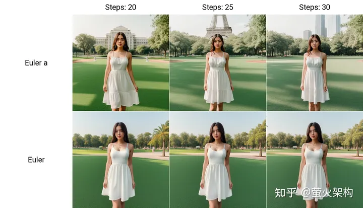   
需要注意除了祖先采样器，DDIM 和带 SDE 标识的采样器也会在采样时增加随机噪声，比如 DPM++ SDE、DPM++ 2M SDE等。SDE是随机微分方程的意思，英文全称：stochastic differential equations。

因为会在采样时增加随机噪声，使用这些采样器时，即使相同的参数和随机数也有可能生成不同的图片。

##### 2S、2M、3M
2：代表这是一个二阶采样器。  
3：代表这是一个三阶采样器。  
不带这些数字的就是一阶采样器，比如 Euler 采样器。  
在优化和采样的上下文中，使用二阶方法意味着我们不仅考虑当前的样本点，还考虑这些点如何变化。这可以帮助我们更准确地估计函数的形状和行为，从而更好地进行采样。

S：代表singlestep。这意味着该采样器在每次迭代中只执行一步。  
由于每次迭代只进行一次更新，采样速度更快，但可能需要更多的采样步数才能达到所需的图像质量。更适合需要快速反馈或实时渲染的应用，因为它可以快速生成图像，尽管可能需要更多的迭代来完善。

M：代表multistep。这意味着该采样器在每次迭代中会执行多步，采样质量更高，但是每次采样速度较慢。  
由于每次迭代需要进行多次更新，采样速度较慢，但可能只需要较少的采样步数就能达到所需的图像质量。更适合对图像质量有较高要求的应用，或者那些可以接受稍长的计算时间以获得更好结果的应用。

##### Karras噪声调度计划
带“Karras”标签的采样器采用了Karras论文推荐的噪声调度方案,也就是在采样结束阶段将噪声减小步长设置得更小。这可以让图像质量得到提升。  
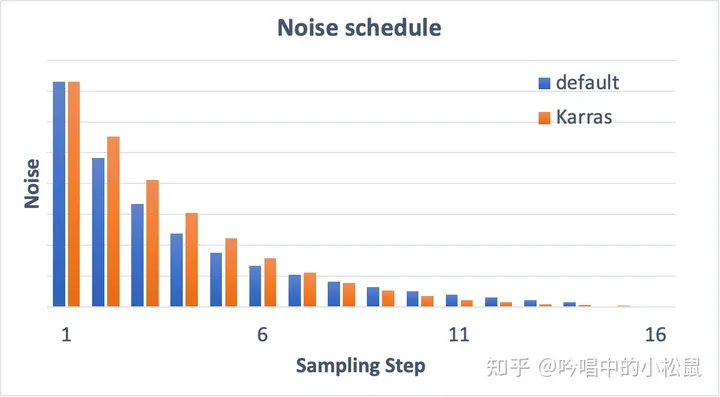  

##### DDIM和PLMS
DDIM(去噪扩散隐式模型)和PLMS(伪线性多步法)是最初Stable Diffusion v1中搭载的采样器。DDIM是最早为扩散模型设计的采样器之一。PLMS是一个较新的、比DDIM更快的替代方案。 
它们通常被视为过时且不再广泛使用。   

DDIM为什么有效？？？？  
采样器算法如何用到代码里实现？每一步？？？  

###### ddpm,ddim原理


贝叶斯概率角度  
传统ddpm，马尔科夫链，依赖前一项。训练多少步，采样就多少步，  
改良。ddim，不采用马尔科夫链假设。假设仍满足贝叶斯。为什么可以？？？？       
可以跳步采样，想采样几步都行  


1. 为什么DDPM一定要这么多次采样  
第一，减小 T行不行？    
答案是不行， T必须很大   
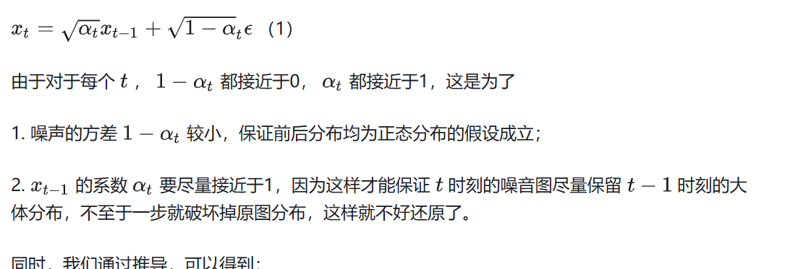   
2. 第二，为什么非要一步一步降噪，跳步行不行？   
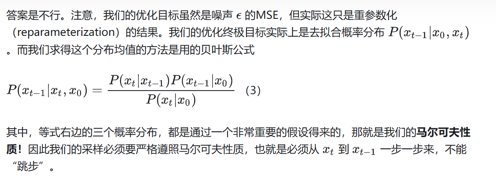   

ddim原理
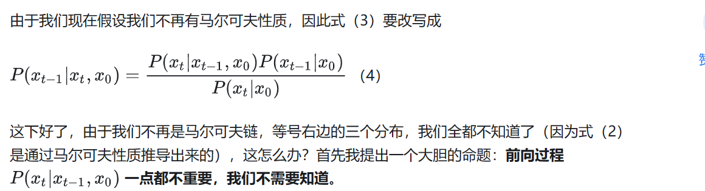   
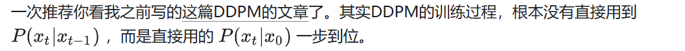    
想办法让(2)成立  
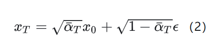  
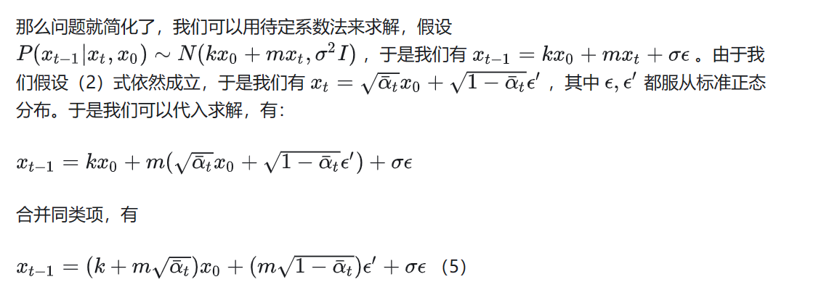   
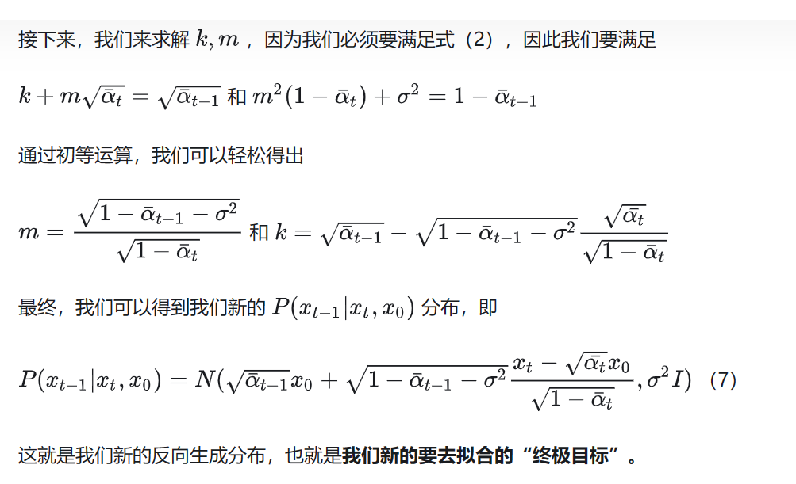   
再由（4）求解前向过程  

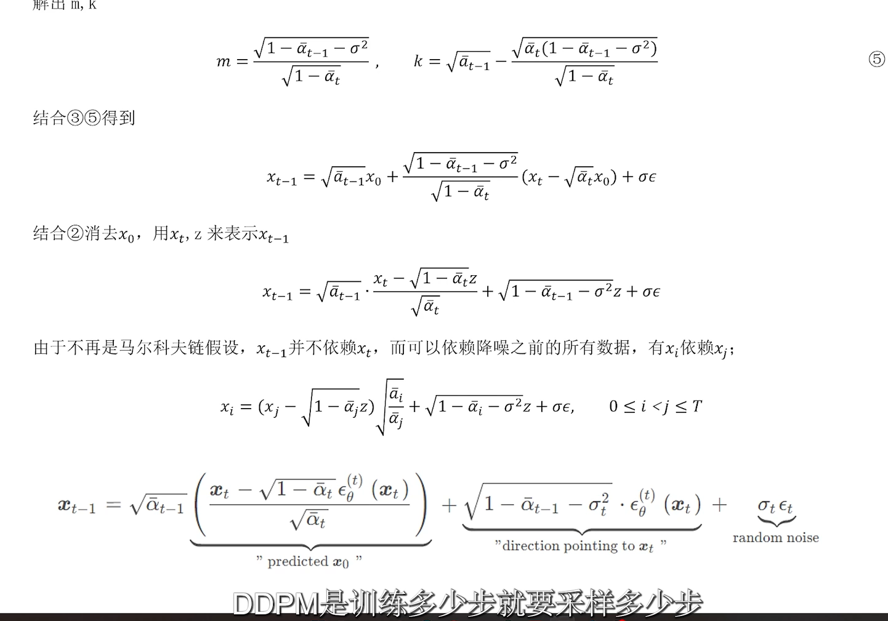   
DDIM的采样过程
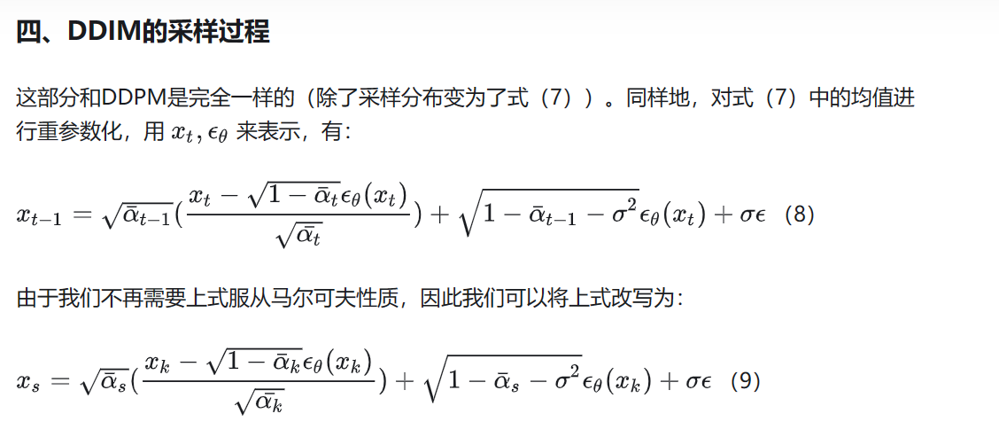   
 
###### 加噪
   
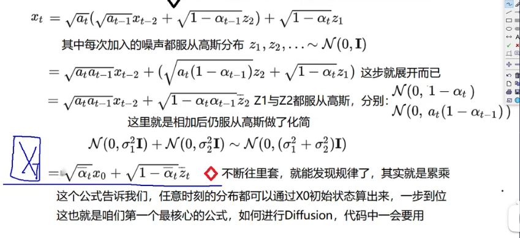   
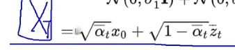   


###### ddpm去噪
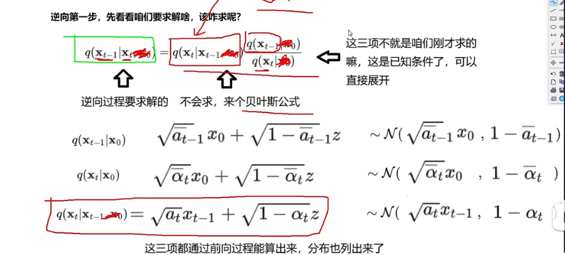   
贝叶斯计算，去噪是估计的后验分布中，方差是固定值（仅限于ddpm），只有均值需要求解，  
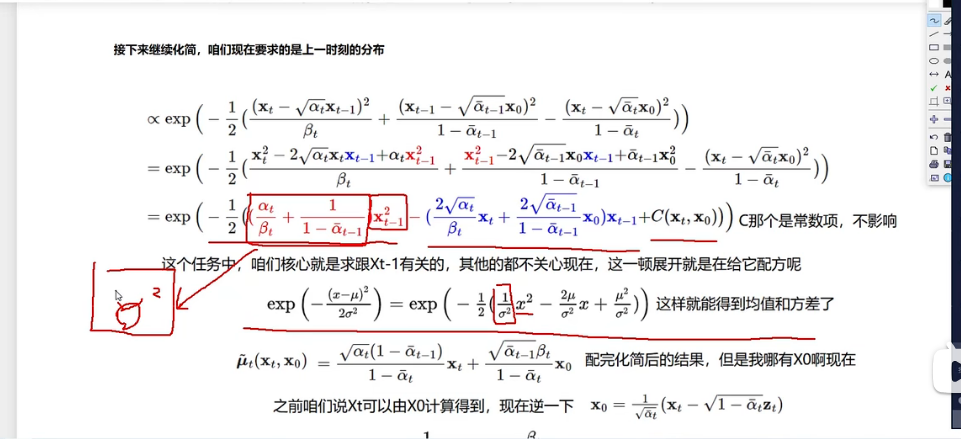   
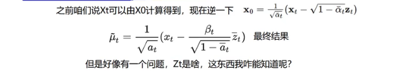

###### eular原理
得分函数角度  
score matching --> langevin dynamics  
score是数据点漂移方向  
eular a 降噪公式  
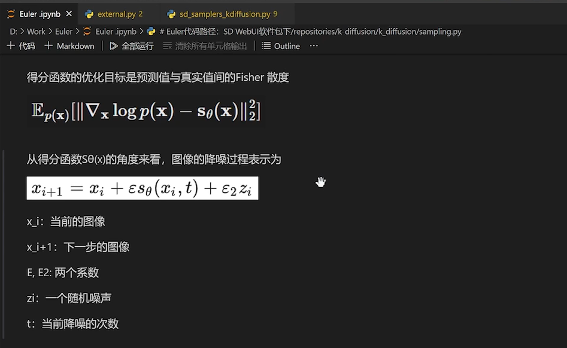  
加噪，空间数据点多，漂移更有力，加噪先大后小，  
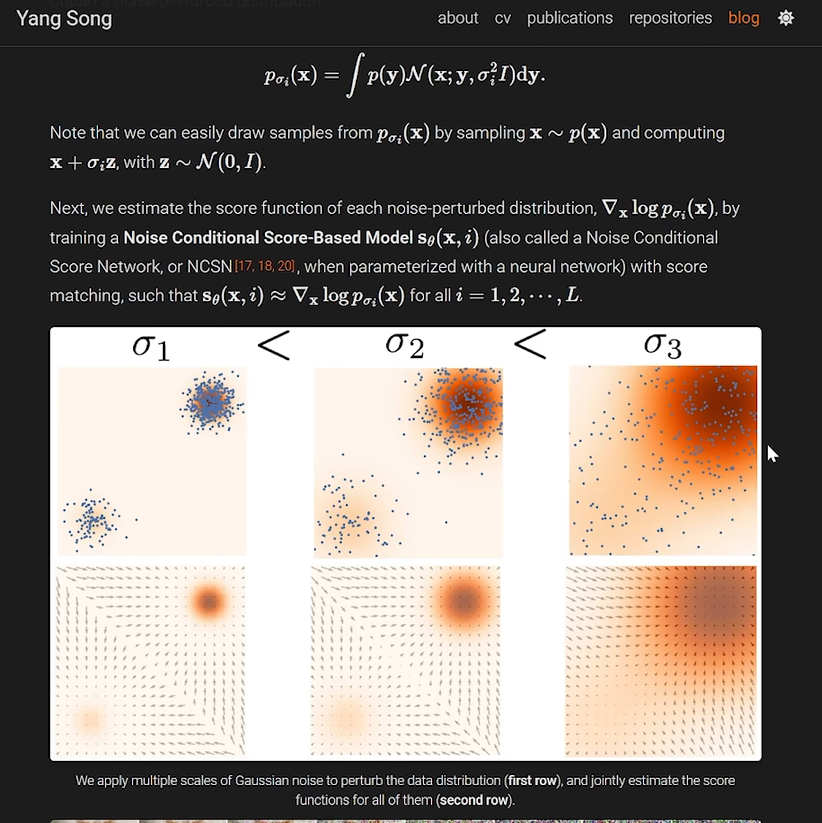  


###### diffusion SDE
随机微分方程   
是ddpm从离散到连续的推广，  
布朗运动  
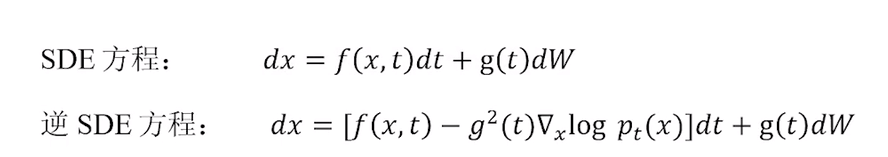   
在ODE方程里加入随机性主要有两种方式：   
1、随机化初值   
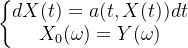   
2、过程加入噪声(Additioned Random Noise)   
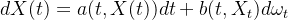

通常也将SDE的形式写成：   
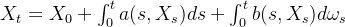   
随机过程的噪声来源是多种多样的，如果噪声来源来自于布朗运动(Brown Motion)，我们称这种SDE为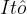SDE   
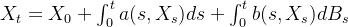   


###### diffusion ODE
常微分方程   
取出边界条件，直接求特值，跳步去噪  
F-p方程  
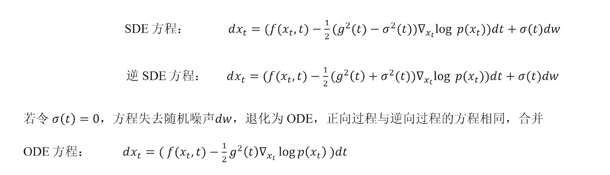  
常微分方程(ODE)的基本形式为：  
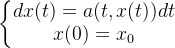   


###### dpm solver和dpm ++
dpm solver: fast ODE solver  
dpm solver++:  ODE， 预测图片而不是预测噪声。与dpm solver等价，都是找一阶二阶近似解。一阶就是ddim。dpm ++与eular也很像。    
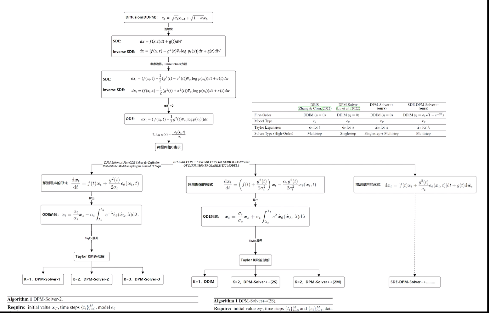  

#####  DPM、DPM adaptive、DPM2和 DPM++
DPM(扩散概率模型求解器)和DPM++是2022年为扩散模型设计发布的新采样器。它们代表了具有相似架构的求解器系列。  
DPM 的主要优点是生成质量高，但是由于DPM会自适应调整步长，不能保证在约定的采样步骤内完成任务，整体速度可能会比较慢。  
　　DPM和DPM2类似,主要区别是DPM2是二阶的(更准确但较慢)。  
　　DPM++在DPM的基础上进行了改进。  引入了很多新的技术和方法，如EMA（指数移动平均）更新参数、预测噪声方差、添加辅助模型等，从而在采样质量和效率上都取得了显著的提升，是目前效果最优秀的反向扩散采样算法之一。  
　　DPM adaptive会自适应地调整步数。它可能会比较慢,因为不能保证在采样步数内结束，采样时间不定。

##### UniPC
UniPC(统一预测器-校正器)是2023年发布的新采样器。它受ODE求解器中的预测器-校正器方法的启发,可以在5-10步内实现高质量的图像生成。

##### 评估采样器
###### 图像收敛  
图像收敛参考的指标是SSIM，也就是结构相似性，主要用来衡量两幅图像的相似度。这里的图像是否收敛主要看SSIM的波动情况  
第 40 步的最后一张图像用作评估采样收敛速度的参考。Euler方法将用作参考。  
Euler、DDIM、PLMS、LMS Karras和Heun，代表了老式ODE求解器或最初的扩散求解器。
  
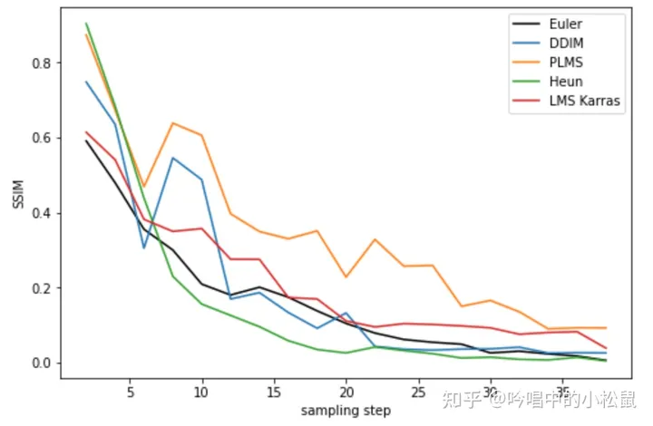  
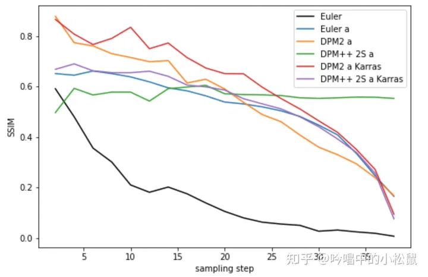  
如果您的目标是稳定、可重现的图像，则不应使用初始采样器。所有初始采样器都不会收敛。   

DPM和DPM2  
DPM fast收敛得不好。  
DPM2和DPM2 Karras的表现比Euler好,但代价是速度下降2倍。  
DPM adaptive使其表现看起来非常好,因为它使用了自己的自适应采样步骤。但它的速度可能非常慢  
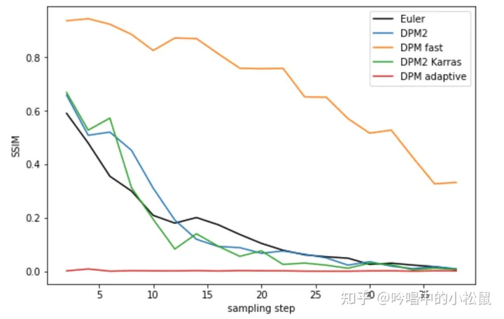  

DPM++ 求解器  
DPM++ SDE和DPM++ SDE Karras具有与初始采样器相同的缺点。它们不仅难以收敛,当步数变化时,图像也会大幅波动。（没带a但是带了SDE同样具有初始采样器的特点！）  
DPM++ 2M和DPM++ 2M Karras的表现不错。当步数足够多时,Karras变体收敛得更快。  
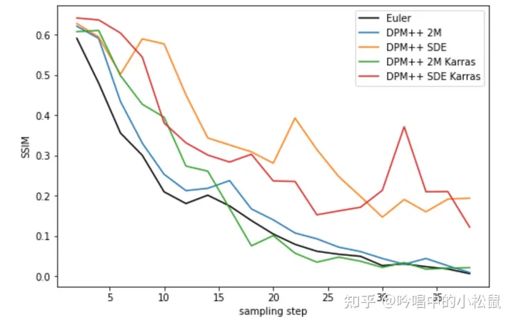   


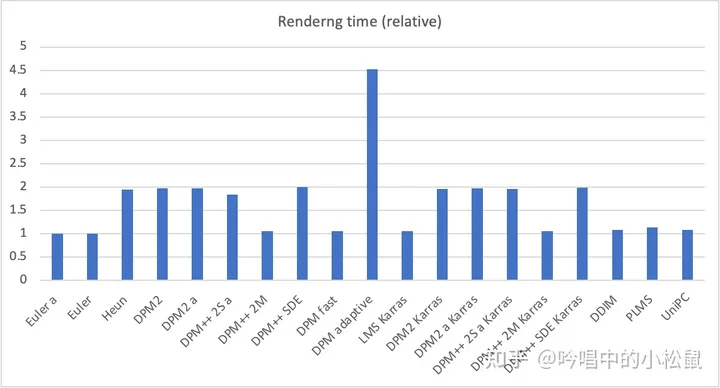    
尽管DPM adaptive在收敛方面表现良好，但它也是最慢的。
　　你可能已经注意到,其他渲染时间分为两组,第一组需要的时间大约相同(约1x),第二组需要的时间约为第一组的两倍(约2x)。这反映了求解器的阶数。二阶求解器虽然更精确,但需要评估去噪U-Net两次。因此它们速度较慢2倍。


###### 质量
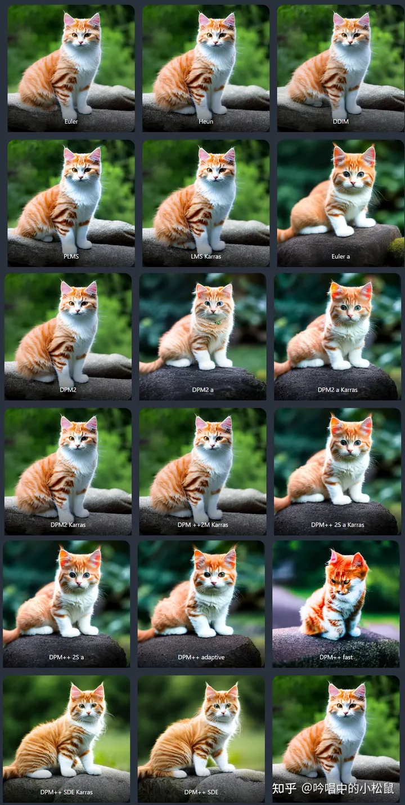   
  DPM++ fast的表现非常差劲。初始采样无法收敛得到其他采样器收敛的图像。  
  初始采样器倾向于收敛到小猫的图像,而确定性采样器倾向于收敛到猫的图像。  
  DPM++ adaptive即使自适应收敛最好、时间最长、图也未必最好！ 

###### 感知质量
收敛不代表图的好坏！即使图像尚未收敛，它仍然可以看起来不错。  
让我们看看每个采样器可以多快产生高质量的图像。备注：主要是步数和质量的关系。步数不代表时间！

　　这里使用BRISQUE(无参考图像空间质量评估器)测量感知质量。它可以测量自然图像的质量。  
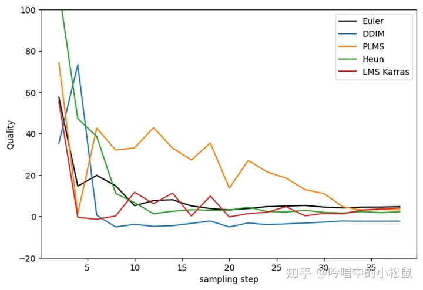  
DDIM，PLMS，Heun和LMS Karras的图像质量   
DDIM在这方面做得非常好，能够在短短8个步骤内产生最高质量的图像。   

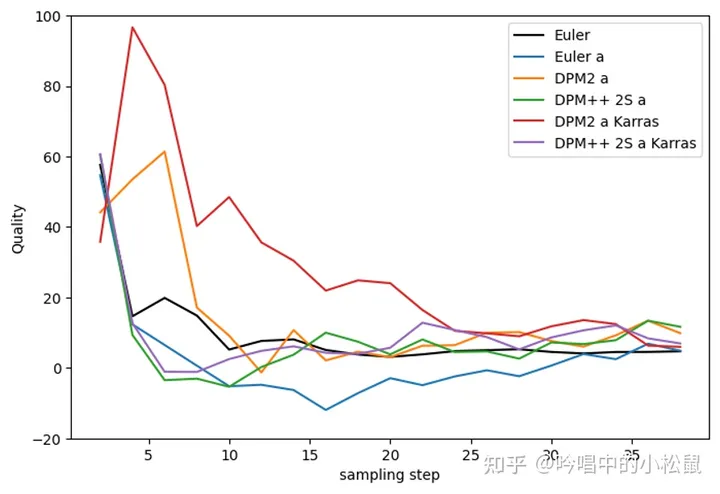  
初始采样器的图像质量  
　除了一两个例外，所有初始采样器在生成高质量图像步数方面的表现都与Euler相似。 

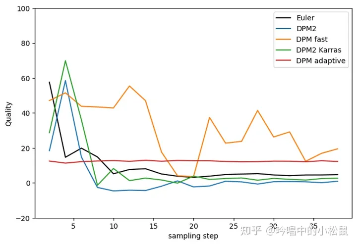
DPM 采样器的图像质量  
　　DPM2采样器的步数性能都略高于欧拉。  

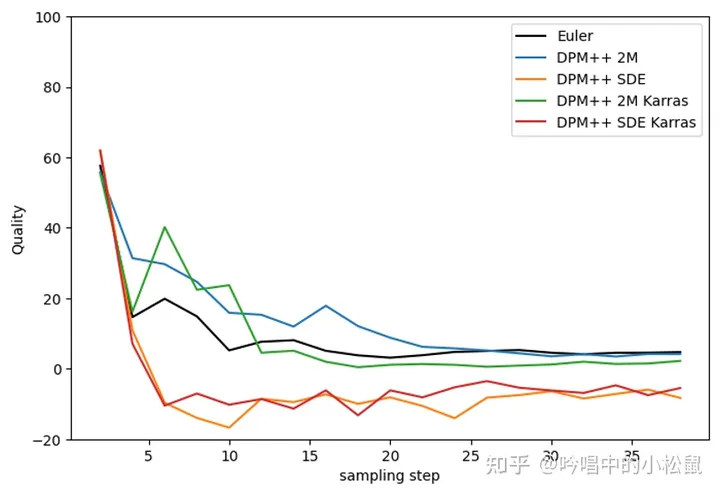  
DPM++ 采样器的图像质量  
DPM++ SDE和DPM++ SDE Karras在本次质量测试中表现最佳。  

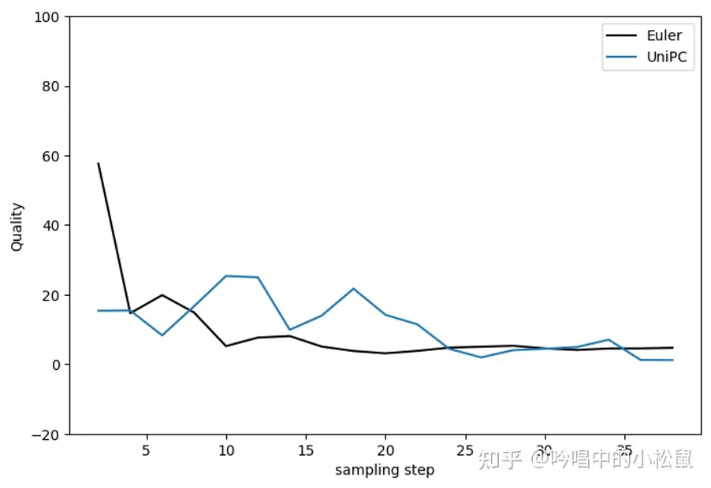  
　UniPC在低步上比欧拉略差，但在高步上可与之媲美  

###### 如何选择
如果你想要快速、可收敛、新的采样器,并要求质量较好,非常好的选择是:

- DPM++ 2M Karras,步数20-30
- UniPC,步数20-30
如果你想要高质量图像而不关心收敛性,好的选择是:

- DPM++ SDE Karras,步数10-15(注意:这个采样器较慢)不收敛
- DDIM,步数10-15

补充：不收敛大概比收敛的慢1倍！  
如果我们比较关注图片质量，那最好选择带 DPM++、Karras、2M或者3M的，比如：DPM++ 2M Karras、DPM++ 3M SDE Karras、DPM++ 2M SDE Heun Karras、DPM++ SDE Karras ；或者使用较新的 UniPC。  
如果想要快速或者简单的图像，Euler、DDIM是不错的选择。  
如果你更喜欢稳定、可重现的图像,避免使用任何初始采样器。  
如果你更喜欢简单的采样器,Euler和Heun是不错的选择。Heun需要减少步数以节省时间。  

###### 图像评估
有一些质量衡量标准很容易被算法捕获。例如，我们可以查看像素捕获的信息，并将图像标记为有噪声或模糊。  
另一方面，算法几乎不可能捕获某些质量度量。例如，算法很难评估需要文化背景知识做判断的图片的质量。  


## 训练细节,sd演化历史
SD在laion2B-en数据集上训练的，它是laion-5b数据集的一个子集，更具体的说它是laion-5b中的英文（文本为英文）数据集。laion-5b数据集是从网页数据Common Crawl中筛选出来的图像-文本对数据集，它包含5.85B的图像-文本对，其中文本为英文的数据量为2.32B，这就是laion2B-en数据集。  
SD的训练是多阶段的（先在256x256尺寸上预训练，然后在512x512尺寸上精调），不同的阶段产生了不同的版本：

- SD v1.1：在laion2B-en数据集上以256x256大小训练237,000步，上面我们已经说了，laion2B-en数据集中256以上的样本量共1324M；然后在laion5B的高分辨率数据集以512x512尺寸训练194,000步，这里的高分辨率数据集是图像尺寸在1024x1024以上，共170M样本。
- SD v1.2：以SD v1.1为初始权重，在improved_aesthetics_5plus数据集上以512x512尺寸训练515,000步数，这个improved_aesthetics_5plus数据集上laion2B-en数据集中美学评分在5分以上的子集（共约600M样本），注意这里过滤了含有水印的图片（pwatermark>0.5)以及图片尺寸在512x512以下的样本。
- SD v1.3：以SD v1.2为初始权重，在improved_aesthetics_5plus数据集上继续以512x512尺寸训练195,000步数，不过这里采用了CFG（以10%的概率随机drop掉text）。
- SD v1.4：以SD v1.2为初始权重，在improved_aesthetics_5plus数据集上采用CFG以512x512尺寸训练225,000步数。
- SD v1.5：以SD v1.2为初始权重，在improved_aesthetics_5plus数据集上采用CFG以512x512尺寸训练595,000步数。
- Version 2.0 New stable diffusion model (Stable Diffusion 2.0-v) at 768x768 resolution. Same number of parameters in the U-Net as 1.5, but uses OpenCLIP-ViT/H as the text encoder and is trained from scratch. SD 2.0-v is a so-called v-prediction model.

  - The above model is finetuned from SD 2.0-base, which was trained as a standard noise-prediction model on 512x512 images and is also made available.
- Version 2.1 New stable diffusion model (Stable Diffusion 2.1-v, Hugging Face) at 768x768 resolution and (Stable Diffusion 2.1-base, HuggingFace) at 512x512 resolution, both based on the same number of parameters and architecture as 2.0 and fine-tuned on 2.0, on a less restrictive NSFW filtering of the LAION-5B dataset.
- Stable UnCLIP 2.1 New stable diffusion finetune (Stable unCLIP 2.1, Hugging Face) at 768x768 resolution, based on SD2.1-768. This model allows for image variations and mixing operations as described in Hierarchical Text-Conditional Image Generation with CLIP Latents, and, thanks to its modularity, can be combined with other models such as KARLO. Comes in two variants: Stable unCLIP-L and Stable unCLIP-H, which are conditioned on CLIP ViT-L and ViT-H image embeddings, respectively.   
- GLIGEN (Grounded Language-to-Image Generation)  
如果给出了输入图像，可以在边界框定义的区域插入由文本描述的对象。否则，它将生成由标题/提示描述的图像，并在边界框定义的区域插入由文本描述的对象。它在 COCO2014D 和 COCO2014CD 数据集上进行训练，并且该模型使用冻结的 CLIP ViT-L/14 文本编码器来根据接地输入调节自身。   

可以看到SD v1.3、SD v1.4和SD v1.5其实是以SD v1.2为起点在improved_aesthetics_5plus数据集上采用CFG训练过程中的不同checkpoints，目前最常用的版本是SD v1.4和SD v1.5。

## 模型评测
对于文生图模型，目前常采用的定量指标是FID（Fréchet inception distance）和CLIP score，其中FID可以衡量生成图像的逼真度（image fidelity），而CLIP score评测的是生成的图像与输入文本的一致性，其中FID越低越好，而CLIP score是越大越好。??如何计算  
当gudiance scale=3时，FID最低；而当gudiance scale越大时，CLIP score越大，但是FID同时也变大。在实际应用时，往往会采用较大的gudiance scale，比如SD模型默认采用7.5，此时生成的图像和文本有较好的一致性。  
  

### FID 
(Fréchet Inception Distance)   
计算Frechet distance between 2 Gaussians (训练好的图片分类的模型的CNN去除 真实和生成的respresentations，计算距离)  
需要大量样本一次性计算  
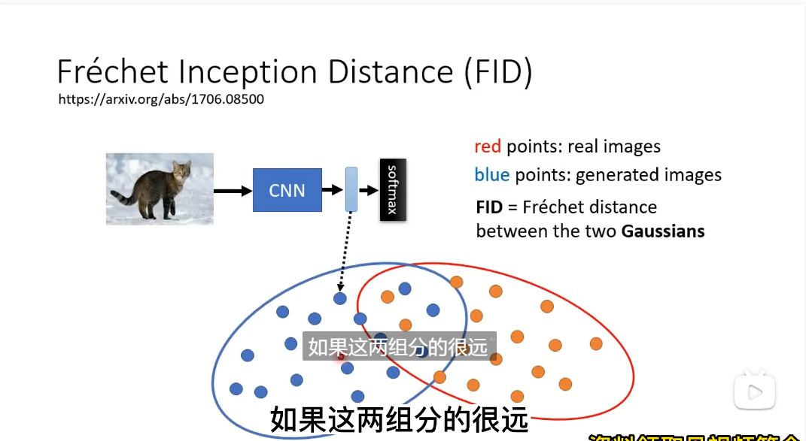  
- 从真实图像和生成图像中分别抽取n个随机子样本，并通过Inception-v3网络获得它们的特征向量。
- 计算真实图像子样本的特征向量的平均值mu1和协方差矩阵sigma1，以及生成图像子样本的特征向量的平均值mu2和协方差矩阵sigma2。
- 计算mu1和mu2之间的欧几里德距离d^2，以及sigma1和sigma2的平方根的Frobenius范数||sigma1^(1/2)*sigma2^(1/2)||_F。  
  - 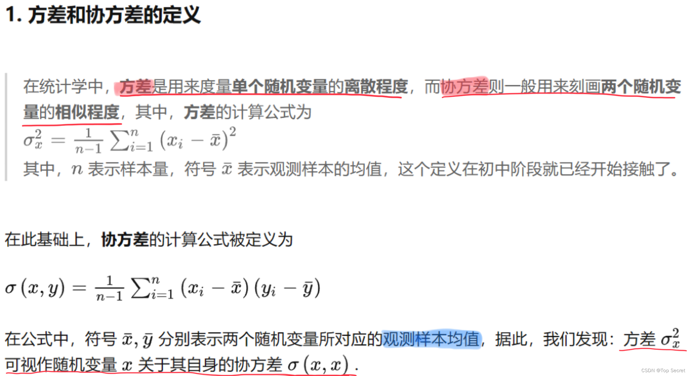   
     
  - 欧几里德距离 d = sqrt((x1-x2)^+(y1-y2)^)
  - Frobenius norm（弗罗贝尼乌斯-范数）（F-范数）  
    
  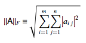    
  这个范数是针对矩阵而言的，具体定义可以类比 向量的L2范数
- 计算FID距离：FID = d^2 + ||sigma1^(1/2)*sigma2^(1/2)||_F。  


### CLIP score
用于评估 text2img 或者 img2img，模型生成的图像与原文本（prompt text）或者原图关联度大小的指标    
经过CLIP之后的文本表示和图片表示之间的Cosine Distance  
 
夹角余弦取值范围为[-1,1]。余弦越大表示两个向量的夹角越小，余弦越小表示两向量的夹角越大。当两个向量的方向重合时余弦取最大值1，当两个向量的方向完全相反余弦取最小值-1。

## SD的主要应用
包括文生图，图生图以及图像inpainting。其中文生图是SD的基础功能：根据输入文本生成相应的图像，而图生图和图像inpainting是在文生图的基础上延伸出来的两个功能。
### 文生图 
#### 整体流程
第一步：稳定扩散Stable Diffusion在「潜在空间」中生成一个随机张量Tensor。  
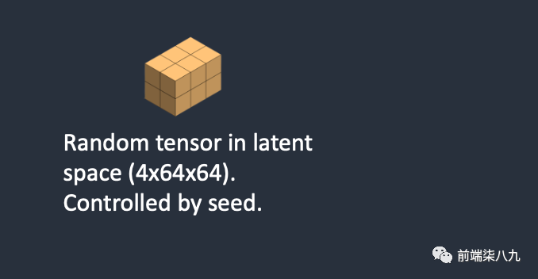  
第二步：噪声预测器Noise Predictor 也就是 U-Net 接收潜在噪声图像和文本提示作为输入，并预测出潜在空间中的噪声（一个4x64x64的张量）。  
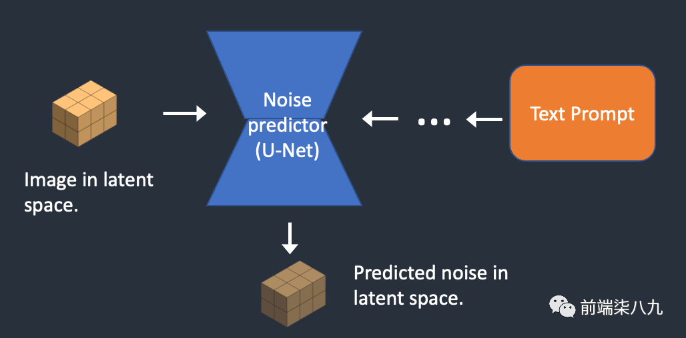  
第三步：从潜在图像中减去潜在噪声。这将成为你的新潜在图像。  
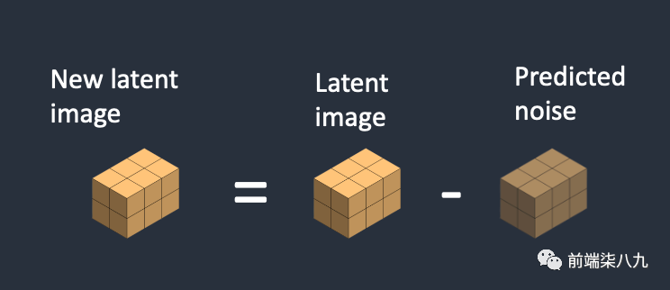  
第二步和第三步将「重复进行一定次数的采样步骤」，例如20次。  

噪声调度  
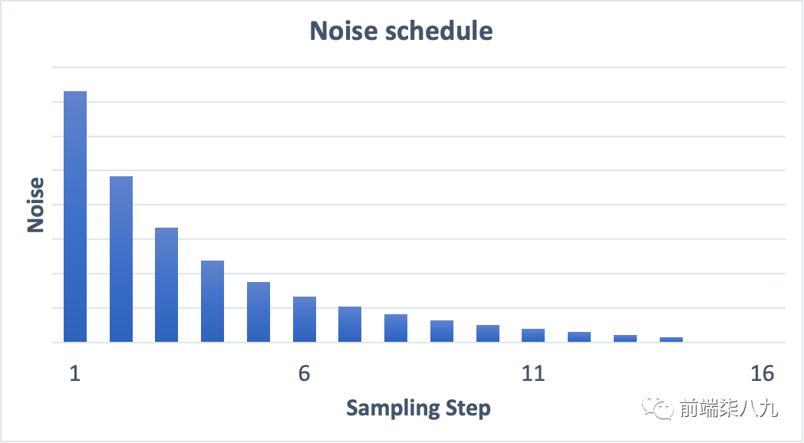  


#### 训练细节

SD最后是在512x512尺度上训练的，所以生成512x512尺寸效果是最好的，但是实际上SD可以生成任意尺寸的图片：一方面autoencoder支持任意尺寸的图片的编码和解码，另外一方面扩散模型UNet也是支持任意尺寸的latents生成的（UNet是卷积+attention的混合结构）  
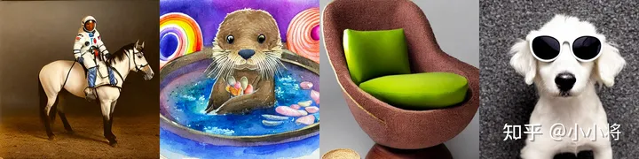  
然而，生成512x512以外的图片会存在一些问题，比如生成低分辨率图像时，图像的质量大幅度下降，下图为同样的文本在256x256尺寸下的生成效果：  
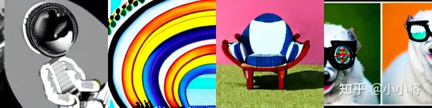  
如果是生成512x512以上分辨率的图像，图像质量虽然没问题，但是可能会出现重复物体以及物体被拉长的情况，下图为分别为768x512和512x768尺寸下的生成效果，可以看到部分图像存在一定的问题：  
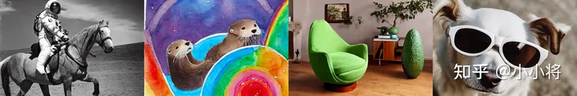  
  
解决这个问题的办法就相对比较简单，就是采用多尺度策略训练，比如NovelAI提出采用Aspect Ratio Bucketing策略来在二次元数据集上精调模型，这样得到的模型就很大程度上避免SD的这个问题，目前大部分开源的基于SD的精调模型往往都采用类似的多尺度策略来精调。比如我们采用开源的dreamlike-diffusion-1.0模型（基于SD v1.5精调的），其生成的图像效果在变尺寸上就好很多：  

另外一个参数是num_inference_steps，它是指推理过程中的去噪步数或者采样步数。SD在训练过程采用的是步数为1000的noise scheduler  
但是在推理时往往采用速度更快的scheduler：只需要少量的采样步数就能生成不错的图像，比如SD默认采用PNDM scheduler，它只需要采样50步就可以出图。当然我们也可以换用其它类型的scheduler，比如DDIM scheduler和DPM-Solver scheduler。  

guidance_scale为1，3，5，7，9和11下生成的图像对比，可以看到当guidance_scale较低时生成的图像效果是比较差的，当guidance_scale在7～9时，生成的图像效果是可以的，当采用更大的guidance_scale比如11，图像的色彩过饱和而看起来不自然，所以SD默认采用的guidance_scale为7.5。  
  
过大的guidance_scale之所以出现问题，主要是由于训练和测试的不一致，过大的guidance_scale会导致生成的样本超出范围。谷歌的Imagen论文提出一种dynamic thresholding策略来解决这个问题  
谓的dynamic thresholding是相对于原来的static thresholding，static thresholding策略是直接将生成的样本clip到[-1, 1]范围内（Imagen是基于pixel的扩散模型，这里是将图像像素值归一化到-1到1之间），但是会在过大的guidance_scale时产生很多的饱含像素点。而dynamic thresholding策略是先计算样本在某个百分位下（比如99%）的像素绝对值s
，然后如果它超过1时就采用s
来进行clip，这样就可以大大减少过饱和的像素  
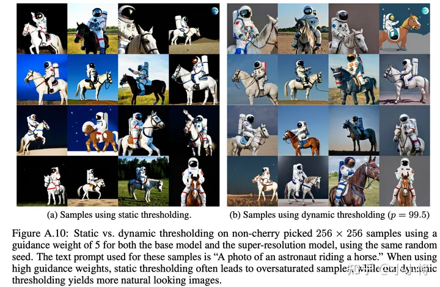

#### CFG

另外一个比较容易忽略的参数是negative_prompt，这个参数和CFG有关，前面说过，SD采用了CFG来提升生成图像的质量。？？？？？如何有关？？？  
这里的negative_prompt便是无条件扩散模型的text输入，前面说过训练过程中我们将text置为空字符串来实现无条件扩散模型，所以这里：negative_prompt = None = ""。  
  
在原有的prompt基础加上了一些描述词，有时候我们称之为“魔咒”，不同的模型可能会有不同的魔咒。其生成的效果就大大提升


CFG是无需分类器辅助Classifier-Free Guidance的简称。为了理解CFG是什么，我们需要首先了解它的前身，分类器辅助。

分类器辅助
分类器辅助是在扩散模型Diffusion model中将「图像标签」纳入考虑的一种方式。你可以使用标签来指导扩散过程。例如，标签“猫”将引导逆向扩散Reverse Diffusion 过程生成猫的照片。

❝分类器辅助尺度是一个参数，用于控制扩散过程应该多大程度上遵循标签。
❞
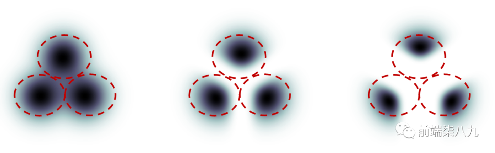  
分类器指导。左：无引导。中间：小的引导尺度。右图：大引导比例  
在高分类器辅助下，扩散模型Diffusion model生成的图像会偏向极端或明确的示例。如果你要求模型生成一只猫的图像，它将返回一张明确是猫而不是其他东西的图像。 
分类器辅助尺度控制着辅助的紧密程度。在上面的图中，右侧的采样比中间的采样具有更高的分类器辅助尺度。在实践中，这个尺度值只是对朝着具有该标签数据的漂移项的乘法因子。  
（CFG）尺度是一个值，用于控制文本提示对扩散过程的影响程度。当该值设为0时，图像生成是无条件的（即忽略了提示）。较高的值将扩散过程引导向提示的方向。 

文生图这个pipeline的内部流程代码
```python
import torch
from diffusers import AutoencoderKL, UNet2DConditionModel, DDIMScheduler
from transformers import CLIPTextModel, CLIPTokenizer
from tqdm.auto import tqdm


model_id = "runwayml/stable-diffusion-v1-5"
# 1. 加载autoencoder
vae = AutoencoderKL.from_pretrained(model_id, subfolder="vae")
# 2. 加载tokenizer和text encoder 
tokenizer = CLIPTokenizer.from_pretrained(model_id, subfolder="tokenizer")
text_encoder = CLIPTextModel.from_pretrained(model_id, subfolder="text_encoder")
# 3. 加载扩散模型UNet
unet = UNet2DConditionModel.from_pretrained(model_id, subfolder="unet")
# 4. 定义noise scheduler
noise_scheduler = DDIMScheduler(
    num_train_timesteps=1000,
    beta_start=0.00085,
    beta_end=0.012,
    beta_schedule="scaled_linear",
    clip_sample=False, # don't clip sample, the x0 in stable diffusion not in range [-1, 1]
    set_alpha_to_one=False,
)

# 将模型复制到GPU上
device = "cuda"
vae.to(device, dtype=torch.float16)
text_encoder.to(device, dtype=torch.float16)
unet = unet.to(device, dtype=torch.float16)

# 定义参数
prompt = [
    "A dragon fruit wearing karate belt in the snow",
    "A small cactus wearing a straw hat and neon sunglasses in the Sahara desert",
    "A photo of a raccoon wearing an astronaut helmet, looking out of the window at night",
    "A cute otter in a rainbow whirlpool holding shells, watercolor"
]
height = 512
width = 512
num_inference_steps = 50
guidance_scale = 7.5
negative_prompt = ""
batch_size = len(prompt)
# 随机种子
generator = torch.Generator(device).manual_seed(2023)


with torch.no_grad():
 # 获取text_embeddings
 text_input = tokenizer(prompt, padding="max_length", max_length=tokenizer.model_max_length, truncation=True, return_tensors="pt")
    text_embeddings = text_encoder(text_input.input_ids.to(device))[0]
 # 获取unconditional text embeddings
 max_length = text_input.input_ids.shape[-1]
 uncond_input = tokenizer(
     [negative_prompt] * batch_size, padding="max_length", max_length=max_length, return_tensors="pt"
 )
      uncond_embeddings = text_encoder(uncond_input.input_ids.to(device))[0]
 # 拼接为batch，方便并行计算
 text_embeddings = torch.cat([uncond_embeddings, text_embeddings])

 # 生成latents的初始噪音
 latents = torch.randn(
     (batch_size, unet.in_channels, height // 8, width // 8),
     generator=generator, device=device
 )
 latents = latents.to(device, dtype=torch.float16)

 # 设置采样步数
 noise_scheduler.set_timesteps(num_inference_steps, device=device)

 # scale the initial noise by the standard deviation required by the scheduler
 latents = latents * noise_scheduler.init_noise_sigma # for DDIM, init_noise_sigma = 1.0

 timesteps_tensor = noise_scheduler.timesteps

 # Do denoise steps
 for t in tqdm(timesteps_tensor):
     # 这里latens扩展2份，是为了同时计算unconditional prediction
     latent_model_input = torch.cat([latents] * 2)
     latent_model_input = noise_scheduler.scale_model_input(latent_model_input, t) # for DDIM, do nothing

     # 使用UNet预测噪音
        noise_pred = unet(latent_model_input, t, encoder_hidden_states=text_embeddings).sample

     # 执行CFG
     noise_pred_uncond, noise_pred_text = noise_pred.chunk(2)
     noise_pred = noise_pred_uncond + guidance_scale * (noise_pred_text - noise_pred_uncond)

     # 计算上一步的noisy latents：x_t -> x_t-1
     latents = noise_scheduler.step(noise_pred, t, latents).prev_sample
    
 # 注意要对latents进行scale
 latents = 1 / 0.18215 * latents
 # 使用vae解码得到图像
    image = vae.decode(latents).sample
```

### 图生图
图生图（image2image）是对文生图功能的一个扩展，这个功能来源于SDEdit这个工作  
其核心思路也非常简单：给定一个笔画的色块图像，可以先给它加一定的高斯噪音（执行扩散过程）得到噪音图像，然后基于扩散模型对这个噪音图像进行去噪，就可以生成新的图像，但是这个图像在结构和布局和输入图像基本一致。  
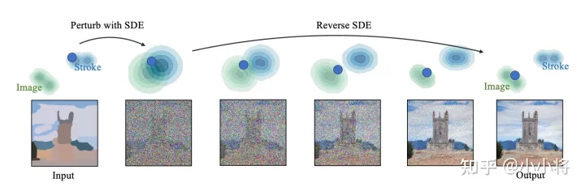  
对于SD来说，图生图的流程图如下所示，相比文生图流程来说，**这里的初始latent不再是一个随机噪音，而是由初始图像经过autoencoder编码之后的latent加高斯噪音得到，这里的加噪过程就是扩散过程**。要注意的是，去噪过程的步数要和加噪过程的步数一致  
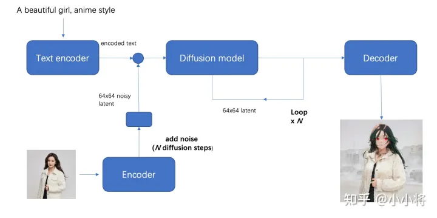  
相比文生图的pipeline，图生图的pipeline还多了一个参数strength，这个参数介于0-1之间，表示对输入图片加噪音的程度，这个值越大加的噪音越多，对原始图片的破坏也就越大，当strength=1时，其实就变成了一个随机噪音，此时就相当于纯粹的文生图pipeline了。  
图生图这个功能一个更广泛的应用是在风格转换上.动漫风格的开源模型anything-v4.0，它是基于SD v1.5在动漫风格数据集上finetune的

### 图像inpainting
给定一个输入图像和想要编辑的区域mask，我们想通过文生图来编辑mask区域的内容。SD的图像inpainting原理可以参考论文Blended Latent Diffusion，其主要原理图如下所示  
  
**首先将输入图像通过autoencoder编码为latent，然后加入一定的高斯噪音生成noisy latent，再进行去噪生成图像，但是这里为了保证mask以外的区域不发生变化，在去噪过程的每一步，都将扩散模型预测的noisy latent用真实图像同level的nosiy latent替换**  

无论是上面的图生图还是这里的图像inpainting，我们其实并没有去finetune SD模型，只是扩展了它的能力，但是这两样功能就需要精确调整参数才能得到满意的生成效果。

```python
import PIL
import numpy as np
import torch
from diffusers import AutoencoderKL, UNet2DConditionModel, DDIMScheduler
from transformers import CLIPTextModel, CLIPTokenizer
from tqdm.auto import tqdm

def preprocess_mask(mask):
    mask = mask.convert("L")
    w, h = mask.size
    w, h = map(lambda x: x - x % 32, (w, h))  # resize to integer multiple of 32
    mask = mask.resize((w // 8, h // 8), resample=PIL.Image.NEAREST)
    mask = np.array(mask).astype(np.float32) / 255.0
    mask = np.tile(mask, (4, 1, 1))
    mask = mask[None].transpose(0, 1, 2, 3)  # what does this step do?
    mask = 1 - mask  # repaint white, keep black
    mask = torch.from_numpy(mask)
    return mask

def preprocess(image):
    w, h = image.size
    w, h = map(lambda x: x - x % 32, (w, h))  # resize to integer multiple of 32
    image = image.resize((w, h), resample=PIL.Image.LANCZOS)
    image = np.array(image).astype(np.float32) / 255.0
    image = image[None].transpose(0, 3, 1, 2)
    image = torch.from_numpy(image)
    return 2.0 * image - 1.0

model_id = "runwayml/stable-diffusion-v1-5"
# 1. 加载autoencoder
vae = AutoencoderKL.from_pretrained(model_id, subfolder="vae")
# 2. 加载tokenizer和text encoder 
tokenizer = CLIPTokenizer.from_pretrained(model_id, subfolder="tokenizer")
text_encoder = CLIPTextModel.from_pretrained(model_id, subfolder="text_encoder")
# 3. 加载扩散模型UNet
unet = UNet2DConditionModel.from_pretrained(model_id, subfolder="unet")
# 4. 定义noise scheduler
noise_scheduler = DDIMScheduler(
    num_train_timesteps=1000,
    beta_start=0.00085,
    beta_end=0.012,
    beta_schedule="scaled_linear",
    clip_sample=False, # don't clip sample, the x0 in stable diffusion not in range [-1, 1]
    set_alpha_to_one=False,
)

# 将模型复制到GPU上
device = "cuda"
vae.to(device, dtype=torch.float16)
text_encoder.to(device, dtype=torch.float16)
unet = unet.to(device, dtype=torch.float16)

prompt = "a mecha robot sitting on a bench"
strength = 0.75
guidance_scale = 7.5
batch_size = 1
num_inference_steps = 50
negative_prompt = ""
generator = torch.Generator(device).manual_seed(0)

with torch.no_grad():
    # 获取prompt的text_embeddings
    text_input = tokenizer(prompt, padding="max_length", max_length=tokenizer.model_max_length, truncation=True, return_tensors="pt")
    text_embeddings = text_encoder(text_input.input_ids.to(device))[0]
    # 获取unconditional text embeddings
    max_length = text_input.input_ids.shape[-1]
    uncond_input = tokenizer(
        [negative_prompt] * batch_size, padding="max_length", max_length=max_length, return_tensors="pt"
    )
    uncond_embeddings = text_encoder(uncond_input.input_ids.to(device))[0]
    # 拼接batch
    text_embeddings = torch.cat([uncond_embeddings, text_embeddings])

    # 设置采样步数
    noise_scheduler.set_timesteps(num_inference_steps, device=device)
    # 根据strength计算timesteps
    init_timestep = min(int(num_inference_steps * strength), num_inference_steps)
    t_start = max(num_inference_steps - init_timestep, 0)
    timesteps = noise_scheduler.timesteps[t_start:]


    # 预处理init_image
    init_input = preprocess(input_image)
    init_latents = vae.encode(init_input.to(device, dtype=torch.float16)).latent_dist.sample(generator)
    init_latents = 0.18215 * init_latents
    init_latents = torch.cat([init_latents] * batch_size, dim=0)
    init_latents_orig = init_latents
    # 处理mask
    mask_image = preprocess_mask(input_mask)
    mask_image = mask_image.to(device=device, dtype=init_latents.dtype)
    mask = torch.cat([mask_image] * batch_size)
    
    # 给init_latents加噪音
    noise = torch.randn(init_latents.shape, generator=generator, device=device, dtype=init_latents.dtype)
    init_latents = noise_scheduler.add_noise(init_latents, noise, timesteps[:1])
    latents = init_latents # 作为初始latents


    # Do denoise steps
    for t in tqdm(timesteps):
        # 这里latens扩展2份，是为了同时计算unconditional prediction
        latent_model_input = torch.cat([latents] * 2)
        latent_model_input = noise_scheduler.scale_model_input(latent_model_input, t) # for DDIM, do nothing

        # 预测噪音
        noise_pred = unet(latent_model_input, t, encoder_hidden_states=text_embeddings).sample

        # CFG
        noise_pred_uncond, noise_pred_text = noise_pred.chunk(2)
        noise_pred = noise_pred_uncond + guidance_scale * (noise_pred_text - noise_pred_uncond)

        # 计算上一步的noisy latents：x_t -> x_t-1
        latents = noise_scheduler.step(noise_pred, t, latents).prev_sample
        
        # 将unmask区域替换原始图像的nosiy latents
        init_latents_proper = noise_scheduler.add_noise(init_latents_orig, noise, torch.tensor([t]))
        latents = (init_latents_proper * mask) + (latents * (1 - mask))

    # 注意要对latents进行scale
    latents = 1 / 0.18215 * latents
    image = vae.decode(latents).sample
```
**原图加初始去噪图一起，原图保留unmask部分，初始去噪图经过text阴道并保留mask部分，latents = (init_latents_proper * mask) + (latents * (1 - mask))**


另外，runwayml在发布SD 1.5版本的同时还发布了一个inpainting模型：runwayml/stable-diffusion-inpainting，与前面所讲不同的是，这是一个在SD 1.2上finetune的模型。原来SD的UNet的输入是64x64x4，为了实现inpainting，现在给UNet的第一个卷机层增加5个channels，分别为masked图像的latents（经过autoencoder编码，64x64x4）和mask图像（直接下采样8x，64x64x1），增加的权重填零初始化。  

## SD 2.0
SD 2.0相比SD 1.x版本的主要变动在于模型结构和训练数据两个部分。

SD 1.x版本的text encoder采用的是OpenAI的CLIP ViT-L/14模型，其模型参数量为123.65M；而SD 2.0采用了更大的text encoder：基于OpenCLIP在**laion-2b**数据集上训练的**CLIP ViT-H/14**模型，其参数量为354.03M，相比原来的text encoder模型大了约3倍  
另外是一个小细节是SD 2.0**提取的是text encoder倒数第二层的特征**，而SD 1.x提取的是倒数第一层的特征。由于倒数第一层的特征之后就是CLIP的对比学习任务，所以倒数第一层的特征可能部分丢失细粒度语义信息，Imagen论文（见论文D.1部分）和novelai（见novelai blog）均采用了倒数第二层特征。  

对于UNet模型，SD 2.0相比SD 1.x几乎没有改变，就是由于换了CLIP模型，cross attention dimension从原来的768变成了1024，这个导致参数量有轻微变化。另外一个小的变动是：SD 2.0不同stage的attention模块是固定attention head dim为64，而SD 1.0则是不同stage的attention模块采用固定attention head数量，明显SD 2.0的这种设定更常用，但是这个变动不会影响模型参数  

然后是训练数据，前面说过SD 1.x版本其实最后主要采用laion-2B中美学评分为5以上的子集来训练，而SD 2.0版本采用**评分在4.5以上的子集**，相当于扩大了训练数据集，具体的训练细节见model card。  

另外SD 2.0除了512x512版本的模型，还包括768x768版本的模型（https://huggingface.co/stabilityai/stable-diffusion-2），所谓的768x768模型是在512x512模型基础上用图像分辨率大于768x768的子集继续训练的，不过优化目标不再是noise_prediction，而是采用Progressive Distillation for Fast Sampling of Diffusion Models论文中所提出的 **v-objective**。  

Stability AI在发布SD 2.0的同时，还发布了另外3个模型：stable-diffusion-x4-upscaler，stable-diffusion-2-inpainting和stable-diffusion-2-depth。  

- stable-diffusion-x4-upscaler是一个基于扩散模型的4x超分模型，它也是基于latent diffusion，不过这里采用的autoencoder是基于VQ-reg的，下采样率为f=4  

  - 实现上，它是将低分辨率图像直接和noisy latent拼接在一起送入UNet，因为autoencoder将高分辨率图像压缩为原来的1/4，而低分辨率图像也为高分辨率图像的1/4，所以低分辨率图像的空间维度和latent是一致的。
  - 另外，这个超分模型也采用了Cascaded Diffusion Models for High Fidelity Image Generation所提出的noise conditioning augmentation，简单来说就是在训练过程中给低分辨率图像加上高斯噪音，可以通过扩散过程来实现，注意这里的扩散过程的scheduler与主扩散模型的scheduler可以不一样，同时也将对应的noise_level（对应扩散模型的time step）通过class labels的方式送入UNet，让UNet知道加入噪音的程度。
  - table-diffusion-x4-upscaler是使用LAION中>2048x2048大小的子集（10M）训练的，训练过程中采用512x512的crops来训练（降低显存消耗）。SD模型可以用来生成512x512图像，加上这个超分模型，就可以得到2048x2048大小的图像。
- stable-diffusion-2-inpainting是图像inpainting模型，和前面所说的runwayml/stable-diffusion-inpainting基本一样，不过它是在SD 2.0的512x512版本上finetune的。
- stable-diffusion-2-depth是也是在SD 2.0的512x512版本上finetune的模型，它是额外增加了图像的深度图作为condition，这里是直接将深度图下采样8x，然后和nosiy latent拼接在一起送入UNet模型中。深度图可以作为一种结构控制，下图展示了加入深度图后生成的图像效果：  

除此之外，Stability AI公司还开源了两个加强版的autoencoder：ft-EMA和ft-MSE（前者使用L1 loss后者使用MSE loss），前面已经说过，它们是在LAION数据集继续finetune decoder来增强重建效果。

## SD 2.1
SD 2.0在训练过程中采用NSFW检测器过滤掉了可能包含色情的图像（punsafe=0.1），但是也同时过滤了很多人像图片，这导致SD 2.0在人像生成上效果可能较差，所以SD 2.1是在SD 2.0的基础上放开了限制（punsafe=0.98）继续finetune，所以**增强了人像的生成效果**。
## SD unclip
stable-diffusion-reimagine，它可以实现单个图像的变换，即image variations，目前该模型已经在在huggingface上开源：stable-diffusion-2-1-unclip。  
这个模型是借鉴了OpenAI的DALLE2（又称unCLIP)，unCLIP是基于CLIP的image encoder提取的image embeddings作为condition来实现图像的生成。  
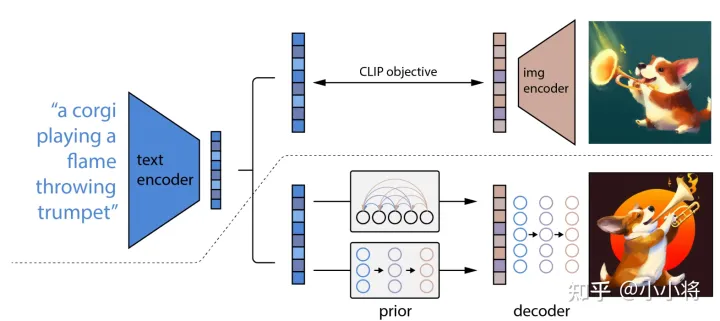  
SD unCLIP是在原来的SD模型的基础上增加了CLIP的image encoder的nosiy image embeddings作为condition。具体来说，它在训练过程中是对提取的image embeddings施加一定的高斯噪音（也是通过扩散过程），然后将noise level对应的time embeddings和image embeddings拼接在一起，最后再以class labels的方式送入UNet。??  
其实在SD unCLIP之前，已经有Lambda Labs开源的sd-image-variations-diffusers，它是在SD 1.4的基础上finetune的模型，不过实现方式是直接将text embeddings替换为image embeddings，这样也同样可以实现图像的变换。

这里SD unCLIP有两个版本：sd21-unclip-l和sd21-unclip-h，两者分别是采用OpenAI CLIP-L和OpenCLIP-H模型的image embeddings作为condition。  
如果要实现文生图，还需要像DALLE2那样训练一个prior模型，它可以实现基于文本来预测对应的image embeddings，我们将prior模型和SD unCLIP接在一起就可以实现文生图了。KakaoBrain这个公司已经开源了一个DALLE2的复现版本：Karlo，它是基于OpenAI CLIP-L来实现的，你可以基于这个模型中prior模块加上sd21-unclip-l来实现文本到图像的生成，目前这个已经集成了在StableUnCLIPPipeline中
## SD的其它特色应用
### 个性化生成
个性化生成是指的生成特定的角色或者风格，比如给定自己几张肖像来利用SD来生成个性化头像。在个性化生成方面，比较重要的两个工作是英伟达的Textual Inversion和谷歌的DreamBooth。 
#### Textual Inversion
-  Textual Inversion这个工作的核心思路是基于用户提供的3～5张特定概念（物体或者风格）的图像来学习一个特定的text embeddings，实际上只用一个word embedding就足够了。Textual Inversion不需要finetune UNet，而且由于text embeddings较小，存储成本很低。  

#### DreamBooth
- DreamBooth原本是谷歌提出的应用在Imagen上的个性化生成，但是它实际上也可以扩展到SD上（更新版论文已经增加了SD）。DreamBooth首先为特定的概念寻找一个特定的描述词[V]，这个特定的描述词只要是稀有的就可以，然后与Textual Inversion不同的是DreamBooth**需要finetune UNet**，这里为了防止过拟合，增加了一个**class-specific prior preservation loss**（基于SD生成同class图像加入batch里面训练）来进行正则化。  
由于finetune了UNet，DreamBooth往往比Textual Inversion要表现的要好，但是DreamBooth的存储成本较高。  
  - DreamBooth和Textual Inversion是最常用的个性化生成方法，但其实除了这两种，还有很多其它的研究工作，比如Adobe提出的Custom Diffusion，相比DreamBooth，它只finetune了UNet的attention模块的KV权重矩阵，同时优化一个新概念的token。

LoRA通过在交叉注意模型中添加一小组额外的「权重」，并仅训练这些额外的权重。  
Hypernetworks使用一个「辅助网络来预测新的权重」，并利用噪声预测器Noise Predictor中的交叉注意部分插入新的样式。  
LoRA和Hypernetworks的训练相对较快，因为它们不需要训练整个稳定扩散模型  

### 风格化finetune模型
采用特定风格的数据集进行finetune，这使得模型“过拟合”在特定的风格上。  
之前比较火的novelai就是基于二次元数据在SD上finetune的模型，虽然它失去了生成其它风格图像的能力，但是它在二次元图像的生成效果上比原来的SD要好很多。  
andite/anything-v4.0：二次元或者动漫风格图像  
dreamlike-art/dreamlike-diffusion-1.0：艺术风格图像  
prompthero/openjourney：mdjrny-v4风格图像  
目前finetune SD模型的方法主要有两种：一种是直接finetune了UNet，但是容易过拟合，而且存储成本；另外一种低成本的方法是基于微软的LoRA，LoRA本来是用于finetune语言模型的，但是现在已经可以用来finetune SD模型了，具体可以见博客Using LoRA for Efficient Stable Diffusion Fine-Tuning。  


#### LoRA
采用的方式是向原有的模型中插入新的数据处理层，这样就避免了去修改原有的模型参数，从而避免将整个模型进行拷贝的情况，同时其也优化了插入层的参数量，最终实现了一种很轻量化的模型调校方法。  
和上文提到的Hypernetwork相同，LoRA在稳定扩散模型里也将注意打在了crossattention（注意力交叉）所在模块，LoRA将会将自己的权重添加到注意力交叉层的权重中，以此来实现微调。   
添加权重是以矩阵的形式，如果这样做，LoRA势必需要存储同样大小的参数，那么LoRA又有了个好点子，直接以矩阵相乘的形式存储，最终文件大小就会小很多了，训练时需要的显存也少了。  
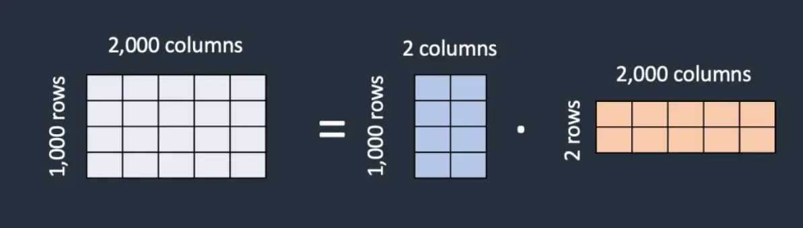   
也就是说，对于SD模型权重w0 ，我们不再对其进行全参微调训练，我们对权重加入残差diff_W的形式，通过训练 来完成优化过程：     
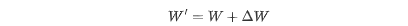  
其中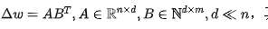 ，其是由两个低秩矩阵的乘积组成。由于下游细分任务的域非常小，所以 可以取得很小，很多时候我们可以取 。    
不过除了主模型+LoRA的形式，我们还可以调整LoRA的权重：  
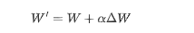  
除了调整单个LoRA的权重，我们还可以使用多个LoRA同时作用于一个主模型，并配置他们的权重，我们拿两个LoRA举例：  
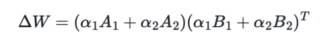  


通常来说，对于矩阵 ，我们使用随机高斯分布初始化，并对于矩阵 使用全 初始化，使得在初始状态下这两个矩阵相乘的结果为 。这样能够保证在初始阶段时，只有SD模型（主模型）生效。    
LoRA大幅降低了SD模型训练时的显存占用，因为并不优化主模型（SD模型），所以主模型对应的优化器参数不需要存储。但计算量没有明显变化，因为LoRA是在主模型的全参梯度基础上增加了“残差”梯度，同时节省了主模型优化器更新权重的过程。   


如何能够小样本分支模型去控制输出？？？  
秩几阶的影响是什么？？？   
怎么放置才能产生影响？？？   

效果弱于DreamBooth，主流的训练方式的网络结构目前在尽量追求DreamBooth的效果，但是具体效果是很多因素影响的。   
控制力弱（虽然即插即拔，但是LoRA训练方法混乱，训练成品良莠不齐，很难有效把控）  


### 图像编辑
使用SD来实现对图片的局部编辑。这里列举两个比较好的工作：谷歌的prompt-to-prompt和加州伯克利的instruct-pix2pix。
- 谷歌的prompt-to-prompt的核心是基于UNet的cross attention maps来实现对图像的编辑，它的好处是不需要finetune模型，但是主要用在编辑用SD生成的图像。  
  
谷歌后面的工作Null-text Inversion有进一步实现了对真实图片的编辑：
- instruct-pix2pix这个工作基于GPT-3和prompt-to-prompt构建了pair的数据集，然后在SD上进行finetune，它可以输入text instruct对图像进行编辑：  

### 可控生成
主要归功于ControlNet，基于ControlNet可以实现对很多种类的可控生成，比如边缘，人体关键点，草图和深度图等等。  
  
  
其实在ControlNet之前，也有一些可控生成的工作，比如stable-diffusion-2-depth也属于可控生成，但是都没有太火。我觉得ControlNet之所以火，是因为这个工作直接实现了各种各种的可控生成，而且训练的ControlNet可以迁移到其它基于SD finetune的模型上（见Transfer Control to Other SD1.X Models）：  
与ControlNet同期的工作还有腾讯的T2I-Adapter以及阿里的composer-page：

#### ControlNet 
通过添加额外条件来控制扩散模型。  
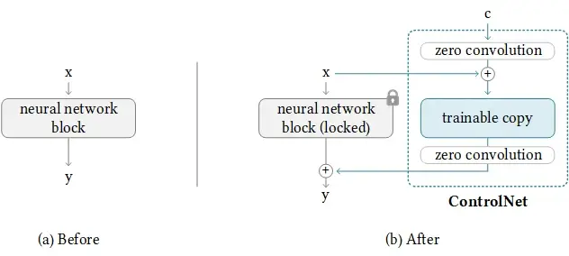   
“c”是我们要添加到神经网络中的一个额外条件。zero convolution”是一个1×1卷积层，权重和偏差都初始化为零。
ControlNet将神经网络权重复制到一个锁定（locked）副本和一个可训练（trainable）副本。  可训练副本将会学习新加入的条件，而锁定副本将会保留原有的模型，得益于此在进行小数据集训练时不会破坏原有的扩散模型。

stable diffusion的U-Net结构如下图所示，包含12个编码器块（Encoder Block），12个解码器块(Decoder Block)，还有一个中间块（Middle），完整模型包括25个块，其中有17个块是主块。文本使用clip进行编码，时间步长采用位置编码。   
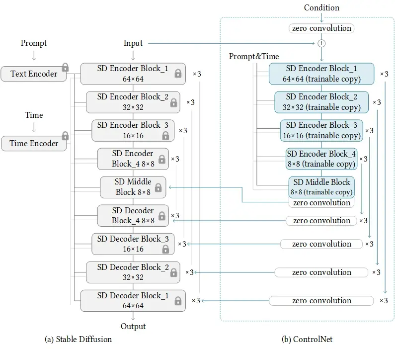   
我们将上图的简单结构附加在stable diffusion 原来的U-Net结构上14次（相当于复制了一次编码器块和中间块，然后改造成ControlNet结构），就完整地对原有的结构进行了控制（影响），原有的stable diffusion 就化身为了 stable diffusion + controlnet   
SD-T就可以继续尝试用特定数据集来训练学习新东西来试图完成我们想要模型完成的新任务，比如边缘检测，比如人体姿势探测    
ControlNet 把每一种不同类别的输入分别训练了模型，目前公开的有下面8个。分别是：canny，depth，hed，mlsd，normal，openpose，scribble，seg。

- ControlNet通过获取额外的输入图像并使用Canny边缘检测器（Canny edge detector）来获取轮廓图，这一过程被称为预处理
- 轮廓图（自然是会被处理到隐空间去）将会作为额外的条件（conditioning）和文本提示被送入SD-T
- 由于SD-T进行扩散时参考了我们多出来的条件，所以最终出现的图会具有我们预处理时的特征   
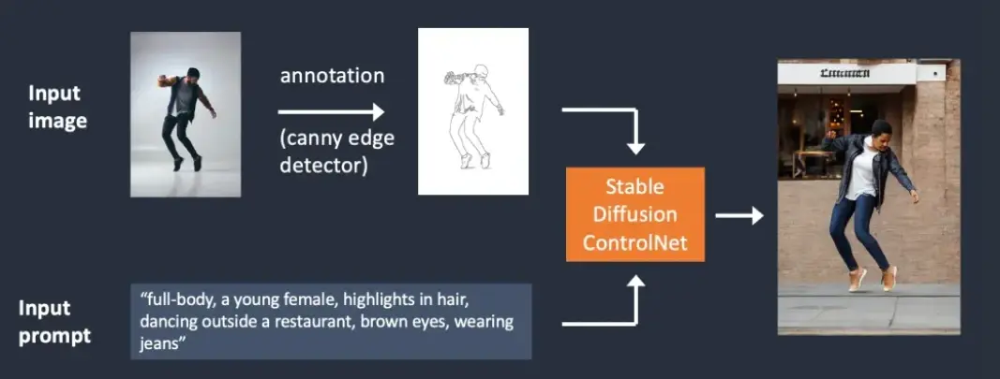  

#### T2I-Adapter
T2I-Adapter原理和ControlNet相似，都是为了给稳定扩散添加额外的输入条件   
与 前述Control-Net/Composer的出发点一致的是，希望通过更多，更细粒度的控制条件，来显式地实现对于扩散模型的生成的结果   
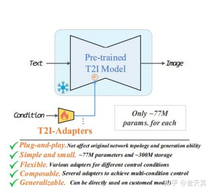   
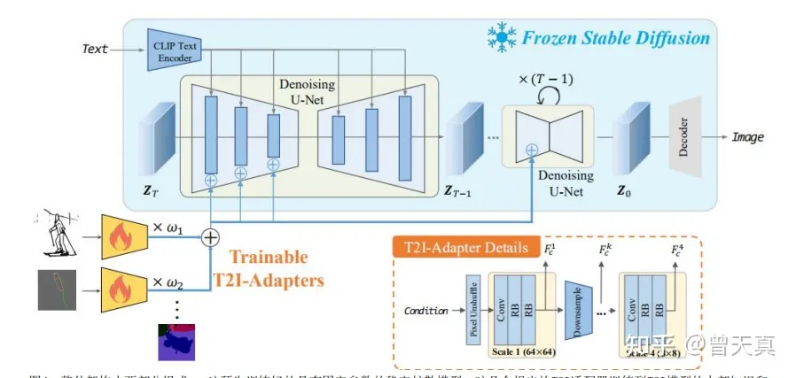   
整体架构由两部分组成： 1)预先训练好的具有固定参数的stable diffusion模型；2)几个不同的T2L-Adapter的控制输入信息。T2I-Adapter的详细体系结构见右下角。  

Stable diffusion model 不足之处：文章中指出，之所以Stable Diffusion model控制效果不好，是因为文本输入的控制信息不够准确。因此希望通过T2l-Adapt，来更精确的对SD网络进行控制。   

3.详细结构：它由4个特征提取块和3 个下采样块组成，以改变原始条件输入的特征分辨率，将其降采样到64。之后基于不同的特征维度，对原始的stable diffusion model进行微调，这边需要注意的是，不同的特征维度要接入到对应的网络层中。  
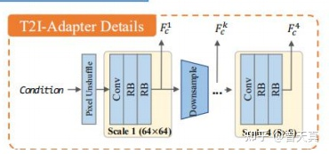   
在优化过程中，首先固定SD中的参数，只优化T2I-Adapt。优化过程与SD相似：   


#### GLIGEN (Grounded Language-to-Image Generation)  
如果给出了输入图像，可以在边界框定义的区域插入由文本描述的对象。否则，它将生成由标题/提示描述的图像，并在边界框定义的区域插入由文本描述的对象。它在 COCO2014D 和 COCO2014CD 数据集上进行训练，并且该模型使用冻结的 CLIP ViT-L/14 文本编码器来根据接地输入调节自身。   

## SDXL 1.0 （July 26, 2023）
SDXL 0.9 June 22, 2023   

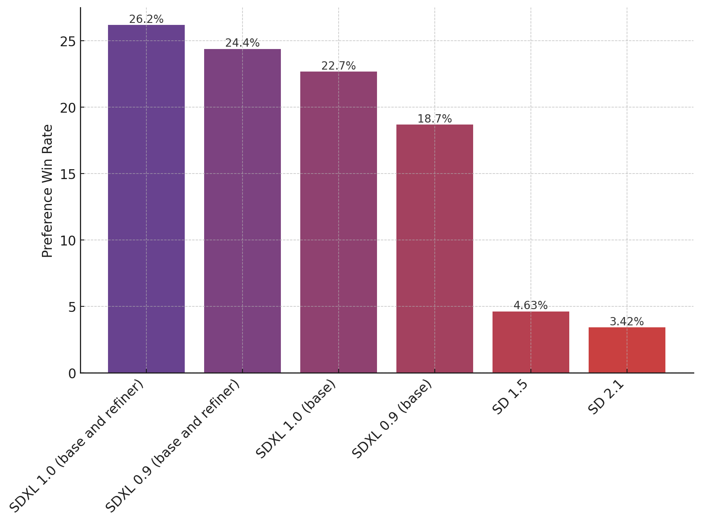  

SDXL和之前的版本一样也是采用latent diffusion架构，但SDXL相比之前的版本SD 1.x和SD 2.x有明显的提升，SDXL的性能始终超过Stable Diffusion以前所有的版本，比如SD 1.5 、SD2.1。  
可以看到SDXL无论是在文本理解还是在生成图像质量上，相比之前的版本均有比较大的提升。SDXL性能的提升主要归功于以下几点的改进：  

- SDXL的模型参数增大为2.3B，这几乎上原来模型的3倍，UNet主干架构增加了3倍，而且SDXL采用了两个CLIP text encoder来编码文本特征；
- SDXL采用了额外的条件注入来改善训练过程中的数据处理问题，而且最后也采用了多尺度的微调；两种简单而有效的附加调节技术，不需要任何形式的额外监督；
- SDXL级联了一个细化模型来提升图像的生成质量。一个单独的基于扩散的细化模型，该模型对SDXL产生的潜在信号采用去噪处理 

尽管策略是作为潜在扩散模型的扩展开展的 ，但其中大多数也适用于像素空间的对应物。


### 模型架构上的优化
SDXL的autoencoder依然采用KL-f8，但是并没有采用之前的autoencoder，而是基于同样的架构采用了更大的batch size（256 vs 9）重新训练，同时采用了EMA。重新训练的VAE模型（尽管和VAE有区别，大家往往习惯称VAE）相比之前的模型，其重建性能有一定的提升，性能对比如下所示：  
  
这里要注意的是上表中的三个VAE模型其实模型结构是完全一样，其中SD-VAE 2.x只是在SD-VAE 1.x的基础上重新微调了decoder部分，但是encoder权重是相同的，所以两者的latent分布是一样的，两个VAE模型是都可以用在SD 1.x和SD 2.x上的。但是SDXL-VAE是完全重新训练的，它的latent分布发生了改变，你不可以将SDXL-VAE应用在SD 1.x和SD 2.x上。  
在将latent送入扩散模型之前，我们要对latent进行缩放来使得latent的标准差尽量为1，由于权重发生了改变，所以SDXL-VAE的缩放系数也和之前不同，之前的版本采用的缩放系数为0.18215，而SDXL-VAE的缩放系数为0.13025。  
一个要注意的点是SDXL-VAE采用float16会出现溢出（具体见这里），必须要使用float32来进行推理，但是之前的版本使用float16大部分情况都是可以的。VAE的重建能力对SD生成的图像质量还是比较重要的，SD生成的图像容易出现小物体畸变，这往往是由于VAE导致的，SDXL-VAE相比SD-VAE 2.x的提升其实比较微弱，所以也不会大幅度缓解之前的畸变问题。

SDXL相比之前的版本，一个最大的变化采用了更大的UNet，下表为SDXL和之前的SD的具体对比，之前的SD的UNet参数量小于1B，但是SDXL的UNet参数量达到了2.6B，比之前的版本足足大了3倍。  
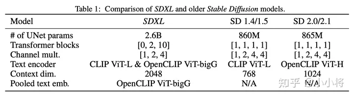  
下面我们来重点看一下SDXL是如何扩增UNet参数的，SDXL的UNet模型结构如下图所示：  
  
SDXL的第一个stage采用的是普通的DownBlock2D，而不是采用基于attention的CrossAttnDownBlock2D，这个主要是为了计算效率，因为SDXL最后是直接生成1024x1024分辨率的图像，对应的latent大小为128x128x4，如果第一个stage就使用了attention（包含self-attention），所需要的显存和计算量都是比较大的。    
为了提高效率，并在最高特征级别中省略了Transformer块，在较低级别中使用2个和10个块，还在UNet 中完全删除了最低级别（8倍下采样）

另外一个变化是SDXL只用了3个stage，这意味着只进行了两次2x下采样，而之前的SD使用4个stage，包含3个2x下采样。  
SDXL的网络宽度（这里的网络宽度是指的是特征channels）相比之前的版本并没有改变，3个stage的特征channels分别是320、640和1280。  

SDXL参数量的增加主要是使用了更多的transformer blocks，在之前的版本，每个包含attention的block只使用一个transformer block（self-attention -> cross-attention -> ffn），但是SDXL中stage2和stage3的两个CrossAttnDownBlock2D模块中的transformer block数量分别设置为2和10，并且中间的MidBlock2DCrossAttn的transformer blocks数量也设置为10（和最后一个stage保持一样）。可以看到SDXL的UNet在空间维度最小的特征上使用数量较多的transformer block，这是计算效率最高的。
   

SDXL的另外一个变动是text encoder，SD 1.x采用的text encoder是123M的OpenAI CLIP ViT-L/14，而SD 2.x将text encoder升级为354M的OpenCLIP ViT-H/14。  
SDXL更进一步，不仅采用了更大的OpenCLIP ViT-bigG（参数量为694M），而且同时也用了OpenAI CLIP ViT-L/14，这里是分别提取两个text encoder的倒数第二层特征()？？？？融合》？？     

类似clip终止层数（clip skip）   
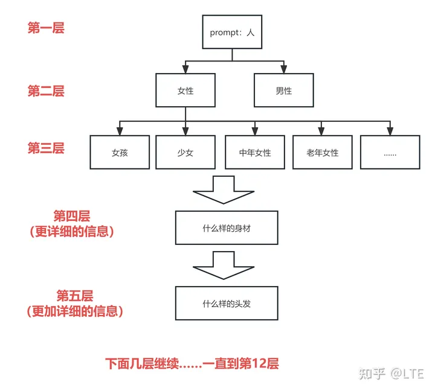    
可见ClipSkip值较小，生成含有丰富提示词的插图；ClipSkip的值较大，生成忽略提示词的插图。

其中OpenCLIP ViT-bigG的特征维度为1280，而CLIP ViT-L/14的特征维度是768，两个特征concat在一起总的特征维度大小是2048，这也就是SDXL的context dim。OpenCLIP ViT-bigG相比OpenCLIP ViT-H/14，在性能上有一定的提升   

这里有一个处理细节是提取了OpenCLIP ViT-bigG的pooled text embedding（用于CLIP对比学习所使用的特征），将其映射到time embedding的维度并与之相加。这种特征嵌入方式在强度上并不如cross attention，只是作为一种辅助。
- 比如在Stable Diffusion中,将Time Embedding引入U-Net中,帮助其在扩散过程中从容预测噪声
  - DDPM  
  该文章提出来不去预测x_t如何预测x_{t-1}，我们只去预测噪声，就是用x_t去预测 噪声\epsilon
  我们的输入除了x_t还用到了time embedding, 主要是用来告诉UNet这个模型反向扩散了第几步，这里time embedding 就相当于transformer中的位置编码一样，它也是一个正弦的位置编码或者是一个傅里叶特征？？？？  
  在反向diffusion希望先生成比较粗糙的轮廓图像，随着扩散模型一点点传播快生成图像的时候我们希望它学习到一些高频的信息特征比如说物体的边边角角等细小特征，这样使得生成的图片更加逼真，所以需要用time embedding告诉模型哪里我需要更加逼真。  
  我们已知的噪声\epsilon（groundtruth，这里每一步添加的噪声都是我们自己加进去的）与我们预测出来的噪声|| \epsilon - f_\epsilon(x_t, embedding_{time})||插值  
    - f_\epsilon(x_t, embedding_{time})表示的上图我们UNet的网络结构。x_t表示的是输入
  


SDXL只是UNet变化了，而扩散模型的设置是和原来的SD一样，都采用1000步的DDPM，noise scheduler也保持没动，训练损失是采用基于预测noise的
L_simple。

### 额外的条件注入
采用了额外的条件注入来解决训练过程中数据处理问题，这里包括两种条件注入方式，它们分别解决训练过程中数据利用效率和图像裁剪问题

SD的训练往往是先在256x256上预训练，然后在512x512上继续训练。当使用256x256尺寸训练时，要过滤掉那些宽度和高度小于256的图像，采用512x512尺寸训练时也同样只用512x512尺寸以上的图像。由于需要过滤数据，这就导致实际可用的训练样本减少了，要知道训练数据量对大模型的性能影响是比较大。  
一种直接的解决方案是采用一个超分模型先对数据进行预处理，但是目前超分模型并不是完美的，还是会出现一些artifacts（对于pixel diffusion模型比如Imagen，往往是采用级联的模型，64x64的base模型加上两个超分模型，其中base模型的数据利用效率是比较高的，但是可能的风险是超分模型也可能会出现artifacts）。  
SDXL提出了一种简单的方案来解决这个问题，那就是将图像的原始尺寸（width和height）作为条件嵌入UNet模型中，这相当于让模型学到了图像分辨率参数  
在训练过程中，我们可以不过滤数据直接resize图像，在推理时，我们只需要送入目标分辨率而保证生成的图像质量。图像原始尺寸嵌入的实现也比较简单，和timesteps的嵌入一样，先将width和height用傅立叶特征编码进行编码，然后将特征concat在一起加在time embedding上。？？？

第二个问题是训练过程中的图像裁剪问题，目前文生图模型预训练往往采用固定图像尺寸，这就需要对原始图像进行预处理，这个处理流程一般是先将图像的最短边resize到目标尺寸，然后沿着图像的最长边进行裁剪（random crop或者center crop）。但是图像裁剪往往会导致图像出现缺失问题，比如下图采用center crop导致人物的头和脚缺失了，这也直接导致模型容易生成缺损的图像。？？？？  
如下图所示，SD 1.5和SD 2.1生成的猫出现头部缺失问题，这其实就是训练过程中裁剪导致的  
为了解决这个问题，SDXL也将训练过程中裁剪的左上定点坐标作为额外的条件注入到UNet中，这个注入方式可以采用和图像原始尺寸一样的方式，即通过傅立叶编码并加在time embedding上。在推理时，我们只需要将这个坐标设置为(0, 0)就可以得到物体居中的图像（此时图像相当于没有裁剪）。？？?  
SDXL在训练过程中，可以将两种条件注入（size and crop conditioning）结合在一起使用，训练数据的处理流程和之前是一样的，只是要额外保存图像的原始width和height以及图像crop时的左上定点坐标top和left

SDXL首先采用基于上述的两种条件注入方案在256x256尺寸上训练600000步（batch size = 2048），然后采用512x512尺寸继续训练200000步，这相当于采样了约16亿的样本。SDXL并没有止步在512x512尺寸，这只是SDXL的预训练，SDXL的最后一步训练是在1024x1024尺寸上采用多尺度方案来进行微调。  
对于图像裁剪造成的问题，其实另外一个解决方案就是采用多尺度训练，很早NovelAI就发现了这个问题，并提出了基于分组的多尺度训练策略（见博客NovelAI Improvements on Stable Diffusion和NovelAI Aspect Ratio Bucketing Source Code Release (MIT Licensed)，就是说先将训练数据集按照不同的长宽比（aspect ratio）进行分组（groups或者buckets），在训练过程中，我们随机选择一个bucket并从中采样一个batch数据进行训练。将数据集进行分组可以避免过量的裁剪图像，从而减弱对模型的不利影响，并且让模型学习到了多尺度生成。但是分组的方案就需要提前对数据集进行处理，这对于大规模训练是比较麻烦的，所以SDXL选择了先采用固定尺寸预训练，然后最后再进行多尺度微调。
- 现有图像生成模型的一个常见问题是它们很容易生成具有不自然裁剪的图像。这是因为这些模型经过训练可以生成方形图像。然而，大多数照片和艺术品都不是方形的。然而，该模型只能同时处理相同大小的图像，并且在训练过程中，通常的做法是同时处理多个训练样本以优化所用 GPU 的效率。作为折衷方案，选择方形图像，并且在训练过程中，仅裁剪出每个图像的中心  
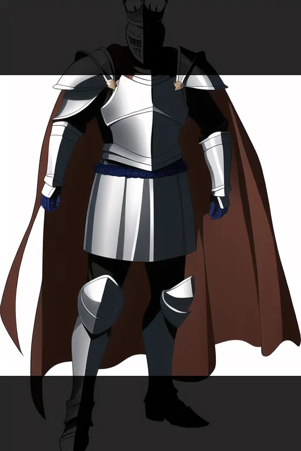  
using random crops instead of center crops only slightly improves these issues.  

### 多尺度微调
这里的多尺度训练策略是借鉴NovelAI所提出的方案，将数据集中图像按照不同的长宽比划分到不同的buckets上（按照最近邻原则），SDXL所设置的buckets如下表所示，虽然不同的bucket的aspect ratio不同，但是像素总大小都接近1024x1024，相邻的bucket其height或者width相差64个pixels。  
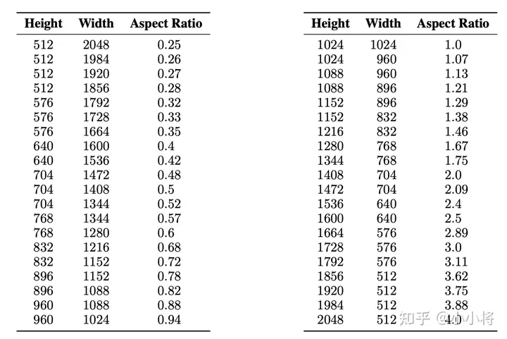  
在训练过程中，每个step可以在不同的buckets之间切换，每个batch的数据都是从相同的bucket中采样得到。  
在多尺度训练中，SDXL也将bucket size即target size作为条件加入UNet中，这个条件注入方式和之前图像原始尺寸条件注入一样。将target size作为条件，其实是让模型能够显示地学习到多尺度（或aspect ratio）。

另外一个比较细节的地方是SDXL在多尺度微调阶段采用了offset-noise，这个技术主要是为了解决SD只能生成中等亮度的图像，而无法生成纯黑或者纯白的图像。比如当我们的prompt为"A bald eagle against a white background"，使用SD 2.1生成的图像如下所示，生成的秃头鹰虽然没问题，但是背景并不是白色的：  
之所以会出现这个问题，是因为训练和测试过程的不一样，SD所使用的noise scheduler其实在最后一步并没有将图像完全变成随机噪音，这使得训练过程中学习是有偏的，但是测试过程中，我们是从一个随机噪音开始生成的，这种不一致就会出现一定的问题。offset-noise是一个解决这个问题的简单方法，你只需要在训练过程中给采用的噪音加上一定的offset即可  
这里的noise_offset是一个超参数，默认是采用0.1，SDXL采用的是0.05。由于采用offset-noise策略，SDXL就可以生成背景接近为白色的图像  
对于这个问题，还有其它的解决方案，比如：
Input Perturbation Reduces Exposure Bias in Diffusion Models  
Common Diffusion Noise Schedules and Sample Steps are Flawed


这里我们简单总结一下，SDXL总共增加了4个额外的条件注入到UNet，它们分别是pooled text embedding，original size，crop top-left coord和target size。对于后面三个条件，它们可以像timestep一样采用傅立叶编码得到特征，然后我们这些特征和pooled text embedding拼接在一起，最终得到维度为2816（1280+25623）的特征。我们将这个特征采用两个线性层映射到和time embedding一样的维度，然后加在time embedding上即可,具体的实现代码如下所示：????  
```python
import math
from einops import rearrange
import torch

batch_size =16
# channel dimension of pooled output of text encoder (s)
pooled_dim = 1280
adm_in_channels = 2816
time_embed_dim = 1280

def fourier_embedding(inputs, outdim=256, max_period=10000):
    """
    Classical sinusoidal timestep embedding
    as commonly used in diffusion models
    : param inputs : batch of integer scalars shape [b ,]
    : param outdim : embedding dimension
    : param max_period : max freq added
    : return : batch of embeddings of shape [b, outdim ]
    """
    half = outdim // 2
    freqs = torch.exp(
        -math.log(max_period)
            * torch.arange(start=0, end=half, dtype=torch.float32)
            / half
    ).to(device=inputs.device)
    args = timesteps[:, None].float() * freqs[None]
    embedding = torch.cat([torch.cos(args), torch.sin(args)], dim=-1)
    if dim % 2:
        embedding = torch.cat(
            [embedding, torch.zeros_like(embedding[:, :1])], dim=-1
        )
    return embedding


def cat_along_channel_dim(x: torch.Tensor,) -> torch.Tensor:
    if x.ndim == 1:
        x = x[... , None]
 assert x . ndim == 2
 b, d_in = x.shape
    x = rearrange(x, "b din -> (b din)")
    # fourier fn adds additional dimension
    emb = fourier_embedding(x)
    d_f = emb.shape[-1]
    emb = rearrange(emb, "(b din) df -> b (din df)",
                     b=b, din=d_in, df=d_f)
 return emb


def concat_embeddings(
    # batch of size and crop conditioning cf. Sec. 3.2
    c_size: torch.Tensor,
    c_crop: torch.Tensor,
    # batch of target size conditioning cf. Sec. 3.3
    c_tgt_size: torch.Tensor ,
    # final output of text encoders after pooling cf. Sec . 3.1
    c_pooled_txt: torch.Tensor,
) -> torch.Tensor:
    # fourier feature for size conditioning
    c_size_emb = cat_along_channel_dim(c_size)
 # fourier feature for size conditioning
 c_crop_emb = cat_along_channel_dim(c_crop)
 # fourier feature for size conditioning
 c_tgt_size_emb = cat_along_channel_dim(c_tgt_size)
 return torch.cat([c_pooled_txt, c_size_emb, c_crop_emb, c_tgt_size_emd], dim=1)

# the concatenated output is mapped to the same
# channel dimension than the noise level conditioning
# and added to that conditioning before being fed to the unet
adm_proj = torch.nn.Sequential(
    torch.nn.Linear(adm_in_channels, time_embed_dim),
    torch.nn.SiLU(),
    torch.nn.Linear(time_embed_dim, time_embed_dim)
)

# simulating c_size and c_crop as in Sec. 3.2
c_size = torch.zeros((batch_size, 2)).long()
c_crop = torch.zeros((batch_size, 2)).long ()
# simulating c_tgt_size and pooled text encoder output as in Sec. 3.3
c_tgt_size = torch.zeros((batch_size, 2)).long()
c_pooled = torch.zeros((batch_size, pooled_dim)).long()
 
# get concatenated embedding
c_concat = concat_embeddings(c_size, c_crop, c_tgt_size, c_pooled)
# mapped to the same channel dimension with time_emb
adm_emb = adm_proj(c_concat)
```
???

### 细化模型
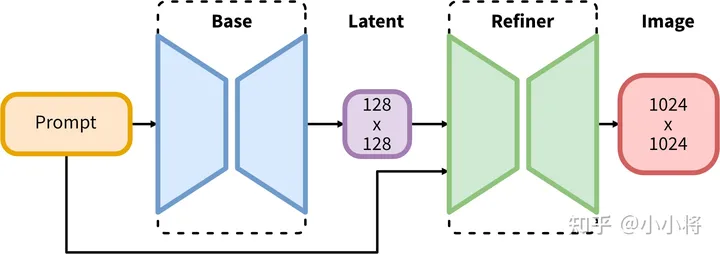  
这里第一个模型我们称为base model，上述我们讲的其实就是SDXL-base model，第二个模型是refiner model，它是进一步在base model生成的图像基础上提升图像的细节。refiner model是和base model采用同样VAE的一个latent diffusion model，但是它只在使用较低的noise level进行训练（只在前200 timesteps上）  
在推理时，我们只使用refiner model的图生图能力。对于一个prompt，我们首先用base model生成latent，然后我们给这个latent加一定的噪音（采用扩散过程），并使用refiner model进行去噪。经过这样一个重新加噪再去噪的过程，图像的局部细节会有一定的提升  

级联refiner model其实相当于一种模型集成，这种集成策略也早已经应用在文生图中，比如NVIDA在eDiff-I: Text-to-Image Diffusion Models with an Ensemble of Expert Denoisers就提出了集成不同的扩散模型来提升生成质量。另外采用SD的图生图来提升质量其实也早已经被应用了，比如社区工具Stable Diffusion web UI的high res fix就是基于图生图来实现的（结合超分模型）。  

refiner model和base model在结构上有一定的不同，其UNet的结构如下图所示，refiner model采用4个stage，第一个stage也是采用没有attention的DownBlock2D，网络的特征维度采用384，而base model是320。另外，refiner model的attention模块中transformer block数量均设置为4。refiner model的参数量为2.3B，略小于base model。  
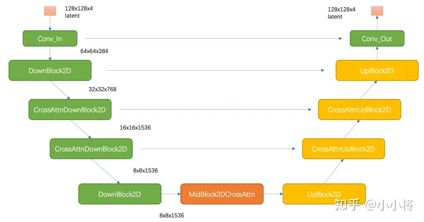  

另外refiner model的text encoder只使用了OpenCLIP ViT-bigG，也是提取倒数第二层特征以及pooled text embed。与base model一样，refiner model也使用了size and crop conditioning，除此之外还增加了图像的艺术评分aesthetic-score作为条件，处理方式和之前一样。refiner model应该没有采用多尺度微调，所以没有引入target size作为条件（refiner model只是用来图生图，它可以直接适应各种尺度）。

### 模型评测
对于文生图模型的评测，首先会计算COCO数据集上FID和CLIP score，SDXL其它版本SD的对比如下所示：  
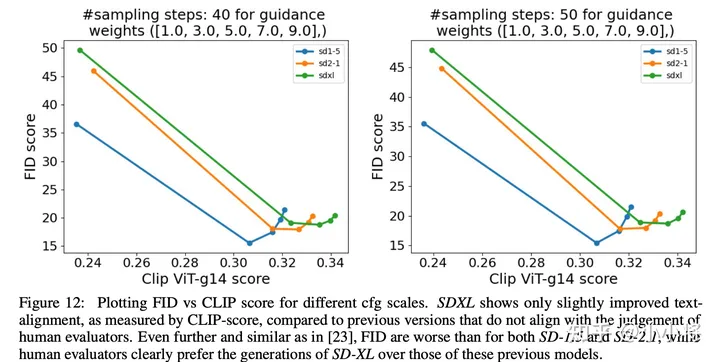  
从CLIP score来看，SDXL采用了更强的text encoder，其CLIP score是最高的，但是从FID来看，SD 1.5是最低的，而SDXL反而是最高的，我们直接FID往往并不能很好地衡量图像的生成质量，所以这里又进一步采用人工评价（同样的prompt让不同模型生成图像来人工选择最好的），对比结果如下所示：  
还进一步和目前比较好的模型Midjourney v5.1进行对比，这里是基于PartiPrompts来进行对比的，PartiPrompts是谷歌在Parti这个工作中所提出的文生图测试prompts，它包含不同的类别比如动物和人等，这里是每个类别随机选择5个prompts分别使用SDXL和Midjourney v5.1生成图像，并人来进行选择  
和LLM模型一样，文生图模型也同样面临难客观评价的问题

### 模型局限
模型还是比较难以生成好比较复杂的结构，这里的一个典型例子是人手，模型往往不能生成正确的结构（出现多指和少指甚至错乱的情况）  
然后模型生成的图像还是无法达到完美的逼真度，在一些细节上比如灯光或纹理可能无法偏离真实。还有一个比较大的缺陷是当生成的图像包含多个实体时，往往会出现属性混淆，比如下图中最左下角的图像，苹果和背包的颜色出现了互换（当然本身这个例子比较难，黑色的苹果不常见），而且其它图像中的背包颜色也是混淆进了黑色  
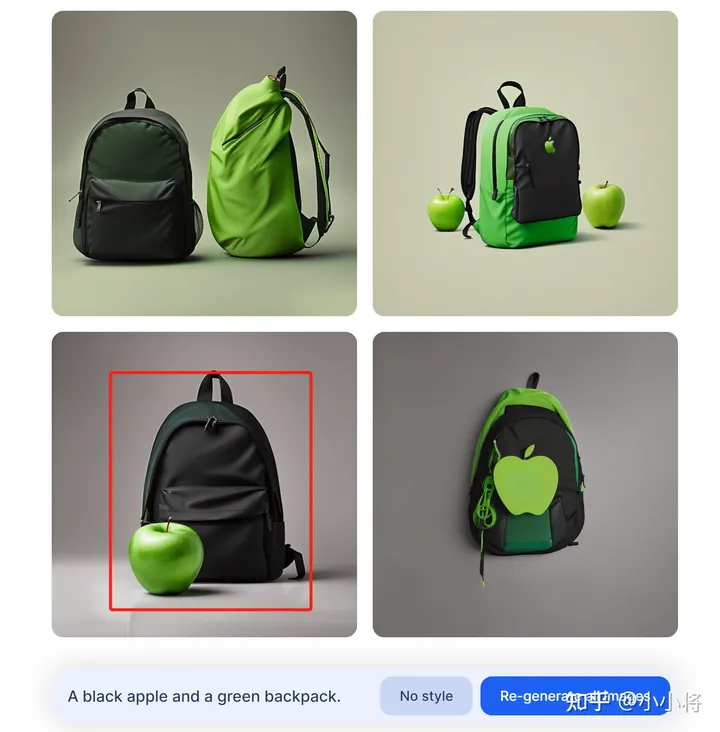  
除了属性混淆，其实也会出现属性渗透或者溢出，比如下图中的头发颜色渗透到了眼睛,车子的颜色也影响了旁边楼宇的颜色

不过，上述缺陷几乎是目前所有的文生图都面临的问题，这也说明文生图模型还有一段很长的路要走。 Stability AI也给出了他们觉得未来可以改进的方面：
- Single stage：级联模型虽然能够提升图像质量，但是需要更大的计算资源，而且还增加了用时，所以单模型还是需要的；
- Text synthesis：使用更好的text encoder来提升模型的文本理解能力；
- Architecture：使用纯transformer模型，比如DiT，但是他们的初步尝试是没有太大的提升；
- Distillation：蒸馏模型减少采样步数；
- Diffusion model：采用更好的扩散架构，比如基于连续时间的EDM框架

## 中文sd
### Taiyi-Stable-Diffusion-1B-Chinese-v0.1
我们将Noah-Wukong数据集(100M)和Zero数据集(23M)用作预训练的数据集，先用IDEA-CCNL/Taiyi-CLIP-RoBERTa-102M-ViT-L-Chinese对这两个数据集的图文对相似性进行打分，取CLIP Score大于0.2的图文对作为我们的训练集。 我们使用IDEA-CCNL/Taiyi-CLIP-RoBERTa-102M-ViT-L-Chinese作为初始化的text encoder，冻住stable-diffusion-v1-4(论文)模型的其他部分，只训练text encoder，以便保留原始模型的生成能力且实现中文概念的对齐。该模型目前在0.2亿图文对上训练了一个epoch。 我们在 32 x A100 训练了大约100小时。  
参数量：1B

### Taiyi-Stable-Diffusion-1B-Chinese-EN-v0.1
我们将Noah-Wukong数据集(100M)和Zero数据集(23M)用作预训练的数据集，先用IDEA-CCNL/Taiyi-CLIP-RoBERTa-102M-ViT-L-Chinese对这两个数据集的图文对相似性进行打分，取CLIP Score大于0.2的图文对作为我们的训练集。 我们使用stable-diffusion-v1-4(论文)模型进行继续训练，其中训练分为两个stage。

第一个stage中冻住模型的其他部分，只训练text encoder，以便保留原始模型的生成能力且实现中文概念的对齐。

第二个stage中将全部模型解冻，一起训练text encoder和diffusion model，以便diffusion model更好的适配中文guidance。

第一个stage我们训练了80小时，第二个stage训练了100小时，两个stage都是用了8 x A100。

## 动手QA
### 训练中文文生图
### 1.encode过程 为什么在stable diffusion中输入图像(3,512,512)经过vae.encoder后变成(4,64,64)，为什么第一维多了一个?   
bs=4  
输入图像(4,3,512,512)


encode内部经过conv_in=Conv2d(3, 128, kernel_size=(3, 3), stride=(1, 1), padding=(1, 1)),即bias有128个，weight(128,3,3,3)，  
变成(4,128,512,512)  
此时保留做残差   

共四个DownEncoderBlock2D和一个midblock完成encode

进入DownEncoderBlock2D有两个resnetblock和一个downsample

进入resnetblock,首先经过GroupNorm(32, 128, eps=1e-06, affine=True)，weight和bias都是128，  
再经过silu，还是(4,128,512,512)   

在经过conv1=LoRACompatibleConv(128, 128, kernel_size=(3, 3), stride=(1, 1), padding=(1, 1)),

在经过norm2,  
然后silu  

再经过drop(p=0)  
p: probability of an element to be zeroed. Default: 0.5


再conv2  
与先前保留做残差  
完成第一个resnetblock，输出(4,128,512,512)  
（这里的conv可以用lora，且此resnetblock可以做时间嵌入和上下采样操作）

第2个resnetblock  
保留一个做残差  
各项包括卷积大小都不变，和第一个resnetblock一样   

```
{
  "_class_name": "AutoencoderKL",
  "_diffusers_version": "0.3.0",
  "_name_or_path": "./finetune_taiyi_v0.20/vae",
  "act_fn": "silu",
  "block_out_channels": [
    128,
    256,
    512,
    512
  ],
  "down_block_types": [输入512
    "DownEncoderBlock2D",输出256
    "DownEncoderBlock2D",输出128
    "DownEncoderBlock2D",输出64
    "DownEncoderBlock2D"输出64，最后一个没有下采样
  ],
  "in_channels": 3,
  "latent_channels": 4,
  "layers_per_block": 2,
  "out_channels": 3,
  "sample_size": 512,
  "scaling_factor": 0.18215,
  "up_block_types": [
    "UpDecoderBlock2D",
    "UpDecoderBlock2D",
    "UpDecoderBlock2D",
    "UpDecoderBlock2D"
  ]
}

```

进入第一个DownEncoderBlock2D的唯一一个downsample  
Downsample2D(
  (conv): LoRACompatibleConv(128, 128, kernel_size=(3, 3), stride=(2, 2))
)   
先做自动padding变513  
(513+0-3)/2+1=255+1=256  
torch.Size([4, 128, 256, 256])  

第2个DownEncoderBlock2D  
第一个resnetblock中第一个conv将c=128到256，第二个conv结束后有一个conv_shortcut，因为第一个conv通道改变，也就是需要对开始保留的残差做一个额外的conv（LoRACompatibleConv(128, 256, kernel_size=(1, 1), stride=(1, 1))）后再与hidden（第二个conv输出）相加,让一开始的channel也到256,其他不变   
pad默认为0   
再讲一次downsample  
Downsample2D(
  (conv): LoRACompatibleConv(256, 256, kernel_size=(3, 3), stride=(2, 2))
)  
输入torch.Size([4, 256, 256, 256])  
conv的pad=0时自动进行pad1到两个维度  
变成torch.Size([4, 256, 257, 257])  
(257+0-3)/2+1=127+1=128   

vae.encode输出: encoder输出后经过1*1卷积，经过对角高斯分布，logvar(4,4,64,64),mean(4,4,64,64),parameters(4,8,64,64),std,var  
在经过sample采样得到latent(4,4,64,64)  

...


将torch.Size([4, 512, 64, 64])放入unetmidblock  
先经过第一个resnet  
然后以组合循环方式经过attn再resnet（这里只有一组）  

attention层，  
先留一个残差torch.Size([4, 512, 64, 64])   
bs,c,h,w重新排列成bs,w*h,c.即torch.Size([4, 4096, 512])，sequence_length=4096  
attention_mask=None   
转[4, 512, 4096]做norm后再转回来[4, 4096, 512]   
直接线性映射toq,tok,tov   
batch_to_head_dim。qkv  Reshape the tensor from `[batch_size, seq_len, dim]` to `[batch_size, seq_len, heads, dim // heads]`.只有一个头。dim即512的channel    
torch.Size([4, 4096, 1, 512])  
再排序成torch.Size([4, 1, 4096, 512])
头为1，输出还是torch.Size([4, 4096, 512])

正常计算自注意力层...  
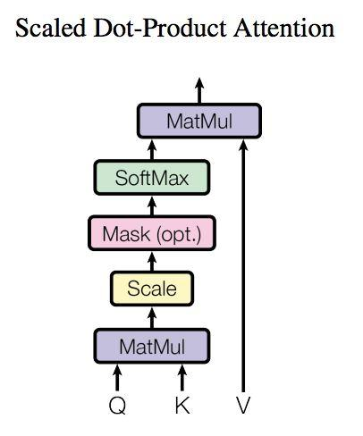   
qk计算attention_scores=torch.Size([4, 4096, 4096])  （但是一般是kv取自另外的模态）  
softmax得attention_probs  
attention_probs和v计算hidden_states=torch.Size([4, 4096, 512])   
batch_to_head_dim一个头不变   

输出经过一个映射层和无效dropout   
reshape回torch.Size([4, 512, 64, 64])与残差相加  
注意力层结束   
基础单元resnet和attn都有残差   

再经过第二个resnet
出来还是torch.Size([4, 512, 64, 64])   

norm,silu,conv_out=Conv2d(512, 8, kernel_size=(3, 3), stride=(1, 1), padding=(1, 1))   
64+2-3+1   
输出torch.Size([4, 8, 64, 64])     


encoder结束   
encode没结束  
quant_conv=Conv2d(8, 8, kernel_size=(1, 1), stride=(1, 1))   
得到torch.Size([4, 8, 64, 64])   

后验DiagonalGaussianDistribution实例化：  
延第二个维度分半torch.Size([4, 4, 64, 64])    
限制logvar(-30,20)   

encode结束，返回posterior没有实际意义，不是mean或logvar   


### 2.图片encode后加噪等-具体过程  
图片encode后根据DiagonalGaussianDistribution采样latent=torch.Size([4, 4, 64, 64])，self.mean + self.std * sample(正态分布采样逐元素乘)    
0.18215缩放    
noise正态分布采样latent大小  
接下来根据采样最大步数1000，为bs里每个随机设置小于1000的训练步数tensor([775, 896, 741, 395], device='cuda:0')  
根据步数加噪  
   
   
   
"beta_end": 0.012,
    "beta_schedule": "scaled_linear",
    "beta_start": 0.00085,
    "clip_sample": false,
    "num_train_timesteps": 1000,   
alphas_cumprod  
sqrt_alpha_prod=torch.Size([4])根据随机步和bs和alphas_cumprod抽取，   
加维度torch.Size([4, 1, 1, 1])与输入对其维度，  
sqrt_one_minus_alpha_prod   
根据公式加噪后返回加噪完成的图片torch.Size([4, 4, 64, 64])   

### 3.text_encoder
encoder_hidden_states用以跨模态交互   
encoder_hidden_states=text_encoder(batch["input_ids"])是tokenizer后对文字的编码信息torch.Size([4, 52])   
bert模型    

mask:torch.Size([4, 1, 1, 52])   


#### 3.1 bertembedding
- (word_embed,),torch.Size([4, 52])到torch.Size([4, 52, 768])   
One-Hot编码冗余太多、无法体现词与词之间的关系   
深度学习中一般采用词向量的表示形式   
词向量（Word Vector），也被称为词嵌入（Word Embedding）   
nn.Embedding具有一个权重，形状是（num_words，embedding_dim），例如对10个词，每个词用2维向量表征，对应的权重就是一个10 * 2的矩阵。Embedding的输入形状是N * W，N是batch size，W是序列的长度，输出的形状是N * W * embedding_dim。    
有一个vocab.txt，两万多个，对应word_embed的weight(21128,768)    
#vocab_size：表示一共有多少个字需要embedding，  
#emb_size:表示我们希望一个字向量的维度是多少。
```
那麼你可以想成其實就是這樣
{
0: [.123123, .123123, .123123, .12312, .123123], # 五個隨機的floats來代表0 這個token
1: [.456456,.456456,.456456,.456546,.456456,.42342],# 五個隨機的floats來代表1 這個token
2: [.789789, .987987, .98798, .5789, .7896, .794] #五個隨機的floats來代表2 這個token
}
為什麼是5個數字呢？ 因為你embedding_dim設成5, 如果你設成384就會有384個隨機數字對應到每一個id
```
从正态分布采样  
- token_type_ids做embed(2,768)  
  embeddings = inputs_embeds + token_type_embeddings  
- self.position_embeddings(512,768)   
- embeddings=inputs_embeds + token_type_embeddings+position_embeddings
-norm,dropout(0.1)  
#### 3.2 bertencoder
embeddings在进bertencoder  
headmask 12个, layer head mask=none   
进入layer 12个
- attention 
  - bertself attn  
  qkv需要transpose_for_scores，即得k后（torch.Size([4, 52, 768])）经过按头数重排  
  torch.Size([4, 12, 52, 64])    
  计算attnscore=torch.matmul(query_layer, key_layer.transpose(-1, -2))    
根据根号头数缩放,加上mask   
softmax  
dropout0.1  
加入v计算得上下文信息   
转回torch.Size([4, 52, 768])   
  - 再放进output层，bertselfattn得输出经过dense,dropout，再将输出与 bertselfattn得输入 相加经过norm  
残差机制  
- intermediate层，dense(768,3072),gelu
- intermediate层输入输出放入，输出dense(3072,768),dropout,最后输出与intermediate层输入相加norm


完成第一个layer,共有12个  
都完成后bertencoder完成  
#### 3.3 bertpool（没用到）
hidden_states[:, 0]再经过bertpool(dense和tanh)   
We "pool" the model by simply taking the hidden state corresponding
        # to the first token.   
经过 hidden_states[:, 0] 操作后，结果的大小将变为 torch.Size([4, 768])。这是因为选择了每个样本的第一个标记对应的隐藏状态，将原来的每个样本的整个序列长度（52）缩减为一个单一的隐藏状态向量（768 维度）。  
这个张量包含了每个样本中第一个标记位置的隐藏状态。  
在自然语言处理任务中，这通常是序列的起始位置，例如句子的开头或者一个特殊标记（如 "[CLS]"）的位置。

这个操作的目的是在整个序列中选择一个表示整体信息的隐藏状态，以便后续进行池化操作或者其他处理。  
pooled_output=torch.Size([4, 768])   

完成，但是只取出3.2的hidden_states=torch.Size([4, 52, 768])

#### bert原理
训练目标：  
BERT：通过最大似然估计（MLE）来训练模型，预测缺失的词汇和判断两个句子是否相邻。  
CLIP：通过对比学习的方式，使得文本和图像在共享嵌入空间中有相似的表示，以便能够比较它们的语义关系。   

模型结构：  
BERT：是一个基于Transformer架构的模型，通过双向上下文来理解单词在句子中的含义。BERT的预训练过程包括掩码语言模型（MLM）任务和下一句预测（NSP）任务。  
CLIP：结合了图像和文本信息的模型，使用了一种对比学习的方法。它包括一个视觉编码器和一个文本编码器，通过共享嵌入空间来使文本和图像之间的语义对齐。      

BERT（Bidirectional Encoder Representations from Transformers）通过预训练来学习无标注数据中的深度双向表示，预训练结束后通过添加一个额外的输出层进行微调，最终在多个NLP任务上实现了SOTA。   

对比GPT，BERT使用了双向self-attention架构，而GPT使用的是受限的self-attention， 即限制每个token只能attend到其左边的token。   
我们有理由相信一个深度双向模型比left-to-right模型和left-to-right和right-to-left简单连接的模型的效果更加强大。不幸的是，标准的条件语言模型只能够够left-to-right或者right-to-left地训练，这是因为双向条件会使每个token能够间接地“看到自己”，并且模型能够在多层上下文中简单地预测目标词。


IDEA-CCNL/Taiyi-CLIP-RoBERTa-102M-ViT-L-Chinese  
在训练中文版的CLIP时，我们使用chinese-roberta-wwm作为语言的编码器，并将open_clip中的ViT-L-14应用于视觉的编码器。   
 Chinese pre-trained BERT with Whole Word Masking.   
 科大讯飞开源

### 4 unet_condition
target = noise   
model_pred = unet(noisy_latents, timesteps, encoder_hidden_states).sample   
torch.Size([4, 4, 64, 64])  
torch.Size([4, 52, 768])   
    
下采样三次    

#### 4.1 t_emb
4.1.1 t_emb，即sinusoidal timestep embeddings   
由公式torch.Size([4])映射到torch.Size([4，320])   
与ddpm一致  
其实一半是cos一般是sin   
- 在时间序列建模中使用正弦余弦（sinusoidal）时间步嵌入的主要原因是为了将时间的连续性和周期性纳入模型。这对于处理周期性模式和长期依赖关系非常有帮助。以下是一些原因：  
  - 周期性表示： 正弦和余弦函数是周期性的，它们可以很好地表示数据中的周期性模式。例如，在一天中的不同时间点，一周中的不同日子，或者一年中的不同季节都具有周期性。通过使用正弦余弦函数，模型可以更好地捕捉到这些周期性的特征。  
  - 连续性表示： 正弦余弦函数在定义域内是光滑的，因此可以提供一种连续的表示。在时间序列中，连续性非常重要，因为时间通常是一个连续的概念，而不是离散的步骤。通过使用正弦余弦嵌入，可以在模型中引入关于时间的平滑信息，有助于更好地处理时间的流逝。    

- 正弦余弦嵌入提供了一种灵活而有效的方式，使模型能够更好地理解和捕捉时间序列中的周期性和连续性特征。这对于许多时间序列预测和建模任务都是很有用的。

4.1.2 TimestepEmbedding  
由linear(320,1280),silu,linear(1280,1280)  
emb=torch.Size([4, 1280])   

#### 4.2 开始unet
conv_in增加通道数到320   
    
```
unet
  "block_out_channels": [
    320,
    640,
    1280,
    1280
  ],

```
三个crossattblock，每个含两个(resnet,transformer)组合，最后接一个downblock     
```
sample, res_samples = 
downsample_block(
      hidden_states=sample,加噪的样本
      temb=emb,加噪步长嵌入
      encoder_hidden_states=encoder_hidden_states,
      文本信息嵌入
```
```
hidden_states = torch.utils.checkpoint.checkpoint(
                    create_custom_forward(resnet),
                    hidden_states,加噪的样本
                    temb,加噪步长嵌入
                    **ckpt_kwargs,
                )
                hidden_states = attn(
                    hidden_states,加噪的样本resnet输出
                    encoder_hidden_states=encoder_hidden_states,文本信息嵌入
                    cross_attention_kwargs=cross_attention_kwargs,
                    attention_mask=attention_mask,
                    encoder_attention_mask=encoder_attention_mask,
                    return_dict=False,
                )[0]

```
- resnetblock  
对sample:groupnorm,silu,conv,torch.Size([4, 320, 64, 64])   
对temb:silu,linear*(1280,320),增加维度，torch.Size([4, 320, 1, 1])   
hidden_states = hidden_states + temb   
将 b 的最后两个维度进行复制，使其形状变为 [4, 320, 64, 64]，然后再与 a 相加。这样，相加操作就能够逐元素地进行     
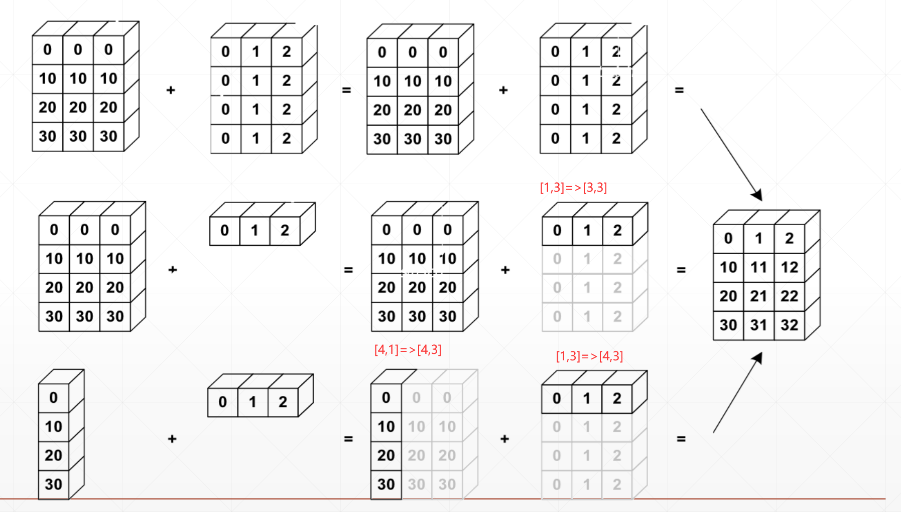   
torch.Size([4, 320, 64, 64])    
groupnorm,silu,dropout(0),conv,  
将一开始的输入相加得到最后  
输出torch.Size([4, 320, 64, 64])   


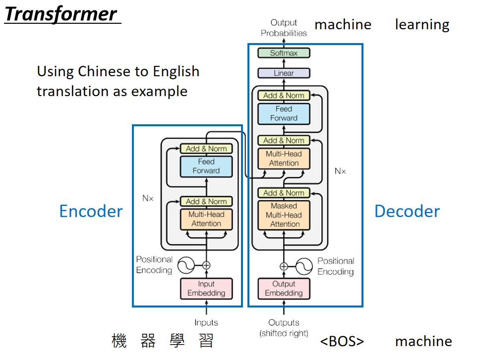  
- Transformer2DModel 本质是做 Transformer的decoder部分  
留一个残差1  
groupnorm,conv(1*1)即proj_in,torch.Size([4, 320, 64, 64])  
reshape成torch.Size([4, 4096, 320])    
basic_transformer_blocks   
  - 留残差1.5
  - norm, 
  - attn  
  residual,残差2  
  不做prepare-attn-mask      
  toq,tok,tov   
  8个头，to_qkv后做head_to_batch_dim：Reshape the tensor from `[batch_size, seq_len, dim]` to `[batch_size, seq_len, heads, dim // heads]` `heads` is
        the number of heads initialized while constructing the `Attention` class.    
  If output_dim=`3`, the tensor is
                reshaped to `[batch_size * heads, seq_len, dim // heads]`.  
  view(batch_size * num_heads, -1, dim_per_head)   
  torch.Size([4, 4096, 320])变torch.Size([32, 4096, 40])   
  计算score:torch.Size([32, 4096, 4096])。`多个头确实score第一维度更多八倍`   
  计算qkv结果，即selfattn结果torch.Size([32, 4096, 40])  
  batch_to_head_dim：torch.Size([4, 4096, 320])  
  linear,drop(0)  
  加残差2  
  
  - attn加残差1.5做下面输入    
  - norm  
  - cross attn  
    
    - attn2 加入文本信息encoder_hidden_states  
    residual,残差3  
    不做prepare-attn-mask   
    toq,torch.Size([4, 4096, 320])变torch.Size([4, 4096, 320])   
    `文本信息encoder_hidden_states做tok,tov， torch.Size([4, 52, 768])变torch.Size([4, 52, 320])`     
    8个头，qkv做head_to_batch_dim：Reshape the tensor from `[batch_size, seq_len, dim]` to `[batch_size, seq_len, heads, dim // heads]` `heads` is
          the number of heads initialized while constructing the `Attention` class.   
    torch.Size([4, 4096, 320])变torch.Size([32, 4096, 40])   
    `kv torch.Size([4, 52, 320])变torch.Size([32, 52, 40])`
    计算score:`torch.Size([32, 4096, 52])`   
    计算qkv结果，即selfattn结果torch.Size([32, 4096, 40])  
    batch_to_head_dim：torch.Size([4, 4096, 320])  
    linear,drop(0)  
    加残差3  

  - cross attn输入加cross attn输出   
feed_forward: norm,geglu(linear(320,1280)),drop(0),linear(1280,320)   
torch.Size([4, 4096, 320])  
feed_forward的输入加输出

- reshape成torch.Size([4, 320, 64, 64])  
linear  
输出加残差1   


完成一组(resnet,transformer)   
完成两组(resnet,transformer) 完成一个下采样LoRACompatibleConv(320, 320, kernel_size=(3, 3), stride=(2, 2), padding=(1, 1))，

返回  
output_states len=3 含有两组结果和下采样结果（用以unet跳连）     
hidden_states含最后结果  

down_block_res_samples = (sample,)  
down_block_res_samples += output_states
就完成一个crossattblock   


完成3个crossattblock   
down_block_res_samples不断增加    
完成一个downblock  
down_block_res_samples不断增加    

downblock不含下采样     
sample, res_samples = downsample_block(hidden_states=sample, temb=emb,   
含两个resnetblock  
第一个resnetblock
- 残差input_tensor
- norm,silu,conv,torch.Size([4, 1280, 8, 8])  
- temb:torch.Size([4, 1280])  
silu,linear  
- hidden_states = hidden_states + temb  
- norm，silu,conv
- output_tensor = (input_tensor + hidden_states)   

出来output_states = output_states + (hidden_states,)是len=2  

downblock结束继续down_block_res_samples += res_samples   

最后左半边unet结束，收集的down_block_res_samples的len=12，每个小层结果     
以及sample  
down_block_res_samples构成
```
（12个：）
conv_in结果:1
crossattblock：3：两组(resnet,transformer) 完成一个下采样
crossattblock：3
crossattblock：3
downblock：2：两个ResnetBlock2D
midblock没有
```

   
过mid_block   
不改变down_block_res_samples        
只改变sample   
```
sample = self.mid_block(
                    sample,
                    emb,
                    encoder_hidden_states=encoder_hidden_states,  

t_emb = self.time_proj(timesteps)
(4,320)
        t_emb = t_emb.to(dtype=sample.dtype)

        emb = self.time_embedding(t_emb, timestep_cond)
      (4,1280)
```
mid和上面down一样配置Transformer2DModel+downblock（两个resnetblock）   
先过一个resnets   
再过一个attn一个resnets    
（resnets处理时间嵌入，attn处理文本嵌入）
```
hidden_states = self.resnets[0](hidden_states, temb, scale=lora_scale)
        for attn, resnet in zip(self.attentions, self.resnets[1:]):

        hidden_states = attn(
                    hidden_states,
                    encoder_hidden_states=encoder_hidden_states,

        hidden_states = torch.utils.checkpoint.checkpoint(
                    create_custom_forward(resnet),
                    hidden_states,
                    temb,
```
#### 4.3 up
   
##### 4.3.1 UpBlock2D（三个resnetblock和一个upsample）  
- 取出down_block_res_samples后三个，每次更新down_block_res_samples   
res_samples = down_block_res_samples[-len-(upsample_block.resnets) :]    
- sample = upsample_block(
                    hidden_states=sample,
                    temb=emb,
                    res_hidden_states_tuple=res_samples,  

resnetblock   
- 取出res_samples最后一个（`encoder后的结果`），每次更新res_samples     
torch.Size([4, 1280, 8, 8])   
- hidden_states（`midblock的结果`）  
torch.Size([4, 1280, 8, 8])    
hidden_states = torch.cat([hidden_states, res_hidden_states], dim=1)   
torch.Size([4, 2560, 8, 8])   
- create_custom_forward(resnet), hidden_states, temb  
- input_tensor留残差2  
- norm,silu,conv(2560,1280)  
- temb:torch.Size([4, 1280]),silu,linear,  
- torch.Size([4, 1280])
- hidden_states:norm,silu,drop0,conv,   
- input_tensor:conv_shortcut
- output_tensor = (input_tensor + hidden_states)

完成三个resnetblock。res_samples用在这些地方，没用在upsamplers   

upsamplers   
- 最近邻插值两倍放大，torch.Size([4, 1280, 16, 16])
- LoRACompatibleConv(1280, 1280, kernel_size=(3, 3), stride=(1, 1), padding=(1, 1))    


三个resnetblock加一个upsamplers结束UpBlock2D   

##### 4.3.2 cross_attention
共三个cross_attention。每个cross_attention含三组（ResnetBlock2D，Transformer2DModel）和一个upsamplers   
单个cross_attention   
- 取出down_block_res_samples后三个进res_samples，每次更新down_block_res_samples  
- for resnet, attn in zip(self.resnets, self.attentions):  
取出res_samples最后一个（`encoder后的结果`），每次更新res_samples。   
`cat`,hidden_states = torch.cat([hidden_states, res_hidden_states], dim=1)  

开始（ResnetBlock2D，Transformer2DModel）   
与encoder操作一样     
attn采用BasicTransformerBlock的decoder    
- norm,proj_in, hidden_states.permute(0, 2, 3, 1).reshape(batch, height * width,  inner_dim)    
- 开始Blocks操作（主要含attn1，attn2，ff）  


注意   
Blocks出来，norm，ff层   
- norm_hidden_states作为输入
- torch.Size([4, 256, 1280])  
- GEGLU(
  (proj): LoRACompatibleLinear(in_features=1280, out_features=10240, bias=True)
)      
```
GEGLU

hidden_states, gate = self.proj(hidden_states, *args).chunk(2, dim=-1)
        return hidden_states * self.gelu(gate)
```  
torch.Size([4, 256, 5120])   
- drop0,LoRACompatibleLinear(in_features=5120, out_features=1280, bias=True)  
- hidden_states = ff_output + hidden_states（没norm的）   
- torch.Size([4, 256, 1280])    

Transformer2DModel未结束  
- hidden_states.reshape(batch, height, width, inner_dim).permute(0, 3, 1, 2).contiguous()  
- proj_out：LoRACompatibleConv(1280, 1280, kernel_size=(1, 1), stride=(1, 1))   
- output = hidden_states + residual   
residual是刚进Transformer2DModel时，还未proj_in的  

三个cross_attention结束出来后  
sample=torch.Size([4, 320, 64, 64])   
norm,silu,conv=Conv2d(320, 4, kernel_size=(3, 3), stride=(1, 1), padding=(1, 1))  

unet结束返回  
torch.Size([4, 4, 64, 64])

#### loss
对unet预测出的噪声和真实噪声计算均方误差损失，反向回传
```
target = noise
model_pred = unet(noisy_latents, timesteps, encoder_hidden_states).sample

loss = F.mse_loss(model_pred.float(), target.float(), reduction="mean")

# Gather the losses across all processes for logging (if we use distributed training).
avg_loss = accelerator.gather(loss.repeat(args.train_batch_size)).mean()          
train_loss += avg_loss.item() / args.gradient_accumulation_steps

# Backpropagate
ccelerator.backward(loss)
内部计算loss = loss / self.gradient_accumulation_steps

```

配置
```
parser.add_argument(
        "--gradient_accumulation_steps",
        type=int,
        default=2,

parser.add_argument(
        "--train_batch_size", type=int, default=4


```
### 冻结权重
accelerate无法同时加载多个模型的梯度进行更新回传，一次一个去训练   

### lora推理
pipe.unet.load_attn_procs(lora_path)   
lora模型大小3Mb,训练显存6Gb      
训练100轮五小时，loss震荡大，难以拟合数据集   
数据集采用pokeman图文对八百条   

lora模型在downblock.midblock,upblocks的crossattnblock中的两个attn中生效，包括toqkv,toout,都是线性映射，其中各自含有up和down的weights,bias     
```
LoRACompatibleLinear(in_features=320, out_features=320, bias=False)
变成以下两个矩阵相乘，降秩
通过rank=4构造
lora = LoRALinearLayer(
                            attn_processor.in_features,
                            attn_processor.out_features,
                            rank,
                            mapped_network_alphas.get(key),
                        )


LoRALinearLayer(
  (down): Linear(in_features=320, out_features=4, bias=False)
  (up): Linear(in_features=4, out_features=320, bias=False)
)
``` 
推理流程  
prompt和negative prompt经过tokenizer和embedding      
clip tokenizer和bert tokenizer有区别吗？？不同分词策略会有多大影响？？？    
```
if self.do_classifier_free_guidance:
            prompt_embeds = torch.cat([negative_prompt_embeds, prompt_embeds])

prompt_embeds
torch.Size([2, 52, 768])
```
根据50步，线性从1000步抽样50次步数，做timesteps    
timestep的作用在于去计算alpha，beta，求上一步的状态时计算出噪声加入强度   

Denoising loop：    
- latent_model_input = torch.cat([latents] * 2) if self.do_classifier_free_guidance else latents   
如果有classifier free guidance，latant一起concat送入,后面再减去    
torch.Size([2, 4, 64, 64])    
- predict the noise residual  
```
预测阶段
                noise_pred = self.unet(
                    latent_model_input,
                    t,
                    encoder_hidden_states=prompt_embeds,
 ```
 - noise_pred torch.Size([2, 4, 64, 64])  
 为什么通过latent以及timestep,经过unet能估计出噪声值？？
 unet训练方法是加入timesteps,   
 ```
 训练阶段
 对unet预测出的噪声和真实噪声计算均方误差损失，反向回传
target = noise
model_pred = unet(noisy_latents, timesteps, encoder_hidden_states).sample

loss = F.mse_loss(model_pred.float(), target.float(), reduction="mean")
 ```  
- unet被训练为可以从noisy_latents空间中预测出噪声的一个模型，同时受到文本embed影响，      
推理阶段，根据初始噪声，推理时间步和文本embed，预测噪声，根据反向计算上一状态公式，结合初始噪声和预测噪声，逐步计算上一个状态    

```
if self.do_classifier_free_guidance:
                    noise_pred_uncond, noise_pred_text = noise_pred.chunk(2)
                    noise_pred = noise_pred_uncond + self.guidance_scale * (noise_pred_text - noise_pred_uncond)
                
guidance_scale大于1执行，7.5

负向提示词和没有提示词（自由发挥）的作用一样   
这里没有提示词，为空，['']一样做embed
guidance_scale越大，正向提示词影响越小   
```    
- compute the previous noisy sample x_t -> x_t-1    
latents = self.scheduler.step(noise_pred, t, latents, **extra_step_kwargs, return_dict=False)[0]    
 
```
model_output: noise_pred
sample: latents


def step(
        self,
        model_output: torch.FloatTensor,noise_pred
        timestep: int,
        sample: torch.FloatTensor,latents
        return_dict: bool = True,


    return self.step_plms(model_output=model_output, timestep=timestep, sample=sample,

prev_sample = self._get_prev_sample(sample, timestep--981, prev_timestep--961, model_output)

 def _get_prev_sample(self, sample, timestep, prev_timestep, model_output):


if self.config.prediction_type == "v_prediction":
            model_output = (alpha_prod_t**0.5) * model_output + (beta_prod_t**0.5) * sample
    这里没有采用，不做处理

这里是prediction_type = "epsilon"
```
pndm  
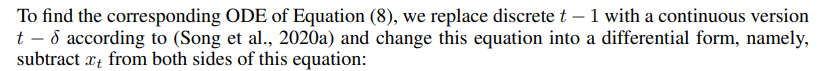  
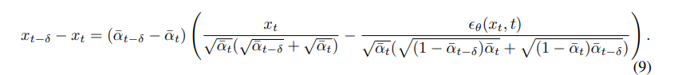   
ddpm   
  
ddim   
   

lora推理关键：   
out = super().forward(hidden_states) + (scale * self.lora_layer(hidden_states))    
在transformer中每一个attn的toqkv以及计算完注意力后的to_out      

mid和上面down一样配置Transformer2DModel+downblock（两个resnetblock）   
先过一个resnets   
再过一个attn一个resnets    
（resnets处理时间嵌入，attn处理文本嵌入）   

可以使用PEFT包rescale   

image = self.vae.decode(latents / self.vae.config.scaling_factor, return_dict=False)[0]    
torch.Size([1, 4, 64, 64])   
Conv2d(4, 4, kernel_size=(1, 1), stride=(1, 1))   
decode (含有mid和up)   
- Conv2d(4, 512, kernel_size=(3, 3), stride=(1, 1), padding=(1, 1))   
```
{
  "_class_name": "AutoencoderKL",
  "_diffusers_version": "0.3.0",
  "_name_or_path": "./finetune_taiyi_v0.20/vae",
  "act_fn": "silu",
  "block_out_channels": [
    128,
    256,
    512,
    512
  ],
  "down_block_types": [输入512
    "DownEncoderBlock2D",输出256
    "DownEncoderBlock2D",输出128
    "DownEncoderBlock2D",输出64
    "DownEncoderBlock2D"输出64，最后一个没有下采样
  ],
  "in_channels": 3,
  "latent_channels": 4,
  "layers_per_block": 2,
  "out_channels": 3,
  "sample_size": 512,
  "scaling_factor": 0.18215,
  "up_block_types": [
    "UpDecoderBlock2D",
    "UpDecoderBlock2D",
    "UpDecoderBlock2D",
    "UpDecoderBlock2D"
  ]
}

```
- 进入mid_block   
unetmidblock   
```
hidden_states = self.resnets[0](hidden_states, temb)
        for attn, resnet in zip(self.attentions, self.resnets[1:]):
            if attn is not None:
                hidden_states = attn(hidden_states, temb=temb)
            hidden_states = resnet(hidden_states, temb)
```
- torch.Size([1, 512, 64, 64])  
- up_blocks含四个UpDecoderBlock2D      
讲一个   
三个ResnetBlock2D，每个两个conv   
通过一个conv上采样   
```
for resnet in self.resnets:
            hidden_states = resnet(hidden_states, temb=temb, scale=scale)

        if self.upsamplers is not None:
            for upsampler in self.upsamplers:
                hidden_states = upsampler(hidden_states)
```
- 完成四个UpDecoderBlock2D结束up_blocks   
torch.Size([1, 128, 512, 512])   
- conv_out，即1*1卷积   
torch.Size([1, 3, 512, 512])。完成decoder   
- run_safety_checker  
torch.Size([1, 3, 512, 512])   
feature_extractor提取torch.Size([1, 3, 224, 224]),resize   
使用clipvisionmodel,torch.Size([1, 3, 224, 224])判断nsfw     
pt_to_numpy   
numpy_to_pil

#### 大模型参数高效微调PEFT
随着Large Language Model(LLM)的横空出世，网络模型对常见问题的解答有了很强的泛化能力。但是如果将LLM应用到特定专业场景，如律师、医生，却仍表现的不尽如人意。即使可以使用few-shot learning或finetuning的技术进行迭代更新，但是模型参数的更新需要昂贵的机器费用。    
学术界大量研究人员开始从事高效Finetuning的工作，称作Effective Parameter Fine-Tuning(PEFT)。本次从方法构造的区别，可以将现有的PEFT方法分为Adapter、LoRA、Prefix Learning和Soft Prompt。   
试验表明，当每个特定任务微调时，只训练模型的一小部分参数，也能得到不错的效果。   

Adapter方法    
Adapter应用在Transformer的结构中，在Multi-headed attention和Feed-forward网路层后紧接Adapter子模块，模型训练的时候冻结Transformer的参数，仅更新Adapter的参数。   


Adapter训练参数之占模型的5%，LoRa、Prefix Tuning和Soft Prompt的训练参数甚至小于0.1%。


#### bert tokenizer   
先采用basic_tokenizer.tokenize根据空格等分词    
具体是去掉一些字符，以及中文判断及相关处理，规范化等，unicode，判断特殊字符，移除重音符号，处理标点符号     
['a', 'red', 'and', 'white', 'ball', 'with', 'an', 'angry', 'look', 'on', 'its', 'face']     

然后WordpieceTokenizer，找出子词  
```
for token in whitespace_tokenize(text):
            chars = list(token)
            if len(chars) > self.max_input_chars_per_word:
                output_tokens.append(self.unk_token)
                continue

            is_bad = False
            start = 0
            sub_tokens = []
            while start < len(chars):
                end = len(chars)
                cur_substr = None
                while start < end:
                    substr = "".join(chars[start:end]) 不在就从后面逐渐减去一个再判断
                    if start > 0:
                        substr = "##" + substr 对于子词后面部分被切割的，都加上##示意
                    if substr in self.vocab: 对每个前面划分的子词判断是否在vocab表里，这个bert有两万多个，不在就从后面逐渐减去一个再判断
                        cur_substr = substr
                        break
                    end -= 1 不在就从后面逐渐减去一个再判断
                if cur_substr is None:
                    is_bad = True
                    break
                sub_tokens.append(cur_substr)
                start = end


['a', 'red', 'and', 'white', 'ball', 'with', 'an', 'an', '##g', '##ry', 'look', 'on', 'its', 'face']
```

#### clip_tokenizer
先做特殊字符处理判断  
再进clip_tokenizer,使用bpe(openai出品，gpt)   
继续做特殊字符处理   

clip text_encoder对token处理:     
- torch.Size([1, 77])   
hidden_states = self.embeddings(input_ids=input_ids, position_ids=position_ids)   
```
CLIPTextEmbeddings(
  (token_embedding): Embedding(49408, 768)
  (position_embedding): Embedding(77, 768)
)
都采用训练好的参数做embed
embeddings = inputs_embeds + position_embeddings
```
- causal_attention_mask   
Creates a causal 4D mask of shape `(batch_size, 1, query_length, key_value_length)`   
三角，下0上负极限  
```
encoder_outputs = self.encoder(
            inputs_embeds=hidden_states,
            attention_mask=attention_mask,
            causal_attention_mask=causal_attention_mask,
```
- clip encoder含12个CLIPEncoderLayer。
```
每一个有self_attn（channel都是768）,CLIPMLP(  
  QuickGELUActivation( Applies GELU approximation that is fast but somewhat inaccurate,return input * torch.sigmoid(1.702 * input))

  和两个升秩linear,  
  即(fc1): Linear(in_features=768, out_features=3072, bias=True)  
      (fc2): Linear(in_features=3072, out_features=768, bias=True)  
      )
- attn有12头，并且使用casual mask对attn_weights即qk的注意力分数，进行mask  

# apply the causal_attention_mask first
# then attention_mask if have
attn_weights = attn_weights.view(bsz, self.num_heads, tgt_len, src_len) + causal_attention_mask
            attn_weights = attn_weights.view(bsz * self.num_heads, tgt_len, src_len)
```
 


### 如何替换text_encoder  


## 视频基于关键字/图片检索片段

## SDXL-turbo or SDXL in 4 steps with Latent Consistency LoRAs(LCM)
### SDXL-turbo （November 28, 2023）
SDXL Turbo模型是在SDXL 1.0模型的基础上设计了全新的蒸馏训练方案（Adversarial Diffusion Distillation，ADD），经过蒸馏训练得到的。SDXL Turbo模型只需要1-4步就能够生成高质量图像，这接近实时的性能  
SDXL Turbo模型本质上依旧是SDXL模型，其网络架构与SDXL一致，可以理解为一种经过蒸馏训练后的SDXL模型。  
不过SDXL Turbo模型并不包含Refiner部分，只包含U-Net（Base）、VAE和CLIP Text Encoder三个模块。在FP16精度下SDXL Turbo模型大小6.94G（FP32：13.88G），其中U-Net（Base）大小5.14G，VAE模型大小167M以及两个CLIP Text Encoder一大一小分别是1.39G和246M。  
#### ADD的蒸馏方案的核心知识
ADD蒸馏方案的整体架构  
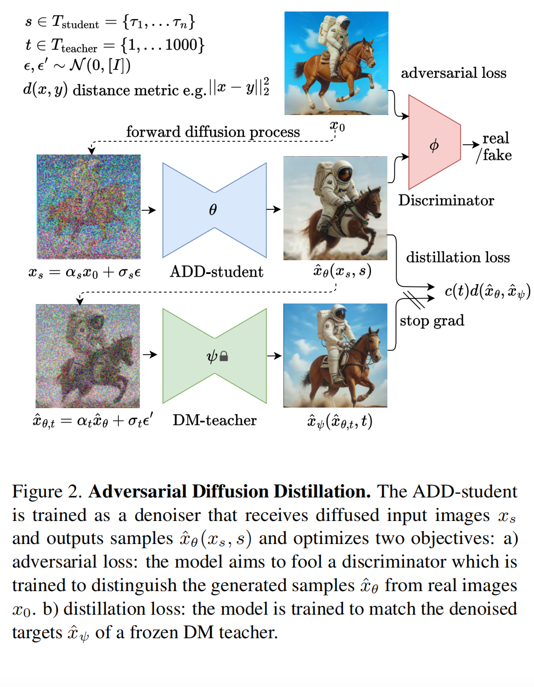  
ADD蒸馏方案的主要流程是这样的：将预训练好的SDXL模型作为学生模型（预训练好的网络能显著提高对抗性损失（adversarial loss）的训练效果），它接收经过forward diffusion process后的噪声图片，并输出去噪后的图片，然后用这个去噪后的图片与原图输入判别器中计算adversarial loss以及与教师模型输出的去噪图片计算distillation loss。ADD蒸馏算法中主要通过优化这两个loss来对SDXL Turbo进行训练：

adversarial loss：借鉴了GAN的思想，设计了`Hinge loss`（支持向量机SVM中常用的损失函数）作为SDXL的adversarial loss，通过一个Discriminator来辨别学生模型（SDXL Turbo）生成的图像和真实的图像，以确保即使在一个或两个采样步数的低步数状态下也能确保高图像保真度，同时避免了其他蒸馏方法中常见的失真或模糊问题。

distillation loss：经典的蒸馏损失函数，让SDXL 1.0模型作为教师模型并冻结参数，让学生模型（SDXL Turbo）的输出和教师模型的输出尽量一致，具体计算方式使用的是`跨周期的L2损失`。最后，ADD蒸馏训练中总的损失函数就是adversarial loss和distillation loss的加权和，如下图所示，其中 $ \lambda $ 权重设置2.5：  
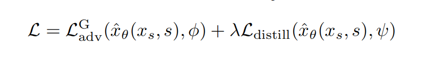   

目前SDXL Turbo最好只用于生成512x512像素的图片  
当steps为1和4时，效果都非常好，并且4steps比1step效果更好，这是可以理解的。不过当steps大于4之后，生成的图像明显开始出现过拟合现象。  
测试了一下SDXL Turbo在不同尺寸（768x768，1024x1024，512x768，768x1024，768x512，1024x768共6中尺寸）下的图像生成质量，可以看到除了1024x1024存在一定的图片特征不完善的情况，其余也具备一定的效果，但是整体上确实不如512x512的效果好。  

SDXL Turbo的一个直接应用，就是与游戏相结合，获得2fps的风格迁移后的游戏画面：  

### SD Turbo
SD Turbo模型是在Stable Diffusion V2.1的基础上，通过蒸馏训练得到的精简版本，其本质上还是一个Stable Diffusion V2.1模型，其网络架构不变。   
比起SDXL Turbo，SD Turbo模型更小、速度更快，但是生成图像的质量和Prompt对齐方面不如前者。


## sd还能怎么改进
• 单阶段生成

目前，团队使用的是一个额外的细化（refinement）模型以两阶段的方式，来生成SDXL的最佳样本。这样就需要将两个庞大的模型加载到内存中，从而降低了可访问性和采样速度。

• 文本合成

规模和更大的文本编码器（OpenCLIP ViT-bigG）有助于改善文本渲染能力，而引入字节级tokenizer或将模型扩展到更大规模，可能会进一步提高文本合成的质量。

• 架构

在探索阶段，团队尝试了基于Transformer的架构，如UViT和DiT，但没有显著改善。然而，团队仍然认为，通过更仔细的超参数研究，最终能够实现更大的基于Transformer的架构的扩展。

• 蒸馏

虽然原始的Stable Diffusion模型已经得到了显著的改进，但代价是增加了推断的成本（包括显存和采样速度）。因此，未来的工作将集中于减少推断所需的计算量，并提高采样速度上。比如通过引导蒸馏、知识蒸馏和渐进蒸馏等方法。

### DiT：纯Transformer  （19 Dec 2022）
Meta的工作DiT：Scalable Diffusion Models with Transformers，它是完全基于transformer架构的扩散模型      
其中最大的模型DiT-XL/2在ImageNet 256x256的类别条件生成上达到了SOTA（FID为2.27）。   
DiT所使用的扩散模型沿用了OpenAI的Improved DDPM，相比原始DDPM一个重要的变化是不再采用固定的方差，而是采用网络来预测方差   
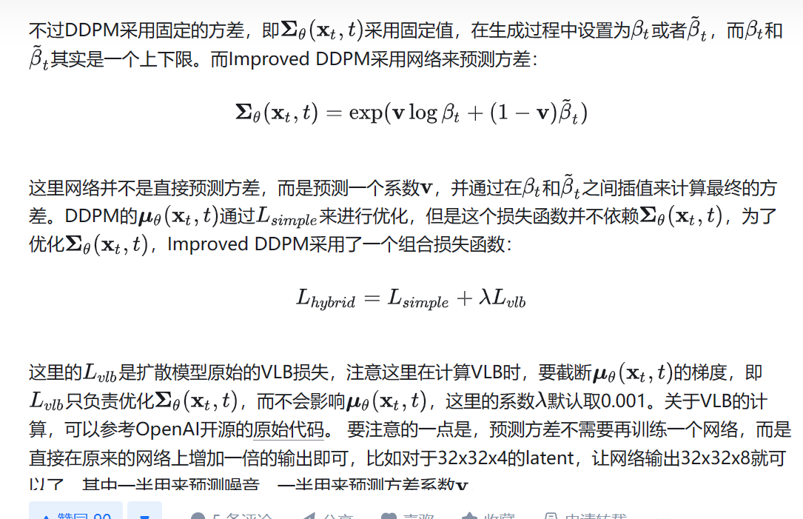   

DiT所设计的transformer架构   
DiT基本沿用了ViT的设计，如下图所示，首先采用一个patch embedding来将输入进行patch化，即得到一系列的tokens。其中patch size属于一个超参数，它直接决定了tokens的数量，这会影响模型的计算量    
DiT的patch size共选择了三种设置：p=2,4,8
。注意token化之后，这里还要加上positional embeddings，这里采用非学习的sin-cosine位置编码。    
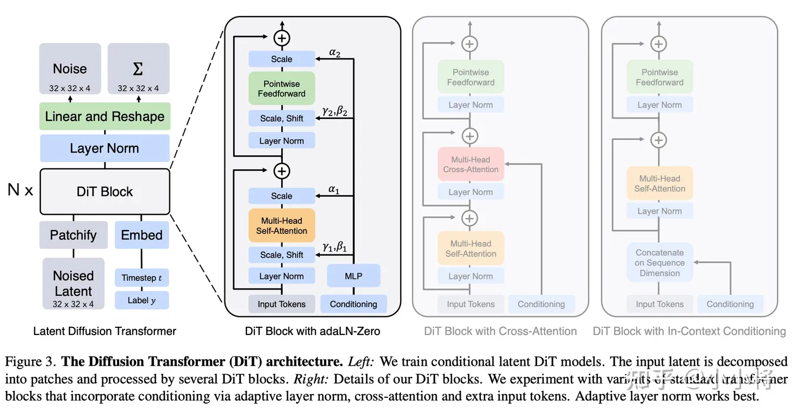   
DiT共设计了四种方案来实现两个额外embeddings的嵌入，具体如下：

In-context conditioning：将两个embeddings看成两个tokens合并在输入的tokens中，这种处理方式有点类似ViT中的cls token，实现起来比较简单，也不基本上不额外引入计算量。  
Cross-attention block：将两个embeddings拼接成一个数量为2的序列，然后在transformer block中插入一个cross attention，条件embeddings作为cross attention的key和value；这种方式也是目前文生图模型所采用的方式，它需要额外引入15%的Gflops。  
Adaptive layer norm (adaLN) block：采用adaLN，这里是将time embedding和class embedding相加，然后来回归scale和shift两个参数，这种方式也基本不增加计算量。  
adaLN-Zero block：采用zero初始化的adaLN，这里是将adaLN的linear层参数初始化为zero，这样网络初始化时transformer block的残差模块就是一个identity函数；另外一点是，这里除了在LN之后回归scale和shift，还在每个残差模块结束之前回归一个scale，如上图所示。   
论文对四种方案进行了对比试验，发现采用adaLN-Zero效果是最好的，所以DiT默认都采用这种方式来嵌入条件embeddings。   
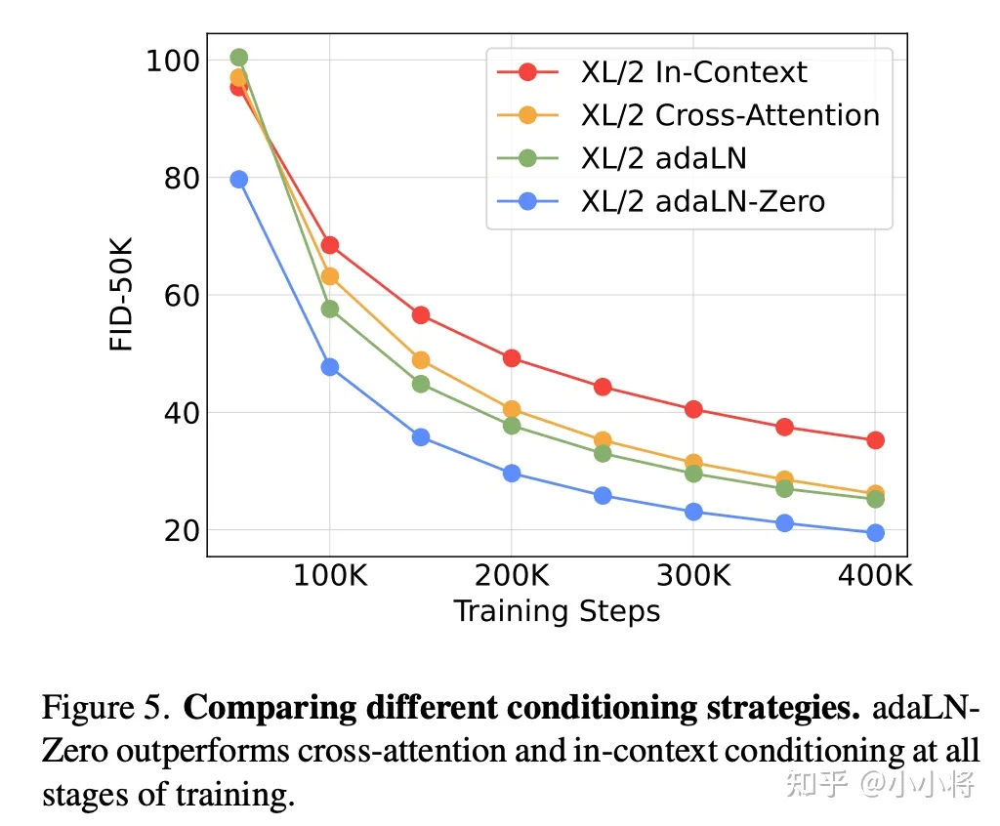

虽然DiT发现adaLN-Zero效果是最好的，但是这种方式只适合这种只有类别信息的简单条件嵌入，因为只需要引入一个class embedding；但是对于文生图来说，其条件往往是序列的text embeddings，采用cross-attention方案可能是更合适的。

虽然DiT看起来不错，但是只在ImageNet上生成做了实验，并没有扩展到大规模的文生图模型。而且在DiT之前，其实也有基于transformer架构的扩散模型研究工作，比如U-ViT，目前也已经有将transformer应用在大规模文生图（基于扩散模型）的工作，比如UniDiffuser，但是其实都没有受到太大的关注。目前主流的文生图模型还是采用基于UNet，UNet本身也混合了卷积和attention，它的优势一方面是高效，另外一方面是不需要位置编码比较容易实现变尺度的生成，这些对具体落地应用都是比较重要的

## UViT
全面研究了ViT上的三种架构设计选择——空间缩减、双通道和多尺度特征——并证明了一种普通的ViT架构可以实现这一目标，而无需手工制作多尺度特征


## svd （November 21, 2023）
结合补帧软件效果拔群，缺点就是不可控，完全盲盒，看AI心情   

### 背景
在当前的视频生成模型研究中，普遍采用从头开始训练或增加时间层对文生图模型进行微调的方法。要么是通过插入额外的时间层从预训练的图像模型进行微调（部分或全部）     
针对2D图像合成训练的潜在扩散模型已经通过插入时间层并在小规模、高质量的视频数据集上微调，转变为生成式视频模型    

### 方法
论文提出了视频模型三步走策略：   
1）文生图预训练、（图像模型预训练）  
在图像模型预训练阶段，使用SD2.1模型在LVD数据集上训练了两个模型  
2）大规模低分辨率视频数据预训练、（视频模型预训练）   
在精选视频预训练数据集阶段，通过人类偏好建立了适当的数据集，并使用不同的标注方法筛选出子集，以此训练模型并得到最佳阈值，并由此获得精选的预训练数据集LVD-F   
3）小规模高质量数据集的高分辨率视频微调。（视频模型微调）    


与一般的时间混合层不同，本文采用Blattmann提出的架构，在每个空间卷积和注意力层之后加入时间卷积层和注意力层   
这一方法构建了一个强大的通用运动表示先验模型，能够轻松微调为图生视频模型或多视角合成模型。文章还提出了帧率微调的概念，并采用EDM架构，将噪声schedule转为更高的噪声值。     

实现了大规模视频模型训练，包括基础模型的构建和五种不同任务的微调   
在大规模训练视频模型方面，论文详细介绍了基础模型的预训练、微调以及应用于不同任务的过程。基础模型的预训练基于SD2.1，强调了噪声schedule在高分辨率生成中的重要性。微调方面，研究团队对不同的任务进行了微调，包括文生视频、图生视频、帧插值预测和多视角3D重建（，以一种前馈方式生成对象的多个一致视图，并胜过专门的新视图合成方法，如Zero123XL和 SyncDreamer）。特别地，高分辨率图生视频模型的微调考虑了条件一致性和过饱和问题，并通过与其他视频模型的对比验证了其优越性。   

### 数据集
提出的筛选方案应用于一个包含大约6亿个样本的大型视频数据集，并训练一个强大的预训练文本到视频基础模型，提供了一个通用的运动表示。我们利用这一点，并在一个较小的、高质量的数据集上微调基础模型，用于高分辨率的下游任务，如文本到视频和图像到视频，在这些任务中，我们从单一的条件图像预测一系列帧。

在公开可访问的视频数据集中，WebVid-10M 数据集尽管带有水印并且大小不理想，但一直是一个常用的选择 。此外，WebVid-10M 通常与图像数据一起使用 ，以进行联合图像-视频训练。然而，这增加了分离图像和视频数据对最终模型的影响的难度。

我们使用三种不同的合成字幕方法为每个剪辑进行注释：首先，我们使用图像字幕生成器 CoCa对每个剪辑的中间帧进行注释，并使用 "V-BLIP" 获得视频字幕。最后，我们通过对前两个字幕进行基于LLM的总结来生成剪辑的第三个描述。   
Large Video Dataset (LVD)，包括5.8亿个带注释的视频剪辑对，总计212年的内容。   

所得到的数据集包含可能会降低我们最终视频模型性能的示例，例如运动较少的剪辑、过多的文本存在或总体审美价值较低的剪辑。因此，我们额外使用密集的光流为数据集进行注释，我们以2 FPS计算光流，并通过移除平均光流幅度低于一定阈值的任何视频来过滤掉静态场景。事实上，当考虑LVD的运动分布（见图2，右图）时，通过光流分数，我们确定了其中一个接近静态的剪辑子集。此外，我们还应用光学字符识别来清除包含大量书面文本的剪辑。  
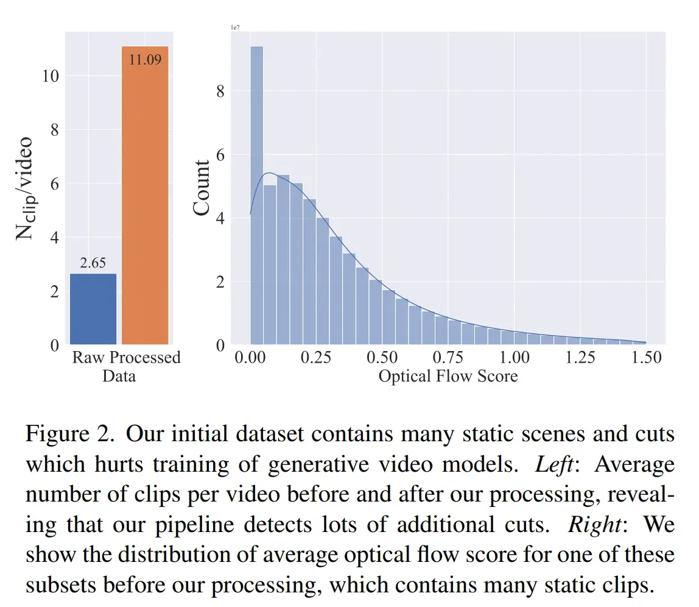  
最后，我们使用CLIP嵌入为每个剪辑的第一帧、中间帧和最后一帧进行注释，从中计算审美得分 以及文本-图像相似度。   

为了避免切换和淡入淡出影响到合成视频，我们以级联方式在三个不同的FPS级别上应用了一个切换检测流程。图2左侧提供了切换检测的必要性证据：在应用我们的切换检测流程后，我们获得了显著更多的剪辑（约为4倍），表明未经处理的数据集中的许多视频剪辑包含了超出元数据获得的切换。     

### 训练
#### 阶段 I：图像预训练 
Stable Diffusion 2.1，以为其提供强大的视觉表示     
为了分析图像预训练的效果，我们在LVD的一个1000万子集上训练并比较了两个相同的视频模型，详细信息请参见附录D；其中一个使用了预训练的空间权重，另一个没有使用。我们使用人类偏好研究进行了这些模型的比较，如图3a所示，结果清楚地显示了图像预训练模型在质量和提示跟随方面都更受欢迎    

#### 阶段 II：筛选视频预训练数据集 
由于在视频领域没有同样强大的现成表示方法可用来过滤不想要的示例，因此我们依赖人类偏好作为信号来创建适当的预训练数据集    
具体来说，我们使用下面描述的不同方法筛选LVD的子集，然后考虑在这些数据集上训练的潜在视频扩散模型的基于人类偏好的排名。（而不是人眼去筛选视频数据）    

更具体地说，对于第3.1节引入的每种类型的注释（即CLIP分数、审美分数、OCR检测率、合成字幕、光流分数），我们从未经筛选的、随机抽样的LVD的大小为9.8M的子集LVD-10M出发，系统地去除底部的12.5%、25%和50%的示例     

将这种筛选方法应用到LVD会得到一个最终的预训练数据集，包括152M个训练示例，我们将其称为LVD-F    

#### 阶段 III：高质量微调 
使用了一个由高视觉保真度的250K个预标注视频剪辑组成的小微调数据集。 


#### 预训练基础模型 
作为第一步，我们通过在尺寸为256×384的图像上使用Karras等人提出的网络预调整方法，将我们图像模型的固定离散噪声计划微调为连续噪声。

在插入时间层后，我们在分辨率为256×384的14帧上对模型进行训练。我们使用标准的EDM噪声计划进行150k次迭代，批量大小为1536。

接下来，我们微调模型，以生成14个分辨率为320×576的帧，进行100k次迭代，批量大小为768。

#### 高分辨率文本到视频模型 
约1百万个样本。数据集中的样本通常包含大量的物体运动，稳定的摄像机运动以及良好对齐的字幕，并且整体视觉质量很高。我们以576×1024的分辨率对基础模型进行了50,000次迭代的微调（再次将噪声计划转向更多噪声），批量大小为768。 

#### 高分辨率图像到视频模型 
除了文本到视频，我们还对我们的基础模型进行了图像到视频生成的微调，其中视频模型接收一幅`静态输入图像作为条件`。因此，我们将馈送到基础模型的文本嵌入替换为条件的CLIP图像嵌入。此外，我们将条件帧的噪声增强版本按通道连接到UNet的输入中。我们不使用任何遮罩技术，只是将帧沿时间轴进行简单复制。我们微调了两个模型，一个预测14帧，另一个预测25帧      
标准的基于分类器的引导可能会导致图像伪影：引导过少可能导致与**条件帧**不一致，而引导过多可能导致过度饱和。   
与使用恒定引导尺度不同，沿着帧轴线性增加引导尺度是有帮助的。???   

#### 相机运动 LoRA 
为了在图像到视频生成中促进受控的相机运动，我们在模型的时间注意块中训练了各种相机运动 LoRA 参数    
我们在一个带有丰富相机运动元数据的小数据集上训练这些额外的参数。特别地，我们使用了三个数据子集，其中相机运动被分类为“水平移动”、“缩放”和“静止”。在图7中，我们展示了相同条件帧的三个模型的样本；    
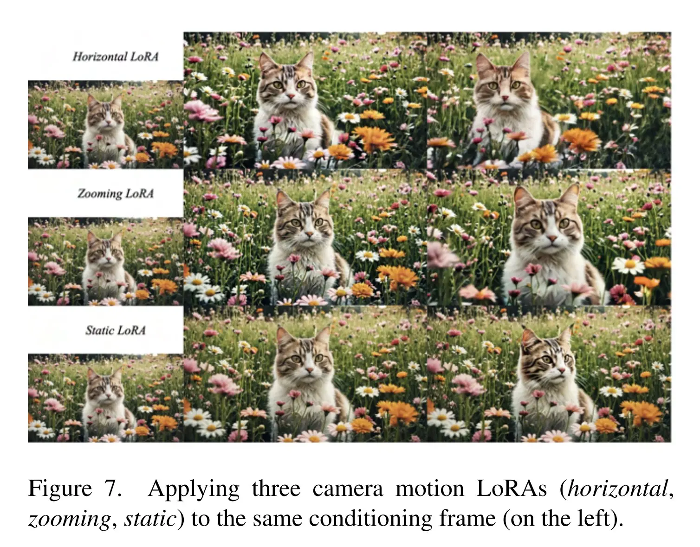   


#### 帧插值 
为了获得高帧率的平滑视频，我们将我们的高分辨率文本到视频模型微调为帧插值模型。我们遵循Blattmann等人的方法，通过掩码将左帧和右帧连接到UNet的输入。该模型学会了在两个条件帧内预测三帧，有效地将帧率提高了四倍。令人惊讶的是，我们发现非常少量的迭代（约10k）就足以获得一个良好的模型。   

#### 多视角合成 
为了同时获得一个对象的多个新视角，我们在多视角数据集上对我们的图像到视频SVD模型进行微调    
数据集。我们在两个数据集上对我们的SVD模型进行微调，其中SVD模型接收单个图像并输出多视角图像序列    
(i) Objaverse 的一个子集，包含来自原始数据集的150K个经过筛选和CC许可的合成3D对象。对于每个对象，我们使用随机采样的HDRI(High-Dynamic Range (HDR) image 高动态范围成像)环境映射和仰角在[-5◦，30◦]之间渲染了21帧的360◦轨道视频。我们在Google Scanned Objects (GSO)数据集中随机选择了50个对象，对生成的模型进行评估。    
(ii) MVImgNet，包含一般家庭物品的随意捕获多视角视频。我们将视频分成约200K个训练视频和900个测试视频。我们将以纵向模式捕获的帧旋转到横向模式。    

指标。我们使用标准的峰值信噪比（PSNR）、LPIPS 和CLIP 之间的相应对地面实况和生成帧的相似性分数（CLIP-S）来评估50个GSO测试对象的性能。

训练。我们使用8个80GB的A100 GPU，在总批处理大小为16的情况下，对所有模型进行了12k步（约16小时）的训练，学习率为1e-5。     

我们生成的帧具有多视角一致性和逼真性   
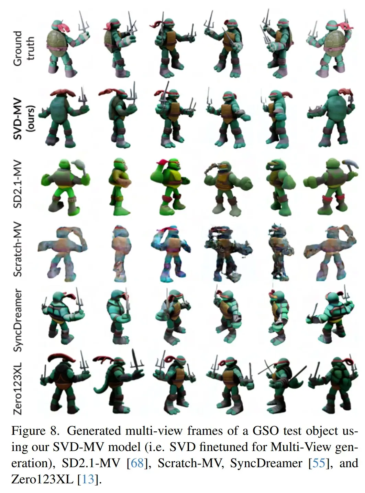  

稳定视频扩散提供了一个强大的视频表示，我们可以通过微调视频模型来进行最先进的图像到视频合成以及其他高度相关的应用，如用于相机控制的LoRAs。最后，我们提供了有关视频扩散模型的多视角微调的先驱性研究，并展示了SVD构成了一个强大的3D先验，在多视角合成方面取得了最新的成果，同时仅使用了先前方法计算资源的一小部分。    


## Stable Animation SDK （5月12日 2023）
用户可以通过提供提示词(没有图像)、提供源图像或源视频等3种不同的方式创建动画。


通过使用Stability AI的动画接口，艺术家可以使用所有的Stable Diffusion模型（包括Stable Diffusion 2.0和最新模型XL）来生成动画。  
我们提供了三种创建动画的方法:

1. 文本到动画：用户输入文本提示(与Stable Diffusion一样)并调整各种参数以产生动画。

2. 初始图像输入+文本输入：用户提供一个初始图像，作为动画的起点。文本提示词与图像一起使用，以产生最终的输出动画。

3.输入视频+文本输入：用户提供一个初始视频作为动画的基础。通过调整各种参数，将得到一段由文本提示词指导的输出动画。


## 算法上线方式  
Gradio、Streamlit 和 Dash
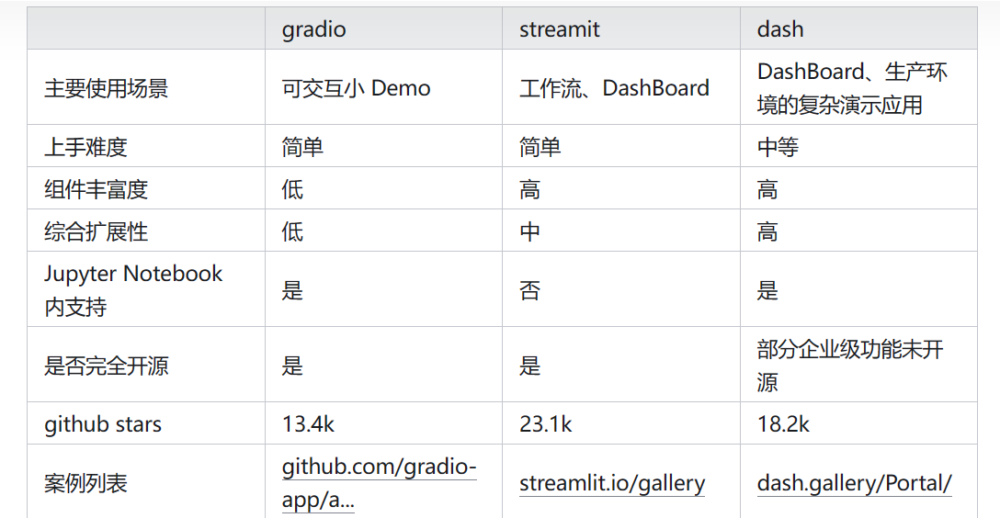


## 缺点
运行的代码没有明确输入输出导向，阶段目标和总体目标，要解决什么事情，输出的评价指标的具体记录没有。    
bert怎么装上去的其实不明白    
美学评分数据集有多少张，7分以上占比多少？不如直接拿2.1来接着训练，效果还好。没有用最新的模型去跑。   
不同tokenizer怎么选型   


## 结尾
讲大致原理很多人都会，但是具体实现和具体细节原理和推导证明和修改扩展应用上线，没几个人会