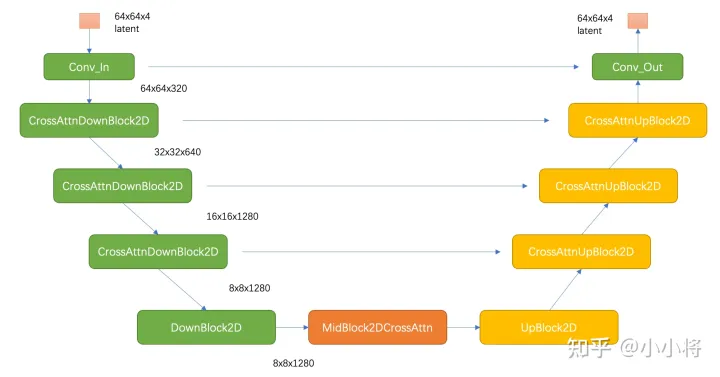

# Stable Diffusion
## 发展脉络  
  2022 SD V1.5版本  

  图像生成领域最常见生成模型有GAN和VAE，2020年，DDPM（Denoising Diffusion Probabilistic Model）被提出，被称为扩散模型（Diffusion Model），同样可用于图像生成。近年扩散模型大热，OpenAI、Google Brain等相继基于扩散模型提出的以文生图，图像生成视频生成等模型。  

  VAE（变分自编码器）是由自编码器发展而来，能够实现图像压缩、图像降噪和语义分割等任务。但VAE与AE存在本质上的区别，它是一种生成式模型。其与GAN模型具有一致的目标：从隐变量生成目标对象；  
    

  两者在如何度量生成对象与目标对象的分布相似性，GAN的实现方式更加激进，将这个度量任务也交由网络来完成，而VAE则假设了一个先验分布来构造度量方式。 

  GAN（生成对抗网络）是一种生成模型，其中包括一个生成器和一个判别器，二者相互对抗学习。生成器试图生成逼真的样本，而判别器试图区分生成的样本和真实的样本。
"更加激进"可能指的是GAN通过对抗学习方式直接优化生成样本的质量，而不显式地定义生成样本与目标对象分布的度量方式。  将度量任务交由网络来完成：
GAN的实现方式中，度量生成对象与目标对象分布相似性的任务是通过判别器网络完成的。判别器网络学习将生成对象与目标对象区分开，从而间接地度量它们的相似性。  
VAE（变分自编码器）也是一种生成模型，但其实现方式不同。它引入了一个潜在变量，通过编码器和解码器的结构，学习数据的分布，并假设了一个先验分布，通常是高斯分布。
在VAE中，通过最大化似然概率，模型试图使生成的样本在潜在空间中更加连续和平滑，以达到更好的生成效果。

## 训练数据
LAION-5B
## SD模型原理
常规的扩散模型是基于pixel的生成模型，而Latent Diffusion是基于latent的生成模型  
它先采用一个autoencoder将图像压缩到latent空间，然后用扩散模型来生成图像的latents，最后送入autoencoder的decoder模块就可以得到生成的图像。  
  
基于pixel的方法往往限于算力只生成64x64大小的图像，比如OpenAI的DALL-E2和谷歌的Imagen，然后再通过超分辨模型将图像分辨率提升至256x256和1024x1024；而基于latent的SD是在latent空间操作的，它可以直接生成256x256和512x512甚至更高分辨率的图像。

## SD模型的主体结构
autoencoder：encoder将图像压缩到latent空间，而decoder将latent解码为图像；  
CLIP text encoder：提取输入text的text embeddings，通过cross attention方式送入扩散模型的UNet中作为condition； ？？？   
UNet：扩散模型的主体，用来实现文本引导下的latent生成。  
  

### autoencoder
autoencoder是一个基于encoder-decoder架构的图像压缩模型，对于一个大小为$H \cdot W \cdot 3$
的输入图像，encoder模块将其编码为一个大小为$h \cdot w \cdot 3$
的latent  
f=H/h为下采样率（downsampling factor）    
除了采用L1重建损失外，还增加了感知损失（perceptual loss，即LPIPS，具体见论文The Unreasonable Effectiveness of Deep Features as a Perceptual Metric）以及基于patch的对抗训练 ??  
同时为了防止得到的latent的标准差过大，采用了两种正则化方法：第一种是KL-reg，类似VAE增加一个latent和标准正态分布的KL loss，不过这里为了保证重建效果，采用比较小的权重（～10e-6）；第二种是VQ-reg，引入一个VQ （vector quantization）layer，  

这种有损压缩肯定是对SD的生成图像质量是有一定影响的，不过好在SD模型基本上是在512x512以上分辨率下使用的。为了改善这种畸变，stabilityai在发布SD 2.0时同时发布了两个在LAION子数据集上精调的autoencoder，注意这里只精调autoencoder的decoder部分，SD的UNet在训练过程只需要encoder部分，所以这样精调后的autoencoder可以直接用在先前训练好的UNet上（这种技巧还是比较通用的，比如谷歌的Parti也是在训练好后自回归生成模型后，扩大并精调ViT-VQGAN的decoder模块来提升生成质量）  

### CLIP text encoder 
采用目前OpenAI所开源的最大CLIP模型：clip-vit-large-patch14，这个CLIP的text encoder是一个transformer模型（只有encoder模块）：层数为12，特征维度为768  
对于输入text，送入CLIP text encoder后得到最后的hidden states（即最后一个transformer block得到的特征），其特征维度大小为77x768（77是token的数量），这个细粒度的text embeddings将以cross attention的方式送入UNet中。  
训练SD的过程中，**CLIP text encoder模型是冻结的**。比如谷歌的Imagen采用纯文本模型T5 encoder来提出文本特征，而SD则采用CLIP text encoder，预训练好的模型往往已经在大规模数据集上进行了训练，它们要比直接采用一个从零训练好的模型要好。  

### UNet
其主要结构如下图所示（这里以输入的latent为64x64x4维度为例），其中encoder部分包括3个CrossAttnDownBlock2D模块和1个DownBlock2D模块，而decoder部分包括1个UpBlock2D模块和3个CrossAttnUpBlock2D模块，中间还有一个UNetMidBlock2DCrossAttn模块。encoder和decoder两个部分是完全对应的，中间存在skip connection。注意3个CrossAttnDownBlock2D模块最后均有一个2x的downsample操作，而DownBlock2D模块是不包含下采样的。  
   

其中CrossAttnDownBlock2D模块的主要结构如下图所示，text condition将通过CrossAttention模块嵌入进来，此时Attention的query是UNet的中间特征，而key和value则是text embeddings。(与transformer解码器第二个多头注意力层一致)  
 CrossAttnUpBlock2D模块和CrossAttnDownBlock2D模块是一致的，但是就是总层数为3。  
  

SD和DDPM一样采用预测noise的方法来训练UNet，其训练损失也和DDPM一样：  
  
这里的c 为text embeddings，此时的模型是一个条件扩散模型。  

在训练条件扩散模型时，往往会采用Classifier-Free Guidance（这里简称为CFG），所谓的CFG简单来说就是在训练条件扩散模型的同时也训练一个无条件的扩散模型，同时在采样阶段将条件控制下预测的噪音和无条件下的预测噪音组合在一起来确定最终的噪音，具体的计算公式如下所示：  
  
这里的w
为guidance scale，当w
越大时，condition起的作用越大，即生成的图像其更和输入文本一致。CFG的具体实现非常简单，在训练过程中，我们只需要以一定的概率（比如10%）随机drop掉text即可，

## 训练细节
SD在laion2B-en数据集上训练的，它是laion-5b数据集的一个子集，更具体的说它是laion-5b中的英文（文本为英文）数据集。laion-5b数据集是从网页数据Common Crawl中筛选出来的图像-文本对数据集，它包含5.85B的图像-文本对，其中文本为英文的数据量为2.32B，这就是laion2B-en数据集。  
SD的训练是多阶段的（先在256x256尺寸上预训练，然后在512x512尺寸上精调），不同的阶段产生了不同的版本：

- SD v1.1：在laion2B-en数据集上以256x256大小训练237,000步，上面我们已经说了，laion2B-en数据集中256以上的样本量共1324M；然后在laion5B的高分辨率数据集以512x512尺寸训练194,000步，这里的高分辨率数据集是图像尺寸在1024x1024以上，共170M样本。
- SD v1.2：以SD v1.1为初始权重，在improved_aesthetics_5plus数据集上以512x512尺寸训练515,000步数，这个improved_aesthetics_5plus数据集上laion2B-en数据集中美学评分在5分以上的子集（共约600M样本），注意这里过滤了含有水印的图片（pwatermark>0.5)以及图片尺寸在512x512以下的样本。
- SD v1.3：以SD v1.2为初始权重，在improved_aesthetics_5plus数据集上继续以512x512尺寸训练195,000步数，不过这里采用了CFG（以10%的概率随机drop掉text）。
- SD v1.4：以SD v1.2为初始权重，在improved_aesthetics_5plus数据集上采用CFG以512x512尺寸训练225,000步数。
- SD v1.5：以SD v1.2为初始权重，在improved_aesthetics_5plus数据集上采用CFG以512x512尺寸训练595,000步数。
- Version 2.0 New stable diffusion model (Stable Diffusion 2.0-v) at 768x768 resolution. Same number of parameters in the U-Net as 1.5, but uses OpenCLIP-ViT/H as the text encoder and is trained from scratch. SD 2.0-v is a so-called v-prediction model.

  - The above model is finetuned from SD 2.0-base, which was trained as a standard noise-prediction model on 512x512 images and is also made available.
- Version 2.1 New stable diffusion model (Stable Diffusion 2.1-v, Hugging Face) at 768x768 resolution and (Stable Diffusion 2.1-base, HuggingFace) at 512x512 resolution, both based on the same number of parameters and architecture as 2.0 and fine-tuned on 2.0, on a less restrictive NSFW filtering of the LAION-5B dataset.
- Stable UnCLIP 2.1 New stable diffusion finetune (Stable unCLIP 2.1, Hugging Face) at 768x768 resolution, based on SD2.1-768. This model allows for image variations and mixing operations as described in Hierarchical Text-Conditional Image Generation with CLIP Latents, and, thanks to its modularity, can be combined with other models such as KARLO. Comes in two variants: Stable unCLIP-L and Stable unCLIP-H, which are conditioned on CLIP ViT-L and ViT-H image embeddings, respectively.  

可以看到SD v1.3、SD v1.4和SD v1.5其实是以SD v1.2为起点在improved_aesthetics_5plus数据集上采用CFG训练过程中的不同checkpoints，目前最常用的版本是SD v1.4和SD v1.5。

## 模型评测
对于文生图模型，目前常采用的定量指标是FID（Fréchet inception distance）和CLIP score，其中FID可以衡量生成图像的逼真度（image fidelity），而CLIP score评测的是生成的图像与输入文本的一致性，其中FID越低越好，而CLIP score是越大越好。??如何计算  
当gudiance scale=3时，FID最低；而当gudiance scale越大时，CLIP score越大，但是FID同时也变大。在实际应用时，往往会采用较大的gudiance scale，比如SD模型默认采用7.5，此时生成的图像和文本有较好的一致性。  
  
## SD的主要应用
包括文生图，图生图以及图像inpainting。其中文生图是SD的基础功能：根据输入文本生成相应的图像，而图生图和图像inpainting是在文生图的基础上延伸出来的两个功能。
### 文生图
SD最后是在512x512尺度上训练的，所以生成512x512尺寸效果是最好的，但是实际上SD可以生成任意尺寸的图片：一方面autoencoder支持任意尺寸的图片的编码和解码，另外一方面扩散模型UNet也是支持任意尺寸的latents生成的（UNet是卷积+attention的混合结构）  
  
然而，生成512x512以外的图片会存在一些问题，比如生成低分辨率图像时，图像的质量大幅度下降，下图为同样的文本在256x256尺寸下的生成效果：  
  
如果是生成512x512以上分辨率的图像，图像质量虽然没问题，但是可能会出现重复物体以及物体被拉长的情况，下图为分别为768x512和512x768尺寸下的生成效果，可以看到部分图像存在一定的问题：  
  
  
解决这个问题的办法就相对比较简单，就是采用多尺度策略训练，比如NovelAI提出采用Aspect Ratio Bucketing策略来在二次元数据集上精调模型，这样得到的模型就很大程度上避免SD的这个问题，目前大部分开源的基于SD的精调模型往往都采用类似的多尺度策略来精调。比如我们采用开源的dreamlike-diffusion-1.0模型（基于SD v1.5精调的），其生成的图像效果在变尺寸上就好很多：  

另外一个参数是num_inference_steps，它是指推理过程中的去噪步数或者采样步数。SD在训练过程采用的是步数为1000的noise scheduler  
但是在推理时往往采用速度更快的scheduler：只需要少量的采样步数就能生成不错的图像，比如SD默认采用PNDM scheduler，它只需要采样50步就可以出图。当然我们也可以换用其它类型的scheduler，比如DDIM scheduler和DPM-Solver scheduler。  

guidance_scale为1，3，5，7，9和11下生成的图像对比，可以看到当guidance_scale较低时生成的图像效果是比较差的，当guidance_scale在7～9时，生成的图像效果是可以的，当采用更大的guidance_scale比如11，图像的色彩过饱和而看起来不自然，所以SD默认采用的guidance_scale为7.5。  
  
过大的guidance_scale之所以出现问题，主要是由于训练和测试的不一致，过大的guidance_scale会导致生成的样本超出范围。谷歌的Imagen论文提出一种dynamic thresholding策略来解决这个问题  

另外一个比较容易忽略的参数是negative_prompt，这个参数和CFG有关，前面说过，SD采用了CFG来提升生成图像的质量。  
这里的negative_prompt便是无条件扩散模型的text输入，前面说过训练过程中我们将text置为空字符串来实现无条件扩散模型，所以这里：negative_prompt = None = ""。  
  
在原有的prompt基础加上了一些描述词，有时候我们称之为“魔咒”，不同的模型可能会有不同的魔咒。其生成的效果就大大提升

