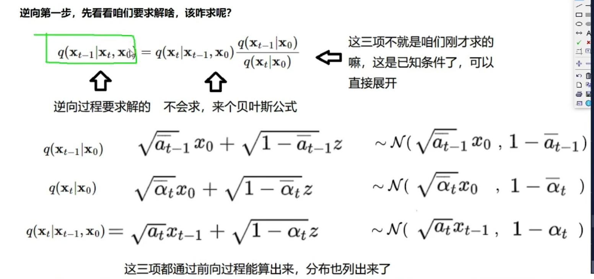
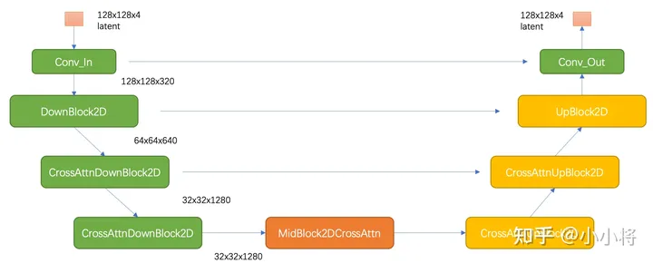

# Stable Diffusion
## 发展脉络  
  2022 SD V1.5版本  

  图像生成领域最常见生成模型有GAN和VAE，2020年，DDPM（Denoising Diffusion Probabilistic Model）被提出，被称为扩散模型（Diffusion Model），同样可用于图像生成。近年扩散模型大热，OpenAI、Google Brain等相继基于扩散模型提出的以文生图，图像生成视频生成等模型。  

  VAE（变分自编码器）是由自编码器发展而来，能够实现图像压缩、图像降噪和语义分割等任务。但VAE与AE存在本质上的区别，它是一种生成式模型。其与GAN模型具有一致的目标：从隐变量生成目标对象；  
    

  两者在如何度量生成对象与目标对象的分布相似性，GAN的实现方式更加激进，将这个度量任务也交由网络来完成，而VAE则假设了一个先验分布来构造度量方式。 

  GAN（生成对抗网络）是一种生成模型，其中包括一个生成器和一个判别器，二者相互对抗学习。生成器试图生成逼真的样本，而判别器试图区分生成的样本和真实的样本。
"更加激进"可能指的是GAN通过对抗学习方式直接优化生成样本的质量，而不显式地定义生成样本与目标对象分布的度量方式。  将度量任务交由网络来完成：
GAN的实现方式中，度量生成对象与目标对象分布相似性的任务是通过判别器网络完成的。判别器网络学习将生成对象与目标对象区分开，从而间接地度量它们的相似性。  
VAE（变分自编码器）也是一种生成模型，但其实现方式不同。它引入了一个潜在变量，通过编码器和解码器的结构，学习数据的分布，并假设了一个先验分布，通常是高斯分布。
在VAE中，通过最大化似然概率，模型试图使生成的样本在潜在空间中更加连续和平滑，以达到更好的生成效果。


## 训练数据
LAION-5B
## SD模型原理 
diffusion过程  
  
前向过程：可以由x_0通过公式求出最后的x_t  
反向过程：贝叶斯公式求出P(x_t-1|x_t)  
  

常规的扩散模型是基于pixel的生成模型，而Latent Diffusion是基于latent的生成模型  
它先采用一个autoencoder将图像压缩到latent空间，然后用扩散模型来生成图像的latents，最后送入autoencoder的decoder模块就可以得到生成的图像。  
    
基于pixel的方法往往限于算力只生成64x64大小的图像，比如OpenAI的DALL-E2和谷歌的Imagen，然后再通过超分辨模型将图像分辨率提升至256x256和1024x1024；而基于latent的SD是在latent空间操作的，它可以直接生成256x256和512x512甚至更高分辨率的图像。

## SD模型的主体结构
autoencoder：encoder将图像压缩到latent空间，而decoder将latent解码为图像；  
CLIP text encoder：提取输入text的text embeddings，通过cross attention方式送入扩散模型的UNet中作为condition； ？？？   
UNet：扩散模型的主体，用来实现文本引导下的latent生成。  
  

### autoencoder
autoencoder是一个基于encoder-decoder架构的图像压缩模型，对于一个大小为$H \cdot W \cdot 3$
的输入图像，encoder模块将其编码为一个大小为$h \cdot w \cdot 3$
的latent  
f=H/h为下采样率（downsampling factor）    
除了采用L1重建损失外，还增加了感知损失（perceptual loss，即LPIPS，具体见论文The Unreasonable Effectiveness of Deep Features as a Perceptual Metric）以及基于patch的对抗训练 ??  
同时为了防止得到的latent的标准差过大，采用了两种正则化方法：第一种是KL-reg，类似VAE增加一个latent和标准正态分布的KL loss，不过这里为了保证重建效果，采用比较小的权重（～10e-6）；第二种是VQ-reg，引入一个VQ （vector quantization）layer，  

这种有损压缩肯定是对SD的生成图像质量是有一定影响的，不过好在SD模型基本上是在512x512以上分辨率下使用的。为了改善这种畸变，stabilityai在发布SD 2.0时同时发布了两个在LAION子数据集上精调的autoencoder，注意这里只精调autoencoder的decoder部分，SD的UNet在训练过程只需要encoder部分，所以这样精调后的autoencoder可以直接用在先前训练好的UNet上（这种技巧还是比较通用的，比如谷歌的Parti也是在训练好后自回归生成模型后，扩大并精调ViT-VQGAN的decoder模块来提升生成质量）  


### CLIP text encoder 
采用目前OpenAI所开源的最大CLIP模型：clip-vit-large-patch14，这个CLIP的text encoder是一个transformer模型（只有encoder模块）：层数为12，特征维度为768  
对于输入text，送入CLIP text encoder后得到最后的hidden states（即最后一个transformer block得到的特征），其特征维度大小为77x768（77是token的数量），这个细粒度的text embeddings将以cross attention的方式送入UNet中。  
训练SD的过程中，**CLIP text encoder模型是冻结的**。比如谷歌的Imagen采用纯文本模型T5 encoder来提出文本特征，而SD则采用CLIP text encoder，预训练好的模型往往已经在大规模数据集上进行了训练，它们要比直接采用一个从零训练好的模型要好。  

### UNet
其主要结构如下图所示（这里以输入的latent为64x64x4维度为例），其中encoder部分包括3个CrossAttnDownBlock2D模块和1个DownBlock2D模块，而decoder部分包括1个UpBlock2D模块和3个CrossAttnUpBlock2D模块，中间还有一个UNetMidBlock2DCrossAttn模块。encoder和decoder两个部分是完全对应的，中间存在skip connection。注意3个CrossAttnDownBlock2D模块最后均有一个2x的downsample操作，而DownBlock2D模块是不包含下采样的。  
   

其中CrossAttnDownBlock2D模块的主要结构如下图所示，text condition将通过CrossAttention模块嵌入进来，此时Attention的query是UNet的中间特征，而key和value则是text embeddings。(与transformer解码器第二个多头注意力层一致)  
 CrossAttnUpBlock2D模块和CrossAttnDownBlock2D模块是一致的，但是就是总层数为3。  
  

SD和DDPM一样采用预测noise的方法来训练UNet，其训练损失也和DDPM一样：  
  
这里的c 为text embeddings，此时的模型是一个条件扩散模型。  

在训练条件扩散模型时，往往会采用Classifier-Free Guidance（这里简称为CFG），所谓的CFG简单来说就是在训练条件扩散模型的同时也训练一个无条件的扩散模型，同时在采样阶段将条件控制下预测的噪音和无条件下的预测噪音组合在一起来确定最终的噪音，具体的计算公式如下所示：  
  
这里的w
为guidance scale，当w
越大时，condition起的作用越大，即生成的图像其更和输入文本一致。CFG的具体实现非常简单，在训练过程中，我们只需要以一定的概率（比如10%）随机drop掉text即可，

## 训练细节
SD在laion2B-en数据集上训练的，它是laion-5b数据集的一个子集，更具体的说它是laion-5b中的英文（文本为英文）数据集。laion-5b数据集是从网页数据Common Crawl中筛选出来的图像-文本对数据集，它包含5.85B的图像-文本对，其中文本为英文的数据量为2.32B，这就是laion2B-en数据集。  
SD的训练是多阶段的（先在256x256尺寸上预训练，然后在512x512尺寸上精调），不同的阶段产生了不同的版本：

- SD v1.1：在laion2B-en数据集上以256x256大小训练237,000步，上面我们已经说了，laion2B-en数据集中256以上的样本量共1324M；然后在laion5B的高分辨率数据集以512x512尺寸训练194,000步，这里的高分辨率数据集是图像尺寸在1024x1024以上，共170M样本。
- SD v1.2：以SD v1.1为初始权重，在improved_aesthetics_5plus数据集上以512x512尺寸训练515,000步数，这个improved_aesthetics_5plus数据集上laion2B-en数据集中美学评分在5分以上的子集（共约600M样本），注意这里过滤了含有水印的图片（pwatermark>0.5)以及图片尺寸在512x512以下的样本。
- SD v1.3：以SD v1.2为初始权重，在improved_aesthetics_5plus数据集上继续以512x512尺寸训练195,000步数，不过这里采用了CFG（以10%的概率随机drop掉text）。
- SD v1.4：以SD v1.2为初始权重，在improved_aesthetics_5plus数据集上采用CFG以512x512尺寸训练225,000步数。
- SD v1.5：以SD v1.2为初始权重，在improved_aesthetics_5plus数据集上采用CFG以512x512尺寸训练595,000步数。
- Version 2.0 New stable diffusion model (Stable Diffusion 2.0-v) at 768x768 resolution. Same number of parameters in the U-Net as 1.5, but uses OpenCLIP-ViT/H as the text encoder and is trained from scratch. SD 2.0-v is a so-called v-prediction model.

  - The above model is finetuned from SD 2.0-base, which was trained as a standard noise-prediction model on 512x512 images and is also made available.
- Version 2.1 New stable diffusion model (Stable Diffusion 2.1-v, Hugging Face) at 768x768 resolution and (Stable Diffusion 2.1-base, HuggingFace) at 512x512 resolution, both based on the same number of parameters and architecture as 2.0 and fine-tuned on 2.0, on a less restrictive NSFW filtering of the LAION-5B dataset.
- Stable UnCLIP 2.1 New stable diffusion finetune (Stable unCLIP 2.1, Hugging Face) at 768x768 resolution, based on SD2.1-768. This model allows for image variations and mixing operations as described in Hierarchical Text-Conditional Image Generation with CLIP Latents, and, thanks to its modularity, can be combined with other models such as KARLO. Comes in two variants: Stable unCLIP-L and Stable unCLIP-H, which are conditioned on CLIP ViT-L and ViT-H image embeddings, respectively.  

可以看到SD v1.3、SD v1.4和SD v1.5其实是以SD v1.2为起点在improved_aesthetics_5plus数据集上采用CFG训练过程中的不同checkpoints，目前最常用的版本是SD v1.4和SD v1.5。

## 模型评测
对于文生图模型，目前常采用的定量指标是FID（Fréchet inception distance）和CLIP score，其中FID可以衡量生成图像的逼真度（image fidelity），而CLIP score评测的是生成的图像与输入文本的一致性，其中FID越低越好，而CLIP score是越大越好。??如何计算  
当gudiance scale=3时，FID最低；而当gudiance scale越大时，CLIP score越大，但是FID同时也变大。在实际应用时，往往会采用较大的gudiance scale，比如SD模型默认采用7.5，此时生成的图像和文本有较好的一致性。  
  
## SD的主要应用
包括文生图，图生图以及图像inpainting。其中文生图是SD的基础功能：根据输入文本生成相应的图像，而图生图和图像inpainting是在文生图的基础上延伸出来的两个功能。
### 文生图
SD最后是在512x512尺度上训练的，所以生成512x512尺寸效果是最好的，但是实际上SD可以生成任意尺寸的图片：一方面autoencoder支持任意尺寸的图片的编码和解码，另外一方面扩散模型UNet也是支持任意尺寸的latents生成的（UNet是卷积+attention的混合结构）  
  
然而，生成512x512以外的图片会存在一些问题，比如生成低分辨率图像时，图像的质量大幅度下降，下图为同样的文本在256x256尺寸下的生成效果：  
  
如果是生成512x512以上分辨率的图像，图像质量虽然没问题，但是可能会出现重复物体以及物体被拉长的情况，下图为分别为768x512和512x768尺寸下的生成效果，可以看到部分图像存在一定的问题：  
  
  
解决这个问题的办法就相对比较简单，就是采用多尺度策略训练，比如NovelAI提出采用Aspect Ratio Bucketing策略来在二次元数据集上精调模型，这样得到的模型就很大程度上避免SD的这个问题，目前大部分开源的基于SD的精调模型往往都采用类似的多尺度策略来精调。比如我们采用开源的dreamlike-diffusion-1.0模型（基于SD v1.5精调的），其生成的图像效果在变尺寸上就好很多：  

另外一个参数是num_inference_steps，它是指推理过程中的去噪步数或者采样步数。SD在训练过程采用的是步数为1000的noise scheduler  
但是在推理时往往采用速度更快的scheduler：只需要少量的采样步数就能生成不错的图像，比如SD默认采用PNDM scheduler，它只需要采样50步就可以出图。当然我们也可以换用其它类型的scheduler，比如DDIM scheduler和DPM-Solver scheduler。  

guidance_scale为1，3，5，7，9和11下生成的图像对比，可以看到当guidance_scale较低时生成的图像效果是比较差的，当guidance_scale在7～9时，生成的图像效果是可以的，当采用更大的guidance_scale比如11，图像的色彩过饱和而看起来不自然，所以SD默认采用的guidance_scale为7.5。  
  
过大的guidance_scale之所以出现问题，主要是由于训练和测试的不一致，过大的guidance_scale会导致生成的样本超出范围。谷歌的Imagen论文提出一种dynamic thresholding策略来解决这个问题  
谓的dynamic thresholding是相对于原来的static thresholding，static thresholding策略是直接将生成的样本clip到[-1, 1]范围内（Imagen是基于pixel的扩散模型，这里是将图像像素值归一化到-1到1之间），但是会在过大的guidance_scale时产生很多的饱含像素点。而dynamic thresholding策略是先计算样本在某个百分位下（比如99%）的像素绝对值s
，然后如果它超过1时就采用s
来进行clip，这样就可以大大减少过饱和的像素  


另外一个比较容易忽略的参数是negative_prompt，这个参数和CFG有关，前面说过，SD采用了CFG来提升生成图像的质量。  
这里的negative_prompt便是无条件扩散模型的text输入，前面说过训练过程中我们将text置为空字符串来实现无条件扩散模型，所以这里：negative_prompt = None = ""。  
  
在原有的prompt基础加上了一些描述词，有时候我们称之为“魔咒”，不同的模型可能会有不同的魔咒。其生成的效果就大大提升

文生图这个pipeline的内部流程代码
```python
import torch
from diffusers import AutoencoderKL, UNet2DConditionModel, DDIMScheduler
from transformers import CLIPTextModel, CLIPTokenizer
from tqdm.auto import tqdm


model_id = "runwayml/stable-diffusion-v1-5"
# 1. 加载autoencoder
vae = AutoencoderKL.from_pretrained(model_id, subfolder="vae")
# 2. 加载tokenizer和text encoder 
tokenizer = CLIPTokenizer.from_pretrained(model_id, subfolder="tokenizer")
text_encoder = CLIPTextModel.from_pretrained(model_id, subfolder="text_encoder")
# 3. 加载扩散模型UNet
unet = UNet2DConditionModel.from_pretrained(model_id, subfolder="unet")
# 4. 定义noise scheduler
noise_scheduler = DDIMScheduler(
    num_train_timesteps=1000,
    beta_start=0.00085,
    beta_end=0.012,
    beta_schedule="scaled_linear",
    clip_sample=False, # don't clip sample, the x0 in stable diffusion not in range [-1, 1]
    set_alpha_to_one=False,
)

# 将模型复制到GPU上
device = "cuda"
vae.to(device, dtype=torch.float16)
text_encoder.to(device, dtype=torch.float16)
unet = unet.to(device, dtype=torch.float16)

# 定义参数
prompt = [
    "A dragon fruit wearing karate belt in the snow",
    "A small cactus wearing a straw hat and neon sunglasses in the Sahara desert",
    "A photo of a raccoon wearing an astronaut helmet, looking out of the window at night",
    "A cute otter in a rainbow whirlpool holding shells, watercolor"
]
height = 512
width = 512
num_inference_steps = 50
guidance_scale = 7.5
negative_prompt = ""
batch_size = len(prompt)
# 随机种子
generator = torch.Generator(device).manual_seed(2023)


with torch.no_grad():
 # 获取text_embeddings
 text_input = tokenizer(prompt, padding="max_length", max_length=tokenizer.model_max_length, truncation=True, return_tensors="pt")
    text_embeddings = text_encoder(text_input.input_ids.to(device))[0]
 # 获取unconditional text embeddings
 max_length = text_input.input_ids.shape[-1]
 uncond_input = tokenizer(
     [negative_prompt] * batch_size, padding="max_length", max_length=max_length, return_tensors="pt"
 )
      uncond_embeddings = text_encoder(uncond_input.input_ids.to(device))[0]
 # 拼接为batch，方便并行计算
 text_embeddings = torch.cat([uncond_embeddings, text_embeddings])

 # 生成latents的初始噪音
 latents = torch.randn(
     (batch_size, unet.in_channels, height // 8, width // 8),
     generator=generator, device=device
 )
 latents = latents.to(device, dtype=torch.float16)

 # 设置采样步数
 noise_scheduler.set_timesteps(num_inference_steps, device=device)

 # scale the initial noise by the standard deviation required by the scheduler
 latents = latents * noise_scheduler.init_noise_sigma # for DDIM, init_noise_sigma = 1.0

 timesteps_tensor = noise_scheduler.timesteps

 # Do denoise steps
 for t in tqdm(timesteps_tensor):
     # 这里latens扩展2份，是为了同时计算unconditional prediction
     latent_model_input = torch.cat([latents] * 2)
     latent_model_input = noise_scheduler.scale_model_input(latent_model_input, t) # for DDIM, do nothing

     # 使用UNet预测噪音
        noise_pred = unet(latent_model_input, t, encoder_hidden_states=text_embeddings).sample

     # 执行CFG
     noise_pred_uncond, noise_pred_text = noise_pred.chunk(2)
     noise_pred = noise_pred_uncond + guidance_scale * (noise_pred_text - noise_pred_uncond)

     # 计算上一步的noisy latents：x_t -> x_t-1
     latents = noise_scheduler.step(noise_pred, t, latents).prev_sample
    
 # 注意要对latents进行scale
 latents = 1 / 0.18215 * latents
 # 使用vae解码得到图像
    image = vae.decode(latents).sample
```

### 图生图
图生图（image2image）是对文生图功能的一个扩展，这个功能来源于SDEdit这个工作  
其核心思路也非常简单：给定一个笔画的色块图像，可以先给它加一定的高斯噪音（执行扩散过程）得到噪音图像，然后基于扩散模型对这个噪音图像进行去噪，就可以生成新的图像，但是这个图像在结构和布局和输入图像基本一致。  
  
对于SD来说，图生图的流程图如下所示，相比文生图流程来说，**这里的初始latent不再是一个随机噪音，而是由初始图像经过autoencoder编码之后的latent加高斯噪音得到，这里的加噪过程就是扩散过程**。要注意的是，去噪过程的步数要和加噪过程的步数一致  
  
相比文生图的pipeline，图生图的pipeline还多了一个参数strength，这个参数介于0-1之间，表示对输入图片加噪音的程度，这个值越大加的噪音越多，对原始图片的破坏也就越大，当strength=1时，其实就变成了一个随机噪音，此时就相当于纯粹的文生图pipeline了。  
图生图这个功能一个更广泛的应用是在风格转换上.动漫风格的开源模型anything-v4.0，它是基于SD v1.5在动漫风格数据集上finetune的

### 图像inpainting
给定一个输入图像和想要编辑的区域mask，我们想通过文生图来编辑mask区域的内容。SD的图像inpainting原理可以参考论文Blended Latent Diffusion，其主要原理图如下所示  
  
**首先将输入图像通过autoencoder编码为latent，然后加入一定的高斯噪音生成noisy latent，再进行去噪生成图像，但是这里为了保证mask以外的区域不发生变化，在去噪过程的每一步，都将扩散模型预测的noisy latent用真实图像同level的nosiy latent替换**  

无论是上面的图生图还是这里的图像inpainting，我们其实并没有去finetune SD模型，只是扩展了它的能力，但是这两样功能就需要精确调整参数才能得到满意的生成效果。

```python
import PIL
import numpy as np
import torch
from diffusers import AutoencoderKL, UNet2DConditionModel, DDIMScheduler
from transformers import CLIPTextModel, CLIPTokenizer
from tqdm.auto import tqdm

def preprocess_mask(mask):
    mask = mask.convert("L")
    w, h = mask.size
    w, h = map(lambda x: x - x % 32, (w, h))  # resize to integer multiple of 32
    mask = mask.resize((w // 8, h // 8), resample=PIL.Image.NEAREST)
    mask = np.array(mask).astype(np.float32) / 255.0
    mask = np.tile(mask, (4, 1, 1))
    mask = mask[None].transpose(0, 1, 2, 3)  # what does this step do?
    mask = 1 - mask  # repaint white, keep black
    mask = torch.from_numpy(mask)
    return mask

def preprocess(image):
    w, h = image.size
    w, h = map(lambda x: x - x % 32, (w, h))  # resize to integer multiple of 32
    image = image.resize((w, h), resample=PIL.Image.LANCZOS)
    image = np.array(image).astype(np.float32) / 255.0
    image = image[None].transpose(0, 3, 1, 2)
    image = torch.from_numpy(image)
    return 2.0 * image - 1.0

model_id = "runwayml/stable-diffusion-v1-5"
# 1. 加载autoencoder
vae = AutoencoderKL.from_pretrained(model_id, subfolder="vae")
# 2. 加载tokenizer和text encoder 
tokenizer = CLIPTokenizer.from_pretrained(model_id, subfolder="tokenizer")
text_encoder = CLIPTextModel.from_pretrained(model_id, subfolder="text_encoder")
# 3. 加载扩散模型UNet
unet = UNet2DConditionModel.from_pretrained(model_id, subfolder="unet")
# 4. 定义noise scheduler
noise_scheduler = DDIMScheduler(
    num_train_timesteps=1000,
    beta_start=0.00085,
    beta_end=0.012,
    beta_schedule="scaled_linear",
    clip_sample=False, # don't clip sample, the x0 in stable diffusion not in range [-1, 1]
    set_alpha_to_one=False,
)

# 将模型复制到GPU上
device = "cuda"
vae.to(device, dtype=torch.float16)
text_encoder.to(device, dtype=torch.float16)
unet = unet.to(device, dtype=torch.float16)

prompt = "a mecha robot sitting on a bench"
strength = 0.75
guidance_scale = 7.5
batch_size = 1
num_inference_steps = 50
negative_prompt = ""
generator = torch.Generator(device).manual_seed(0)

with torch.no_grad():
    # 获取prompt的text_embeddings
    text_input = tokenizer(prompt, padding="max_length", max_length=tokenizer.model_max_length, truncation=True, return_tensors="pt")
    text_embeddings = text_encoder(text_input.input_ids.to(device))[0]
    # 获取unconditional text embeddings
    max_length = text_input.input_ids.shape[-1]
    uncond_input = tokenizer(
        [negative_prompt] * batch_size, padding="max_length", max_length=max_length, return_tensors="pt"
    )
    uncond_embeddings = text_encoder(uncond_input.input_ids.to(device))[0]
    # 拼接batch
    text_embeddings = torch.cat([uncond_embeddings, text_embeddings])

    # 设置采样步数
    noise_scheduler.set_timesteps(num_inference_steps, device=device)
    # 根据strength计算timesteps
    init_timestep = min(int(num_inference_steps * strength), num_inference_steps)
    t_start = max(num_inference_steps - init_timestep, 0)
    timesteps = noise_scheduler.timesteps[t_start:]


    # 预处理init_image
    init_input = preprocess(input_image)
    init_latents = vae.encode(init_input.to(device, dtype=torch.float16)).latent_dist.sample(generator)
    init_latents = 0.18215 * init_latents
    init_latents = torch.cat([init_latents] * batch_size, dim=0)
    init_latents_orig = init_latents
    # 处理mask
    mask_image = preprocess_mask(input_mask)
    mask_image = mask_image.to(device=device, dtype=init_latents.dtype)
    mask = torch.cat([mask_image] * batch_size)
    
    # 给init_latents加噪音
    noise = torch.randn(init_latents.shape, generator=generator, device=device, dtype=init_latents.dtype)
    init_latents = noise_scheduler.add_noise(init_latents, noise, timesteps[:1])
    latents = init_latents # 作为初始latents


    # Do denoise steps
    for t in tqdm(timesteps):
        # 这里latens扩展2份，是为了同时计算unconditional prediction
        latent_model_input = torch.cat([latents] * 2)
        latent_model_input = noise_scheduler.scale_model_input(latent_model_input, t) # for DDIM, do nothing

        # 预测噪音
        noise_pred = unet(latent_model_input, t, encoder_hidden_states=text_embeddings).sample

        # CFG
        noise_pred_uncond, noise_pred_text = noise_pred.chunk(2)
        noise_pred = noise_pred_uncond + guidance_scale * (noise_pred_text - noise_pred_uncond)

        # 计算上一步的noisy latents：x_t -> x_t-1
        latents = noise_scheduler.step(noise_pred, t, latents).prev_sample
        
        # 将unmask区域替换原始图像的nosiy latents
        init_latents_proper = noise_scheduler.add_noise(init_latents_orig, noise, torch.tensor([t]))
        latents = (init_latents_proper * mask) + (latents * (1 - mask))

    # 注意要对latents进行scale
    latents = 1 / 0.18215 * latents
    image = vae.decode(latents).sample
```
**原图加初始去噪图一起，原图保留unmask部分，初始去噪图经过text阴道并保留mask部分，latents = (init_latents_proper * mask) + (latents * (1 - mask))**


另外，runwayml在发布SD 1.5版本的同时还发布了一个inpainting模型：runwayml/stable-diffusion-inpainting，与前面所讲不同的是，这是一个在SD 1.2上finetune的模型。原来SD的UNet的输入是64x64x4，为了实现inpainting，现在给UNet的第一个卷机层增加5个channels，分别为masked图像的latents（经过autoencoder编码，64x64x4）和mask图像（直接下采样8x，64x64x1），增加的权重填零初始化。  

### SD 2.0
SD 2.0相比SD 1.x版本的主要变动在于模型结构和训练数据两个部分。

SD 1.x版本的text encoder采用的是OpenAI的CLIP ViT-L/14模型，其模型参数量为123.65M；而SD 2.0采用了更大的text encoder：基于OpenCLIP在**laion-2b**数据集上训练的**CLIP ViT-H/14**模型，其参数量为354.03M，相比原来的text encoder模型大了约3倍  
另外是一个小细节是SD 2.0**提取的是text encoder倒数第二层的特征**，而SD 1.x提取的是倒数第一层的特征。由于倒数第一层的特征之后就是CLIP的对比学习任务，所以倒数第一层的特征可能部分丢失细粒度语义信息，Imagen论文（见论文D.1部分）和novelai（见novelai blog）均采用了倒数第二层特征。  

对于UNet模型，SD 2.0相比SD 1.x几乎没有改变，就是由于换了CLIP模型，cross attention dimension从原来的768变成了1024，这个导致参数量有轻微变化。另外一个小的变动是：SD 2.0不同stage的attention模块是固定attention head dim为64，而SD 1.0则是不同stage的attention模块采用固定attention head数量，明显SD 2.0的这种设定更常用，但是这个变动不会影响模型参数  

然后是训练数据，前面说过SD 1.x版本其实最后主要采用laion-2B中美学评分为5以上的子集来训练，而SD 2.0版本采用**评分在4.5以上的子集**，相当于扩大了训练数据集，具体的训练细节见model card。  

另外SD 2.0除了512x512版本的模型，还包括768x768版本的模型（https://huggingface.co/stabilityai/stable-diffusion-2），所谓的768x768模型是在512x512模型基础上用图像分辨率大于768x768的子集继续训练的，不过优化目标不再是noise_prediction，而是采用Progressive Distillation for Fast Sampling of Diffusion Models论文中所提出的 **v-objective**。  

Stability AI在发布SD 2.0的同时，还发布了另外3个模型：stable-diffusion-x4-upscaler，stable-diffusion-2-inpainting和stable-diffusion-2-depth。  

- stable-diffusion-x4-upscaler是一个基于扩散模型的4x超分模型，它也是基于latent diffusion，不过这里采用的autoencoder是基于VQ-reg的，下采样率为f=4  

  - 实现上，它是将低分辨率图像直接和noisy latent拼接在一起送入UNet，因为autoencoder将高分辨率图像压缩为原来的1/4，而低分辨率图像也为高分辨率图像的1/4，所以低分辨率图像的空间维度和latent是一致的。
  - 另外，这个超分模型也采用了Cascaded Diffusion Models for High Fidelity Image Generation所提出的noise conditioning augmentation，简单来说就是在训练过程中给低分辨率图像加上高斯噪音，可以通过扩散过程来实现，注意这里的扩散过程的scheduler与主扩散模型的scheduler可以不一样，同时也将对应的noise_level（对应扩散模型的time step）通过class labels的方式送入UNet，让UNet知道加入噪音的程度。
  - table-diffusion-x4-upscaler是使用LAION中>2048x2048大小的子集（10M）训练的，训练过程中采用512x512的crops来训练（降低显存消耗）。SD模型可以用来生成512x512图像，加上这个超分模型，就可以得到2048x2048大小的图像。
- stable-diffusion-2-inpainting是图像inpainting模型，和前面所说的runwayml/stable-diffusion-inpainting基本一样，不过它是在SD 2.0的512x512版本上finetune的。
- stable-diffusion-2-depth是也是在SD 2.0的512x512版本上finetune的模型，它是额外增加了图像的深度图作为condition，这里是直接将深度图下采样8x，然后和nosiy latent拼接在一起送入UNet模型中。深度图可以作为一种结构控制，下图展示了加入深度图后生成的图像效果：  

除此之外，Stability AI公司还开源了两个加强版的autoencoder：ft-EMA和ft-MSE（前者使用L1 loss后者使用MSE loss），前面已经说过，它们是在LAION数据集继续finetune decoder来增强重建效果。

## SD 2.1
SD 2.0在训练过程中采用NSFW检测器过滤掉了可能包含色情的图像（punsafe=0.1），但是也同时过滤了很多人像图片，这导致SD 2.0在人像生成上效果可能较差，所以SD 2.1是在SD 2.0的基础上放开了限制（punsafe=0.98）继续finetune，所以**增强了人像的生成效果**。
## SD unclip
stable-diffusion-reimagine，它可以实现单个图像的变换，即image variations，目前该模型已经在在huggingface上开源：stable-diffusion-2-1-unclip。  
这个模型是借鉴了OpenAI的DALLE2（又称unCLIP)，unCLIP是基于CLIP的image encoder提取的image embeddings作为condition来实现图像的生成。  
  
SD unCLIP是在原来的SD模型的基础上增加了CLIP的image encoder的nosiy image embeddings作为condition。具体来说，它在训练过程中是对提取的image embeddings施加一定的高斯噪音（也是通过扩散过程），然后将noise level对应的time embeddings和image embeddings拼接在一起，最后再以class labels的方式送入UNet。??  
其实在SD unCLIP之前，已经有Lambda Labs开源的sd-image-variations-diffusers，它是在SD 1.4的基础上finetune的模型，不过实现方式是直接将text embeddings替换为image embeddings，这样也同样可以实现图像的变换。

这里SD unCLIP有两个版本：sd21-unclip-l和sd21-unclip-h，两者分别是采用OpenAI CLIP-L和OpenCLIP-H模型的image embeddings作为condition。  
如果要实现文生图，还需要像DALLE2那样训练一个prior模型，它可以实现基于文本来预测对应的image embeddings，我们将prior模型和SD unCLIP接在一起就可以实现文生图了。KakaoBrain这个公司已经开源了一个DALLE2的复现版本：Karlo，它是基于OpenAI CLIP-L来实现的，你可以基于这个模型中prior模块加上sd21-unclip-l来实现文本到图像的生成，目前这个已经集成了在StableUnCLIPPipeline中
## SD的其它特色应用
### 个性化生成
个性化生成是指的生成特定的角色或者风格，比如给定自己几张肖像来利用SD来生成个性化头像。在个性化生成方面，比较重要的两个工作是英伟达的Textual Inversion和谷歌的DreamBooth。 

-  Textual Inversion这个工作的核心思路是基于用户提供的3～5张特定概念（物体或者风格）的图像来学习一个特定的text embeddings，实际上只用一个word embedding就足够了。Textual Inversion不需要finetune UNet，而且由于text embeddings较小，存储成本很低。  

- DreamBooth原本是谷歌提出的应用在Imagen上的个性化生成，但是它实际上也可以扩展到SD上（更新版论文已经增加了SD）。DreamBooth首先为特定的概念寻找一个特定的描述词[V]，这个特定的描述词只要是稀有的就可以，然后与Textual Inversion不同的是DreamBooth**需要finetune UNet**，这里为了防止过拟合，增加了一个**class-specific prior preservation loss**（基于SD生成同class图像加入batch里面训练）来进行正则化。  
由于finetune了UNet，DreamBooth往往比Textual Inversion要表现的要好，但是DreamBooth的存储成本较高。  
  - DreamBooth和Textual Inversion是最常用的个性化生成方法，但其实除了这两种，还有很多其它的研究工作，比如Adobe提出的Custom Diffusion，相比DreamBooth，它只finetune了UNet的attention模块的KV权重矩阵，同时优化一个新概念的token。

### 风格化finetune模型
采用特定风格的数据集进行finetune，这使得模型“过拟合”在特定的风格上。  
之前比较火的novelai就是基于二次元数据在SD上finetune的模型，虽然它失去了生成其它风格图像的能力，但是它在二次元图像的生成效果上比原来的SD要好很多。  
andite/anything-v4.0：二次元或者动漫风格图像  
dreamlike-art/dreamlike-diffusion-1.0：艺术风格图像  
prompthero/openjourney：mdjrny-v4风格图像  
目前finetune SD模型的方法主要有两种：一种是直接finetune了UNet，但是容易过拟合，而且存储成本；另外一种低成本的方法是基于微软的LoRA，LoRA本来是用于finetune语言模型的，但是现在已经可以用来finetune SD模型了，具体可以见博客Using LoRA for Efficient Stable Diffusion Fine-Tuning。  

### 图像编辑
使用SD来实现对图片的局部编辑。这里列举两个比较好的工作：谷歌的prompt-to-prompt和加州伯克利的instruct-pix2pix。
- 谷歌的prompt-to-prompt的核心是基于UNet的cross attention maps来实现对图像的编辑，它的好处是不需要finetune模型，但是主要用在编辑用SD生成的图像。  
  
谷歌后面的工作Null-text Inversion有进一步实现了对真实图片的编辑：
- instruct-pix2pix这个工作基于GPT-3和prompt-to-prompt构建了pair的数据集，然后在SD上进行finetune，它可以输入text instruct对图像进行编辑：  

### 可控生成
主要归功于ControlNet，基于ControlNet可以实现对很多种类的可控生成，比如边缘，人体关键点，草图和深度图等等。  
  
  
其实在ControlNet之前，也有一些可控生成的工作，比如stable-diffusion-2-depth也属于可控生成，但是都没有太火。我觉得ControlNet之所以火，是因为这个工作直接实现了各种各种的可控生成，而且训练的ControlNet可以迁移到其它基于SD finetune的模型上（见Transfer Control to Other SD1.X Models）：  
与ControlNet同期的工作还有腾讯的T2I-Adapter以及阿里的composer-page：

## SDXL

SDXL和之前的版本一样也是采用latent diffusion架构，但SDXL相比之前的版本SD 1.x和SD 2.x有明显的提升  
可以看到SDXL无论是在文本理解还是在生成图像质量上，相比之前的版本均有比较大的提升。SDXL性能的提升主要归功于以下几点的改进：  

- SDXL的模型参数增大为2.3B，这几乎上原来模型的3倍，而且SDXL采用了两个CLIP text encoder来编码文本特征；
- SDXL采用了额外的条件注入来改善训练过程中的数据处理问题，而且最后也采用了多尺度的微调；
- SDXL级联了一个细化模型来提升图像的生成质量。

### 模型架构上的优化
SDXL的autoencoder依然采用KL-f8，但是并没有采用之前的autoencoder，而是基于同样的架构采用了更大的batch size（256 vs 9）重新训练，同时采用了EMA。重新训练的VAE模型（尽管和VAE有区别，大家往往习惯称VAE）相比之前的模型，其重建性能有一定的提升，性能对比如下所示：  
  
这里要注意的是上表中的三个VAE模型其实模型结构是完全一样，其中SD-VAE 2.x只是在SD-VAE 1.x的基础上重新微调了decoder部分，但是encoder权重是相同的，所以两者的latent分布是一样的，两个VAE模型是都可以用在SD 1.x和SD 2.x上的。但是SDXL-VAE是完全重新训练的，它的latent分布发生了改变，你不可以将SDXL-VAE应用在SD 1.x和SD 2.x上。  
在将latent送入扩散模型之前，我们要对latent进行缩放来使得latent的标准差尽量为1，由于权重发生了改变，所以SDXL-VAE的缩放系数也和之前不同，之前的版本采用的缩放系数为0.18215，而SDXL-VAE的缩放系数为0.13025。  
一个要注意的点是SDXL-VAE采用float16会出现溢出（具体见这里），必须要使用float32来进行推理，但是之前的版本使用float16大部分情况都是可以的。VAE的重建能力对SD生成的图像质量还是比较重要的，SD生成的图像容易出现小物体畸变，这往往是由于VAE导致的，SDXL-VAE相比SD-VAE 2.x的提升其实比较微弱，所以也不会大幅度缓解之前的畸变问题。

SDXL相比之前的版本，一个最大的变化采用了更大的UNet，下表为SDXL和之前的SD的具体对比，之前的SD的UNet参数量小于1B，但是SDXL的UNet参数量达到了2.6B，比之前的版本足足大了3倍。  
  
下面我们来重点看一下SDXL是如何扩增UNet参数的，SDXL的UNet模型结构如下图所示：  
  
SDXL的第一个stage采用的是普通的DownBlock2D，而不是采用基于attention的CrossAttnDownBlock2D，这个主要是为了计算效率，因为SDXL最后是直接生成1024x1024分辨率的图像，对应的latent大小为128x128x4，如果第一个stage就使用了attention（包含self-attention），所需要的显存和计算量都是比较大的。  
另外一个变化是SDXL只用了3个stage，这意味着只进行了两次2x下采样，而之前的SD使用4个stage，包含3个2x下采样。  
SDXL的网络宽度（这里的网络宽度是指的是特征channels）相比之前的版本并没有改变，3个stage的特征channels分别是320、640和1280。  

SDXL参数量的增加主要是使用了更多的transformer blocks，在之前的版本，每个包含attention的block只使用一个transformer block（self-attention -> cross-attention -> ffn），但是SDXL中stage2和stage3的两个CrossAttnDownBlock2D模块中的transformer block数量分别设置为2和10，并且中间的MidBlock2DCrossAttn的transformer blocks数量也设置为10（和最后一个stage保持一样）。可以看到SDXL的UNet在空间维度最小的特征上使用数量较多的transformer block，这是计算效率最高的。

SDXL的另外一个变动是text encoder，SD 1.x采用的text encoder是123M的OpenAI CLIP ViT-L/14，而SD 2.x将text encoder升级为354M的OpenCLIP ViT-H/14。  
SDXL更进一步，不仅采用了更大的OpenCLIP ViT-bigG（参数量为694M），而且同时也用了OpenAI CLIP ViT-L/14，这里是分别提取两个text encoder的倒数第二层特征   
其中OpenCLIP ViT-bigG的特征维度为1280，而CLIP ViT-L/14的特征维度是768，两个特征concat在一起总的特征维度大小是2048，这也就是SDXL的context dim。OpenCLIP ViT-bigG相比OpenCLIP ViT-H/14，在性能上有一定的提升  
这里有一个处理细节是提取了OpenCLIP ViT-bigG的pooled text embedding（用于CLIP对比学习所使用的特征），将其映射到time embedding的维度并与之相加。这种特征嵌入方式在强度上并不如cross attention，只是作为一种辅助。
- 比如在Stable Diffusion中,将Time Embedding引入U-Net中,帮助其在扩散过程中从容预测噪声
  - DDPM  
  该文章提出来不去预测x_t如何预测x_{t-1}，我们只去预测噪声，就是用x_t去预测 噪声\epsilon
  我们的输入除了x_t还用到了time embedding, 主要是用来告诉UNet这个模型反向扩散了第几步，这里time embedding 就相当于transformer中的位置编码一样，它也是一个正弦的位置编码或者是一个傅里叶特征？？？？  
  在反向diffusion希望先生成比较粗糙的轮廓图像，随着扩散模型一点点传播快生成图像的时候我们希望它学习到一些高频的信息特征比如说物体的边边角角等细小特征，这样使得生成的图片更加逼真，所以需要用time embedding告诉模型哪里我需要更加逼真。  
  我们已知的噪声\epsilon（groundtruth，这里每一步添加的噪声都是我们自己加进去的）与我们预测出来的噪声|| \epsilon - f_\epsilon(x_t, embedding_{time})||插值  
    - f_\epsilon(x_t, embedding_{time})表示的上图我们UNet的网络结构。x_t表示的是输入
  


SDXL只是UNet变化了，而扩散模型的设置是和原来的SD一样，都采用1000步的DDPM，noise scheduler也保持没动，训练损失是采用基于预测noise的
L_simple。

### 额外的条件注入
采用了额外的条件注入来解决训练过程中数据处理问题，这里包括两种条件注入方式，它们分别解决训练过程中数据利用效率和图像裁剪问题

SD的训练往往是先在256x256上预训练，然后在512x512上继续训练。当使用256x256尺寸训练时，要过滤掉那些宽度和高度小于256的图像，采用512x512尺寸训练时也同样只用512x512尺寸以上的图像。由于需要过滤数据，这就导致实际可用的训练样本减少了，要知道训练数据量对大模型的性能影响是比较大。  
一种直接的解决方案是采用一个超分模型先对数据进行预处理，但是目前超分模型并不是完美的，还是会出现一些artifacts（对于pixel diffusion模型比如Imagen，往往是采用级联的模型，64x64的base模型加上两个超分模型，其中base模型的数据利用效率是比较高的，但是可能的风险是超分模型也可能会出现artifacts）。  
SDXL提出了一种简单的方案来解决这个问题，那就是将图像的原始尺寸（width和height）作为条件嵌入UNet模型中，这相当于让模型学到了图像分辨率参数  
在训练过程中，我们可以不过滤数据直接resize图像，在推理时，我们只需要送入目标分辨率而保证生成的图像质量。图像原始尺寸嵌入的实现也比较简单，和timesteps的嵌入一样，先将width和height用傅立叶特征编码进行编码，然后将特征concat在一起加在time embedding上。？？？

第二个问题是训练过程中的图像裁剪问题，目前文生图模型预训练往往采用固定图像尺寸，这就需要对原始图像进行预处理，这个处理流程一般是先将图像的最短边resize到目标尺寸，然后沿着图像的最长边进行裁剪（random crop或者center crop）。但是图像裁剪往往会导致图像出现缺失问题，比如下图采用center crop导致人物的头和脚缺失了，这也直接导致模型容易生成缺损的图像。  
如下图所示，SD 1.5和SD 2.1生成的猫出现头部缺失问题，这其实就是训练过程中裁剪导致的  
为了解决这个问题，SDXL也将训练过程中裁剪的左上定点坐标作为额外的条件注入到UNet中，这个注入方式可以采用和图像原始尺寸一样的方式，即通过傅立叶编码并加在time embedding上。在推理时，我们只需要将这个坐标设置为(0, 0)就可以得到物体居中的图像（此时图像相当于没有裁剪）。？？?  
SDXL在训练过程中，可以将两种条件注入（size and crop conditioning）结合在一起使用，训练数据的处理流程和之前是一样的，只是要额外保存图像的原始width和height以及图像crop时的左上定点坐标top和left

SDXL首先采用基于上述的两种条件注入方案在256x256尺寸上训练600000步（batch size = 2048），然后采用512x512尺寸继续训练200000步，这相当于采样了约16亿的样本。SDXL并没有止步在512x512尺寸，这只是SDXL的预训练，SDXL的最后一步训练是在1024x1024尺寸上采用多尺度方案来进行微调。  
对于图像裁剪造成的问题，其实另外一个解决方案就是采用多尺度训练，很早NovelAI就发现了这个问题，并提出了基于分组的多尺度训练策略（见博客NovelAI Improvements on Stable Diffusion和NovelAI Aspect Ratio Bucketing Source Code Release (MIT Licensed)，就是说先将训练数据集按照不同的长宽比（aspect ratio）进行分组（groups或者buckets），在训练过程中，我们随机选择一个bucket并从中采样一个batch数据进行训练。将数据集进行分组可以避免过量的裁剪图像，从而减弱对模型的不利影响，并且让模型学习到了多尺度生成。但是分组的方案就需要提前对数据集进行处理，这对于大规模训练是比较麻烦的，所以SDXL选择了先采用固定尺寸预训练，然后最后再进行多尺度微调。
- 现有图像生成模型的一个常见问题是它们很容易生成具有不自然裁剪的图像。这是因为这些模型经过训练可以生成方形图像。然而，大多数照片和艺术品都不是方形的。然而，该模型只能同时处理相同大小的图像，并且在训练过程中，通常的做法是同时处理多个训练样本以优化所用 GPU 的效率。作为折衷方案，选择方形图像，并且在训练过程中，仅裁剪出每个图像的中心  


## SDXL-turbo or SDXL in 4 steps with Latent Consistency LoRAs(LCM)