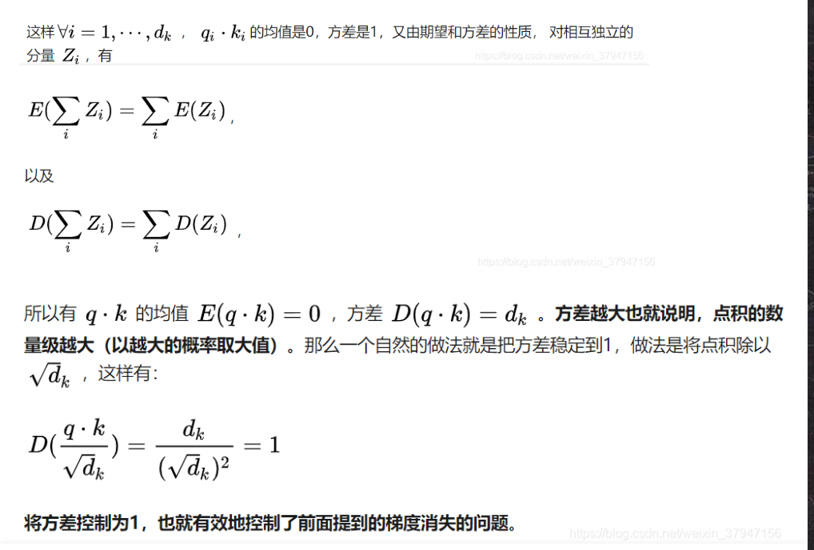
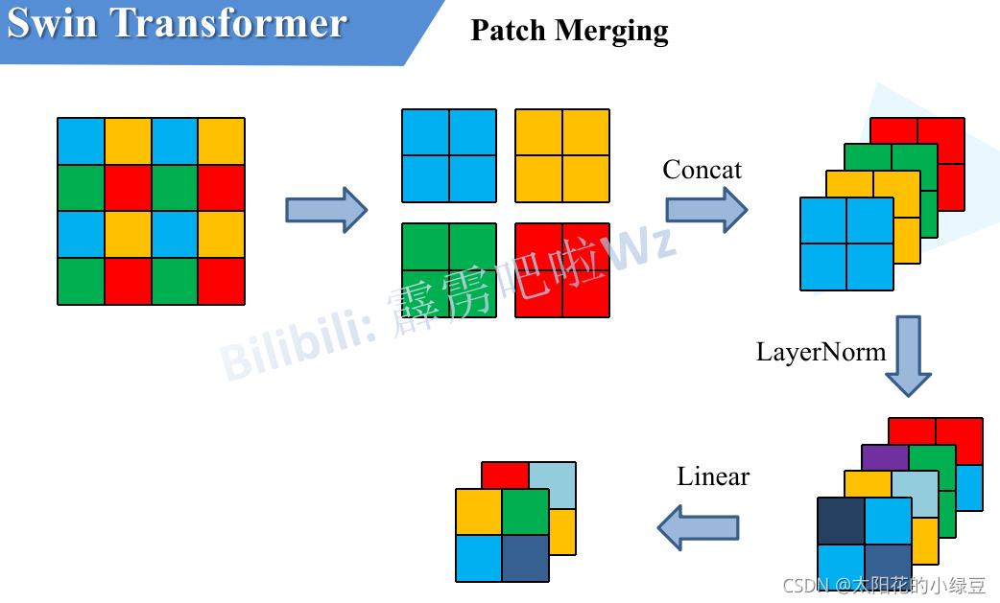
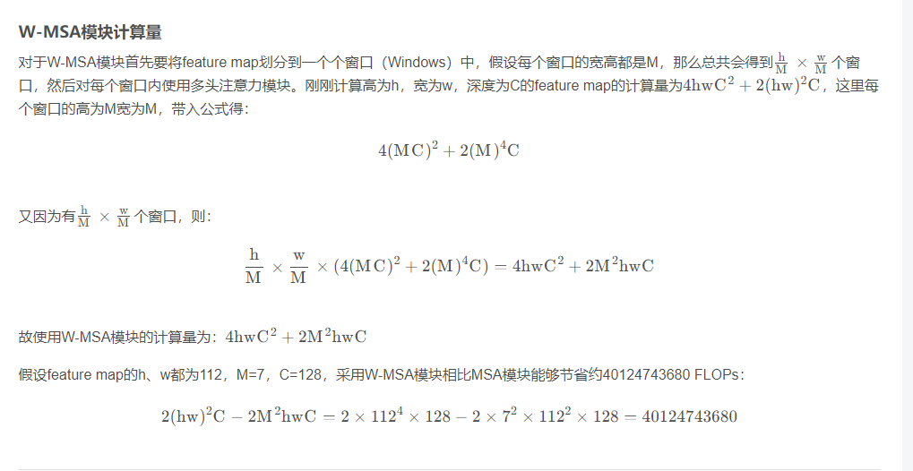
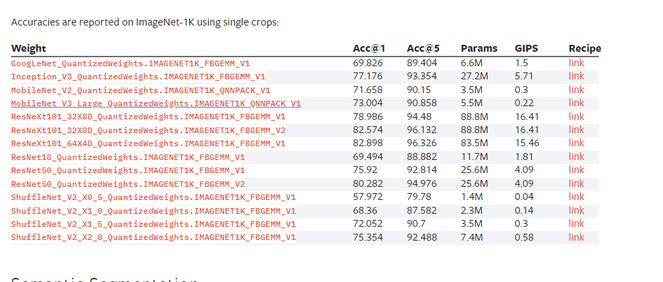
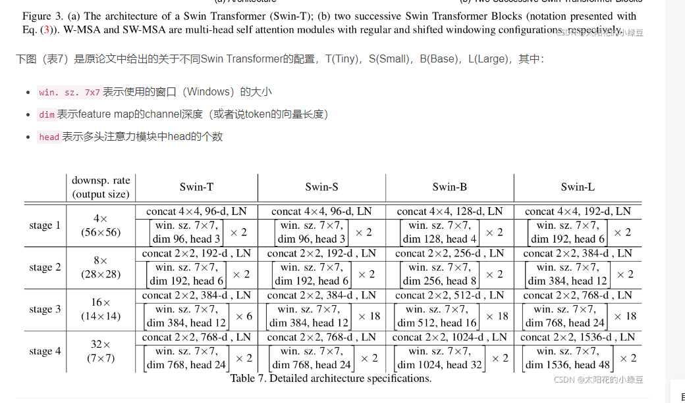

# transformer  
怎么手写代码公式？？？？       

  2017  
  
  Transformer的知名应用——BERT——无监督的训练的Transformer  

  ChatGPT, Chat Generative Pre-training Transformer  

      
  
 
## Transformer 整体结构
  
  下图是 Transformer 用于中英文翻译的整体结构  

    

  Encoder 和 Decoder 都包含 6 个 block
## Transformer 的工作流程
  
  第一步：获取输入句子的每一个单词的表示向量 X，X由单词的 Embedding（Embedding就是从原始数据提取出来的Feature） 和单词位置的 Embedding 相加得到  

  

  第二步：将得到的单词表示向量矩阵 (如上图所示，每一行是一个单词的表示 x) 传入 Encoder 中，经过 6 个 Encoder block 后可以得到句子所有单词的编码信息矩阵 C，如下图。单词向量矩阵用??表示， n 是句子中单词个数，d 是表示向量的维度 (论文中 d=512)。每一个 Encoder block 输出的矩阵维度与输入完全一致。  

  

  第三步：将 Encoder 输出的编码信息矩阵 C传递到 Decoder 中，Decoder 依次会根据当前翻译过的单词 1~ i 翻译下一个单词 i+1，如下图所示。在使用的过程中，翻译到单词 i+1 的时候需要通过 Mask (掩盖) 操作遮盖住 i+1 之后的单词  

    

  Decoder 接收了 Encoder 的编码矩阵 C，然后首先输入一个翻译开始符 "<Begin>"，预测第一个单词 "I"；然后输入翻译开始符 "<Begin>" 和单词 "I"，预测单词 "have"，以此类推。
## Transformer 的输入
  
### 单词 Embedding
  单词的 Embedding 有很多种方式可以获取，例如可以采用 Word2Vec、Glove 等算法预训练得到，也可以在 Transformer 中训练得到。
### 位置 Embedding  
  
  Transformer  中除了单词的 Embedding，还需要使用位置 Embedding 表示单词出现在句子中的位置。**因为 Transformer 不采用 RNN 的结构，而是使用全局信息，不能利用单词的顺序信息**，而这部分信息对于 NLP 来说非常重要。所以 Transformer 中使用位置 Embedding 保存**单词在序列中的相对或绝对位置**。

  PE 可以通过训练得到，也可以使用某种公式计算得到。在 Transformer 中采用了后者，计算公式如下：  

    

  其中，pos 表示单词在句子中的位置，d 表示 PE的维度 (与词 Embedding 一样)，2i 表示偶数的维度，2i+1 表示奇数维度 (即 2i≤d, 2i+1≤d)。使用这种公式计算 PE 有以下的好处：
  - 使 PE 能够**适应比训练集里面所有句子更长的句子**，假设训练集里面最长的句子是有 20 个单词，突然来了一个长度为 21 的句子，则使用公式计算的方法可以计算出第 21 位的 Embedding。
  - 可以让模型**容易地计算出相对位置**，对于固定长度的间距 k，PE(pos+k) 可以用 PE(pos) 计算得到。因为 Sin(A+B) = Sin(A)Cos(B) + Cos(A)Sin(B), Cos(A+B) = Cos(A)Cos(B) - Sin(A)Sin(B)。  

  将单词的词 Embedding 和位置 Embedding 相加，就可以得到单词的表示向量 x，x 就是 Transformer 的输入。

## Self-Attention（自注意力机制）
  
  论文中 Transformer 的内部结构图，左侧为 Encoder block，右侧为 Decoder block。红色圈中的部分为 Multi-Head Attention，是由多个 Self-Attention组成的，可以看到 Encoder block 包含一个 Multi-Head Attention，而 Decoder block 包含两个 Multi-Head Attention (其中有一个用到 Masked)。Multi-Head Attention 上方还包括一个 Add & Norm 层，Add 表示残差连接 (Residual Connection) 用于防止网络退化，Norm 表示 Layer Normalization，用于对每一层的激活值进行归一化。  

  block  

  

### Self-Attention 结构  
  

    

  在计算的时候需要用到矩阵Q(查询),K(键值),V(值)。在实际中，Self-Attention 接收的是输入(单词的表示向量x组成的矩阵X) 或者上一个 Encoder block 的输出。而**Q,K,V正是通过 Self-Attention 的输入进行线性变换得到的**，如下

### Q, K, V 的计算
  
  **Self-Attention 的输入**用矩阵X进行表示，则可以**使用线性变阵矩阵WQ,WK,WV计算得到Q,K,V**。计算如下图所示，注意 X, Q, K, V 的每一行都表示一个单词。  
  

### Self-Attention 的输出
  
  得到矩阵 Q, K, V之后就可以计算出 Self-Attention 的输出了，***计算公式***如下：  
      
  对于较大的dk
来说在完成qkt
后将会得到很大的值，而这将导致在经过sofrmax操作后产生非常小的梯度，不利于网络的训练。  

  公式中计算矩阵Q和K每一行向量的内积  
  Q乘以K的转置后，得到的矩阵行列数都为 n，n 为句子单词数，这个矩阵可以表示单词之间的 attention 强度。下图为Q乘以 KT
 ，1234 表示的是句子中的单词。  
   
 得到之后，使用 Softmax 计算每一个单词对于其他单词的 attention 系数，公式中的 Softmax 是对矩阵的每一行进行 Softmax，即每一行的和都变为 1.   

   

 （Logit：通常用sigmoid函数表示，例如sigmoid(x) = 1 / (1 + exp(-x))。  

Softmax：Softmax函数的公式是exp(xi) / Σ(exp(xj))，其中xi是输入向量中的元素，Σ表示对所有元素求和。  

在深度学习中，通常是通过计算logit，然后通过Softmax函数将logit转换为概率分布，以用于多分类问题。）  

得到 Softmax 矩阵之后可以和V相乘，得到最终的输出Z。  
  

上图中 Softmax 矩阵的第 1 行表示单词 1 与其他所有单词的 attention 系数，最终单词 1 的输出 
 等于所有单词 i 的值 
 根据 attention 系数的比例加在一起得到，如下图所示：  

## Multi-Head Attention  
  
    
  首先将输入X分别传递到 h 个不同的 Self-Attention 中，计算得到 h 个输出矩阵Z  
    
  得到 8 个输出矩阵 
 到 
 之后，Multi-Head Attention 将它们拼接在一起 (Concat)，然后传入一个Linear层，得到 Multi-Head Attention 最终的输出Z  
 Multi-Head Attention 输出的矩阵Z与其输入的矩阵X的维度是一样的  

## Encoder 结构
  

### Add & Norm

  Add指 X+MultiHeadAttention(X)，是一种残差连接，通常用于解决多层网络训练的问题，可以让网络**只关注当前差异的部分**，在 ResNet 中经常用到  
  Norm指 Layer Normalization，通常用于 RNN 结构，Layer Normalization 会将每一层神经元的输入都转成均值方差都一样的，这样可以加快收敛。
### Feed Forward
  
  Feed Forward 层比较简单，是一个`两层的全连接层，第一层的激活函数为 Relu，第二层不使用激活函数`，对应的公式如下  
    
  X是输入，Feed Forward 最终得到的输出矩阵的维度与X一致。  

  - 激活函数  

    
  如果不用激活函数，在这种情况下每一层输出都是上层输入的线性函数。容易验证，无论神经网络有多少层，输出都是输入的线性组合，与没有隐藏层效果相当，这种情况就是最原始的感知机（Perceptron）了。  
  （不再是输入的线性组合，可以逼近任意函数）。最早的想法是sigmoid函数或者tanh函数，输出有界，很容易充当下一层输入。  
  
  引入ReLu的原因

第一，**计算量**。采用sigmoid等函数，算激活函数时（指数运算），计算量大，反向传播求误差梯度时，求导涉及除法，计算量相对大，而采用Relu激活函数，整个过程的计算量节省很多。

第二，***梯度消失**。对于深层网络，sigmoid函数反向传播时，很容易就会出现 梯度消失 的情况（在sigmoid接近**饱和区时，变换太缓慢，导数趋于0**，这种情况会造成信息丢失），从而无法完成深层网络的训练。

第三，**稀疏性**。ReLu会使一部分神经元的输出为0，这样就造成了 网络的稀疏性，并且减少了参数的相互依存关系，缓解了**过拟合**问题的发生。

## Decoder 结构

  与 Encoder block 相似，但是存在一些区别：

- 包含两个 Multi-Head Attention 层。
- 第一个 Multi-Head Attention 层采用了 Masked 操作。
- 第二个 Multi-Head Attention 层的**K, V**矩阵使用 Encoder 的**编码信息矩阵C**进行计算，而**Q**使用上一个 **Decoder block 的输出**计算。
- 最后有一个 Softmax 层计算下一个翻译单词的概率。

`在unet交叉注意力层也是如此，kv来自condition, q来自上一个block`

###  第一个 Multi-Head Attention
  
  首先根据输入 "'<Begin'>" 预测出第一个单词为 "I"，然后根据输入 "'<Begin'> I" 预测下一个单词 "have"。  
    

  Decoder 可以在训练的过程中使用 Teacher Forcing 并且**并行化训练**，即将正确的单词序列 ('<Begin'> I have a cat) 和对应输出 (I have a cat '<end'>) 传递到 Decoder。  
  那么在预测第 i 个输出时，就要将第 i+1 之后的单词掩盖住，注意 **Mask 操作是在 Self-Attention 的 Softmax 之前使用**的，下面用 0 1 2 3 4 5 分别表示 "'<Begin'> I have a cat '<end'>"。  
    

  - 第一步：是 Decoder 的输入矩阵和 Mask 矩阵，输入矩阵包含 "'<Begin'> I have a cat" (0, 1, 2, 3, 4) 五个单词的表示向量，Mask 是一个 5×5 的矩阵。在 Mask 可以发现单词 0 只能使用单词 0 的信息，而单词 1 可以使用单词 0, 1 的信息，即只能使用之前的信息。  
    

  - 第二步：接下来的操作和之前的 Self-Attention 一样，通过输入矩阵X计算得到Q,K,V矩阵。然后计算Q和 KT
 的乘积 
 。  
 
 - 第三步：得到 Mask QKT
 之后在 Mask QKT
上进行 Softmax，每一行的和都为 1。但是单词 0 在单词 1, 2, 3, 4 上的 attention score 都为 0。  
  
- 第四步：使用 Mask QKT
与矩阵 V相乘，得到输出 Z，则单词 1 的输出向量 Z1
 是只包含单词 1 信息的。  
 

- 第五步：通过上述步骤就可以得到一个 Mask Self-Attention 的输出矩阵 
 ，然后和 Encoder 类似，通过 Multi-Head Attention 拼接多个输出
 然后计算得到第一个 Multi-Head Attention 的输出Z，Z与输入X维度一样。

### 第二个 Multi-Head Attention
  
  根据 Encoder 的输出 C计算得到 K, V，根据上一个 Decoder block 的输出 Z 计算 Q (如果是第一个 Decoder block 则使用输入矩阵 X 进行计算)  
  这样做的好处是在 Decoder 的时候，每一位单词都可以利用到 Encoder 所有单词的信息 (这些信息无需 Mask)。??

### Softmax 预测输出单词
  
  Decoder block 最后的部分是利用 Softmax 预测下一个单词，在之前的网络层我们可以得到一个最终的输出 Z，因为 Mask 的存在，使得单词 0 的输出 Z0 只包含单词 0 的信息，如下：  
    
    
  Softmax 根据输出矩阵的每一行预测下一个单词    
  与 Encoder 一样，Decoder 是由多个 Decoder block 组合而成

## Transformer 总结
  
  - Transformer 与 RNN 不同，可以比较好地并行训练。
- Transformer 本身是不能利用单词的顺序信息的，因此需要在输入中添加位置 Embedding，否则 Transformer 就是一个词袋模型了。
- Transformer 的重点是 Self-Attention 结构，其中用到的 Q, K, V矩阵通过输出进行线性变换得到。
- Transformer 中 Multi-Head Attention 中有多个 Self-Attention，可以捕获单词之间多种维度上的相关系数 attention score。  
    
  
  

## 运行逻辑
  
  - 训练时：第i个decoder的输入 = encoder输出 + ground truth embeding
  - 预测时：第i个decoder的输入 = encoder输出 + 第(i-1)个decoder输出

  训练时因为知道ground truth embeding，相当于知道正确答案，网络可以一次训练完成。  
  
预测时，首先输入start，输出预测的第一个单词 然后start和新单词组成新的query，再输入decoder来预测下一个单词，循环往复 直至end

## QA
### 1.为什么要shifted right
整体右移一位  
Shifted Right 实质上是给输出添加起始符/结束符，方便预测第一个Token/结束预测过程。   
### 2.多头注意力，本质就是拆开自注意力要计算的张量去分开计算，然后算qk分数和qkv最后分数，有什么用？
多头注意力例子  

residual,残差2  
  不做prepare-attn-mask      
  toq,tok,tov   
  8个头，to_qkv后做head_to_batch_dim：Reshape the tensor from `[batch_size, seq_len, dim]` to `[batch_size, seq_len, heads, dim // heads]` `heads` is
        the number of heads initialized while constructing the `Attention` class.    
  If output_dim=`3`, the tensor is
                reshaped to `[batch_size * heads, seq_len, dim // heads]`.  
  view(batch_size * num_heads, -1, dim_per_head)   
  torch.Size([4, 4096, 320])变torch.Size([32, 4096, 40])   
  计算score : torch.Size([32, 4096, 4096])。`多个头确实score第一维度更多八倍`   
  计算qkv结果，即selfattn结果torch.Size([32, 4096, 40])`qkv结果数量一样`  
  batch_to_head_dim ：torch.Size([4, 4096, 320])  
  linear,drop(0)  
  加残差2    

表达能力： 多头注意力使得模型可以学习多个不同的关注点或表示空间。每个注意力头都可以专注于学习数据中的不同关系或特征，从而提高模型对复杂关系的建模能力  
降低过拟合： 多头注意力可以被视为一种正则化机制，因为它允许模型通过关注不同的信息源来减轻过拟合的风险。每个头都相当于模型中的一个子模型，可以减小过拟合的可能性。  

论文作者提出用于克服「模型在对当前位置的信息进行编码时，会过度的将注意力集中于自身的位置」的问题。   
原论文中说的是，将模型分为多个头，形成多个子空间，可以让模型去关注不同方面的信息   

### 为什么要 scale √d

transformer中的attention为什么scaled?

《Attention Is All You Need》中解释是：向量的点积结果会很大，将softmax函数push到梯度很小的区域，scaled会缓解这种现象。怎么理解将sotfmax函数push到梯度很小区域？还有为什么scaled是维度的根号，不是其他的数？

得到一个dv维的向量。其中因子 √d 起到调节作用，使得内积不至于太大（太大的话softmax后就非0即1了，不够“soft”了）

2. 维度与点积大小的关系是怎么样的，为什么使用维度的根号来放缩？
针对为什么维度会影响点积的大小，在论文的脚注中其实给出了一点解释：

### 为什么 transformer 比 cnn 效果好
1.更好的长距离依赖性建模：传统的CNN模型在处理长距离依赖性问题时会存在一定的问题，因为它们只能通过局部窗口来处理输入数据。 而Transformer模型则通过自注意力机制（self-attention）来**捕捉长距离依赖性**，因此在处理序列数据时表现更好。

一、CNN与Transformer对比总结

1. 全局上下文捕获能力

2. 并行化处理

3. 更少的归纳偏置

4. 适应性更强的特征提取

5. 在自然语言处理中的优势

6. 在多模态任务中的应用

1. 全局上下文捕获能力
Transformer：Transformer通过自注意力机制（Self-Attention）能够捕获输入序列中所有位置之间的依赖关系。这意味着无论两个元素在序列中的距离多远，Transformer都可以直接计算它们之间的关系，从而更好地理解全局上下文。
CNN：卷积神经网络通过卷积核进行局部感知，虽然可以通过增加层数和使用更大的卷积核扩展感受野，但仍然倾向于局部特征提取，较难直接捕获远距离的全局上下文信息。

2. 并行化处理
Transformer：由于Transformer的自注意力机制可以并行处理输入序列中的所有元素，它们在训练和推理过程中可以更高效地利用GPU和TPU等硬件资源。这种并行化能力使得Transformer在处理长序列时特别高效。
CNN：卷积操作本身可以并行化，但CNN在处理序列数据时需要逐层进行计算，某些情况下可能不如Transformer的并行效率高。

3. 更少的归纳偏置
Transformer：由于Transformer依赖于自注意力机制而非卷积操作，它对输入数据的结构假设较少。这种灵活性使Transformer能够更广泛地适应各种类型的数据，包括文本、图像和时间序列等。
CNN：CNN利用卷积核的局部感知和权重共享特性，对图像等有空间局部相关性的任务表现很好，但这种归纳偏置在处理其他类型数据时可能不如Transformer灵活。

## 多头注意力代码实现

class MultiHeadAttention(nn.Module):

    def __init__(self, d_model, n_head):
        super(MultiHeadAttention, self).__init__()
        self.n_head = n_head
        self.attention = ScaleDotProductAttention()
        self.w_q = nn.Linear(d_model, d_model)
        self.w_k = nn.Linear(d_model, d_model)
        self.w_v = nn.Linear(d_model, d_model)
        self.w_concat = nn.Linear(d_model, d_model)

    def forward(self, q, k, v, mask=None):
        # 1. dot product with weight matrices
        q, k, v = self.w_q(q), self.w_k(k), self.w_v(v)      # [N, seq_len, d_model]

        # 2. split tensor by number of heads
        q, k, v = self.split(q), self.split(k), self.split(v)   # [N, head, seq_len, d_model]

        # 3. do scale dot product to compute similarity
        out, attention = self.attention(q, k, v, mask=mask)     # out:[N, head, seq_len, d_model]

        # 4. concat and pass to linear layer
        out = self.concat(out)          # [N, seq_len, d_model]
        out = self.w_concat(out)

        # 5. visualize attention map
        # TODO : we should implement visualization

        return out

    def split(self, tensor):
        """
        split tensor by number of head

        :param tensor: [batch_size, length, d_model]
        :return: [batch_size, head, length, d_tensor]
        """
        batch_size, length, d_model = tensor.size()

        d_tensor = d_model // self.n_head
        tensor = tensor.view(batch_size, length, self.n_head, d_tensor).transpose(1, 2)
        # it is similar with group convolution (split by number of heads)

        return tensor

    def concat(self, tensor):
        """
        inverse function of self.split(tensor : torch.Tensor)

        :param tensor: [batch_size, head, length, d_tensor]
        :return: [batch_size, length, d_model]
        """
        batch_size, head, length, d_tensor = tensor.size()
        d_model = head * d_tensor

        tensor = tensor.transpose(1, 2).contiguous().view(batch_size, length, d_model)
        return tensor

### 注意力

class ScaleDotProductAttention(nn.Module):
    """
    compute scale dot product attention

    Query : given sentence that we focused on (decoder)
    Key : every sentence to check relationship with Qeury(encoder)
    Value : every sentence same with Key (encoder)
    """

    def __init__(self):
        super(ScaleDotProductAttention, self).__init__()
        self.softmax = nn.Softmax(dim=-1)

    def forward(self, q, k, v, mask=None, e=1e-12):
        # input is 4 dimension tensor
        # [batch_size, head, length, d_tensor]
        batch_size, head, length, d_tensor = k.size()

        # 1. dot product Query with Key^T to compute similarity
        k_t = k.transpose(2, 3)  # transpose
        score = (q @ k_t) / math.sqrt(d_tensor)  # scaled dot product

        # 2. apply masking (opt)
        if mask is not None:
            score = score.masked_fill(mask == 0, -10000)

        # 3. pass them softmax to make [0, 1] range
        score = self.softmax(score)

        # 4. multiply with Value
        v = score @ v

        return v, score

# swin transformer

1 网络整体框架
2 Patch Merging详解
3 W-MSA详解
MSA模块计算量
W-MSA模块计算量
4 SW-MSA详解
5 Relative Position Bias详解

Swin Transformer是2021年微软研究院发表在ICCV上的一篇文章，并且已经获得ICCV 2021 best paper的荣誉称号。Swin Transformer网络是Transformer模型在视觉领域的又一次碰撞。该论文一经发表就已在多项视觉任务中霸榜。该论文是在2021年3月发表的，现在是2021年11月了，根据官方提供的信息可以看到，现在还在COCO数据集的目标检测以及实例分割任务中是第一名（见下图State of the Art表示第一）。

在正文开始之前，先来简单对比下Swin Transformer和之前的Vision Transformer（如果不了解Vision Transformer的建议先去看下我之前的文章）。下图是Swin Transformer文章中给出的图1，左边是本文要讲的Swin Transformer，右边边是之前讲的Vision Transformer。通过对比至少可以看出两点不同：

比如特征图尺寸中有对图像下采样4倍的，8倍的以及16倍的，这样的backbone有助于在此基础上构建目标检测，实例分割等任务。而在之前的Vision Transformer中是一开始就直接下采样16倍，后面的特征图也是维持这个下采样率不变。

在Swin Transformer中使用了**Windows Multi-Head Self-Attention(W-MSA)**的概念，比如在下图的4倍下采样和8倍下采样中，将特征图划分成了多个不相交的区域（Window），并且**Multi-Head Self-Attention只在每个窗口（Window）内进行**。相对于Vision Transformer中直接对整个（Global）特征图进行Multi-Head Self-Attention，这样做的**目的是能够减少计算量的，尤其是在浅层特征图很大的时候**。这样做虽然减少了计算量但也会隔绝不同窗口之间的信息传递，所以在论文中作者又提出了 **Shifted Windows Multi-Head Self-Attention(SW-MSA)的概念，通过此方法能够让信息在相邻的窗口中进行传递**，后面会细讲。

接下来，简单看下原论文中给出的关于Swin Transformer（Swin-T）网络的架构图。通过图(a)可以看出整个框架的基本流程如下：

首先将图片输入到Patch Partition模块中进行分块，即每4x4相邻的像素为一个Patch，然后在channel方向展平（flatten）。假设输入的是RGB三通道图片，那么每个patch就有4x4=16个像素，然后每个像素有R、G、B三个值所以展平后是16x3=48，所以通过Patch Partition后图像shape由 [H, W, 3]变成了 [H/4, W/4, 48]。然后在通过Linear Embeding层对每个像素的channel数据做线性变换，由48变成C，即图像shape再由 [H/4, W/4, 48]变成了 [H/4, W/4, C]。其实在源码中Patch Partition和Linear Embeding就是直接通过一个卷积层实现的，和之前Vision Transformer中讲的 Embedding层结构一模一样。

然后就是通过四个Stage构建不同大小的特征图，除了Stage1中先通过一个Linear Embeding层外，剩下三个stage都是先通过一个Patch Merging层进行下采样（后面会细讲）。

然后都是重复堆叠Swin Transformer Block注意这里的Block其实有两种结构，如图(b)中所示，这两种结构的不同之处仅在于一个使用了W-MSA结构，一个使用了SW-MSA结构。而且这两个结构是成对使用的，先使用一个W-MSA结构再使用一个SW-MSA结构。所以你会发现堆叠Swin Transformer Block的次数都是偶数（因为成对使用）。

最后对于分类网络，后面还会接上一个Layer Norm层、全局池化层以及全连接层得到最终输出。图中没有画，但源码中是这样做的。

接下来，在分别对Patch Merging、W-MSA、SW-MSA以及使用到的相对位置偏执（relative position bias）进行详解。关于Swin Transformer Block中的MLP结构和Vision Transformer中的结构是一样的，所以这里也不在赘述

## Patch Merging详解
前面有说，在每个Stage中首先要通过一个Patch Merging层进行下采样（Stage1除外）。如下图所示，假设输入Patch Merging的是一个4x4大小的单通道特征图（feature map），Patch Merging会将每个2x2的相邻像素划分为一个patch，然后将每个patch中相同位置（同一颜色）像素给拼在一起就得到了4个feature map。接着将这四个feature map在深度方向进行concat拼接，然后在通过一个LayerNorm层。

最后通过一个全连接层在feature map的深度方向做线性变化，将feature map的深度由C变成C/2。通过这个简单的例子可以看出，通过Patch Merging层后，feature map的高和宽会减半，深度会翻倍。

引入Windows Multi-head Self-Attention（W-MSA）模块是为了减少计算量。如下图所示，左侧使用的是普通的Multi-head Self-Attention（MSA）模块，对于feature map中的每个像素（或称作token，patch）在Self-Attention计算过程中需要和所有的像素去计算。但在图右侧，在使用Windows Multi-head Self-Attention（W-MSA）模块时，首先将feature map按照MxM（例子中的M=2）大小划分成一个个Windows，然后单独对每个Windows内部进行Self-Attention。

两者的计算量具体差多少呢？原论文中有给出下面两个公式，这里忽略了Softmax的计算复杂度。：

一个 attention 节省 40b flops

Swin Transformer解读— 深入浅出PyTorch
GitHub Pages
https://datawhalechina.github.io › 第十章 › Swin-Transf...
它基于了ViT模型的思想，创新性的引入了滑动窗口机制，让模型能够学习到跨窗口的信息，同时也。同时通过下采样层，使得模型能够处理超分辨率的图片，节省计算量以及能够关注全局 ...

FLOPS （全部大写）是floating-point operations per second的缩写，意指每秒浮点运算次数。用来衡量硬件的性能。

FLOPs 是floating point of operations的缩写，是浮点运算次数，可以用来衡量算法/模型复杂度。
常用当然还有GFLOPs和TFLOPs
GFLOPS 就是 Giga Floating-point Operations Per Second,即每秒10亿次的浮点运算数,常作为GPU性能参数但不一定代表GPU的实际表现，因为还要考虑具体如何拆分多边形和像素、以及纹理填充，理论上该数值越高越好。1GFlops = 1,000MFlops。

所以 vit_B 仅仅 20 GFLOPS ??

convnext t 4 GFLOPS 

作者引入了Shifted Windows Multi-Head Self-Attention（SW-MSA）模块，即进行偏移的W-MSA。如下图所示，左侧使用的是刚刚讲的W-MSA（假设是第L层），那么根据之前介绍的W-MSA和SW-MSA是成对使用的，那么第L+1层使用的就是SW-MSA（右侧图）。根据左右两幅图对比能够发现窗口（Windows）发生了偏移（可以理解成窗口从左上角分别向右侧和下方各偏移了 M/2 个像素）。看下偏移后的窗口（右侧图），比如对于第一行第2列的2x4的窗口，它能够使第L层的第一排的两个窗口信息进行交流。再比如，第二行第二列的4x4的窗口，他能够使第L层的四个窗口信息进行交流，其他的同理。那么这就解决了不同窗口之间无法进行信息交流的问题。

根据上图，可以发现通过将窗口进行偏移后，由原来的4个窗口变成9个窗口了。后面又要对每个窗口内部进行MSA，这样做感觉又变麻烦了。为了解决这个麻烦，作者又提出而了Efficient batch computation for shifted configuration，一种更加高效的计算方法。下面是原论文给的示意图。

然后先将区域A和C移到最下方。

接着，再将区域A和B移至最右侧。

移动完后，4是一个单独的窗口；将5和3合并成一个窗口；7和1合并成一个窗口；8、6、2和0合并成一个窗口。这样又和原来一样是4个4x4的窗口了，所以能够保证计算量是一样的。这里肯定有人会想，把不同的区域合并在一起（比如5和3）进行MSA，这信息不就乱窜了吗？是的，为了防止这个问题，在实际计算中使用的是masked MSA即带蒙板mask的MSA，这样就能够通过设置蒙板来隔绝不同区域的信息了。关于mask如何使用，可以看下下面这幅图，下图是以上面的区域5和区域3为例。

所以这样移动做 mask， 不同块儿的，相当于没做，没有信息交互    
只是为了简单复用 w msa 结构计算，加上mask而已，为了好拼接一起计算        

rope 是直接加载 q k        

前言 旋转位置编码（Rotary Position Embedding，RoPE）是论文 Roformer: Enhanced Transformer With Rotray Position Embedding 提出的一种能够将相对位置信息依赖集成到 self-attention 中并提升 transformer 架构性能的位置编码方式。而目前很火的 LLaMA、GLM 模型也是采用该位置编码方式。和相对位置编码相比，RoPE 具有更好的外推性，目前是大模型相对位置编码中应用最广的方式之一。

好像是那个时候还没有 rope 也不火     

[Submitted on 20 Apr 2021 (v1), last revised 8 Nov 2023 (this version, v5)]
RoFormer: Enhanced Transformer with Rotary Position Embedding

由于论文中并没有详解讲解这个相对位置偏执，所以我自己根据阅读源码做了简单的总结。如下图，假设输入的feature map高宽都为2，那么首先我们可以构建出每个像素的绝对位置（左下方的矩阵），对于每个像素的绝对位置是使用行号和列号表示的。比如蓝色的像素对应的是第0行第0列所以绝对位置索引是( 0 , 0 ) (0,0)(0,0)，接下来再看看相对位置索引。首先看下蓝色的像素，在蓝色像素使用q与所有像素k进行匹配过程中，是以蓝色像素为参考点。然后用蓝色像素的绝对位置索引与其他位置索引进行相减，就得到其他位置相对蓝色像素的相对位置索引。例如黄色像素的绝对位置索引是( 0 , 1 ) (0,1)(0,1)，则它相对蓝色像素的相对位置索引为( 0 , 0 ) − ( 0 , 1 ) = ( 0 , − 1 ) (0, 0) - (0, 1)=(0, -1)(0,0)−(0,1)=(0,−1)，这里是严格按照源码中来讲的，请不要杠。那么同理可以得到其他位置相对蓝色像素的相对位置索引矩阵。同样，也能得到相对黄色，红色以及绿色像素的相对位置索引矩阵。接下来将每个相对位置索引矩阵按行展平，并拼接在一起可以得到下面的4x4矩阵 。

[Submitted on 25 Mar 2021 (v1), last revised 17 Aug 2021 (this version, v2)]
Swin Transformer: Hierarchical Vision Transformer using Shifted Windows

# end
