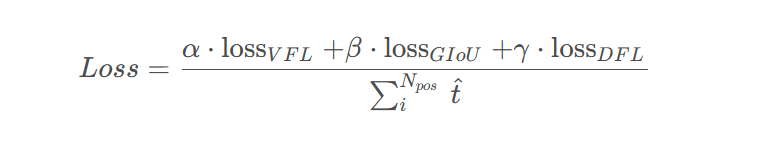

# PP-YOLOE  
PP-YOLOE-l 在COCO数据集上达到了51.4mAP。相比较PP-YOLOv2提升1.9AP和13.35%的速度，相比较YOLOX提升1.3AP和24.96%的速度。   
而PP-YOLOE中主要的改进点是：anchor-free，powerful backbone and neck，TAL动态label assign，ET-head。   
   
2.1 锚框机制    
Anchor-free（Anchor-base模型引入超参数，依赖手工设计，对不同的数据集需要单独聚类），在每个像素上放置一个锚点，为三个检测头设置GT尺寸的上届和下界。计算GT的中心，选择最近的锚点做正样本。Anchor-free方式使mAP比Anchor-base下降0.3，但是速度有所提升，具体如下表所示。  
2.2 标签分配   
使用TOOD中的TAL(Task Aligned Learing),显性的对齐分类最优点和位置回归最优点。注TOOD论文中，提出任务对齐头部（T-Head）和任务对齐学习（TAL）。T-head在学习任务交互特征和任务特定特征之间提供了更好的平衡，并通过任务对齐预测器学习对齐的灵活性提高,TAL通过设计的样本分配方案和任务对齐损失，明确地拉近（甚至统一）两个任务的最优锚点 TAL包含任务对齐指标、正样本选择标准，并将任务对齐指标与原先的的分类损失、回归损失进行联立[其本质就是根据任务对齐指标调节不同样本在反向传播时loss的权重,具体可以参考https://hpg123.blog.csdn.net/article/details/128725465]。PP-YOLOE其实也尝试过多种标签对齐方式，具体如下所示，可见TAL效果是最佳的。   
       
2.3 loss设计   
对于分类和定位任务，分别选择了varifocal loss（VFL）和distribution focal loss（DFL）。PP-Picodet成功将VFL和DFL语义到目标检测中。VFL与quality focal(QFL)不同，VFL使用目标评分来衡量正样本loss的权重（可提升正样本loss的贡献，使模型更多关注高质量正样本，解决了NMS过程中classification score 和 IoU/centerness score 训练测试不一致【训练时两个孤立，nms时两个联立】），两者都使用带有IOU感知的分类评分作为预测目标。整体loss设计如下所示，其中$ \hat{t} $ 表示标准化的目标分数，使用ET-head提升了0.5的map   
     
DFL（distribution focal loss）：为了解决bbox不灵活的问题，提出使用distribution[将迪克拉分布转化为一般分布]预测bbox[预测top、left、right、bottom]。     
   

PP-YOLOE 还避免使用诸如可变形卷积或者 Matrix NMS 之类的特殊算子，使 PP-YOLOE 全系列模型能轻松地部署在 NVIDIA V100 和 T4 这样的云端 GPU 架构、Jetson 系列的移动端 GPU 和高性能的 FPGA 开发板上。   
具体的结构包括以下三大部分：   
■ 可扩展的 backbone 和 neck   
我们设计了 CSPRepResNet 作为 backbone，neck 部分也采用了新设计的 CSPPAN 结构，backbone 和 neck 均以我们提出的 CSPRepResStage 为基础模块。新的 backbone 和 neck 在增强模型表征能力的同时提升了模型的推理速度，并且可以通过 width multiplier 和 depth multiplier 灵活地配置模型的大小。   
■ TAL（Task Alignment Learning）   
为了进一步提升模型的精度，我们选用了 TOOD [1]中的动态匹配算法策略 TAL。TAL 同时考虑分类和回归，使得匹配结果同时获得了最优的分类和定位精度。   
■ Efficient Task-aligned head   
检测 head 方面，我们在 TOOD 的 T-head 基础上进行改进。  
首先，使用 ESE block 替换掉了原文中比较耗时的 layer attention，使得模型在保证精度不变的同时提升了速度。   
其次，由于 T-head 使用了可变形卷积算子，对硬件部署不友好，我们在分类分支使用 shortcut 替换 cls-align 模块，回归分支使用积分层替换掉含有可变形卷积的 reg-align 模块，以上两个改进使得 head 变得更为高效、简洁且易部署。   
最终，我们进一步使用 VFL（VariFocal Loss）替换 BCE 作为分类分支 Loss，达到了速度精度双高的目的。   

## PPYOLOE+   
PPYOLOE+表示在object365中进行了预训练（其模型结构配置文件与PPYOLOE一模一样，只是在backbone中block分支中增加alpha参数）的PPYOLOE模型。两个模型在ATSSAssigner与TaskAlignedAssigner的epoch数上存在不同，ppyoloe的static_assigner_epoch为100，ppyoloe+的为30【经过预训练后ppyoloe+对ATSSAssigner的依赖降低】.

# yolov5_based_on_transformer

# HRNet
首先采用高分辨率的子网络作为第一阶段；然后逐渐添加高分辨率到低分辨率的子网络，得到多个阶段的输出；最后，并行的连接多分辨率子网络的输出. 其进行了多次多尺度融合，因此，使得每一个高分辨率到低分辨率的特征图表示，都可以一次又一次地从其它并行表示分支接收信息，从而得到信息更丰富的高分辨率表示. 最终，网络输出的关键点heatmap 更精确，空间分辨率精度更高；    

# BoT-SORT

